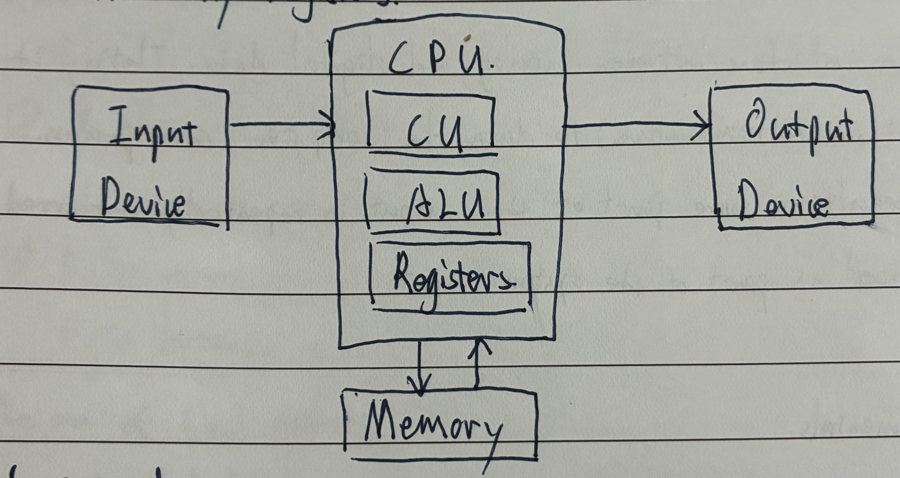
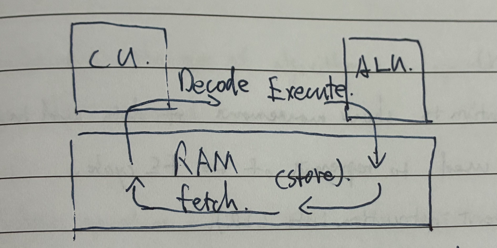

# Chapter 3 and 4 - Hardware and Processor Fundamentals

## Hardware Devices

ROM - Read Only Memory, primary memory unit that can only be read from.

EPROM - Erasable Programmable ROM, type of ROM that can be programmed **more than once** using **Ultraviolet (UV) light**.

EEPROM - Electronically EPROM, a ROM chip that can be modified by the user, which can then be **erased and written to repeatedly** using **pulsed voltages**.

RAM - Random Access Memory, primary memory unit that can be written to and read from.

DRAM - Dynamic RAM, the type of RAM chip that **needs to be constantly refreshed**.

SRAM - Static RAM, the type of RAM chip uses **flip-flops** and **does not need refreshing**.

SSD - Solid State Drive, storage media with no moving parts that relies on the movement of electrons.

HDD - Hard Disk Drive, type of magnetic storage device that uses spinning disks.

Embedded systems - the systems run on the **specific hardware platform** that perform a **dedicated work**.

Monitoring System - A system has **no effect** on what is being monitored.

A Control System - the output from the system **affects** the next set of inputs from the sensors.

---

The 4 functions of a computer system:

- Input
- Output
- Process
- Storage

The 5 categories of computer hardware:

- I/O devices
- primary and secondary memory
- processing devices

---

Embedded system可以被粗略地分类成以下两种：

- monitoring system
- control system

Monitoring system only uses sensors to detect the physical changes in the environment, and does not have actuators that can influence the environment.

Control system both uses sensors and actuators that can alter the physical environment to a set point, actuators can create a feedback in physical environment.

Advantages of using embedded system：

- small in size
- relatively low cost (only perform on a specific task)
- consume very little power
- very fast reaction

Disadvantages of using embedded system：

- difficult to upgrade
- wasteful - due to the difficulty in upgrading and fault finding, devices are often just thrown away rather than being repaired 

### Primary Memory

Primary storage devices are devices that hold data and instructions that are **currently needed** by the processor in order to manipulate the data into meaningful information.

The features of RAM:

- can be written to and read from, the data can be changed by user or computer
- store the currently in use files and programs
- volatile - temporary memory devices
- can be increased in size to improve operational speed of a computer

**Differences between static and dynamic RAM**

| static                       | dynamic                      |
| :--------------------------- | :--------------------------- |
| Don't need to refresh        | Need to refresh              |
| Costly                       | Cheaper                      |
| Faster                       | Slower                       |
| Require more physical space  | Can store more bits per chip |
| Constructed using Flip Flops | Constructed using Capacitors |

The features of ROM:

- store the data which the computer needs to access (e.g. basic input/output system BIOS) or manufacturer's information (e.g. serial number and MAC addr.) 
- non-volatile - permanent memory devices
- data can not be altered easily

**Different types of ROMs**

ROM - The primary memory only can be read from.

PROM - The ROM can be programmed once.

EPROM - The PROM can be further programmed by using UV light.

EEPROM - The PROM can be modified by the user, can be erased by using pulsed voltages.

### Secondary Memory

Storage Media is the physical media that holds the non-volatile data.

Storage device is a specific read/write mechanism built into to interact with a particular storage media.

Categories of Secondary storage:

- Magnetic tape
- Magnetic Disk
- Optical Disk
- Flash Memory

**Magnetic discs (hard drives)**

1. HDD has magnetic platters that stores the information magnetically.
2. Data is stored on sectors and tracks, each area can be independently magnetized or demagnetized.
3. read/write head moves back and forth over the platters to record or store information in binary form.
4. Part of the hard drive stores a map of sectors that have already been used up and others that are still free. When the computer wants to store new information, it takes a look at the map to find some free sectors.

**Optical Discs**

1. Optical storage is an electronic storage medium that uses low-power laser beams to record and retrieve digital (binary) data.
2. A laser beam encodes digital data onto an optical disk in the form of tiny pits arranged in a spiral track on the disk's surface.
3. A low-power laser scanner is used to "read" those pits. The reflected light from the pits are converted into electric signals.

| disk type   | laser colour | wavelength of laser light | disk construction                 | track pitch (distance between tracks) |
| :---------- | :----------- | :------------------------ | :-------------------------------- | :------------------------------------ |
| **CD**      | red          | 780 nm                    | single 1.2 mm polycarbonate layer | 1.60 µm                               |
| **DVD**     | red          | 650 nm                    | two 0.6 mm polycarbonate layers   | 0.74 µm                               |
| **Blu-ray** | blue         | 405 nm                    | single 1.1 mm polycarbonate layer | 0.30 µm                               |

**Solid State Drive SSD**

SSD stores data by controlling the movement of electrons within transistors.

- NAND technology - flash memory
- NOR technology - EEPROM

Compare to HDD, the advantages of using SSD are...

- more reliable (no moving parts)
- lighter, cooler and thinner
- low power consumption
- access data considerably faster

| NOR                         | NAND                      |
| :-------------------------- | :------------------------ |
| cells are wired in parallel | cells are wired in series |
| Bigger and more complex     | greater density           |
| expensive                   | cheaper                   |

---

> [!IMPORTANT]
>
> Principal operations of hardware devices: 更多请参见[ZNotes Computer Science - Hardware](https://znotes.org/caie/as-level/computer-science-9618/theory/hardware/)的**Principle Operations of Hardware Devices**部分。

## Processor Fundamentals

CPU and RAM connect to each other by systems buses:

- CPU performs the operation on the data
- RAM holds the data needed by CPU

An instruction set stores all the machine code instructions used by a CPU, it includes some command such as Load a number `LDD`, Add a number `ADD` and store a value `STO`.

**ALU** can add two values together and compare to two values. The ALU can perform **arithmetic** and **logic** operation. 

The **CU** sends control signals to order components in the computer. The CU ensures **synchronisation** of data flow and program instructions.

The communicate to each other by buses and flags: The CU uses flags (binary value) to tell the ALU what to do.

**Registers** are the temporary storage devices that can hold data and instructions. Different registers has different specific purpose.

**CPU bus** is simply a group of wires that connect multiple components inside a computer.
The disadvantage of the bus is that you can only have one number on it at a time.

**System clock** produces timing signals, via control bus to ensure synchronisation takes place. Quicker the clock speed, higher the performance.

---

### Von Neumann Architecture

Von Neumann Architecture mainly focus on the CU, ALU, memory unit, I/O and many registers:



> **Shared Stored-program computer concept.**
>
> - instruction data and program data are stored in the same memory
> - instructions are fetched and executed sequentially
> - An instruction fetch and data operation cannot occur at the same time because they share a common bus.

---

### CPU performance

- **System clock** — produces timing signals to ensure synchronisation takes place.
  ↑ clock speed ↑ performance.

- **Bus width** — the number of bits can travel along the bus at a time.
  ↑ Bus width ↑ performance.
- **Core** — A unit made of ALU, CU and registers which is a part of CPU.
  ↑ Core number ↑ performance.
- **word size** — group of bits used by a computer to represent a single unit.
  ↑ word size ↑ performance.

---

### Computer Port

Port is an external connection to a computer which allows it to communicate with various peripheral devices. A number of different port technologies exist.

**HDMI port** — allows both audio and visual output from a computer to HDMI-enable device. This technology supports high-definition signals.

**USB port** — The Universal Serial Bus is an asynchronous serial data transmission method. The USB cable consists of a four-wired shielded cable (power, earth and 2 for data transmission). The USB system has become the industry standard, but there are more.

**Ethernet Port** — an opening on a computer to network equipment that Ethernet cables plug into. Used to connect to the device to the ethernet.

**VGA** - Video Graphics Array, transfer analogue signals

#### USB

有四条线：两条数据线，一条提供电源，一条接地。

**When plugged in:**

1. the computer automatically detects that a device is present.
2. the device is automatically recognised.
3. load the appropriate device driver.
4. If the device is not found, then it will search the device driver.

| 优点 (Pros)                        | 缺点 (Cons)            |
| :--------------------------------- | :--------------------- |
| 自动检测、加载驱动                 | 5m — 最大距离.         |
| only fit in one way.               | 500 Mbit/s — 传输速度. |
| it's the industry standard.        | 未来可能不支持.        |
| support different transfer speeds. |                        |
| 向下兼容.                          |                        |

#### HDMI

- Replacement of VGA.
- Transmit digital signal.
- HDMI uses high-bandwidth digital copy protection.

**Pros of HDMI:**

- current standard.
- fast transfer rate.
- improved security.
- support modern digital systems.

**Cons of HDMI:**

- not a very robust connection.
- limited cable length.

### VGA

**Pros of VGA:**

- simple.
- only one standard.
- easy to extend.
- secure connection.

**Cons of VGA:**

- old (out-dated).

### F-E cycle



1. **Fetch** — The next instruction is fetched from cache or memory.
2. **Decode** — The instructions are decoded into a form that ALU can understand.
3. **Execute** — The instructions, such as the ALU performing a computation.
4. **Store** — The data or results from the instruction executions are stored in memory.

>  Memory includes cache, registers and RAM.

---

### Interruption

Interruption is a signal that can cause the processor to **temporarily stop** what it is doing and service the interruption.

It allows the processor to do multiple task in the same time.

But it requires to store the paused program into the memory. It uses more space.

Types of Interrupts:

1. I/O Event: for example the key board event will cause interrupt so the processor is able to respond to the user's instruction.
2. a timing signal.
3. Software error

Steps of handling an interrupt:

1. Receive the interrupt signal.
2. Processor saves the state of current program in memory.
3. Identify the interrupt type and establish the level of interrupt priority.
4. Once the interrupt has been fully serviced, the status of interrupt task is reinstated.

## Assembly Language

Groups of Assembly language:

- Data movement 数据移动.
- Input and output of data. I/O 操作.
- Arithmetic operations. 算数操作.
- Unconditional & conditional instructions. 条件指令.
- Compare instructions. 比较指令.

### Register Transfer Notation (RTN)

RTN is a short-hand notation to show movement of data and instructions in a processor. (can be used to represent of the FE cycle).

**RTN Example:** (Load current instruction into CIR).

```
MAR ← [PC]
PC ← [PC] +1
MDR ← [[MAR]]     // Double bracket can represent the data in memory by addressing.
CIR ← [MDR]
```

| **Register Name**            | **Abbr.** | **Function**                                                |
| :--------------------------- | :-------- | :---------------------------------------------------------- |
| Memory Address Register      | **MAR**   | Holds the memory location of data that needs to be accessed |
| Memory Data Register         | **MDR**   | Holds data that is being transferred to or from memory      |
| Accumulator                  | **AC**    | Where intermediate arithmetic and logic results are stored  |
| Program Counter              | **PC**    | Contains the address of the next instruction to be executed |
| Current Instruction Register | **CIR**   | Contains the current instruction during processing          |
| Index Register               | **IX**    | Stores a value used for indexed addressing                  |
| Status Register              | **SR**    | Contains individual bits that are either set or cleared     |

### Addressing Modes

The term addressing modes refers to the way in which the operand of an instruction is specified.

The addressing mode specifies a rule for interpreting or modifying the address field of the instruction before the operand is executed.

**Types include:**

- **Immediate** `ADD #2` directly add 2
- **Direct** `SUB [301]` use the value in the address of 301 in memory
- **Indirect**
- **Indexed** `x + Index register` 的值
- **Relative** 相对于当前指令的 x 位置的值

## Bit manipulation

Bit manipulation is the use of algorithms to operate on bits or other pieces of data shorter than a word.
**Operations:**

1. Boolean operators : AND, OR, XOR, NAND, NOR, NOT.
2. bit shift.
3. Operations to test result.
   A bitwise operation operates on one or more bit patterns or binary numbers.
   It is a fast action directly supported by the CPU, and is used to manipulate values for comparisons and calculations.

**Bitwise Operators:**

- **AND** : & *(Boxed text: -check the status of 'flag'. )*
- **OR** : | *(Boxed text: -to perform some mathematic tasks. )*
- **XOR** : ^ *(Boxed text: -to clear a register. )*
- **Complement** : ~
- **Shift right** : >> **Shift left** : <<

### Binary Shift.

A shift involves moving the bits stored in a register a given number of places within the register.

- **Left shift** — shift the bits to the left.
- **Right shift** — shift the bits to the right.

**Types of shift:**

**Logical shift** — bits shifted out of the register are placed by zeros.

> `10110111` becomes `10111000` with `000` shifted in

**Arithmetic shift** — the sign of the number is preserved.

> `10110111` becomes `11110110` with the sign bit `1` shifted in

**Cyclic shift** — Bits shifted out of the right register are introduced at the opposite part of the register.
