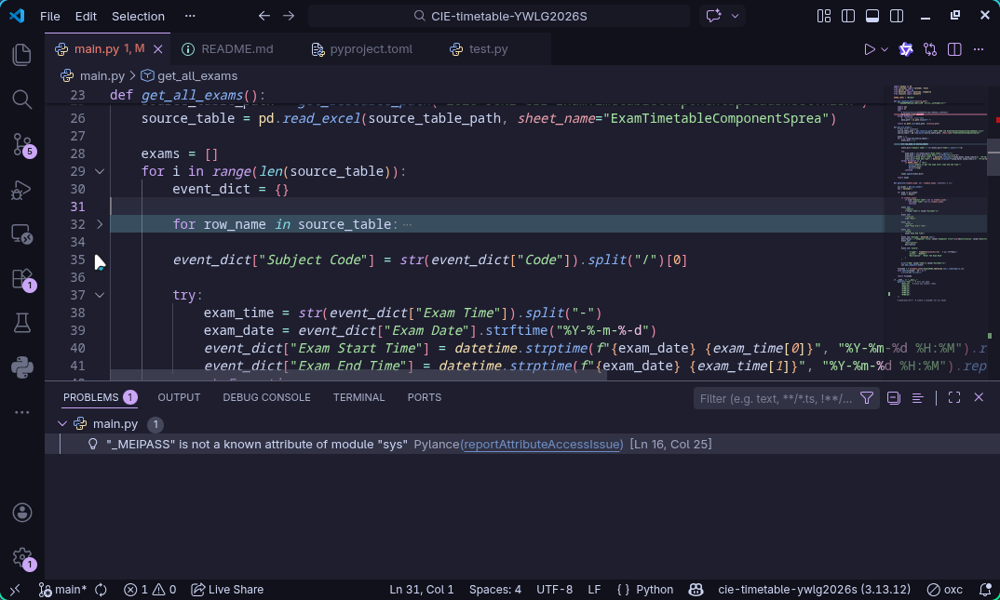

# System Software

## Operating System

Operating System OS - the software that provides an environment in which applications can run and provides an interface between hardware and human operators.

The operating system ...

- controls operation of computer system, and hardware communication 负责计算机硬件的调度
- provides a user interface 提供用户交互界面（包括GUI和CLI）
- controls how computer responds to user's requests
- provides an environment (platform) in which application software can be executed

Hardware is unusable without an OS.

Type of human–computer interfaces (HCI):

- GUI (graphical user interface) - the user to interact with a computer using pictures or symbols (icons)
- CLI (command line interface) - the user has to type the instruction it's more complex but the user is in **direct communication with the computer**.

### OS Tasks

**Memory management** 内存管理

- Memory optimisation 内存优化 - determines how the computer memory is allocated and deallocated.
- Memory organisation - determines how much memory is allocated to an application, including the use of **paging** and **virtual memory systems**
- Memory protection  - to ensure 2 programs do not try to use **same** memory space

**File management**

- Maintain the directory structures
- Provide file naming conventions 提供文件命名规范

**Security management**

- To ensure the integrity, confidentiality and availability of data
- Use **firewall** in traffic routing
- Give **access right** to the users (Prevents unauthorized access, use **usernames and passwords**)
- Carries out automatic **backup**

**Hardware management**

- Communicate with all peripheral devices using **device drivers**
- Control the access of data between peripherals
- Receives and handles interrupts from hardware devices

**Process management**

- Enables **multiprogramming** and **multitasking**

### Utility Softwares

**Disk formatter**

- Prepare a hard disk is ready to use (data can be stored on it)
- It will delete any existing data on disk

**Virus checker**

- Detects and removes harmful virus softwares
- Constantly checks the incoming and outgoing files

**Defragmentation software**

> As an HDD becomes full, blocks used for files will become scattered all over 
> the disk surface.
>
> This slows the data access time, the HDD read-write head requires several movements just to find and retrieve the data making up the required file. (这个问题对SDD影响不大)
>
> It would be advantageous if files could be stored in **contiguous sectors**.

- rearrange the blocks of data to store files in contiguous sectors wherever possible

**Disk contents analysis / repair software**

- To check disk drives for empty space and disk usage by reviewing files and file folders.
- Unwanted files and downloads can be removed

**File compression** - reduces the file size, use the disk space efficiently.

**Back-up software**

- Makes copies of files on another storage medium
- It should be a regular process

- The ability to restore data

### Program Libraries

A library on a computer where **programs and routines are stored** which can be **freely accessed by other software developers** for use in their own programs.

Software under development is often constructed using **existing code** from program libraries, which ...

- reduces the development time
- there is no need to rewrite the existing code in program libraries
- Leads to modular programming

**Dynamic link library** is the library routine that can be **linked** to another program only at the **run time** stage.

The program loads `.dll` files into the memory when required.

**Benefits:**

- The executable file is smaller.
- It can save memory and execution time.
- DLL files can change independently.

> Example:
>
> ```
> .
> ├── bink2w32.dll	# Program Library
> ├── Game.cdx
> ├── Game.exe
> ├── Launcher.cdx
> ├── Launcher.exe	# The executable program itself
> ├── steam_api.cdx
> ├── steam_api.dlll	# Program Library
> ├── steam_emu.ini
> └── USRDIR
> ```

## Language Translators

- Assembler - 把assembly language转换成machine code
- Compiler - 把high-level language转换成machine code
- Interpreter - executes the high-level language line by line

| Compiler                                                     | Interpreter                                                  |
| :----------------------------------------------------------- | :----------------------------------------------------------- |
| Translates a high-level language program to machine code.    | Translates and executes a high-level language program, line-by-line. |
| Creates a .exe file which can be easily distributed.         | No .exe file created.                                        |
| Once compiled, .exe file does not need to be compiled again, resulting in faster execution. | Execution very slow – translated each time program run.      |
| Reports all errors at the end of compilation: difficult to locate errors∴ development process long. | Debugging easier/faster, since it stops translating when it reaches an error. This allows real time error correction. |
| Only be produced when all errors are fixed.                  | Can run program any time, even before code finished.         |
| Used when development is completed.                          | Used during development.                                     |

> $\uparrow$ from Znote: [CAIE AS LEVEL Computer Science 9618 Theory Free Notes & Study Groups - ZNotes](https://znotes.org/caie/as-level/computer-science-9618/theory/system-software/)

### Assembler

The mnemonics used translates into machine opcodes. (把`LDD`之类的指令转换成`0`和`1`组成的machine code)

**One-pass Assembler** - processes the source code in a single scan

- It defines symbols and literals (各种变量), storing them in the symbol and literal tables
- 在读取assembly code的同时直接生成machine code

- **优点：** 速度快，内存占用极小（不需要存储整个中间代码）。
- **缺点：** 代码结构复杂，且**无法处理复杂的向前引用**（比如向前引用一个变量长度未知的数据段），且生成的代码通常需要多次“打补丁”，效率较低。

**Two-pass Assembler** - reads the source code twice to generate object code (executable program)

- In first pass: scans the code to define symbols, assign memory address and gather information about literals and variables. 主要获取和整理信息

- In second pass: converts **symbolic op-codes** into their corresponding **numeric op-codes**

  - resolves symbol values
  - generates data for literals

  And then produces ther final object code

- **优点：** 能完美处理所有前向引用，生成的代码更优、更干净，无需运行时打补丁。
- **缺点：** 需要把整个源代码或中间表示（Intermediate Code）保存在内存中，且读取磁盘两次，速度较慢，内存占用较大。

> 假设汇编代码：
>
> ```assembly
> 100: JMP NEXT   ; 跳转到后面的标签
> 101: NOP
> 102: NEXT: ADD #1
> ```
>
> - **One Pass**：读到第100行时，不知道 `NEXT` 是102。于是生成机器码 `JMP 000`，记录“第100行需要修改”。读到102行时，返回去把 `000` 改成 `102`。**如果NEXT后面定义了变量占10个字节，单遍汇编器很难计算偏移量，容易出错。**
> - **Two Pass**：
>   - **Pass 1**：扫描全部，记录 `NEXT = 102`。
>   - **Pass 2**：再次读第100行，直接查表得到102，生成 `JMP 102`。**一气呵成，无需修改。**
>
> <div style="text-align: right;">- DeepSeek</div>

### Compiler - Two-Step translation

Aim: To achieve **shorter** execution time

Java and some other high level language programs may require two-step translation, i.e, they will be **partially compiled** and **partially interpreted**
$$
\text{Source Code} \xrightarrow{\text{Compiler}} \text{Object code (Intermediate Code)}
$$
To execute the program, the object code can be interpreted by an interpreter or compiled using a compiler.

> Java code first translated to bytecode by Java compiler (Bytecode is the intermediate code in Java)
>
> Bytecode finally interpreted by the Java Virtual Machine to produce machine code
> $$
> \text{Java} \xrightarrow{\text{Java Compiler}} \text{Bytecode} \xrightarrow{\text{Java VM}} \text{Machine Code}
> $$

视频推荐：[从C到01：速通传统编译流程_哔哩哔哩_bilibili](https://www.bilibili.com/video/BV156Tk6hEY2)

### IDE Features

For **coding** : context-sensitive prompts.

For **error-detection** : dynamic syntax checks.

For **presentation** : prettyprint, expand and collapse code blocks.

For **debugging** : single stepping, break points, report window.


