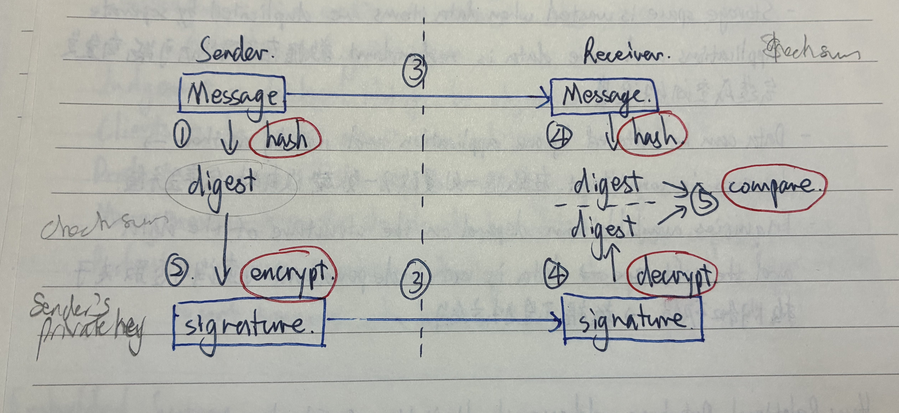

# Security, privacy and data integrity

- [Security, privacy and data integrity](#security-privacy-and-data-integrity)
  - [Digital Signature](#digital-signature)

**Security** - methods taken to **prevent unauthorised access to data** and to **recover data** if lost or corrupted.

- **Software Security** - the collection of methods used to protect computer programs and sensitive information they handle against malicious attacks.
- **Hardware Security** - vulnerability protection that comes in the form of a physical device rather than the software.

**Privacy** - freedom from unauthorised intrusion.

**Data Integrity** - the accuracy, completeness and consistency of data.

- TO MAINTAIN the **accuracy** 准确性, **completion** 完整性, and **consistence** 一致性 of data
- DURING: data entry (visual check, double entry) and data transfer (parity check, checksum)

---

**Authentication** 认证 - a way of proving somebody or something is who or what they claim to be.

**Access Control & Access Right** - use of access level to ensure **only authorised users can gain access to certain data**.

**Encryption** - the use of encryption keys to **make data meaningless** without the correct decryption key.

**Firewall** - software or hardware that sits between a computer and external network that monitors and **filters all incoming and outgoing activities**.

**Password** - a sequence of characters required for access to a computer device or digital device.

**Digital Signatures** - a way of validating the authenticity of a digital document and identifying the sender.

**Biometrics** - use biological features to identify a person, e.g. fingerprints and iris

---

**Malware** (virus, spyware...) - malicious software that seeks to damage or gain unauthorised access to a computer system.

- Risk restriction: Ensure anti-virus and anti-spyware software is installed, regularly updated and run.

**Phishing** - legitimate-looking emails designed to trick a recipient into giving their personal data to the sender of the email.

- Risk restriction: Ignore suspicious mails and ensure firewall criteria include SPAM filters, blacklist, etc.

**Pharming** - redirects a user to a fake website in order to illegally obtain personal data about the user.

- Risk restriction: use a reliable ISP; check that links are genuine 真实的 and ensure https is present in the URL

---

**Validation** — method used to ensure entered data is reasonable and meets certain input criteria.

- range check
- format check
- length check
- presence check
- existence check
- limit check
- check digit

**Verification** — method used to ensure data is correct by using double entry or visual checks.

- during data entry: visual check, double entry
- during data transfer: parity check, checksum

## Digital Signature

Without a digital signature, there is no way to verify the sender of the data.

Digital signatures ensure **authentication** and **non-repudiation**.

**How it works:**

1. The sender **hashes** the document → produce a **digest**.
2. The sender **encrypts** (use private key) the digest to create the digital signature.
3. The message and the signature are sent to the receiver.
4. The receiver **decrypts** (use public key) the signature → reproduce the digest.
5. The receiver uses the **same** hashing algorithm on the document received to produce a second digest.
6. The receiver compares the two digests.
7. If same → the document is authentic.

