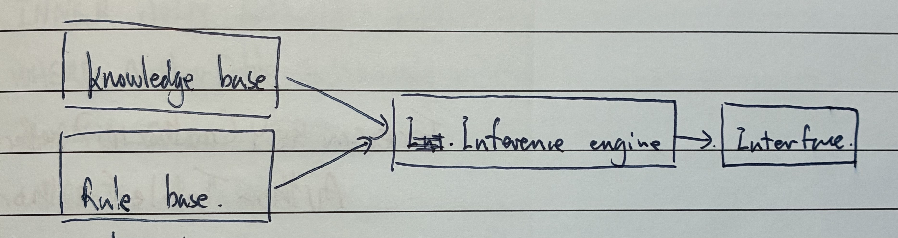

# Ethics and Ownership

- [Ethics and Ownership](#ethics-and-ownership)
  - [Software Licencing](#software-licencing)
  - [Artificial Intelligence](#artificial-intelligence)

Computer Ethics regulate how computing professionals should make decisions regarding professional & social conduct.

A computing professional can be ethically **guided** by joining a professional, ethical body such as the **BCS** and **IEEE**, which have codes of conduct.

- **BCS: The British Computer Society**
  - The Public Interests. 为了公众的利益
  - Professional Competence and Integrity. 职业能力和诚信
  - Duty to Relevant Authority. 对象管机构的责任
  - Duty to the Profession. 对职业的责任
- **IEEE: The Institute of Electrical and Electronics Engineers.**
  - aims:
    - Raising awareness of ethical issues. 提高对伦理问题的认识
    - Promoting ethical behavior. 促进伦理道德行为
    - Ensuring engineers and scientists respect the need for ethical behavior. 确保工程师和科学家重视伦理行为的必要性
- **ACM: Association for Computing Machinery.**

**Intellectual Property** 知识产权 - an individual's ownership of their own creations or ideas.

**Copyright** 版权 - The legal ownership of Intellectual Property and conveys the right to control its reproduction and distribution.

Institute of Electrical and Electronics Engineers (IEEE) Principles:

- **Public** - focus on public interests, disclosing any potential harms.
- **Self** - Self improvements (knowledge, don't be biased).
- **Colleague** - Give credits to others' works, listen to others, help them and guide them.
- **Judgement** - do legal things, be objective & integrity.
- **Clients** - be honest about own abilities.
- **Products** - meet all the requirements, high quality, no back doors.
- **Management** - know the standards, be realistic, use capable/skillful team mates.
- **Profession** - support others, dealing with the potential errors, report someone who breaks the code.

关于IEEE，更多请参见：[IEEE/ACM Software Engineering Code of Ethics - Thyrius](/posts/ascs/ieee/)

## Software Licencing

Copyright:

- The formal and **legal rights** to **ownership**.
- Protects against unauthorised reproduction of work.
- Provides for legal right of redress.

Different types of software licenses:

- **Free Software.** 自由软件.
- **Open Source Initiative.** 开源软件.
- **Freeware.** 免费软件. — 被版权保护的软件.
- **Shareware.** 共享软件. — 可以使用免费版本，但没有完整的功能.
- **Commercial software.** 商业软件. — 付费才能使用. & strictly for resale.

> 如果对自由软件和开源软件感兴趣的话，我推荐以下两个视频：
>
> - [自由与开源软件的诞生：GNU/Linux前世今生_哔哩哔哩_bilibili](https://www.bilibili.com/video/BV11y15YuEpQ)
> - [【技术杂谈】Unix 到 GNU/Linux的操作系统历史_哔哩哔哩_bilibili](https://www.bilibili.com/video/BV1Mv4y127wA)
>
> 如果对实际使用的各种licenses感兴趣，可以参考以下内容：
>
> - [Licensing a repository - GitHub Docs](https://docs.github.com/en/repositories/managing-your-repositorys-settings-and-features/customizing-your-repository/licensing-a-repository)
> - [Choose an open source license | Choose a License](https://choosealicense.com/)
> - [如何选择开源协议 - 苍青浪 - 博客园](https://www.cnblogs.com/cangqinglang/p/11326130.html)

**Free software. 自由软件. & Open Source Initiative.**

- Users have the freedom to run, copy, change and adapt the software.
- Run the software for any legal purpose they wish.
- Study the program's code.
- Redistribute.

**Freeware 免费软件.**

- subject to copyright laws.
- User must agree the terms of use.
- Not allow to modify the source code.

**Shareware 共享软件.**

- Users need to pay for a fee after the free trial.
- Trial version is not the full version.
- Protected by copyright laws.
- Must not use the source code.

## Artificial Intelligence

AI - machine or application which carries out a task that requires some degree of intelligence when carried out by a human being

**Characteristics of AI:**

- collection of data.
- Rules for using the data.
- The ability to reason.
- The ability to learn or adapt.

**Positive impact:**

- increase productivity
- able to make informed predictions.
- analysis complex dataset.

**Negative impact:**

- unemployment.
- unable to maintain the AIs when AIs replaced human jobs.
- changes human life.

**AIs can be used in:**

- autonomous (driverless) vehicles.
- artificial limb technology.
- drones.
- climate changes.
- medical procedures.

---

**Expert system**

- **Knowledge base & Rule base** - Similar to a database that stores a set of facts and rules
- **Inference engine** - Controls the steps taken to solve the problem.
  - forward chaining - give a number of facts then the system can reach new facts. 
  - backward chaining - give a goal and determine the facts that are needed.
- **Interface** - Used to interact with humans (e.g. web pages, chatbots, telephone system).

**Machine learning** - The program is able to automatically adapt its own processes or data.

How AI works:

1. Train the AI with large amounts of data, then AI will find the patterns.
2. Use Machine Learning to improve the accuracy of recognition.
3. Capture the new data by a sensor, and compare it with the stored data.
