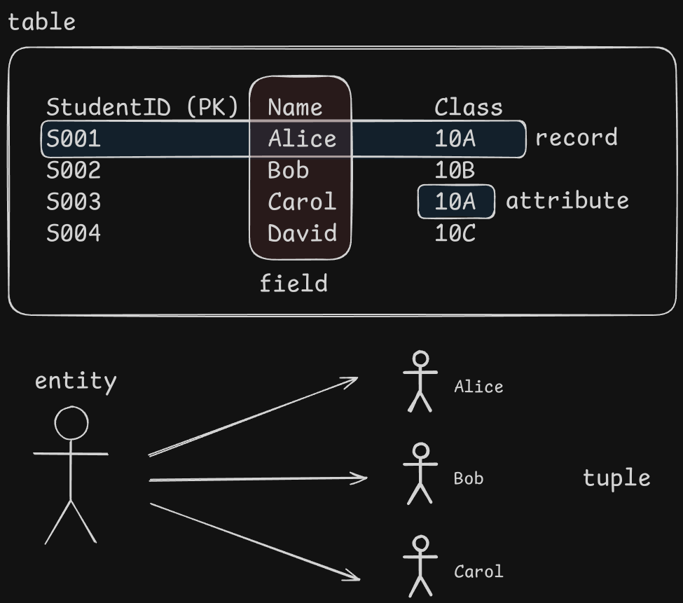
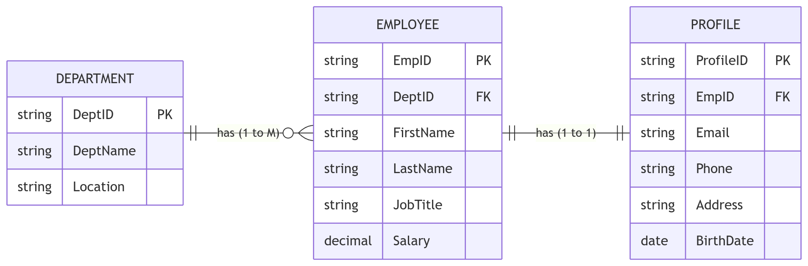
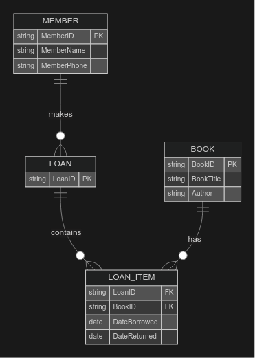

# Database

Database is a collection of organized data, the types of database:

- file-based database
- relational database

> They are sometimes called repositories.

Data in a database is organised so it can be easily located.

**Advantages of DB:**

- Large amounts of data can be stored, which saves using lots of paper and storage space.
- Can apply password to database.
- Easily modify records easily and don't have to redo the fields or change its structure.
- Records are quick and easy to find.
- Easier to maintain.
- Present multiple views of data.

**Limitations of DB:**

- Can be corrupt by computer viruses.
- Expensive to maintain. (DB is complex), both paid for computers and technical employees.
- Programs depends on working computers, power outage will cause disruption.

## File-based database

A file is a collection of items of data. It can be structured as a collection of records, where each record is made up of fields containing data about the same ‘thing’. Individual elements of data can be called data items. [^1]

[^1]:From Page 197, Computer Science AS & A level TEXTBOOK

For example:

```csv
StudentID	Name	Class	Subject	Grade	Teacher
S001		Alice	10A		Math	A		Mr. Smith
S002		Bob		10B		Math	B		Mr. Smith
S003		Carol	10A		English	A		Ms. Jones
S001		Alice	10A		English	B		Ms. Jones
S004		David	10C		Math	C		Mr. Smith
```

- Stores all its records in a single table in a plain text file. Each line of the text file holds one record.
- Excellent way of storing a relatively small amount of records.
- Data stored in discrete files, stored on computer, and can be accessed, altered or removed by the user.

---

Features of a flat file database:

- All records are stored in one place.
- Easy to set up using a number of standard office applications.
- Easy to understand.
- Simple storing of records can be carried out.
- Record can be viewed or extracted on the basis of simple criteria

The **limitations** of file-based approach:

- Storage space is **wasted** when data items are **duplicated** by separate applications and some data is **redundant**. 

  数据在不同地方可能有重复，会造成空间的浪费.

- Data can be altered by one application and **not by another** → becomes **inconsistent**. 

  在数据一处更改另一处却没有时，会产生矛盾.

- Enquiries available can depend on the structure of the data and the software → data is not independent. 

  可查询与否取决于结构和软件 → 数据不是独立的.

## Relational Database

> A relational database was created to overcome the limitations of the flat file database.

**Database** is a structured collection of items of data that can be accessed by different applications programs. A **relational database** is a database in which the data items are linked by internal pointers. [^2]

[^2]: From Page 198, Computer Science AS & A level TEXTBOOK

关于relational database是如何解决file-based的问题的：

1. Reduces data redundancy → linked tables (each item is stored only once).
2. Reduces program-data dependency → data is separate from the software, changes to the data do not require programs to be rewritten.
3. Improves data integrity → data is stored once, only need to update once.
4. Can provide different views → users can only see specific aspects of the database.

The key structure of a relational database:

- **entity 实体** - 任何可以储存数据的事物.
- **tuple 元** - entity's instance. 实体的实例.
- **table 表** - A group of similar data.
- **record 记录** - a row in a table.
- **field 域** - a column in a table.
- **attribute 属性** - an individual data item



Each record must has a **key** in the table, used to identify each different record：

- **Primary key** - an unique identifier for a table.
- **Candidate key** - An attribute or smallest set of attributes in a table where no tuple has the same value.
- **Composite key** - A set of attributes that form a primary key to provide a unique identifier for a table.
- **Secondary key** - A candidate key that is an alternative to the primary key.
- **Foreign key** - the key used to **link** a primary key in another table.

There is a **data dictionary** in the database, it stores the metadata:

- definition of table (table name).
- attributes (Fields and their data types).
- relationship between tables.
- validation rules.

**Database Relationship** - Situation in which one table in a database has a foreign key that refers to a primary key in another table in the database.

The relationship between the different tables:

- one-to-many
- one-to-one
- many-to-many



## Database Management System

Programs that manage information in a database is called a **database management system** DBMS.

**Functions of a DB manager system:** Data storage, retrieval and updates. Allows user to easily store, retrieve and update data, and also...

- **Backup and Recovery** - The DBMS allows you to recover the most recent contents of the database in the event of system failure.
- **Security** - handle password allocation and checking, and allow to the data that a user is authorised to use.
- **Managing facilities for sharing a database** - ensure no two users can access the same record at the same time in order to modify it.

> 简而言之：
>
> - data management 数据管理.
> - data modelling 数据建模.
> - logic schema.
> - data integrity.
> - data security / backup and auth.

Benefits of a relational database management system - *Data is only stored once*

- Removes data redundancy

- No multiple record changes needed.

- More efficient storage.

- Complex queries can be carried out with simple operation

  > Using SQL, so the programmers can do 'INSERT', 'UPDATE', 'DELETE', 'CREATE', 'DROP' to the records.

- Better security

  > By splitting data into tables, certain tables can be made confidential. When a person logs on with their username and password, the system can then limit access to specific tables whose records they are authorised to view.

> Difference between a database and a DBMS: 
>
> - Database is a collection of data
> - DBMS is a tool used to manage the database.\

### Logic Schema

Data Definition Language provides a method of creating a database from scratch.
This allows the linking of tables which results in the design of the database known as the schema.

Schema, also called logical data model; It is the structure that represents the view (design) of the entire database. It defines **how the data is organised** and how the **relation** among them are associated.

**Database schema** - A data model for a specific database that is independent of the DBMS used to build that database.

### Data Definition Language DDL

Carries out all creation/modification of all database structure.

> DBMS carries out all creation / modification of the database structure using its Data Definition Language (DDL)
>
> DBMS has a tool called **Developer Interface** to organise the data

> [!IMPORTANT]
>
> Both DDL and DML is **Structured Query Language (SQL)**
>
> - 每个完整的指令通过`;`分隔，其中换行不影响指令执行
> - 关键词大写，例如`CREATE`和`SELECT`

- **Create a database :** `CREATE DATABASE DatabaseName;`

- **Create a table :**

  ```sql
  CREATE TABLE TableName(
      FieldName DataType,
      ...
  );
  ```

- **Change a table :**

  - Add primary key: 

    ```sql
    ALTER TABLE TableName
    ADD PRIMARY KEY Field;
    ```

  - Add foreign key:

    ```sql
    ALTER TABLE TableName
    ADD FOREIGN KEY Field REFERENCES Table(Field);
    ```

> Data types can be used in database:
>
> - CHARACTER
> - VARCHAR(n)
> - BOOLEAN
> - INTEGER
> - REAL
> - DATE
> - TIME
>
> 这边的datatype和pseudocode中的datatype并不一样，二者是完全不同的东西，它们各自的datatype不能混着用。

### Data Manipulation Language DML

Used to query or modify data.

> DBMS carries out all queries and maintenance of data using its DML
>
> **Query processor** - A feature of a DBMS that processes and executes queries written in structured query language (SQL).

- **Query data**:

  ```sql
  SELECT Field1, Field2...
  FROM TableName
  WHERE ... ;
  ```

  - **Group data:** `GROUP BY Field`
  - **Sort data:** `ORDER BY Field`
  - **Calculate data:**
    - `SUM( )`
    - `COUNT( )`
    - `AVG( )`

- **Combine / Link two table :**

  ```sql
  INNER JOIN Table2
  ON Table1.PrimaryKey = Table2.ForeignKey
  ```

- **Add or remove data:**

  ```sql
  INSERT INTO TableName
  VALUES ( Value1, Value2, Value3 );
  
  DELETE FROM TableName
  WHERE ... ;
  ```

---

Difference between DML and DDL.

- DML is a language use to do some operations on database.
- DDL provides a method of creating a database from scratch.

## Normalisation

- 1NF
  - 有 Primary Key.
  - 没有重复的数据.
  - atomic 不可再分
- 2NF -  No partial dependencies. 依赖主键的**一部分**
- 3NF - No non-key dependencies. 依赖其他非主键字段

**Normalisation** is used to construct a relational database that has integrity and in which **data redundancy is reduced**. 

Tables that are not normalised will be larger. 

As more data is stored, it will be harder to update the database when changes are made and more difficult to extract the required data to answer queries. [^3]

[^3]: From Page 203, Computer Science AS & A level TEXTBOOK

> [!TIp]
>
> 此处建议参考课本204页的例子来加深对normalisation的理解。

## Appendix

### Example of a Relational Database



1. **Student** 表（学生）

| **StudentID (PK)** | Name  | Class |
| :----------------- | :---- | :---- |
| S001               | Alice | 10A   |
| S002               | Bob   | 10B   |
| S003               | Carol | 10A   |
| S004               | David | 10C   |

2. **Subject** 表（科目）

| **SubjectCode (PK)** | SubjectName |
| :------------------- | :---------- |
| MTH                  | Math        |
| ENG                  | English     |

3. **Teacher** 表（教师）

| **TeacherID (PK)** | TeacherName |
| :----------------- | :---------- |
| T01                | Mr. Smith   |
| T02                | Ms. Jones   |

4. **Grade** 表（成绩）—— 关联表（Linking Table）

| **GradeID (PK)** | StudentID (FK) | SubjectCode (FK) | TeacherID (FK) | Grade |
| :--------------- | :------------- | :--------------- | :------------- | :---- |
| G001             | S001           | MTH              | T01            | A     |
| G002             | S002           | MTH              | T01            | B     |
| G003             | S003           | ENG              | T02            | A     |
| G004             | S001           | ENG              | T02            | B     |
| G005             | S004           | MTH              | T01            | C     |

### Different Keys

> 这部分的示例由DeepSeek生成

#### Primary Key（主键）

> **定义**：表中**唯一标识**每一行记录的字段（或字段组合），不能为空，不能重复。

| 表名        | Primary Key   | 为什么选它？                              |
| ----------- | ------------- | ----------------------------------------- |
| **Student** | `StudentID`   | 每个学号唯一对应一个学生（S001, S002...） |
| **Subject** | `SubjectCode` | MTH、ENG 等代码唯一对应一个科目           |
| **Teacher** | `TeacherID`   | T01、T02 唯一对应一个老师                 |
| **Grade**   | `GradeID`     | G001、G002 唯一对应一条成绩记录           |

不能作为主键的例子：

- `Name`（姓名）→ 可能有重名
- `Class`（班级）→ 一个班有很多学生
- `Grade`（成绩）→ 多人可能得同样分数

#### Candidate Key（候选键）

> **定义**：表中**所有能唯一标识一行**的字段或字段组合（候选键可以有很多个，最终选一个当主键）。

| 候选键                 | 是否唯一？               | 说明                       |
| ---------------------- | ------------------------ | -------------------------- |
| `StudentID`            | ✅ 是                     | 学号唯一 → 是候选键        |
| `Name` + `Class`       | ✅ 是（假设没有同名同班） | 组合起来可唯一，但比较笨重 |
| `Name` + `DateOfBirth` | ✅ 是（如果加生日字段）   | 也可唯一，但需要额外信息   |
| `Name` 单独            | ❌ 否                     | 可能有重名，不是候选键     |
| `Class` 单独           | ❌ 否                     | 一个班很多人，不是候选键   |

**Student** 表的候选键有：

1. `StudentID`（最简单、最常用 → 被选为**主键**）
2. `Name + Class`（组合候选键，但没被选为主键）
3. `Name + DateOfBirth`（如果表里有生日字段）

#### Composite Key（复合键 / 组合键）

> **定义**：用**两个或以上字段组合**作为主键，来唯一标识一条记录（当单个字段不够用时）。

假设 **Grade** 表设计成：

| StudentID | SubjectCode | TeacherID | Grade |
| --------- | ----------- | --------- | ----- |
| S001      | MTH         | T01       | A     |
| S001      | ENG         | T02       | B     |
| S002      | MTH         | T01       | B     |

现在要唯一标识一行，**单个字段不行**：
- `StudentID` = S001 有两行 → 不唯一 ❌
- `SubjectCode` = MTH 有两行 → 不唯一 ❌

使用 Composite Key，把 `(StudentID, SubjectCode)` **组合**作为主键：

- S001 + MTH → 唯一 
- S001 + ENG → 唯一 
- S002 + MTH → 唯一 

#### Secondary Key（次要键 / 备用键）

> **定义**：**候选键中没被选为主键的那些**，作为备用标识符。

| 候选键               | 是否被选为主键？         | 角色           |
| -------------------- | ------------------------ | -------------- |
| `StudentID`          | ✅ 是 → **Primary Key**   | 主键           |
| `Name + Class`       | ❌ 否 → **Secondary Key** | 次要键（备用） |
| `Name + DateOfBirth` | ❌ 否 → **Secondary Key** | 次要键（备用） |

实际使用场景：

- 如果你想通过 `Name + Class` 来查找学生（而不是用 StudentID），这个组合就是次要键
- 次要键**不是必须的**，但在查询时可以作为替代索引使用

#### Foreign Key（外键）

> **定义**：一个表中的字段，引用**另一个表的主键**，用来**建立表与表之间的链接**。

| 外键字段      | 引用哪个表？ | 引用哪个字段？     | 作用                   |
| ------------- | ------------ | ------------------ | ---------------------- |
| `StudentID`   | **Student**  | `StudentID` (PK)   | 这条成绩属于哪个学生   |
| `SubjectCode` | **Subject**  | `SubjectCode` (PK) | 这条成绩属于哪个科目   |
| `TeacherID`   | **Teacher**  | `TeacherID` (PK)   | 这条成绩是哪个老师教的 |

**Grade 表（子表）**
| GradeID (PK) | StudentID (FK) | SubjectCode (FK) | TeacherID (FK) | Grade |
| ------------ | -------------- | ---------------- | -------------- | ----- |
| G001         | S001           | MTH              | T01            | A     |
| G002         | S002           | MTH              | T01            | B     |

**Student 表（父表）**

| StudentID (PK) | Name  |
| -------------- | ----- |
| S001           | Alice |
| S002           | Bob   |

外键的作用：

1. **建立关系**：Grade 表通过 StudentID 链接到 Student 表，知道 S001 是 Alice
2. **保证数据一致性（Referential Integrity）**：
   - 你不能在 Grade 表插入 `StudentID = S999`，因为 Student 表里没有这个学号
   - 你不能删除 Student 表里的 S001，如果 Grade 表里还有他的成绩记录

---

| 键类型            | 核心特点                     | 在 Student 表的例子                                |
| ----------------- | ---------------------------- | -------------------------------------------------- |
| **Primary Key**   | 唯一标识，表中只有一个       | `StudentID`                                        |
| **Candidate Key** | 所有能唯一标识的字段（多个） | `StudentID`<br>`Name+Class`<br>`Name+DateOfBirth`  |
| **Composite Key** | 多个字段组合成主键           | `(Name, Class)` 如果用作主键                       |
| **Secondary Key** | 候选键中没被选为主键的       | `Name+Class`（备用）<br>`Name+DateOfBirth`（备用） |
| **Foreign Key**   | 引用另一个表的主键，建立链接 | 在 Grade 表中的 `StudentID`                        |

### Normalising a Database

场景：图书借阅管理系统

初始数据 **LIBRARY_LOANS（非规范化）**

| LoanID | MemberName | MemberPhone | BookTitle    | Author         | DateBorrowed | DateReturned |
| ------ | ---------- | ----------- | ------------ | -------------- | ------------ | ------------ |
| L001   | Alice      | 555-0101    | Harry Potter | J.K. Rowling   | 2026-01-10   | 2026-01-20   |
| L001   | Alice      | 555-0101    | The Hobbit   | J.R.R. Tolkien | 2026-01-10   | 2026-01-20   |
| L002   | Bob        | 555-0102    | 1984         | George Orwell  | 2026-01-12   | NULL         |
| L003   | Alice      | 555-0101    | Dune         | Frank Herbert  | 2026-01-15   | 2026-01-25   |

- **重复数据**：Alice 的信息重复出现
- **更新异常**：如果 Alice 换手机号，要改多行
- **插入异常**：不能插入一个新会员，除非他借书
- **删除异常**：如果 Bob 还了书，他的信息就没了

#### 1NF

规则：

1. **每个字段都是原子性的**（不可再分）
2. **每行有唯一标识**（主键）
3. **没有重复组**（每行只存一个值）

问题：

- LoanID + BookTitle 组合可以唯一标识一行 → **复合主键**
- 所有字段已经是原子值 

**LOAN（1NF）**

| LoanID | BookTitle    | MemberName | MemberPhone | Author         | DateBorrowed | DateReturned |
| ------ | ------------ | ---------- | ----------- | -------------- | ------------ | ------------ |
| L001   | Harry Potter | Alice      | 555-0101    | J.K. Rowling   | 2026-01-10   | 2026-01-20   |
| L001   | The Hobbit   | Alice      | 555-0101    | J.R.R. Tolkien | 2026-01-10   | 2026-01-20   |
| L002   | 1984         | Bob        | 555-0102    | George Orwell  | 2026-01-12   | NULL         |
| L003   | Dune         | Alice      | 555-0101    | Frank Herbert  | 2026-01-15   | 2026-01-25   |

> **主键**：(LoanID, BookTitle) - 复合键

1NF 仍存在的问题：

- **部分依赖（Partial Dependency）**：
  - MemberName, MemberPhone 只依赖于 LoanID（不是整个复合键）
  - Author 只依赖于 BookTitle（不是整个复合键）
- **数据冗余仍然存在**：Alice 信息重复 3 次

#### 2NF

规则：

1. **已经是 1NF**
2. **消除部分依赖**（所有非主键字段必须完全依赖于整个主键）

解决方案：把部分依赖的字段**拆到新表**里

表 1：**LOAN**（借阅记录）

| LoanID | BookTitle    | DateBorrowed | DateReturned |
| ------ | ------------ | ------------ | ------------ |
| L001   | Harry Potter | 2026-01-10   | 2026-01-20   |
| L001   | The Hobbit   | 2026-01-10   | 2026-01-20   |
| L002   | 1984         | 2026-01-12   | NULL         |
| L003   | Dune         | 2026-01-15   | 2026-01-25   |

> **主键**：(LoanID, BookTitle)
> - 现在所有字段都完全依赖于整个复合键
>

表 2：**MEMBER**（会员信息）

| LoanID | MemberName | MemberPhone |
| ------ | ---------- | ----------- |
| L001   | Alice      | 555-0101    |
| L002   | Bob        | 555-0102    |
| L003   | Alice      | 555-0101    |

> **主键**：LoanID
>
> - MemberName 和 MemberPhone 完全依赖于 LoanID 
>

表 3：**BOOK**（图书信息）

| BookTitle    | Author         |
| ------------ | -------------- |
| Harry Potter | J.K. Rowling   |
| The Hobbit   | J.R.R. Tolkien |
| 1984         | George Orwell  |
| Dune         | Frank Herbert  |

> **主键**：BookTitle
>
> - Author 完全依赖于 BookTitle 
>

2NF 仍存在的问题：

- **传递依赖（Transitive Dependency）**：
  - 在 MEMBER 表中，MemberPhone 依赖于 MemberName
  - 如果 Alice 改名，电话信息会不一致
  - 如果 Alice 改电话，要改多行（仍然有冗余）

#### 3NF

规则：

1. **已经是 2NF**
2. **消除传递依赖**（非主键字段不能依赖于其他非主键字段）

问题诊断：

在 MEMBER 表中：
- MemberPhone → 依赖于 MemberName（非主键）
- 这是**传递依赖**：LoanID → MemberName → MemberPhone

解决方案：把 MemberName 和 MemberPhone 分开

表 1：**LOAN**（借阅记录）

| LoanID | DateBorrowed | DateReturned |
| ------ | ------------ | ------------ |
| L001   | 2026-01-10   | 2026-01-20   |
| L002   | 2026-01-12   | NULL         |
| L003   | 2026-01-15   | 2026-01-25   |

> **主键**：LoanID

表 2：**MEMBER**（会员）

| MemberID (PK) | MemberName | MemberPhone |
| ------------- | ---------- | ----------- |
| M001          | Alice      | 555-0101    |
| M002          | Bob        | 555-0102    |

> **主键**：MemberID
>
> - 消除了传递依赖 
> - 每个会员信息只存一次 
>

表 3：**BOOK**（图书）

| BookID (PK) | BookTitle    | Author         |
| ----------- | ------------ | -------------- |
| B001        | Harry Potter | J.K. Rowling   |
| B002        | The Hobbit   | J.R.R. Tolkien |
| B003        | 1984         | George Orwell  |
| B004        | Dune         | Frank Herbert  |

> **主键**：BookID

表 4：**LOAN_ITEM**（借阅明细 - 关联表）

| LoanID (FK) | BookID (FK) | DateBorrowed | DateReturned |
| ----------- | ----------- | ------------ | ------------ |
| L001        | B001        | 2026-01-10   | 2026-01-20   |
| L001        | B002        | 2026-01-10   | 2026-01-20   |
| L002        | B003        | 2026-01-12   | NULL         |
| L003        | B004        | 2026-01-15   | 2026-01-25   |

> **复合主键**：(LoanID, BookID)
>
> - 现在 Loan 和 Book 通过这个表关联
> - 允许一个借阅记录包含多本书
>


