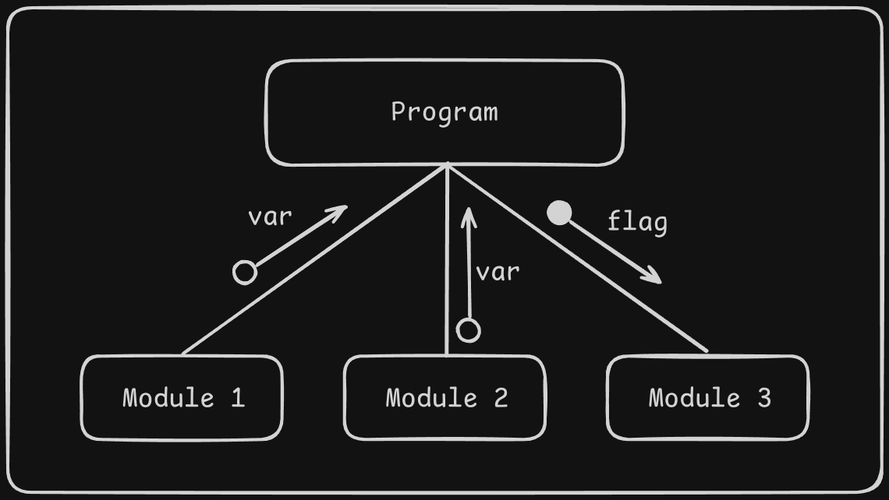
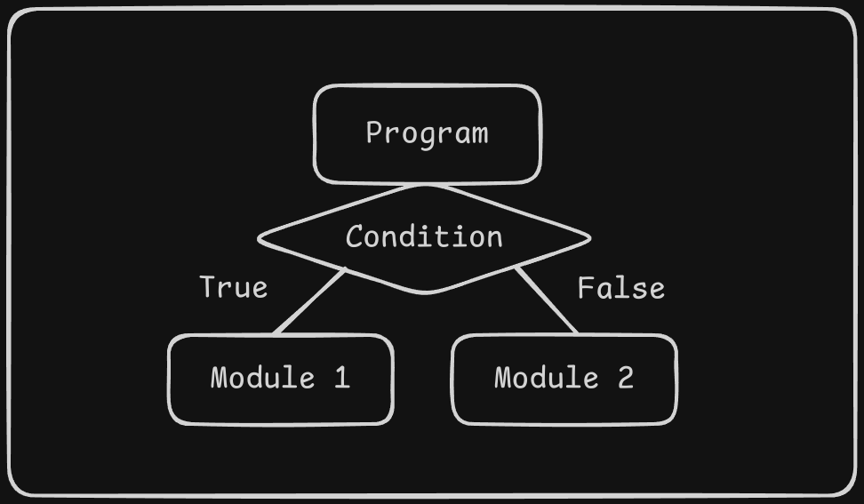
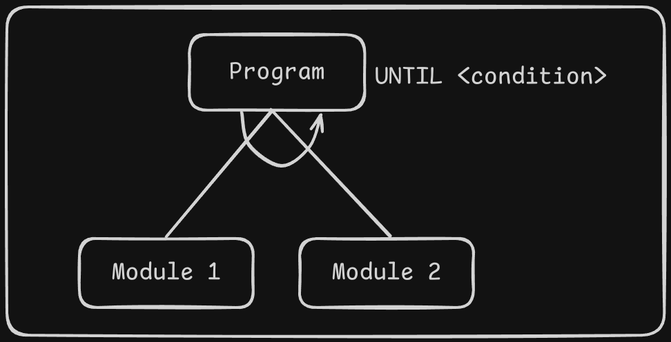
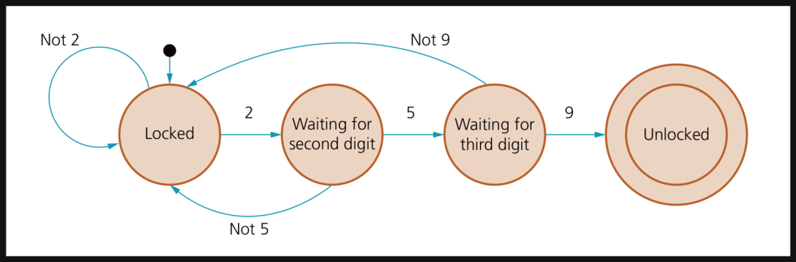

# Programming

## Modular Programming

> Using functions and procedures

Functions and procedures allow the programmer to ...

- reuse the code
- structure the program's code
- easily to cooperate with other's code

**Functions** - when you call them, they return a value.

```pseudocode
// Function
FUNCTION <identifier>() RETURNS <data type>
   <statement(s)> 
ENDFUNCTION
```

**Procedures** - don't return any value

```pseudocode
// Procedure
PROCEDURE <identifier>()
	<statement(s)> 
ENDPROCEDURE

// Use the procedure
CALL <identifier>()
```

---

Parameters and Arguments:

- Parameter - allows you to pass values to the procedures and functions.
- Argument - **actual piece** of data passed to the procedures and functions.

```pseudocode
// Procedure with parameters
PROCEDURE <identifier>(<param1> : <data type>, <param2> : <data type>...)
   <statement(s)> 
ENDPROCEDURE

// Use the procedure
CALL <identifier>(value1, value2, ...)

// Function with parameter
FUNCTION <identifier>(<param1> : <data type>, <param2> : <data type>...) RETURNS <data type>
   <statement(s)>
ENDFUNCTION

// Use the function
OUTPUT <identifier>(value1, value2, ...)
```

---

Methods of Parameter Passing:

- Pass by Value - A copy of the data is made and stored by way of the name of the parameter, Any changes to the parameter have NO affect on data in the calling function.
- Pass by Reference - A 'reference parameter' refers to the original data in the calling function. Thus any changes made to the parameter are ALSO MADE TO THE ORIGINAL variable.
- *Pass by Pointer* (not required in syllabus) - A pointer is an argument in stead of a variable then the address of the variable is passed instead of the value. So any change made by the function using the pointer is permanently made at the address of passed variable. 

```pseudocode
PROCEDURE SWAP(BYREF X : INTEGER, Y : INTEGER)
   Temp ← X
   X ← Y
   Y ← Temp
ENDPROCEDURE
```

> `BYREF` - pass by reference
>
> `BYVAL` - pass by value
>
> 连续多个变量使用同一种传递方法时，后面变量的`BY___`可以省略。
>
> 任何`BY___`都没有写时，默认为`BYVAL`

## Program Development Life Cycle

Stages in the program development lifecycle:

- **Analysis** - to define the problem, use abstraction and decomposition

  > **Abstraction:** filtering out and **concentrating on the relevant information** in a problem; allowing a programmer to **deal with complexity**
  >
  > **Decomposition:** **breaking down problems into sub-problems** in order to understand a process more clearly; program modules, procedures and functions all help the programmer to break down large problems [^1]
  >
  > [^1]: [Znote CAIE | AS Level](https://znotes.org/caie/as-level/) - [Computer Science](https://znotes.org/caie/as-level/computer-science-9618/) - Practical - Algorithm Design & Problem-Solving
  >
  >  (use modular programming)
- **Design** - use structure charts, state-transition diagrams or pseudocode to plan how the tasks can be completed
- **Coding** - write the program with actual code
- **Testing** - run the program under different test data by different test methods
- **Maintenance** - dealing with any problems that arise during use

### Stepwise Refinement

This is the process of **developing a modular design** by **splitting a problem into smaller sub-tasks,** which themselves are repeatedly split into even smaller sub-tasks until each is just one element of the final program.

1. Break down the complex problem into smaller and more manageable parts.
2. These steps parts then need to be written as a series of steps.
3. Each step can be written as a statement in a high-level programming language.

---

### Waterfall Model

Each stage is completed and signed off before the next stage is begun

- suitable for small projects with a short timescale

**Principles**

- linear, as each stage is completed before the next is begun
- well documented as full documentation is completed at every stage
- low customer involvement; only involved at the start and end of the process

**Benefits**

- easy to manage, understand and use
- stages do not overlap and are completed one at a time
- each stage has specific deliverables
- works well for smaller programs where requirements are known and understood

**Drawbacks**

- difficult to change the requirements at a later stage
- not suitable for programs where the requirements could be subject to 
  change
- working program is produced late in the lifecycle
- not suitable for long, complex projects

### Iterative Model

These program development cycles are repeated until the full system has been developed

- suitable for projects for which the **major requirements are known** but **some details are likely to change** or evolve with time

**Principles**

- incremental development as the program development lifecycle is repeated
- working programs are produced for part of the system at every iteration
- high customer involvement, as part of the system can be shown to the 
- customer after every iteration

**Benefits**

- some working programs developed quickly at an early stage in the lifecycle
- easier to test and debug smaller programs
- more flexible as easier to alter requirements
- customers involved at each iteration therefore no surprises when final system delivered

**Drawbacks**

1. whole system needs to be defined at start, so it can be broken down into pieces to be developed at each iteration
2. needs good planning overall and for every stage
3. not suitable for short simple projects

### Rapid Application Development

Develops different parts of the requirements in parallel

- suitable for complicated projects that need developing in a short timeframe to meet the evolving needs of a business

**Principles**

- minimal planning
- reuses previously written code where possible, makes use of automated code generation where possible
- high customer involvement, as customers can use the prototypes during development

**Benefits**

- reduced overall development time
- rapid frequent customer feedback informs the development
- very flexible as requirements evolve from feedback during development as parts of the system are developed side by side, modification is 
- easier because each part must work independently

**Drawbacks**

- system under development needs to be modular
- needs strong teams of skilled developers
- not suitable for short simple projects

---

| Model             | Characteristics                                              | Benefits                                                     | Disadvantages                                                |
| :---------------- | :----------------------------------------------------------- | :----------------------------------------------------------- | :----------------------------------------------------------- |
| Waterfall         | 1. Linear. <br> 2. well documented. <br> 3. low customer involvement. | 1. easy to manage. <br> 2. works well for small programs. <br> 3. each stages has specific deliverables. | 1. difficult to change the requirements at a later stage. <br> 2. not suitable for complex programs. <br> 3. working programs produced later in the lifecycle. |
| Iterative.        | 1. SDLC is repeated. <br> 2. working programs produced in each iteration. <br> 3. high customer involvement. | 1. save programs developed very quickly. <br> 2. easier to test and debug smaller programs. <br> 3. more flexible. | 1. whole system needs to be defined at start. <br> 2. require good overall planning. <br> 3. not suitable for short simple projects. |
| Rapid Application | 1. minimal planning. <br> 2. reuses previously written code where possible. <br> 3. high customer involvement. | 1. reduced overall development time. <br> 2. rapid/frequent customer feedback. <br> 3. very flexible. | 1. needs to be modular. <br> 2. requires skilled developers. <br> 3. not suitable for short simple projects. |

## Program Design

- structure charts
- state-transition diagrams
- pseudocode

The using of appropriate can...

- make the program easier to understand
- provide the overview of the process, allow logical errors to be identified
- provide documentations for other programmers

### Structure Diagram

Structure chart is a **modelling tool** used to decompose a problem into a set of sub-tasks.

It shows the hierarchy or structure of the different modules and *how they connect and interact with each other*.

- Shows the sequence of module execution.
- Represents Module Hierarchy (top-down approach with major modules on top)
- Shows selections.
- Shows repetitions.
- Depicts the interface/connection between modules using parameters.

3 programming actions / features that can be depicted in a structure chart:

1. Procedures and functions - each module is represented by a box and the parameters passed to and from the modules are shown by arrows pointing towards the module receiving the parameter.

   

2. Selection - the diamond shaped box shows a condition that can be true or false.

   

3. Repetition - the repetition is shown by adding a label and semi-circular arrow above the module to be completed.

   

| Symbol                                                       | Name        | Meaning                                                      |
| :----------------------------------------------------------- | :---------- | :----------------------------------------------------------- |
|  | Process     | Each box represents a programming module = a calculation, output etc. |
|  | Data Couple | Data being passed from module to module that needs to be processed. |
|  | Flag        | The *check data* sent to process to stop or start process. (only represent Boolean value) |

> 详细的实例参考教材288页即可

### State Transition Diagram

State transition diagrams are suitable for systems with a **fixed number of states** that may change on input or when an event occurs (Final state machine).

It visually represents a system's states, the events that causes transitions (Inputs or times), and the transitions between states.

They may also show the condition **needed for an event to cause a transition** (the guard condition) and the outputs or actions carried out resulting from a transition.

- States are represented as nodes (**circles**).
- Transitions are represented as interconnecting **arrows**.
- Events are represented as **labels** on the arrows.
- Conditions can be specified in **square brackets** after the event label.
- The initial state is indicated by an arrow with a **black dot**.
- A stopped state is indicated by a **double circle**.



> $\uparrow$ **finite state machine** - a machine that consists of a fixed set of possible states with a set of inputs that change the state and a set of possible outputs.

## Program Testing and Maintenance

**Testing plan** - a detailed plan list showing **all the stages of testing** and every test that will be performed for a particular program. 

Test plan helps to determine the effort needed to validate the quality of the application under test.

### Errors

**Syntax** - An error in the grammar that breaks the rules of the Programming Language.

**Run-time** - Can be compiled to machine code but fails upon execution. *eg. divide by 0, infinite loop.*

**Logic** - The program runs but gives incorrect output.

### Testing Methods

对于功能的测试：

- **Dry run / Walkthrough**: The developer works through a program or module from a program manually and document the results using a **trace table**. A walkthrough is a formalised version of a dry run using pre-defined test case.
- **White-box testing**: the detailed testing of how each procedure works, this involves **testing the structure and logic** of every part through a program module.
- **Black-box testing**: tests a module's **input and output.**
- **Integration testing**: The testing of any separately written modules to ensure that **they work together**.

> **Stub Testing**
>
> Stubs are the modules that act as temporary replacement for a called module and give the same output as the actual product.
>
> Test stubs are programs that mimic (copy) the behaviors of software components (or modules) that a module undergoing tests depends on.
>
> Stubs are used during Top-down integration testing.

对于消费者的测试：

- **Alpha testing**: used first - The completed or nearly completed program is **tested in-house by development team**.
- **Beta testing**: used second, the completed program is tested by a **small group of users** before it is formally released.
- **Acceptance testing**: Used third. The completed program to **prove to the customer** that it works as required in the environment in which it will be used.

### Test Data

- **Normal** data: the data will be accepted by the program.
- **Extreme** data: the largest and lowest value that are normal data.
- **Abnormal** data: the data will be rejected by the program.

### Types of Maintenance

- **Corrective**: used to correct any errors that appear during use.
- **Protective**: to improve the performance of a program during its use.
- **Adaptive**: Used to alter a program so it can perform any new tasks required by the customer. Can function in different environments.

## Data Types

**Record**是一种composite data types，它可以把一组有关联的数据存在一个变量中。

1. 创建一个record类型的data type（定义怎么储存数据）

   ```pseudocode
   TYPE
   <Typename>
      DECLARE <identifier> : <data type>
      DECLARE <identifier> : <data type>
      DECLARE <identifier> : <data type>
      ::
      ::
   ENDTYPE
   ```

2. 将一个变量设为自己创建的record类型（声明一个变量）

   ```pseudocode
   DECLARE <identifier> : <Typename>
   ```

3. 使用record

   ```pseudocode
   <identifier>.<item identifier>
   ```

> 以“储存书本信息”为例：
>
> ```pseudocode
> TYPE
> TbookRecord
>    DECLARE title : STRING
>    DECLARE author : STRING
>    DECLARE publisher : STRING
>    DECLARE noPages : INTEGER
>    DECLARE fiction : BOOLEAN
> ENDTYPE
> 
> DECLARE ThreeBody : TbookRecord
> 
> ThreeBody.author <- "Cixin Liu"
> ThreeBody.fiction <- TRUE
> ...
> ```

### Abstract Data Type

ADT is the collection of data, and the set of operations on those data

> 关于这部分内容，建议参考[Hello 算法](https://www.hello-algo.com/)中的介绍。*(大力推荐这本书)*

考试会涉及的三种抽象数据类型：

- Stack - [5.1 栈 - Hello 算法](https://www.hello-algo.com/chapter_stack_and_queue/stack/)

  > last in, first out
  >
  > - PUSH
  > - POP

  ```pseudocode
  // To set up a stack
  DECLARE stack ARRAY[1:10] OF INTEGER
  DECLARE topPointer : INTEGER
  DECLARE basePointer : INTEGER
  DECLARE stackful : INTEGER
  basePointer <- 1
  topPointer <- 0
  stackful <- 10
  
  // To push an item, stored in item, onto a stack
  IF topPointer < stackful
  THEN
      topPointer <- topPointer + 1
      stack[topPointer] <- item
  ELSE
      OUTPUT "Stack is full, cannot push"
  ENDIF
  
  // To pop an item, stored in item, from the stack
  IF topPointer = basePointer - 1
  THEN
      OUTPUT "Stack is empty, cannot pop"
  ELSE
      Item <- stack[topPointer]
      topPointer <- topPointer - 1
  ENDIF
  ```

- Queue - [5.2 队列 - Hello 算法](https://www.hello-algo.com/chapter_stack_and_queue/queue/)

  > first in, first out
  >
  > - ENQUEUE
  > - DEQUEUE

  ```pseudocode
  // To set up a queue
  DECLARE queue ARRAY[1:10] OF INTEGER
  DECLARE rearPointer : INTEGER
  DECLARE frontPointer : INTEGER
  DECLARE queueful : INTEGER
  DECLARE queueLength : INTEGER
  frontPointer <- 1
  endPointer <- 0
  upperBound <- 10
  queueful <- 10
  queueLength <- 0
  
  // To add an item, stored in item, onto a queue
  IF queueLength < queueful
  THEN
      IF rearPointer < upperBound
      THEN
          rearPointer <- rearPointer + 1
      ELSE
          rearPointer <- 1
      ENDIF
      queueLength <- queueLength + 1
      queue[rearPointer] <- item
  ELSE
      OUTPUT "Queue is full, cannot enqueue"
  ENDIF
  
  // To remove an item from the queue and store in item
  IF queueLength = 0
  THEN
      OUTPUT "Queue is empty, cannot dequeue"
  ELSE
      Item <- queue[frontPointer]
      IF frontPointer = upperBound
      THEN
          frontPointer <- 1
      ELSE
          frontPointer <- frontPointer + 1
      ENDIF
      queueLength <- queueLength - 1
  ENDIF
  ```

- Linked list - [4.2 链表 - Hello 算法](https://www.hello-algo.com/chapter_array_and_linkedlist/linked_list/)

  > each item in the list points to the next item in the list

  ```pseudocode
  To set up a linked list
  DECLARE myLinkedList ARRAY[0:11] OF INTEGER
  DECLARE myLinkedListPointers ARRAY[0:11] OF INTEGER
  DECLARE startPointer : INTEGER
  DECLARE heapStartPointer : INTEGER
  DECLARE index : INTEGER
  heapStartPointer <- 0
  startPointer <- -1 // list empty
  
  FOR index <- 0 TO 11
      myLinkedListPointers[index] <- index + 1
  NEXT index
  // the linked list heap is a linked list of all the
  // spaces in the linked list, this is set up when the
  // linked list is initialised
  
  myLinkedListPointers[11] <- -1
  // the final heap pointer is set to -1 to show no
  // further links
  ```

## File Handling

To open a file: `OPENFILE <file identifier> FOR <file mode>`

Available file operation modes:

- `READ` : read from file.

  End of file: `EOF(<file identifier>)` -> return True when reached end of file.
- `WRITE` : overwrite (overwrite written above) to a file.

  Write to a line to a file: `WRITEFILE <file identifier>, <someVars>`
- `APPEND` : add new lines at the end of the file.
- `RANDOM` : read or write file at any given location.

  `SEEK <file identifier>, <address>` - move the pointer to a specific line

  `GETRECORD <file identifier>, <var>` - dump the data pointed data to `<var>`

  `PUTRECORD <file identifier>, <var>` - replace the pointed data by `<var>`

Read lines from a file: `READFILE <file identifier>, <dataVar>`

Close a file: `CLOSEFILE <file identifier>`

> Example: 输出`Text.txt`中的所有内容
>
> ```pseudocode
> DECLARE TextString : String
> OPENFILE "Test.txt" FOR READ
> WHILE NOT(EOF("Test.txt")) DO
>     READFILE "Test.txt", TextString
>     OUTPUT TextString
> ENDWHILE
> CLOSEFILE "Test.txt"
> ```

> Example: 往`directory.txt`中添加新的信息
>
> ```pseudocode
> DECLARE name, address : STRING
> OPENFILE "directory.txt" FOR APPEND
> OUTPUT "New name and address"
> INPUT name, address
> Line <- name & ", " & address
> WRITEFILE "directory.txt", name & ", " & address
> CLOSEFILE "directory.txt"
> ```

> Example: 创建一个新的`studentInfo.txt`
>
> ```pseudocode
> DECLARE name, dateOfBirth, address, tel, line : STRING. DECLARE i : INTEGER
> OPENFILE "studentInfo.txt" FOR WRITE
> line <- ""
> WRITEFILE "studentInfo.txt", line
> CLOSEFILE "studentInfo.txt"
> OPENFILE "studentInfo.txt" FOR APPEND
> FOR i <- 1 TO 2
>     OUTPUT "informations of student", i
>     INPUT name, dateOfBirth, address, tel
>     line <- name & "," & dateOfBirth & "," & address & "," & tel & "."
>     WRITEFILE "studentInfo.txt", line
> NEXT i
> CLOSEFILE "studentInfo.txt"
> ```

## Algorithms

An algorithm is ...

- the solution to a problem
- expressed as a sequence of defined steps

### Bubble Sort

> 对bubble sort完全不理解的话建议先看一遍这个视频：[数据结构合集 - 冒泡排序(算法过程, 算法改进, 效率分析, 稳定性分析)_哔哩哔哩_bilibili](https://www.bilibili.com/video/BV181421876R)

```pseudocode
// The content of the array is pre-defined
DECLARE myList : ARRAY[0:8] OF INTEGER

DECLARE upperBound : INTEGER
DECLARE lowerBound : INTEGER
DECLARE index : INTEGER
DECLARE swap : BOOLEAN
DECLARE temp : INTEGER
DECLARE top : INTEGER

upperBound <- 8
lowerBound <- 0
top <- upperBound

REPEAT
    FOR index = lowerBound TO top - 1
        Swap <- FALSE
        IF myList[index] > myList[index + 1]
        THEN
            temp <- myList[index]
            myList[index] <- myList[index + 1]
            myList[index + 1] <- temp
            swap <- TRUE
        ENDIF
    NEXT
    top <- top -1
UNTIL (NOT swap) OR (top = 0)
```

### Linear Search

```pseudocode
// The content of the array is pre-defined
DECLARE myList : ARRAY[0:8] OF INTEGER

DECLARE index : INTEGER
DECLARE target : INTEGER
DECLARE position : INTEGER

target <- "4"
position <- -1
FOR index <- 0 TO 8
	IF myList[index] = target 
	THEN
		position <- index
	ENDIF
NEXT index

IF position = -1 
THEN
	OUTPUT "Not Found"
ELSE
	OUTPUT position
ENDIF
```

