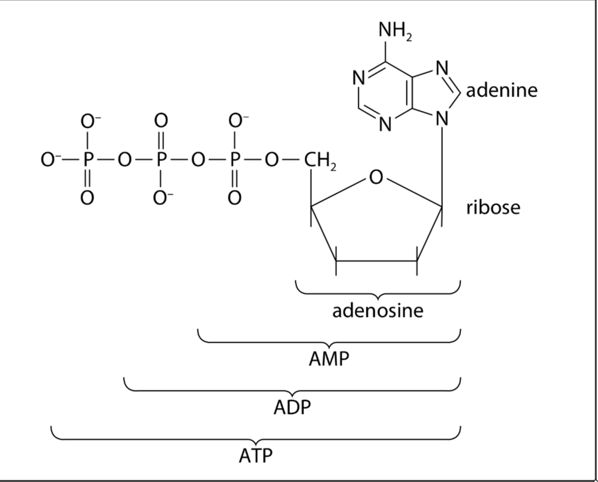
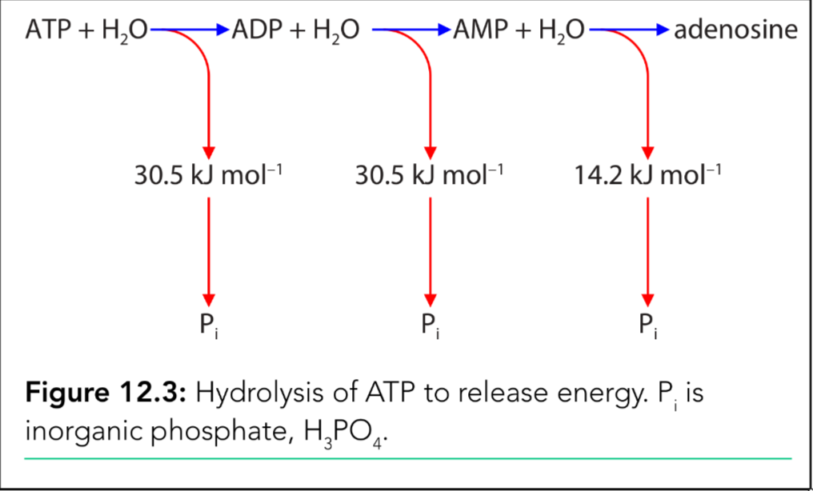
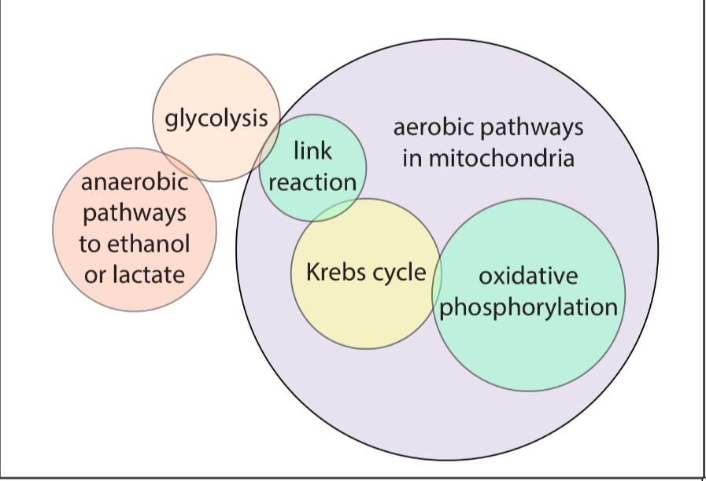
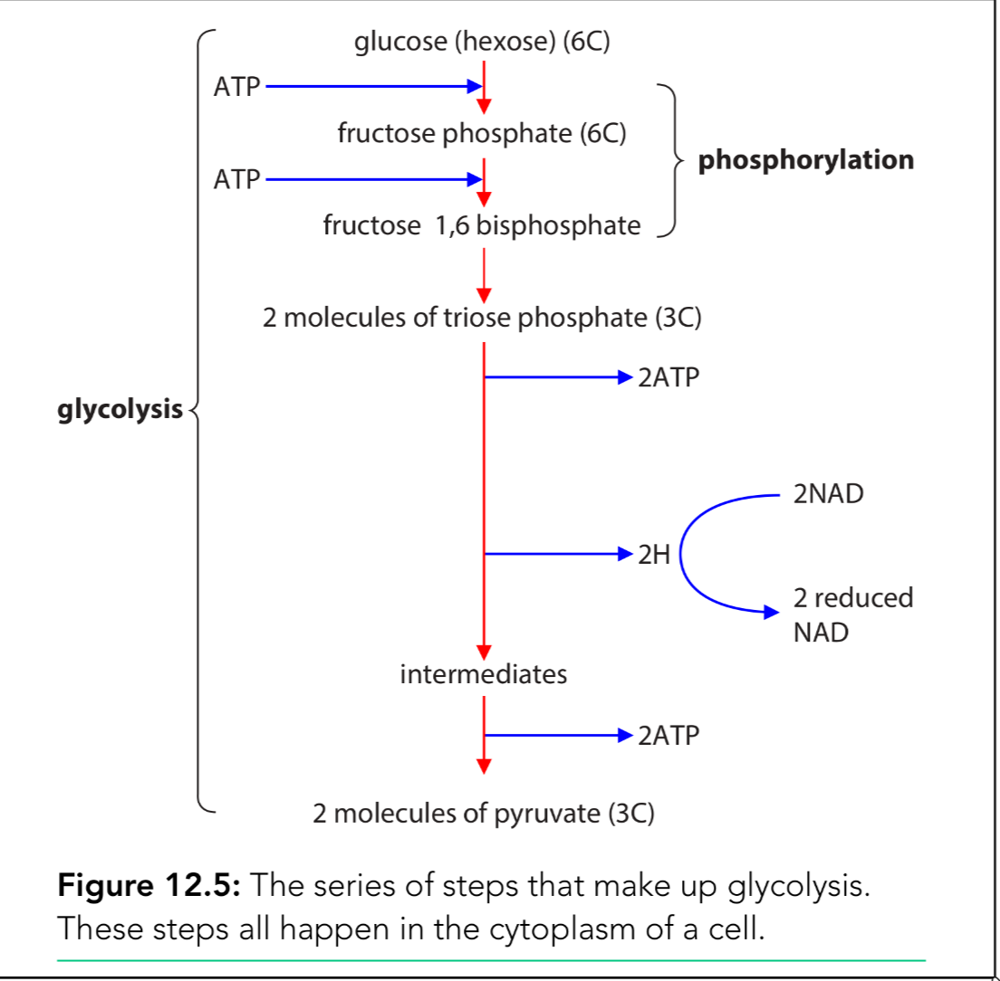
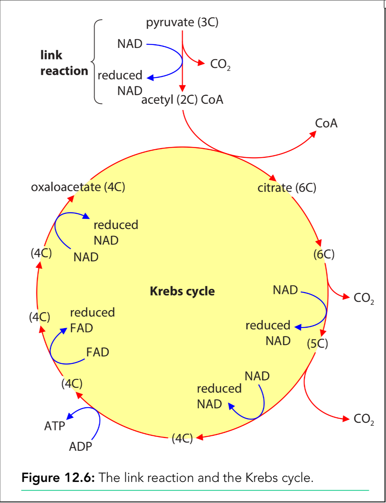
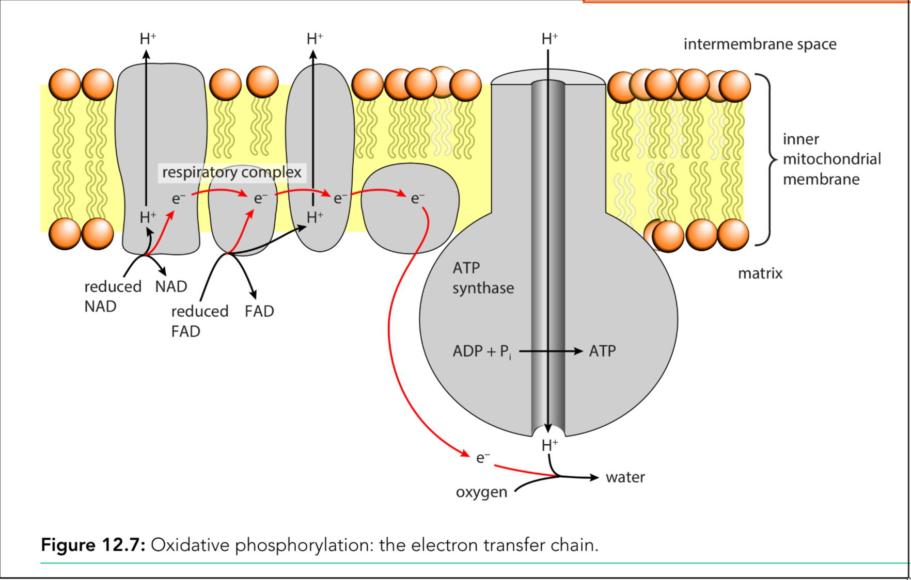
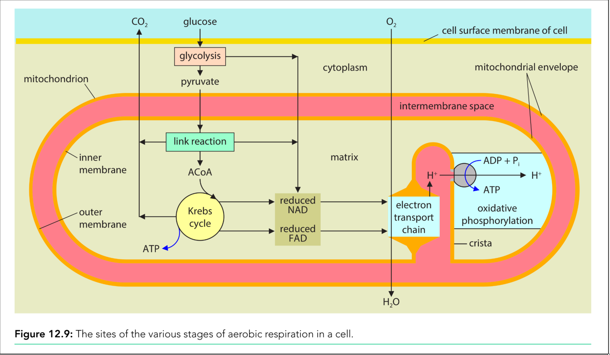

# Energy and respiration

- [ ] ATP
- [ ] Aerobic Respiration
- [ ] Mitochondrial Structure and Function
- [ ] Anaerobic Respiration
- [ ] Respiratory Substrates

## ATP

**ATP** is an <u>universal energy currency</u>:

- it's produced by **Energy-yielding reactions**
- it's used by **Energy-requiring reactions**

$$
\mathrm{ATP + H_2O \rightleftharpoons ADP + P_i}
$$

Uses of ATP - energy-requiring reactions:

- protein synthesis
- DNA replication
- active transport / bulk transport
- muscle contraction
- bioluminescence
- movement of cilia and flagella

Energy-yielding reactions:
$$
\begin{array}{ll}
\text{Oxgyen present:} & \\
\textbf{aerobic respiration} & \\
\mathrm{C_6H_{12}O_6 + 6O_2 \rightarrow 6CO_2 + 6H_2O} & \text{+ large amount of} \\
& \text{ATP per glucose molecule} \\
\\
\text{Oxgyen absent:} & \\
\textbf{anaerobic respiration} & \\
\text{① yeast/plant} & \\
\mathrm{C_6H_{12}O_6 \rightarrow 2C_2H_5OH + 2CO_2} & \text{+ small amount of} \\
& \text{ATP per glucose molecule} \\
\text{② animal} & \\
\mathrm{C_6H_{12}O_6 \rightarrow 2C_3H_6O_3} & \text{+ small amount of} \\
\text{Glucose \quad Lactic acid} & \text{ATP per glucose molecule} \\
\end{array}
$$
Structure of ATP:

Hydrolysis of ATP:

- addition of water
- to break the bonds between phosphate groups
- energy is released

**Universal energy currency**

- store of energy
- produced from respiration
- used to transfer energy (currency)
- in all cells (universal)
- soluble in water, so can move within cells
- the conversion of ADP and ATP is a reversible reaction
- links energy-yielding reaction and energy-requiring reactions
- high turnover rate (能更加有效的储存能量)

ATP makes the perfect energy currency for a number of reasons:

1. The hydrolysis of a molecule of ATP can be done **quickly and easily**, in whichever part of the cell the energy is required.
2. The hydrolysis of one molecule of ATP **releases a useful quantity of energy** – enough to fuel an energy-requiring process in a cell, but not so much that it will be wasted.
3. ATP is a **relatively stable molecule in the range of pH** that normally occurs in cells; it does not break down unless a catalyst such as the enzyme ATPase is present.

## Aerobic Respiration

$$
\mathrm{C_6H_{12}O_6 + 6O_2 \rightarrow 6CO_2 + 6H_2O + 32ATP}
$$

ATP中存储的是化学能（chemical potential energy），ATP被水解的时候会释放能量。

植物通过光合作用把光能转化为glucose中的化学能，呼吸作用将glucose中的化学能转化为ATP中的化学能。

上面有氧呼吸是一个整体的作用，里面被分为了四个主要的中间步骤。

There are 4 stages in aerobic respiration:

1. Glycolysis - Cytoplasm
2. Link Reaction - Mitochondrial matrix
3. Krebs Cycle - Mitochondrial matrix
4. Oxidative Phosphorylation - Inner mitochondrial membrane

### Glycolysis

> The splitting of glucose

Location: **cytoplasm** (glycolysis的产物会进入mitochondria)

在glycolysis中，一个glucose分子最终会被拆成两个pyruvate分子，一个pyruvate分子包含三个碳原子（3C）。

在这个步骤中，ATP会被消耗掉（不是产生），但是能量会在之后的步骤中释放出来，并形成ATP。

Glycolysis的第一步是phosphorylation:

这一步中会raise the energy level of the glucose molecules，为了更容易在下一步中发生反应。
$$
\begin{array}{c}
\text{glucose (hexose) (6C)} \\
\xrightarrow{\text{ATP}} \\
\text{fructose phosphate (6C)} \\
\xrightarrow{\text{ATP}} \\
\text{fructose 1,6 bisphosphate} \\
\downarrow \\
\text{2 molecules of triose phosphate (3C)}
\end{array}
\quad \left\}
\begin{array}{c}
\\ \\ \text{phosphorylation}
\end{array}
\right.
$$

---

Steps of Glycolysis:

1. glucose中加入两个ATP，经过phosphorylation后形成两个triose phosphate (3C)

2. 两个$P_i$从中间产物上被移除下来，去磷酸化（phosphorylase）环境中的两个$ADP$并形成两个$ATP$

3. 两个氢原子被移除下来，这两个氢原子将两个NAD分子还原，形成两个reduced NAD / NADH

   > 添加$H$ - reduction
   >
   > 添加$O$ - oxidation

   > 中间产物脱下来两个氢被称之为：dehydrogenation (de-hydrogen-a-tion)
   >
   > 帮助这个反应发生反而酶叫作：dehydrogenase (de-hydrogen-ase)

4. 在从中间产物生成pyruvate的过程中，两个intermediates各自贡献两个$P_i$到环境中的ADP，形成两个ATP

> ATP添加到中间反应物时：环境中的ATP经过hydrolysis，产生一个$ADP$和一个$P_i$，$P_i$再添加到中间产物上
>
> ATP在图表上离开中间物时：中间产物贡献$P_i$，与环境中的ADP发生反应形成ATP
>
> - 细胞中的ADP直接接收从中间产物上脱下来的$P_i$被称之为：**substrate-linked phosphorylation** (为了与之后的oxidative phosphorylation做区分)

在glycolysis中，先是在phosphorylation中消耗了两个ATP，再在后面步骤中产生了四个ATP，所以在glycolysis中净产生了两个ATP：

- the net production of ATP in glycolysis is 2

---

Purposes of phosphorylation:

- raise the energy level
- make the glucose cannot leave the cell
- decrease the stability of glucose (so it can split into 2 triose phosphate molecules)

---

| Stage          | Location  | Simplified equation (not balanced) | ATP, NADH and FADH₂ yield |
| :------------- | :-------- | :--------------------------------- | :------------------------ |
| **glycolysis** | cytoplasm | glucose → 2pyruvate + 2ATP + 2NADH | 2ATP, 2NADH            |

Lastly, pyruvate moves across the mitochondrial membranes by active transport (require a small amount of ATP), and enters the mitochondrial matrix.

### Link Reaction

Location: **mitochondrial matrix**

Link reaction是一个相对而言比较简单的过程，link reaction之所以叫这个名字，是因为它连接了glycolysis和Krebs cycle。
$$
\begin{array}{c}
\text{pyruvate (3C)} \\
\begin{array}{cc}
\xrightarrow{\text{\textcolor{gray}{decarboxylation}}} & \text{CO}_2 \searrow \\
\downarrow & \\
\text{acetyl (2C) CoA} & 
\end{array} \\
\begin{array}{c}
\text{NAD} \xrightarrow{\text{\textcolor{gray}{dehydrogenation}}} \text{reduced NAD}
\end{array}
\end{array}
\quad \left\}
\begin{array}{c}
\\ \\ \text{\textbf{link}} \\ \text{\textbf{reaction}}
\end{array}
\right.
$$

1. decarboxylation: the removal of a carbon dioxide
2. dehydrogenation: the removal of a hydrogen molecule ($\mathrm{NAD \rightarrow reduced NAD / NADH}$)
3. the remainder of the molecule combines with coenzyme A (CoA) o produce acetyl coenzyme A (acetyl CoA)

$$
\text{pyruvate} + \text{CoA} + \text{NAD} \longrightarrow \text{acetyl CoA} + \text{carbon dioxide} + \text{reduced NAD}
$$

### Krebs Cycle

Krebs cycle also known as *citric acid cycle*

Location: **mitochondrial matrix**

The Krebs cycle is a circular pathway of enzyme-controlled reactions:

1. Acetyl coenzyme A (2C) combines with oxaloacetate (4C) to form citrate (6C).
   $$
   \mathrm{acetyl(2C)\space CoA + oxaloacetate(4C) \rightarrow CoA + citrate(6C)}
   $$

2. The citrate is decarboxylated and dehydrogenated in a series of steps.

   - release carbon dioxide (as a waste gas)
   - release hydrogens, which are accepted by the carriers NAD and FAD

3. Oxaloacetate is regenerated (为了准备进去下一个循环)

---

Krebs cycle summary:

1. Carbon Release (Decarboxylation)
   - **2 Carbon Dioxide (2$CO_2$)** molecules are produced.

2. Reduction Reactions (Electron Carriers)

   - **1 FAD** molecule is reduced → $FADH_2$

   - **3 NAD** molecules are reduced → $3NADH$

3. Energy Generation
   - **1 ATP** molecule is generated, through **substrate-linked reaction**

$$
\text{Precursors} \rightarrow 2\text{CO}_2 + 1\text{FADH}_2 + 3\text{NADH} + 1\text{ATP}
$$

### Oxidative Phosphorylation

Location: inner mitochondrial membrane

> It's the synthesis of ATP from ADP and Pi

1. Reduced NAD and reduced FAD transfer and release **hydrogen atoms** to ETC

2. $\mathrm{H \rightarrow H^+ + e^-}$

3. As the electron moves along the ETC, energy is released.

   > Some of the energy is used to actively move protons from the mitochondrial matrix into the intermembrane spase.
   >
   > This produces a higher concentration of proton in the intermembrane space and creates a **concentration gradient of protons** between the intermembrane space and the mitochondrial matrix

4. **Protons** diffuse back into the mitochondrial matrix by **facilitate diffusion** down their concentration gradient through **ATP synthase** (it serves as transport protein and enzyme)

5. As the protons pass through the ATP synthase, ATP is produced from ADP and Pi by ATP synthase in chemiososis

6. Oxygen is the final electron acceptor
   $$
   \mathrm{O_2 + 4H^+ + 4e^- \rightarrow 2H_2O}
   $$

### Summary

| Stage                     | Location                     | ATP used | ATP made | Net gain in ATP |
| :------------------------ | ---------------------------- | :------- | :------- | :-------------- |
| glycolysis                | cytoplasm                    | 2        | 4        | 2               |
| link reaction             | mitochondrial matrix         | 0        | 0        | 0               |
| Krebs cycle               | mitochondrial matrix         | 0        | 2        | 2               |
| oxidative phosphorylation | inner mitochondrial membrane | 0        | 28       | 28              |
| **Total**                 |                              | **2**    | **34**   | **32**          |

## Mitochondrial Structure and Function

Structures:

- outer membrane
- inter-membrane space
- inner membrane -> fold and form cristae
- mitochondrial envelope
- matrix

除此之外，mitochondria作为古代的prokaryote细胞，它里面还有：

- 70S ribosome
- circular DNA

## Respiratory Substrates

A coenzyme 辅酶 / cofactor 辅因子 is a non-protein compound that aids the function of an enzyme or is required for a protein's biological activity

每当中间产物脱下来一个分子时，必须要有一个coenzyme或cofactor接住，再运给下一个步骤，例：

- 当中间产物脱下来一个H时，NAD会变成reduced NAD
- 当中间产物脱下来一个acetyl group时，coenzyme A / CoA 会变成acetyl CoA

> **coenzyme A**:
>
> - transfer acetyl group
> - $\mathrm{acetyl\space fragnent + oxaloacetate \rightarrow citrate}$
> - joins link reaction and Krebs cycle

> **NAD / FAD**:
>
> - transfer $H^+$ by <u>dehydrogenation</u>
> - transport to ETC
> - NAD accepts H in glycolysis, link reaction and Krebs cycle

### Carrier of hydrogen

- NAD - reduced NAD / NADH
- FAD - reduced FAD / FADH_2
- NADP - reduced NADP / NADPH
