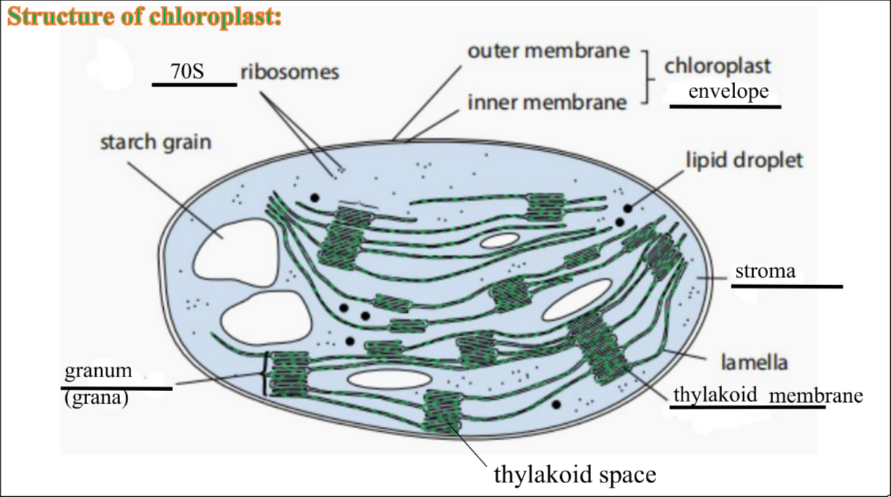
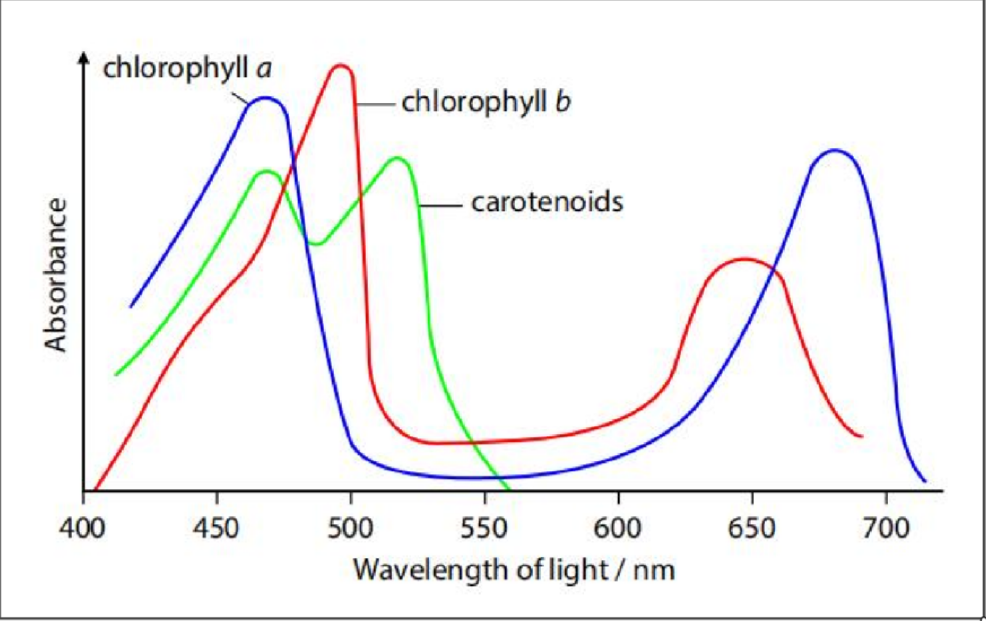
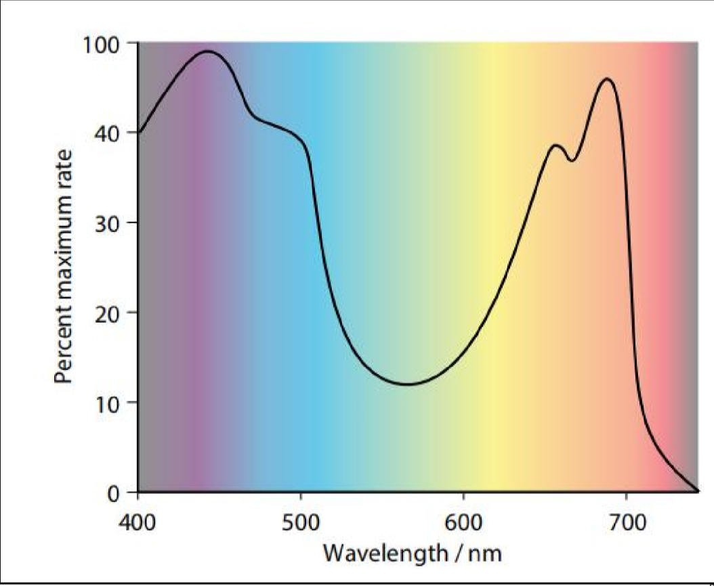
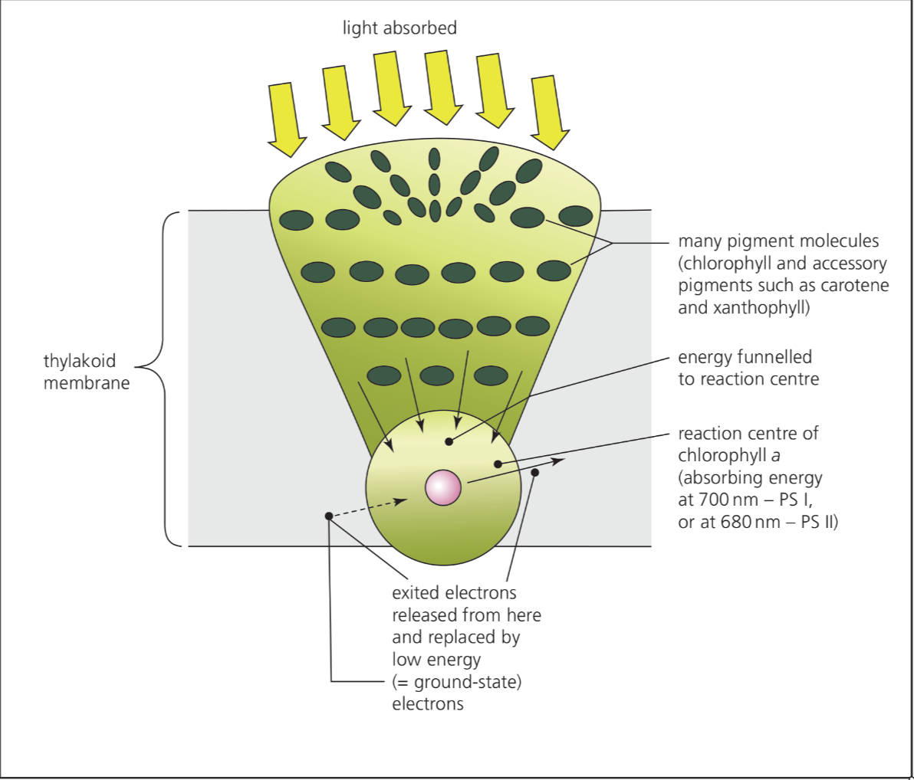
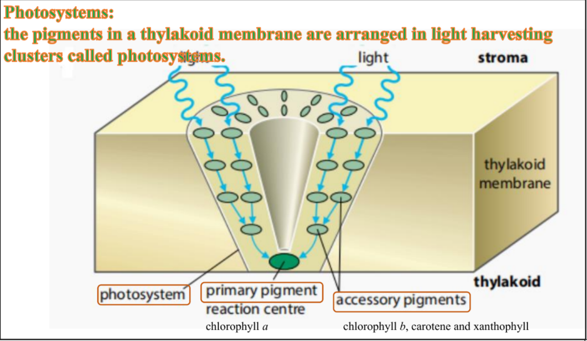
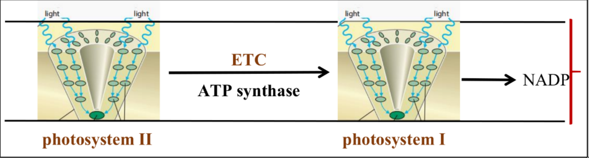
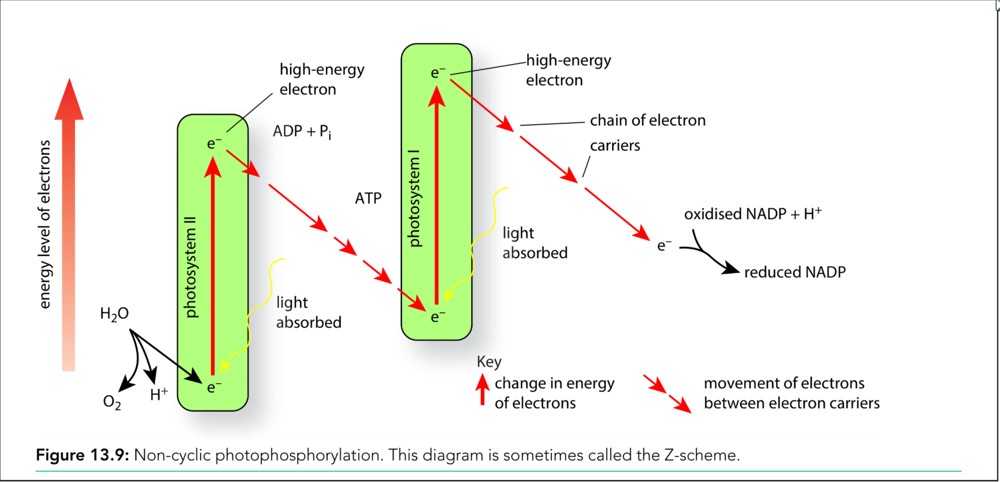
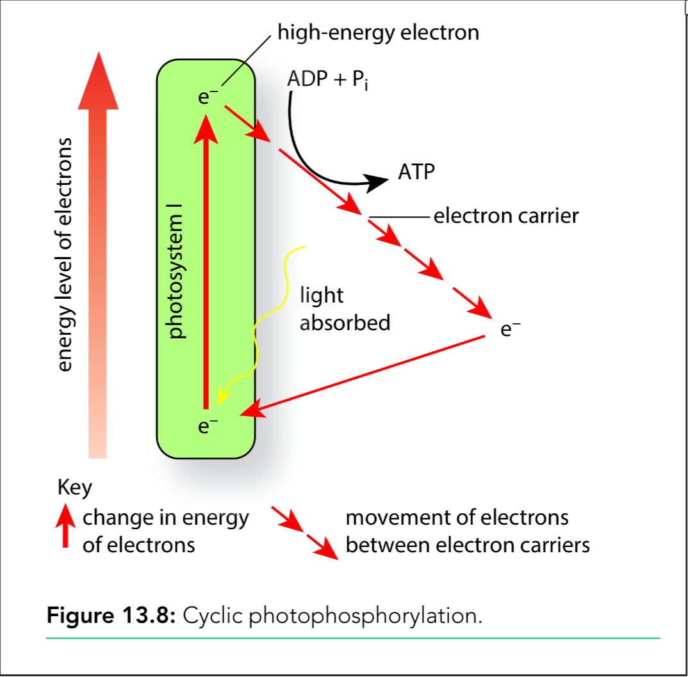
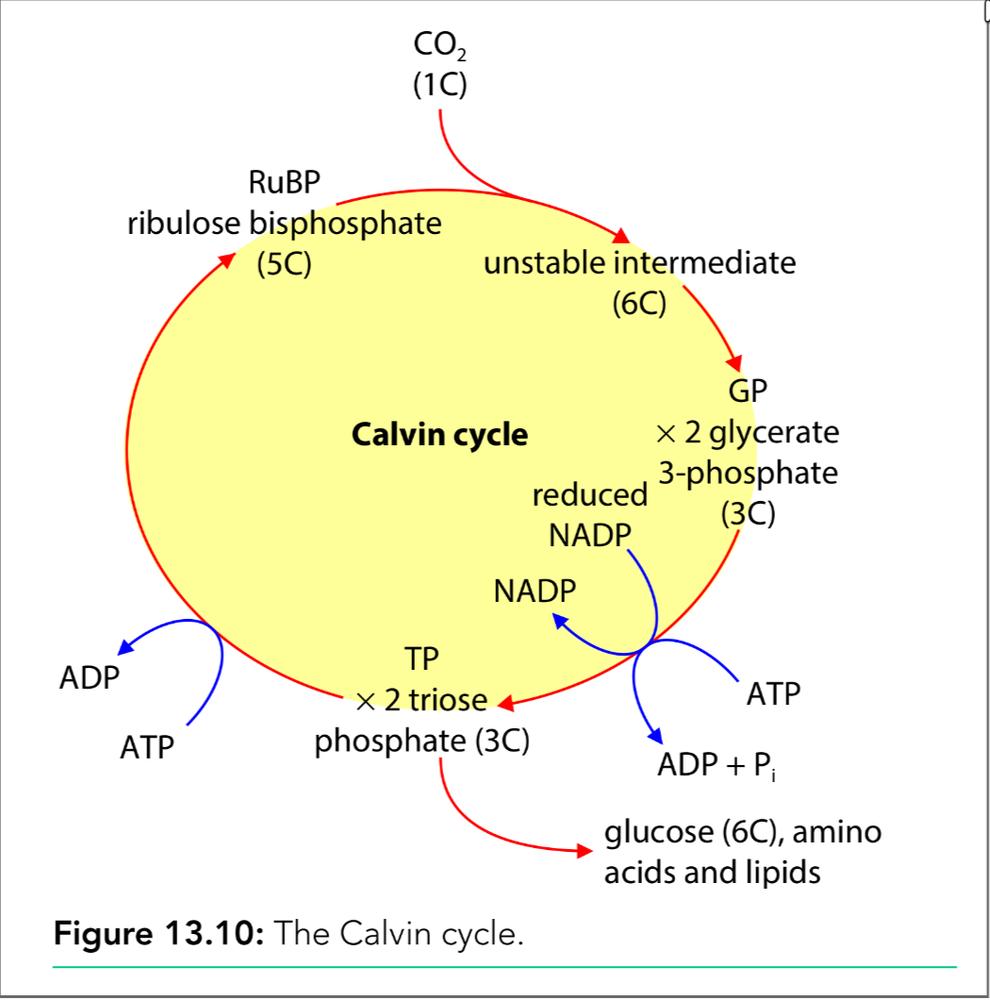
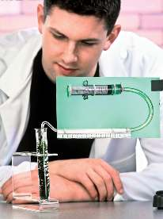

# Photosynthesis

## Energy Transfer Process

Chloroplast - the site of photosynthesis

- double membrane
- thylakoid membrane -> grana / granum (single)
- stroma

> Other components:
>
> - strchh grains
> - lipid droplets
> - ribosomes

Photosynthesis将光能转化为化学能，存储在sugar中（from **sunlight energy** to **chemical potential energy**）
$$
\mathrm{carbon\ dioxide} + \mathrm{water} + \mathrm{energy} \rightarrow \mathrm{glucose} + \mathrm{oxygen}
\\
6\mathrm{CO}_2 + 6\mathrm{H}_2\mathrm{O} + \mathrm{energy} \rightarrow \mathrm{C}_6\mathrm{H}_{12}\mathrm{O}_6 + 6\mathrm{O}_2
$$

- carbon dioxide is reduced （二氧化碳失去了氧）
- oxygen is used in respiration, or diffuses into the environment

Plants can provide nutrients by their own for all the synthesis of all the metabolities the plant needs. 这种self-feeding的行为被成为**autotrophic nutrition**

Photosynthesis **converts inorganic carbon to organic carbon**

> Compounds containing <u>carbon combined with hydrogen</u> are known as **organic compounds**

## Structure and Function of Chloroplast

Photosynthesis分为两个stage：

- light dependent stage - in the thylakoid membranes / in the membranes of the grana

  > The membranes of thylakoids hold **photosynthetic pigments**, including:
  >
  > - chlorophyll *a*
  > - chlorophyll *b*
  > - carotene 胡萝卜素
  > - xanthophyll 叶黄素

- light independent stage - in the stroma of the chloroplast

| Structure of chloroplast                                     | Function or role                                             |
| ------------------------------------------------------------ | ------------------------------------------------------------ |
| Double membrane bounding the chloroplast                     | Contains the grana and stroma, and is permeable to CO₂, O₂, ATP, sugars and other products of photosynthesis |
| Photosystems with chlorophyll pigments arranged on thylakoid membranes of grana | Provide **huge surface area** for maximum light absorption   |
| Thylakoid spaces within grana                                | Restricted regions for accumulation of protons and establishment of the gradient |
| Fluid stroma with loosely arranged thylakoid membranes       | Site of all the enzymes of fixation, reduction and regeneration of acceptor steps of light-independent reactions, and many enzymes of the product synthesis steps |

### Absorption Spectrum

> A graph showing the absorbance of different wavelengths of light by a photosynthetic pigment 展示光的吸收率

- Chlorophylls mainly **absorb red and blue-violet light** and **reflect green light** (so they look green)
- Carotenoids mainly **absorb th blue-violet light**

### Action Spectrum

> A graph showing the **rate of photosynthesis** at different wavelengths of light
>
> 展示植物在不同光线下光合作用的速率

如图所示，植物在red和blue-violet光下的**速率最高**

### Photosystems

The pigments in a thylakoid membrane are arranged in **light harvesting clusters** called photosystems

1. The accessory pigments (chlorophyll *b*, carotene and xanthophyll) absorb light energy, and channel it to the reaction centre
2. Chlorophyll *a* (in reaction centre) 's **energy level of electrons is increased** 
3. The energy causes the reaction to happen

There are two types of photosystem:

- Photosystem I (**PSI**) - main wavelength of light absorbed is **700 nm**

  The reaction centre chlorophyll *a* is **P700**

- Photosystem II (**PSII**) - main wavelength of light absorbed is **680 nm**

  The reaction centre chlorophyll *a* is **P680**

## The Light Dependent Stage

### Non-cyclic Photophosphorylation

*non-cyclic photophosphorylation* [photo-phosphor-yl-ation]

1. **At PSII**

   Accessory pigments (chorophyll *b*, carotene and xanthophyll) 吸收并将能量传递至reaction centre chlorophyll *a*:

   - this raises the energy level of electrons in chlorophyll *a*
   - electrons get excited and emitted

   This is **photoactivation of chlorophyll *a*** [photo-activation]

   > Photosystem II includes a water splitting enzyme, **oxygen-evolving complex / water-splitting enzyme**.
   >
   > Water splits into hydrogen ions (protons), electrons and oxygen, this is called **photolysis**:
   > $$
   > \text{H}_2\text{O} \rightarrow 2\text{H}^+ + 2\text{e}^- + \frac{1}{2}\text{O}_2
   > $$

   Electrons from water-splitting pass to PSII to replace those lost (PSI中的电子会在最后一步用来还原NADP，所以需要由PSII中的photolysis提供电子)

   > [!IMPORTANT]
   >
   > 在PSII中会在最后一步**产生氧气**，这是PSII和PSI之间显著的区别，这也是non-cyclic和之后提到的cyclic之间显著的区别。

2. **Electron transport chain (ETC) and ATP synthase**

   1. The **high-energy electron** is captured by an electron acceptor
   2. the electron is passed along the electron transport chain (ETC)
   3. releasing energy

   这里释放的一部分能量被用来：active transport the protons (hydrogen ions) from stroma into the thylakoid space (进入叶绿体里面的小囊中)

   - this sets up a **concentration gradient of protons**

   这些protons在concentration gradient的作用下，通过facilitated diffusion经过ATP synthase回到stroma。

   在经过ATP synthase的时候，**chemiosmosis**发生了：ATP is synthesised by 
   adding Pi to ADP. （这个作用和aerobic respiration的oxidative phosphorylation非常相似）

3. **At PSI** - **photoactivation** of chlorophyll *a* occurs

   Electrons from PSII pass to PSI to replace those lost, PSI receives electrons from PSII

   The high-energy electron is captured by an electron acceptor and then transferred to the coenzyme / hydrogen carrier **NADP**

   - NADP combines with electrons from PSI
   - The hydrogen ions from photolysis of water to produce **reduced NADP / NADPH**

   $$
   \mathrm{H}^+ + \mathrm{e}^- + \mathrm{NADP} \rightarrow \text{reduced NADP}
   $$

| Name                 | Reaction        | Equation                                                     |
| -------------------- | --------------- | ------------------------------------------------------------ |
| Photolysis           | Splitting Water | $2\text{H}_2\text{O} \rightarrow 4\text{H}^+ + 4\text{e}^- + \text{O}_2$ |
| Photophosphorylation | Making ATP      | $\text{ADP} + \text{P}_i \rightarrow \text{ATP}$             |
| Reduction            | Making NADPH    | $\text{NADP}^+ + \text{e}^- \rightarrow \text{NADPH}$        |

描述non-cyclic photophosphorylation的图像又被成为**Z-scheme**

---

> [!NOTE]
>
> Mark scheme对“Describe how <u>non-cyclic</u> photophosphorylation produces ATP and reduced NADP”的回答：
>
> 1. PSII and PSII involved
> 2. light harvesting clusters (这是什么？)
> 3. light absorbed by accessory pigments
> 4. primary pigment (reaction centre) is chlorophyll *a*
> 5. <u>energy</u> passed to primary pigment / chlorophyll *a*
> 6. electrons raised to higher energy level
> 7. electrons taken up by electron acceptor
> 8. electrons passed down electron carrier chain
> 9. PSII has water splitting enzyme
> 10. water split into hydrogen ions, electrons, and oxygen
> 11. ... through <u>photolysis</u>
> 12. electrons from <u>PSII</u> pass to PSI
> 13. ... to replace those lost
> 14. protons and electrons combine with NADP to produce <u>reduced NADP</u>

### Cyclic Photophosphorylation

After a long day of sun, **NADPH** is being used in Calvin cycle and there is no (oxidised) NADP to combine with the electron from PSI in the light dependent stage.

在经过很长一段的阳光照射下，NADPH会被在Calvin cycle中被使用，导致没有足够的NADP可以在PSI中和电子结合。

为了避免这个情况，

1. At PSI, electron in chlorophyll *a* gets excited and emitted. (Photoactivation of chlorophyll *a* occurs)
2. The high-energy electron is captured by an electron acceptor and passed along ETC (release energy)
3. ATP is made by ATP synthase in chemiosmosis
4. The electron returns to PSI
5. Only PSI is involved

> [!NOTE]
>
> Describe the process of **cyclic** photophosphorylation and the **structure** of the photosystem involved:
>
> *cyclic photophosphorylation*
>
> - only PSI / P700 involved
> - light <u>energy</u> absorbed
> - electron becomes excited
> - electron is emitted from chlorophyll (excited和emitted是两个不同的点)
> - electron passes through the ETC
> - ATP is produced through the chemiosmosis of ATP synthase
> - electron returns to PSI
>
> *photosystem*
>
> - pigments arranged in light-harvesting clusters
> - chlorophyll *a* is located in the reaction centre
> - accessory pigments surround primary pigment
> - photosystem located in thyalkoid

---

### Summary

Cyclic photophosphorylation:

- only PSI is involved
- photoactivation of chlorophyll occurs
- ATP is synthesised

Non-cyclic photophosphorylation:

- both PSI and PSII are involved
- photoactivation of chlorophyll occurs
- water-splitting complex catalyse the photolysis of water
- ATP and reduced NADP are synthesised

不管是cyclic还是non-cyclic，它们都：

- 有photoactivation of chlorophyll *a*
- electrons move along the ETC
- chemiosmosis occurs (and ATP is produced)

它们之间的区别在于：

| non-cyclic                        | cyclic              |
| --------------------------------- | ------------------- |
| 有**PSII和PSI**的参与             | **只有PSI**的参与   |
| **产生氧气**（photolysis occurs） | 不产生氧气          |
| 有**NADPH**的参与                 | 没有NADPH           |
| 电子最终用于还原NADP              | 电子会**回到PSI**中 |

> - 氧气会在light dependent stage中的PSII中产生，而PSII只参与non-cyclic photophosphorylation，所以只会在non-cyclic中产生氧气
> - cyclic发生的根本原因就在于没有足够的NADP来回收电子，所以更不会有NADP的参与
> - 同理，cyclic中无法回收的电子会回到PSI中

## The Light Independent Stage

This process is located in the **stroma of the chloroplast**

在light-dependent stage中产生的ATP和reduced NADP / NADPH会在light-independent stage中被使用，用于将*二氧化碳*转换为*碳水化合物*，这个过程叫作“**Calvin cycle**”

这一步不需要来自光线的能量，同时是产生碳水化合物的stage，也就是说light-independent stage可以在黑暗的环境下进行，不过这个stage所以依赖的输入来自light-dependent stage，所以不能长时间在黑暗的环境下进行。

1. **Carbon Fixation**

   1. Carbon dioxide combines with a 5C compound called **ribulose bisphosphate (RuBP)**
   2. which is catalysed by an enzyme called *ribulose bisphosphate carboxylase*, or **rubisco**
   3. and form an **unstable 6C compound**
   4. then the 6C compound splits into 2 **glycerate-3-phosphate (GP)** molecules (3C)

   Carbon fixation中的“fixed”指的是碳被变成了植物细胞的一部分。

   这一步中产生的GP并不是碳水化合物，但是它会在下一步中转换成碳水化合物。
   $$
   \mathrm{CO_2 + C_5H_8O_{11}P_2 \ (RuBP) \xrightarrow{rubisco} C_6H_{10}O_{15}P_2 \ (unstable \ 6C \ intermediate)}
   
   \\ \\
   
   \mathrm{C_6H_{10}O_{15}P_2 + H_2O \rightarrow 2 \ C_3H_5O_6P \ (glycerate-3-phosphate)}
   $$
   
2. ATP and NADPH from light dependent stage are used to **reduce GP to TP** (triose phosphate)

3. Most ($\frac{5}{6}$) carbon molecules in TPs are used to **regenerate** RuBP, by using ATP;

   $\frac{1}{6}$ is used in respiration, to produce **glucose**, **amina acid**, **fatty acids**, etc.

> 如果有10个TP分子，则总共有10\*3个碳原子，被用于合成RuBP的碳原子有30\*5/6个（25个），也就是有5个RuBP分子

> [!NOTE]
>
> [Past Paper Question] Outline the steps of the Calcin Cycle:
>
> 1. RuBP combines with carbon dioxide
> 2. ... by enzyme rubisco
> 3. forms unstable 6C compound
> 4. then produces 2 GP molecule
> 5. GP is reduced to TP
> 6. ... by reduced NADP and ATP
> 7. ... from light dependent stage
> 8. TP is used to regenerate RuBP
> 9. ... using ATP
> 10. TP can form further carbohydrate compound, fatty acid or amino acid

## Limiting Factors

**Limiting factor** - the <u>requirement</u> for a process to take place that is in the shortest supply; an increase in this factor will allow the process to take place more rapidly

- the presence of photosynthetic pigments （发生位置）
- a supply of carbon dioxide（反应物）（use **sodium hydrogencarbonate** to control the concentration of carbon dioxide）
- a supply of water （反应物）
- light energy （发生条件）
- a suitable temperature （发生条件）

## Experiments

### Chromatography

This experiment is aimed to identify the type of Chloroplast Pigments.

> Different pigments have different solubility in the solvent, which causes them to travel at different speeds up the paper.

- Independent Variable - type of pigment
- Dependent Variable - the distance traveled by each pigment spot (used to calculate the Rf value)

Method:

1. Extract the pigments

2. Prepare the chromatography paper

3. Apply the sample

4. Put the chromatography paper into the solvent (the base line must above the solvent level)

5. Wait for the seperation

6. Measure the distance traveled by the solvent

7. Measure the distance traveled by the sample

8. Calculate the Rf value
   $$
   Rf = \frac{\text{Distance travelled by pigment spot}}{\text{Distance travelled by solvent}}
   $$

| Pigment Name / Color                 | Distance from Origin (cm) | Solvent Front Distance (cm) | Calculated Rf Value |
| :----------------------------------- | :------------------------ | :-------------------------- | :------------------ |
| *e.g., Carotenoid (Yellow-Orange)*   |                           |                             |                     |
| *e.g., Chlorophyll a (Blue-Green)*   |                           |                             |                     |
| *e.g., Chlorophyll b (Yellow-Green)* |                           |                             |                     |
| *e.g., Unknown Pigment*              |                           |                             |                     |

### Investigate the Rate of Photosynthesis by Photosynthometer 

### Using a Redox Indicator to Measure Photosynthesis Rate

- **Independent Variables:**
  - **Light Intensity** (e.g., varied by changing the distance of the light source or using neutral density filters).
  - **Light Wavelength/Colour** (e.g., using different colored filters or LED lights of the same intensity).
- **Dependent Variable:**
  - **Time taken for the redox indicator (DCPIP/methylene blue) to decolorise** (measured in seconds or minutes). 

Measure the dependent variable:

- record the time to change color
- compare the darkness of color in a unit time

## Keywords

1. **Chlorophyll** - 叶绿素 A green pigment responsible that absorbs energy from light, used in photosynthesis
2. **Light-dependent stage** - 光反应阶段 The first series of reactions that take place in photosynthesis; it requires energy absorbed from light
3. **Light-independent stage** - 暗反应阶段 The final series of reactions that take place in photosynthesis; it does not require light but does need substances that are produced in the light- dependent stage
4. **NADP** - 烟酰胺腺嘌呤二核苷酸磷酸 (NADP) A coenzyme that transfers hydrogen from one substance to another, in the reactions of photosynthesis 
5. **Photolysis** - 光解 Splitting a water molecule, using energy from lightH2O → 2H+ + 2e− + O2
6. **Photophosphorylation** - 光磷酸化 Producing ATP using energy that originated as light
7. **Absorption spectrum** - 吸收光谱 A graph showing the absorbance of different wavelengths of light by a photosynthetic pigment
8. **Action spectrum** - 作用光谱 A graph showing the effect of different wavelengths of light on a process, e.g. the rate of photosynthesis
9. **Chromatography** - 色谱法 A technique that can separate substances in a mixture according to their solubility in a solvent
10. **Lamellae** - 层状体 Membranes found within a chloroplast
11. **Photosynthetic pigments** - 光合色素 Coloured substances that absorb light of particular wavelengths, supplying energy to drive the reactions in the light-dependent stage of photosynthesis
12. **Photosystem** - 光系统 A cluster of light-harvesting pigments surrounding a reaction centre
13. **Reaction centre** - 反应中心 The part of a photosystem towards which energy from light is funnelled; it contains a pair of chlorophyll a molecules, which absorb the energy and emit electrons
14. **Rf value** - Rf值 A number that indicateshow far a substance travels during chromatography, calculated by dividing the distance travelled by the substance by the distance travelled by the solvent; Rf values can be used to identify the substance
15. **Stroma** - 基质 The background material in a chloroplast in which the light-independent stage of photosynthesis takes place
16. **Thylakoid membranes** - 类囊体膜 The membranes inside a chloroplast that enclose fluid-filled sacs; the light-dependent stage of photosynthesis takes place in these membranes
17. **Thylakoid spaces** - 类囊体空间 Fluid-filled sacs enclosed by the thylakoid membranes
18. **Cyclic photophosphorylation** - 环式光磷酸化 The production of ATP using energy from light, involving only photosystem I 
19. **Non-cyclic photophosphorylation** - 非环式光磷酸化 The production ATP using energy from light, involving both photosystem I and photosystem II; this process also produces reduced NADP
20. **Oxygen-evolving complex** - 产氧复合体 An enzyme found in photosystem II that catalyses the breakdown of water, using energy from light
21. **Photoactivation** - 光激活 The emission of an electron from a molecule as a result of the absorption of energy from light
22. **Glycerate-3-phosphate (GP)** - 甘油酸-3-磷酸 (GP) A three-carbon compound which is formed when RuBP combines with carbon dioxide
23. **Ribulose bisphosphate (RuBP)** - 核酮糖-1,5-二磷酸 (RuBP) A five-carbon phosphorylated sugar which is the first compound to combine with carbon dioxide during the light- independent stage of photosynthesis
24. **Rubisco** - 核酮糖二磷酸羧化酶/加氧酶 (Rubisco) The enzyme that catlalyses the combinbation of RuBP with carbon dioxide
25. **Triose phosphate (TP)** - 磷酸丙糖 (TP) A three-carbon phosphorylated sugar, the first carbohydrate to be formed during the light-independent stage of photosynthesis
26. **Limiting factor** - 限制因素 The requirement for a process to take place that is in the shortest supply; an increase in this factor will allow the process to take place more rapidly
