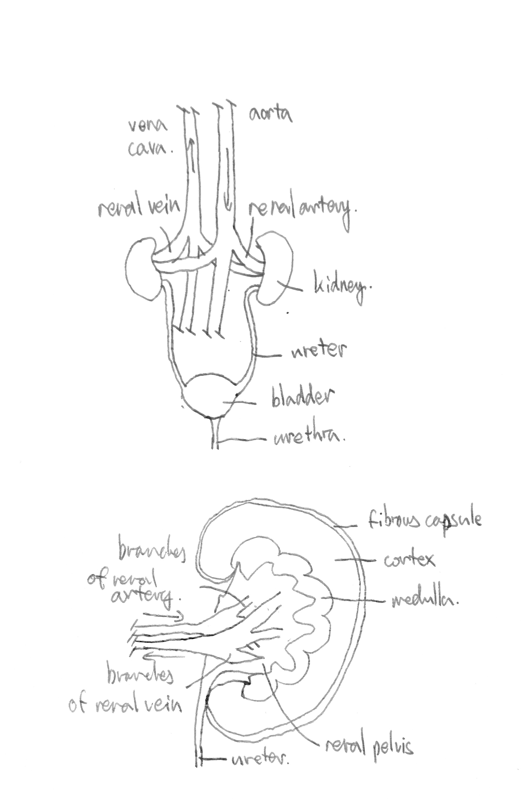
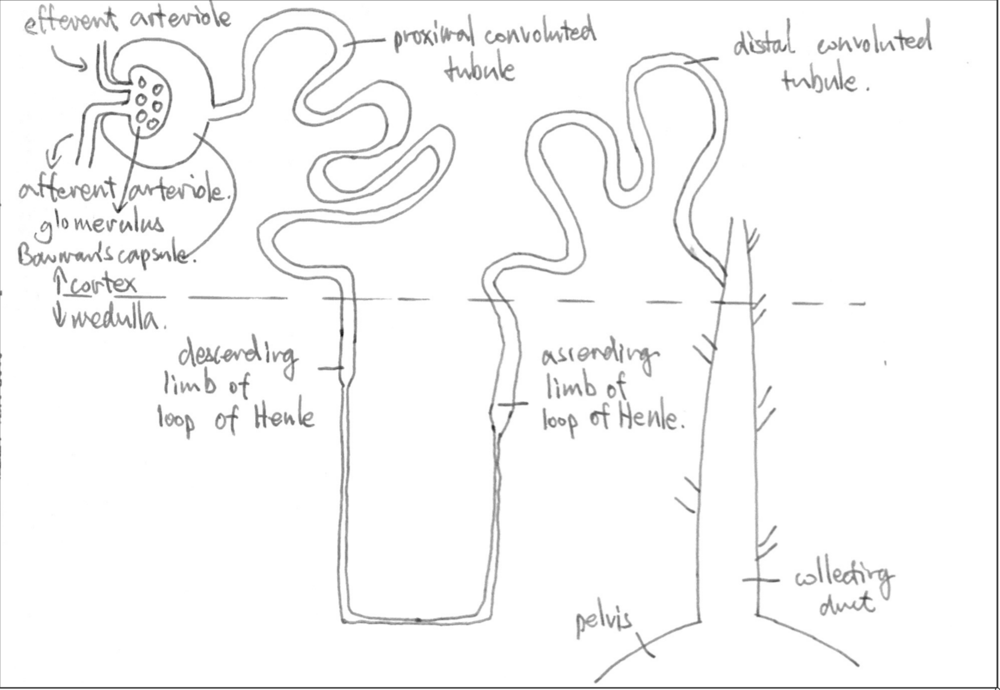
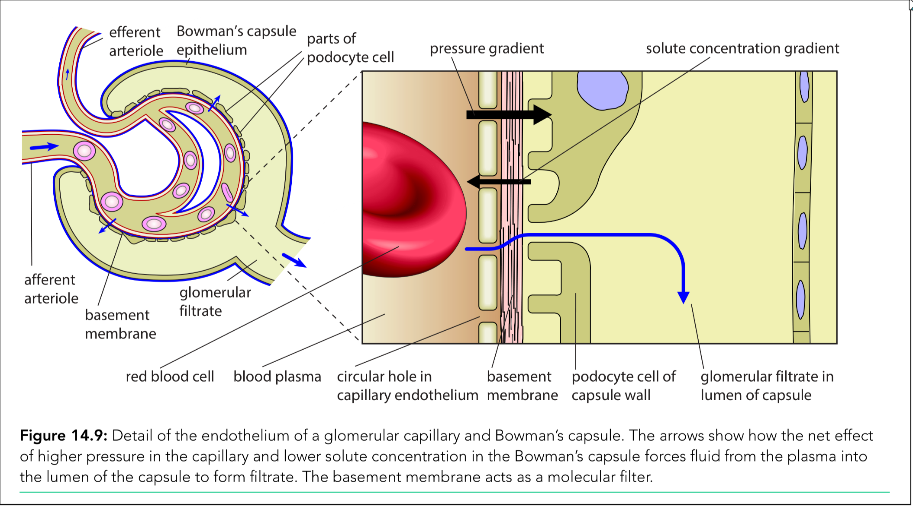
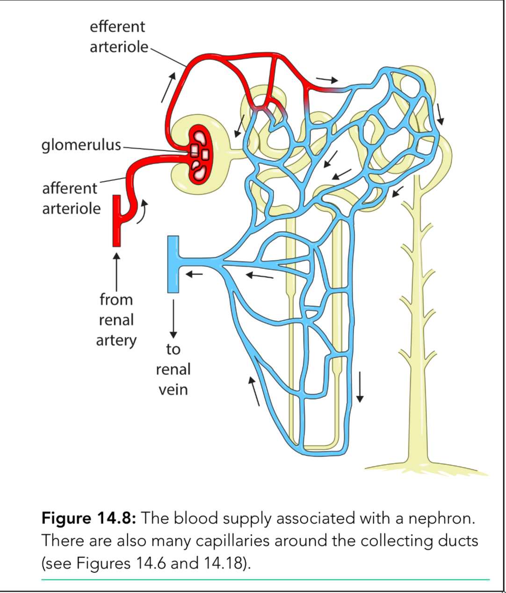
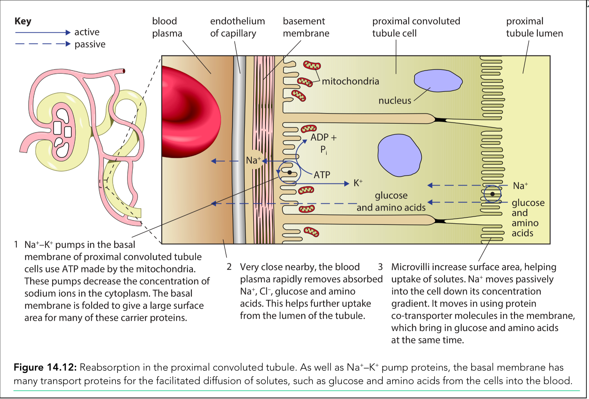

# Homeostasis

**Homeostasis** - the maintenance of a <u>relatively constant internal environment</u> for the cells within the body

The physiological factors controlled in homeostasis in mammals:

- core body temperature
- metabolic wastes (carbon dioxide and urea)
- blood pH
- blood glucose concentration
- water potential of the blood

**Internal Environment** - refers to all the conditions inside the body of an organism

| Factor                    | Effect on Cells                                              | Consequences of Imbalance                                    |
| :------------------------ | :----------------------------------------------------------- | :----------------------------------------------------------- |
| **Temperature**           | Metabolic reactions proceed at **normal rates**.             | **Too Low:** Slows down metabolic reactions.  **Too High:** Proteins (including enzymes) denature and lose function. |
| **Water Potential**       | Maintains **normal cell volume** and metabolic activity.     | **Decreases:** Water moves *out* of cells (osmosis). Metabolic reactions slow or stop. **Increases:** Water moves *into* cells. Cells swell and may burst. |
| **Glucose Concentration** | Provides fuel for respiration, **supplying energy** to cells. | **Too Low:** Respiration slows/stops; cells are deprived of energy. **Too High:** Water moves *out* of cells (osmosis), disrupting metabolism. |
| **Metabolic Wastes**      | To be **excreted** out of body                               | **Too High:** alter the blood pH                             |
| **pH**                    | **Enzymes** function efficiently.                            | **Fluctuations outside range:** Enzymes function less efficiently **Extreme values:** Enzymes become denatured. |

## Homeostasis Control

The composition of blood controls the composition of tissue fluid.

The **immediate environment** of body cells is the **tissue fluid** that surround them.

Most control mechanisms in the body use **negative feedback** to keep internal conditions within the range of **set points**

> set point - the ideal value of a factor that the body controls in homeostasis

### Negative Feedback

**negative feedback** - a process in which a change in some parameter brings about processes which return it towards normal

1. the internal or external **stimuli** occur

2. the **receptor** receives the signal

3. **coordination systems** response to the signal (nervous system or endocrine system)

   > Nervous system sends the information in the form of **electrical impulses** through the neurones.
   >
   > Endocrine system sends the information in the form of chemical messengers called **hormones** that travel in the blood.

4. effector carries out an action in response to a stimulus

   > This action also called **corrective action**, bringing the level of a factor to its **set point**

5. The factor returns to set point

### Positive Feedback

当一个人吸入过多二氧化碳时，carbon dioxide receptor会让呼吸速度更快。呼吸速度越快，吸进的二氧化碳就越多，这个receptor会反应地更加强烈，让这个人的呼吸速度越来越快。

Positive feedback cannot play any role in keeping conditions in the body constant

## Excretion

**Excretion** - the removal of toxic or waste products of metabolism and substances in excess of requirements from the body.

The excretory products include:

- carbon dioxode
- urea

Carbon dioxide is excreted out of the body through **lungs**

| Substance                | Excreted By | Source / Production                                       |
| :----------------------- | :---------- | :-------------------------------------------------------- |
| **Carbon Dioxide (CO₂)** | **Lungs**   | **Aerobic respiration** occurring in the **mitochondria** |
| **Urea**                 | **Kidneys** | **Liver** (during the process of **deamination**)         |
| **Excess water & ions**  | **Kidneys** | Derived from **drinks and food** intake                   |

## Deamination

Urea is **produced in the liver** from the deamination of excess amino acid, and transport from the liver to the kidneys in **solution in blood plasma**

In the liver cells, the amine group of an amino acid is removed:
$$
\text{amino acid} \rightarrow \text{ammonia} + \text{keto acid}
$$

- $\text{ammonia}$ - The amine group together with an extra hydrogen atom, and combine to form **ammonia**.
- $\text{keto acid}$ - The rest of the amino acid becomes **keto acid**, that may ...
  - enter the Krebs cycle and be respired
  - converted to glucose
  - converted to glycogen or fat for storage

Ammonia is a **very soluble** and **highly toxic** compound

- 在很多水生动物中，ammonia会从血液中diffuse走，并溶解进水里
- 但是对于很多陆生动物，ammonia会**增加血液中的pH值**，并影响respiration和cell signaling in the brain

所以在哺乳动物中；

- ammonia is immediately converted to urea

- urea is **less soluble** and **less toxic**

- urea cycle (a sequence of reactions) combines **ammonia and carbon dioxide** to from urea
  $$
  \text{ammonia} + \text{carbon dioxide} \rightarrow \text{urea}
  $$

Urea is the main **nitrogenous excretory product** of humans.

## Kidney

Function:

- excretion of urea
- osmoregulation (controlled by hormone ADH, 用来调控collecting duct对水的“透性”)

After urea is produced in liver, the urea travels through:

1. hepatic vein -> vena cava -> heart -> aorta -> renal artery -> kidney
2. kidney -> ureter -> bladder -> urethra

The key structures in renal system:

- fibrous capsule
- cortex
- medulla
- renal pelvis
- ureter
- renal artery / vein

The key structures of nephron:

- arteriole
  - **a**fferent arteriole (进入glomerulus)
  - **e**fferent arteriole (离开glomerulus)

- glomerulus
- Bowman's capsule
- proximal convoluted tubule
- loop of Henle
  - descending limb of loop of Henle
  - ascending limb of loop of Henle
- distal convoluted tubule
- collecting duct
- *pelvis* *(the destination of urine)*

**Ultrafiltration** [ulltra-fil-tra-tion]

> Location: **Bowman's capsule (glomerulus)**

1. Small molecules (amino acid, water, glucose, urea, inorganic ions) are filtered out of the blood capillaries
2. they enter the Bowman's capsule
3. to form **glomerulus filtrate**

**Selective Reabsorption**

> Location: **Proximal convoluted tubule**

1. Useful molecules are taken back (reabsorbed) from the filtrate
2. returned to the blood as the filtrate flows along the nephron

**Osmoregulation** [osmo-regulation]

> Location: **collecting duct**

- control the water potential by controlling the water content, and the concentration of ions, especially the **sodium ion**

### Ultrafiltration

1. Afferent arteriole has a **wider** lumen than efferent arteriole, so there is a **higher blood pressure** in glomerulus, and fluid is <u>forced into Bowman's capsule</u>
2. On the endothelium of glomerulus, there are **many holes** in the endothelial cells and **large gaps** between these cells
3. A **basement membrane** acts as a **molecular filter** to prevent large plasma proteins and cells from passing through
4. There are **filtration slits** between **podocytes** in the epithelium of Bowman's capsule
5. Red blood cells, white blood cells, and large plasma proteins cannot pass through. **Small molecules**, like *glucose, amino acids, urea, water, and ions*, pass through.

> [!IMPORTANT]
>
> Ultrafiltration涉及到的重要结构：
>
> - Glomerulus
>
> - Basement membrane （这不是细胞） - acts as a filter, large proteins cannot pass through
> - Podocytes - have filtration slits, allow filtrate to pass into the lumen (Bowman's capsule). Filtration slits的作用是提供一个通道可以让滤液经过
> - Bowman's capsule

The factors affecting **glomerular filtration rate**:

> Glomerular filtration rate is the rate of fluid filters from the glomerular capillaries into the Bowman's capsule

- efferent arteriole lumen >  afferent arteriole lumen:

  there is a **high blood pressure** in glomerular capillaries, to raise the water potential in the blood

- the solute concentration in glomerular capillaries > Bowman's capsule:

  this lowers the water potential in the glomerular capillaries

Overall, the water potential in the glomerular capillaries  > Bowman's capsule, **water** *moves down the water potential gradient* **from the blood into the capsule**.

### Selective Reabsorption

**Selective reabsorption** - only certain substances are taken back to the blood

This process occurs in there locations:

- proximal convoluted tubule 主要发生在这边
- loop of Henle and collecting duct 大纲上没写，算书本扩展的内容
- distal convoluted tubule and collecting duct 大纲上没写，算书本扩展的内容

为了把一些特定的物质回收到血液中，有**capillary network surrounds the tubule**.

#### Reabsorption in the proximal convoluted tubule

The features of epithelial cells of proximal convoluted tubule:

- a single layer of **cuboidal** 立体的 epithelial cell - to reduce the transport distance
- many microvilli in the **luminal membrane** (朝内的一侧) - to increase the surface area
- many co-transporter proteins in the luminal membrane
- **tight junctions** that hold **adjacent cells** together firmly, to prevent the fluid moves between the cells
- there are many **mitochondria** to provide energy for **sodium-potassium pumps** in the **basal membranes**
- folded basal membrane to give a large surface area for sodium-potassium pump proteins
- many **aquaporins** 水通道蛋白 in the membrane and more rough ER / ribosomes for increased protein synthesis

==此处应有手绘的feature总结图==

The process of selective reabsorption:

1. sodium-potassium pump pumps the sodium ions out of the cell, to the blood
2. sodium ions in the proximal tubule lumen diffuse through the co-transporter protein, bring the glucoses and amino acid into PCT cell
3. transport proteins actively transport the glucose and amino acid into the blood
4. Water moves from filtrate into PCT cells and then into the blood by osmosis

==此处应有手绘的process总结图==

### Osmoregulation

This process regulates the water potential in blood.

一个叫ADH的hormone可以增加collecting duct上的aquaporins，aquaporins可以增加对水的“透性”，让更多水在经过collecting duct时，通过osmosis回到血液中。

> Hypothalamus中有两种细胞来控制ADH的产生：
>
> - **osmoreceptor** [osmo-receptor]
> - neurosecretory cells
>
> osmoreceptor检测water potential，当water potential过低时会促使neurosecretory cell产生ADH。
>
> 产生的ADH会暂时存在**posterior pituitary gland**中

Negative feedback of osmoregulation:

1. there is a decrease in water potential
2. osmoreceptor in hypothalamus detects this change, and becomes shrink
3. this stimulates the secretion of ADH by posterior pituitary gland
4. ADH travels in blood stream
5. ADH causes the collecting duct cells more permeable to water
6. more water is reabsorbed by osmosis through aquaporins into blood

反之亦然，posterior pituitary gland不再产生ADH，使collecting duct more permeable to water，让多出来的水分通过urine的方式流失。

The cell signaling of ADH:

1. ADH travels in blood stream
2. ADH binds to the receptors in the CSM of the cells on the collecting duct
3. This activates an **enzyme cascade**, producing an **active phosphorylase enzyme**
4. The **phosphorylase** causes vesicles with **aquaporins** to move to the CSM
5. The vesicles **fuse** with the CSM
6. This increases the permeability of collecting duct to water
7. Water diffuses through the collecting duct and enter the blood

## Blood Glucose Control

- [ ] Regulation of blood glucose concentration
- [ ] Islets of Langerhans
- [ ] α cells, glucagon, increase blood glucose concentration
- [ ] β cells, insulin, decrease blood glucose concentration
- [ ] Negative feedback
- [ ] Glycogenesis
- [ ] Gluconeogenesis
- [ ] Glycogenolysis
- [ ] Test strips and biosensor to test glucose concentration

---

The **pancreas** contains groups of cells, known as the **islets of Langerhans**:

- alpha cells - secrete **glucagon**
- beta cells - secrete **insulin**

The alpha cells and beta cells act as the **receptors and the central control** for the homeostasis mechanism regulating blood glucose concentration.

> insulin, glucagon, and ADH are small peptides (hormones)

- Glucose can only enter cells by facilitated diffusion through transporter proteins known as **GLUT** 也就是说glucose进入细胞的量是可以被GLUT控制的

- Muscle cells have **GULT4**. The **vesicles with GLUT4 protein** can move to the CSM and fuse with it to **increase permeability** to glucose and **increase glucose uptake**

- Liver cells have **GULT2** proteins, which are always in the CSM. Liver cells increase glucose uptake by **phosphorylating glucose**. 

  > This **phosphorylated glucose** cannot pass out through glucose transporters in the CSM 只进不出

### The negative feedback of glucose control

**HIGH blood glucose concentration**

1. the alpha and beta cells in the islets of Langerhans detect the **rise in blood glucose**

   > alpha cells stop secreting glucagon
   >
   > beta cells secrete more insulin

2. more **insulin** produced

3. liver, muscle and fat cells respond to more insulin: **increase the uptake of glucose** 

   > more GLUT4 proteins move to CSM (in muscle cells)
   >
   > liver cells increase glucose uptake by phosphorylating glucose

4. rate of respiration of glucose increases

5. more glucose are stored

   - more glucose is converted to glycogen by glycogen synthase (this process is called **glycogenesis**)
   - more glucose is converted to lipid

6. Gluconeogenesis[^1] decreases

7. Blood glucose concentration decreases and returns to set point

[^1]: Gluconeogenesis 糖异生 - the formation of glucose in liver from non-carbohydrate sources such as amino acid, pyruvate, lactate, fatty acid and glycerol

**LOW blood glucose concentration**

1. the alpha and beta cells in the islets of Langerhans detect the **fall in blood glucose**

   > alpha cells secrete more glucagon
   >
   > beta cells stop producing insulin

2. more **glucagon** produced

3. liver cells respond to more glucagon: **breaking down more glycogen** into glucose

   - Glucagon acts as a signalling molecule and binds to receptor in the CSM of liver cells
   - G protein activated
   - **adenylyl cyclase** activated
   - **cAMP**[^2] is produced from ATP
   - ... which is second messenger
   - ... enzyme cascade occurs
   - signal is amplified
   - glycogen is **hydrolysed** to glucose (**glycogenolysis**)
   - glucose is released into blood

[^2]: cAMP - a second messenger to activate an enzyme cascade

---

作为补充，hormone **adrenaline**也可以通过类似于glucagon的方式在liver中增加血液中glucosee的含量:

1. Adrenaline binds to receptors (in the cell surface membrane)
2. Receptor changes conformation
3. G proteins are activated
4. **Adenylyl cyclase** is activated
5. Cyclic AMP (cAMP) is made
6. cAMP acts as a second messenger
7. Activates a kinase (protein)
8. Enzyme cascade orrurs
9. Glycogen is broken down to glucose (**glycogenolysis**)
10. Glucose diffuses into the blood
11. This results in an **increase in blood glucose concentration**

## Keywords

1. **Corrective action** - 纠正措施 A response or series of responses that return a physiological factor to the set point so maintaining a constant environment for the cells within the body
2. **Deamination** - 脱氨 The breakdown of excess amino acids in the liver, by the removal of the amine group; ammonia and, eventually, urea are formed from the amine group 
3. **Effector** - 效应器 A tissue or organ that carries out an action in response to a stimulus; muscles and glands are effectors
4. **Excretion** - 排泄 The removal of toxic or waste products of metabolism from the body
5. **Homeostasis** - 体内平衡 The maintenance of a relatively constant environment for the cells within the body
6. **Hormone** - 激素 A substance secreted by an endocrine gland that is carried in blood plasma to another part of the body where it has an effect
7. **Negative feedback** - 负反馈 A process in which a change in some parameter (e.g. blood glucose concentration) brings about processes which return it towards normal
8. **Positive feedback** - 正反馈 A process in which a change in some parameter such as a physiological factor brings about processes that move its level even further in the direction of the initial change
9. **Receptor** - 受体 A cell or tissue that is sensitive to a specific stimulus and communicates with a control centre by generating nerve impulses or sending a chemical messenger
10. **Set point** - 设定点 The ideal value of a physiological factor that the body controls in homeostasis
11. **Stimulus** - 刺激 (plural stimuli) a change in the external or internal environment that is detected by a receptor and which may cause a response
12. **Urea** - 尿素 A nitrogenous excretory product produced in the liver from the deamination of amino acids
13. **Afferent arteriole** - 入球小动脉 Arteriole leading to glomerular capillaries
14. **Antidiuretic hormone (ADH)** - 抗利尿激素 (ADH) Hormone secreted from the pituitary gland that increases water reabsorption in the kidneys and therefore reduces water loss in urine
15. **Bowman’s capsule** - 鲍曼囊 The cup-shaped part of a nephron that surrounds a glomerulus and collects filtrate from the blood
16. **Collecting duct** - 集合管 Tube in the medulla of the kidney that carries urine from the distal convoluted tubules of many nephrons to the renal pelvis
17. **Distal convoluted tubule** - 远曲小管 Part of the nephron that leads from the loop of Henle to the collecting duct
18. **Efferent arteriole** - 出球小动脉 Arteriole leading away from glomerular capillaries
19. **Glomerulus** - 肾小球  (plural glomeruli) a group of capillaries within the ‘cup’ of a Bowman’s capsule in the cortex of the kidney
20. **Loop of Henle** - 亨利氏袢 The part of the nephron between the proximal and distal convoluted tubules
21. **Nephron** - 肾单位 The structural and functional unit of the kidney composed of Bowman’s capsule and a tubule divided into three regionsproximal convoluted tubule, loop of Henle and distal convoluted tubule
22. **Podocyte** - 足细胞 One of the cells that makes up the lining of Bowman’s capsule surrounding the glomerular capillaries
23. **Proximal convoluted tubule** - 近曲小管 Part of the nephron that leads from Bowman’s capsule to the loop of Henle
24. **Selective reabsorption** - 选择性重吸收 Movement of certain substances from the filtrate in nephrons back into the blood
25. **Ultrafiltration** - 超滤 Filtration on a molecular scale separating small molecules from larger molecules, such as proteins (e.g. the filtration that occurs as blood flows through capillaries, especially those in glomeruli in the kidney) 
26. **Osmoreceptor** - 渗透感受器 Type of receptor that detects changes in the water potential of blood
27. **Osmoregulation** - 渗透调节 The control of the water potential of blood and tissue fluid by controlling the water content and/or the concentration of ions, particularly sodium ions 
28. **Adenylyl cyclise** - 腺苷酸环化酶 Enzyme that catalyses formation of the second messenger cyclic AMP
29. **Biosensor** - 生物传感器 A device that uses a biological material such as an enzyme to measure the concentration of a chemical compound
30. **Cyclic AMP (c-AMP)** - 环磷酸腺苷 (cAMP) A second messenger in cell– signalling pathways
31. **Glucagon** - 胰高血糖素 A small peptide hormone secreted by the α cells in the islets of Langerhans in the pancreas to bring about an increase in the concentration of glucose in the blood 
32. **Gluconeogenesis** - 糖异生 The formation of glucose in the liver from non-carbohydrate sources such as amino acids, pyruvate, lactate and glycerol
33. **Glycogenesis** - 糖原合成 Synthesis of glycogen by addition of glucose monomers
34. **Glycogenolysis** - 糖原分解 The breakdown of glycogen by removal of glucose monomers
35. **Insulin** - 胰岛素 A small peptide hormone secreted by the β cells in the islets of Langerhans in the pancreas to bring about a decrease in the concentration of glucose in the blood
36. **Islet of Langerhans** - 朗格汉斯岛 A group of cells in the pancreas which secrete insulin and glucagon
37. **Phosphorylase kinase** - 磷酸化酶激酶 An enzyme that is part of the enzyme cascade that acts in response to glucagon; the enzyme activates glycogen phosphorylase by adding a phosphate group
38. **Protein kinase A** - 蛋白激酶A Enzyme that is activated by c-AMP and once activated adds phosphate groups to other proteins, including phosphorylasekinase, to activate them
39. **Abscisic acid (ABA)** - 脱落酸 (ABA) An inhibitory plant growth regulator that causes closure of stomata in dry conditions
40. **Electrochemical gradient** - 电化学梯度 A gradient across a cell surface membrane that involves both a difference in concentrations of ions and a potential difference
41. **Guard cell** - 保卫细胞 A sausage-shaped epidermal cell found with another, in a pair bounding a stoma and controlling its opening or closure
42. **Endocrine gland** - 内分泌腺 An organ that secretes hormones directly into the blood; endocrine glands are also known as ductless glands
43. **Endocrine system** - 内分泌系统 Consists of all the endocrine glands in the body together with the hormones that they secrete
