# Control and Coordination

- [Control and Coordination](#control-and-coordination)
  - [Involuntary Response](#involuntary-response)
    - [Reflex Arc](#reflex-arc)
    - [Endocrine System](#endocrine-system)
  - [Nervous Communication](#nervous-communication)
    - [Structure](#structure)
    - [Resting Potentials](#resting-potentials)
    - [Action Potential in a Stimulated Neurone](#action-potential-in-a-stimulated-neurone)
    - [Receptors and Synpase](#receptors-and-synpase)
  - [Muscle Contraction](#muscle-contraction)
    - [How Muscles Contract](#how-muscles-contract)
    - [Typical Questions](#typical-questions)
    - [Antagonist](#antagonist)
  - [Coordination in Plants](#coordination-in-plants)
    - [Venus Fly Trap](#venus-fly-trap)
    - [Auxin](#auxin)
    - [Gibberellin](#gibberellin)
      - [Germination of Cereal Seeds](#germination-of-cereal-seeds)
  - [Keywords](#keywords)

Homeostasis in mammals is maintained by two coordination systems:

- **nervous system** - regulate through **electrical nerve impulse** along *neurones*
- **endocrine system** - regulate through **hormones** secreted by *endocrine glands* and carried by blood stream

The mammalian nervous system is split into two parts:

- The **central nervous system** - consists of the **brain** and the **spinal cord**
- The **peripheral nervous system** - consist of the neurons that excluded from CNS

## Involuntary Response

### Reflex Arc

A **reflex arc** is a pathway along which impulses are transmitted from a receptor to an effector **without** involving '**conscious**' regions of the brain. 不需要大脑思考就可以做出的反应（信号从receptor传递到effector的过程）：

1. **receptor**接收到stimulus
2. 经过**sensory neurone**传递信号
3. 进入CNS中的**relay neurone**
4. 经过**motor neurone**
5. **effector**做出反应

反射弧的例子：

- Knee-jerk reflex (removing the hand rapidly from a sharp or hot object)
- Blinking
- Focusing of the eye on an object
- Controlling how much light enters the eye

> 除了**膝跳反应**，其他的例子都和眼睛有关，比如：**眨眼**，**对焦**和**瞳孔收缩**

Reflex action的特征：

- automatic 自动的
- involuntary 无意识的
- innate 先天的 (the same stimulus always brings about the same response) 统一
- fast 快速的，无需由大脑思考
- limit damage to body 一般可以避免身体受到伤害

### Endocrine System

Hormones that secreted by endocrine gland travel in blood and reach the target cells.

- **Small peptide hormones** (ADH, insulin, glucagon) - water soluble, serve as cell signaling molecule
- **Steroid hormones** (testosterone, oestrogen, progesterone) - insoluble, they can pass through the phospholipid bilayer

| Comparison                    | Nervous System                | Endocrine System                                       |
| :---------------------------- | :---------------------------- | :----------------------------------------------------- |
| Communication                 | **Action potential**          | Hormone                                                |
| Nature of communication       | **Electrical** (and chemical) | Chemical                                               |
| Method / Mode of transmission | Neurone                       | Blood                                                  |
| Effector                      | Muscle / Gland                | Target organs / tissue / cells                         |
| Transmission speed            | Fast                          | Slow                                                   |
| Response speed                | Fast                          | Slow                                                   |
| Effects                       | **Specific** / Localised      | (Can be) **widespread**                                |
| Duration                      | Short-lived / **Temporary**   | Can be long-lasting / **permanent**                    |
| Receptor location             | On **cell surface membrane**  | Either on **cell surface membrane** or **within cell** |

## Nervous Communication

There are 3 types of neurone:

- **sensory neurone** - transmits the impulse from receptors to the CNS
- **relay neurone** - intermediate neurone, which links the sensory neurone and motor neurone
- **motor neurone** - transmits impulses from the CNS to effectors

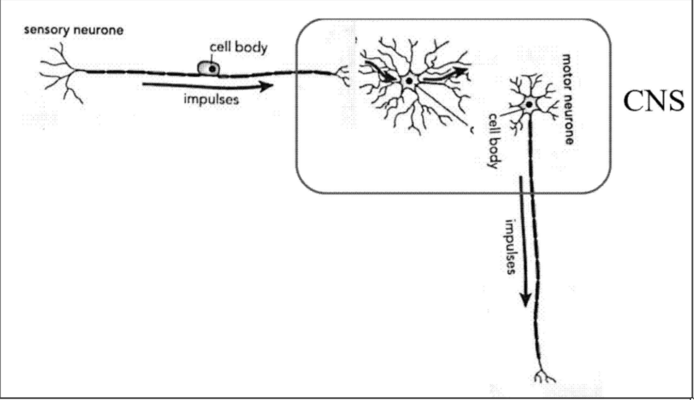

- The cell body (nucleus) of sensory neurone is outside of the CNS, in a **ganglion**

  > ganglion 神经节 - **a** [mass](https://dictionary.cambridge.org/zhs/词典/英语-汉语-简体/mass) **of** [nerve](https://dictionary.cambridge.org/zhs/词典/英语-汉语-简体/nerve) [cells](https://dictionary.cambridge.org/zhs/词典/英语-汉语-简体/cell)**,** [especially](https://dictionary.cambridge.org/zhs/词典/英语-汉语-简体/especially) [appearing](https://dictionary.cambridge.org/zhs/词典/英语-汉语-简体/appear) [outside](https://dictionary.cambridge.org/zhs/词典/英语-汉语-简体/outside) **the** [brain](https://dictionary.cambridge.org/zhs/词典/英语-汉语-简体/brain) **or** **[spine](https://dictionary.cambridge.org/zhs/词典/英语-汉语-简体/spine)**

- The cell body (nucleus) of relay neurone and motor neurone is in the CNS

### Structure

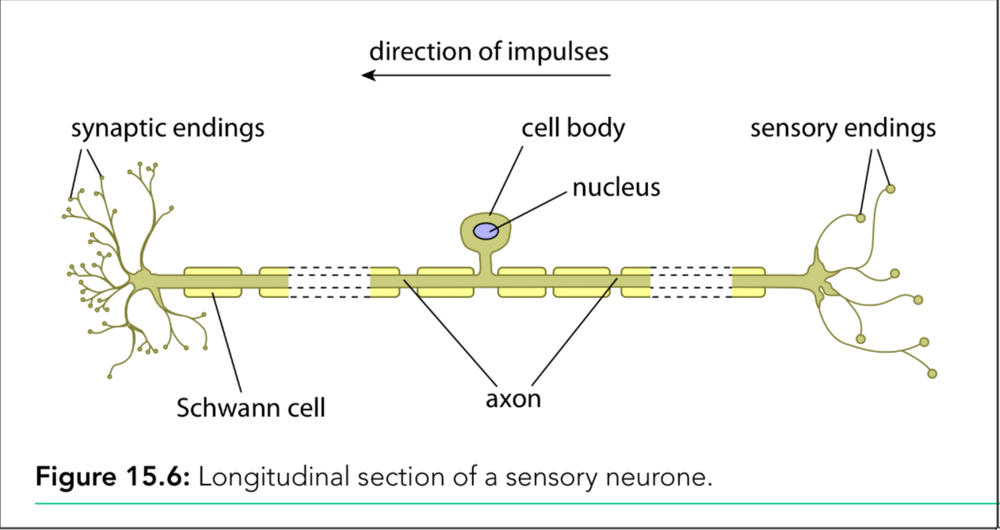

**The structure of sensory neurone**

- nucleus is in the cell body / soma
- long dendrites - receive impulses from other neurones
- short axon - conduct electrical impulses to axon terminal
- there are synaptic ends
- many mitochondria
- many ribosomes (the presence of **Nissl's granules**)
- **myelin sheath** made of **Schwann cells**
- **nodes of Ranvier**

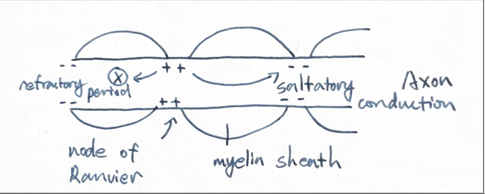

Sensory neurone的sensory end上有dendrites，来自dendrites的信号先汇聚成一个dendron，再经过nucleus所在的部分后，传递信号的部分叫作axon，最后由synaptic ends将信号传递给下一个神经元。

---

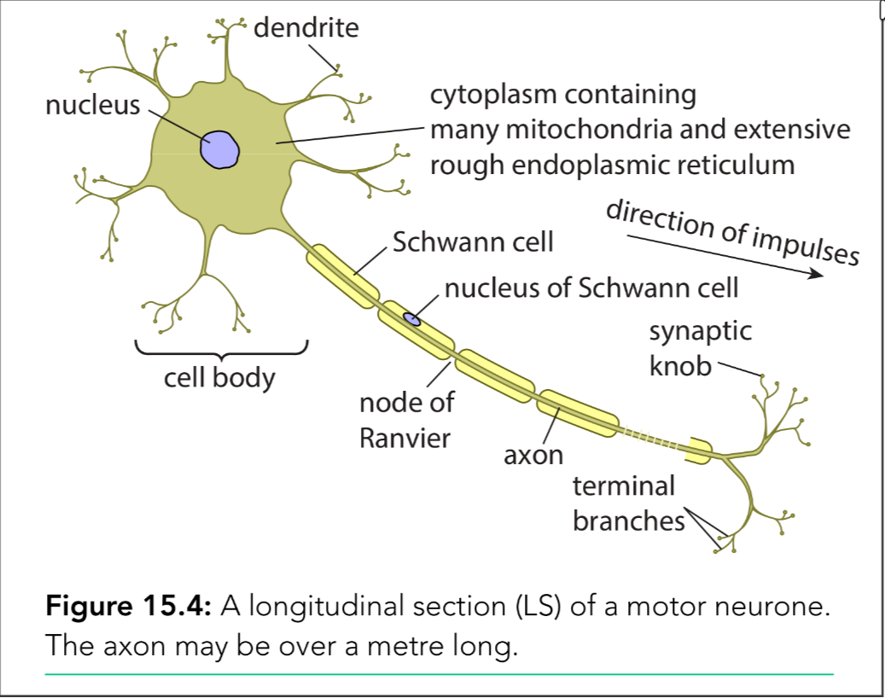

**The structure of motor neurone**

- Dendrites on the cell body
- nucleus is in the cell body
- many mitochondria
- many ribosomes
- one long axon
- synaptic knobs at end furthest from cell body
- myelin sheath made of Schwann cells
- nodes of Ranvier

---

The basic structure of sensory neurone is same as motor neurone, however they also have differences

| Feature                    | Sensory Neurone                                           | Motor Neurone                           | Note                                |
| -------------------------- | --------------------------------------------------------- | --------------------------------------- | ----------------------------------- |
| Location of cell body      | In ganglion                                               | In CNS                                  | cell body的位置不一样               |
| Function                   | Transmits impulses from receptor to CNS                   | Transmits impulses from CNS to effector | 连接的器官不一样                    |
| Position of cell body      | Part way along the neurone                                | At one end of the neurone               | cell body在整个神经元上的位置不一样 |
| Axon and dendron structure | Has dendron and short axon                                | Has long axon                           | axon长度不一样                      |
| Dendrite attachment        | Dendrites attached to dendron (not directly to cell body) | Dendrites attached to cell body         | dendrite是否直接连接到cell body上   |

### Resting Potentials

- resting potentials and action potentials
- depolarization, repolarization and hyperpolarization
- refractory period and saltatory conduction

神经元内部始终保持着负电荷，这个电荷差距被称作resting potential。

> The resting potential is usually about **-65mV**

为了维持这些负电荷，neurone的cell surface membrane会将带正点的阳离子排出细胞之外：

- **Sodium-potassium pump** pumps 3 $Na^+$ ions out and 2 $K^+$ in against concentration gradient by using ATP 每泵一次正电荷减少一

  > [!IMPORTANT]
  >
  > Sodium-potassium pump一直在工作，一直在将钠离子运出细胞，把potassium离子带进细胞。哪怕是在voltage-gated channels在开启的状态下。

- Then $K^+$ ions diffuse out and $Na^+$ diffuse in by **facilitated diffusion** through their **protein channels** 被泵出去的离子再通过diffusion回到细胞中

- More $K^+$ channels open than $Na^+$ channels, so more $K^+$ goes out than $Na^+$ in 有更多的钾离子会离开细胞，导致电荷不平衡

> - Inside of membrane is more negative than outside, membrane is polarised
> - The resting potential is about **-65mV**
>
> - Voltage-gated channels are closed
> - To a myelinated neurone, ion movement only occurs at **nodes of Ranvier**

### Action Potential in a Stimulated Neurone

The electrical impulses are changes in the distribution of electrical charge across the cell surface membrane. 细胞膜上的电荷分布时不均匀的，electrical impulse在传递时会像水波一样在神经元上激起一系列电荷变化。

This rapid change in potential difference across the membrane is **action potential**.

Action potential is caused by every **rapid movement of sodium ions and potassium ions** across **voltage-gated channels** in the membrane.

**Voltage-gated channels**

- contain **proteins** that can transport ions
- change shape to open / close when voltage changes
- Each type is **specific** for a certain type of ions 只针对与某一种ion

**Ligand-gated channels**

- contain **proteins** that can transport ions
- change shape to open when ligand bind with it, and vice versa 当ligand与channel结合时，channel会保持打开，反之亦然。
- Each type is **specific** for a certain type of ions 只针对与某一种ion

---

The transmission of an action potential in a myelinated neurone:

其中步骤1\~4是单个node of Ranvier中发生的事情，7\~9是多个nodes配合的过程。

1. **$Na^+$ voltage-gated** channels are stimulated to open. $Na^+$ enters the axon by facilitated diffusion down an **electrochemical** gradient, causing **depolarization**. This cause the potential difference becomes **less negative**

   > Axon部分的细胞膜整体呈负电荷，所以当带正电的$Na^+$进入axon时，会“中和”axon的电负性，丧失电负性的过程被称为depolarization。

2. Then **$Na^+$ voltage-gated channels** close 进入一些$Na^+$后有直接保持关闭

3. **$K^+$ voltage-gated channels** open, and $K^+$ ions move out of the cell by **facilitated diffusion** down an electrochemical gradient, causing **repolarization**. The potential difference becomes **more negative**

   > 这个部分和上面的步骤一类似，只不过会有更多的带正电的$K^+$离开axon，带走负电荷使axon的电负性重新恢复，重新恢复的过程被称为repolarization。

4. Hyperpolarization occurs

5. **Myelin sheath** insulates axon and prevents ions movement

6. Action potential (depolarization) **only occur at nodes of Ranvier**

7. Action potentials jump from node to node, this is **saltatory conduction** 跳跃式传导

8. **Local circuits** set up between nodes, cause $Na^+$ channels to open and trigger next depolarization at next node of Ranvier

9. The transmission of action potential is **one-way transmission** due to **refractory period 不应期**

   > node of Ranvier在传递一个信号后，会进入一段“冷却时间”，使它不会再接收信号，也就是说它无法将信号传递给一个刚激活的node（之前将信号传递给当前node的node）。Action potentials are **discrete events**, they do not merge into one another
   >
   > - The length of the refractory period limits the **maximum frequency** of action potentials (control the frequency) 可以简单类比为“有冷却时间导致无法一直立刻传递新的信号”
   > - Action potentials can only travel in **one direction** along the neurone

**The role of sodium ion channel:**

- the <u>voltage-gated sodium ion channel</u> changes <u>shape</u> due to the <u>voltage change</u>
- sodium ions <u>diffuse</u> into the cell <u>down the concentration gradient</u>
- the channel closes when the <u>potential reaches `+30mV`</u>

---

Depolarization triggers more $Na^+$ voltage-gated channels to open so that more sodium ions enter. There is more depolarisation. 

This is an example of **positive feedback**: a small depolarization leads to a greater and greater depolarization.

当depolarisation发生到一定的程度，超过threshold potential时，再发生action potential。这个要么发生、要么不发生的话，这个被称为**all-or-nothing law**.

Facts about action potential:

- each action potential has the **same size** / **amplitude** 大小一样
- the **strength** of a stimulus is indicated by **frequency** of action potentials and the **number of stimulated neurone** 

  > 信号强度取决于**频率**和参与传递的神经元**数量**
- the nature of the stimulus is deduced from the position of the sensory neurone by the brain
- axons with larger diameter transmit impulses faster than thin ones. 

  > This is because they have a greater surface area over which diffusion of ions can occur, which increases the rate of diffusion and reduces resistance
- Myelinated axon transmits action potentials faster. Speed is increased by 50 times due to saltatory conduction
- Elongated axon helps transmission

> [!NOTE]
>
> The ways to increase the speed of transmission:
>
> - Myelin sheath / Schwann cell
> - ... insulates axon / dendron
> - ... impermeable to Na⁺ / K⁺
> - Depolarisation only at nodes of Ranvier
> - ... local circuits - action potentials "jump" from node to node
> - Saltatory conduction
> - Axons with large diameter / giant axon
> - Reduce resistance
> - Elongated axon / dendron / neurone

### Receptors and Synpase

Receptor (又被成为chemoreceptors) serves as **energy transducer**, it initiates a **receptor potential**, if the potential reaches the **potential threshold**, the action potential will be passed along the nerve (all-or-nothing law).

感受器的例子：

- **rod / cone cells in retina** - sense *sight*
- **taste buds on tongue** - sense *taste* 多个感搜不同味道的细胞组成在一起，形成一个taste bud

关于receptors是如何产生action potential的：

1. the receptors response to stimuli
2. the receptors are energy transducer
3. the stimuli cause the sodium ion channels to open
4. sodium ions enter the cell
5. depolarize of the membrane occurs
6. the receptors generate the receptor potential
7. if the receptor potential greater than the threshold, then action potential generated (describe all-or-nothing principle)
8. $\uparrow$ stimuli $\uparrow$ frequency of action potential

上面的步骤仅限于发生最开始的action potential，要将信号传递到下一个neurone时，需要通过neurotransmitter来连接synaptic gap：

1. action potential opens the calcium ion channel protein
2. calcium ions enter the cell
3. cause the movement of vesicles containing neurotransmitter (toward the presynaptic membrane)
4. the vesicles fuse with the menbrane
5. neurotransmitters diffuse to postsynaptic membrane
6. bind with the receptors (ligand-gated channel protein) and stimulate the next action potential

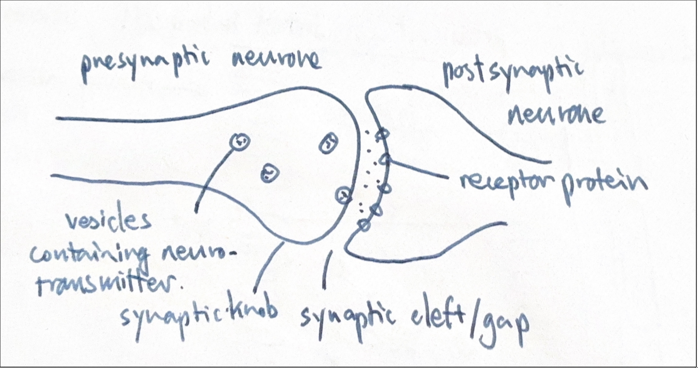

The examples of neurotransmitter:

- noradrenaline 去甲肾上腺素
- acetylcholine [acetyl-cho-line] 或者一般简写为ACh
- dopamine
- glutamic acid

在书中一般讨论的是一种使用ACh作为neurotransmitter的synpase，被称为**cholinrgic synpase**. 这种synpase中有一种酶，叫作**acetylcholinesterase** [actyl-cholin-ester-ase]，用于hydrolyse水解ACh，是ACh可以被recycle。

The role of acetylcholinesterase in a synpase:

- breaks down acetylcholine
- so ACh leaves the binding site (of the receptor)
- depolarisation stops in <u>postsynpatic membrane</u>\
- ... action potential also stops

- ACh is recycled

The roles of synapse in the nervous system:

- one-way transmission
- interconnection of nerve pathways
- involved in memory and learning

## Muscle Contraction

Motor neurone会在末端，和muscle fibre形成一个motor end plate，这个地方的synapse被称为**neuromuscular junction**。这个synapse的功能和之前一模一样，当action potential发生在muscle fibre中时，muscle fibre会收缩。

身体中有三种muscle，分别是：

1. Cardiac muscle - myogenic 受SAN控制
2. Skeletal muscle - striated 有条纹的 under light microscope, neurogenic 受神经控制
3. Smooth muscle - no striations under light microscope, neurogenic

在这一单元中，主要讨论的muscle是skeletal muscle。

一块muscle的组成由下：

- 多个sarcomere [sa-cro-mere] 组成myofibril
- 多个myofibril构成muscle fibre
- 多个muscle fibre组成bundle，在形成muscle

在light microscope下，muscle呈现出深浅条纹相间的样子：

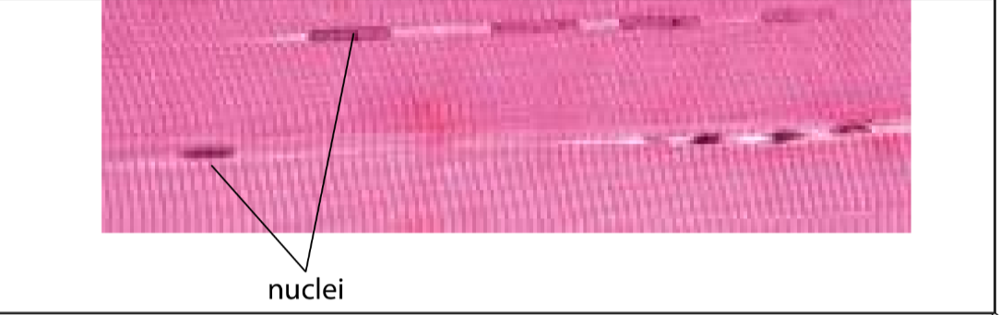

这些条纹是因为myofibril有两种结构：

- myosin filament - thicker, darker

  > myosin is a **fibrous protein** with a **globular head**

- actin filament - thinner, brighter

  > actin filament has three subunits:
  >
  > - actin - globular protein
  > - tropomyosin - fibrous protein
  > - troponin - has calcium ion binding site
  >
  > 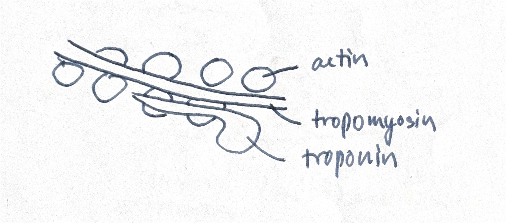

与此同时，虽然muscle是细胞，但是一些结构的叫法不一样：

- sarcolemma - cell surface membrane

  > The sarcolemma has many deep infoldings into the interior, called transverse system tubules, or **T-tubules**
  >
  > sarcolemma会向内产生凹陷，这个凹陷的地方会作为运输calcium ion的通道。

- sarcoplasmic reticulum - rough endoplasmic reticulum, but also store calcium ions

- sarcoplasm - cytoplasm

### How Muscles Contract

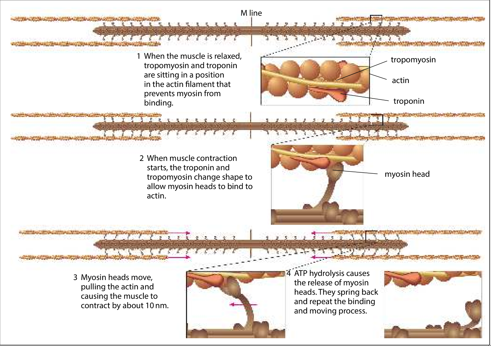

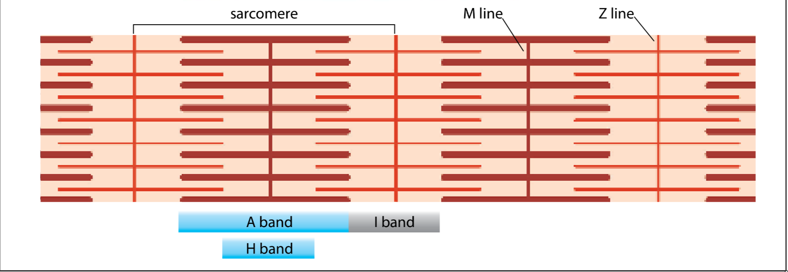

一个sacromere是肌肉收缩的最基本的单位。

当sacrolemma接收到来自motor neurone的信号时：

1. The depolarization of sacrolemma **spreads down T-tubules**. Calcium ions **diffuse out of sarcoplasmic reticulum** (the release of calcium ions)

2. Calcium ion **binds to troponin**. **Troponin changes** and **moves tropomyosin**. Myosin head binding sites on action filaments are **exposed**.

3. Myosin heads bind to these sites, forming **cross bridges** with action filaments.

4. Myosin heads **tilt** 倾斜, releasing APT and Pi. **Power stroke** 动力冲程 occurs, and sarcomere is shortened

5. Myosin head has ATPase (breakdown ATP molecule)

6. New ATP binds to myosin head, **myosin head detaches from actin** (cross bridges break)

7. Myosin head hydrolyses ATP and **tilts back to original position**

8. The binding and moving process is **repeated**

   > 如果ATP足够、calcium ion足够，那么步骤3\~7会重复

9. Sarcomere shortens

10. When stimulation stops, calcium ions are pumped back into the sarcoplasmic reticulum

以上的移动方式被称为**sliding filament model**.

### Typical Questions

> [!NOTE]
>
> The role of tropomyosin:
>
> - tropomyosin uncovers the myosin binding site on actin
> - changes shape when calcium ion binded
> - allows myosin to form cross-bridge

> [!NOTE]
>
> The role of myosin:
>
> - ATP hydrolysis
> - causes myosin <u>head</u> to tilt
> - forms cross-link with actin
> - myosin head returns to previous position, when ADP and Pi detach
> - power stroke occurs
> - new ATP binds
> - myosin head detaches from actin

> [!NOTE]
>
> 当ATP过少时会发生的事情：
>
> - no attachment of myosin heads
> - so no energy transfered to myosin
> - so no cross-bridges
> - so no power stroke
> - so no recovery of power stroke
> - 同时，ATP过少的话也无法将calcium ions回收进sarcoplasmic reticulum
>
> ATP在sliding filament model中的**precise** function:
>
> - ATP binds to myosin head
> - ATP will be **hydrolysed** by ATPase
> - ... causes the head detaches from actin
> - and then the head tilts hack into original position

### Antagonist

Antagonist 拮抗肌 - 在同一关节两侧，作用完全相反的肌肉。当一块收缩时，另一块必须放松，才能完成顺畅的动作

Each skeletal muscle in the body has an antagonist, for example:

- the **triceps** 三头肌 is the antagonist of the **biceps** 二头肌

When one of the two muscles contracts, another muscle relaxes, lengthening sarcomere.

## Coordination in Plants

- Venus fly trap (**electrical** communication in plants)
- auxin and gibberellin (**chemical** communication in plants)

### Venus Fly Trap

这种植物通常位于潮湿的环境（wetlands），因为昆虫可以提供土壤中匮乏的mineral ions：

- low mineral ions in the content of soil
- insects provide mineral ions for growth

The specialised lead id divided into 2 **lobe** either side of a **midrib**, each lobe has 3 **sensory hairs**.

- when the trap is open, the lobes are **convex** 凸的 in shape
- when the trap is closed, the lobes are **concave** 凹的 in shape

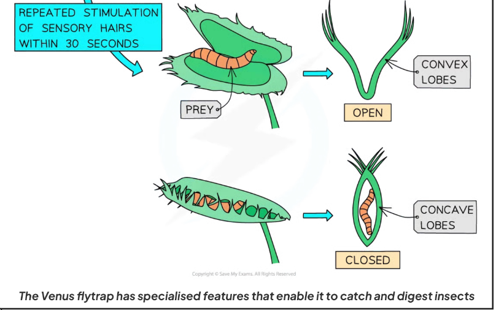

当一个昆虫接触到sensory hair：

1. <u>mechanical energy converted to electrical</u> in sensory hair cell

2. **calcium ion channels** in the cells at the base of the hair **open**

3. calcium ions **flow in** and generate a **receptor potential**

4. an action potential occurs when:

   - two of the sensory hairs are stimulated at the same time
   - OR one hair is stimulate twice within \~35 seconds

   Then the depolarisation spreads over lobe

5. the cells at the base of the trap **change shape**, and the trap closes

   > **sealing** the trap requires **ongoing activation** of the sensory hairs,  which occurs when the prey **continues to move around inside the close trap**

   1. hydrogen ions pumped out of cells into **cell walls**
   2. **cross-links** in the cell wall broken
   3. calcium pectate 果胶钙 of middle lamella dissolves
   4. cell wall **loosens**
   5. calcium ions enter **hinge cells**
   6. water enters hinge cells by **osmosis**
   7. cells become **turgid**
   8. lobs change **from convex to concave**
   9. trap **shuts quickly** in 0.3s, **elastic tension** released

6. further stimulation of the sensory hairs causes **calcium ions to enter gland cells**, where they stimulate the **exocytosis of vesicles** containing **digestive enzymes**

The trap then stays closed for up to a week to allow the prey to be digested and the nutrients from is to be absorbed by the plant.

**The adaptation of Venus fly trap**

- stimulation of a single hair dose not trigger closure
  - at least two hairs must be touched OR one hair touched twice within in 35 seconds
  - to prevent the closure from the physical stimuli from rains of debris falls into the trap
- Gaps between stiff hairs allow very small insects to **crawl out**
  - no energy wasted on digesting a very small meal

### Auxin

Auxin participates in **cell elongation** via **acid growth hypothesis**

Plants make several chemicals known as auxin, of which the principal one is **IAA**

Auxin:

- is synthesised in the **growing tips** of shoots of roots

- stimulates **cell elongation**

The expansins 膨胀素 break bonds between cellulose microfibrils of the plant cell wall.

The **acid growth hypothesis** of auxin:

- auxin **stimulates proton pumps** in the **cell surface membrane**
- hydrogen ions pumped into cell wall by active transport
- pH of cell wall decreases and **pH-dependent enzymes activated**
- expansins break the bonds between cellulose microfibrils
- the cell wall becomes more elastic
- water enters the cell wall, so the cell wall expands

### Gibberellin

Gibberellin（由$GA_1$激活的$GA$）参与：

- Stem elongation - cause breakdown of DELLA protein and transcription of growth genes

- **Gibberellin synthesis** and **dwarfness** caused by a lack of active gibberellin

- Seed germination 种子发芽

- The major sites of gibberellin production are young roots and leaves

  Gibberellin主要产生在新长的根和叶中

关于GA是如何stimulate stem elongation的：

1. without gibberellin, **transcription factor** is attached to DELLA protein, which prevents the activation and transcription of genes
2. GA binds to receptor to cause the destruction of DELLA protein
3. PIF (transcription factor) binds to the length of DNA promoter, then RNA polymerase binds to the promoter to start transcription of growth genes
4. Growth genes are expressed, causing:
   - cell division
   - cell elongation
   - increase in internode length

> Interaction with auxin and acid growth:
>
> 1. expansins are stiumulated
> 2. cell wall loosens
> 3. water moves into cells by osmosis
> 4. cell expands

Explain the control of gibberellin synthesis and why lack of it leads to dwarfness:

1. Gibberellin synthesis is controlled by gene Le/le

2. **Dominant allele Le** gives functional enzymes which converts inactive GA to active GA
3. **Tall plants** have dominant allele Le with a genotype of `LeLe` of `Lele` to produce active GA which causes stem elongation
4. **Dwarf plants** only have recessive allele le with a genotype of lele and have no active GA
5. GA1 is the active form of gibberellin

#### Germination of Cereal Seeds

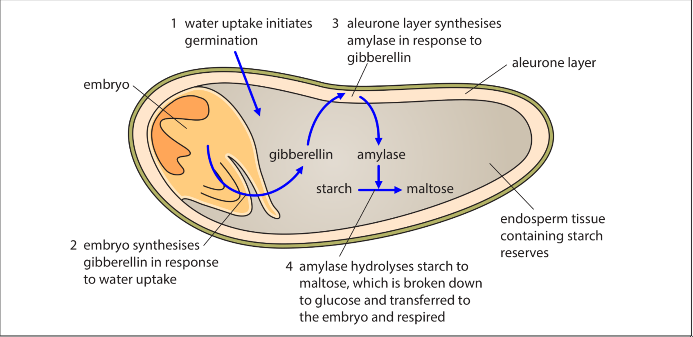

1. Seed absorbs water
2. Embryo produces gibberellin
3. Gibberellin moves to and stimulates **aleurone layer** where amylase is produced
4. Amylase hydrolyses starch in endosperm into maltose
5. Embryo uses sugars for respiration
6. ATP is used for growth
7. Gibberellin affects gene coding for amylase

## Keywords

1. **Acetylcholine (ACh)** - 乙酰胆碱 (ACh) A molecule made up of coenzyme A and a 2C acetyl group, important in the link reaction; a type of neurotransmitter released by cholinergic synapses
2. **Acetylcholinesterase** - 乙酰胆碱酯酶 An enzyme in the synaptic cleft and on the postsynaptic membrane that hydrolyses ACh to acetate and choline
3. **Action potential** - 动作电位 A brief change in the potential difference from –70 mV to +30 mV across the cell surface membranes of neurones and muscle cells caused by the inward movement of sodium ions
4. **All-or-none law** - 全或无定律 Neurones and muscle cells only transmit impulses if the initial stimulus is sufficient to increase the membrane potential above a threshold potential
5. **Chemoreceptor** - 化学感受器 A receptor cell that responds to chemical stimuli; chemoreceptors are found in taste buds on the tongue, in the nose and in bloodvessels where they detect changes in oxygen and carbon dioxide concentrations
6. **Cholinergic synapse** - 胆碱能突触 A synapse at which the transmitter substance is ACh
7. **Depolarisation** - 去极化 The reversal of the resting potential across the cell surface membrane of a neurone or muscle cell, so that the inside becomes positively charged compared with the outside
8. **Motor neurone** - 运动神经元 A neurone whose cell body is in the brain, spinal cord or a ganglion (a swelling on a nerve), and that transmits nerve impulses to an effector such as a muscle or gland
9. **Myelin** - 髓鞘 Insulating material that surrounds the axons of many neurones; myelin is made of layers of cell surface membranes formed by Schwann cells so that they are very rich in phospholipids and therefore impermeable to water and ions in tissue fluid
10. **Nerve impulse** - 神经冲动 (usually shortened to impulse) a wave of electrical depolarisation that is transmitted along neurones
11. **Neuromuscular junction** - 神经肌肉接头 A synapse between a motor neurone and a muscle
12. **Neurone** - 神经元 Anerve cell; a cell which is specialised for the conduction of nerve impulses
13. **Neurotransmitter** - 神经递质 A chemical released at synapses to transmit impulses between neurones or between a motor neurone and a muscle fibre
14. **Node of Ranvier** - 郎飞结 A very short gap between Schwann cells where myelinated axons are not covered in myelin so are exposed to tissue fluid
15. **Noradrenaline** - 去甲肾上腺素 A type of neurotransmitter, which is also released by cells in the adrenal glands as a hormone
16. **Postsynaptic neurone** - 突触后神经元 The neurone on the opposite side of a synapse to the neurone in which the action potential arrives
17. **Potential difference** - 电位差 The difference in electrical potential between two points; in the nervous system, between the inside and the outside of a cell surface membrane such as the membrane that encloses an axon
18. **Presynaptic neurone** - 突触前神经元 A neurone ending at a synapse from which neurotransmitter is released when an action potential arrives
19. **Receptor potential** - 受体电位 A change in the normal resting potential across the membrane of a receptor cell, caused by a stimulus
20. **Receptor protein** - 受体蛋白 A protein on a postsynaptic membrane that is a ligand-gated channel protein opening in response to binding of a neurotransmitter
21. **Refractory period** - 不应期 A period of time during which a neurone is recovering from an action potential, and during which another action potential cannot be generated
22. **Repolarisation** - 复极化 Returning the potential difference across the cell surface membrane of a neurone or muscle cell to normal following the depolarisation of an action potential
23. **Resting potential** - 静息电位 The difference in electrical potential that is maintained across the cell surface membrane of a neurone when it is not transmitting an action potential; it is normally about –70 mV inside and is partly maintained by sodium–potassium pumps
24. **Saltatory conduction** - 跳跃传导 Movement of an action potential along a myelinated axon, in which the action potential ‘jumps’ from one node of Ranvier to the next
25. **Sensory neurone** - 感觉神经元 A neurone that transmits nerve impulses from a receptor to the central nervous system
26. **Synapse** - 突触 A point at which two neurones meet but do not touch; the synapse is made up of the end of the presynaptic neurone, the synaptic cleft and the end of the postsynaptic neurone
27. **Synaptic cleft** - 突触间隙 A very small gap between two neurones at a synapse; nerve impulses are transmitted across synaptic clefts by neurotransmitters
28. **Threshold potential** - 阈电位 The critical potential difference across the cell surface membrane of a sensory receptor or neurone which must be reached before an action potential is initiated
29. **Voltage-gated channel protein** - 电压门控通道蛋白 A channel protein through a cell membrane that opens or closes in response to changes in electrical potential across the membrane
30. **Voltage-gated calcium ion channel protein** - 电压门控钙离子通道蛋白 A channel protein in presynaptic membranes that responds to depolarisation by opening to allow diffusion of calcium ions down their electrochemical gradient
31. **Actin** - 肌动蛋白 The protein that makes up the thin filaments in striated muscle
32. **Myofibril** - 肌原纤维 One of many cylindrical bundles of thick (myosin) and thin (actin) filaments inside a muscle fibre
33. **Myosin** - 肌球蛋白 The protein that makes up the thick filaments in striated muscle; the globular heads of each molecule break down ATP (they act as an ATP-ase)
34. **Sarcolemma** - 肌膜 The cell surface membrane of a muscle fibre 
35. **Sarcomere** - 肌节 The part of amyofibril between two Z discs
36. **Sarcoplasm** - 肌质 The cytoplasm of muscle cells
37. **Sarcoplasmic reticulum (SR)** - 肌浆网 (SR) The endoplasmic reticulum of muscle fibre
38. **Sliding filament model** - 滑动丝模型 The mechanism of muscle contraction; within each sarcomere the movement of thin filaments closer together by the action of myosin heads in the thick filaments shortens the overall length of each muscle fibre
39. **Striated muscle** - 横纹肌 Type of muscle tissue in skeletal muscles; the muscle fibres have regular striations that can be seen under the light microscope
40. **Transverse system tubule (or T-system tubule or T-tubule)** - 横管系统 (T系统或T管) Infolding of the sarcolemma that goes deep into a muscle fibre and conducts impulses to the SR
41. **Tropomyosin** - 原肌球蛋白 A fibrous protein that is part of the thin filaments in myofibrils in striated muscle; tropomyosin blocks the attachment site on the thin filament for myosin heads so preventing the formation of cross-bridges
42. **Troponin** - 肌钙蛋白 A calcium-binding protein that is part of the thin filaments in myofibrils in striated muscle
