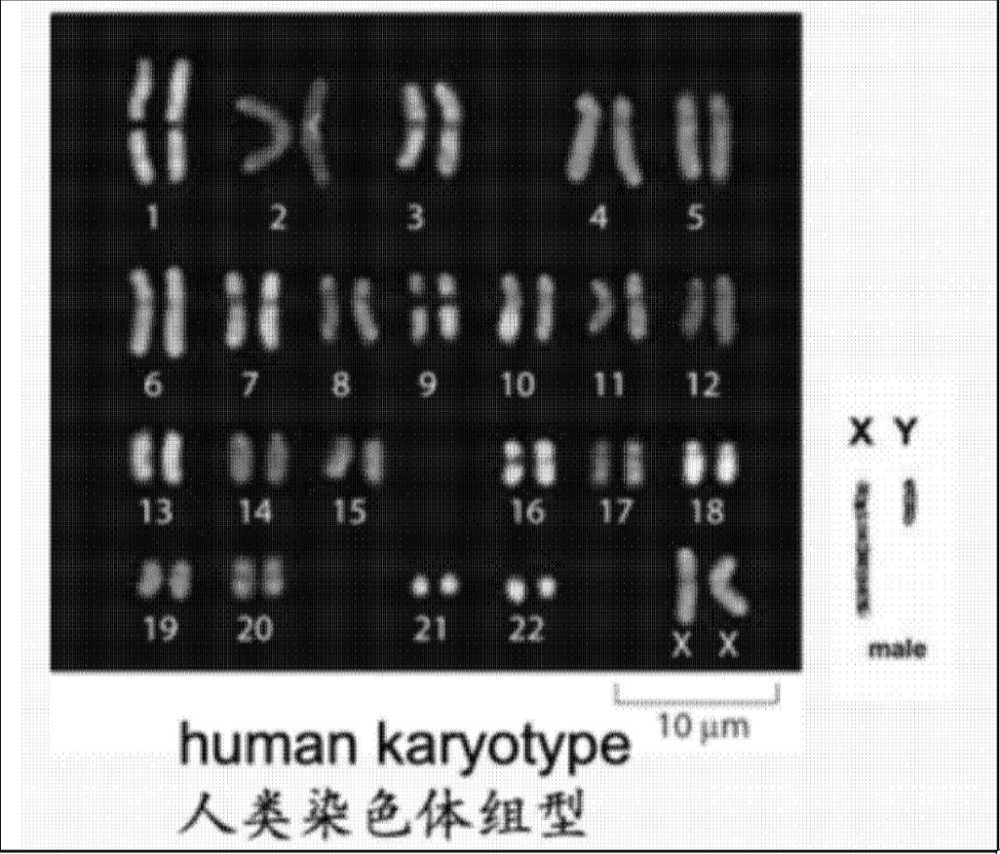
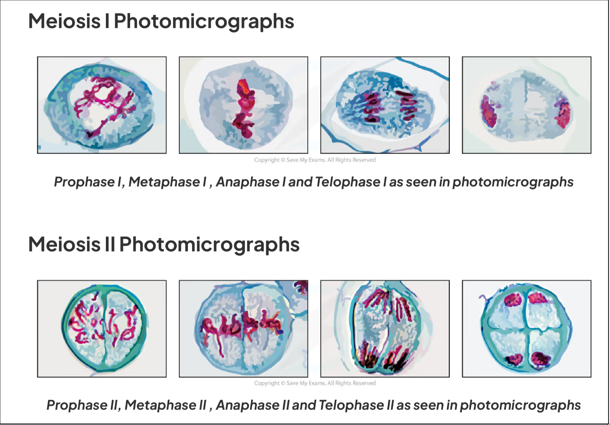
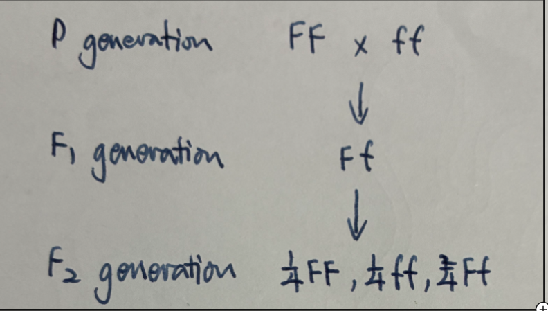
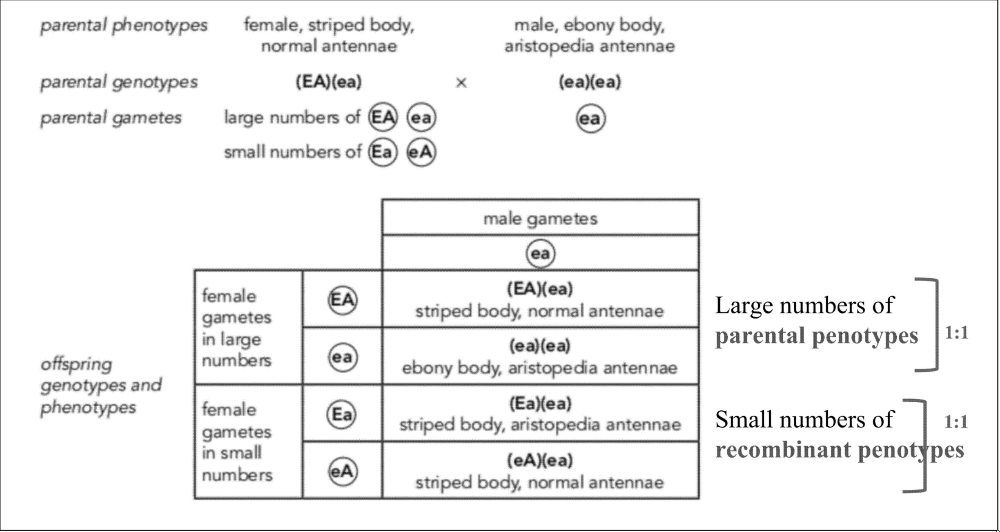
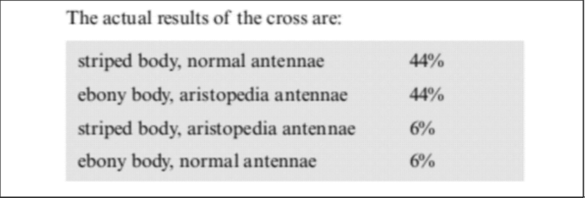
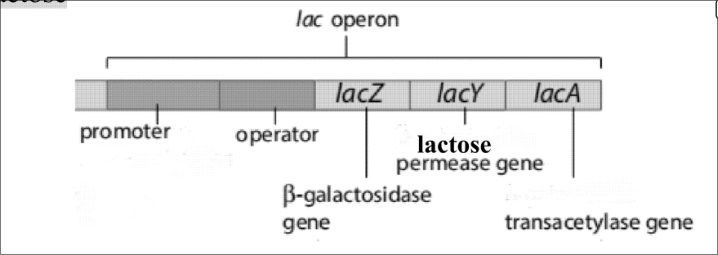

# Inheritance

- [Inheritance](#inheritance)
  - [Cell Division Process](#cell-division-process)
  - [Process of Meiosis and Source of Genetic Variation](#process-of-meiosis-and-source-of-genetic-variation)
    - [Prophase I](#prophase-i)
    - [Metaphase I](#metaphase-i)
    - [Anaphase I](#anaphase-i)
    - [Telophase I](#telophase-i)
    - [Meiosis II](#meiosis-ii)
    - [Genetic Variation](#genetic-variation)
  - [Inheritance Patterns and Genetic Diagram](#inheritance-patterns-and-genetic-diagram)
    - [Inheritance](#inheritance-1)
  - [Mutation \& Genetic Diseases](#mutation--genetic-diseases)
    - [Albinism 白化病](#albinism-白化病)
    - [Sickle Cell Anaemia 镰刀型细胞贫血病](#sickle-cell-anaemia-镰刀型细胞贫血病)
    - [Haemophilia血友病](#haemophilia血友病)
    - [Huntington's disease亨廷顿病](#huntingtons-disease亨廷顿病)
  - [Gene Regulation](#gene-regulation)
    - [Operon in Prokaryotic cells](#operon-in-prokaryotic-cells)
    - [Transcription Factors in Eukaryotic Cells](#transcription-factors-in-eukaryotic-cells)
  - [Keywords](#keywords)

## Cell Division Process

- Binary fission
- Mitosis
- Meiosis
- Fertilization

Prokaryotic cells divide by binary fission, it doses not involve a spindle.

Eukaryotic cells divide by:

- Mitosis:

  1 diploid parent cell produces 2 new diploid cells

  > OR 1 haploid parent cell produces 2 new haploid cells

  The daughter cells are genetically identical to each other and to parent cell.

  Functions:

  - growth (of multicellular organisms)
  - repair tissue
  - replace dead cells
  - for asexual reproduction
  - immune response (clonal expansion)

- Meiosis

  It's a **reduction division**, the number of chromosomes is halved

  1 diploid parent cell produces 4 new haploid daughter cells, they are genetically different from each other and from parent cell.

  Functions:

  - Produce **gametes** for sexual reproduction

---

Diploid has 2 complete sets of chromosomes, for example human has 23 **pairs** of chromosomes, or 46 chromosomes. (one set from mother and one set from father)

Haploid has 1 complete set of chromosomes, for example, human gametes have 23 chromosome.

> No. 1\~22 chromosomes are autosomes 常染色体
>
> No. 23 is sex chromosome 性染色体 (*X*是长的，*Y*是短的)
>
> 
>
> **Karyotype** 染色体组 - a display of condensed chromosomes arranges in pairs, starting with the longest chromosomes. The resulting diagram is called a **karyogram**

Fertilization is the fusion of **female gamete nucleus** and **male gamete nucleus**, and produces a **diploid zygote**. The diploid number of chromosomes is restored and maintained.

## Process of Meiosis and Source of Genetic Variation

**Homologous chromosomes** 同源染色体 - have the same length, the same centromere position, the same banding pattern, and carry the same genes controlling the same characteristics, in the same **loci** (positions)

One homologous chromosome is inherited from mother, and another is from father.

After S phase (in interphase), there are still 46 chromosomes, but each chromosome has 2 **sister chromatids**

**Locus** (*phural.* loci) 基因点位 - the position of a gene on a chromosome.

**Allele** 等位基因 - an **alternative form** of a gene (a variety of a gene)

---

In non-gamete cell's division, mitosis stage occurs once, and the 4 phases are **prophase**, **metaphase**, **anaphase**, and **telophase** (the PMAT phases), and lastly, cytokinesis 胞质分裂 divides the cell contents into 2 new daughter cells.

However, there are two divisions in meiosis:

- Meiosis I - to separate homologous chromosomes
  1. Prophase I
  2. Metaphase I
  3. Anaphase I
  4. Telophase I

- Meiosis II - to separate sister chromatids
  1. Prophase II
  2. Metaphase II
  3. Anaphase II
  4. Telophase II

### Prophase I

1. chromatin **coils up** into chromosomes (condense)
2. centrosomes move towards opposite poles and then start to **make microtubule spindle**
3. Nuclear envelope and nucleolus **disappear**

上面发生的事情在mitosis中也会发生，但接下来发生的是属于prophase I的：

1. homologous chromosomes **pair up** to form **bivalents**. This process is called **synapsis**
   $$
   \text{homologous chromosomes} \xrightarrow{synapsis} \text{bivalents}
   $$
   
2. **Crossing over** might occur between non-sister chromatids of a pair of homologous chromosomes at **chiasma**, leading to **exchange of genetic material** and **new combination of alleles**

   > **Chiasma** (*plural.* chiasmata) 交叉点
   >
   > corssing over这一步中**交换了基因**，会有新的allele产生，**增加了genetic variation**

3. **Linkage groups** are broken

   > **Linkage group** - consists of genes that are located on the same chromosome and tend to be inherited together. 
   >
   > The closer two genes are, the less likely the crossing over between them occurs.

### Metaphase I

1. **Homologous chromosomes pairs** (**bivalents**) line up across the equator of spindle
2. Each pair lines up independently of others
3. **Independent assortment** 自由组合/独立分配 of bivalents happens, resulting in $2^n$ chromosome / allele combinations ($n$ stands for the number of pairs of homologous chromosomes)

Independent assortment makes the gametes that are **genetically unique.** This is a result of the **random alignment of bivalents** on the equator of the spindle.

Total possible of chromosome combination: $2^n$

> For example: human has 23 pairs chromosomes, so there are $2^{23} = 8324608$ different combinations.

### Anaphase I

1. Each pair of homologous chromosomes separates and moves to opposite poles, centromeres first, pulled by spindle microtubules
2. Centromere DO NOT divide
3. Spindle microtubules shorten

There are half the number of chromosomes go to the opposite ends, 2 haploid cells are formed.

这个地方会产生两个haploid的细胞，也就是说只有one complete set of chromosomes，但这个地方因为centromere没有分裂，所以每条chromosome上都有sister chromatids。

### Telophase I

1. Chromosomes uncoil into chromatin
2. Remains of spindle are breaking down
3. Nuclear envelope and nucleolus re-form

### Meiosis II

Meiosis II is just like mitosis, but no homologous chromosomes exist, and no DNA replication between meiosis I and meiosis II.

**In prophase II of meiosis II:**

1. Centrosomes replicate.

**In metaphase II of meiosis II:**

1. Chromosomes with sister chromatids line up across the equator of spindle.
2. <u>Independent assortment of sister chromatids</u> occurs.

**In anaphase II of meiosis II:**

1. <u>Sister chromatids separate</u> and move to opposite poles, centromeres first, pulled by spindle microtubules.
2. <u>Centromeres **DIVIDE**.</u>

**In telophase II of meiosis II:**

1. <u>Four haploid nuclei</u> are formed. 4 daughter cells are going to be formed.

---

|                         | Mitosis               | Meiosis           |
| ----------------------- | --------------------- | ----------------- |
| Gene                    | Genetically identical | Genetic different |
| No. of nuclear division | 1                     | 2                 |
| No. of daughter cells   | 2                     | 4                 |
| di- / haploid           | diploids              | haploids          |
| Corssing over           | No                    | Yes               |
| Independent assortment  | No                    | Yes               |
| Synapsis                | No                    | Yes               |

### Genetic Variation

The genetic variation can comes from:

- meiosis stage

  - crossing over

    > Crossing over begins from **chiasmata formation**, this is the **exchange of genetic material** between **non-sister chromatids of homologous chromosomes**, at **meiosis I**.
    >
    > And form new combination of alleles.

  - independent assortment

    > Independent assortment会在meiosis中发生两次，分别在：
    >
    > - metaphase 1 - the random assortment of **bivalents**
    > - metaphase 2 - the random assortment of **chromatids**

  - mutation - random change in base sequence of DNA, and form new alleles

- fertilisation stage

  - random mating
  - random fusion of gametes during random fertilisation

## Inheritance Patterns and Genetic Diagram

- **Gene** 基因 - A length of DNA that codes for a specific protein or polypeptide.
- **Mutation** 突变 - A random change in the base sequence of DNA; examples include base deletion, base addition, and base substitution.
- **Allele** 等位基因 - An alternative form of a gene found at the same position on a chromosome.
- **Genotype** 基因型 - The combination of alleles possessed by an organism for one or several specific genes (since organisms have two copies of each gene).
- **Phenotype** 表现型 - The observable physical or biochemical features of an organism, determined by both genetic makeup and environmental factors.
- **Homozygous** 纯合的 - Describing an organism that has two identical alleles of a particular gene.
- **Homozygote** 纯合子 - An organism that is homozygous for a specific trait.
- **Heterozygous** 杂合的 - Describing an organism that has two different alleles of a particular gene.
- **Heterozygote** 杂合子 - An organism that is heterozygous for a specific trait.

---

The relationship between 2 alleles of a gene can be:

- dominant 显性 - always expresses itself in phenotype
- recessive 隐性 - only affects phenotype if no dominant allele is present
- codominant 共显性 - each affect the phenotype

有的基因有两个allele，有的基因有三个allele组成，比如ABO血型。

一般使用大写字母来表示dominant allele，用小写字母表示recessive allele，比如：

- $G$ - dominant allele
- $g$ - recessive allele

对于codominant allele，使用大写的phenotype作为base，大小写区分的不同allele作为上标，例如：

- $F^W$ - **W**hite **F**ur colour
- $F^B$ - **B**rown **F**ur colour

### Inheritance

Test cross - needed to determine the genotype of one organism showing dominant phenotype.

> A large number of offspring gives a more accurate prediction.

---

**Monohybrid inheritance** - inheritance of one gene

1. Two true-breeding纯种的/pure-breeding /homozygous plants are crossed (**cross=mate/breed**).
2. The true-breeding parents are referred to as the P generation (parental generation).
3. The hybrid offspring are the F₁ generation (first filial generation, the word *filial* from the Latin word for “son”).
4. F₁ hybrids self-pollinate/cross-pollinate with other F₁ hybrids to produce an F₂ generation (second filial generation).

> - All the F₁ individuals are heterozygous, called monohybrids.
>
> - A cross between F₁ individuals is known as monohybrid cross. 这句话存疑，如果monohybrid是只考虑一个allele的话，就不可能是F₁这一代之间的杂交，P这一代的基因是GG和gg，所以F₁这一代的基因只可能是Gg。
> - More broadly, monohybrid cross means a cross in which the inheritance of one gene is considered.

Alleles of one gene are separated along with the **separation of homologous chromosomes in anaphase I**. Each gamete inherits one allele of a gene.

---

**Dihybrid inheritance & dihybrid cross**

This involve the inheritance of 2 genes

- All the F₁ individuals are heterozygous, called dihybrids.
- A cross between F₁ individuals is known as dihybrid cross.
- More broadly, dihybrid cross means a cross in which the inheritance of 2 genes is considered.

During meiosis:

1. Alleles of one gene are separated along with the **separation of homologous chromosomes in anaphase I**.
2. Alleles of genes on non-homologous chromosomes combine.
3. Each gamete inherits one allele from each gene. 每个haploid继承母diploid上的一个allele

---

**Sex-linkage**
- Sex-linked gene: a gene located on one of the sex chromosomes and not on the other, usually on X chromosome
- Sex-linkage produces characteristics/features that are **more common in one sex/gender than in the other**

> **Red-green colour blindness**
>
> The gene is only located on X chromosome. The dominant allele $X^B$ codes for the normal vision, the recessive allele $X^b$ codes for the red-green colour blindness.
>
> |            | genotype  | phenotype                                          |
> | :--------- | :-------- | :------------------------------------------------- |
> | **female** | $X^B X^B$ | woman with normal vision                           |
> |            | $X^B X^b$ | woman with normal vision (who is a carrier) 携带者 |
> |            | $X^b X^b$ | **woman with red–green colour blindness**          |
> | **male**   | $X^B Y$   | man with normal vision                             |
> |            | $X^b Y$   | **man with red–green colour blindness**            |

> **Haemophilia 血友病**
>
> The \(F8\) gene only on the X chromosome has 2 alleles：
>
> 1. The **dominant allele** codes for functional, normal **factor VIII**[^1]
> 2. The **recessive allele** <u>cannot code for enough normal factor VIII</u>, leading to <u>lack of normal factor VIII</u>.
>
> [^1]: a protein necessary for **blood clotting** / that helps prevent bleeding.
>
> - $X^F$ - normal blood clotting
> - $X^f$ - haemophilia 血友病
> - $Y$
>
> Haemophilia: blood **does not clot normally**, and excessive bleeding can follow from even a small injury.
>
> | genotype      | phenotype             |
> | :------------ | :-------------------- |
> | $X^F X^F$     | normal blood clotting |
> | $X^F X^f$     | normal blood clotting |
> | **$X^f X^f$** | **haemophilia**       |
> |               |                       |
> | $X^F Y$       | normal blood clotting |
> | **$X^f Y$**   | **haemophilia**       |

---

**Autosomal Linkage**

- Two genes **on the same autosome** (any chromosome that is not a sex chromosome) are said to be autosomally linked
- **Autosomally linked genes tend to be inherited together** and do not assort independently
- Each linkage group is bracketed in the genotype, e.g. $(AB)(ab)$

一般来说在有autosomal linkage的情况下，括号中的alleles是一起遗传的，把这个括号内的东西当成一个整体即可。

这边的例外是corssing over，发生crossing over时有小概率会互换括号行内的alleles。

左边的$(EA)(ex)$有一小部分变成了$(Ea)(eA)$

<u>Crossing over between two gene loci is more likely to take place if the genes are further apart</u>, because there is more length of chromosome between them that can cross over.

---

**Epistasis** 上位抑他性，上位效应

> **epistasis** - the interaction of two genes at different loci; one gene affects the expression and phenotype of another

For example, in the inheritance of feather colour in chickens:

- Allele **G** is for **coloured** feathers
- Allele **g** is for **white** feathers.
- There is another gene F/f. When **F** is present, the feathers are **white**.

优先表达F，没有F时再看G和g。

## Mutation & Genetic Diseases

| Disease              | Gene                                | Faulty allele                 | Patients' genotype                         |
| :------------------- | :---------------------------------- | :---------------------------- | :----------------------------------------- |
| Albinism             | TYR gene on autosome                | recessive                     | Homozygous recessive                       |
| Sickle cell anaemia  | HBB gene on autosome                | **codominant** HbS | HbSHbS               |
| Haemophilia          | F8 gene on X chromosome, sex-linked | recessive                     | XfXf, XfY |
| Huntington's disease | HTT gene on autosome                | dominant                      | Has the dominant allele                    |

**Gene Mutation** - the <u>random</u> <u>change in base sequence</u> <u>during DNA replication</u>. (有三个主要的得分点)

Possible consequences of a gene mutation:

- [基因层面] base addition, base deletion, and base substitution
  - base substitution often has no effects, many different codons code for the same amino acid
- [宏观层面] great impact on phenotype
- frame shifts 基因序列发生偏移了
- alters whole sequence of bases after mutation 改变整个序列
- may lead to stop codon 更快结束translation
- different allele formed
- the protein has different shape

> **Missense mutations** 错义突变 - Substitutions that change one amino acid to another one
>
> **Silent mutation** 同义突变 / 沉默突变 - Substitution that has no observable effect on the phenotype; for example, a mutation that results in a codon that codes for the same amino acid
>
> **Nonsense mutation** 无义突变 - A mutation that changes an amino acid codon to a stop codon, resulting in a shorter and usually nonfunctional protein
>
> | 突变类型     | DNA变了没？ | 氨基酸变了没？       | 蛋白质长度变了没？ | 通常结果                 |
> | :----------- | :---------- | :------------------- | :----------------- | :----------------------- |
> | **错义突变** | 变了        | 变了（换了一个）     | 没变               | 功能可能改变（或好或坏） |
> | **同义突变** | 变了        | 没变（同一种）       | 没变               | 基本无影响               |
> | **无义突变** | 变了        | 变了（变成终止信号） | **变短了**         | 通常功能丧失             |

### Albinism 白化病

异变基因：TYR gene

***TYR* gene** (chromosome 11) has 2 alleles. The **dominant allele** is normal and can code for **active tyrosinase**. <u>The mutant allele is recessive</u> which leads to inactive tyrosinase.

Tyrosinase converts tyrosine into DOPA and then into dopaquinone. Then melanin is made in melanocytes 黑素细胞.
$$
\text{tyrosine} \xrightarrow {typosinase} DOPA \rightarrow \text{dopaquinone} \rightarrow \text{melanin}
$$
白化症患者没办法合成typosine，导致接下来的一串生产黑色素的过程都没办法发生。

**Albinism** only occurs in **homozygous recessive** people and affects hair, skin and iris.

> Patients have **pale** hair and skin and pale blue or **pink iris**.
>
> The condition is often accompanied by **poor vision**, rapid, **jerky movements of the eyes** and a tendency to **avoid bright light**.

> [!NOTE]
>
> Explain how the presence of a mutant allele can result in albinism. [7]
>
> - ref. to *TYR* gene ;
> - normal gene product is tyrosinase ;
> - tyrosine converted to, DOPA / dopaquinone ; **ora**
> - <u>melanin</u> is made in <u>melanocytes</u> ;
> - mutant allele is recessive ;
> - tyrosinase, not produced / inactive ;
> - affects, hair / skin / irises ;
> - only in homozygous recessive people ;

### Sickle Cell Anaemia 镰刀型细胞贫血病

异变基因：HBB gene

- HbA = normal β-globin allele

- HbS = mutant β-globin allele

  > The allele HbS has a base substitution and alters the tertiary structure of β-globin, and alters the quaternary structure of haemoglobin.

| Genotype                     | Genes                          | Phenotype                                                    |
| ---------------------------- | ------------------------------ | ------------------------------------------------------------ |
| HbAHbA | 2 normal β polypeptide alleles | Normal                                                       |
| HbSHbS | 2 mutant β polypeptide alleles | sickle cell anaemia                                          |
| HbAHbS | 1 normal & 1 mutant            | → Has the sickle cell trait / 'carriers' → Half of the haemoglobin is normal → Codominant |

**Mutated β-globin causes:**

- Hb molecule to become less soluble in low pO2
- Form long fibres
- Cells become crescent / sickle-shaped
- Carry less oxygen

> 异变后产生的别的特性：
>
> - Sickled red blood cells <u>break down faster</u> → cause lack of RBCs
>
>   更快分解
>
> - Sickle cell crisis (RBC get <u>stuck in capillaries</u> and <u>block blood flow</u>) → Cause pain
>
>   堵塞血管
>
> - Sickle Cell Anaemia can give <u>protection against malaria</u> / *Plasmodium* infection
>
>   提供针对于malaria的保护

> [!NOTE]
>
> Outline the effects of the mutant sickle cell allele on the phenotype of a person with sickle cell anaemia. [9]
>
> - homozygous for, mutant allele / *Hb*S ; 写出变异的allele
> - altered β polypeptide in haemoglobin ; 什么地方发生了改变
> - haemoglobin / β-globin, less soluble ; 后果1
> - in low(er) oxygen (concentration) ; 后果2
> - (Hb) forms long fibres ; 形态变化
> - red blood cells, sickle / form crescent shape ; 反映到红细胞上的形态变化
> - (RBCs) carry less oxygen ; 红细胞的后果1
> - <u>sickle cell crisis</u>: (RBCs) get <u>stuck in capillaries</u>, <u>blocks blood flow</u> and <u>causes pain</u> ;;;; 堵塞血管（价值四分）
> - RBCs break down faster / lack of RBCs ; 更快分解
> - protection against, malaria / *Plasmodium* infection ; 提供针对于正常血红细胞特异性感染疾病的保护
>

### Haemophilia血友病

异变基因：F8 gene on X chromosome

The **sex-linked *F8* gene** only on the **X chromosome**, it has 2 alleles. 

- The **dominant** allele **XF** codes for **functional, normal factor VIII**

  > Factor VIII - a protein necessary for **blood clotting**. 

- The **recessive** allele **Xf** **cannot** code for normal factor VIII

The blood **does not clot normally** and **excessive bleeding** can follow from even a small injury.

由于haemophilia是由recessive sex-linked gene造成的，所以它的发生条件是：

- Female - **XfXf**
- Male - **XfY**

### Huntington's disease亨廷顿病

异变基因：HTT gene

The *HTT* gene (on chromosome 4) codes for the protein **huntingtin**. This gene contains **repeated CAG triplets**[^2]. When the number of CAG repeats is **over 40**, neurone development is abnormal. 

- Dominant allele - faulty allele
- Recessive allele - normal allele

If a person has one dominant allele, the person develops Huntington's disease. 

When they get older, they will begin to <u>lose ability to walk, talk and think.</u>

[^2]: sequence of 3 DNA nucleotide bases, it's complementary to mRNA codon that codes for a specific amino acid

## Gene Regulation

- In prokaryotic cells - **operon**
- In eukaryotic cells - **transcription factors**

Gene expression发生梗在transcription这个阶段

### Operon in Prokaryotic cells

*在prokaryotic cells中以**lac operon**为例:* 

The *E. coli* lac operon is an example of an inducible set of genes.

The responsibility of *lac* operon:

- transporting lactose in cell
- metabolizing (breakdown the lactose molecule into sugars)

> lac → lactose

**Operon** - a cluster of functionally-related genes that are controlled by a **shared operator and promoter**, and transcribed together

*lac* operon是在DNA的一部分，它包括:

- structural genes: lacZ, lacY, lacA

- regulatory genes: promoter, operator

  > Promoter和operator用于指示operon的起点和终点（tell the operon when to start and stop transcription）
  >
  > - **Promoter** - where RNA polymerase binds, allow the transcription to begin
  > - **Operator** - where the **repressor protein**[^3] 阻遏蛋白 binds

其中的lacZYA genes负责生产用于transport和metabolise的蛋白质：

- lacZ - 生产β-galactosidase (lactase)，用于分解lactose，以及isomerise lactose to allolactose
- lacY - 生产β-galactosidase permease (lactose permease)，结合到CSM上成为channel protein，促使lactose进入细胞
- lacA - 生产β-galactoside transacetylase（这个部分的功能还不明确，算补充内容）

Repressor protein在glucose浓度高的时候bind于operator上，阻止RNA polymerase编译lacZYA genes。

当lactose的浓度显著高于glucose时，有一部分lactose会自然转换成lactose的isomer，allolactose，此时allolactose会bind到repressor protein上，使repressor protein改变形状并脱离operator，允许RNA polymerase编译lacZYA genes。
$$
\text{lactose} \xrightarrow[\text{(hydrolysis)}]{\beta\text{-galactosidase半乳糖苷酶}} \text{galactose} + \text{glucose}
$$

[^3]: coded by *lacI* gene (or called $\text{gene I}$), repressor protein is consitutive protein

**Constitutive protein** (repressor protein)

- it is made all the time (produced continuously)
- **concentration** doesn't vary

**Inducible proteins** (β-galactosidase, lactose permease, transacetylase)

- are not made all the time and only made when needed
- only made when the **inducer** lactose is present
- inducer **causes the gene expression**

如果没有repressor protein时，inducible proteins会一直产生，造成：

- waste of ATP and amino acid
- excess of protein
- decrease growth

---

> [!NOTE]
>
> Describe the genetic control of protein production in a prokaryote using the *lac* operon. [7]
>
> - the <u>regulatory gene</u> codes for <u>repressor protein</u> ;;
> - (repressor protein) binds to operator ;
>
> *In presence of lactose*
>
> - lactose (allolactose) binds to repressor protein ;
> - (repressor protein) **changes shape** and **moves away** from/no longer binds to, operator ;;
>
> *In absence of lactose*
>
> - repressor protein <u>blocks</u> promoter **or** promoter region now unblocked ;
> - RNA polymerase <u>cannot bind to promoter</u> **or** RNA polymerase can now bind to promoter ;
> - <u>lacZYA genes</u> cannot be transcribed / mRNA not synthesised **or** (named) gene now, transcribed / 'switched on' ;
> - <u>β-galactosidase and lactose permease</u> cannot be synthesised **or** enzymes / named enzyme, can now be synthesised ; 

### Transcription Factors in Eukaryotic Cells

> [!IMPORTANT]
>
> Eukaryotic cell中没有operon和operator，但是有promoter

In eukaryotic cells, RNA polymerase cannot bind to promoter directly. It needs the help of transcription factors.

Transcription factors are coded for by different regulatory genes.

**How TFs carry out their role:**

1. They are proteins that can bind to DNA.
2. They **bind to promoter first**, which then allows RNA polymerase to get attached to promoter/DNA.
3. They control transcription.

TF会先结合到promoter上，然后允许RNA polymerase附着到promoter上，三者结合在一起的整个东西被称为**transcription initiation complex**

Only after transcription factors are attached to the promoter does RNA polymerase II bind to it. The whole complex of transcription factors and RNA polymerase II bound to the promoter is called a **transcription initiation complex**.

> [!NOTE]
>
> In eukaryotes, gene expression is controlled by transcription factors, coded for by regulatory genes.
>
> Outline ways in which transcription factors carry out their role. [2]
>
> *any two from*
>
> 1. proteins that bind to DNA ;
> 2. binds to the promoter ;
>     **A** enhancers
> 3. control, gene expression / transcription / mRNA synthesis ;
> 4. allow attachment of RNA polymerase to DNA ;

---

这一部分还会关联到15单元中和植物生长（gibberellin）相关的知识：[Control and Coordination - Gibberellin](https://thyrius.top/posts/biology/a2/chp15/#gibberellin)

> [!NOTE]
>
> Gibberellin is a plant growth hormone that has a role in germination and in stem elongation.
>
> Outline how gibberellin is involved in activating genes for stem elongation. [2]
>
> *any two from*
> 1. idea that **DELLA proteins prevent the activation of genes** (for stem elongation) ;
> 2. gibberellin binds to receptors (on cell surface membrane) ;
> 3. causes **breakdown of DELLA proteins** ;
> 4. (so) transcription / gene expression / **gene activation** / mRNA synthesis, can occur ;
> 5. AVP ; e.g. ref. to transcription factors / PIF

## Keywords

Part 1: Binary fission & mitosis & meiosis & fertilization

- **Binary fission** 二分裂 - A form of asexual reproduction in prokaryotes where a single cell divides into two genetically identical daughter cells.
- **Mitosis** 有丝分裂 - A type of cell division that results in two daughter cells each having the same number and kind of chromosomes as the parent nucleus, typical of ordinary tissue growth.
- **Meiosis** 减数分裂 - A type of cell division that reduces the number of chromosomes in the parent cell by half and produces four gamete cells (haploid).
- **Fertilization** 受精 - The fusion of male and female gametes (sperm and egg) to form a zygote.
- **Genetically identical/different** 基因相同/不同 - Refers to whether offspring have the exact same DNA sequence as the parent (clones) or possess unique genetic combinations.
- **Gamete** 配子 - A mature haploid sex cell (sperm or ovum) that is able to unite with another of the opposite sex in sexual reproduction to form a zygote.
- **Zygote** 受精卵 - A diploid cell resulting from the fusion of two haploid gametes; a fertilized ovum.
- **Haploid** 单倍体 - Describing a cell or organism having a single set of unpaired chromosomes (n).
- **Diploid** 二倍体 - Describing a cell or organism containing two complete sets of chromosomes, one from each parent (2n).
- **Autosome** 常染色体 - Any chromosome that is not a sex chromosome. Humans have 22 pairs of autosomes.
- **Sex chromosome** 性染色体 - A chromosome involved with determining the sex of an organism (e.g., X and Y chromosomes in humans).

---

Part 2: Process of meiosis & Sources of genetic variation

- **Synapsis** 联会 - The pairing of two homologous chromosomes that occurs during meiosis (specifically Prophase I).
- **Bivalent** 二价体 - A pair of synapsed homologous chromosomes during prophase I of meiosis.
- **Crossing over** 交叉互换 - The exchange of genes between homologous chromosomes, resulting in a mixture of parental characteristics in offspring.
- **Chiasma** 交叉点 - The point of contact at which two homologous non-sister chromatids exchange genetic material during crossing over.
- **Independent assortment** 自由组合定律 - The principle that alleles of two (or more) different genes get sorted into gametes independently of one another.
- **Mutation** 突变 - A change in the DNA sequence of an organism; the ultimate source of new genetic variation.
- **Random mating** 随机交配 - A population mating pattern where individuals choose partners purely by chance, without regard to genotype or phenotype.
- **Random fertilization** 随机受精 - The concept that any sperm can fuse with any egg, adding to genetic diversity.

---

Part 3: Inheritance Patterns

- **Dominant and recessive** 显性和隐性 - Dominant alleles mask the expression of recessive alleles in a heterozygote. Recessive traits are only expressed when homozygous.
- **Codominant** 共显性 - A relationship between two versions of a gene where both alleles are fully expressed in the phenotype (e.g., AB blood type).
- **Multiple alleles** 复等位基因 - When a gene has more than two allelic forms within a population (though an individual still only carries two).
- **Monohybrid cross** 单因子杂交 - A genetic mix between two individuals who have homozygous genotypes for a single trait.
- **Dihybrid cross** 双因子杂交 - A breeding experiment between P-generation parents that differ in two traits.
- **Test cross** 测交 - An experimental cross of an individual of unknown genotype (usually showing the dominant phenotype) with a homozygous recessive individual to determine the unknown genotype.
- **Sex-linkage** 伴性遗传 - The phenotypic expression of an allele related to the chromosomal sex of the individual (usually located on the X chromosome).
- **Autosomal linkage** 常染色体连锁 - When two or more genes are located close together on the same autosome and tend to be inherited together.
- **Epistasis** 上位效应 - A phenomenon where the effect of one gene is dependent on the presence of one or more 'modifier genes'.
- **Polygenic inheritance** 多基因遗传 - A pattern of inheritance where multiple genes independently affect a single trait, often resulting in continuous variation (e.g., height or skin color).

---

Part 4: Chi-squared ($\chi^2$) test

- **Chi-squared ($\chi^2$) test** 卡方检验 - A statistical test used to compare observed data with data we would expect to obtain according to a specific hypothesis.
- **Null hypothesis** 零假设 - The hypothesis that there is no significant difference between specified populations or that observed deviations are due to chance alone.
- **Degrees of freedom** 自由度 - The number of values in the final calculation of a statistic that are free to vary (usually calculated as $n - 1$, where $n$ is the number of phenotypic classes).
- **Significantly different** 显著差异 - A result where the probability that the deviation is due to chance is very low (usually $p < 0.05$), leading to the rejection of the null hypothesis.
- **Due to chance** 由于偶然 - Variations in data that occur randomly rather than because of a specific biological factor or experimental error.

---

Part 5: Mutation & Genetic Diseases

- **Albinism** 白化病 - A congenital disorder characterized by the complete or partial absence of pigment in the skin, hair, and eyes (caused by a recessive mutation in the TYR gene).
- **Sickle cell anaemia** 镰刀型细胞贫血症 - A group of disorders that cause red blood cells to become misshapen and break down (caused by codominant alleles HbA and HbS).
- **Haemophilia** 血友病 - A medical condition in which the ability of the blood to clot is severely reduced, causing severe bleeding (sex-linked recessive).
- **Huntington's disease** 亨廷顿舞蹈症 - An inherited disorder that causes nerve cells in the brain to break down over time (caused by a dominant allele).
- **Faulty allele** 致病等位基因 - A mutated version of a gene that causes a genetic disorder or disease.
- **Homozygous recessive** 纯合隐性 - Having two copies of the same recessive allele (e.g., aa).

---

Part 6: Gene Regulation

- **lac operon** 乳糖操纵子 - A cluster of genes under the control of a single promoter in prokaryotes (like *E. coli*) that regulates lactose metabolism.
- **Prokaryotic cells** 原核细胞 - Cells that lack a distinct nucleus and membrane-bound organelles (e.g., bacteria).
- **TFs (Transcription Factors)** 转录因子 - Proteins in eukaryotic cells that bind to specific DNA sequences to control the rate of transcription of genetic information from DNA to messenger RNA.
- **Eukaryotic cells** 真核细胞 - Cells containing a nucleus enclosed within membranes and other membrane-bound organelles.