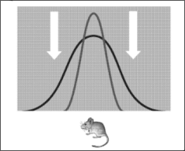
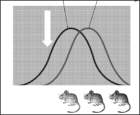
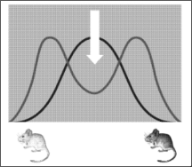

# Selection and Evolution

- [Selection and Evolution](#selection-and-evolution)
  - [Variation](#variation)
  - [Natural Selection](#natural-selection)
  - [Genetic Drift and Gene Flow](#genetic-drift-and-gene-flow)
    - [Genetic Drift](#genetic-drift)
  - [The Hardy-Weinbery principle](#the-hardy-weinbery-principle)
  - [Artificial Selection](#artificial-selection)
    - [Artificial selected maize seeds](#artificial-selected-maize-seeds)
  - [Evolution](#evolution)
  - [Evolutionary Relationship](#evolutionary-relationship)

## Variation

有两种不同的variation：

- continuous variation - human height / mass
- discontinuous variation - ABO blood groups, albinism haemophilia

Source of variation:

- crossing over
- independent assortment
- mutation
- random mating
- random fusion of gametes (random fertilisation)

| Discontinuous variation                                      | Continuous variation                                         |
| :----------------------------------------------------------- | :----------------------------------------------------------- |
| One/few genes control a phenotype                            | Several genes control a phenotype                            |
| Qualitative data                                             | Quantitative data                                            |
| Phenotypes fall into distinct/discrete categories with no intermediates | Phenotypes fall within a range between two extremes with many intermediates |
| Not a normal distribution (Bar chart)                        | Normal distribution (Histogram/line graph)                   |
| Caused by **genes (genotype) alone**; the environment has no direct effect on phenotype | Caused by **interaction between genes (genotype) and environment**; environment has considerable/large effect on phenotype |
| Variation caused by genes can be passed on from parents to offspring | Variation caused by genes can be passed on from parents to offspring; but variation caused by environment cannot be passed on |
| **At the genetic level:** ➢ Different genes have **different** effects on the phenotype ➢ Different **alleles** at a single gene locus have a **large** effect on the phenotype | **At the genetic level:** ➢ Different genes can have the **same** effect and an ***additive effect*** on the phenotype ➢ Different **alleles** at a single locus have a **small** effect on the phenotype ➢ If a large number of genes have a combined effect on the phenotype, they are known as **polygenes** |

The examples of environmental factors:

- length of sunlight hours
- supply of nutrients
- availability of water
- temperature range
- oxygen level

How the environment affects the phenotype:

1. phenotype results from the interaction of genotype and environment

2. environment may limit the expression of genes

3. e.g. the mass / height differs

4. different individual experiences different environment factors

5. environment may trigger gene

   > - temperature and change in animal colour
   > - high temperature and gender in crocodiles
   > - UV light and melanin production
   > - wavelength of light and, flowering / fruit colour

6. environment effect usually greater on polygenes

7. environment may induce mutation (affecting phenotype)

The **additive effect** of genes: if a feature is controlled by 2 or more unlinked genes, then these genes have an additive effect:

> The height of a plant is controlled by two unlinked genes **H / h** and **T / t**, these two genes have an **additive** effect:
>
> - The recessive alleles **h** and **t** contribute **x** cm to the plants height
> - The dominant alleles **H** and **T** contribute **2x** cm to the plants height
>
> The following genotypes will have the following phenotypes:
> - **h h t t**: $x + x + x + x = 4x$ cm
> - **H H T T**: $2x + 2x + 2x + 2x = 8x$ cm
> - **H h T t**: $2x + x + 2x + x = 6x$ cm
> - **H H T t**: $2x + 2x + 2x + x = 7x$ cm
> - **H h T T**: $2x + x + 2x + 2x = 7x$ cm
> - **h h T t**: $x + x + 2x + x = 5x$ cm
> - **H h t t**: $2x + x + x + x = 5x$ cm

## Natural Selection

1. Overproduction of offspring

   > Individuals in population have **great reproductive potential**, and produce many offspring.
   >
   > BUT numbers in population **remain roughly constant**

   Individuals have a **struggle for existence** and survival due to **selection pressure**, environmental factors act as a selection pressure and affect the chance of survival of an organism

   - Biotic environmental factors - predation, intraspecific 种内的 competition of limited resources, disease
   - Abiotic environmental factors - light availability, water supply, soil pH

2. Variation occurs

   - There is **genetic variation**, which is primarily caused by **random mutations** resulting in formation of **new alleles**
   - There is **variation in phenotype**, including **discontinuous variation and continuous variation**

3. Survival of the fittest

   The individuals with **advantageous alleles and characteristics** have **selective advantage / higher fitness** are **more likely** to survive, reproduce and pass on advantageous alleles to offspring

   On the other hand, individuals with disadvantageous alleles and characteristics die

   > - Advantageous alleles and characteristics are **selected for**
   > - Disadvantageous alleles and characteristics are **selected against**

4. 很长很长时间之后...

   After many generations, the frequency of **advantageous alleles** in the population increases, the accumulated variation results in **adaptation and speciation**

The importance of variation:

- make sure the individuals can survive and adapt in a changing environment

- avoid low genetic diversity

  > Low genetic diversity = **susceptible** to disease / environmental changes

---

Types of natural selection:

- stabilizing selection 向同一个特征演化
- directional selection 往一个趋势演化
- disruptive selection 向不同趋势演化，并逐渐分裂成不同的物种

| Stabilizing selection                                        | Directional selection                                        | Disruptive selection                                         |
| :----------------------------------------------------------- | :----------------------------------------------------------- | :----------------------------------------------------------- |
| - Intermediate phenotypes are selected for.   - Both extreme phenotypes are selected against. | - One extreme phenotype range is selected for.               | - Both extreme phenotypes are selected for.  - Intermediate phenotypes are selected against. |
| - Stabilising selection keeps allele frequencies **relatively constant** over generations. - Things stay as they are. | - Directional selection produces a **gradual change in allele frequencies** over time. - This usually happens when there is a **change in environment** / selection pressures or a new allele has appeared in the population that is advantageous. | - Disruptive selection maintains high frequencies of two different sets of alleles and different phenotypes (**polymorphism**) in a population. |
|  |   |  |

Examples of stabilising selection:

| Short flowers     | Medium flowers              | Tall flowers      |
| ----------------- | --------------------------- | ----------------- |
| DIE - no sunlight | SURVIVE - prefect condtions | DIE - wind damage |

| Light weight babies | Average weight babies | Heavyweight babies  |
| ------------------- | --------------------- | ------------------- |
| weaker              | healthy               | high mortality rate |

Examples of directional selection:

> Pale and dark moth:
>
> Selection pressure is predation by birds. The darker moths are better **camouflaged** 伪装 on the dark bark and are more likely to survive.
>
> 颜色和环境更加接近的会存活下来

> **The development of strains of antibiotic resistant bacteria** (e.g. MRSA)
>
> 1. There is genetic and phenotypic variation in bacteria. **A random gene mutation** might cause some bacteria to **become resistant to an antibiotic.**
> 2. When the population is treated with this antibiotic (**selection pressure**), **the resistant bacteria have a selective advantage** / fitter in the environment, so they are more likely to survive and reproduce, **passing on antibiotic resistance alleles to next generation**
> 3. Those non-resistant bacteria die.
> 4. Frequency of antibiotic resistance alleles **increases** in offspring over time.
> 5. Over time the whole population of bacteria becomes antibiotic resistant.

Example of disruptive selection: 不同鸟的喙有不同的功能

## Genetic Drift and Gene Flow

There are 3 main mechanisms that alter / change allele frequencies in a population:

1. natural selection
2. genetic drift - founder effect and bottleneck effect
3. gene flow - migration

### Genetic Drift

Chance events can cause random change in allele frequencies, especially in small populations.

**Founder effect**
When a few individuals become **isolated** (e.g. by being blown by a storm to an island) **from a larger population** (e.g. in the mainland China), they may **start a new population** with different allele frequencies than the original population. **Gene pool/genetic diversity decreases** in the new population.

- Gene pool: the complete range of DNA base sequences in **all the organisms in a species or population**
- Genome: the complete set of genes or genetic material in **a cell or an organism

**Bottleneck effect**
**A sudden change in the environment**, e.g. a natural disaster (like a fire or flood), may drastically reduce the size of a population, leading to **the loss of a large number of alleles** and therefore a **reduction in the gene pool/genetic diversity** of the species.

How the rare features becomes common in reduces population:

- these features are controlled by genes
- when the population went through a <u>bottleneck</u> genetic drift
- the number of alleles is reduced
- inbreeding reduces heterozygosity
- rare and recessive alleles show their effects

## The Hardy-Weinbery principle

> 在一个理想的大群体中，如果没有外界干扰，那么**基因频率**和基因型频率会一代代“原地不动”，永远保持不变。

The Hardy-Weinbery equations allow for the calculation of **allele and genotype frequencies** within populations.

- For alleles
  $$
  p + q = 1
  $$
  $p$: the frequency of dominant allele A

  $q$: the frequency of dominant allele a

- For grnotypes
  $$
  p^2 + 2pq + q^2 = 1
  $$
  $p^2$: homozygous dominant AA

  $2pq$: heterozygous Aa

  $q^2$: homozygous recessive aa

使用Hardy-Weinbery priciple时有五个条件：

| Condition                          | Consequence if Condition Does Not Hold                       |
| :--------------------------------- | :----------------------------------------------------------- |
| 1. No mutations                    | The gene pool is modified if mutations occur or if entire genes are deleted or duplicated. |
| 2. Random mating                   | If individuals mate within a subset of the population, such as near neighbors or close relatives (inbreeding), random mixing of gametes does not occur and genotype frequencies change. |
| 3. No natural selection            | Allele frequencies change when individuals with different genotypes show consistent differences in their survival or reproductive success. |
| 4. Extremely large population size | In small populations, allele frequencies fluctuate by chance over time (a process called genetic drift). |
| 5. No gene flow                    | By moving alleles into or out of populations, gene flow can alter allele frequencies. |

这一般与$\chi ^2$ test一起使用，将Hardy-Weinbery principle作为null hypothesis，如果不符合$H_0$，则正在发生进化（directional selection is occurring in the population）

## Artificial Selection

对植物进行人工选择的目的
- disease resistance in food crops 免疫疾病
- increased crop yield 增加产量

  >  **dwarf varieties** less susceptible to being knocked over by weather (e.g. wind) and use more energy into seeds than height
- hardiness to weather conditions (e.g. drought tolerance) 忍受极端天气
- better tasting fruits 更好吃
- large or unusual flowers 更具观赏性

对动物进行人工选择的目的

- cows, goats and sheep that produce lots of milk or meat 产奶
- chickens that lay large eggs 更大的鸡蛋
- domestic dogs that have a gentle nature 更温顺的宠物犬
- sheep with good quality wool 更好的羊毛
- horses with fine features and a very fast pace 更优质的马匹

---

The process of selective breeding / artificial selection:

1. **Humans** select parents with **desired traits** to **breed** them together. 把“优质”的个体配在一起
2. **Offspring** are tested, and those offspring which have the desired traits are chosen to be **bred** together. 筛掉不好的个体，继续配
3. This process is **repeated** for man generations. 一直重复

---

The disadvantages of artificial selection:

- Result of inbreeding
- Not for survivial
- Not just genes controlling the desired traits are involved in the process of artificial selection, all genes of the selected organisms are involved 无法精确控制哪些优质的基因会被传递下去，所有的基因会参与到遗传中。

Artificial selection会造成inbreeding近亲繁殖，近亲繁殖的后果是：

- Frequency of desired alleles increases, homozygosity increases 好的特征能被保留

- But this leads to **loss of alleles and loss of genetic variation and lowered genetic diversity**. 但是会降低基因多样性
- The chance of **harmful recessive alleles** combining to show their effects in phenotype as **homozygous** increases. 有危害的recessive alleles会更容易表达出来
- This leads to **loss of fitness**, and **loss of hybrid vigour/inbreeding depression**.

---

Artificial selection的方式：

1. **Artificial insemination**

   To maximize offspring from **suitable male**, allows...

   - long-distance mating 
   - avoid inbreeding depression.
2. **Embryo transplantation**

   To maximize offspring from **suitable female**.

---

The difference of artificial selection and natural selection:

| *artificial selection*                            | *natural selection*                                     |
| :------------------------------------------------ | :------------------------------------------------------ |
| selection (pressure by) humans                    | environmental selection pressure                        |
| genetic diversity lowered                         | genetic diversity remains high                          |
| inbreeding common                                 | outbreeding common                                      |
| loss of vigour / inbreeding depression            | increased vigour / less chance of inbreeding depression |
| increased homozygosity / decreased heterozygosity | decreased homozygosity / increased heterozygosity       |
| no isolation mechanisms operating                 | isolation mechanisms do operate                         |
| (usually) faster                                  | (usually) slower                                        |
| selected feature for human benefit                | selected feature for organism's benefit                 |
| not for, survival / evolution                     | promotes, survival / evolution                          |

### Artificial selected maize seeds

> **Inbreeding depression** of maize seeds: become progressively **smaller** and **weaker**.
>
> Farmers buy maize seeds from seed companies which use **inbreeding and hybridisation / outbreeding** to make maize seeds.
>
> 如果让玉米连续自花传粉（近亲繁殖），后代就会一代不如一代——**种子越变越小，植株也越来越弱**。

**Process of making maize seeds:**

1. **Inbreeding**

   Maize plants with desired traits are inbred for many generations to produce homozygous plants so that plants show **uniformity** but also inbreeding depression.

   先把具有优良性状（比如高产、抗病）的玉米连续自交很多代，直到得到**基因型“纯合”**的植株（比如 AABB 和 aabb）。

   **好处**：纯合植株长出来的后代**高度一致**（整齐划一，同时成熟，高度差不多）。

   **坏处**：这个阶段植株本身会表现出“自交衰退”（弱小）。

2. **Hybridisation / outbreeding**

   Then seed companies outbreed 2 homozygous maize parent plants with genotypes AABB and aabb respectively to obtain **F₁ generation** with heterozygous genotype AaBb.

   把 AABB 和 aabb 这两个纯合亲本进行杂交，得到**第一代杂交种（F₁代）**，基因型全是 AaBb。

   > **F₁ plants** have the same genotype AaBb, they:
   >
   > - show **uniformity**; ripen at about the same time and have about the same standard height.
   > - show **increased heterozygosity and hybrid vigour**; the chance of **harmful recessive alleles** combining to show their effects in phenotype as **homozygous** decreases.
   >
   > 这既避免了inbreeding depression，又能表现出优异的特质（同时成熟、高度一致）

> [!TIP]
>
> **Inbreed to pure, outbreed to cure.**
>
> 自交是为了“提纯”（获得稳定一致的纯合亲本），杂交是为了“复壮”（获得有杂种优势的强劲后代）。农民买的正是这种“杂交一代种子”。

人们倾向于选择dwarf varieties，因为它们：

- can put more energy into grain than into height 能量集中
- less susceptible to being knocked over by weather 抗造

> Dwarf varieties have mutant alleles for gibberellin synthesis

> [!NOTE]
>
> [Past Paper Question] Outline how selective breeding (artificial selection) has improved the yield of crops, such as wheat and maize.[7]
>
> *any seven from:*
>
> 1. choose parents with good features ; 挑选好的亲本
> 2. breed these ; 配在一起
> 3. repeat for many generations ; 重复，加强好的特质
> 4. introduction of disease resistance ; 产生免疫
> 5. named crop disease ;
> 6. dwarf varieties ; 挑选矮杆品种
> 7. (dwarf varieties) mutant alleles for gibberellin synthesis ; 它们gibberellin synthesis发生了变异
> 8. (dwarf varieties) more energy put into grain than into height (of plant) ; 它们能量更加集中
> 9. (dwarf varieties) less susceptible to being knocked over by weather ; 它们更加抗造
> 10. inbreeding leads to uniformity ; 它们很统一
> 11. named example ; e.g. standard height / cobs ready to harvest at same time 比如说：相同高度、成熟时间
> 12. hybridisation leads to hybrid vigour ; 杂交带来杂种优势（更强壮、更高产）

## Evolution

**Evolution** - a process leading to **speciation** from pre-existing species **over time**

**Speciation** - the formation of new species

> When a new species forms, it is reproductively isolated from pre-existing species

The 3 definitions of species:

1. **biological species**

   - a group of organisms with **similar morphology and physiology**
   - can breed together to **produce fertile offspring**
   - reproductively isolated from other species

2. **morphological species**

   a group of organisms that **share many physical features** that distinguish them from other species

3. **ecological species**

   a population of individuals of the same species living in the same area at the same time

Reproductive isolation可以体现在多个方面：

- individuals not recognising one another as potential mates or not responding to mating behaviour 不会把不同的物种视作交配对象
- animals being physically unable to mate 无法交配
- incompatibility of pollen and stigma in plants 同样不匹配
- inability of a male gamete to fuse with a female gamete 配子无法结合
- failure of cell division in the zygote无法细胞分裂
- non-viable offspring (offspring that soon die) 短命的后代
- viable but sterile offspring. 无法生育的后代

The theory of evolution:

1. formation of new species from pre-existing species
2. phenotype is changed
3. over many generations
4. as a result of natural selection
5. change in gene pool

---

There are 2 types of speciation:

1. Allopatric Speciation - caused by geographical isolation
2. Sympatric Speciation - not caused by geographical isolation

| **Process of allopatric speciation** 异域物种形成过程     | **Process of sympatric speciation** 同域物种形成过程      |
| :----------------------------------------------------------- | :----------------------------------------------------------- |
| Genetic drift, e.g. founder effect, happens. 遗传漂变发生，例如奠基者效应。 | Two populations are **ecologically isolated** and **behaviourally isolated**. 两个种群在生态上隔离且行为上隔离。 |
| Two populations are **geographically isolated** by ... 两个种群因地理隔离而分开... | Two populations are prevented from interbreeding. 两个种群无法进行杂交繁殖。 |
| Two populations are prevented from interbreeding. 两个种群无法进行杂交繁殖。 | They will experience different selection pressures and random gene mutations. 它们将经历不同的选择压力和随机基因突变。 |
| They will experience different selection pressures and random gene mutations. 它们将经历不同的选择压力和随机基因突变。 | There is **no gene flow** between them. 它们之间没有基因流动。 |
| There is **no gene flow** between them. 它们之间没有基因流动。 | In the two populations, different alleles and characteristics are selected for. 在两个种群中，不同的等位基因和特征被选择。 |
| In the two populations, different alleles and characteristics are selected for. 在两个种群中，不同的等位基因和特征被选择。 | Natural selection leads to change in allele frequencies and change in characteristics over time in the two populations respectively. 自然选择导致两个种群的等位基因频率和特征随时间分别发生变化。 |
| Natural selection leads to change in allele frequencies and change in characteristics over time in the two populations respectively. 自然选择导致两个种群的等位基因频率和特征随时间分别发生变化。 | **Over time**, the two populations are **reproductively isolated**. 随着时间的推移，两个种群在生殖上隔离。 |
| **Over time**, the two populations are **reproductively isolated**. 随着时间的推移，两个种群在生殖上隔离。 | **Sympatric speciation** happens. 同域物种形成发生。      |
| **Allopatric speciation** happens. 异域物种形成发生。     | **Meiosis problems** can lead to **polyploidy**多倍体, which can also result in sympatric speciation. 减数分裂问题可导致多倍体，这也能引起同域物种形成。 |

Isolation对于evolution的影响：

- 会造成allopatric speciation和sympatric speciation
- 一个是geographical isolation，一个是behavioural isolation
- 这都会阻止gene flow
- 它们会面临不同的selective pressure
- natural selection会造成change in allele frequencies, 并使gene pool发生改变
- over many generations, they are reproductively isolated

## Evolutionary Relationship

Nucleus和mitochondria中的DNA可以展示进化关系（evolutionary relationship），越相似的DNA序列，说明二者的关系越近。

**How to tell evolutionary relationship**

1. Obtain base sequences of DNA in two species/organisms and obtain amino acid sequences of some specific proteins in two species/organisms

   提取DNA

2. Compare base sequences of DNA and amino acid sequences of proteins in two species/organisms

   比较DNA序列

3. Based on **molecular clock hypothesis** which assumes a constant rate of mutation over time, the more similar the sequences are, the more closely related the two species/organisms are and the less time ago they shared a common ancestor

在mitochondria中的DNA（一般写完成$mtDNA$）比在细胞核中的DNA更适合研究evolution，因为：

- mutation在mitochondria中发生得更快
- 更容易提取 - not protected by histone
- large quantity in body
- no enzyme to repair DNA mutations
- no mixing of DNA at fertilisation, it's only inherited from mother