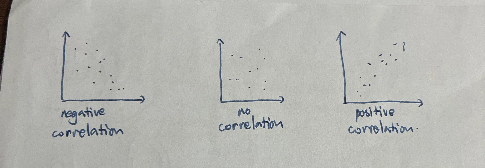

# Classification Biodiversity and Conservation

- [Classification Biodiversity and Conservation](#classification-biodiversity-and-conservation)
  - [Classification](#classification)
    - [Domains](#domains)
    - [Protoctist](#protoctist)
    - [Fungi](#fungi)
    - [Virus](#virus)
  - [Biodiversity](#biodiversity)
    - [Species richness](#species-richness)
      - [Random Sampling using Quadrats](#random-sampling-using-quadrats)
      - [Systematic Sampling](#systematic-sampling)
      - [Mark-release-recapture Method](#mark-release-recapture-method)
    - [Species Diversity - Simpson's index of diversity](#species-diversity---simpsons-index-of-diversity)
    - [Correlation](#correlation)
      - [Pearson's linear correlation](#pearsons-linear-correlation)
      - [Spearman's rank correlation](#spearmans-rank-correlation)
    - [Difference in mean - t-test](#difference-in-mean---t-test)
    - [Preconditions of carrying out the statistical tests](#preconditions-of-carrying-out-the-statistical-tests)
  - [Conservation](#conservation)
    - [Role of IUCN and CITES in conservation](#role-of-iucn-and-cites-in-conservation)

## Classification

所有的生物都可以被分成三个大类（domains）：

- **Bacteria** - 细菌
- **Eukarya** - 动物，植物，真菌，原生生物 Protoctist
- **Archaea** 古生菌 - 介于植物和动物之间的活物

生物分类有等级之分：**Taxonomic hierarchy**

| Taxonomic units/taxa (singular) | Taxonomic units/taxa (plural) | 分类阶元 | Mnemonic |
| :------------------------------ | :---------------------------- | :------- | :------- |
| domain                          | domains                       | 域       | Dumb     |
| kingdom                         | kingdoms                      | 界       | King     |
| phylum                          | phyla                         | 门       | Philip   |
| class                           | classes                       | 纲       | Came     |
| order                           | orders                        | 目       | Over     |
| family                          | families                      | 科       | For      |
| genus                           | genera                        | 属       | Good     |
| species                         | species                       | 种       | Soup     |

- **taxonomy** 生物分类法: the branch of science concerned with classification, especially of organisms
- **taxon** (plural: taxa): taxonomic unit/rank/group

对于一个“species”，有三个不同角度的定义：

- 生物角度：biological species
  - a group of organisms which can **interbreed / reproduce**
  - ... to produce **fertile** offspring
  - ... and are **reproductively isolated** from other species 生殖隔离
- 外观角度：morphological species
  - a group of organisms that **share many physical features** that distinguish them from other species
- 生态角度：ecological species
  - a population of individuals of the same species living in the **same area at the same time** 同一时间同一区域中的一个种群

如果只用biological species作为species的定义的话，有些局限性：

- for organisms that do not breed sexually / are asexual 有些生物是无性繁殖
- for fossil 化石不是活物
- morphological differences are easier to determine
- often not possible to observe reproductive behaviour
- time required for mating behaviour may take too long to observed

一个物种在生物学上通过binomial naming system来命名：_Genus species_

### Domains

| Features              | Bacteria & Archaea                                                                                                                  | Eukarya                                                                                    | Notes        |
| :-------------------- | :---------------------------------------------------------------------------------------------------------------------------------- | :----------------------------------------------------------------------------------------- | ------------ |
| **Cell type**         | Prokaryotic                                                                                                                         | Eukaryotic                                                                                 | 有无细胞核   |
| **Nucleus**           | Absent                                                                                                                              | Present                                                                                    |              |
| **Cell size**         | 0.5-5μm                                                                                                                             | 10-100μm                                                                                   | 大小区别[^1] |
| **DNA**               | Circular; often have plasmids                                                                                                       | Linear in nucleus; circular in chloroplasts and mitochondria                               |              |
| **Organelles**        | No membrane-bound organelles                                                                                                        | Have **membrane-bound organelles**, e.g., mitochondria                                     |              |
| **Size of Ribosome**  | 70S                                                                                                                                 | 80S in cytosol, 70S in chloroplasts and mitochondria                                       |              |
| **Cell division**     | Binary fission                                                                                                                      | Mitosis; asexual or sexual reproduction                                                    |              |
| **Cell organization** | Unicellular                                                                                                                         | Unicellular, multicellular/colonial                                                        |              |
| **Cell wall**         | ✓ Bacteria: made of peptidoglycan/murein  ✓ Archaea: not made of peptidoglycan/murein                                            | ✓ Plant cell: cellulose  ✓ Fungal cell: chitin  ✓ Protist plant-like cell: cellulose | 细胞壁成分   |
| **Histones**          | ✓ Bacteria: histone-like proteins are associated with chromosomal DNA.  ✓ Archaea: histones are associated with chromosomal DNA. | Histones are associated with chromosomal DNA.                                              |              |

[^1]: 真核细胞的细胞核更大

Bacteria和Archaea之间有些相似的地方：

- 没有细胞核
- 有circular DNA和plasmid（大多数）
- 没有membrane-bounmd organelles
- 70S ribosomes
- binary fission
- 通常是unicellular
- 有细胞壁

但也有些区别：

- **Bacteria**
  - peptidoglycan cell wall
  - no histones but **histone-like proteins**

- **Archaea**
  - **histone**

  - 不同的membrane lipid

  - ribosome更像是真核细胞中的

  - 有些是extremophiles [extrem-o-phile s] 极端生物

    > live in extreme environments, such as hot spring, around deep volcanic vents in the ocean

### Protoctist

如果说archaea是介于bacteria和eukaryote之间，那么protoctist就介于动物和植物之间：

- **Algae** - an example of _plant-like cell_
  - have cellulose cell wall, vacuole and chloroplast 植物细胞的特征
  - multicellular 不同于单细胞的细菌
  - autotrophic 自给的
  - motile 可以移动

- **Protozoa** - an example of _animal-like cell_
  - no cell wall, no chloroplast, and no vacuole
  - unicellular
  - heterotrophic
  - motile

### Fungi

- chitin cell wall

- no cilia, no chlorophyll, and no photosynthesis

- heterotrophic

- reproduce by spores

- can be unicellular, or multicellular and made of thread-like hyphae

  > all the hyphae that grow from a single spore, form the **mycelium**

Large fungi such as mushrooms produce "fruiting bodies" to release spores

| Kingdom Plantae                                                                                                      | Kingdom Animalia                                                                                                                                                                      |
| :------------------------------------------------------------------------------------------------------------------- | :------------------------------------------------------------------------------------------------------------------------------------------------------------------------------------ |
| ① Eukaryotic;                                                                                                        | ① Eukaryotic;                                                                                                                                                                         |
| ② Multicellular; cells are able to differentiate into **few** types of specialized cells to form tissues and organs; | ② Multicellular; cells are able to differentiate into **many** types of specialized cells to form tissues and organs; communication is by the nervous system and chemical signalling. |
| ③ Cell wall made of cellulose;                                                                                       | ③ No cell wall;                                                                                                                                                                       |
| ④ Large, permanent vacuole for support;                                                                              | ④ Small temporary vacuoles and no large vacuoles;                                                                                                                                     |
| ⑤ Some cells have chloroplasts and photosynthesise; autotrophic;                                                     | ⑤ Don't have chloroplasts and don't photosynthesise; heterotrophic;                                                                                                                   |
| ⑥ Not motile but cells like male gametes in ferns have flagella for movement.                                        | ⑥ Motile; some cells have cilia or flagella;                                                                                                                                          |

### Virus

Features:

- 0.02\~0.3 微米
- acellular
- contain DNA or RNA (the nucleic acid can be single-stranded or double-stranded)
- capsid made of capsomeres

They are all **parasites**, they cannot reproduce on their own without host cells, and only reproduce by **infecting living host cells** and using biochemical machinery of host cells.

## Biodiversity

**Species** 种 - a group of organisms which can interbreed/reproduce to produce fertile offspring and are reproductively isolated from other species

**Population** 种群 - all of the organisms of one species, living in the same area at the same time

**Community** 群落 - all of the populations of all species in an ecosystem at a particular time

**Ecosystem** 生态系统 - a relatively self-contained and self-sustaining unit, containing interacting community of all organisms, and the environment in which they live and with which they interact. There are both living (biotic) components and non-living (abiotic) components within an ecosystem.

**Habitat** 栖息地 - the place where an organism lives

**Niche** 生态位 - the role of an organism in an ecosystem, including where it lives and how it obtains its energy

Biodiversity有三个层级：

1. Ecosystem（整体）
2. Species（个体）
3. Genetic（基因）

Species diversity关联到**species richness**和**species evenness**

### Species richness

The <u>more species there are</u>, and the <u>more evenly the number of organisms</u> among the different species is distributed, the greater the species diversity. 一个生态系统内，物种数量越多，分布数量越平均，物种多样性越高。

计算物种多样性的方法：

- **random sampling** using **quadrates to avoid bias**
- **systematic smapling** using **transects**
- **mark-release-recapture** method for **mobile animals**

不同的情况下，有不同的方法。

#### Random Sampling using Quadrats

> Use this method when: an area looks **reasonably uniform** or there is **no clear pattern** to the way species are distributed, and **avoid bias**

1. Place quadrats at randomly chosen positions and record data

2. Calculate **species frequency** and **specioes density**, estimate **percentage cover** or use **cover scale**
   - species frequency：如果在n个quadrats中找到了x个物种，那么species frequency为：

     $$
     \frac{x}{n}
     $$

   - species density：species frequency除以总面积：

     $$
     \frac{x}{an}
     $$

     其中a为单个quadrat的面积，an是总面积

   - cover scale（在无法数出具体数字时使用）

#### Systematic Sampling

Throughout some areas, there can be **changes in the physical conditions**. For example, there mayt be changes in:

- altitude
- soil pH
- light intensity

then systematic sampling is more appropriate to use.

有两种方法可以进行systematic sampling:

- Line transect - 可以获得qualitative data

  Lay out a measuring tape in a straight line across the sample area

  At set equal distances (e.g. every 2m) along the tape, record the **identity** of the organisms that touch the line.

- Belt transect - 可以获得quantitative data

  Lay out a measuring tape in a straight line across the sample data (和line transect的第一步一样)

  At set equal distance (e.g. every 2m) along the tape, **place quadrats** and record the **abundance** of each species within each quadrat

#### Mark-release-recapture Method

> To estimate abundance / population size of **mobile animals**

1. capture a large number $n_1$ of animals, mark them in a way that will not affect their chances of survival
2. Marked animals are returned to their habitat and allowed to randomly mix with the rest of the population
3. Given enough time, another large sample $n_2$ is captured, the number of marked individuals $m$ in the sample is counted

这些数字和population $N$ 的关系为：

$$
\begin{aligned}
N \times \frac{m_2}{n_2} &= n_1 \\
N &= \frac{n_1 \times n_2}{m_2}
\end{aligned}
$$

### Species Diversity - Simpson's index of diversity

> to calculate the biodiversity/species diversity of an area

$$
D = 1 - \left( \sum \left( \frac{n}{N} \right)^2 \right)
$$

- \(n\) is the total number of organisms of a particular species

- \(N\) is the total number of organisms of all species

The range of index \(D\) is **from 0 to 1**; the higher the index, the higher the biodiversity/species diversity.

例：计算Shore A的biodiversity

1. 根据表格，计算出Shore A的总个体数
2. 计算每一个物种的$\frac{n}{N}$
3. 在每个物种$\frac{n}{N}$的基础上平方，得$(\frac{n}{N})^2$
4. 将每个物种的$(\frac{n}{N})^2$相加，得$\sum \left(\frac{n}{N}\right)^2$
5. 计算最终的bio**d**iversity $D$：$1 - \sum \left(\frac{n}{N}\right)^2$

| Species                                | Shore A: $n$ | Shore A: $\frac{n}{N}$ |        Shore A: $(\frac{n}{N})^2$         |
| :------------------------------------- | :----------: | :--------------------: | :---------------------------------------: |
| painted topshells                      |      24      |         0.022          |                   0.000                   |
| limpets                                |     367      |         0.332          |                   0.110                   |
| dogwhelks                              |     192      |         0.173          |                   0.030                   |
| snakelocks anemones                    |      14      |         0.013          |                   0.000                   |
| beadlet anemones                       |      83      |         0.075          |                   0.006                   |
| barnacles                              |     112      |         0.101          |                   0.010                   |
| mussels                                |     207      |         0.187          |                   0.035                   |
| periwinkles                            |     108      |         0.098          |                   0.010                   |
| **total number of individuals, \(N\)** |   **1107**   |                        | $\sum \left(\frac{n}{N}\right)^2 = 0.201$ |

For shore A, **Simpson's index of diversity** $D = 1 - 0.201 = 0.799$

### Correlation

> Statistical tests to determine if there is a correlation between 2 variables (2 species/a species and an abiotic factor)

- Correlation is different from causation (cause-and-effect relationship).

- A correlation coefficient相关系数 ranges from -1 to 1.
  - 0 means no correlation; -1 means the strongest negative correlation; 1 means the strongest positive correlation.

  

- Null hypothesis: there is no correlation between the two variables.

The formula for calculating **Pearson's linear correlation coefficient** is:

$$
r = \frac{\sum xy - n\bar{x}\bar{y}}{(n-1)s_xs_y}
$$

The formula for calculating **Spearman's rank correlation coefficient** is:

$$
r_s = 1 - \frac{6 \times \sum D^2}{n^3 - n}
$$

#### Pearson's linear correlation

使用条件：

- Both data are **continuous quantitative data**
- Both data show a **normal distribution**

$$
r = \frac{\sum xy - n\bar{x}\bar{y}}{(n-1)s_xs_y}
$$

计算方法：

| Quadrat | Number of individuals of species P | Number of individuals of species Q |
| :-----: | :--------------------------------: | :--------------------------------: |
|    1    |                 10                 |                 21                 |
|    2    |                 7                  |                 20                 |
|    3    |                 8                  |                 22                 |
|    4    |                 7                  |                 17                 |
|    5    |                 6                  |                 16                 |
|    6    |                 14                 |                 23                 |
|    7    |                 9                  |                 20                 |
|    8    |                 12                 |                 24                 |
|    9    |                 12                 |                 22                 |
|   10    |                 9                  |                 19                 |

- 计算第一组数据的平均数：$\bar x$
- 计算第二组数据的平均数：$\bar y$
- 计算$\sum xy$：在表格中看就是横向的两个数据相乘，并将所有乘积相加

然后在计算第一组数据和第二组数据的standard division标准差：

- $s_x$:

  $$
  s = \sqrt{\frac{\sum(x - \bar{x})^2}{n - 1}} = \sqrt{\frac{1}{n-1} \left( \sum x^2 - \frac{1}{n}(\sum x)^2 \right)}
  $$

- 计算$s_y$的方式同理

最后将上卖弄算出的5个部分带入到$r$的公式中：

$$
r = \frac{\sum xy - n\bar{x}\bar{y}}{(n-1)s_xs_y}
$$

> **EXAMPLE**
>
> |        Quadrat         | Number of species P, \(x\) | Number of species Q, \(y\) |      \(xy\)      |
> | :--------------------: | :------------------------: | :------------------------: | :--------------: |
> |           1            |             10             |             21             |       210        |
> |           2            |             7              |             20             |       140        |
> |           3            |             8              |             22             |       176        |
> |           4            |             7              |             17             |       119        |
> |           5            |             6              |             16             |        96        |
> |           6            |             14             |             23             |       322        |
> |           7            |             9              |             20             |       180        |
> |           8            |             12             |             24             |       288        |
> |           9            |             12             |             22             |       264        |
> |           10           |             9              |             19             |       171        |
> |        **mean**        |      $\bar{x} = 9.2$       |      $\bar{y} = 20.4$      | $\sum xy = 2126$ |
> | **standard deviation** |        $s_x = 2.10$        |        $s_y = 2.55$        |                  |
>
> **Calculation Steps**
>
> 1. **Add up all the values of \(xy\) to find \(\sum xy\).**
>    - $\sum xy = 2126$
>
> 2. **Calculate the means for each set of figures, \(\bar{x}\) and \(\bar{y}\).**
>    - $\bar{x} = 9.2\), \(\bar{y} = 20.4$
>
> 3. **Calculate \(n\bar{x}\bar{y}\).**
>    - Here, $n = 10$, $\bar{x} = 9.2$ and $\bar{y} = 20.4$
>    - $n\bar{x}\bar{y} = 10 \times 9.2 \times 20.4$
>    - $n\bar{x}\bar{y} = 2080.8$
> 4. **Now calculate the standard deviation, \(s\), for each set of figures.**
>
>    **standard deviation\***: $s_x = 2.10$ and $s_y = 2.55$
>
> 5. **Now substitute your numbers into the formula and calculate \(r\).**
>
> $$
> \begin{aligned}
> r &= \frac{\sum xy - n\bar{x}\bar{y}}{(n-1)s_xs_y} \\
>   &= \frac{2124 - (10 \times 9.2 \times 20.4)}{9 \times 2.10 \times 2.55} \\
>   &= \frac{2124 - 2080.8}{48.20} \\
>   &= \frac{43.2}{48.20} \\
>   &= 0.896
> \end{aligned}
> $$

#### Spearman's rank correlation

- not in normal distribution
- no linear correlation

$$
r_s = 1 - \frac{6 \times \sum D^2}{n^3 - n}
$$

**Calculation**:

| Quadrat | Number of species R | Number of species S |
| :-----: | :-----------------: | :-----------------: |
|    1    |         38          |         24          |
|    2    |          2          |          5          |
|    3    |         22          |          8          |
|    4    |         50          |         31          |
|    5    |         28          |         27          |
|    6    |          8          |          4          |
|    7    |         42          |         36          |
|    8    |         13          |          6          |
|    9    |         20          |         11          |
|   10    |         43          |         30          |

1. rank each set of data, with the largest / smallest number ranked as 1

   > 通常来说是**把最小的排为1**

   | Quadrat | Number of species R | Rank for species R | Number of species S | Rank for species S |
   | :-----: | :-----------------: | :----------------: | :-----------------: | :----------------: |
   |    1    |         38          |         7          |         24          |         6          |
   |    2    |          2          |         1          |          5          |         2          |
   |    3    |         22          |         5          |          8          |         4          |
   |    4    |         50          |         10         |         31          |         9          |
   |    5    |         28          |         6          |         27          |         7          |
   |    6    |          8          |         2          |          4          |         1          |
   |    7    |         42          |         8          |         36          |         10         |
   |    8    |         13          |         3          |          6          |         3          |
   |    9    |         20          |         4          |         11          |         5          |
   |   10    |         43          |         9          |         30          |         8          |

2. Calculate the differences in rank, $D$

3. square each of these values

4. add them together to find total difference squared

   | Quadrat | Rank for species R | Rank for species S | Difference in rank $D$ |      $D^2$      |
   | :-----: | :----------------: | :----------------: | :--------------------: | :-------------: |
   |    1    |         7          |         6          |           1            |        1        |
   |    2    |         1          |         2          |           -1           |        1        |
   |    3    |         5          |         4          |           1            |        1        |
   |    4    |         10         |         9          |           1            |        1        |
   |    5    |         6          |         7          |           -1           |        1        |
   |    6    |         2          |         1          |           1            |        1        |
   |    7    |         8          |         10         |           -2           |        4        |
   |    8    |         3          |         3          |           0            |        0        |
   |    9    |         4          |         5          |           -1           |        1        |
   |   10    |         9          |         8          |           1            |        1        |
   |         |                    |                    |                        | $\sum D^2 = 12$ |

5. apply the formula to calculate the test statistic

   > The formula for calculating Spearman's rank correlation coefficient is:
   >
   > $$
   > r_s = 1 - \left( \frac{6 \times \sum D^2}{n^3 - n} \right)
   > $$

   $$
   \begin{aligned}
   r_s &= 1 - \left( \frac{6 \times \sum D^2}{n^3 - n} \right) \\
       &= 1 - \left( \frac{6 \times 12}{10^3 - 10} \right) \\
       &= 1 - \frac{72}{1000 - 10} \\
       &= 1 - \frac{72}{990} \\
       &= 1 - 0.072... \\
       &= 0.923... \\
       &= 0.93 \text{ (to 2 decimal places)}
   \end{aligned}
   $$

6. 将结果拿去查表：

   |         $n$          |  5   |  6   |  7   |  8   |  9   |  10  |  11  |  12  |  14  |  16  |
   | :------------------: | :--: | :--: | :--: | :--: | :--: | :--: | :--: | :--: | :--: | :--: |
   | Critical value $r_s$ | 1.00 | 0.89 | 0.79 | 0.74 | 0.70 | 0.65 | 0.62 | 0.59 | 0.54 | 0.50 |

   - 如果calculated $r_s \le \text{critical value}$：no strong correlation

   - 如果calculated $r_s \gt \text{critical value}$：strong correlation

### Difference in mean - t-test

使用条件：

- the underlying population follows normal distribution
- data are continuous and quantitative

Hypothesis:

- $H_0$: $\mu_{x} - \mu_y = 0$
- $H_1$: $\mu_{x} - \mu_y \ne 0 \mid \mu_{x} - \mu_y \lt 0 \mid \mu_{x} - \mu_y \gt 0$

Formula:

$$
T = \frac{(\bar{X} - \bar{Y}) - (\mu_X - \mu_Y)}{\sqrt{\frac{s_x^2}{n_X} + \frac{s_y^2}{n_Y}}}
$$

其中：

- $\bar{X}$ and $\bar{Y}$: 对应数据的平均数

- $\mu_X - \mu_Y$: 来源于上面的null hypothesis $H_0$

- $n_X$ and $n_y$: 对应数据的样本数

- $s_x^2$ and $s_y^2$: 对应数据的方差Variance

  > $s_x^2$的计算方式：
  >
  > $$
  > S_{XX} = \sum x^2 - \frac{1}{n}(\sum x)^2
  > $$
  >
  > $\sum x^2$ 指样本的 Variance.
  >
  > $$
  > s_x^2 = \frac{1}{n-1} S_{XX}
  > $$

最后将算出的东西套进$T$的公式里即可算出test-statistic

把test-statistic拿去查表（查得critical value）

> degree of freedom $v = (n_1 - 1) + (n_2 - 1) = n_1 + n_2 - 2$

- if test-statistic > critical value: reject $H_0$

### Preconditions of carrying out the statistical tests

- $\chi^2$ test - **quantitative**, **nominal**/categoric data 名义/分类数据
- Pearson's linear correlation
  - **continuous**, **quantitative** data
  - data are **normally distributed**
  - scatter graph shows there is a linear correlation/relationship
- Spearman's rank correlation
  - **not continuous quantitative data**
  - data may **not show a normal distribution**
  - scatter graph shows there is a relationship
- $t$-test
  - **continuous**, **quantitative** data
  - data are **normally distributed**\
  - standard deviations of the two sets of data are **very similar**

## Conservation

要维持生态多样性的原因：

1. moral and ethical reason 道德责任
2. ecological reason 生态原因 - 更多样的生态环境有助于生存
3. economic reason 经济原因 - 旅游和医药行业依赖生态的多样性
4. aesthetic reason 享受自然
5. agricultural reason 农业
6. environmental reasons 自然环境可以降解有机垃圾，和吸收二氧化然

会灭绝是因为：

1. Climate change
2. Increased competition for resources
3. Hunting by humans **for sport** or **for food** or **for trade**
4. Introduction of alien species - by altering the food web
5. Degradation and loss of habitats
6. Decrease in food and increase in disease

> 有些动物没有灭绝，但是endangered - fall in numbers, in danger of becoming extinct

Methods of conservation and protecting endangered species:

- zoos and botanic gardens 动物园和植物园

  Research

  Education

  Captive breeding programmes

  > **Botanic Gardens**
  >
  > - collect seeds from the wild, from many countries
  > - ... especially from the high risk areas
  > - plants are grown in botanic garden
  > - ... and increase the seed number
  > - the seeds can store in seed bank, to maintain the genetic diversity
  > - can cooperate with other institutes, for research, **conserve** habitats and **restore** habitats, and **reintroduce** species to wild
  > - raise fund and public awareness

- conserved areas (including national parks and marine parks) 保护区

  Increase public engagement, and protect the species through restricted regulations

- seed banks and frozen zoos 基因库

  Long term storage of genetic materials at very low temperature

  > **Seed** **Bank**
  >
  > - varied collection of seeds, and maintain the genetic diversity **and** biodiversdity
  > - provide long term storage
  > - have to prevent germination (in frozen condition)
  > - seeds are regularly tested for **viability**

**Captive breedgin programme** - used to increase their number for reintroducing them to the wild when their habitats are restored

| Advantage                             | Disadvantage                                   |
| ------------------------------------- | ---------------------------------------------- |
| Provide **adequatic** food            | stress in captivity                            |
| healthcare                            | behavioural changes                            |
| protection from predators and disease | difficulties in reintroduce them into the wild |

Method of assisted reproduction:

- in vitro fertilisation 体外受精
- artificial insemination 人工受精
- embryo transfer 胚胎移植 and surrogacy 代孕

**IVF (In Vitro Fertilization) Process**

1. Hormone treatment used to stimulate superovulation 使用激素促进排卵

2. Many oocytes harvested from female 采集多个卵母细胞

3. Obtain fresh/frozen sperm from a male 获取男性的精子

4. Oocytes mixed with sperm for fertilization in a Petri dish; ideally genetically different 混合受精

5. Conduct genetic test and select embryos that are most likely to survive 基因测序，筛选出存活率最高的胚胎

6. Embryo transferred to uterus 将胚胎转移回子宫

**Artificial Insemination (AI) Process**

1. Collect semen 收集精液

2. Screen semen to select sperms that are ideally genetically different, fertile and disease-free 筛选出最“强大”的精子

3. Injection of semen collected from a male into the uterus 将精液注射回子宫

**Surrogacy (代孕) Process**

1. Embryos from the uterus of a female mammal transferred to the uterus of a surrogate 代孕的 female of a similar species or non-rare breed

   > or embryos obtained by IVF transferred to the uterus of egg donor female/surrogate female

2. In surrogacy, embryos can be conceived naturally, by AI or by IVF.

### Role of IUCN and CITES in conservation

**International Union for Conservation of Nature (IUCN) 世界自然保护联盟**

- Assess the **conservation status** of animal and plant species around the world.
- IUCN **Red List** of Threatened Species

**Convention 公约 on International Trade in Endangered Species of Wild Fauna and Flora (CITES)**

- A **global agreement** that has been signed by over 150 countries to **control the trade of endangered species** and their associated products.

CITES Appendices I, II and III (to categorize endangered and vulnerable species)

| CITES Appendix | Criteria                                                     | Trading regulations                                          | Animal examples                                              | Plant examples                                               |
| :------------: | :----------------------------------------------------------- | :----------------------------------------------------------- | :----------------------------------------------------------- | :----------------------------------------------------------- |
|     **I**      | Species that are the most endangered and threatened with extinction | All trade in species or their products is banned             | Orangutans, *Pongo abelii* and *P. pygmaeus* (Borneo, Indonesia) | Kinabalu pitcher plant, *Nepenthes kinabaluensis* (Malaysia) |
|     **II**     | Species that are not threatened with extinction, but will be unless trade is closely controlled | Trade is only allowed if an export permit is granted by the countries concerned | Sir David's long-beaked echidna, *Zaglossus attenboroughi* (Papua, Indonesia) | All species in the genus *Nepenthes*; Venus fly trap, *Dionaea muscipula* |
|    **III**     | Species included at the request of a country that regulates trade in the species and needs the cooperation of other countries to prevent unsustainable or illegal exploitation | Trade in these species is regulated; permits are required, but they are easier to obtain than for species in Appendix II | Mauritian pink pigeon, *Columba mayeri*                      | Spur tree from Nepal, *Tetracentron sinense*                 |

| 附录    | 标准                                       | 贸易规定                              | 动物示例                                      | 植物示例                                                     |
| :------ | :----------------------------------------- | :------------------------------------ | :-------------------------------------------- | :----------------------------------------------------------- |
| **I**   | **最濒危**，面临灭绝风险                   | **全面禁止**商业性国际贸易            | 猩猩（*Pongo abelii*、*P. pygmaeus*）         | 基纳巴卢猪笼草（*Nepenthes kinabaluensis*）                  |
| **II**  | 当前未灭绝，但**不严控则会濒危**           | **须出口国签发许可**方可贸易          | 阿滕伯勒长喙针鼹（*Zaglossus attenboroughi*） | **所有猪笼草属（\*Nepenthes\*）**、捕蝇草（*Dionaea muscipula*） |
| **III** | 某国**主动请求**列入，需他国协助防过度利用 | **需许可证**，获取**难度低于附录 II** | 毛里求斯粉红鸽（*Columba mayeri*）            | 尼泊尔水青树（*Tetracentron sinense*）                       |

> [!NOTE]
>
> *9700/41/M/J/14* **With reference to any named species of plant or animal, explain why this species is considered to be endangered and outline the reasons that have caused it to become endangered.** [8] 
>
> ---
>
> **Mark Scheme:**
>
> - fall in numbers ;
> - danger of becoming extinct ;
> - ref. (IUCN/International Union for Conservation of Nature)/red list ;
>
> *one mark for idea, additional mark if qualified with point specific to named example.*
>
> **e.g.**
>
> | Idea                                               | 注                                                           |
> | -------------------------------------------------- | ------------------------------------------------------------ |
> | **habitat destruction**                            | **栖息地破坏**（如砍伐、填埋、开发，导致物种失去生存空间）   |
> | **climate change**                                 | **气候变化**（温升、极端天气、海平面上升，影响物种繁殖与分布） |
> | **increase in disease**                            | **疾病增加**（环境压力或病原体扩散，导致种群死亡率上升）     |
> | **increase in predators / grazers**                | **捕食者/食草动物增加**（天敌或竞争性食草者数量上升，威胁目标物种） |
> | **decrease in food**                               | **食物减少**（资源匮乏，导致营养不足、繁殖率下降）           |
> | **named pollutant and habitat affected**           | **特定污染物及其影响生境**（如农药污染水体、重金属毒害土壤，直接损害物种健康） |
> | **hunting / killing / poaching / removal (plant)** | **猎杀/偷猎/盗采（植物）**（人为非法捕杀动物或采挖植物，直接减少个体数量） |
> | **increased competition**                          | **竞争加剧**（外来种或同域物种争夺资源，挤压本土物种生存空间） |
> | **lack of human education**                        | **缺乏公众教育**（当地居民不了解保护意义，继续破坏或消费濒危物种） |
> | **disturbance to breeding sites**                  | **繁殖地干扰**（人为活动如旅游、施工、噪音，破坏交配、筑巢或育幼场所） |
>
> ---
>
> **Exemplar answer:**
>
> <u>Red Panda</u> is an endangered species because **it is in danger of becoming extinct**. It **falls in numbers**. It is in the **IUCN red list of threatened species**. The reasons are as follows:
>
> 1. **Climate change**, e.g. <u>global warming</u> and <u>rise in temperature</u>
> 2. **Hunting by humans** for sport or food or trade in animal parts
> 3. **Degradation and loss of habitats** due to <u>deforestation, pollution</u>, etc.
> 4. **Increased competition for resources**, such as <u>food and water</u>, between species and between individuals of the same species
> 5. Introduction of <u>invasive alien species</u>
