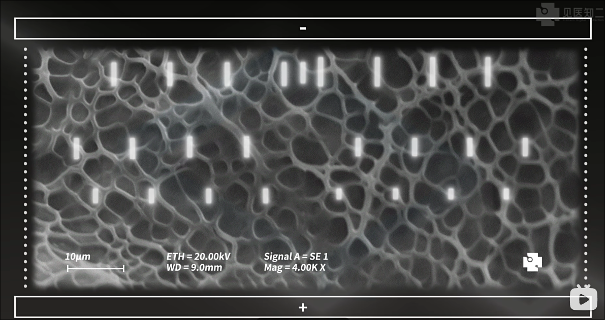
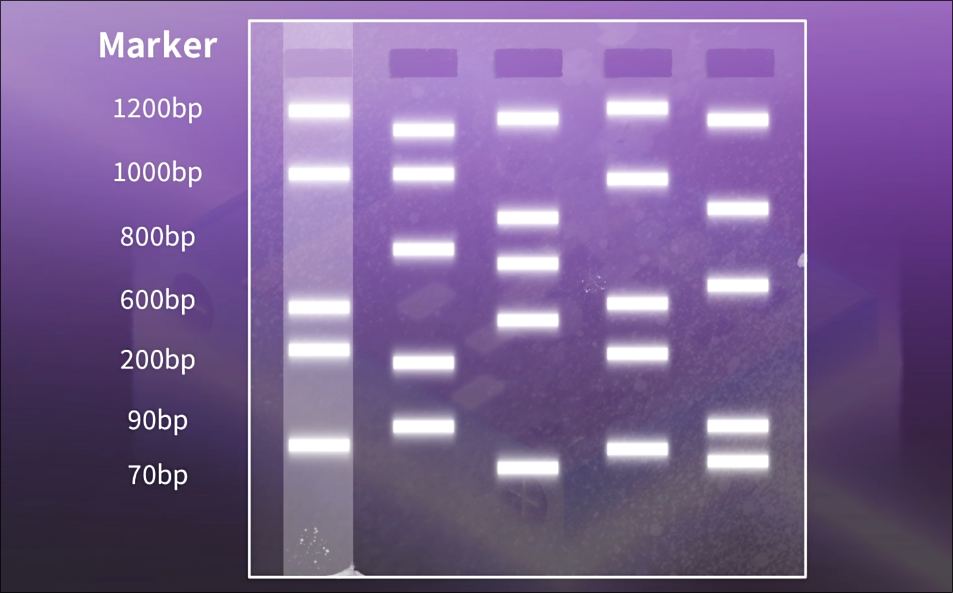
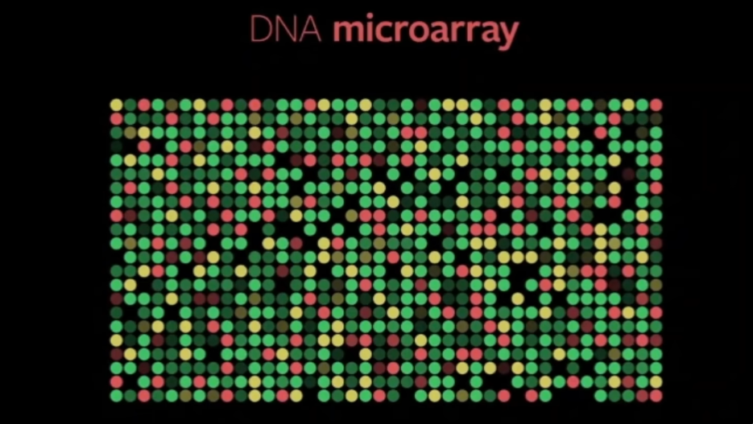

# Genetic Technology

## Genetic Engineering

Genetic Engineering - the deliberate manipulation and modification of an organism's genetic material to modify specific characteristics. It may involve transferring a gene into an organism so that the gene is expressed.

Examples:

- Transgenesis 转基因 - introducing foreign genes (from a different species) into an organism's genome to express new traits.

  > The organism which now expresses the new gene(s) is known as a **transgenic organism** or a **genetically modified organism (GMO)**

- Gene editing

- Gene therapy

### Transgenesis

1. Identify and obtain the gene of interest.

   > There are three ways to identify and obtain the gene of interest
   >
   > 1. Cut from chromosomal DNA using **restriction endonuclease**
   > 2. Made by making a single-stranded complementary DNA (cDNA) from mRNA by **reverse transcriptase** and then converting the cDNA into a double-stranded DNA molecule by **DNA polymerase**
   > 3. Synthesised chemically from nucleotides

2. Make multiple copies of the gene/clone and amplify the gene by using the **polymerase chain reaction (PCR).** (PCR：详见下)

3. Cut the two ends of the DNA with the gene of interest using restriction enzyme/restriction endonuclease限制性内切酶, forming sticky ends粘性末端.

   > **restriction enzymes** recognise specific short DNA sequences and cut at these points, form the **sticky ends**
   >
   > For example, the restriction enzyme *BamHI* consistently cuts DNA at a specific recognition site
   >
   > - **5' to 3' strand:** GGATCC (this restriction enzyme cut at this location)
   > - **3' to 5' strand:** CCTAGG (complementary sequence)
   >
   > It is a **palindrome** (回文), meaning the sequence reads the same in both directions (when reading 5' to 3' on each complementary strand).

4. Cut plasmid, a vector 载体, with the same restriction enzyme, forming complementary sticky ends.

   > The vectors can be: plasmids, viruses, liposomes, naked DNA

5. Insert the gene into cut plasmid using DNA ligase (DNA连接酶), form a **recombinant plasmid**.

   > **DNA ligase** - Catalyse the formation of phosphodiester bonds
   >
   > The sticky ends from the gene of interest and the cut plasmid are complementary, and form hydrogen bonds between them.

6. Insert recombinant plasmids into bacteria.

   > 1. Treat bacteria with a solution of Ca²⁺ ions
   > 2. Apply **heat shock** (~42°C) or use **electroporation** 电穿孔 to increase chances of plasmids passing through cell surface membrane
   > 3. Bacteria that take up recombinant plasmids are said to be transformed.

7. The transformed bacteria are identified (详见下), often by using marker genes which are added to the vector and inserted close to gene of interest.

8. Cultivate培养 and clone transformed bacteria containing recombinant plasmids in a fermenter; the gene of interest is expressed in bacteria to make proteins.

#### Polymerase Chain Reaction

Aim: to **amplify** DNA. It's **rapid** and only needs a small amount of DNA sample.

The materials needed in PCR machine:

- a sample of DNA

- 2 different primers

- free deoxynucleotide triphosphate molecules (dNTPs), for energy supply

- 7\~8 pH buffer solution

- a solution of **thermostable** DNA polymerase (e.g. *Taq polymerase*)

  > Which is able to withstand the high temperatures used in PCR for separating the strands of DNA

There are 3 main stages in PCR machine:

| Stage                | Temp | Procedure                                                    |
| -------------------- | ---- | ------------------------------------------------------------ |
| 1. Denaturation 变性 | 95°C | 1. Break the hydrogen bonds between base pairs 2. Each DNA molecule is denatured and seperated into two strands 3. Expose the bases |
| 2. Annealing 退火    | 60°C | Primers anneal to the 3' end of the 2 DNA template strands Forming hydrogen bonds and complementary base pairing |
| 3. Extension 延伸    | 72°C | *Taq polymerase* uses dNTPs to make new complementary strands |

> This process is **repeated** for 20-30 cycles and **efficient**.

> Why the primers used in PCR do not anneal together?
>
> - The primers do not anneal together as they do not have complementary base sequences.

There are 4 types of dNTPs: <u>dATP</u>, <u>dCTP</u>, <u>dGTP</u> and <u>dTTP</u>

> Explain why it is not possible to use PCR to increase the number of **RNA molecules** in the same way as it is used to increase the number of DNA molecules:
>
> - There is no enzyme that will use an RNA template to make double-stranded RNA.
>   Besides, RNA molecules are normally single-stranded.

#### Identification of modified gene

The vector plasmid often has **marker genes**, allowing identification of transformed cells that have taken up recombinant plasmids.

The marker gene is transcribed together with the interest gene, so the both protein are produced.

Examples of marker genes:

- **Antibiotic-resistant genes** 对antibiotic不起作用的基因

  The transformed bacteria can survive and grow on medium with that antibiotic.

  **However**, the potential risk is transfer the antibiotic resistant gene to pathogenic bacteria

- **Gene for GFP** (green fluorescent protein) 能在UV light照射下发green光的基因

- **Gene for GUS** 能给某些无色物质染色的基因

  a type of enzyme; enzyme β-glucuronidase; can transform some specific colourless chemicals / non-fluorescent substrates into coloured / fluorescent products)

Marker gene and gene of interest can use same promoter. Both genes are transcribed together and both products/proteins are made.

> [!NOTE]
>
> The past paper question of "the use of fluorescent gene":
>
> *How the gene works*
>
> - there is a <u>visible colour change</u>, it <u>emits bright light</u> when <u>exposed to UV light</u> ;;;
>
> *3 easy things to be identified*
>
> - recombinant plasmid $\rightarrow$ transformed bacteria $\rightarrow$ transgenetic organism ;;;
>
> *其他重点*
>
> - There are not known risks
> - gene of interest inserted close to marker gene

#### How plasmids become a popular vector

- Small, circular, double-stranded DNA $\rightarrow$ Easy to extract from bacteria ;;
- Contain **multiple origins of replication** (can replicate independently inside bacteria)
- High copy number (efficient amplification)
- Easy to cut with restriction enzymes and re-insert DNA
- It can be taken by bacteria back
- It can combine with maker genes to identify the transformed bacteria ;;

#### Summary of the complete process

1. Isolate **mRNA** for the gene required. 分离目标基因
2. Use reverse transcriptase to produce single-stranded cDNA. 合成单链cDNA
3. Use DNA polymerase to produce double-stranded cDNA. 合成双链cDNA
4. Use an enzyme to add short length of single-stranded DNA to form sticky ends. 添加sticky ends
5. Use a restriction enzyme to cut plasmids. 切开plasmid
6. Mix the double-stranded DNA with plasmids. 往plasmid中添加新的基因
7. Form recombinant plasmids by complementary base pairing. 
8. Use ligase to seal the sugar–phosphate backbone of the recombinant plasmid. 重新把plasmid连回去
9. Insert the plasmid into a host bacterium. 重新把plasmid放回bacterium中
10. Clone the modified bacteria and harvest the recombinant protein. 批量生产

#### Recombinant human insulin

1. isolation of human gene
2. preparation of vector
3. formation of recombinant DNA
4. manufacture

Advantages of using bacteria and yeasts to produce recombinant human proteins (e.g., insulin)

1. **Identical to human proteins** (as opposed to extracting from pigs/cattle pancreas). 

   生产的是属于人类的蛋白质

2. **(More) rapid response** for patients.

3. **No / fewer side effects** (fewer immune responses / allergic reactions).

4. **Less risk of transmitting disease / infection** (compared to animal-derived proteins).

5. **Good for people who have developed tolerance to animal insulin**.

6. **No ethical / moral / religious issues** (unlike using animal sources). 没有道德顾虑

7. **Cheaper to produce in large volume / unlimited availability** (due to rapid reproduction in limited space and low facility requirements).

8. *Bacteria contain plasmids which facilitate gene transfer*.

> [!NOTE]
>
> **Exam Question Example (Mark Scheme):**
> Explain the advantages of treating diabetic people with human insulin produced by gene technology. [6]
>
> *(any 6 from the following):*
>
> 1. it is identical to human insulin ; **ora**
> 2. (more) rapid response ; **ora**
> 3. no / fewer, immune response / side effects / allergic reactions ; **ora**
> 4. ref. to ethical / moral / religious, issues ; **ora**
> 5. cheaper to produce in large volume / unlimited availability ; **ora** R cheap to produce
> 6. less risk of, transmitting disease / infection ; **ora**
> 7. good for people who have developed tolerance to animal insulin ; **ora** [max 6]

#### Applications of transgenesis

- produce recombinant human proteins - by inserting human genes into bacteria / yeasts
- make **herbicide-resistant crops** - increase crop yield
- make **pest-resistant crops** - improve crop yield and reduce the use of pesticides
- add nutrients to crop to improve human health

Examples of recombinant human proteins to treat disease

- **Insulin** - treat diabetes
- **factor VIII** - treat haemophilia
- **Adenosine deaminase** 腺苷脱氨酶 - treat SCID (severe combined immunodeficiency)

> [!NOTE]
>
> The potential advantages of using GM crops:
>
> - increase yield ;
> - improve food quality ;
> - add nutrients ;
> - more tolerant to climate change - can be grown in poor conditions ;;
> - less pesticide used - cost effective since the GM crops can be pest-resistant ;;;
> - ... which is also benefit to environment
> - herbicide resistance reduces competition from weeds
> - may use the example of **Golden Rice for extra Vitamin A** and **Flavr Savr tomato for better storage**

The disadvantages of using GM crops:

- consumer resistance to GM crops ;
- may be unsafe for humans / allergies / side effects / harm other animals ;
- expensive ;
- farmers may have to buy seeds every season ;
- seed and related herbicides sales monopolised by big companies ;

> **Some environmental disadvantages**
>
> Herbicide-resistant crops:
>
> - Intensive use of herbicide is **harmful to humans**, and herbicide resistant weeds will evolve;
> - Pollen can transfer resistance gene to wild relatives of the crop plants, producing **superweeds**
>
> Pest-resistant crops:
>
> - Insect pests may evolve to become **resistant** to Bt toxin;
> - A damaging effect on other species of insects;
> - The transfer of the added gene to other species of plant

**Benefits of using genetic engineering rather than selective breeding:**

- Organisms with the desired characteristics are produced **more quickly**;
- **Only genes controlling desired traits are manipulated**;
- The gene that confers the desired characteristic may come from a **different species/kingdom**.

### Gene therapy

Treatment of a genetic disorder by introducing **functioning normal genes** into cells of an organism.

Examples of genetic diseases treated with gene therapy

- severe combined immunodeficiency (SCID)

  > **autosomal recessive** condition - **T-lymphocytes are affected**
  >
  > To protect a patient from infections, during gene therapy, a **virus transfers a normal dominant allele for ADA into T-lymphocytes**. 
  >
  > This is **not a permanent cure** as the T-lymphocytes are **replaced naturally overtime**.

- **inherited eye disease LCA**

  > blindness; Leber congenital amaurosis
  >
  > usually an **autosomal recessive condition**

Use **viruses or liposomes**, or **naked DNA** as the vectors to transmit the normal DNA

How the genetic disease may be treated using **gene therapy**:

1. <u>normal allele</u> is <u>inserted into vector</u> ;;
2. the vector liposomes in <u>aerosol</u> <u>fuses with host cell</u> ;;
3. OR use <u>virus</u> (<u>harmless</u> virus) as the vector ;;l
4. This is only a <u>short term effect</u>, the treatment has to be <u>repeated</u> ;;

Considering different vectors:

- **Naked DNA**

  - has to be injected into target cell / lack of organ-specific delivery ;

  - low efficiency of cellular uptake ;

- **Viruses**

  - rapidly broken down ;

  - small packaging capacity / only small amount of DNA can be carried ;

  - low probability of integration (into host genome) ;

  - cause mutations in host DNA / (gene) insertion disrupts gene function / insertional mutagenesis ; and may cause cancer and other side effects ; e.g. infection; can insert normal healthy allele randomly into host DNA and in wrong place

- **Liposomes**
  - low ability to, add DNA / genes, into target cells (genome) / low transduction efficiency ;

The social considerations of using a retrovirus for gene therapy:

- the retrovirus may disrupt other gene
- the retrovirus must not cause...
  - cancer
  - infection
  - allergic response

### Gene editing

A form of **genetic engineering** involving the **insertion**, **deletion** or **replacement** of DNA at specific sites in the genome of an organism using a method such as the **CRISPR/Cas9 system**

> CRISPR/Cas9 system developed from a mechanism used by some bacteria to defend themselves against viral infections
>
> - CRISPR is a group of base sequences that code for short lengths of guide RNA that direct an endonuclease enzyme known as Cas9 towards specific base sequences.
> - CRISPR-Cas9 system can be used to repair a gene that has a harmful mutation.

Involve **modification of the existing DNA** of an organism rather than the insertion of DNA from another organism.

Why sometimes gene editing is more suitable as a potential cure for some disease:

- the disease may be caused by a <u>dominant ellele</u>
- adding a normal recessive allele would not work
- gene editing can alter the mutant allele / DNA

## Genetic Technologies

### Gel Electrophoresis 凝胶电泳

This is a technique that is used to separate DNA fragments of different lengths.

> DNA molecules are **negatively charged**

The gel contains many pores, smaller molecules move through the gel faster than large molecules:

> 参考来源：[【实验动画化】四分钟秒懂 DNA 凝胶电泳_哔哩哔哩_bilibili](https://www.bilibili.com/video/BV1wa4y1o7q7)

1. Agar/agarose gel is made. **DNA is fragmented by restriction enzyme** and loaded into wells at the negative end of agar/agarose gel. 准备凝胶和DNA片段
2. Gel is submerged in buffer solution. 将凝胶放入缓冲液中
3. Phosphate groups of DNA are negatively charged. When **direct current** is applied, DNA is attracted/moves to anode/**positive electrode**. 通直流电时向正极移动
4. Larger fragments of DNA move more slowly due to gel resistance/impedance. 片段越小移动越快越远
5. DNA fragments of different sizes separate due to electric field. 发生分离
6. DNA was stained so that UV light can be used to observe DNA banding pattern. 通过UV light观察染色了的片段

可以通过和已知长度的片段（marker）来估算右边移动的marker长度。

> Electrophoresis can also be used to separate **protein / RNA pieces with different lengths**.

### Genetic Fingerprinting

Belong to genetic/DNA profiling 基因谱分析

Based on the fact that some regions of DNA have highly variable repetitive sequences (e.g. Variable Number Tandem Repeats, VNTR 可变数目串联重复序列) 在DNA中有些部分是独一无二的（除了同卵双胞胎）

- unique to each individual - These unique DNA sequences can be used to identify individuals, similar to how fingerprints are used for identification.
- except for identical twins.

The greater the number of repeats, the longer the fragment of DNA.

Electrophoresis经常在做genetic fingerprinting的时候使用：

1. **Extract** DNA with **VNTR sequences**. Amplify DNA by PCR.
2. Agar/**agarose gel is made**. DNA is **fragmented by restriction enzyme** and loaded into wells at the negative end of agar/agarose gel.
3. Gel is submerged in buffer solution.
4. Phosphate groups of DNA are negatively charged. When direct current is applied, DNA is attracted/moves to anode/positive electrode.
5. Larger fragments of DNA move more slowly due to gel resistance/impedance.
6. DNA fragments of different sizes separate due to electric field.
7. DNA was stained so that UV light can be used to observe DNA banding pattern.

### Microarray 微阵列

Also known as a gene or **DNA chip** based on a small piece of glass or plastic usually 2 cm².

> 参考来源：[DNA微阵列是什么？它是如何比较2种细胞，进而分析，哪些基因是激活的？哪些是抑制的？_哔哩哔哩_bilibili](https://www.bilibili.com/video/BV1fa411z7hg)

Microarrays are used to find out which genes are expressed within cells and to identify the genes present in an organism's genome. 用来比较哪些基因被activated激活和哪些基因被repressed抑制

A microarray contains thousands of tiny spots, each of which contains a **single-stranded DNA probe 探针** from a particular known gene and unique to the gene.

Each **ssDNA probe** has a complementary base sequence to a gene being detected. 这个每个探针只对一种基因有效，当这个基因被激活时，探针也会相应地做出反应。

**How to do microarray to find out expression of genes?**

1. Extract and obtain mRNA from cell. Use **reverse transcriptase** to carry out **reverse transcription of mRNA** to produce single stranded cDNA. Add fluorescent label to cDNA. 将mRNA制作成带染色的cDNA（两个不同的样本需要标记不同的颜色）
2. Microarray has **ssDNA probes**, each of which is from a particular known gene. 
3. Add cDNA to microarray and cDNA **hybridises** to ssDNA probes by complementary base pairing (reverse transcription). cDNA与探针杂交（互补配对）
4. **Wash off excess cDNA** and expose microarray to UV light. 去除（洗掉）多余没有bind上的cDNA
5. **Fluorescence** shows the expressed genes. 把板子放在紫外灯下看。**有荧光**的地方，就说明这个基因在细胞里表达了。
6. **Intensity of fluorescence** gives quantitative measure/shows level of gene expression. 越亮说明基因表达得越多

> [!TIP]
>
> **cDNA不是基因本身**，它是通过mRNA反转录来的。这意味着——**我们看到的荧光，其实是细胞当时正在“喊话”的基因**（mRNA），而不是深藏在细胞核里“沉睡”的DNA。
>
> > **我们看到的荧光（cDNA），不是来自细胞核里永远存在的那份“死”DNA原稿，而是来自细胞质里那份“活”的、临时的工作单（mRNA）。**
>
> 之所以要强调这个“陷阱”，是因为很多初学者会误以为：“基因在DNA里，我测到DNA就等于基因在表达”。**但这是错的！** 因为：
>
> - 即使某个基因的DNA**永远存在于**细胞核里（比如所有人的癌细胞里都有“癌基因”的DNA），
> - 但只要它**没有转录成mRNA**（没有复印成工作单），
> - 那么在Microarray芯片上就**绝对不会有荧光**，这个基因就被认为是“关闭/抑制”状态。
>
> 
- DeepSeek

> [!NOTE]
>
> Describe how microarray analysis can **detect differences in the expression of many genes** when comparing two samples, such as the **offspring of wild** and **captive-bred fish**.
> *any five from:*
>
> 1. obtain mRNA from wild and captive bred fish / AW 分别从两个samples中提取mRNA信息 ;
> 2. **reverse transcription** of mRNA to produce cDNA 制作cDNA ;
> 3. add fluorescent label to (c)DNA 添加染色物质 ; I colour A dyes / markers / tags
> 4. (microarray has) **ssDNA probes** 需要提到microarray上最重要的ssDNA probe ;
> 5. each from a, different / known, gene 每个probe能检测不同的已知gene ;
> 6. (c)DNA hybridises / AW, to, probes / ssDNA (on microarray) ;
> 7. fluorescence shows the expressed genes 如果gene表达了出来，那么就会有荧光的颜色 ;
> 8. intensity of fluorescence (shows level of gene expression) 颜色越强烈，gene表达得越多 ;
> 9. compare, fluorescence / gene expression (between fish groups) 对比两个samples中的gene表达情况 ;
> 10. AVP ; e.g. ref. to washing off excess (c)DNA (only), after hybridisation UV light / laser scanning (to record fluorescence pattern)
>
> ------
>
> (a) Outline the steps required to **prepare the genome of an individual** so that the genome is ready for analysis using a microarray chip. 
>
> 这个问题问的是怎么准备这个microarray上的所有基因样本，而不是参与“表达性”测试的cDNA。
>
> **基因组（Genome）** = 细胞核里**所有的DNA**（包括编码的、不编码的、开启的、关闭的）
>
> *any three from:*
>
> 1. ref. to isolate / **extract**, DNA, from, cells / tissue / named 提取DNA ;
> 2. ref. to cut DNA, into small fragments / using **restriction enzymes** 分割DNA ;
> 3. ref. to denature / AW, **into single-stranded DNA** 通过denaturation，把double-stranded DNA变成single-stranded DNA（以便在后面和参与测试的cDNA结合到一起） ;
> 4. add **fluorescent**, tag / marker / dye 染色 ;
>
> ------
>
> (i) Outline how microarrays are used in the analysis of genomes.
> *any four from:*
>
> 1. obtain single-stranded DNA ;
> 2. label DNA with fluorescent, dye / tag / label ;
> 3. probes on, chip / microarray ;
> 4. each probe is unique to a particular, SNP / gene / allele ;
> 5. DNA (added), binds / hybridises, to probes ;
> 6. wash off excess DNA (after hybridisation) ;
> 7. (view under) UV light / laser scanner / high resolution digital camera ;
> 8. fluorescence indicates presence of, SNP / gene ; R gene expressed

### Bioinformatics 生物信息学

Bioinformatics - use <u>computer softwares</u> to <u>analyse the biological informations</u>, there is a database contains the information about DNA sequences.

**Large databases** contain DNA base sequences and amino acid sequences of different species and organisms, allowing data to be shared.

The role of bioinformatics following the sequencing of genomes of humans and parasites:

- to allow the data to be shared
- can predict the amino acid sequence
- provide analytical tool , o.g. BLAST
- compare the base sequences

> [!NOTE]
>
> Outline how sequencing the genome of \*Plasmodium\* and the use of bioinformatics can suggest new targets for anti-malarial drugs.
> *[max 3]*
>
> 1. identify / recognise, gene(s) ; **A** find **where genes are**
> 2. **predict, primary structure** / amino acid sequences, of proteins ;
> 3. **predict 3D structure** of proteins ; **A** tertiary
> 4. identify / **predict, functions of proteins** (from 3D structure) ;
> 5. *ref. to* drug to, bind with / block activity of / disrupt structure of, protein / enzyme ; **A** drug specific to protein **I** denature, protein / enzyme
> 6. drug prevents, transcription / expression, (of gene) ; **I** gene editing

The advantages of using theoretical models in research rather than testing possible drugs in the laboratory:

- cheaper 更加便宜
- faster 更快
- no need to test on animals / humans 可以避免道德问题
- no need for laboratories and equipment 不需要使用器材

但是使用理论模型不能完全代替试验操作，因为：

- cannot assume the predictions are correct

- there may some clinical traits / side effects

- have to make sure the dosage is safty

  > theoretical modelling will not give information on doses

### Genetic screening 遗传筛查

Analysis of a person’s (embryo’s, fetus’ or adult’s) DNA to check for the presence of one or more alleles that are **associated with disease**.

Genetic screening helps provide **early diagnosis**

DNA sample can be obtained by:

- Taking **tissue samples** from adults
- **Embryo biopsy** 胚胎活检 - embryo produced by in-vitro fertilisation; one or several cells are removed;
- **Chorionic villus** sampling 绒毛取样 or **amniocentesis** 羊膜穿刺术

遗传筛查的使用例子：

- Breast cancer - Genes *BRCA1* and *BRCA2*

- Huntington’s disease - *HTT* gene

- Cystic fibrosis 囊性纤维化 - *CFTR* gene

  > Cystic fibrosis - a genetic disease caused by recessive alleles of the *CFTR* gene

使用遗传筛查的好处：

- if **negative** - reduce worry
- if **positive**
  - change the lifestyle
  - have early treatment
  - informed decision about having children

## Social and Ethical Considerations

讨论基因技术和社会伦理时，可以从以下三个维度去分析：

- personal 个人 - 带来安心还是焦虑？痊愈还是加重病情？
- social 社会 - 公平和资源
- population 群体 - 基因池与人类未来

> [!NOTE]
>
> Individuals can choose to have their DNA analysed on a microarray chip to predict their risk of developing different diseases.
>
> Outline the social and ethical considerations of this type of DNA analysis. [3] 
>
> *any three from:*
>
> | 角度     | 得分点                                                       |
> | -------- | ------------------------------------------------------------ |
> | 个人影响 | - result may cause anxiety - result may affect the ability of getting job and insurance |
> | 社会公平 | - DNA analysis not available for everyone                    |
> | 个人规划 | - allow people to take early treatment - people can **change the lifestyle** to slow down the progression of the disease - to make plans about their future - decide whether to have children |

一般情况来说，基因工程都是利弊共存的，答题的时候也最好从正反两个方面来论述。

> [!NOTE]
>
> **Discuss the ethical and social considerations of gene testing embryos for genetic diseases.** [3]
>
> *any three from:*
>
> 正面立场 - 预防胜于治疗：
>
> - can avoid having offspring with genetic disease
> - allows couples to have children who would otherwise choose not to (due to risk of genetic disease) 让有遗传病风险夫妇敢生育
>
> 反面立场 - “我们有没有权利决定谁该出生”：
>
> - health embryo may be discarded 健康的胚胎也可能会被丢弃
> - may conflict to beliefs and values 宗教和价值观冲突
> - could lead to selection based on gender or specific traits 可能会造成更大规模的筛选

使用基因疗法本身也有风险：

> [!NOTE]
>
> A modified retrovirus is used to insert the new gene into the DNA of the blood stem cells.
>
> State two ethical considerations of using a retrovirus for gene therapy. [2]
>
> *any two from:*
>
> - retrovirus may disrupt other genes 破坏其他基因
> - may cause **cancer**
> - may cause **infection**
> - may cause **allergic response**
>
> ---
>
> 这类题**不要写“它可能治不好病”**，因为那不是伦理问题，是疗效问题。要写**“它可能带来不可预见的伤害”**，这才是伦理考量的核心。
>
> 
- DeepSeek

### Genetic technology's summary

> Outline the different ways in which genetic technology can be applied to medicine, with reference to named diseases. [7]

Genetic engineering (recombinant DNA technology):

- make drugs from genetic modified bacteria / yeast
- e.g. making human insulin (for **diabetes**)
- e.g. making factor VIII (for **haemophilia**)
- e.g. making adenosine deaminase (for **SCID)

Genetic screening:

- detect *BRCA1* amd *BRCA2* (for **breast cancer**)
- detect **Huntington's** disease
- detect *CFTR* for **cystic fibrosis**

Gene therapy:

- add normal alleles into the tissue of person
- e.g. to treat eye diseases
- e.g. to treat SCID
- 
