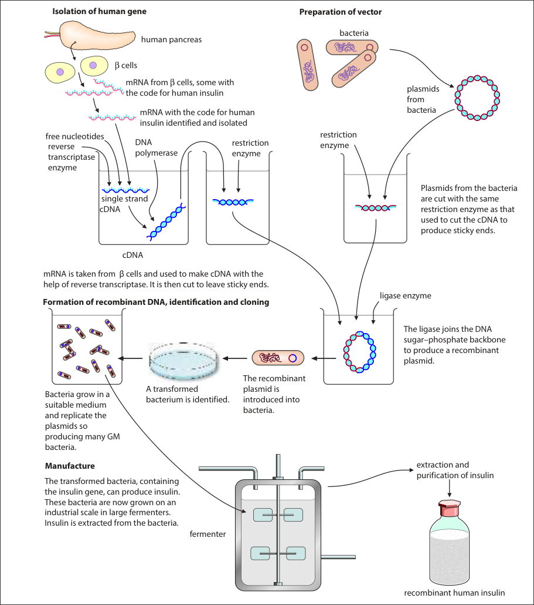

# Genetic Technology

## Genetic Engineering

Genetic Engineering - the deliberate manipulation and modification of an organism's genetic material to modify specific characteristics. It may involve transferring a gene into an organism so that the gene is expressed.

Examples:

- Transgenesis 转基因 - introducing foreign genes (from a different species) into an organism's genome to express new traits.

  > The organism which now expresses the new gene(s) is known as a **transgenic organism** or a **genetically modified organism (GMO)**

- Gene editing

- Gene therapy

### Transgenesis

1. Identify and obtain the gene of interest.

   > There are three ways to identify and obtain the gene of interest
   >
   > 1. Cut from chromosomal DNA using **restriction endonuclease**
   > 2. Made by making a single-stranded complementary DNA (cDNA) from mRNA by **reverse transcriptase** and then converting the cDNA into a double-stranded DNA molecule by **DNA polymerase**
   > 3. Synthesised chemically from nucleotides

2. Make multiple copies of the gene/clone and amplify the gene by using the **polymerase chain reaction (PCR).** (PCR：详见下)

3. Cut the two ends of the DNA with the gene of interest using restriction enzyme/restriction endonuclease限制性内切酶, forming sticky ends粘性末端.

   > **restriction enzymes** recognise specific short DNA sequences and cut at these points, form the **sticky ends**
   >
   > For example, the restriction enzyme *BamHI* consistently cuts DNA at a specific recognition site
   >
   > - **5' to 3' strand:** GGATCC (this restriction enzyme cut at this location)
   > - **3' to 5' strand:** CCTAGG (complementary sequence)
   >
   > It is a **palindrome** (回文), meaning the sequence reads the same in both directions (when reading 5' to 3' on each complementary strand).

4. Cut plasmid, a vector 载体, with the same restriction enzyme, forming complementary sticky ends.

   > The vectors can be: plasmids, viruses, liposomes, naked DNA

5. Insert the gene into cut plasmid using DNA ligase (DNA连接酶), form a **recombinant plasmid**.

   > **DNA ligase** - Catalyse the formation of phosphodiester bonds
   >
   > The sticky ends from the gene of interest and the cut plasmid are complementary, and form hydrogen bonds between them.

6. Insert recombinant plasmids into bacteria.

   > 1. Treat bacteria with a solution of Ca²⁺ ions
   > 2. Apply **heat shock** (~42°C) or use **electroporation** 电穿孔 to increase chances of plasmids passing through cell surface membrane
   > 3. Bacteria that take up recombinant plasmids are said to be transformed.

7. The transformed bacteria are identified (详见下), often by using marker genes which are added to the vector and inserted close to gene of interest.

8. Cultivate培养 and clone transformed bacteria containing recombinant plasmids in a fermenter; the gene of interest is expressed in bacteria to make proteins.

#### Polymerase Chain Reaction

Aim: to **amplify** DNA. It's **rapid** and only needs a small amount of DNA sample.

The materials needed in PCR machine:

- a sample of DNA

- 2 different primers

- free deoxynucleotide triphosphate molecules (dNTPs), for energy supply

- 7\~8 pH buffer solution

- a solution of **thermostable** DNA polymerase (e.g. *Taq polymerase*)

  > Which is able to withstand the high temperatures used in PCR for separating the strands of DNA

There are 3 main stages in PCR machine:

| Stage                | Temp | Procedure                                                    |
| -------------------- | ---- | ------------------------------------------------------------ |
| 1. Denaturation 变性 | 95°C | 1. Break the hydrogen bonds between base pairs 2. Each DNA molecule is denatured and seperated into two strands 3. Expose the bases |
| 2. Annealing 退火    | 60°C | Primers anneal to the 3' end of the 2 DNA template strands Forming hydrogen bonds and complementary base pairing |
| 3. Extension 延伸    | 72°C | *Taq polymerase* uses dNTPs to make new complementary strands |

> This process is **repeated** for 20-30 cycles and **efficient**.

> Why the primers used in PCR do not anneal together?
>
> - The primers do not anneal together as they do not have complementary base sequences.

There are 4 types of dNTPs: <u>dATP</u>, <u>dCTP</u>, <u>dGTP</u> and <u>dTTP</u>

> Explain why it is not possible to use PCR to increase the number of **RNA molecules** in the same way as it is used to increase the number of DNA molecules:
>
> - There is no enzyme that will use an RNA template to make double-stranded RNA.
>   Besides, RNA molecules are normally single-stranded.

#### Identification of modified gene

The vector plasmid often has **marker genes**, allowing identification of transformed cells that have taken up recombinant plasmids.

The marker gene is transcribed together with the interest gene, so the both protein are produced.

Examples of marker genes:

- **Antibiotic-resistant genes** 对antibiotic不起作用的基因

  The transformed bacteria can survive and grow on medium with that antibiotic.

  **However**, the potential risk is transfer the antibiotic resistant gene to pathogenic bacteria

- **Gene for GFP** (green fluorescent protein) 能在UV light照射下发green光的基因

- **Gene for GUS** 能给某些无色物质染色的基因

  a type of enzyme; enzyme β-glucuronidase; can transform some specific colourless chemicals / non-fluorescent substrates into coloured / fluorescent products)

Marker gene and gene of interest can use same promoter. Both genes are transcribed together and both products/proteins are made.

> [!NOTE]
>
> The past paper question of "the use of fluorescent gene":
>
> *How the gene works*
>
> - there is a <u>visible colour change</u>, it <u>emits bright light</u> when <u>exposed to UV light</u> ;;;
>
> *3 easy things to be identified*
>
> - recombinant plasmid $\rightarrow$ transformed bacteria $\rightarrow$ transgenetic organism ;;;
>
> *其他重点*
>
> - There are not known risks
> - gene of interest inserted close to marker gene

#### How plasmids become a popular vector

- Small, circular, double-stranded DNA $\rightarrow$ Easy to extract from bacteria ;;
- Contain **multiple origins of replication** (can replicate independently inside bacteria)
- High copy number (efficient amplification)
- Easy to cut with restriction enzymes and re-insert DNA
- It can be taken by bacteria back
- It can combine with maker genes to identify the transformed bacteria ;;

#### Summary of the complete process

1. Isolate **mRNA** for the gene required. 分离目标基因
2. Use reverse transcriptase to produce single-stranded cDNA. 合成单链cDNA
3. Use DNA polymerase to produce double-stranded cDNA. 合成双链cDNA
4. Use an enzyme to add short length of single-stranded DNA to form sticky ends. 添加sticky ends
5. Use a restriction enzyme to cut plasmids. 切开plasmid
6. Mix the double-stranded DNA with plasmids. 往plasmid中添加新的基因
7. Form recombinant plasmids by complementary base pairing. 
8. Use ligase to seal the sugar–phosphate backbone of the recombinant plasmid. 重新把plasmid连回去
9. Insert the plasmid into a host bacterium. 重新把plasmid放回bacterium中
10. Clone the modified bacteria and harvest the recombinant protein. 批量生产

#### Recombinant human insulin

1. isolation of human gene
2. preparation of vector
3. formation of recombinant DNA
4. manufacture

Advantages of using bacteria and yeasts to produce recombinant human proteins (e.g., insulin)

1. **Identical to human proteins** (as opposed to extracting from pigs/cattle pancreas). 

   生产的是属于人类的蛋白质

2. **(More) rapid response** for patients.

3. **No / fewer side effects** (fewer immune responses / allergic reactions).

4. **Less risk of transmitting disease / infection** (compared to animal-derived proteins).

5. **Good for people who have developed tolerance to animal insulin**.

6. **No ethical / moral / religious issues** (unlike using animal sources). 没有道德顾虑

7. **Cheaper to produce in large volume / unlimited availability** (due to rapid reproduction in limited space and low facility requirements).

8. *Bacteria contain plasmids which facilitate gene transfer*.

> [!NOTE]
>
> **Exam Question Example (Mark Scheme):**
> Explain the advantages of treating diabetic people with human insulin produced by gene technology. [6]
>
> *(any 6 from the following):*
>
> 1. it is identical to human insulin ; **ora**
> 2. (more) rapid response ; **ora**
> 3. no / fewer, immune response / side effects / allergic reactions ; **ora**
> 4. ref. to ethical / moral / religious, issues ; **ora**
> 5. cheaper to produce in large volume / unlimited availability ; **ora** R cheap to produce
> 6. less risk of, transmitting disease / infection ; **ora**
> 7. good for people who have developed tolerance to animal insulin ; **ora** [max 6]

#### Applications of transgenesis

- produce recombinant human proteins - by inserting human genes into bacteria / yeasts
- make **herbicide-resistant crops** - increase crop yield
- make **pest-resistant crops** - improve crop yield and reduce the use of pesticides
- add nutrients to crop to improve human health

Examples of recombinant human proteins to treat disease

- **Insulin** - treat diabetes
- **factor VIII** - treat haemophilia
- **Adenosine deaminase** 腺苷脱氨酶 - treat SCID (severe combined immunodeficiency)

> [!NOTE]
>
> The potential advantages of using GM crops:
>
> - increase yield ;
> - improve food quality ;
> - add nutrients ;
> - more tolerant to climate change - can be grown in poor conditions ;;
> - less pesticide used - cost effective since the GM crops can be pest-resistant ;;;
> - ... which is also benefit to environment
> - herbicide resistance reduces competition from weeds
> - may use the example of **Golden Rice for extra Vitamin A** and **Flavr Savr tomato for better storage**

The disadvantages of using GM crops:

- consumer resistance to GM crops ;
- may be unsafe for humans / allergies / side effects / harm other animals ;
- expensive ;
- farmers may have to buy seeds every season ;
- seed and related herbicides sales monopolised by big companies ;

> **Some environmental disadvantages**
>
> Herbicide-resistant crops:
>
> - Intensive use of herbicide is **harmful to humans**, and herbicide resistant weeds will evolve;
> - Pollen can transfer resistance gene to wild relatives of the crop plants, producing **superweeds**
>
> Pest-resistant crops:
>
> - Insect pests may evolve to become **resistant** to Bt toxin;
> - A damaging effect on other species of insects;
> - The transfer of the added gene to other species of plant

**Benefits of using genetic engineering rather than selective breeding:**

- Organisms with the desired characteristics are produced **more quickly**;
- **Only genes controlling desired traits are manipulated**;
- The gene that confers the desired characteristic may come from a **different species/kingdom**.

### Gene therapy

Treatment of a genetic disorder by introducing **functioning normal genes** into cells of an organism.

Examples of genetic diseases treated with gene therapy

- severe combined immunodeficiency (SCID)

  > **autosomal recessive** condition - **T-lymphocytes are affected**
  >
  > To protect a patient from infections, during gene therapy, a **virus transfers a normal dominant allele for ADA into T-lymphocytes**. 
  >
  > This is **not a permanent cure** as the T-lymphocytes are **replaced naturally overtime**.

- **inherited eye disease LCA**

  > blindness; Leber congenital amaurosis
  >
  > usually an **autosomal recessive condition**

Use **viruses or liposomes**, or **naked DNA** as the vectors to transmit the normal DNA

How the genetic disease may be treated using **gene therapy**:

1. <u>normal allele</u> is <u>inserted into vector</u> ;;
2. the vector liposomes in <u>aerosol</u> <u>fuses with host cell</u> ;;
3. OR use <u>virus</u> (<u>harmless</u> virus) as the vector ;;l
4. This is only a <u>short term effect</u>, the treatment has to be <u>repeated</u> ;;

Considering different vectors:

- **Naked DNA**

  - has to be injected into target cell / lack of organ-specific delivery ;

  - low efficiency of cellular uptake ;

- **Viruses**

  - rapidly broken down ;

  - small packaging capacity / only small amount of DNA can be carried ;

  - low probability of integration (into host genome) ;

  - cause mutations in host DNA / (gene) insertion disrupts gene function / insertional mutagenesis ; and may cause cancer and other side effects ; e.g. infection; can insert normal healthy allele randomly into host DNA and in wrong place

- **Liposomes**
  - low ability to, add DNA / genes, into target cells (genome) / low transduction efficiency ;

The social considerations of using a retrovirus for gene therapy:

- the retrovirus may disrupt other gene
- the retrovirus must not cause...
  - cancer
  - infection
  - allergic response

### Gene editing

A form of **genetic engineering** involving the **insertion**, **deletion** or **replacement** of DNA at specific sites in the genome of an organism using a method such as the **CRISPR/Cas9 system**

> CRISPR/Cas9 system developed from a mechanism used by some bacteria to defend themselves against viral infections
>
> - CRISPR is a group of base sequences that code for short lengths of guide RNA that direct an endonuclease enzyme known as Cas9 towards specific base sequences.
> - CRISPR-Cas9 system can be used to repair a gene that has a harmful mutation.

Involve **modification of the existing DNA** of an organism rather than the insertion of DNA from another organism.

Why sometimes gene editing is more suitable as a potential cure for some disease:

- the disease may be caused by a <u>dominant ellele</u>
- adding a normal recessive allele would not work
- gene editing can alter the mutant allele / DNA

## Genetic Technologies 
