> 笔记源代码 \[Gitee\]: [as-biology-selfnotes](https://gitee.com/tomthethuan/as-biology-selfnotes)
>
> [未校验的最终版本 · TomTheThuan/as-biology-selfnotes - Gitee.com](https://gitee.com/tomthethuan/as-biology-selfnotes/releases/tag/final)

> [!IMPORTANT]
>
> 线上博客版本中会有一些图片无法加载的问题，Markdown格式没完全适配的问题，如果有离线访问需求和完整图片加载的话，可以使用下面的PDF版本：
>
> - [ AS Biology Vocabulary.pdf](https://gitee.com/tomthethuan/as-biology-selfnotes/releases/download/final/AS%20Biology%20Vocabulary.pdf)
> - [ Protein Structure Levels Summary.pdf](https://gitee.com/tomthethuan/as-biology-selfnotes/releases/download/final/Protein%20Structure%20Levels%20Summary.pdf)
> - [ as-bio-selfnotes_20260305.pdf](https://gitee.com/tomthethuan/as-biology-selfnotes/releases/download/final/as-bio-selfnotes_20260305.pdf)

这个笔记是我我本人（Tom）根据老师分享的课件和书本内容总结而成，主要在课件的基础上加上我自己的一些理解得来。如果有遇到有解释不清楚、知识点错误或遗漏等其他关于这篇笔记一系列其他问题的话，请随时联系我，这对我帮助很大。

本仓库为生物学学习笔记，包含细胞生物学相关知识点总结、图示以及结构说明，适合用于复习或快速查阅生物学基础知识。

如果要查看每个版本更新的内容的话可以在这个地方看到：[commits](https://gitee.com/tomthethuan/as-biology-selfnotes/commits/master)

如果要找我之前发的PDF版本：[releases](https://gitee.com/tomthethuan/as-biology-selfnotes/releases)

### Mark Scheme abbreviation

| Symbol           | Description                            | 简单解释                       |
| ---------------- | -------------------------------------- | ------------------------------ |
| ;                | seperates markding points              | 得分点                         |
| /                | alternative answers for the same point | 同样得分点但不同的回答方式     |
| R                | reject                                 | 无法得分的                     |
| A                | accept                                 | 也可以算分的                   |
| AW               | alternative wording                    | 用不同的单词（同样的意思）解释 |
| <u>underline</u> | must be used by the candidate          | 一定要用的单词                 |
| max              | maximum number of marks can be given   | 最高得分                       |
| ora              | or reverse argument                    | 同样的关系反着说               |
| mp               | marking point                          | 得分点                         |
| AVP              | alternative valid point                | 额外提到也可以得分的           |
| I                | ignore                                 | 会被忽略无法得分的             |

### AS Contents

#### Chapter 1 Cell structure 细胞结构

- [x] 1.1 Cells are the basic units of life 细胞是生命的基本单位
- [x] 1.2 Cell biology and microscopy 细胞生物学与显微镜技术
- [x] 1.3 Plant and animal cells as seen with a light microscope 光学显微镜下的动植物细胞
- [x] 1.4 Measuring size and calculating magnification 尺寸测量与放大倍数计算
- [x] 1.5 Electron microscopy 电子显微镜
- [x] 1.6 Plant and animal cells as seen with an electron microscope 电子显微镜下的动植物细胞
- [x] 1.7 Bacteria 细菌
- [x] 1.8 Comparing prokaryotic cells with eukaryotic cells 原核细胞与真核细胞的比较
- [x] 1.9 Viruses 病毒

#### Chapter 2 Biological molecules 生物分子

- [x] 2.1 Biochemistry 生物化学
- [x] 2.2 The building blocks of life 生命的构建模块
- [x] 2.3 Monomers, polymers and macromolecules 单体、聚合物和大分子
- [x] 2.4 Carbohydrates 碳水化合物
- [x] 2.5 Lipids 脂质
- [x] 2.6 Proteins 蛋白质
- [x] 2.7 Water 水

#### Chapter 3 Enzymes 酶

- [x] 3.1 What is an enzyme? 什么是酶？
- [x] 3.2 Mode of action of enzymes 酶的作用模式
- [x] 3.3 Investigating the progress of an enzyme-catalysed reaction 研究酶催化反应进程
- [x] 3.4 Factors that affect enzyme action 影响酶作用的因素
- [x] 3.5 Comparing enzyme affinities 比较酶亲和力
- [x] 3.6 Enzyme inhibitors 酶抑制剂
- [x] 3.7 Immobilising enzymes 固定化酶

#### Chapter 4 Cell membranes and transport 细胞膜与运输

- [x] 4.1 The importance of membranes 膜的重要性
- [x] 4.2 Structure of membranes 膜的结构
- [x] 4.3 Roles of the molecules found in membranes 膜中分子的作用
- [x] 4.4 Cell signalling 细胞信号传导
- [x] 4.5 Movement of substances across membranes 物质跨膜运输

#### Chapter 5 The mitotic cell cycle 有丝分裂细胞周期

- [x] 5.1 Growth and reproduction 生长与繁殖
- [x] 5.2 Chromosomes 染色体
- [x] 5.3 The cell cycle 细胞周期
- [x] 5.4 Mitosis 有丝分裂
- [x] 5.5 The role of telomeres 端粒的作用
- [x] 5.6 The role of stem cells 干细胞的作用
- [x] 5.7 Cancers 癌症

#### Chapter 6 Nucleic acids and protein synthesis 核酸与蛋白质合成

- [x] 6.1 The molecule of life 生命分子
- [x] 6.2 The structure of DNA and RNA DNA和RNA的结构
- [x] 6.3 DNA replication DNA复制
- [x] 6.4 The genetic code 遗传密码
- [x] 6.5 Protein synthesis 蛋白质合成
- [x] 6.6 Gene mutations 基因突变

#### Chapter 7 Transport in plants 植物运输

- [x] 7.1 The transport needs of plants 植物的运输需求
- [x] 7.2 Vascular system: xylem and phloem 维管系统：木质部与韧皮部
- [x] 7.3 Structure of stems, roots and leaves and the distribution of xylem and phloem 茎、根、叶的结构及维管分布
- [x] 7.4 The transport of water 水分运输
- [x] 7.5 Transport of assimilates 同化物的运输

#### Chapter 8 Transport in mammals 哺乳动物运输

- [x] 8.1 Transport systems in animals 动物的运输系统
- [x] 8.2 The mammalian circulatory system 哺乳动物循环系统
- [x] 8.3 Blood vessels 血管
- [x] 8.4 Tissue fluid 组织液
- [x] 8.5 Blood 血液
- [x] 8.6 The heart 心脏

#### Chapter 9 Gas exchange 气体交换

- [x] 9.1 Gas exchange 气体交换
- [x] 9.2 Lungs 肺
- [x] 9.3 Trachea, bronchi and bronchioles 气管、支气管和细支气管
- [x] 9.4 Warming and cleaning the air 空气的加温与清洁
- [x] 9.5 Alveoli 肺泡

#### Chapter 10 Infectious disease 传染病

- [x] 10.1 Infectious diseases 传染病
- [x] 10.2 Antibiotics 抗生素

#### Chapter 11 Immunity 免疫

- [x] 11.1 Defence against disease 疾病防御
- [x] 11.2 Cells of the immune system 免疫系统细胞
- [x] 11.3 Active and passive immunity 主动免疫与被动免疫

#### P1 Practical skills for AS Level AS级别实践技能

- [ ] P1.1 Practical skills 实践技能
- [ ] P1.2 Experiments 实验
- [ ] P1.3 Variables and making measurements 变量与测量
- [ ] P1.4 Recording quantitative results 记录定量结果
- [ ] P1.5 Displaying data 数据展示
- [ ] P1.6 Making conclusions 得出结论
- [ ] P1.7 Describing data 描述数据
- [ ] P1.8 Making calculations from data 数据计算
- [ ] P1.9 Identifying sources of error and suggesting improvements 识别误差来源并提出改进
- [ ] P1.10 Drawings 绘图

### 使用说明

- 克隆本仓库或直接[下载ZIP](https://gitee.com/tomthethuan/as-biology-selfnotes/repository/archive/master.zip)
- 可直接打开 `.md` 文件进行阅读（推荐使用 Markdown 编辑器如 Typora）。
- 图片资源文件夹中的图像用于对应章节的图文说明，无需单独操作。

### 许可协议

本项目遵循开源精神，如无特别说明，所有内容均可自由使用与传播。如发现内容引用涉及版权问题，请联系仓库维护者处理。

如需贡献内容或提出建议，请提交 Issue 或 Pull Request。

## Chapter 1 - Cell Organelles

### 显微镜

#### 制作临时的样本

- Cut thin sections of the material to be examined 切片
- Stain 染色
- Mount the specimen on a clean glass slide 放到载玻片上
- Lower the coverslip over the specimen (to prevent the specimen drying out) 覆盖

光学显微镜和电子显微镜的对比

| Feature             | Light Microscope           | Electron Microscope |
| ------------------- | -------------------------- | ------------------- |
| Source of radiation | Light                      | Electron            |
| Wavelength          | 400-700nm                  | ≈ 0.005nm           |
| Max. Resolution     | 200nm                      | 0.5nm (in practice) |
| Lenses              | Glass                      | Electromagnets      |
| Specimen            | Living, non-living or dead | non-living or dead  |
| Stains              | Coloured Dyes              | Heavy Metals        |
| Image               | Coloured                   | Monocolour          |
| Magnification       | x1500                      | x10 million         |
| Graph               | Photomicrograph            | Electron micrograph |

There are two types of electron microscope 有两种电子显微镜:

- Transmission Electron Microscope 穿透电子显微镜: 2D image, can see interior details 可以呈现出2D的图像，并且可以看到细胞内的结构。

  > 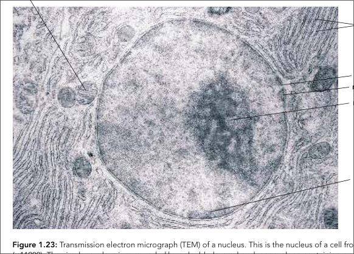

- Scanning Electron Microscope 扫描电子显微镜: 3D image, can only see surface structures 可以看到细胞表面的3D结构。

  > 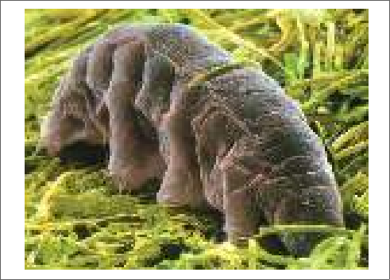

#### Magnification and Resolution

**Magnification 放大倍数**: the number of times **larger** an image is compared to the object's size. 图像比实物大多少倍。

**Resolution 分辨率**: The ability to **distinguish** between two separate points. 能分辨出两个很近的物体的能力。

The maximum resolution can be calculated from the wave length of radiation used to view the specimen.

最大的分辨率（分辨率的极限）能通过观察光的波长计算出来，例如使用波长为500nm的光观察一个物体，那么这个物体的最大分辨率为250nm。

$$
Resolution = wavelength / 2
$$

### Animal and Plant cell


只能在电子显微镜下看到的结构（动物细胞）：

- Microvilli
- Golgi vesicle
- microtubules
- ribosome
- lysosome
- smooth ER
- rough ER
- nuclear pore
- nuclear envelope
- centrosome (only found in animal cells)

只能在电子显微镜下看到的结构（植物细胞）：

- Golgi vesicle
- lysosome
- chloroplast envelope
- microtubule
- rough ER
- nuclear envelope
- nuclear pore
- ribosome
- smooth ER

### 细胞器的功能

```markdown
1. cell surface membrane
2. nucleus, nuclear envelope and nucleolus
3. rough endoplasmic reticulum
4. smooth endoplasmic reticulum
5. Golgi body (Golgi apparatus or Golgi complex)
6. mitochondria (including the presence of small circular DNA)
7. ribosomes (80S in the cytoplasm and 70S in chloroplasts
8. and mitochondria)
9. lysosomes
10. centrioles and microtubules
11. cilia
12. microvilli
13. chloroplasts (including the presence of small circular DNA)
14. cell wall
15. plasmodesmata
16. large permanent vacuole and tonoplast of plant cells
```

#### 本章重点内容

**Mitochondria and chloroplasts**

- Surrounded by **double** membrane 双膜结构
- Have small, **circular DNA** 有环状DNA
- Can synthesise proteins 可以合成蛋白质
- Have **70S** ribosomes

Centrioles**只**在动物细胞中有。

#### Cell Surface Membrane / plasma Membrane 细胞膜

- Partially permeable / semi-permeable 半透的

- Control the exchange of materials between the cell and its environment

  控制进出细胞的物质

#### Cell Wall 细胞壁

- Fully permeable 全透的 - All the substances can pass through it 全部物质都可以通过

- Protect and prevent the cell from bursting when water enters by osmosis

  防止细胞内水分太多时破裂

- Resist turgor pressure 抵抗膨压

- Cell wall is relatively rigid and gives the cell a definite shape

  细胞壁相对而言比较坚固，可以给细胞提供一个稳定的形状

- Cell wall of plant cells is made of cellulose

  植物的细胞壁由纤维素*(C₆H₁₀O₅)n*构成

#### Plasmodesma (plural: plasmodesmata) 胞间连丝

- A pore-like structure 孔状的结构

- Plant cells are linked to neighbouring cells by plasmodesmata

  相邻的植物细胞通过胞间连丝相连

- Contain fine strands of cytoplasm, allowing the controlled passage of materials from one cell to the other

  含有细小的细胞质链，可以控制物质在细胞间的传输

#### Cytoplasm 细胞质

The contents of a cell inside the cell surface membrane, excluding the nucleus. Cytoplasm contains organelles, e.g. ribosomes or mitochondrion

细胞质指的是细胞内除了细胞核之外的所有物质以及细胞器，像是mitochondrion和robosome之类的细胞器就被包括在细胞质里。

$$
Cytoplasm + Nucleus = Protoplasm
$$

**Cytosol** is the solution of the cytoplasm, in which the organelles are suspended.

**细胞溶质**是细胞质中的溶液，其中的细胞器都属于悬浮的状态。

> 如果把一个细胞想象成一杯珍珠奶茶，那么...
>
> - 奶茶杯 = Cell Surface Membrane
> - 奶茶以及加料 = Cytoplasm
> - 奶茶本身 = Cytosol
> - 加料 = Organelles

#### Nucleus (plural: nuclei) 细胞核

- Contain the genetic material (DNA, chromatin and chromosome)

  包含遗传物质：DNA、染色质和染色体

- DNA contains the instructions / genes that control the activities of the cell, e.g. control **protein synthesis**

  DNA含有细胞活动的指令（或基因），可以控制包括**蛋白质合成**等一系列活动

- Contains nucleolus (plural: nucleoli), one or more may be present in one nucleus

  包含一个或多个核仁

- Nucleolus is the place of making ribosome 核仁负责生产核糖体

$$
DNA + Proteins = Chromatin / Chromosome
$$

When a cell is not dividing/not during nuclear division, the material containing DNA is called chromatin. Chromatin is loosely coiled and thread-like. It’s long, thin and in a loose form.

when a cell is dividing/during nuclear division, the material containing DNA is called chromosomes. Chromosomes are condensed from chromatin. They are short and thick and in a condensed form.

| Feature              | Chromatin                                                                | Chromosome                                                   |
| :------------------- | :----------------------------------------------------------------------- | :----------------------------------------------------------- |
| **Presence**         | When the cell is **not dividing** / Interphase                           | When the cell **is dividing** / Mitotic phase                |
| **Morphology**       | Long, thin, loose, thread-like                                           | Short, thick, condensed, rod-shaped (or X, V-shaped)         |
| **Structural State** | **Extended**, uncondensed **long chains**                                | The final, **highly coiled and condensed** form              |
| **Composition**      | DNA + Histones (basic unit is the nucleosome)                            | Formed by the supercoiling and condensation of **chromatin** |
| **Primary Function** | Allows for DNA replication and transcription (directs protein synthesis) | Ensures DNA is **accurately distributed** to daughter cells  |
| **Visibility**       | Usually **not visible** under a light microscope                         | **Clearly visible** under a light microscope                 |

| 特征         | Chromatin (染色质)                    | Chromosome (染色体)              |
| :----------- | :------------------------------------ | :------------------------------- |
| **存在时期** | 细胞**不分裂**时 / 间期               | 细胞**分裂**时 / 分裂期          |
| **形态**     | 细长、松散、丝状                      | 短粗、致密、棒状（或X、V等形状） |
| **结构状态** | **伸展**、未凝缩的**长链**            | **高度螺旋化、凝缩**后的最终形态 |
| **组成**     | DNA + 组蛋白（基本单位是核小体）      | 由**染色质**螺旋盘绕凝缩而成     |
| **主要功能** | 进行DNA的复制和转录（指导蛋白质合成） | 确保DNA被**精确分配**到子细胞中  |
| **可视性**   | 在光学显微镜下通常**不可见**          | 在光学显微镜下**清晰可见**       |

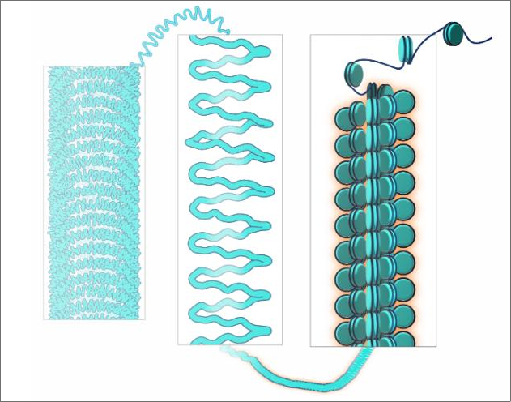

> 通常来说一个细胞只会有一个细胞核，但是每个细胞的情况不一样，例如：
>
> - 血红细胞为了运输氧气没有细胞核
> - 肝脏里的细胞有多个细胞核
> - Skeletal muscle cells有多个细胞核
> - 部分真核细胞有多个细胞核

The nucleus is surrounded by two membranes called the **nuclear envelope**, the nuclear envelope has many small pores called **nuclear pores**.

细胞核被一种叫做**核被膜**的“双膜”结构所包围，核被膜上的小孔成为**核孔**。

#### Mitochondrion (plural: mitochondria) 线粒体

- surrounded by two membranes (a **mitochondrial envelope**).

  被**线粒体包膜**（一种双膜结构）包围

- The inner membrane is folded to form **cristae** (singular: **crista**) to increase surface area

  内层的膜会折叠成**cristae**（一种凸起的结构），用于增加表面积

- the interior of the mitochondrion is called the **matrix**

  线粒体中的内部区域被称为**matrix**，是主要进行有氧呼吸的场所

- The space between the two membranes is called the **intermembrane space**

  两层膜之间的空间被称为**膜间空间**

Cells with a high demand for energy, such as liver and muscle cells, contain large numbers of mitochondria.

在需要大量能量的细胞（例如肝脏细胞和肌肉细胞）中含有大量的线粒体。

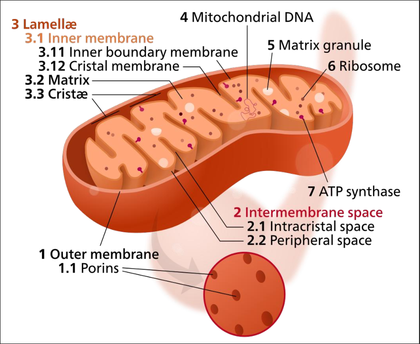

Mitochondria carry out aerobic respiration to **release** energy/**produce** ATP.

线粒体会通过有氧呼吸**释放**能量/**产生**ATP。

> 注意：能量不可以被产生，只能转化。Energy can only be released, not produced
>
> ATP是能量的载体，能量在ATP中被储存为化学势能（Chemical Potential Energy）

$$
\ce{C6H12O6 + 6O2 -> 6CO2 + 6H2O + energy}
$$

ATP produced in mitochondria is used for energy consuming activities in cells, such as muscle contraction, protein synthesis, exocytosis and active transport.

在线粒体中产生的ATP会在肌肉收缩、蛋白质合成、胞吐或主动运输等需要能量的细胞活动中消耗掉。

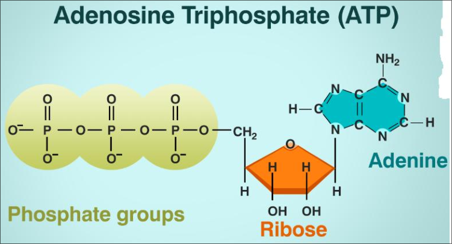

ATP分子遇到水分子时会发生水解反应（Hydrolysis）：To break bonds between phosphate groups and release energy. 当分子间的化学键断裂时会释放能量。

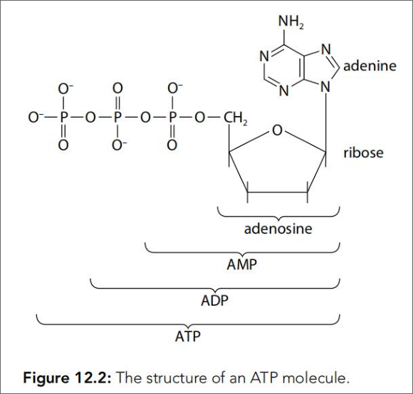

在图片中线粒体有不同的形状，有的是圆形的，有的是胶囊形的，这是因为两个原因：

1. Mitochondria can change shape. 线粒体可以改变形状
2. They are cut at different angles. Some are cut through transverse section and some through longitudinal section. 展示的角度不一样，有的展示的是横切面，有的则是纵切面。

Many mitochondria are sausage-like. But they can change shape and divide.

大多数线粒体都是胶囊形（或者说“香肠形”的），但是它们仍然可以变换形状

#### Chloroplast 叶绿体

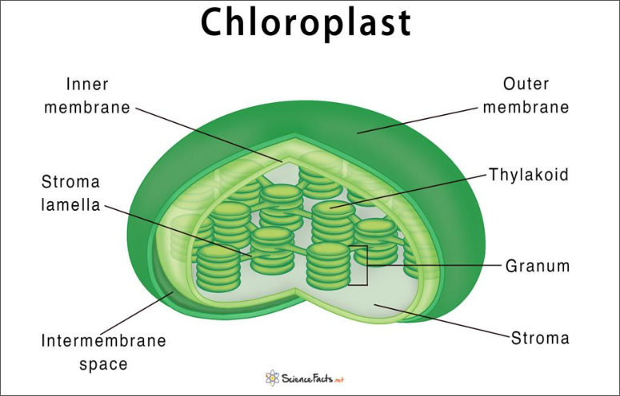

> Inside the chloroplast 叶绿体的内部
>
> - Chloroplast envelope 叶绿体包膜
> - 70S ribosome 核糖体
> - Circular DNA in stroma 基质中的环状DNA
> - grana made of thylakoid membranes 由类囊体膜构成的颗粒
> - Starch grains 淀粉粒
>
> Thylakoids 类囊体 - fuild-filled sacs

Chloroplasts carry out photosynthesis to produce glucose / carbohydrate. 叶绿素会通过光合作用生产葡萄糖 / 碳水化合物。

$$
\ce{6CO2 + 6H2O ->[Sunlight][Chlorophyll] C6H12O6 + 6O2}
$$

Not all plant cells have chloroplast. For example, plant cells in the root have no chloroplast.

并不是所有的植物细胞都有叶绿体，比如不需要光合作用的根毛细胞就没有。

ATP produced in chloroplast is used in photosynthesis.

ATP也会在叶绿体中产生，但是这里产生的ATP会被主要用于光合作用。

#### Vacuole 液泡

> Animal cells may possess small, temporary vacuoles, or called **vesicle**
>
> 动物细胞中也有类似于液泡的结构，被称为**囊泡**。只不过囊泡不是永久存在的，而且相对于液泡来说非常小

- Surrounded by tonoplas 被液泡膜所覆盖

Functions:

- Support 里面的液体会撑起整个细胞
- Lysosomal activity - Plant vacuoles may contain hydrolases and act as
  lysosomes. 提供和lysosome类似的功能
- Secondary metabolites 有一些生长相关，但比较次要的物质可以储存在液泡中
- Food reserves 溶解了的果糖和矿物离子会储存在液泡中
- Waste products 暂时储存一些没有用的东西
- Growth in size 水通过渗透作用进入细胞会增大细胞的体积

The solution in the vacuole is called **cell sap**, it contains:

- pigments
- enzymes
- sugars (glucose)
- minieral ions
- oxygen
- carbon dioxide
- ...

液泡中的溶液被称为细胞液，它包含了：

- 色素
- 酶
- 糖（葡萄糖）
- 矿物离子
- 氧气
- 二氧化碳
- ……

Vacuoles help to regulate the osmotic properties fo cells (the flow of water inwards and outwards by osmosis) and support the stems of the plants.

液泡中的液体会平衡细胞的“渗透”作用，并且里面的液体会撑起细胞，乃至于让植物的茎呈现挺立的状态。

The pigments colour the petals of certain flowers and the parts of some vegetables.

液泡中的色素会赋予某些花瓣和植物丰富的颜色。

#### Endoplasmic Reticulum 内质网

The endoplasmic reticulum consists of flattened sacs of membrane called **cisternae**.

内质网由称为**囊泡**的扁平膜囊组成。

> Use the full name when answer is endoplasmic reticulum and do not say 'ER'
>
> 在考试的时候尽量不要使用ER这个简写，而是使用全称Endoplasmic reticulum

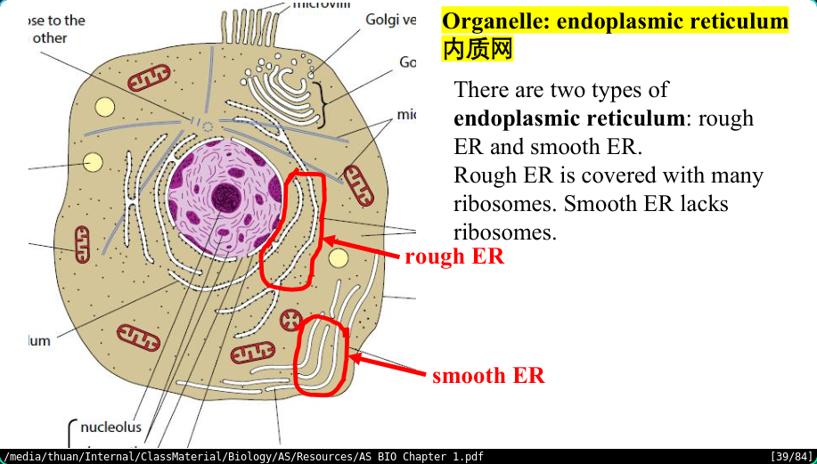

There are two types of endoplasmic reticulum:

- Rough ER - covered with many ribosomes
- Smooth ER - lacks ribosomes

内质网分为两种：

- 粗面内质网 - 覆盖着许多核糖体
- 光滑内质网 - 缺乏核糖体

The membrane of rough endoplasmic reticulum is continuous with the outer membrane of the nuclear envelope, and covered by ribosomes. It's responsible for making protein, transport protein or modify proteins (deal with proteins).

粗面内质网和细胞核的外层相连，并且上面有许多核糖体（核糖体的存在使这种内质网表面变得粗糙，这也是它名字的由来）。它负责生产蛋白质、运输蛋白质或者操作蛋白质（总之就是负责和蛋白质相关的一些事物）。

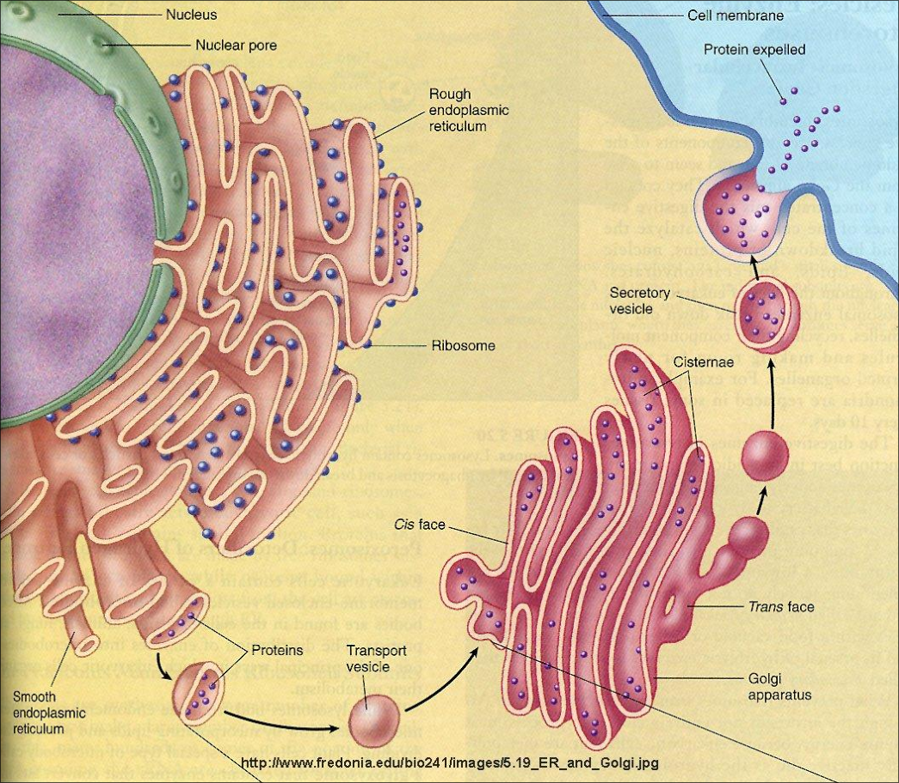

Smooth ER lacks ribosomes, the membrane of smooth ER is not continuous with the outer membrane of the nuclear envelope. <u>It makes lipids and steroids</u>, and it's also the major storage site for calcium ions.

光滑内质网几乎没有核糖体，并且它的膜并不与细胞核相连。它负责<u>生产脂质和类固醇</u>，它还是储存钙离子的主要地方。

| Feature                                | Smooth Endoplasmic Reticulum                                                                                                                                                                 | Rough Endoplasmic Reticulum                                                                                                           |
| -------------------------------------- | -------------------------------------------------------------------------------------------------------------------------------------------------------------------------------------------- | ------------------------------------------------------------------------------------------------------------------------------------- |
| **Membrane Surface Feature**           | **No** ribosomes attached, surface appears **smooth**                                                                                                                                        | **Has** ribosomes attached, surface appears **rough**                                                                                 |
| **Relationship with Nuclear Envelope** | **Not** continuous with the outer nuclear membrane                                                                                                                                           | **Continuous** with the outer nuclear membrane                                                                                        |
| **Primary Function**                   | **Synthesizes lipids and steroids** (e.g., phospholipids, hormones) **Major storage site for calcium ions** (especially important in muscle cells) **Detoxification** (e.g., in liver cells) | **Synthesis, folding, and initial modification of proteins** **Transport of proteins** (particularly secretory and membrane proteins) |
| **Main Products**                      | Lipids, steroids (steroid hormones), glycogen (in liver cells)                                                                                                                               | Proteins                                                                                                                              |
| **Distribution in Cell**               | Usually located closer to the cell membrane                                                                                                                                                  | Located adjacent to the nucleus                                                                                                       |

| 特征             | Smooth Endoplasmic Reticulum                                                                         | Rough Endoplasmic Reticulum                                                  |
| ---------------- | ---------------------------------------------------------------------------------------------------- | ---------------------------------------------------------------------------- |
| **膜表面特征**   | **无**核糖体附着，表面**光滑**                                                                       | **有**核糖体附着，表面**粗糙**                                               |
| **与核膜关系**   | **不**与核外膜相连                                                                                   | **与核外膜相连且是连续的**                                                   |
| **主要功能**     | **合成脂质与固醇**（如磷脂、激素） **钙离子储存库**（在肌肉细胞中尤为重要） **解毒作用**（如肝细胞） | **蛋白质的合成、折叠与初步修饰\*\***运输蛋白质\*\*（尤其是分泌蛋白和膜蛋白） |
| **主要产物**     | 脂质、固醇（固醇类激素）、糖原（在肝细胞）                                                           | 蛋白质                                                                       |
| **在细胞中分布** | 通常更靠近细胞膜                                                                                     | 紧邻细胞核周围                                                               |

#### Golgi body / apparatus 高尔基体

- [x] Can be seen under a light microscope 可以在光学显微镜下观察到

Golgi body is made of **cisternae**, and constantly being formed at one end from vesicles which bud off from the **rough ER**, and are broken down again at the other end to form **Golgi vesicles**

高尔基体由**囊泡**构成，会在**粗面内质网**的一端生成，并且在另一端被分解成**高尔基小泡**

> 在Goblet cell中含有**大量的**Golgi bodies，Goblet cell需要产生大量的分泌物

Functions:

- **modify proteins** from the rough ER (sugars are added to proteins to make glycoproteins)

  进一步操作来自rough ER的蛋白质

- Make glycolipid

- package and transprot proteins in Golgi vesicles to other parts of the cell or for secretion/exocytosis

  把蛋白质运输到细胞的其他地方

- some Golgi vesicles are used to make lysosome (remain in Golgi body)

  部分高尔基小泡会被用于制作溶酶体

Golgi vesicles can...

- carry the protein to the cell membrane for exocytosis 运输功能
- remain in the cell as lysosome 作为溶酶体留在细胞中

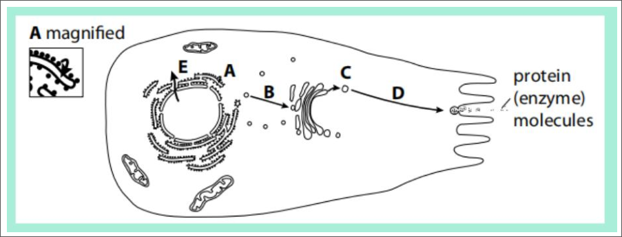

mRNA在细胞核中产生，然后移动到Rough ER表面的核糖体上，并产生蛋白质。vesicle from rough ER会携带蛋白质到Golgi body。Proteins are modify in Golgi body and Golgi vesicle carries the modified proteins to the cell surface membrane for exocytosis.

- A: protein made on the ribosome is moving into the rough ER

  蛋白质在核糖体中产生，并移动到粗面内质网中

- B: rough ER buds of small vesicles, vesicles fuse to form the Golgi apparatus, therefore protein moves into Golgi apparatus. Protein may be modified / processed inside Golgi apparatus

  蛋白质通过运输小泡（Transport Vesicle）从粗面内质网移动到高尔基体，并在高尔基体中进一步加工

- C: Golgi apparatus buds off Golgi vesicles

  高尔基体分离出高尔基小泡

- D: Golgi vesicles travel to cell surface membrane, Golgi vesicle fuses with enzyme leaves cell or responsible for exocytosis

  蛋白质通过高尔基小泡移动到细胞膜上

- E: ribosome or mRNA leaves the nucleus

  核糖体或者mRNA来自细胞核

#### Ribosome 核糖体

- Made of rRNA and proteins
- Have a large subunit and a small subunit

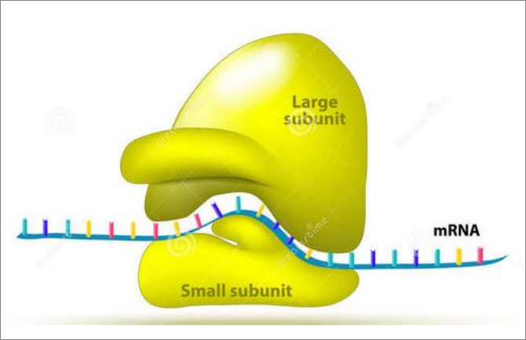

- Function: make proteins
- 25nm in diameter

> 70S ribosome has a smaller size, it can be found in **mitochondria**, **chlroplasts** and **typical prokaryotic cells**.
>
> 80S ribosome has a larger size, it can be found in **cytoplasm** and **rough ER**.

- [x] Ribosomes are found in all types of cells

#### Lysosome 溶酶体

- Simple sacs surrounded by **a single membrane**

- Contains digestive / hydrolytic enzymes, these enzymens must be kept seperate from the rest fo the cell to prevent damage.

  溶酶体中包含消化酶/水解酶，这些酶必须和细胞的其他部分隔绝，不然细胞的其他部分有可能被溶酶体中的消化酶分解

  > Digestive Enzymes:
  >
  > - Amylase
  > - Maltase
  > - Lactase
  > - Lipase
  > - Sucrase
  > - Proteases
  >
  > hydrolases: hydrolytic enzymes,which carry out hydrolysis reactions
  >
  > 水解酶：进行水解反应的酶

- Functions: **breakdown / digest** unwanted substances and structures such as old organelles or even whole cells.

  分解不需要的物质，例如老旧的细胞器或者说一整个不用了的细胞

- The contents of lysosomes are acidic, pH 4 - 5 compared with 6.5 - 7.0 in the surrounding cytoplasm 溶酶体是酸性的，但属于是弱酸（pH在4到5之间）

#### Centrosome 中心体

There are two centrioles (not one as it appears under the light microscope) and they are at right angles to each other to form a centrosome.

中心体由两个中心粒构成，两个中心粒互相成直角排列。

It can only be found in animal cells but not plant cells 中心体只存在于动物细胞中，植物细胞里没有

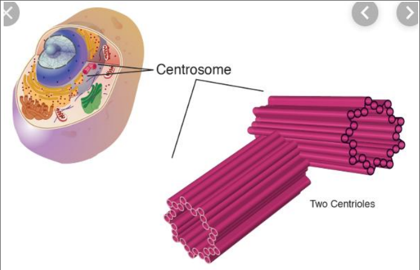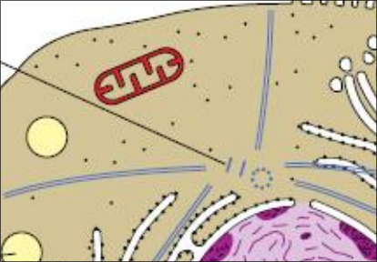

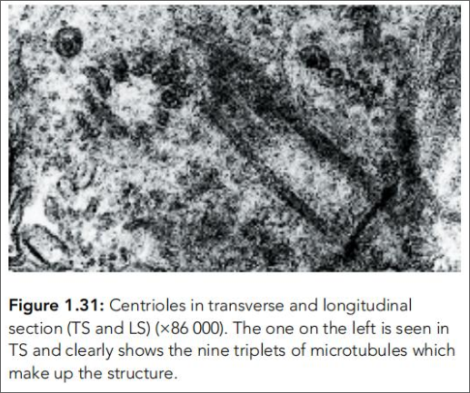

Centrosome acts as microtubule organising centres (MTOCs) that make the microtubule spindle during nuclear division.

中心体作为微管组织中心（MTOCs），在细胞核分裂过程中形成微管纺锤体。(会在细胞分裂的过程中把分裂出去的部分推开)

#### Microtubules 微管

Microtubules are made of a protein called **tubulin**. Tubulin has two forms, α-tubulin (alpha-tubulin) and β-tubulin (beta-tubulin). 微管由一种叫做**微管蛋白**的蛋白质构成，微管蛋白有两种形态，α和β。

1. α- and β-tubulin molecules combine to form **dimers** (double molecules) α-和β-微管蛋白分子结合形成“二聚体”（一种双分子结构）
2. These dimers are then joined end to end to form long ‘**protofilaments**’. 这些“二聚体”随后端对端连接形成长的“原丝”。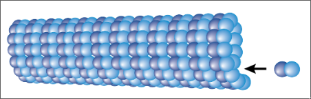

   > This is an example of polymerisation, the process by which giant molecules are made by joining together many identical subunits.
   >
   > 这是一个“聚合反应”的例子，聚合反应就是许多个相同的小分子“汇聚到”一起然后形成一个大分子。

3. Thirteen protofilaments line up alongside each other in a ring to form a cylinder with a hollow centre. 十三个原纤维平行排列成环，形成一个中间空心的圆柱。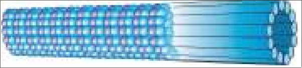
4. This cylinder is the microtubule. 这个圆柱体就是微管

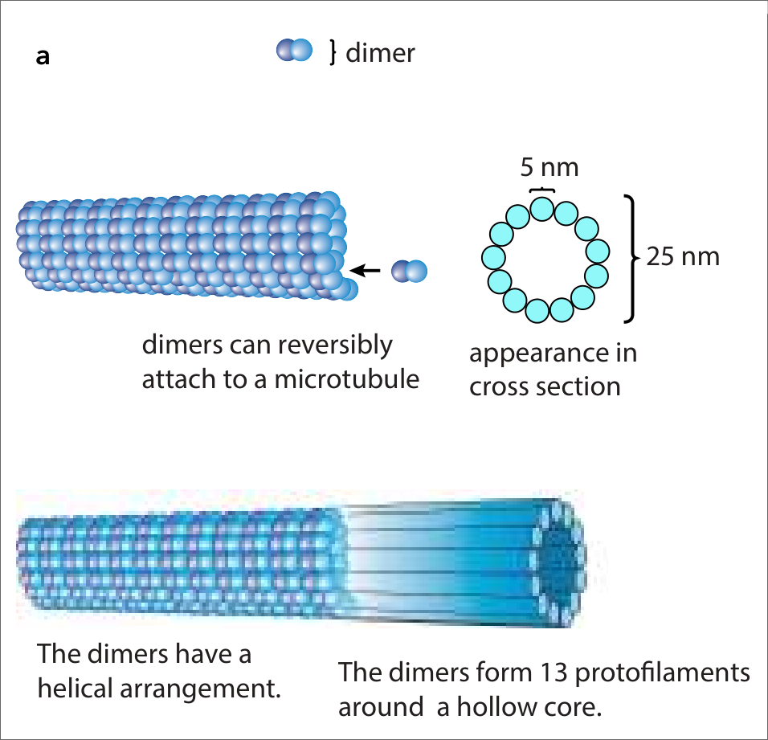

Microtubules make up the cytoskeleton, which helps to determine cell shape. 微管构成细胞骨架，帮助决定细胞形状。

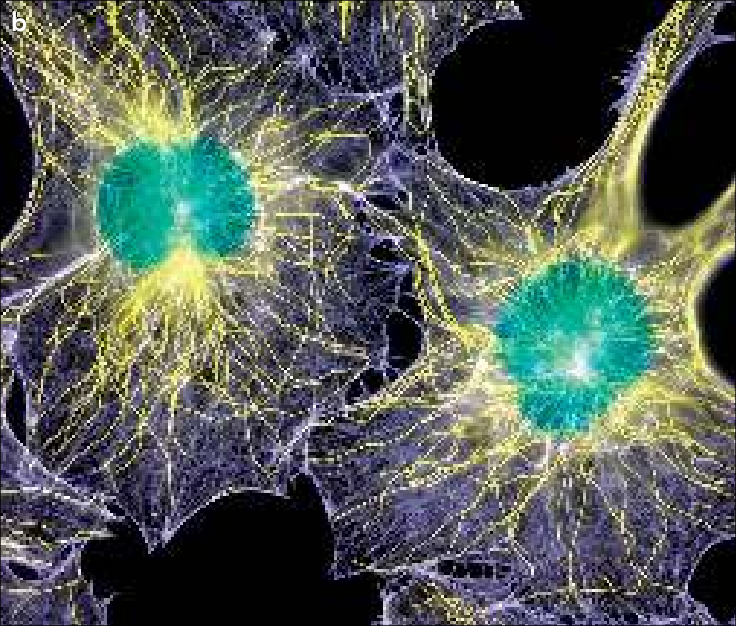

> This diagram shows the arrangement of microtubules in two cells. The microtubules are coloured yellow.
>
> 微管相当于细胞的血管外加骨架，它对于细胞同时起到了物理上支撑的作用和功能上运输的作用。上图中的微管被标记成了黄色。

Functions of the microtubules 微管的功能：

- Support the cell structure 支撑细胞结构

- Transport secretory vesicles and other organelles and cell components 运输囊泡和其他细胞器

- Seperate the chromatids or chromosomes during the cell division 在细胞分裂期间分开染色单体或染色体

- Microtubules form part of the structure of centrioles 形成中心粒的部分结构

  > **Centriole's structure:**
  >
  > 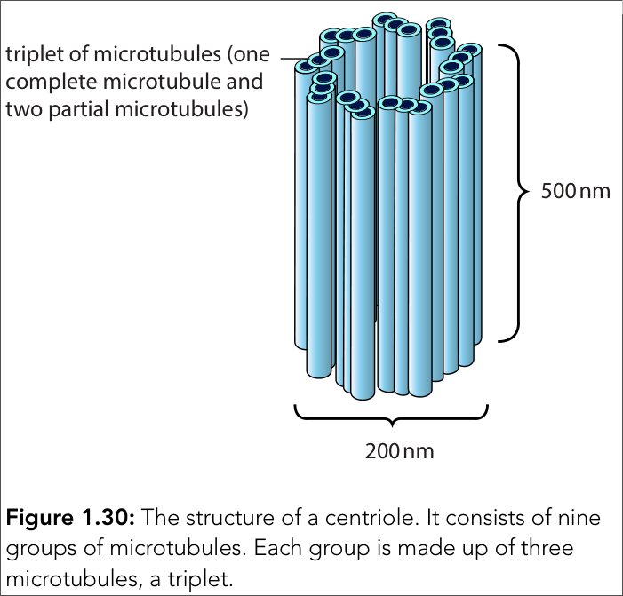
  >
  > 所以说：Tubulines → dimers → protofilaments → microtulube → centriole → centrosome

- Microtubules form an essential part of the mechanism involved in the beating **movements** of cilia and flagella. 微管是纤毛和鞭毛**运动机制**的重要组成部分。

During nuclear division, microtubule spindle (纺锤体) is used for the separation of chromosomes.

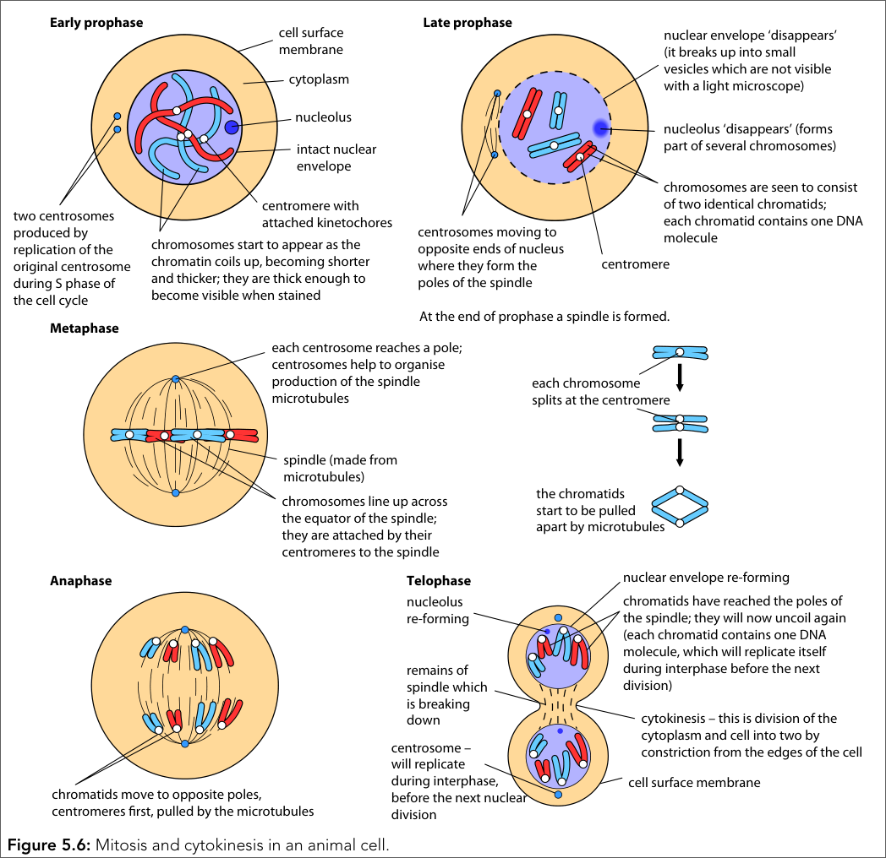

> 这是课本第五单元（第128页）的内容，现在可以不用细究，但是需要知道microtubules有这个功能。

#### Flagellum (plural: flagella) and cilium (plural: cilia) 鞭毛和纤毛

这两个东西本质上是一样的（identical structure），但是由于这个东西被命名的时候还不知道它们内部的结构，所以被认为是两个不一样的东西。通常来说，它们一般是这样被区分的：

- Flagella are long and found usually one or two per cell

  鞭毛：比较长，而且一个细胞只有少量的鞭毛

- Cilia are short and often numerous

  纤毛：短而密

对于大多数真核细胞来说，它们的鞭毛有着相对来说比较复杂的“9+2”结构——即外圈有9的单元（每个单元由两个微管组成，组成一个叫microtubule doublet的东西，简称MTD），内圈有两个单元（两个独立的微管）：

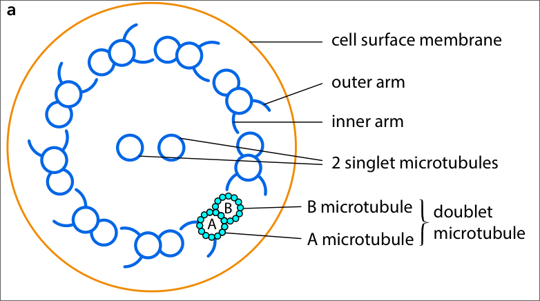

在正常情况下，一个microtubule是由13个protofilaments组成的，在组成外圈的9个doublet microtubules使会有A和B之分，A microtubule有13个protofilaments，而B microtubule只有10个protofilaments。

不过中心的两个microtubules是常规的（有13个protofilaments）。

Functions:

- locomotion 移动

- Cilia cells in lungs maintain a flow of mucus which removes debris such as dust and bacteria from the respiratory tract. 通过摆动纤毛使肺中的黏液往外移动。

  > 注意：不要把cilia和microvilli搞混了，二者虽然都是细胞器、也都是向外衍生出去的一部分，但是cilia是类似于“手臂”之类的东西，为的是移动之类的目的；而microvilli是用来增加细胞表面积来吸收更多物质的，并不能用来移动。

#### Microvillus (plural: microvilli) 微绒毛

Found in epithelial cells of small intestine, which can greatly increase the surface area of the cell surface area. 位于小肠的表层细胞上，它能极大的增加细胞的表面积。

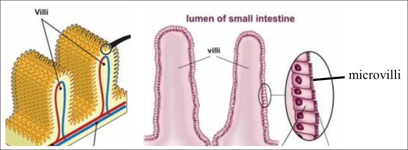

Functions：

- For reabsorption in the proximal convoluted tubules of the kidney

  在肾脏的近曲小管中进行再吸收

- For absorption of digested food into cells lining the gut

  将消化后的食物吸收进入肠道细胞

#### Cell surface membrane 细胞膜

It has three layers (trilaminar structure) - two dark (heavily stained) layers surrounding a narrow, pale interior:

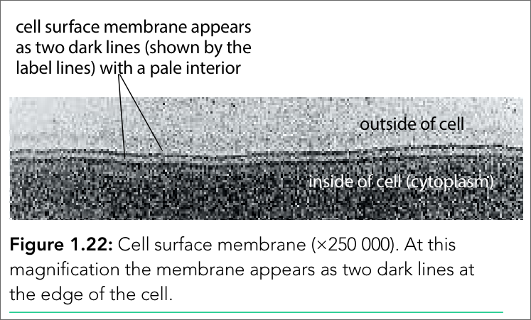

The membrane is partially permeable and controls exchange between the cell and its environment. 这层膜是半透的，它能控制细胞和外界的物质交换。

> 关于细胞膜的更多信息会在第四章中讲到

### Prokaryotic and bacterial cells 原核细胞和细菌细胞

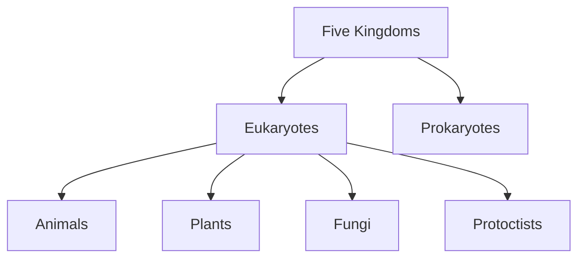
```mermaid
flowchart TD
    A[Five Kingdoms]
    B1[Eukaryotes]
    B2[Prokaryotes]

    A --> B1
    A --> B2

    C1[Animals]
    C2[Plants]
    C3[Fungi]
    C4[Protoctists]

    B1 --> C1
    B1 --> C2
    B1 --> C3
    B1 --> C4
```

Eukaryotes真核生物 - have nucleus

prokaryotes原核生物 - have no nucleus, e.g. bacteria

#### 重点信息

- Unicellular 单细胞的

- Generally 1~5 μm (diameter) 直径大约在1~5微米

- No nucleus 没有细胞核

- **Peptidoglycan** / **murein** cell walls 肽聚糖细胞壁

- Circular (chromosomal) DNA 环状的DNA

- **70S** ribosomes 核糖体（70S）

- No membrane-bound organelles (no mitochondria or chloroplasts)

  没有具有“膜”的细胞器

- Some have plasmids or flagellum 有的有质粒或者鞭毛

#### 主要结构

所有细菌细胞都有的结构：

- Murein cell wall 肽聚糖细胞壁
- Cell surface membrane 细胞膜
- Cytoplasm 细胞质
- Circular DNA 环状的DNA
- Ribosome 核糖体

有时候会包括的结构：

- Flagellum with simple structure 结构简单的鞭毛

- Capsule of slime layer for additional protection 药囊或黏液状的保护层

- infolding of cell surface membrane 向内部折叠的细胞膜

  > may form a photosynthetic membrane of carry out nitrogen fixation

- plasmid 质粒

  > several small circle of DNA 可能会有一些环状的DNA（质粒）

- Pili

  > For attachment to other cells of surface; And involved in sexual reproduction.
  >
  > 用于附着于其他细胞或其他表面；以及会参与有性繁殖。

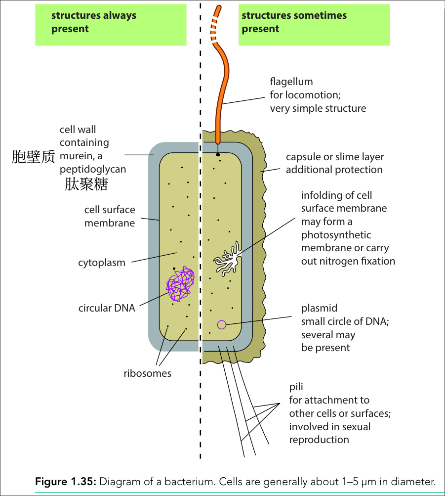

#### Prokaryotes vs Eukaryotes

| Prokaryotes                                            | Eukaryotes                                                          |
| ------------------------------------------------------ | ------------------------------------------------------------------- |
| Typical diameter: 1~5μm                                | Diameter: 40μm (up to 1000 times the volume of prokaryotic cells.)  |
| **Circular DNA** and **free** in the cytoplasm         | Has a **nucleus** with nuclear envelope (Double membrane)           |
| 70S ribosomes                                          | 70S and 80S ribosomes                                               |
| No separate **membrane-bound** organelles              | Has the organelles with **double**, **single** and **no** membranes |
| Peptidoglycan cell wall                                | Cellulose cell wall in plants and chitin in fungi                   |
| Simple flagella and lacks microtubules (Extracellular) | Flagella with "9+2" arrangement of microtubules (Intercelluar)      |
| Cell division occurs by binary fission                 | Mitosis or meiosis, and involves a spindle                          |
| Some carry out nitrogen fixation                       | None carries out nitrogen fixation.                                 |

| 原核生物                           | 真核生物                                         |
| :--------------------------------- | :----------------------------------------------- |
| 典型直径：1~5μm                    | 直径：40μm（体积可达原核细胞的1000倍）           |
| **环状DNA**，**游离**于细胞质中    | 具有由核被膜（双层膜）包裹的**细胞核**           |
| 70S核糖体                          | 含有70S和80S核糖体                               |
| 无独立的**膜包被**细胞器           | 具有**双层膜**、**单层膜**及**无膜**结构的细胞器 |
| 肽聚糖细胞壁（细菌）               | 植物具纤维素细胞壁，真菌具几丁质细胞壁           |
| 鞭毛结构简单，无微管结构（细胞外） | 鞭毛具"9+2"微管排列模式（细胞内）                |
| 通过二分裂方式进行细胞分裂         | 通过有丝分裂或减数分裂进行，过程涉及纺锤体       |
| 部分种类具有固氮能力               | 无固氮能力                                       |

#### Common structural features

**Cell surface membrane:**essential because it forms a partially permeable barrier between the cell and its environment, regulating movement of materials into and out of the cell. This is necessary to maintain an environment inside the cell which is different from that outside the cell.

**Cytoplasm:**site of metabolic activity. It contains biochemicals in solution.

**Ribosomes:**sites of protein synthesis, an essential activity of all cells. (DNA controls cells by controlling which proteins are made.) Protein synthesis is a complex process involving the interaction of many molecules; the ribosome provides a site where this an happen in an organised way.

**DNA:**the genetic material. DNA contains the information which controls tha activities of the cell. It can replicate itself, enabling new cells to be formed.

### Virus 病毒

> Viruses are not living organisms. 病毒不是“活的”
>
> They don’t belong to any kingdoms. 不属于任何生物界
>
> They cannot reproduce on their own. 不能自我繁殖

- very small (20~300nm) 非常小
- non-cellular (acellular) 不是一个细胞，没有细胞膜等必要的细胞结构
- has either **DNA or RNA (a nucleic acid core)** 含有DNA或RNA
- has a **protein coat** / a capsid made of protein called **capsomere** 没有细胞壁，有一一层**蛋白质外衣**
- some viruses have a outer envelope made of phospholipids 有的病毒有一层磷脂类的膜

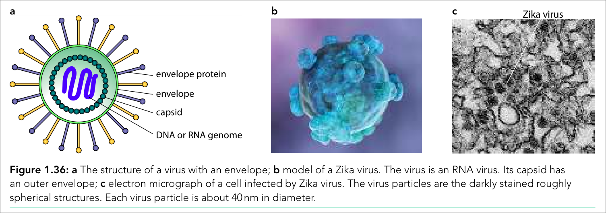

### 单元总结

The basic unit of life is the cell. The simplest cells are prokaryotic cells, hich are thought to have evolved before, and given rise to, the much more omplex and much larger eukaryotic cells.

生命的基本单位是细胞。最简单的细胞是原核细胞，被认为在进化史上先于更复杂、更庞大的真核细胞出现，并最终演化出真核细胞。

Cells can be seen clearly only with the aid of microscopes. The light icroscope uses light as a source of radiation, whereas the electron microscope uses electrons. The electron microscope has greater resolution (allows more detail to be seen) than the light microscope because electrons have a shorter wavelength than light.

唯有借助显微镜才能清晰观测细胞。光学显微镜以可见光为辐射源，而电子显微镜则使用电子束。由于电子波长比光波更短，电子显微镜具有更高的分辨率（能呈现更多细节）。

With a light microscope, cells may be measured using an eyepiece graticule and a stage micrometer. Using the formula

使用光学显微镜时，可通过目镜测微尺和载物台测微尺测量细胞。

$$
A = I / M
$$

the actual size of an object (A) or its magnification (M) can be found if its observed (image) size (I) is measured and A or M, as appropriate, is known.

若测得物体的观测（图像）尺寸（I）并已知实际尺寸（A）或放大倍数（M），即可计算出另一个未知量。

All cells are surrounded by a partially permeable cell surface membrane that controls exchange between the cell and its environment. All cells contain genetic material in the form of DNA, and ribosomes for protein synthesis.

所有细胞都包裹着部分渗透性的细胞表面膜，用以调控细胞与外界环境的物质交换。所有细胞都含有DNA形式的遗传物质和用于蛋白质合成的核糖体。

All eukaryotic cells possess a nucleus containing DNA. The DNA is linear (not circular) and bound to proteins and RNA to form chromatin.

所有真核细胞都具有包含DNA的细胞核。其DNA呈线性（非环状），并与蛋白质和RNA结合形成染色质。

The cytoplasm of eukaryotic cells contains many organelles, some of which are surrounded by one or two membranes. Organelles of eukaryotic cells include endoplasmic reticulum (ER), 80S ribosomes, Golgi apparatus, lysosomes and mitochondria. Animal cells also contain a centrosome and centrioles and may contain cilia. Plant cells have a cell wall containing cellulose. They may contain chloroplasts and often have a large central vacuole.

真核细胞质中含有多种细胞器，部分由单层或双层膜包裹。真核细胞的细胞器包括内质网（ER）、80S核糖体、高尔基体、溶酶体和线粒体。动物细胞还含有中心体和中心粒，可能具有纤毛。植物细胞具有纤维素构成的细胞壁，可能含有叶绿体，且通常具有巨大的中央液泡。

Prokaryotic cells lack a true nucleus and have smaller (70S) ribosomes than eukaryotic cells. They also lack membrane-bound organelles. Their DNA is circular and lies free in the cytoplasm.

原核细胞缺乏真正的细胞核，其核糖体（70S）比真核细胞更小，也不具备膜包被的细胞器。它们的DNA呈环状，游离于细胞质中。

Viruses do not have a cellular structure. They are extremely small and simple. They consist of a molecule of DNA or RNA, a protein coat and sometimes an outer envelope.

病毒不具有细胞结构。它们极其微小且结构简单，通常由DNA或RNA分子、蛋白质外壳以及有时存在的包膜组成。

## Chapter 2 - Biological Molecule

这是我目前主要放笔记的地方：[as-biology-selfnotes](https://gitee.com/tomthethuan/as-biology-selfnotes)

如果要查看每个版本更新的内容的话可以在这个地方看到：[commits](https://gitee.com/tomthethuan/as-biology-selfnotes/commits/master)

如果要找我之前发的PDF版本：[releases](https://gitee.com/tomthethuan/as-biology-selfnotes/releases)

### Chapter Outline

- **单体到聚合物** (Monomers → Polymers)
- **水解与缩合反应** (Hydrolysis & Condensation)
- **碳水化合物** (Carbohydrates)
  - 单糖、二糖与多糖 (Mono-/Di-/Polysaccharide)
  - 糖苷键 (Glycosidic bond)
  - 淀粉 (Starch)
  - 糖原 (Glycogen)
  - 纤维素 (Cellulose)
  - 本尼迪特试剂检测/碘液检测 (Benedict's/Iodine test)
- **脂质** (Lipids)
  - 甘油 + 3脂肪酸 (Glycerol + 3 fatty acids)
  - 酯键 (Ester bond)
  - 甘油三酯 (Triglycerides)
  - 磷脂 (Phospholipids)
  - 乳化检测 (Emulsion test)
- **蛋白质** (Proteins)
  - 氨基酸 (Amino acids)
  - 肽键 (Peptide bond)
  - 一级、二级、三级、四级结构 (Protein structures)
  - 球状蛋白 vs 纤维状蛋白 (Globular/Fibrous proteins)
  - 血红蛋白 (Haemoglobin)
  - 胶原蛋白 (Collagen)
  - 双缩脲检测 (Biuret test)
- **水** (Water)
  - 偶极分子 (Dipole)
  - 溶剂 (Solvent)
  - 高比热容 (High specific heat capacity)
  - 高汽化热 (High latent heat of vaporization)

### Biochemistry

生物相关的化学知识点，主要包括：

- Monomer
- Polymer
- Condensation
- Hydrolysis
- Isomer

#### Monomers and Polymers

> Monomer可以想象成一个个单独的积木，当这些相同的积木拼在一起时会组成Polymer。
>
> 或者说如果用cell、tissue和organ之间的关系来解释的话，就是：
>
> - Elements → Cell organelles
> - Monomers → Cells
> - Polymer → Tissue

Monomer:

- **Elements** make up monomers
- Simplest **repeating** subunit of a polymer

Polymer:

- A marcomolecule (giant molecule) 大分子结构
- Made from **similar / identical repeating** subunits (monomers)

  同样的或相似的Monomers组合在一起时会形成Polymer

Monomers和Polymer之间可以通过化学反应互相转换：

- Monomers到Polymer称作**Condensation**

- Polymer到Monomers称作**Hydrolysis**

$$
\ce{Monomers ->[Condensation] Polymer}
$$

$$
\ce{Polymer ->[Hydrolysis] Monomers}
$$

在Hydrolysis中，水分子会被添加到Polymer中每个Monomers之间的连接处，并且将它们分开；而在Condensation的过程中，每个Monomer相互连接时会排除一个水分子。

#### Chemical Structures

**Isomers** are the molecules that have the same chemical formula but different molecular structures.

如果有两种分子的<u>结构不同但组成它们的元素相同</u>，它们被称为**异构体**。例如：

- glucose
- fructose
- galactose

它们的分子式都是C₆H₁₂O₆，但是它们结构不一样。

---

不同的有机分子会根据它们的**“特殊结构”**分到不同的类别中，这种特殊结构被成为functional group：

`-OH`: Hydroxyl group

`-COOH`: Carboxyl group

`-NH2`: Amino / amine group

---

Chemical bonds between different biological molecules:

- Di-/Polysaccharide: glycosidic bond 糖苷键
- Protein: peptide bond 肽键
- Lipid: ester bond 酯键
- DNA/RNA: phosphodiester bond 磷酸二酯键

---

#### Hydrogen Bond

Covalent bond: The atoms involved share electrons. 当两个原子共享电子时，会形成“**共价键**”，下图中可以看到蓝色的电子和红色的电子同时存在于两个原子的轨道上。

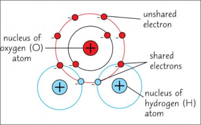

当一个化合物中的电子分布不均匀时，会导致这个化合物的一部分带正电，或者一部分带负电。当电子集中在一端时，这一侧会产生**负电**（因为电子带负电荷）。

> 共价键会导致`氧`和`氢`之间的分子集中在一个地方：

**Dipole 偶极**: Used to describe the unequal distribution of charge 用于描述电子的不均匀分布。

- Electrons away from one atom, causing a partial positive charge - **δ+** (delta plus)

- Electrons close from one atom, causing a partial negative charge - **δ-** (delta minus)

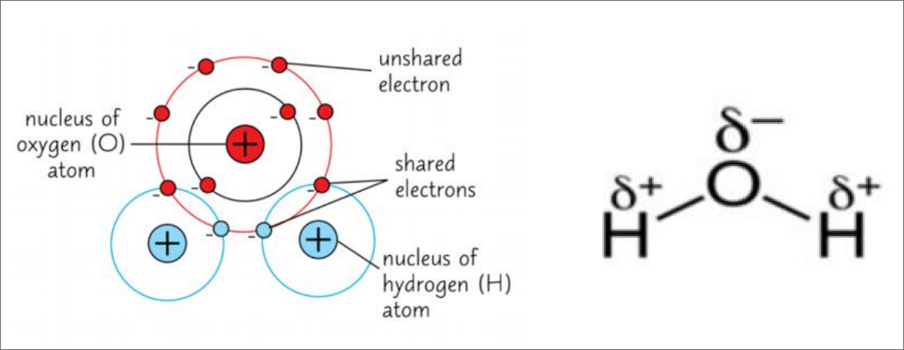

对于水分子来说，大部分都电子都集中在“靠上”的地方，导致那部分区域带有负电（左图），所以那一侧会被标记为`δ-`（右图）；对于氢原子的那一侧同理。

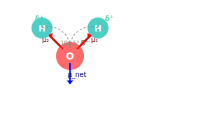

Hydrogen bond: Attraction between the **negatively charged oxygen** of one molecule and a **positively charged hydrogen** of another.

当一个水分子的`δ+`与另一个水分子的`δ-`相互吸引时，会形成“氢键”（一般在图中用虚线表示）。

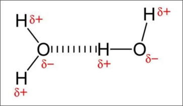

Dipoles occur in many different molecules, particularly where there is an `–OH`, `–C=O` or `–NH` group having polar covalent bond. 由于共价键会形成于很多种分子中（例如包含`–OH`、`–C=O`或`–NH`的分子中），这些不均匀分布的电子会导致产生具有“极性”的。

- Dipoles → Polar → hydrophilic (water-loving 亲水的)

- Not Dipoles → Non-Polar → hydrophobic (water-hating 疏水的)

Charged ions like `Cl`-, `Na+` and `K+` are hydrophilic.

### Bonds Summary

#### Glycosidic Bond (糖苷键)

- **Formed Between:** Two monosaccharides
- **Formed By:** Condensation reaction
- **Broken By:** Hydrolysis reaction
- **Found In:** Di-/Polysaccharides (e.g., Maltose, Sucrose, Starch, Glycogen, Cellulose)
- **Key Function / Notes:** Links sugar monomers. 1-4 and 1-6 linkages create different structures (e.g., branching).

#### Ester Bond (酯键)

- **Formed Between:** Glycerol & Fatty Acids
- **Formed By:** Condensation reaction
- **Broken By:** Hydrolysis reaction
- **Found In:** Triglycerides, Phospholipids
- **Key Function / Notes:** Forms the main structural link in lipids.

#### Peptide Bond (肽键)

- **Formed Between:** Two amino acids
- **Formed By:** Condensation reaction
- **Broken By:** Hydrolysis reaction
- **Found In:** Proteins (Di-/Polypeptides)
- **Key Function / Notes:** The covalent backbone of all proteins. Forms between the amino group of one amino acid and the carboxyl group of another.

#### Hydrogen Bond (氢键)

- **Formed Between:** A δ+ Hydrogen & a δ- Oxygen or Nitrogen
- **Formed By:** Weak electrostatic attraction
- **Broken By:** Heat, pH changes
- **Found In:** Water, Protein structures (Secondary, Tertiary, Quaternary), DNA, Cellulose
- **Key Function / Notes:** Crucial for stabilizing structures. Holds water molecules together, forms α-helices/β-sheets in proteins, and holds parallel cellulose molecules together.

#### Disulfide Bond (二硫键)

- **Formed Between:** Two Cysteine amino acids (their R groups)
- **Formed By:** Oxidation (forms a strong covalent bond)
- **Broken By:** Reduction (using reducing agents)
- **Found In:** Protein (Tertiary, Quaternary structures)
- **Key Function / Notes:** A strong covalent bond that provides significant stability to the protein's 3D shape.

#### Ionic Bond (离子键)

- **Formed Between:** Positively & Negatively charged R groups
- **Formed By:** Electrostatic attraction
- **Broken By:** pH changes
- **Found In:** Protein (Tertiary, Quaternary structures)
- **Key Function / Notes:** Can be disrupted by changes in the surrounding pH.

#### Hydrophobic Interaction (疏水相互作用)

- **Formed Between:** Non-polar (hydrophobic) R groups
- **Formed By:** Exclusion from water (this is an interaction, not a true bond)
- **Broken By:** Organic solvents, detergents
- **Found In:** Protein (Tertiary, Quaternary structures), Phospholipid Bilayer
- **Key Function / Notes:** Causes hydrophobic regions to cluster together inside proteins or in membranes.

#### Phosphodiester Bond (磷酸二酯键)

- **Formed Between:** Nucleotides (Sugars & Phosphates)
- **Formed By:** Condensation reaction
- **Broken By:** Hydrolysis reaction
- **Found In:** DNA / RNA
- **Key Function / Notes:** Forms the sugar-phosphate backbone of nucleic acids.

### Water

Water is / has...

- solvent 溶剂
- high specific heat capacity 高热比容
- high latent heat of vaporisation 高汽化潜热
- cohesion 内聚力 and adhesion 附着力

- high surface tension 表面张力

#### Water as Solvent

Water is polar , which can <u>attracted to ions and polar molecules</u> (include some carbohydrates and proteins). Chemicals like <u>ions, polar molecules, gasses and waste products (e.g. ammonia and uera)</u> dissolve in water.

It's important for:

- transport
- removal of wastes
- secretions
- medium for enzymatic reactions

#### High Specific Heat Capacity

> **Specific heat capacity** is the amount of heat to required to raise the temperature of 1kg of water by 1°C.
>
> 比热容是“把1kg物质升高1°C”所需要的能量。

Large amount of energy is required to raise the temperature of water, due to the hydrogen bonds in water. So the water is more resistant to the changes in temperature.

The temperature within cells and within the bodies of organisims tends to be **more constant** than that of the air around them.

#### High Latent Heat of Vaporisation

> **Latent Heat of Vaporisation** is the measure of heat energy needed to vaporise a liquid, changing it from a liquid to gas. 将液体汽化所需的能量

H bonds have to be broken before molecules can escape as a gas.

This is biologically important because it means that living organisms can use evaporation as a **cooling mechanism**.

#### Cohesion and Adhesion

> **Cohesion** - tend to stick to each other
>
> **Adhesion** - tend to stick to surfaces

It's useful in the transportation of water in plant's xylem, it creates **transpirational pull** inside the xylem vessel, a **long unbroken column of water** can move upward.

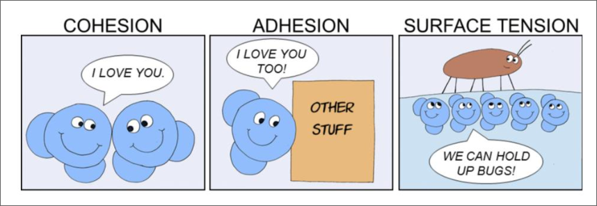

### Carbohydrates 碳水化合物

碳水化合物从名字上来看的话就是`碳`和`水`之间的化合物，也就是说碳水化合物中包括三种元素：

- Carbon
- Hydrogen
- Oxygen

对于每一个碳水化合物来说，它们的化合物都可以写成以下形式，这种形式又被称作General Formula：

$$
\ce{C_x(H2O)_y}
$$

> 其中`x`指的是碳原子的数量，而`y`指的是水分子的数量。

根据**糖分子**数量的不同，碳水化合物可以被分为三个大类：

- 一个糖分子：Monosaccharide
- 两个糖分子：Disaccharide
- 多个糖分子：Polysaccharide

#### Monosaccharide

单糖是只由一个糖分子构成的糖，它的特征有：

- Dissolve easily in water 非常容易在水中溶解
- Sweet 甜的
- Hydrogen and oxygen are present in ratio of 2:1 氢原子和氧原子之间的比例是二比一
- General formula:$(CH_2O)_n$

在Monosaccharide中，根据碳原子的数量可以分为更小的类别：

- 三个碳原子 3C：Trioses
- 五个碳原子 5C：Pentoses
- 六个碳原子 6C：Hexoses

其中Pentoses中具有代表性的**糖**有：Ribose和Deoxyribose

Hexoses中具有代表性的糖有：Glucose (C₆H₁₂O₆)、fructose和galactose

当一条糖分子足够长时会环成一个环，在展开时叫做Linear / Straight-chain structure，在头尾相连是被称为Ring Structure：

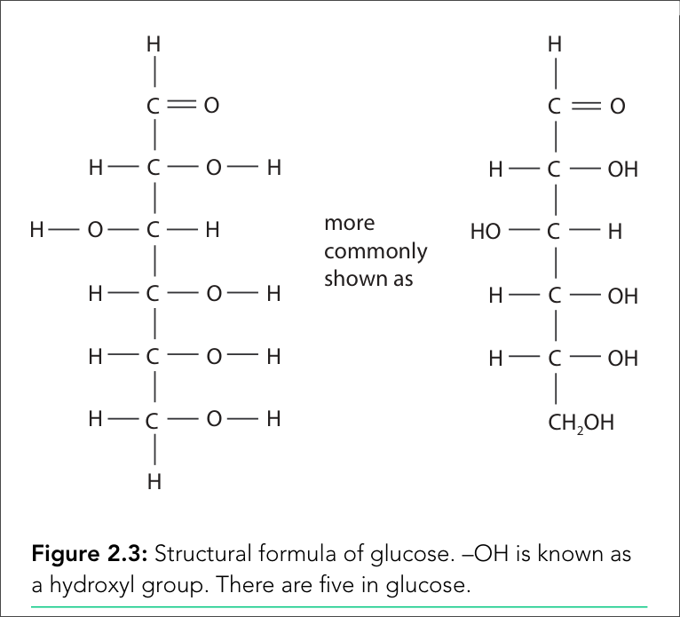

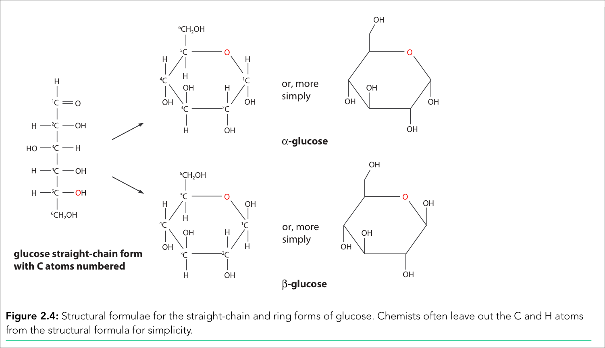

> Isomers of glucose: same linear structure but different ring structure.
>
> 可以看到在Glucose环成Ring Structure时，OH的方向会不一样，所以会有**α-glucose**和**β-glucose**之分。
>
> - α-glucose: OH is **below** the ring (**DDUDU**) - $\alpha \rightarrow B$
> - β-glucose: OH is **above** the ring (**UDUDU**) - $\beta \rightarrow A$
>
> 从最右边的OH group开始，顺时针旋转时OH的方向可以总结成DDUDU或UDUDU
>
> **这个葡萄糖的结构并不要求会画，但是要求能分辨出一个结构是不是葡萄糖，或者是哪种葡萄糖**

**Linear structure and ring structure:** If the chain is long enough, then it can transform into a ring structure, ring structure is more stable and more common. 如果一条分子链足够长的话，它会环成一个“环形”，环形的糖分子更加稳定，也更加常见。

单糖的功能：

- Used as a source of energy in respiration to **release energy** 用于在呼吸作用中释放能量
- Used to **make the polysaccharides** (starch, glycogen and cellulose) 用于构建更大的分子

#### Disaccharide (Double sugar)

Defination of **sugar**: Soluble and taste **sweet** 可溶于水，并且是**甜**的。

> 所以说只有单糖和双糖能算是“糖”

由两个Monosaccharides通过**glycosidic bond**组成，最常见的有：

- Maltose (glucose + glucose) 麦芽糖

- Sucrose (glucose + fructose) 蔗糖

  > Sucrose is the **transport sugar** in plants and the sugar commonly bought in shops.

  > [!IMPORTANT]
  >
  > Sucrose**不是**reducing sugar，无法通过Benedict's test，但是经过acid hydrolysis后会产生reducing sugar

- Lactose (glucose + galactose) 乳糖

| Disaccharide | Source                                                   | Monosaccharide      |
| ------------ | -------------------------------------------------------- | ------------------- |
| Sucrose      | sotred in plants such as sugar cane                      | glucose + fructose  |
| Lactose      | milk sugar - this is the main carbohydrate found in milk | glucose + galactose |
| Maltose      | malt sugar - found in germinating seed such as barley    | glucose + glucose   |

> Chemical formula for these disaccharide:
>
> $$
> \ce{C12H22O11}
> $$

两个Monosaccharides可以通过condensation reaction组成Disaccharide：

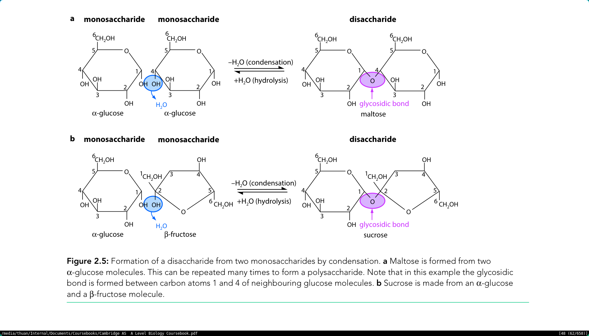

> Glycosidic bond: a C–O–C link between two sugar molecules, formed by a condensation reaction; it is a **covalent bond** 共价键.
>
> $$
> \ce{α-glucose + β-glucose ->[condensation] sucrose + water}
> $$

当两个单糖通过condensation形成双糖时，**glycosidic bond**和**水分子**会产生。由于只有两个单糖，所以双糖并不算Polymer。

### Polysaccharide

Polysaccharides are complex polymers and macromelecules. 复杂的聚合物+大分子

Bonded by **glycosidic bonds**.

> Polysaccharides are not sugars:
>
> - not sweet
> - insoluble
>
> 多糖不是甜的，也是不可溶的，所以它们不是“食用的那种糖”。

There are three main polysaccharides:

- Starch 淀粉
- Glycogen 糖原
- Cellulose 纤维素

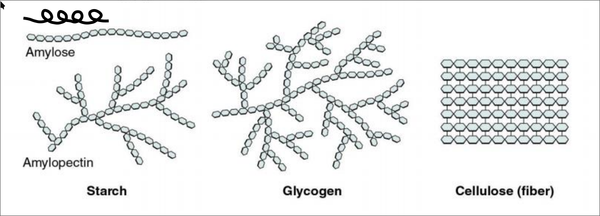

Polysaccharides are formed by multiple **condensation** reaction (**polymerisation**), where one water molecule is removed when two monosaccharides connect to each other. 多糖是通过多个condensation组合而成的，每两个单糖连接到一起时会有一个水分子被排除。

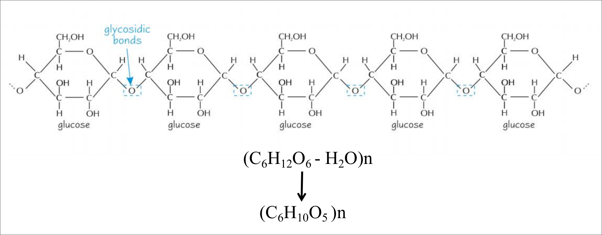

#### Starch 淀粉

- Store of energy in **plants** (in chloroplast's starch grain)

Starch is a mixture of two substances – **amylose** and **amylopectin**.

<u>"1, 4 glycosidic bond"</u> 表示一个glucose上第一个**C**和另一个glucose上第四个**C**相连：

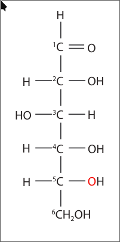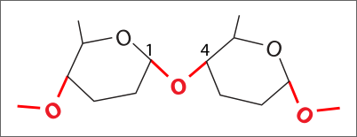

##### Amylose

- Made from **α-glucose** molecules

- Linked by 1, 4 glycosidic bonds

  通过在`1, 4`连接

- Long and **helical** 长的，**螺旋形的**

- unbranched 没有分支

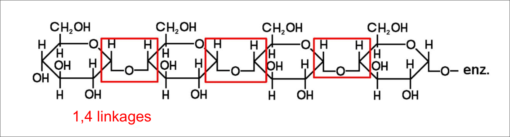

##### Amylopectin

- Made from **α-glucose** molecules (Same as Amylose)

- Linked by 1, 4 glycosidic bonds, but also with 1, 6 glycosidic bonds at branching points

分支上会有`1, 6`链接

- **Branched** molecule 有分支的

<u>1, 6 glycosidic bond</u>：

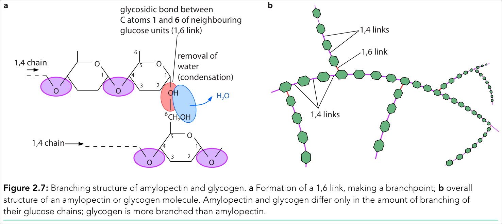

<table>
        <thead>
            <tr>
                <th>Feature</th>
                <th>Amylose</th>
                <th>Amylopectin</th>
            </tr>
        </thead>
        <tbody>
            <tr>
                <td>Monomer Unit</td>
                <td colspan="2", style="text-align: center;">α-glucose</td>
            </tr>
            <tr>
                <td>Primary Linkage</td>
                <td colspan="2", style="text-align: center;">1,4-glycosidic bonds</td>
            </tr>
            <tr>
                <td>Biological Function</td>
                <td colspan="2", style="text-align: center;">Energy storage in plants (components of starch)</td>
            </tr>
            <tr>
                <td>Molecular Structure</td>
                <td>Linear, unbranched chain</td>
                <td>Branched chain</td>
            </tr>
            <tr>
                <td>Branching Linkage</td>
                <td>None</td>
                <td>1,6-glycosidic bonds (every 24-30 glucose units)</td>
            </tr>
            <tr>
                <td>Chain Length</td>
                <td>Long (several thousand glucose units)</td>
                <td>Shorter chains (compared to amylose)</td>
            </tr>
            <tr>
                <td>Shape in Space</td>
                <td>Coils into a helix</td>
                <td>Bushy, dendritic structure</td>
            </tr>
            <tr>
                <td>Solubility in Water</td>
                <td>Less soluble</td>
                <td>More soluble</td>
            </tr>
            <tr>
                <td>Digestion Rate</td>
                <td>Slower to digest</td>
                <td>Faster to digest (more ends for enzymes to attack)</td>
            </tr>
            <tr>
                <td>Percentage in Starch</td>
                <td>~20-30%</td>
                <td>~70-80%</td>
            </tr>
        </tbody>
    </table>

<table> <thead> <tr> <th>特性</th> <th>直链淀粉 (Amylose)</th> <th>支链淀粉 (Amylopectin)</th> </tr> </thead> <tbody> <tr> <td>单体单位</td> <td colspan="2", style="text-align: center;">α-葡萄糖</td> </tr> <tr> <td>主要连接键</td> <td colspan="2", style="text-align: center;">1,4-糖苷键</td> </tr> <tr> <td>生物功能</td> <td colspan="2", style="text-align: center;">植物中的能量储存（淀粉的组成部分）</td> </tr> <tr> <td>分子结构</td> <td>线性，无支链</td> <td>有支链</td> </tr> <tr> <td>分支连接键</td> <td>无</td> <td>1,6-糖苷键（每24-30个葡萄糖单元出现一次）</td> </tr> <tr> <td>链长</td> <td>长（数千个葡萄糖单元）</td> <td>链较短（与直链淀粉相比）</td> </tr> <tr> <td>空间形状</td> <td>卷曲成螺旋状</td> <td>树枝状结构</td> </tr> <tr> <td>水溶性</td> <td>溶解度较低</td> <td>溶解度较高</td> </tr> <tr> <td>消化速率</td> <td>消化较慢</td> <td>消化较快（有更多末端供酶作用）</td> </tr> <tr> <td>在淀粉中的占比</td> <td>~20-30%</td> <td>~70-80%</td> </tr> </tbody> </table>

#### Glycogen 糖原

- Store of energy in animals (相当于动物的“淀粉”)

- Made from α-glucose

- 1,4 glycosidic bonds and 1,6 glycosidic bonds at branching points

- Even more **branched** than amylopectin

  比支链淀粉有**更多**分支

  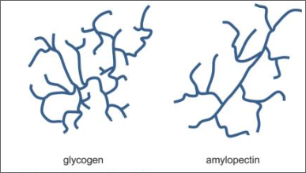

- Clumped together → forms granules

  聚集在一起 → 形成颗粒

- **Abundant** in liver and muscle cells (these to cells require large amount of energy supply)

  大量存在于肝脏和肌肉细胞中（这两种细胞需要很多能量）

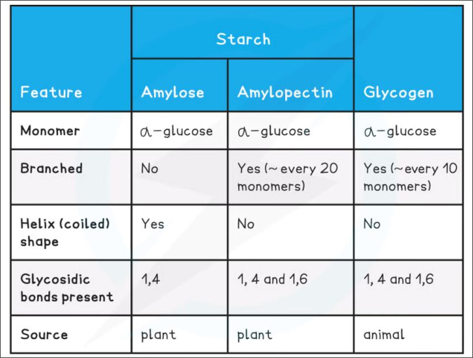

> #### Why does excess glucose need to be stored as starch and glycogen?
>
> Glucose:
>
> **soluble:**
>
> 1. increase concentration in cell
> 2. water would enter
> 3. cell volume increase, animal cells may brust
>
> **Reactive** - interferes with other reactions in cell.
>
> Starch and glycogen:
>
> - **Inert** - not reactive
> - **Insoluble** - it does not diffuse easily out of cells, it does not tend to draw water into cells by osmosis
> - **Compact** - more of them cab be stored in a small place
> - Easy to **transport**
>
> 简单来说：
>
> - 葡萄糖会溶解在水里，导致water potential发生改变，从而导致异常的osmosis发生（细胞可能会爆炸）。
> - 葡萄糖太活跃了，容易和其他物质发生化学反应。
>
> 而淀粉和糖原：
>
> - 是**惰性的**，不会轻易和别的物质发生反应。
> - **不可溶的**，所以不会扰乱正常的osmosis。
> - 排列紧凑，可以很方便地储存和运输。

#### Cellulose 纤维素

Used to make plant's cell wall

- Made by **β-glucose**

  由 **β-葡萄糖** 构成

- linked by 1,4 glycosidic bonds

  通过 1,4 糖苷键连接

- 180° rotated between nearby glucose molecules

  相邻葡萄糖分子之间旋转 180°

- unbranched, linear structure

  无分支的线性结构

- Celluloses molecules **lie parallel** → microfibrils → fibres (arranged in a **criss-cross manner**)

  纤维素分子 **平行排列** → 微纤维 → 纤维

- Cellulose fibres criss-cross to form cell wall.

  纤维素纤维纵横交错形成细胞壁

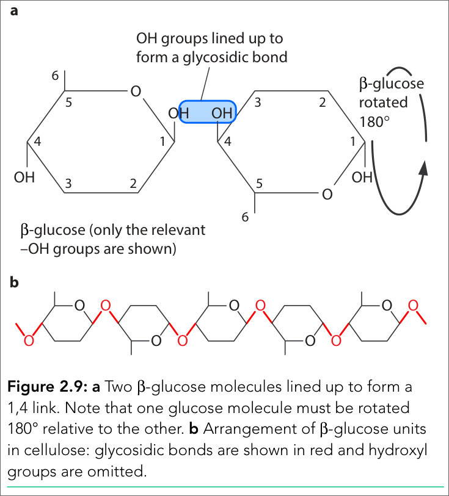

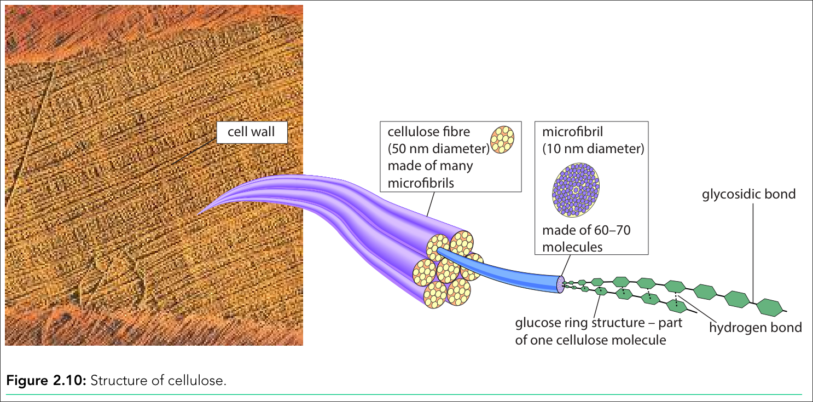

<table>
        <thead>
            <tr>
                <th>Characteristics</th>
                <th>Cellulose</th>
                <th>Amylose</th>
                <th>Amylopectin</th>
                <th>Glycogen</th>
            </tr>
        </thead>
        <tbody>
            <tr>
                <td class="characteristic">Glucose Type</td>
                <td>β-glucose</td>
                <td class="merged" colspan="3" style="text-align: center;">α-glucose</td>
            </tr>
            <tr>
                <td class="characteristic">Structure</td>
                <td>Unbranched, straight chain</td>
                <td>Unbranched, helical</td>
                <td>Branched</td>
                <td>More branched than amylopectin</td>
            </tr>
            <tr>
                <td class="characteristic">Origin</td>
                <td class="merged" colspan="2" style="text-align: center;">Plant</td>
                <td class="merged" colspan="2" style="text-align: center;">Animal</td>
            </tr>
            <tr>
                <td class="characteristic">Linkage</td>
                <td>β-1,4 linkage</td>
                <td>α-1,4 linkage</td>
                <td class="merged" colspan="2" style="text-align: center;">α-1,4 and α-1,6 linkage</td>
            </tr>
            <tr>
                <td class="characteristic">Hydrogen Bonds Present</td>
                <td>Yes, in the molecule and between molecules</td>
                <td class="merged" colspan="3" style="text-align: center;">No</td>
            </tr>
        </tbody>
  </table>
### Testing the Presence of Carbohydrates

| Type            | Reducing Sugar                                    | Non-reducing Sugar                                          | Starch              |
| --------------- | ------------------------------------------------- | ----------------------------------------------------------- | ------------------- |
| Nature          | Give out electrons                                | /                                                           | /                   |
| Examples        | Galactose, Glucose, Furctose, Maltose, Lactose... | Sucrose                                                     | Starch              |
| Method          | **Benedict's** Test (Need to heat it to 80°C)     | do the hydrolysis, neutralisation and Benedict's test again | **Iodine** Solution |
| Positive Result | Brick red (gradual colour from blue to orange)    | Brick red                                                   | Dark blue           |

#### Iodine Test

Used to test the presence of starch.

Colour change: <span style="color: #8B4513; background-color: #FFFFFF; border-radius: 8px; padding: 2px;">Orange-brown</span> → <span style="color: #191970; background-color: #FFFFFF; border-radius: 8px; padding: 2px;">Bule Black</span>

#### Benedict's Test

Reducing Sugar 还原糖 - The sugar can **give out electrons** (itself is oxidised)

> 氧化和还原是化学中的知识，目前来是其实只要明白Reducing Sugar可以让Benedict's test变色就行了，具体的细节（应该）不用理解。

$$
\ce{Reducing Sugar + Cu^2+ -> Oxidised Sugar + Cu+ }
$$

Colour of the solution: <span style="color: #87CEEB;">Blue</span> → <span style="color: #CB4154;">Brick Red</span>.

> **Semi-quantitative** Benedict's test 半定量的本尼迪克测试:
>
> 1. setup standard solutions with **known concentration** of reducing sugar
>
>    配置一系列已知浓度的溶液
>
> 2. use the standard as **colour scale** which can be used to compare with the unknow solution
>
>    通过这些已知的溶液做出一个比色标尺，由浅到深（蓝色→绿色→黄色→橙色→砖红色）
>
> 3. use **colorimeter 色度计** to measure the **light absorbance 吸光度** by each solution
>
>    可以通过色度计来准确地测量颜色（避免肉眼观察的偏差）
>
> 4. A graph of concentration against light absorbance can be plotted
>
>    通过画图的方式来较为准确地估算浓度

#### Testing the Presence of Non-reducing Sugar

Procedure:

1. Do the Benedict's Test first, if the colour dosen't change, so the reducing sugar is not present

   首先先对未知的溶液做Benedict's Test，如果颜色没有改变，说明这个溶液里没有reducing sugar

2. <u>Add **acid** to another sample in test tube</u> and <u>**heat** it in water bath</u> (to **hydrolyse** non-reducing sugar into monosaccharides)

   <u>将**酸**加入同样的溶液</u>（但是没有做过Benedict's Test），并<u>在水浴锅中加热</u>（用于水解非还原糖到**单糖**）

3. **Neutralise** the solution by adding an alkali (e.g. NaOH)

   **中和**第二步中产生的溶液

4. Carry out Benedict's Test on the sample again

   对新产生的溶液重新做Benedict's Test

> Result 实验结果:
>
> - <span style="color: #CB4154;">Brick Red</span> precipitate - Non-reducing sugar present 有*非还原糖*
> - Remain <span style="color: #87CEEB; background-color: #FFFFFF; border-radius: 8px;"> blue colour </span> - Not a sugar 无*非还原糖*（因为还原糖和非还原糖都没有，所以这个样本中没有糖）

If the Benedict's test shows the positive result, and then do the hydrolysis, neutralisation and Benedict's test again, and the colour becomes even darker, we can conclude that this sample contains both reducing sugar and non-reducing sugar.

当最开始的Benedict's Test呈现出显性的结果，并且经过“水解”和“中和”后再进行Benedict's Test时颜色变深了，说明第二次Benedict's Test时还原糖的浓度更高，或者说有额外的糖在“水解”和“中和”的反应中产生了，也就是说这个样本同时含有还原糖和非还原糖。

### Lipid 脂质

Lipid is NOT a polymer, they are not made of repeating units. 脂质不是聚合物，它不是由许多个重复的单元构成的。

Made of `C`, `H`, `O`, and sometimes `P` exists.

Components: Glycerol and Fatty Acids

Types: Triglycerides 甘油三酯 and Phospholipids 磷脂

| Glycerol                                                     | Fatty acid                                                   |
| ------------------------------------------------------------ | ------------------------------------------------------------ |
| Has 3 carbons and 3 `-OH` groups                             | Has a acid head and a long hydrocarbon chain.                |
| 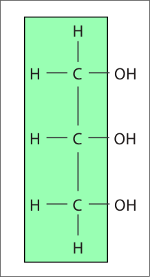 | 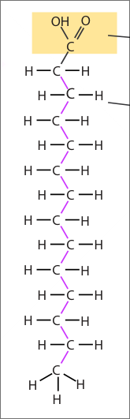 |

Fatty acid's hydrocarbon chain is **hydrophobic** and **non-polar**.

因为脂肪酸是**疏水**并且是**非极性**的，所以它不会溶于水。polar的物质只会溶于polar的液体：水是polar的，而脂肪酸是non-polar的，所以二者不会相溶。

#### Fatty Acid

There are two types of fatty acids:

- Saturated fatty acid 饱和脂肪酸 - No double bonds and triple bonds 没有双键和三键
- Unsaturated fatty acid 非饱和脂肪酸 - Has double bonds of triple bonds 含有双键或三键

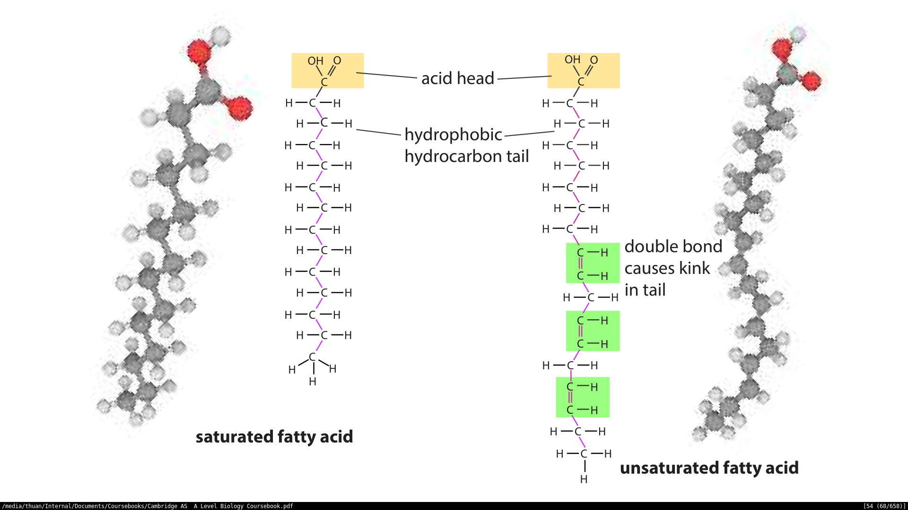

**饱和**指的是所有中间的`C`都与4个其他原子相连（没有双键），如果有双键就是**非饱和**。

| Features                  | Saturated fatty acid                       | Unsaturated fatty acid                                 |
| ------------------------- | ------------------------------------------ | ------------------------------------------------------ |
| Shape                     | Straight shape - **Can** be packed tightly | Has kinks (not straight) - **Can't** be packed tightly |
| Bonds                     | More `C-H` bonds                           | Fewer `C-H` bonds                                      |
| Melting point             | Higher                                     | Lower                                                  |
| State at room temperature | Solid                                      | Liquid                                                 |
| Example                   | Fat                                        | Oil                                                    |
| Main Source               | Animal lipids                              | Plant Lipids                                           |

| 特性         | 饱和脂肪酸 (Saturated fatty acid) | 不饱和脂肪酸 (Unsaturated fatty acid) |
| ------------ | --------------------------------- | ------------------------------------- |
| 分子形状     | 直链 - **能**紧密排列             | 有弯折（非直链）- **不能**紧密排列    |
| 化学键       | 更多 `C-H` 键                     | 较少 `C-H` 键                         |
| 熔点         | 较高                              | 较低                                  |
| 室温下的状态 | 固态                              | 液态                                  |
| 例子         | 脂肪                              | 油脂                                  |
| 主要来源     | 动物脂质                          | 植物脂质                              |

Animal lipids are often saturated and occur as fats, whereas plant lipids are often unsaturated and occur as oils, such as olive oil and sunflower oil.

动物脂质通常为饱和脂肪酸，以脂肪形式存在；而植物脂质通常为不饱和脂肪酸，以油脂形式存在，例如橄榄油和葵花籽油。

Formation of triglyceride:

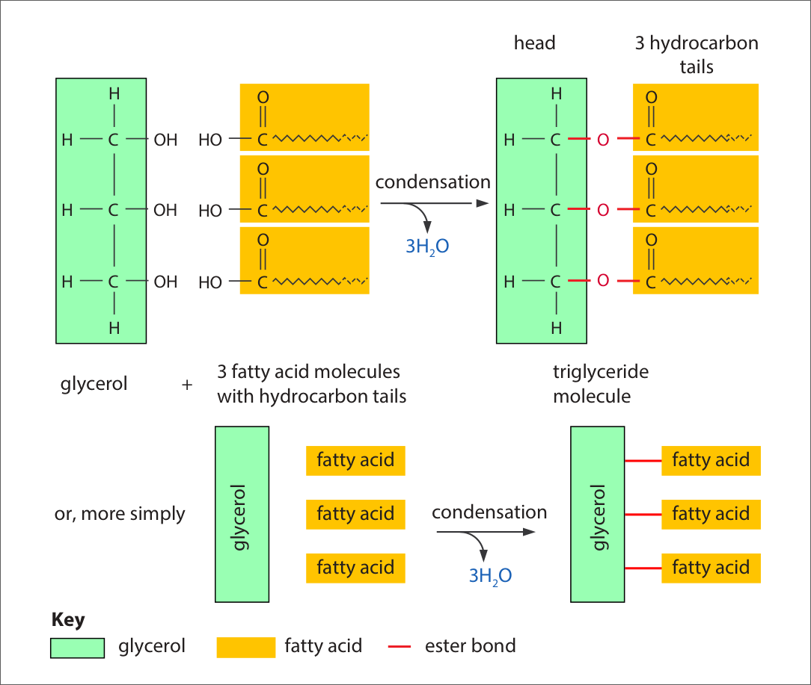

1 glycerol + 3 fatty acids → triglyceride (linked by **ester bond**) + 3 water (removed by the **condensation**)

Ester bond formed between one **hydroxyl groups** of a glycerol molecule and the **carboxyl group** of the fatty acid molecule.

#### Triglycerides

- 1 glycerol + 3 fatty acids
- Linked by ester bonds
- Formed via condensation reaction
- Can be saturated of unsaturated

- Insoluble in water (because it's non-polar and hydrophobic)

- Soluble in organic solvents:
  - ether

  - chloroform

  - ethanol

    > Both polar and non-polar can be dissolved in ethanol

##### Functions of Triglyceride

- Store of energy

  > Triglycerides contain many `C-H` bonds that can use to store energy, also it has higher energy density than carbohydrates and proteins (large mass per unit volume). `C-H`键可以储存大量的能量，并且因为它排列紧密，所以它的能量密度很高。

- Metabolic source of water

  > Triglyceride can be respired aerobically to release water, because it has a lot of hydrogen and oxygen atoms. 可以通过有氧呼吸来获得水分，因为它含有大量的氢和氧原子。

- Insulator against loss of heat (below dermis)
- Protection of organs
- Buoyancy (Float on water)

#### Phospholipids

1 fatty acid chain in triglyceride is replaced by a phosphate group.

相较于triglyceride，其中的一条fatty acid被替换成了phosphate group。

Phospholipids consist of ...

- Glycerol - the body part

- Hydrophilic Head (Phosphate group) - charged and polar
- Hydrophobic tails (Fatty acids) - insoluble and non-polar

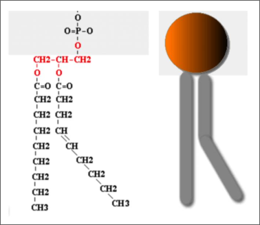

Phospholipid can form a phospholipid bilayer - the basic component of cell membrane

Phospholipid会形成一种双层的结构，这种结构是细胞膜最基础的结构（不止细胞外膜，还包括nuclear envelope之类的细胞膜）

#### Summary

| Feature                      | Triglycerides | Phospholipids        |
| :--------------------------- | :------------ | :------------------- |
| No. of Fatty Acid            | 3             | 2                    |
| Contains phosphate           | No            | Yes                  |
| No. of Ester bond            | 3             | 2                    |
| Polar                        | Non-polar     | Polar phosphate head |
| Solubility in water          | insoluble     | soluble              |
| No. of water molecule formed | 3             | 3                    |
| Function                     | Store energy  | Make cell membrane   |

| 特性                     | 甘油三酯 Triglycerides | 磷脂 Phospholipids |
| :----------------------- | :--------------------- | :----------------- |
| 脂肪酸尾链数量           | 3                      | 2                  |
| 是否含phosphate          | 否                     | 是                 |
| 酯键数量                 | 3                      | 2                  |
| 极性                     | 非极性                 | 极性磷酸头部       |
| 是否溶于水               | 不可溶                 | 可溶               |
| 形成过程中释放的水分子数 | 3                      | 3                  |
| 功能                     | 能量储存               | 细胞膜组成成分     |

### Testing the Lipids

Procedure 测试方法:

1. Add ethanol to the sample (in test tube) 添加乙醇 / 酒精
2. Shake the test tube 摇晃试管
3. Add the water 加水

If the contents become cloudy / milky, then the lipid is present.

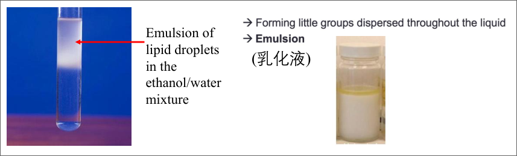

做这个试验必须要先加酒精，再加水。

- 左侧试管：先加水，摇晃，再加酒精
- 右侧试管：先加酒精，摇晃，再加水

酒精会先使油**均匀地**溶解在液体中，后来再加的水会让非常小的“油脂滴”存在于水中，形成一种“雾蒙蒙”的效果。

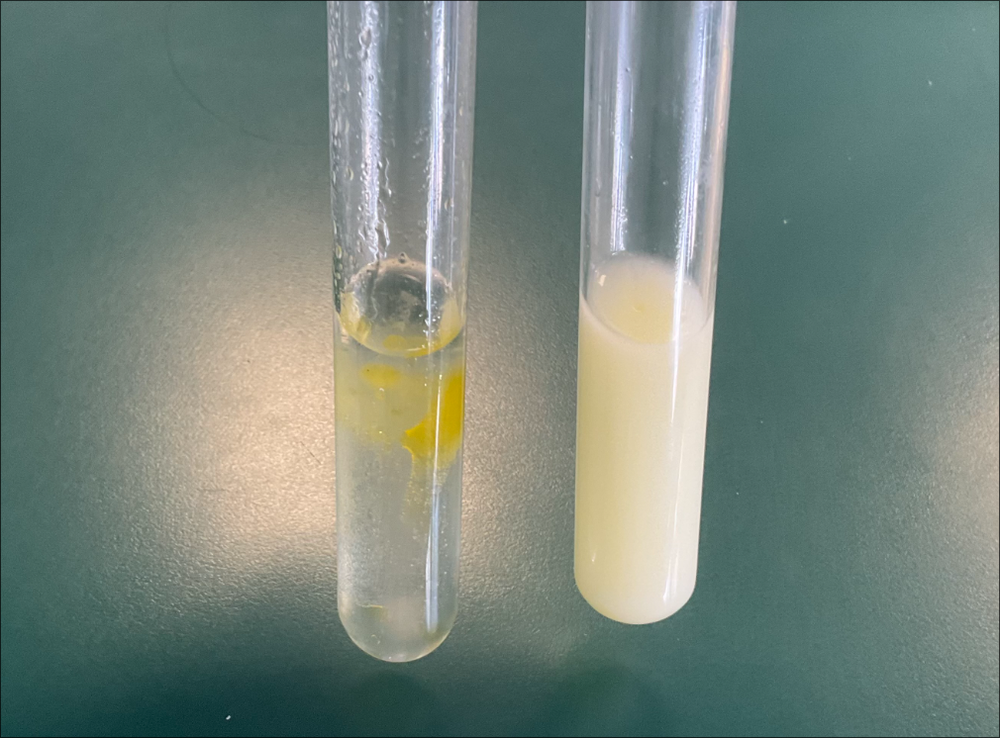

Deepseek的解释:

> **之所以要先加酒精再加水，是因为酒精能溶解脂质，而水不能。** 先加酒精并摇晃，是为了让脂质充分溶解在酒精中，形成一个“脂质-酒精”溶液。这时再加水稀释，酒精的溶解度降低，原本溶解在酒精中的脂质就会被“排挤”出来，形成微小的、悬浮的脂肪滴，从而出现乳白色的乳化现象。
>
> **如果反过来先加水：**
> 脂质根本不溶于水，所以加水后脂质会聚集成一大团，无法分散。这时再加入酒精，虽然酒精能溶解脂质，但很难将已经聚集在一起的脂质团块完全、均匀地溶解开。因此，最后溶液可能只会变得有些浑浊，或者乳化现象非常不明显，导致实验失败或结果难以观察。

### Protein

Protein is the polymer made from many amino acids. If two amino acids join together, a **dipeptide** forms; If many amino acids join together, a **polypoptide** forms.

Made of `C`, `H`, `O`, and sometimes `S` exists.

The structures made of protein:

- Haemoglobin 血红蛋白
- Collagen 胶原蛋白
- Cell membrane 细胞膜
- Enzyme 酶
- Antibody 抗体
- Keratin 角蛋白

General structure of amino acids:

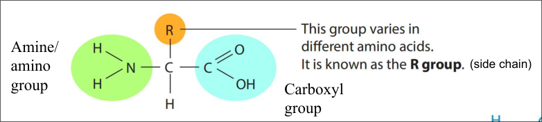

- Anime group
- Carboxyl group
- R group - the rest of the amino acid

#### R groups

The R group is the **side chain** that makes each amino acid unique. There are 20 main types, with different chemical properties:
R基是氨基酸的**侧链**（位于氨基酸的边上），它决定了每种氨基酸的唯一性。主要有20种类型，具有不同的化学性质：

- **Non-polar R groups** (Hydrophobic): Repel water, often found buried inside proteins.

  **非极性R基**（疏水）：排斥水，通常藏在蛋白质内部。
  - e.g., Glycine (Gly), Alanine (Ala), Valine (Val)

- **Polar R groups** (Hydrophilic): Attract water, often found on the protein's surface.

  **极性R基**（亲水）：吸引水，通常位于蛋白质表面。
  - e.g., Serine (Ser), Threonine (Thr)

- **Charged R groups** (Acidic/Basic): Can form ionic bonds, very hydrophilic.

  **带电荷的R基**（酸性/碱性）：可以形成离子键，亲水性很强。
  - e.g., Aspartic acid (acidic, Asp), Lysine (basic, Lys)

The chemical nature of the R groups determines how the protein folds and functions.
R基的化学性质决定了蛋白质如何折叠并执行其功能。

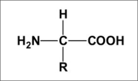

总共有20种不同的R group，因为这些R group的不同，所以有20中氨基酸。

> 例如最简单的R group只由一个`H`（氢原子）构成，这种氨基酸被称为Glycine

不同的R group可以在课本的第608页附录中找到：

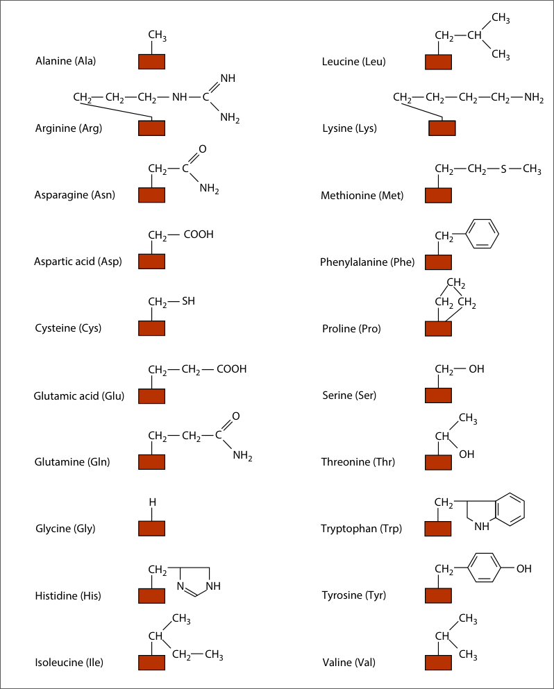

对于考试来说，必须要会分辨Cysteine和Glycine：

- 只含有一个`H`氢原子，则是Glycine

- 含有`S`硫原子，则是Cysteine

#### Polar and Non-polar Amino acids

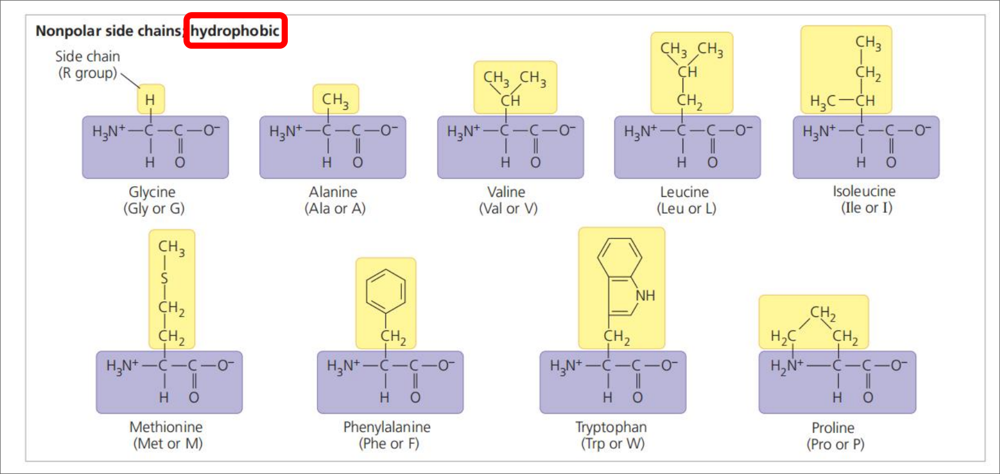

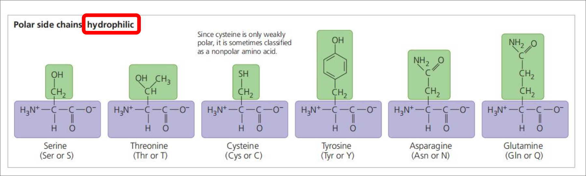

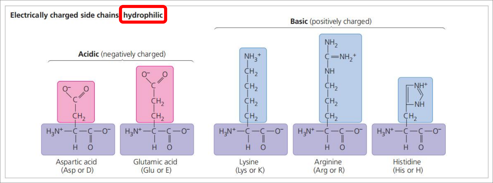

- Charged side - hydrophilic (溶于水)

  如果R group的一端标有`+`或`-`，说明这个部分是被电离了的。

- Polar side - hydrophilic (溶于水)

  如果R group的一端有`OH`或`NH₂`，那么这个是极性的

- Non-polar side - hydrophobic (不溶于水)

  对于上述没有提到的情况，大多数都是非极性的

Cysteine是特殊情况，它具有非常弱的极性，所以有时候会被分类成非极性的。

#### Formation of Peptide bond

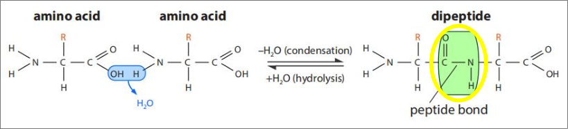

两个氨基酸会通过Condensation连接到一起，并产生一个**peptide bond**，peptide bond在上图右侧标出来了，它包括四个原子（四个元素）：`C`, `O`, `N`, `H`。

两个氨基酸通过这个condensation连接到一起时会形成Dipeptide，而很多个氨基酸通过同样的方式连接到一起时会形成Polypeptide↓。

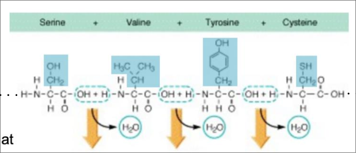

### 4 Levels of Protein Structure

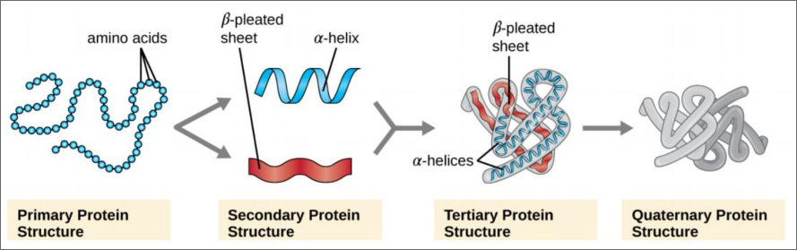

| Level of protein structure | Description                                                                                   |
| :------------------------- | :-------------------------------------------------------------------------------------------- |
| Primary                    | 40% of the amino acids in the molecule are glutamine.                                         |
| Secondary                  | The protein molecule contains short helical sections separated by pleated sheets.             |
| Tertiary                   | Hydrophobic amino acids such as proline are not found on the surface of the protein molecule. |
| Quaternary                 | The molecule contains three polypeptide chains.                                               |

| 结构层次                                     | 一级结构 (Primary) | 二级结构 (Secondary) | 三级结构 (Tertiary) | 四级结构 (Quaternary) |
| :------------------------------------------- | :----------------- | :------------------- | :------------------ | :-------------------- |
| 肽键 (Peptide)                               | √                  |                      |                     |                       |
| 氢键 (Hydrogen)                              |                    | √                    | √                   | √                     |
| 二硫键 (Disulfide)                           |                    |                      | √                   | √                     |
| 离子键 (Ionic)                               |                    |                      | √                   | √                     |
| 疏水相互作用 (weak Hydrophobic interactions) |                    |                      | √                   | √                     |

Key details summary table: [Protein Structure Levels Summary](./Protein Structure Levels Summary.md)

#### Primary Structure

- <u>Sequence of amino acids</u>

  指polypeptide中氨基酸的排列顺序

- Held together by **peptide bonds**

  通过peptide bond共价连接

- Determine the final 3D shape od the protein

  决定了蛋白质最终的三维形状和功能

#### Secondary Structure

- In a polypeptide chain

  指多肽链主链骨架的局部空间结构，**不涉及R基团**。

- Held by **hydrogen bonds**

  主要由主链上的**C=O**与**N-H** group之间形成的**氢键**来稳定。

  > [!IMPORTANT]
  >
  > 只能**C=O**和**N-H**产生链接

> In α-helix, hydrogens bonds form between the **O of the C=O group** of one amino acid and the **H of the –NH group** of the amino acid four places ahead of it.
>
> - α-helix - helical structure formed by a polypeptide chain, bind by **hydrogen bonds**
> - β-pleated sheet - a loose, sheet-like structure formed by **hydrogen bonding** between parallel polypeptide chain
>
> 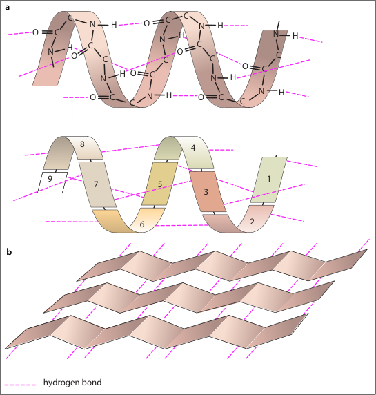
>
> 图中的虚线代表`hydrogen bond`

#### Tertiary Structure

一条蛋白质链<u>在α-helix或β-pleated sheet的基础上</u>形成的三维结构被称为三级结构。一条蛋白质链最多只能形成三级结构，如果要组成四级结构需要更多的蛋白质链加入。

- **Folding and Coiling** of a polypeptide chain (secondary structures → 3D shape)

  指**一条**多肽链在二级结构基础上进一步**折叠和盘绕**形成的完整三维空间结构。

- Due to interaction between **R groups**

- Formed by four types of bonds:
  1. hydrogen bonds

  > 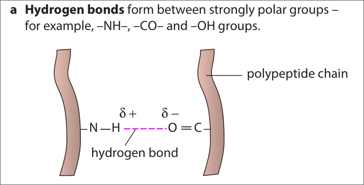
  >
  > 单个hydrogen bond的连接强度是比较弱的，但是很多个hydrogen bond在一起时会形成一个非常牢固的结构。
  >
  > 氢键容易被高温和pH变化破坏。
  1. disulfide bonds

  > 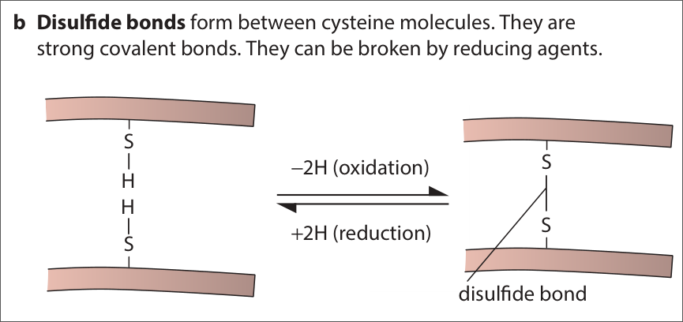
  >
  > Disulfide bonds formed by **oxidation**, and broke by **reduction**.
  >
  > Very strong bond, need to use reducing agent to break down the bond. 这是一种非常强的共价键，需要还原剂才能破坏。
  1. ionic bonds

  > 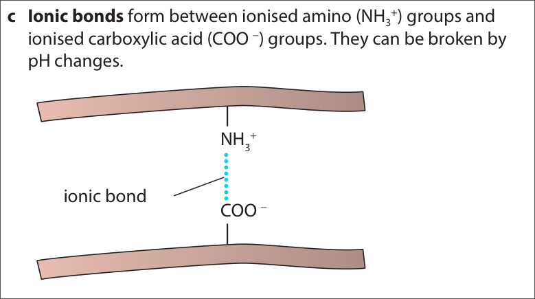
  >
  > The ionic bond will be broken when the pH changes
  1. weak hydrophobic interactions

  > 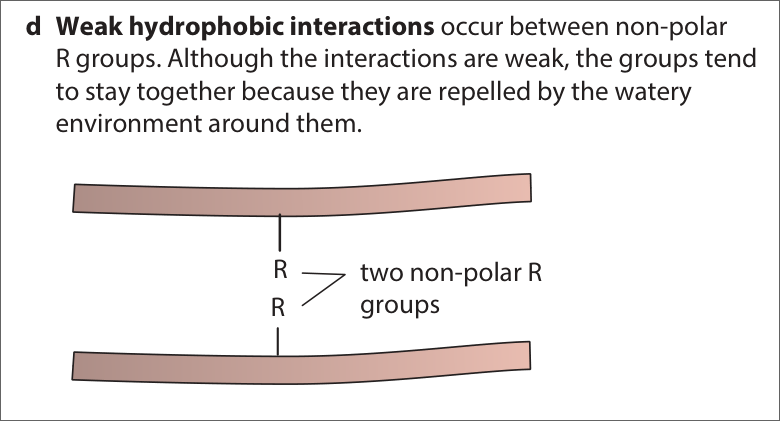
  >
  > 如果两个R group非常接近，并且它们都是hydrophobic（疏水）的，它们两个会因为都与水发生排斥，然后连接在一起。通过添加non-polar的溶液（比如酒精）就可以使这个键分开。

| Bond Type                   | How to Break It                      |
| --------------------------- | ------------------------------------ |
| **Hydrogen Bond**           | Apply **heat** or change **pH**      |
| **Disulfide Bond**          | Use **reducing agents** (e.g., DTT)  |
| **Ionic Bond**              | Change **pH** (acid/base)            |
| **Hydrophobic Interaction** | Add **organic solvents** (non-polar) |

#### Quaternary Structure

三级结构只由一条蛋白质链构成，当有一条以上的链共同形成一个三维结构时，会形成四级结构。

- Made by two or more ploypeptide chains (may also contains other structures)

  由**两条或两条以上**具有独立三级结构的polypeptide构成（有时候还会包括非peptide的成分，比如血红蛋白中的血红素）

- Also made by the 4 types of bonds in tertiary structure

### Protien's Shape (Globular and Fibrous)

| Feature                     | Globular Proteins                                              | Fibrous Proteins                                          |
| :-------------------------- | :------------------------------------------------------------- | :-------------------------------------------------------- |
| Structure Level             | Quaternary structure                                           | Quaternary structure                                      |
| **Shape**                   | Spherical / ball-like                                          | Long, strand-like / fibrous                               |
| **Solubility in Water**     | Soluble                                                        | Insoluble                                                 |
| **General Role**            | Metabolic roles (e.g., enzymes, antibodies, transport)         | Structural roles (e.g., support, strength, waterproofing) |
| **Arrangement of R Groups** | Hydrophobic groups inside, **hydrophilic groups outside**      | Repetitive sequences, often with extensive cross-linking  |
| **Examples**                | Enzymes, antibodies, myoglobin, **haemoglobin**, some hormones | **Collagen**, keratin                                     |

#### Globular Protein - Haemoglobin

球状蛋白是**可溶的**，它疏水的部分（non-polar hydrophobic R group）集中的蛋白质的中心位置，不会影响到周围的水分子；同理，它亲水的部分（hydrophilic R
group）在蛋白质的外层，使整个分子是出于亲水的状态。

> 关于可溶性的相关内容可以回顾上面的[hydrogen bond](#Hydrogen Bond)部分。

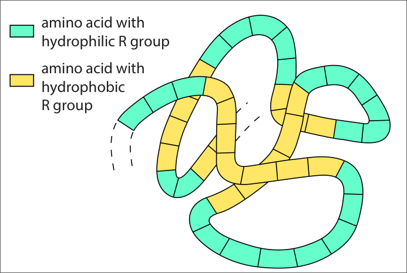

**血红蛋白**是一个典型的球状蛋白，它：

- Red in colour
- Carry oxygen
- Has quaternary structure (contains more than one polypeptide chain)
- Made of 2 **α-chains** and 2 **β-chains**

  > Two of the haemoglobin chains, called α chains, are made from α-globin, and the other two chains, called β chains, are made from β-globin.
  >
  > 一个血红蛋白中有两种血红蛋白链：α链和β链。α链是由α-血红蛋白制成的；β链是由β-血红蛋白制成的。

Each chain has a haem group → each haem group has one iron atom → each iron atom can bond reversibly with one oxygen molecule.

血红蛋白中有四条链 → 每条链中有一个血红素 → 每个血红素中有一个铁原子 → 每一个铁原子都可以和一个氧分子`O₂`“可逆地”结合（铁和氧既可以连接在一起也可以分开）

> 所以说一个血红蛋白可以携带四个氧分子（总共8个氧原子）
>
> 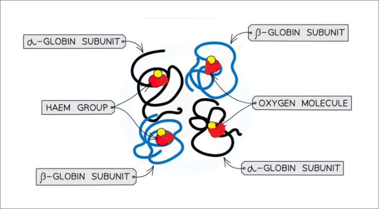
>
> Haem group is a prostatic group.

> [!IMPORTANT]
>
> 一个血红蛋白有：
>
> - 两个α-globin chain
> - 两个β-globin chain
> - 四个haem group

血红素的颜色取决于是否含有氧气：

- [x] 含有氧气：亮红色 **Bright red** (含有氧气的血红素又被叫做**oxyhaemoglobin**)
- [ ] 没有氧气：暗红色 **Bluish red**

> #### Sickle Cell Anaemia 镰刀状细胞贫血
>
> 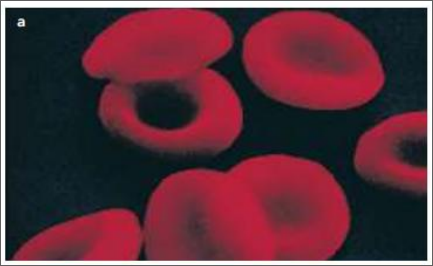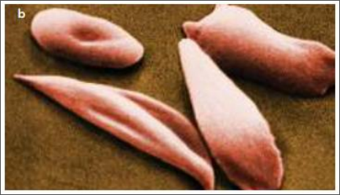
>
> 镰刀状细胞贫血是一种遗传性血液疾病，其根本原因在于**基因突变**导致血红蛋白**分子结构异常**。这种异常的血红蛋白在缺氧状态下会使正常的圆盘形红细胞变形为僵硬的“镰刀状”，从而引发一系列健康问题。
>
> - One amino acid on the surface of the β chain is **replaced** with a different amino acid.
>
>   一个碱基被另一个碱基所替换（Substitution）。
>
> - This mutation will make haemoglobin **less soluble**
>
>   溶解度下降使得血红蛋白分子容易相互粘连，形成长纤维并沉淀
>
> - Cause the unpleasant and dangerous symptoms
>
>   造成疼痛以及很多危险的症状。
>
> #### The effects of the mutant sickle cell allele on the phenotype of a person with sickle cell anaemia
>
> The mutation leads to an **altered β-polypeptide chain** in the hemoglobin protein (a change in primary structure).The mutation leads to an **altered β-polypeptide chain** in the hemoglobin protein (a change in primary structure).
>
> This structural change makes the hemoglobin **less soluble**, particularly **under low oxygen condition**.
>
> The formation of fibres causes the **red blood cells to deform into a sickle or crescent shape**.
>
> These sickled cells are **fragile and break down (lyse) more rapidly**, leading to a chronic shortage of red blood cells (haemolytic anaemia).
>
> The sickled cells are less efficient at **carrying oxygen**.
>
> The stiff, sickled cells **get stuck in narrow capillaries, blocking blood flow** to tissues and organs.
>
> This blockage causes **intense pain** and episodes known as a **sickle cell crisis**.

#### Fibrous Protein - Collagen

- Making up 25% of the total protein in mammals

- It is an insoluble fibrous protein found in skin, tendons, cartilage, bones, teeth and the walls of blood vessels.

  胶原蛋白是一种不溶的纤维蛋白，存在于皮肤、肌腱、软骨、骨骼、牙齿以及血管壁中。

- Relatively long, thin structure

- Generally insoluble

- Metabolically inactive

A collagen molecule consists of three polypeptide chains, each in the shape of a helix. These three helical polypeptides are **wound** around each other, forming a ‘triple helix’. (三条螺旋组成了一个“三螺旋”结构)

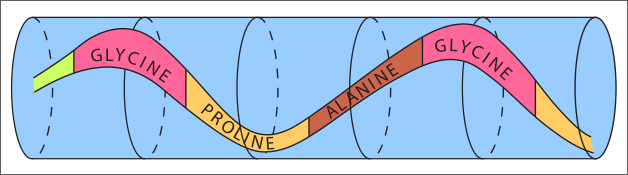

Helix with three amino acids per turn; every third amino acid is **glycine**. 螺旋结构每转包含三个氨基酸，每第三个氨基酸是甘氨酸（就有那个最简单的R group的氨基酸）。

These strands are held together by **hydrogen bonds** and some **covalent bonds**. 同时包括共价键和氢键。

Collagen molecules lie parallel to from a fibril, linked by covalent cross-links. Each fibre is made of many fibrils lying side by side. 胶原蛋白分子并排在一起形成纤维丝，每条胶原蛋白分子之间通过共价键连接。每个纤维由许多纤维丝并排构成。

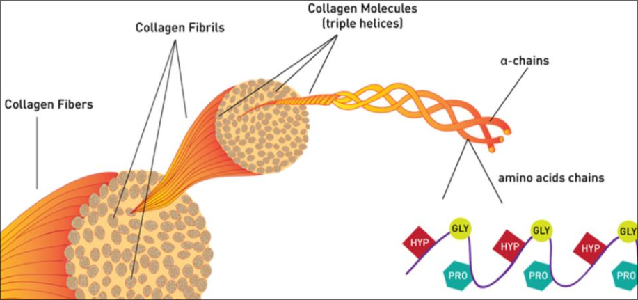

> #### The Structure of Collagen Molecule and Fibre
>
> | **Collagen Molecule**               | **Collagen Fibre**                             |
> | ----------------------------------- | ---------------------------------------------- |
> | Triple helix                        | cross links / covalent bonds between molecules |
> | tightly wound                       | molecules arranged in parallel                 |
> | hydrogen bonds between polypeptides | the ends are not aligned                       |
> | every third amino acid is glycine   | made from collagen molecules                   |

#### Summary Table

| Collagen            | Haemoglobin               |
| ------------------- | ------------------------- |
| Fibrous protein     | Globular protein          |
| Entirely helical    | Partly helical            |
| Triple helix        | Alpha helix               |
| no prosthetic group | contains prosthetic group |
| insoluble           | soluble                   |

- haemoglobin contains irons that can combine with oxygen

### Testing the Proteins

Reagent: Biuret reagent (biuret test)

1. Add 2cm³ of biuret solution to 2cm³ of sample
2. Deduce the result:
   - Blue: Positive result, protein present
   - Purple: Negative result, no protein

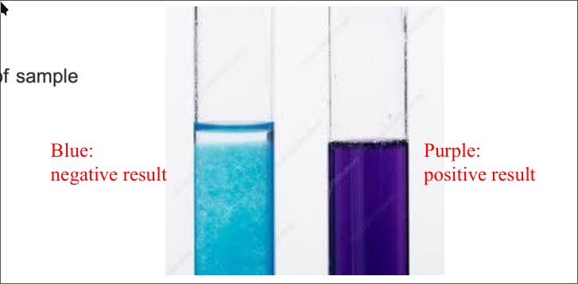

### Types of protein and their functions

The table shows some functions of proteins, with examples of proteins that carry out these functions.

| Protein                                    | Function                     | Examples & Explanations                                                                                                |
| :----------------------------------------- | :--------------------------- | :--------------------------------------------------------------------------------------------------------------------- |
| collagen 胶原蛋白<br>keratin 角蛋白        | structural 结构蛋白          | **胶原蛋白**：存在于皮肤、肌腱、骨骼中，提供支撑和弹性。<br>**角蛋白**：构成头发、指甲、羽毛和角，提供保护和硬度。     |
| amylase 淀粉酶, <br>lactase 乳糖酶         | enzyme 酶                    | **淀粉酶**：在唾液和胰液中，催化淀粉分解为糖。<br>**乳糖酶**：在小肠中，催化乳糖分解为葡萄糖和半乳糖。                 |
| insulin 胰岛素                             | hormone 激素                 | 由胰腺分泌，调节血糖水平。缺乏会导致糖尿病。                                                                           |
| haemoglobin 血红蛋白<br>myoglobin 肌红蛋白 | respiratory pigment 呼吸色素 | **血红蛋白**：在红细胞中，负责运输氧气。<br>**肌红蛋白**：在肌肉细胞中，储存氧气以备肌肉收缩时使用。                   |
| antibodies 抗体<br>fibrinogen 纤维蛋白原   | defence 防御                 | **抗体**：识别并中和外来病原体，如病毒和细菌。<br>**纤维蛋白原**：在受伤时转化为纤维蛋白，形成血凝块阻止出血。         |
| actin 肌动蛋白<br>myosin 肌球蛋白          | contraction 收缩             | 二者是肌肉纤维的主要成分，通过相互滑动引起肌肉收缩。                                                                   |
| casein 酪蛋白<br>ovalbumin 卵清蛋白        | storage 储存                 | **酪蛋白**：牛奶中的主要蛋白质，为哺乳动物幼崽提供氨基酸。<br>**卵清蛋白**：鸡蛋清中的主要蛋白质，为胚胎发育提供营养。 |

### Summary

> **Key Concept:** Biological molecules are built through <u>condensation reactions</u> (removing water) and broken down through <u>hydrolysis</u> (adding water).
>
> 生物分子通过condensation连接在一起，通过hydrolysis分开

The larger biological molecules are made from smaller molecules. The smaller molecules are joined together by **<u>condensation reactions</u>**. Condensation involves **removal of water**. The reverse process, **adding water**, is called **<u>hydrolysis</u>** and is used to break the large molecules back down into smaller molecules. **Polysaccharides** are made from **monosaccharides**, **proteins (polypeptides)** from **amino acids**, **lipids** from **fatty acids and glycerol**. Polysaccharides and proteins are formed from repeating identical or similar subunits called **monomers**. They are, therefore, **polymers**. These build up into giant molecules called **macromolecules**.

> Carbohydrates follow the general formula Cₓ(H₂O)ᵧ - hence the name "hydrates of carbon."

**Carbohydrates** have the general formula Cₓ(H₂O)ᵧ and include **monosaccharides**, **disaccharides** and **polysaccharides**. Monosaccharides are joined together by **<u>glycosidic bonds</u>** to make disaccharides and polysaccharides. Monosaccharides (e.g. *glucose*) and disaccharides (e.g. *sucrose*) are very water-soluble and are known as **sugars**. They are important **energy sources** in cells and also important **building blocks** for larger molecules like polysaccharides.

Monosaccharides may have straight-chain or ring structures and may exist in different isomeric forms such as **α-glucose** and **β-glucose**.

> Benedict's test turns from blue to brick-red precipitate with reducing sugars. The amount of precipitate gives a semi-quantitative measure.

**Benedict's reagent** can be used to test for **<u>reducing and non-reducing sugars</u>**. The test is **semi-quantitative**.

**Polysaccharides** include **starch**, **glycogen** and **cellulose**. Starch is an **energy storage** compound in *plants*. Starch is made up of two types of molecule, **amylose** and **amylopectin**, both made from **α-glucose**. Amylose is an unbranching molecule, whereas amylopectin has a branching structure.

> Iodine solution turns blue-black in the presence of starch.

**'Iodine solution'** can be used to test for **<u>starch</u>**.

**Glycogen** is an **energy storage** compound in *animals*. It is made from **α-glucose**. Its structure is similar to that of amylopectin but with **<u>more branching</u>**. **Cellulose** is a polymer of **β-glucose** molecules. The molecules are grouped together by **<u>hydrogen bonding</u>** to form mechanically strong fibres with **high tensile strength** that are found in **plant cell walls**.

> Fats (solid at room temperature) vs Oils (liquid at room temperature) - both are triglycerides.

**Lipids** are a diverse group of chemicals, the most common of which are **triglycerides** (fats and oils). Triglycerides are made by condensation between **three fatty acid molecules and glycerol**. **<u>Ester bonds</u>** join the fatty acids to the glycerol. Triglycerides are **hydrophobic** and do not mix with water. They act as **energy storage compounds**, as well as having other functions such as *insulation and buoyancy* in marine mammals.

**Phospholipids** have a **hydrophilic phosphate head** and **two hydrophobic fatty acid tails**. This is important in the formation of **membranes**.

> Emulsion test - mix with ethanol then water to form milky emulsion if lipids are present.

The **emulsion test** can be used to test for **<u>lipids</u>**.

**Proteins** are long chains of **amino acids** which fold into precise shapes. Amino acids are joined together by **<u>peptide bonds</u>**.

> Protein structure levels: Primary = Sequence, Secondary = Local folding (α-helix/β-sheet), Tertiary = 3D shape, Quaternary = Multiple chains.

Proteins have up to **four levels of structure** known as **<u>primary, secondary, tertiary and quaternary structures</u>**. The **primary structure** is the *sequence of amino acids* in a protein. This largely determines the way that it folds and hence its **three-dimensional shape and function**.

**Secondary structure** is a result of **<u>hydrogen bonding</u>** between the amino acids. Examples of secondary structure are the **α-helix** and the **β-pleated sheet**. Further folding of proteins produces the **tertiary structure**. Often, a protein is made from more than one polypeptide chain. The association between the different chains is the **quaternary structure** of the protein. Tertiary and quaternary structures are very precise and are held in place by **hydrogen bonds, disulfide bonds (which are covalent), ionic bonds and hydrophobic interactions**.

> Globular = spherical, soluble, metabolic roles
>
> Fibrous = strand-like, insoluble, structural roles.

Proteins may be **globular or fibrous**. A molecule of a **globular protein** – for example, *haemoglobin* – is roughly spherical. Most globular proteins are **soluble** and have **physiological roles**. Haemoglobin contains a **non-protein (prosthetic) group**, the *haem group*, which contains iron. This combines with oxygen. Molecules of a **fibrous protein** – for example, *collagen* – form long strands. Fibrous proteins are usually **insoluble** and have a **structural role**. Collagen has **high tensile strength** and is the most common animal protein, being found in a wide range of tissues.

**Biuret reagent** can be used to test for **<u>proteins</u>**.

> **Water Properties:** Remember these 4 key properties: high specific heat capacity, good solvent, high latent heat of vaporization, cohesion/surface tension.

**Hydrogen bonding** between water molecules gives water **unusual properties**.

Water is **liquid at most temperatures** on the Earth's surface. It has a **high specific heat capacity**, which makes liquid water relatively resistant to changes in temperature. Water acts as a **solvent for ions and polar molecules**, and causes non-polar molecules to group together. Water has a relatively **high latent heat of vaporisation**, meaning that evaporation has a **strong cooling effect**.

| Molecule Type                       | monomer | polymer | macromolecule | polysaccharide | contains subunits that form branched chains | contains amino acids | made from organic acids and glycerol | contains glycosidic bonds | contains peptide bonds | one of its main functions is to act as an energy store | usually insoluble in water | usually has a structural function | can form helical or partly helical structures | contains only carbon, hydrogen and oxygen |
| ----------------------------------- | ------- | ------- | ------------- | -------------- | ------------------------------------------- | -------------------- | ------------------------------------ | ------------------------- | ---------------------- | ------------------------------------------------------ | -------------------------- | --------------------------------- | --------------------------------------------- | ----------------------------------------- |
| Globular protein (e.g. haemoglobin) | ✗       | ✓       | ✓             | ✗              | ✗                                           | ✓                    | ✗                                    | ✗                         | ✓                      | ✗                                                      | ✗                          | ✗                                 | ✓                                             | ✗                                         |
| Fibrous protein (e.g. collagen)     | ✗       | ✓       | ✓             | ✗              | ✗                                           | ✓                    | ✗                                    | ✗                         | ✓                      | ✗                                                      | ✓                          | ✓                                 | ✓                                             | ✗                                         |
| Monosaccharide                      | ✓       | ✗       | ✗             | ✗              | ✗                                           | ✗                    | ✗                                    | ✗                         | ✗                      | ✗                                                      | ✗                          | ✗                                 | ✗                                             | ✓                                         |
| Disaccharide                        | ✗       | ✗       | ✗             | ✗              | ✗                                           | ✗                    | ✗                                    | ✓                         | ✗                      | accept ✓ or ✗                                          | ✓                          | ✗                                 | ✗                                             | ✓                                         |
| Glycogen                            | ✗       | ✓       | ✓             | ✓              | ✓                                           | ✗                    | ✗                                    | ✓                         | ✗                      | ✓                                                      | ✓                          | ✗                                 | ✓                                             | ✓                                         |
| Starch                              | ✗       | ✓       | ✓             | ✓              | ✓                                           | ✗                    | ✗                                    | ✓                         | ✗                      | ✓                                                      | ✓                          | ✓                                 | ✓                                             | ✓                                         |
| Cellulose                           | ✗       | ✓       | ✓             | ✓              | ✗                                           | ✗                    | ✗                                    | ✓                         | ✗                      | ✗                                                      | ✓                          | ✓                                 | ✓                                             | ✓                                         |
| Lipid                               | ✗       | ✗       | ✗             | ✗              | ✗                                           | ✗                    | ✗                                    | ✗                         | ✗                      | ✓                                                      | ✓                          | ✓                                 | ✓                                             | ✓                                         |

## Chapter 3 - Enzymes

### Chapter Outline

几乎所有的新陈代谢活动都需要酶的参与，酶对于生命来说至关重要。

- **酶的结构与特征** (Enzyme Structure & Features)
  - 活性部位 (Active site)
  - 底物 (Substrate)
  - 酶-底物复合物 (Enzyme-substrate complex)
  - 产物 (Product)
  - 球状蛋白性质 (Globular protein)
  - 加速反应 (Speed up reaction)
  - 降低活化能 (Reduce activation energy)

- **酶的作用模式** (Mode of Action of Enzymes)
  - 锁钥假说 (Lock-and-key hypothesis)
  - 诱导契合假说 (Induced-fit hypothesis)

- **酶促反应进程的探究** (Investigating Enzyme-catalysed Reactions)
  - 初始反应速率 (Initial rate)
  - 比色计的使用 (Colorimeter)

- **影响酶活性的因素** (Factors Affecting Enzyme Activity)
  - 酶的体积与浓度 (Volume and concentration of enzyme)
  - 底物的体积与浓度 (Volume and concentration of substrate)
  - 温度 (Temperature)
  - pH值 (pH)

- **酶亲和力的比较** (Comparing Enzyme Affinity)
  - 米氏常数 ($K_m $ at$v = \frac{1}{2} V\_{\max}$)

- **酶抑制剂** (Enzyme Inhibitors)
  - 竞争性抑制剂 (Competitive inhibitor)
  - 非竞争性抑制剂 (Non-competitive inhibitor)

- **固定化酶** (Immobilised Enzymes)
  - 海藻酸钠与氯化钙 (Sodium alginate and calcium chloride)
  - 藻酸盐微珠 (Alginate beads)

### Structure and Features of Enzymes

An enzyme is a **biological catalyst**, it can **speed up** a chemical reaction but **remain unchanged** at the end of the reaction.

酶是一种生物催化剂，它可以加速化学反应速率并且在反应结束时保持原样。

- Enzymes are **globular protein** 酶都是球形蛋白

- They are **soluble** in water 可以在水中溶解

- Almost all metabolic reactions are catalysed by enzymes

  几乎所有的新陈代谢反应都有酶的参与

- Many enzyme names end in `–ase` (e.g. amylase and ATPase)

Enzyme acts as a biological catalyst in a chemical reaction by **reducing activation energy**. 酶通过**降低活化能**来加速反应。

> 所有反应都要获得一定能量来让不同的反应物之间发生反应，这个能量被称为“活化能”（activation energy / $A_E$）。
>
> 酶能够降低这个能量，所以说现在反应物只需要更少的能量便可以发生反应了。

| Enzyme   | Substrate | Products            | Chemical Equation                                    |
| -------- | --------- | ------------------- | ---------------------------------------------------- |
| Amylase  | Starch    | Maltose             | $\ce{starch + H2O ->[amylase] maltose}$              |
| ATPase   | ATP       | ADP + Pᵢ            | $\ce{ATP + H2O ->[ATPase] ADP + P_i}$                |
| Protease | Protein   | Amino acids         | $\ce{protein + H2O ->[protease] amino acids}$        |
| Maltase  | Maltose   | Glucose             | $\ce{maltose + H2O ->[maltase] glucose}$             |
| Lactase  | Lactose   | Glucose + Galactose | $\ce{lactose + H2O ->[lactase] glucose + galactose}$ |
| Nuclease | RNA/DNA   | Nucleotides         | $\ce{RNA/DNA + H2O ->[nuclease] nucleotides}$        |

上面提到的这些酶都属于水解酶（**hydrolase**），它们能都催化水解反应（catalyse hydrolysis）。

其中Amylase、Maltase和Lactase都属于碳水化合物酶（**Carbohydrase**）。

Protease分为两种：

- Pepsin - A protease in the **stomach**
- Trypsin - Secreted from the **pancreas** and work in **small intestine**

Lysosome是用来分解不用了的细胞的，细胞包含以下一些物质，所以需要有对应的酶来分解：

- Protein ← **Protease**
- Phospholipids ← **Lipase**
- DNA ← **Nuclease**

#### Intracellular and Extracellular Enzymes

并不是所有的酶都会在细胞内发生反应，有的细胞会分泌酶到细胞外面，然后在细胞外面发生催化反应。

- **Intracellular** - 在**细胞内**发生催化反应
- **Extracellular** - 在**细胞外**发生催化反应

Digestive enzymes in the gut are extracellular enzymes. Some organisms secrete enzymes outside their bodies. Fungi, for example, often do this in order to digest the food on which they are growing.
胆囊中产生的消化酶就属于在细胞外作用的酶（细胞外酶），它们被分泌到消化道中消化食物。还有些生物（比如真菌）会直接将消化酶分泌到它们要消化的食物上。

### Mode of Action of Enzymes

#### The lock-and-key Hypothesis

Enzyme has a dent on their surface called **active site**. The reactant an enzyme acts on is called **substrate**, the substrate attaches to the active site on the enzyme, when they bind together, a **enzyme-substrate complex** forms.

酶的表面有一个称为**活性位点**的凹陷。酶作用的反应物称为**底物**，底物与酶的活性位点结合。当它们结合在一起时，形成**酶-底物复合物**。

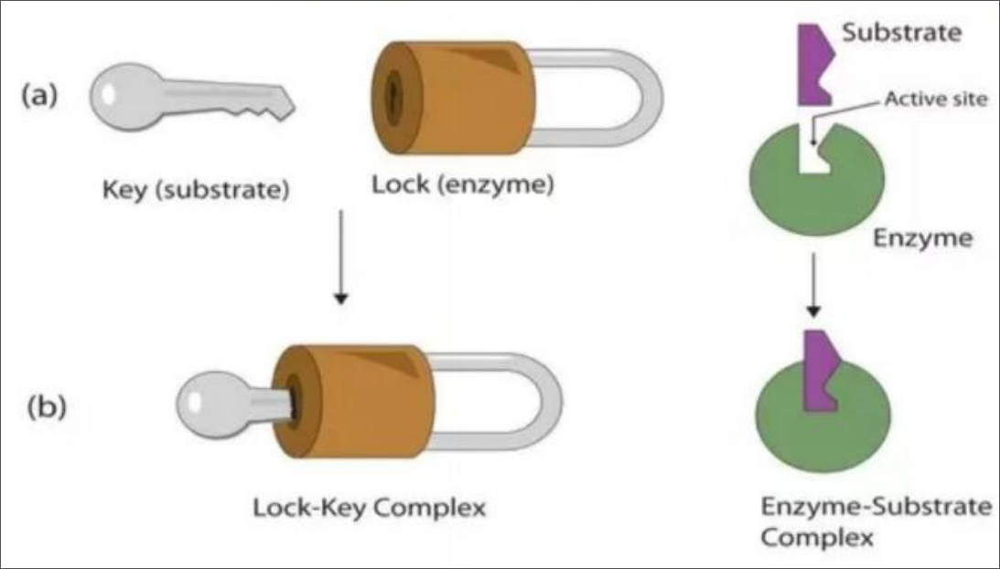

$$
\ce{Enzyme + Substrate -> Enzyme-Substrate Complex}\
$$

The shape of the active site allows the substrate to **fit perfectly**. The substrate is held in place by **temporary bonds** which form between the substrate and some of the R groups of the enzyme’s amino acids.

一个substrate可以和特定的active site完美地连接在一起，substrate会和酶氨基酸中某些R groups形成一些暂时性的“键”。

一种enzyme只会针对于一个**特定的**substract产生作用，这是因为enzyme的active site只和一种substrate的形状契合。可以用以下词语来描述：

- The enzyme's active site has a **specific** three-dimensional shape.
- This shape is **complementary** to the shape of its **particular** substrate molecule
- ...allowing only that one substrate to **fit perfectly**.

#### The induced-fit Hypothesis

这种假说在大体上来说是和“the lock-and-key hypothesis”一样的，但是不同点在于：

- The shape of the active site of the enzyme is **partially complementary** to the shape of the substrate.
- As the substrate enters the active site, the active site **induces** and <u>changes the shape slightly</u>.
- Then the active site is complementary to the substrate

#### Differences between Lock-and-Key & Induced-Fit 两种假说的区别

| 假说             | 酶与底物形状                        | 活性部位是否变化     | 现代接受度       |
| :--------------- | :---------------------------------- | :------------------- | :--------------- |
| **锁钥假说**     | 完全互补（perfectly complementary） | **不变**（rigid）    | 较旧，解释性有限 |
| **诱导契合假说** | 部分互补（partially complementary） | **可变**（flexible） | **现代主流模型** |

> **关键点**：现代研究支持**诱导契合假说**，认为酶是**柔性**的，结合时会发生**构象变化**，从而更高效地催化反应。

### Factors Affecting Enzyme Activity

影响普通反应速率的因素：

- Enzyme's concentration
- Substrate's concentration
- Temperature

影响酶活性的因素：

- pH - 蛋白质只能在一个固定的pH下保持形状（pH浓度的不同会影响蛋白质中的hydrogen bond），当酶处于不适合的pH下时它的active site会发生形变。

是一个enzyme反应速率最高的温度或pH被称为“最佳温度”或“最佳pH”（*optimum temperature*和*optimum pH*），不同的酶有不同的最佳温度和最佳pH，这取决于它们工作的环境。

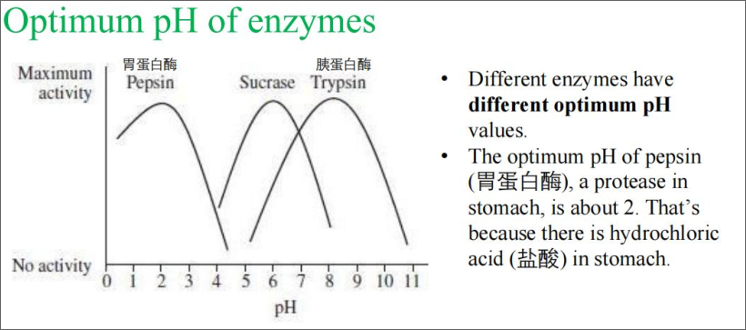

#### Describe the Graph

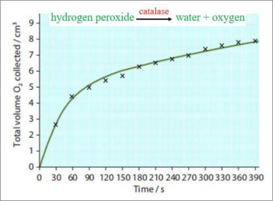

- As the time increases, the total volume of $\ce{O2}$ **(Dependent variable) increases**
- As the time increases, the **reaction rate decreases**
- Address actual data to support

> 描述图像的时候，需要提到**因变量**和**反应速率**怎么<u>根据时间发生改变</u>，并且提到<u>具体的数据</u>来支持。
>
> As the `factor on the x-axis` increases, the `factor on the y-axis` increases / decreases.

#### Explain the Graph

As the time increases...

- **more** substrate is broken down
- the **concentration** of substrate **decreases**
- the frequency of <u>successful collision</u> **decreases**
- **fewer** enzyme-substrate complexes from in unit time

在反应发生之后，反应物变少了，导致反应物的浓度变少了，导致反应发生的频率更低了，导致一定时间内产生的enzyme-substrate complexes变少。

#### Enzyme Concentration

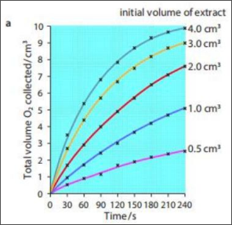

当enzyme的浓度越高，反应物的反应速率更快，也就更快达到最终的含量。

- As enzyme concentration increases, the initial rate increases
- Enzyme concentration is a **limiting factor**, as the enzyme concentration increases...
  - the frequency of successful collision **increases**
  - **more** enzyme-substrate complexes form in unit time

> 如果要描述一个变量对与反应速率的影响，可以：
>
> - 先提到这个变量是一个**limiting factor**
> - 描述**successful collision**会怎么变化（increase / decrease）
> - 描述**enzyme-substrate complexes**会怎么变化（increase / decrease）

#### How to Break the Bonds in Enzyme (Protein)

| Bond Type                   | How to Break It                      |
| --------------------------- | ------------------------------------ |
| **Hydrogen Bond**           | Apply **heat** or change **pH**      |
| **Disulfide Bond**          | Use **reducing agents** (e.g., DTT)  |
| **Ionic Bond**              | Change **pH** (acid/base)            |
| **Hydrophobic Interaction** | Add **organic solvents** (non-polar) |

当这些tertiary structure中的键发生断裂时，enzyme的<u>形状会发生改变</u>，从而导致<u>active site的形状会发生改变</u>，使得substrate和enzyme无法组合到一起发生反应。

#### Temperature's Effect

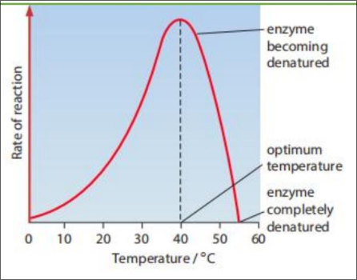

这个图像分为两个部分，40°C以左和40°C以右的部分。对于左边的部分：

- As the temperature increases from 0 to 40°C, the rate of reaction **increases**
- As the temperature increases, the kinetic energy of molecules increases and they move faster,
- The frequency of successful collision increases
- More enzyme-substrate complexes form

在40°C这个地方：

- At 40°C, the rate of reaction reaction reaches the **peak**, it's called the **optimum temperature**
- The rate of reaction is fastest

在40°C以右的部分：

- After 40°C, the rate of reaction decreases as the temperature increases.
- Above the optimum temperature, the enzymes start to **denature** and the active sites start to \**change shape*
- Fewer enzyme-substrate complexes form

当反应速率完全降到0时：

- The reaction decreases to 0 when temperature is around 55°C
- At this temperature, enzyme is **completely denatured**

#### pH's Effect

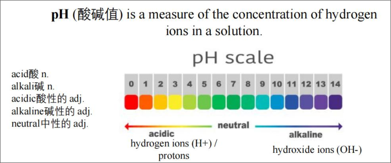

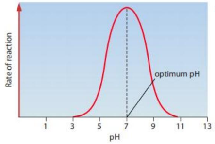

对于pH对反应速率的影响来说，越远离optimum pH，就会有越来越多的enzyme被denature，从而导致反应速率的下降。

---

*以下内容为AI生成，仅供参考*

### Investigating Enzyme-catalysed Reactions

#### How to Measure Reaction Rate 如何测量反应速率

有两种主要方法：

1. **测量产物生成速率**（如：过氧化氢酶实验）
   - 反应：\(\ce{H2O2 ->[catalase] H2O + O2}\)
   - 方法：收集氧气，测量单位时间内的体积变化。
2. **测量底物消耗速率**（如：淀粉酶实验）
   - 反应：\(\ce{starch ->[amylase] maltose}\)
   - 方法：定时取样，用**碘液测试**或**本尼迪克特测试**，结合**比色计**测量颜色变化。

#### Using a Colorimeter 使用比色计

- **原理**：测量溶液对特定波长光的**吸光度**或**透光率**。
- **步骤**：
  1. **校准**：使用空白溶液（如蒸馏水）将仪器调零。
  2. **测量**：将样品放入比色皿，读取吸光度值。
  3. **绘制标准曲线**：用已知浓度的溶液绘制浓度 vs 吸光度曲线，用于推算未知样品浓度。

> **实验技巧**：测量前**必须校准**，否则数据无效。使用**红色滤光片**可提高淀粉-碘复合物的测量灵敏度。

---

### Comparing Enzyme Affinity

#### Michaelis-Menten Constant (\(K_m\)) 米氏常数

- **定义**：反应速率达到最大速率一半（\(\frac{1}{2}V\_{\max}\)）时的底物浓度。
- **意义**：\(K_m \) 值**越小**，酶对底物的**亲和力越高**（所需底物浓度越低）。
- **公式**：\(K*m = [S] \text{ at } v = \frac{1}{2}V*{\max}\)
- **与 \(V\_{\max}\) 的关系**：两者相互独立。\(V\_{\max}\) 反映酶的最大催化能力，\(K_m\) 反映酶对底物的亲和力。

> **记忆技巧**：低 \(K_m\) = 高亲和力 = 酶“更喜欢”底物，在低浓度下就能高效工作。

---

### Enzyme Inhibitors

**Competive Inhibitors** - bind to the active site

**Non Competive Inhibitors** - bind to the allosteric site / site other than active site

- It can change the shape of active site 改变active site的形状
- and the active site no longer complementary to the substrate 底物无法结合到酶上

#### Comparison of Inhibitors 抑制剂比较

| 类型               | 结合部位                    | 对 \(V\_{\max}\) 的影响 | 对 \(K_m \) 的影响 | 能否通过增加底物浓度逆转 |
| :----------------- | :-------------------------- | :---------------------- | :----------------- | :----------------------- |
| **竞争性抑制剂**   | 活性部位（active site）     | **不变**                | **增大**           | **能**                   |
| **非竞争性抑制剂** | 变构部位（allosteric site） | **降低**                | **不变**           | **不能**                 |

#### End-Product Inhibition 终产物抑制

- **类型**：一种**可逆的非竞争性抑制**。
- **机制**：代谢途径的**终产物**作为抑制剂，结合到途径中的**第一个酶**的变构部位，从而**负反馈调节**整个途径，防止产物过度积累。
- **意义**：维持细胞内代谢物的**稳定浓度**，是生物体**自我调节**的重要方式。

> **例子**：ATP 合成途径中，ATP 过多时会抑制早期关键酶，减少 ATP 合成，避免能量浪费。

---

### Immobilised Enzymes 固定化酶

#### Methods of Immobilisation 固定化方法

除了**海藻酸钙微珠法**，还有：

- **吸附法**：酶吸附在惰性载体（如活性炭）表面。
- **共价结合法**：酶通过化学键与载体连接。
- **包埋法**：酶被包裹在凝胶网格（如聚丙烯酰胺）中。

#### Advantages of Immobilised Enzymes 固定化酶的优点（补充）

1. **可重复使用**：酶被固定后可以**多次回收利用**，降低成本。
2. **产物纯度高**：酶不混入产物，**无需后续分离**。
3. **稳定性增强**：对温度、pH 变化的耐受性**高于游离酶**。
4. **避免终产物抑制**：酶与产物可快速分离，减少抑制作用。
5. **适合连续化生产**：可填充于反应柱，实现**连续流动反应**。

#### Practical Application: Lactose-Free Milk 实际应用：无乳糖牛奶

- **酶**：**乳糖酶（lactase）**
- **过程**：
  1. 将乳糖酶固定在**海藻酸钙微珠**中。
  2. 牛奶流经装有微珠的**反应柱**。
  3. 乳糖被水解为**葡萄糖 + 半乳糖**。
  4. 收集流出的**无乳糖牛奶**。

> **意义**：为**乳糖不耐受人群**提供可饮用的牛奶，同时保留牛奶的营养价值。

---

### 实验设计与变量控制

#### Types of Variables 变量类型

| 变量类型     | 定义                 | 例子（研究温度对酶活性影响）     |
| :----------- | :------------------- | :------------------------------- |
| **自变量**   | 研究者主动改变的变量 | **温度**（如 20°C、30°C、40°C）  |
| **因变量**   | 被测量或观察的变量   | **反应速率**（如氧气体积变化）   |
| **控制变量** | 保持不变的变量       | **酶浓度、底物浓度、pH、总体积** |

#### How to Vary Independent Variables 如何改变自变量

1. **浓度**：使用**比例稀释**或**系列稀释**法配制不同浓度溶液。
2. **体积**：使用**量筒**或**移液器**精确量取。
3. **温度**：使用**恒温水浴锅**精确控制。
4. **pH**：使用**缓冲溶液**维持特定 pH。

> **实验关键**：每次实验**只能改变一个自变量**，其他所有条件必须严格保持一致，才能得出可靠结论。

---

### 复习要点总结

- **酶是蛋白质催化剂**，通过**降低活化能**和**诱导契合**机制工作。
- **反应速率**受**酶浓度、底物浓度、温度、pH、抑制剂**影响。
- **\(K_m\) 反映亲和力**，低 \(K_m\) = 高亲和力。
- **竞争性抑制**可通过增加底物逆转，**非竞争性抑制**则不能。
- **固定化酶**具有**可重复使用、稳定性高、易于分离**等优点，广泛应用于工业和食品加工。
- **实验设计**必须明确**自变量、因变量、控制变量**，并掌握**稀释、温控、pH 控制**等基本实验技能。

### SUMMARY

Enzymes are globular proteins which catalyse metabolic reactions. Each enzyme has an active site with a <u>flexible structure</u> which can change shape slightly to fit precisely the substrate molecule. This is called the ***induced-fit hypothesis***.

> Induce-fit hypothesis中enzyme会通过改变自身形状来契合substrate

Enzymes may be involved in reactions which break down molecules or join molecules together. They work by **lowering the activation energy** of the reactions they catalyse.

> 酶通过降低activation energy来加速反应

---

The course of an enzyme reaction can be followed by measuring the rate at which a product is formed or the rate at which a substrate disappears. A **progress curve**, with time on the \( x \)-axis, can be plotted. The curve is *steepest at the beginning* of the reaction, when substrate concentration is at its highest. This rate is called the ***initial rate of reaction***.

**Temperature, pH, enzyme concentration and substrate concentration** all affect the rate of activity of enzymes.

- Each enzyme has an ***optimum temperature*** at which it works fastest. As temperature increases above the optimum temperature, the enzyme gradually <u>denatures</u> (loses its precise tertiary structure).

- Each enzyme has an ***optimum pH***. Some enzymes operate within a *narrow pH range*; some have a *broad pH range*.

> The **greater the concentration of the enzyme**, the faster the rate of reaction, *provided there are enough substrate molecules present*. The **greater the concentration of the substrate**, the faster the rate of reaction, *provided enough enzyme molecules are present*. During enzyme reactions, rates *slow down as substrate molecules are used up*.

The efficiency of an enzyme can be measured by finding the value known as the **Michaelis–Menten constant, \(K_m\)**. To do this, the **maximum rate of reaction, \( V\_{max} \)**, must first be determined. Determination of \( V\_{max} \) involves finding the initial rates of reactions at different substrate concentrations while *ensuring that enzyme concentration remains constant*.

---

Enzymes are affected by the presence of <u>inhibitors</u>, which slow down or stop their activity. ***Competitive inhibitors*** have a *similar shape* to the normal substrate molecules. They **compete with the substrate** for the active site of the enzyme. Competitive inhibition is *reversible* because the inhibitor can enter and leave the active site.

***Reversible non-competitive inhibitors*** bind at a site elsewhere on the enzyme, causing a *change in shape of the active site*.

---

Enzymes can be <u>immobilised</u> – for example, by trapping them in jelly (alginate) beads. This is **commercially useful** because the enzyme can be *re-used* and the product is *separate from (uncontaminated by) the enzyme*. Immobilisation often makes enzymes **more stable**.

## Chapter 4 - Cell Membranes and Transport

Examples of cell membranes:

- Cell surface membrane
- Single membrane of lysosomes, Golgi body, vacuoles, ER
- Envelope of two membranes of nucleus, mitochondria, chloroplast

### Structure of cell membrane

- ≈7nm thick (just 2 phospholipid molecule thick)

  > [!IMPORTANT]
  >
  > 这个`7nm`的长度是要背的！！！

- Made of one phospholipid bilayer

  Phospholipid molecule的疏水层向内，亲水层向内。

  > Cell membrane可以看成一个奥利奥饼干，中间的夹心是疏水的，两侧的饼干是亲水的。

细胞膜的结构可以通过冰冻割裂术（freeze fracturing）观察到：

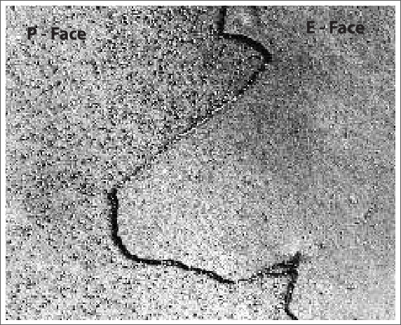

在这张图片中可以看到细胞膜上有很多微小的结构：

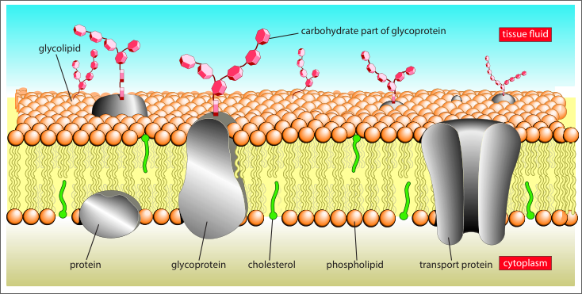

#### Fluid mosaic model 流动镶嵌模型

1. Made of a **phospholipid bilayer**
2. Contain **scattered proteins** (mosaic)
3. Both the phospholipids and proteins can **move about by diffusion** (fluid)
4. **Cholesterol** molecules fit between phospholipid molecules

细胞膜不是一个固定的结构，它是一个“有弹性的”，所以科学家提出了流动镶嵌模型。小分子（比如水分子）可以直接通过细胞膜，也就是phospholipid之间的间隙。也有一些大分子会通过细胞膜上的“蛋白质通道”来进出细胞，这种通过是carrier protein或者叫transport protein。

This model can explain:

- Passive and active movement between cells and their surroundings
- Cell to cell interactions
- Cell signalling

#### Feature and Role of Cell Membrane

- Partially permeable / semi-permeable
  1. water is small enough to move through
  2. non-polar, hydrophobic, lipid-soluble molecules such as $ O_2 $ and $ CO_2 $ can move across the fatty acid interior and the membrane
  3. Polar, hydrophilic, water-soluble molecules and ions cannot move across the fatty acid interior and they need transport proteins

#### The Factors that Influence the Fluidity

- More Unsaturated the fatty acid tails, more fluid the membrane

  不饱和脂肪酸之间排列并不紧密，所以每个脂肪酸之间的间隙更大，也更方便移动。

- The shorter the fatty acid tails, the more fluid the membrane.

- More temperature, more kinetic energy, more fluid membrane

- Cholesterol is important for the mechanical stability of membrane at high / low temperatures:
  - At low temperature, the membrane is less fluid. Cholesterol prevents close packing of fatty acid tails, increases fluidity and maintains the correct fluidity of the membrane.
  - At high temperature, the membrane is more fluid. Cholesterol reduces mobility of phospholipids and decreases fluidity

### The roles of the molecules found in membranes

**Phospholipids** - Form a phospholipid bilayer

**Cholesterol** - Increase the fluidity at low temperature

#### Proteins

1. Transport protein - active transport
   - Channel protein
   - Carrier protein

2. Enzyme - help metabolic mechanics
   - Digest
   - Catalyse

3. Some proteins attach to cytoskeleton - help to maintain the shape of the cell, or involve in changes of the shape of the cell

   > Cytoskeleton is made of microtubulus

#### Glycoproteins and Glycolipids

1. **Receptor molecules** for cell signalling

2. Act as **markers** or **antigens**, allowing cell to cell recognition

   > 不同的血型是因为glycoproteins和glycolipids不一样.

### Cell signalling

Main 3 stages of cell signalling:

1. Reception
2. Transduction
3. Cell Response

当一个endocrine cell分泌（释放出）激素，激素会通过血液移动到靶细胞（目标细胞）。靶细胞细胞膜上的protein receptor会接受到信号:

1. A stimuli causes another cell to secrete ligand

2. The ligand <u>travels in blood stream</u> to target cell

3. **ligand** reaches the receptor protein

   > Ligand 配体 - cell signalling molecule 用于传递信号的一种分子
   >
   > <u>Hormone is a type of ligand</u>, ligand is a general name for all the molecule that can signal a cell.
   >
   > The shape of ligand is **complementary** to the receptor in the cell surface membrane.
   >
   > If the ligand is hydrophobic, it can pass through the cell membrane freely, and don't need to bind with receptor protein.

4. When they bind together, the receptor will change shape

5. When the receptor changes shape / conformation, it will activate the **G protein**

6. <i style="opacity: 0.6">G protein changes shape and release GDP</i>

7. <i style="opacity: 0.6">GTP replaces the GDP in G protein</i>

8. <i style="opacity: 0.6">Then the G protein activates another protein</i>

9. And the G protein will produce **second messenger** 第二信使

10. Second messenger is produced to trigger an **enzyme cascade** 酶级联反应

11. Signal is amplified

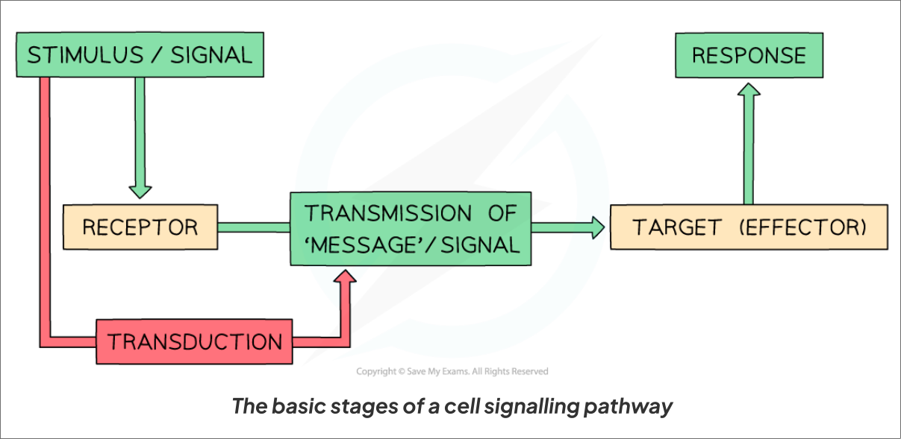

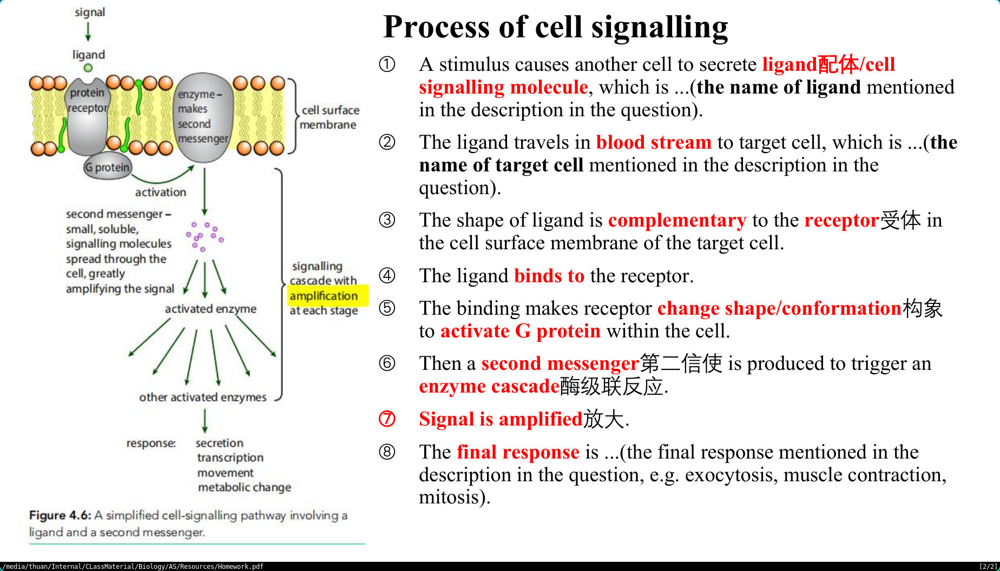

### Movement of Substances Across Membranes

Passive transport, <u>does not require the energy</u> from respiration:

- diffusion (simple diffusion)
- facilitated diffusion
- osmosis

Active transport, <u>requires the energy</u> from respiration:

- active transport
- bulk transport (endocytosis and exocytosis)

#### Diffusion

Particles **move randomly** due to **kinetic energy** in them, eventually distribute evenly in the space. Diffusion is the **net movement** of molecules and ions from <u>higher concentration to low concentration</u> down a **concentration gradient**.

> Net movement - 用来描述粒子们整体运动趋势的单词

- Down the concentration gradient
- Passive / Don't require ATP
- Don't require transport protein
- Don't require semi-permeable membrane

Hydrophobic molecules can diffuse through the cell surface membrane, for example $ O_2 $ and $CO_2$

Factors affecting rate of diffusion:

1. Steepness of concentration gradient
2. Temperature - particles move faster when the temperature is high
3. The nature of the molecules or ions - some lighter molecules can move faster than some larger molecules, polar and non-polar also will affect the diffusion rate, non-polar molecules can diffuse through the cell surface membrane more easily than the polar molecules
4. <u>Surface area : Volume</u> ratio - larger the ratio, faster the diffusion rate
5. Distance - shorter the distance, faster the diffusion rate

> 如何快速计算<u>Surface area : Volume</u>：
>
> - 当两个长方体的体积相同，那么比较它们的边长，更长的一边意味着<u>更扁的形状</u>，也就是说面积更大。

> **Question**: Why the water can become coloured when the coloured plant cell is boiled?
>
> **Answer**: High temperature or alcohol denatures proteins and damage cell membrane, so the coloured pigments can diffuse out down the concentration gradient.

#### Facilitated Diffusion

Facilitated Diffusion - the diffusion of molecule or ion through a **transport protein** (**channel protein** or **carrier protein**) in a cell membrane down their concentration gradient.

> Facilitated means making things easier to happen.

- Down the concentration gradient
- Passive, <u>don't require extra energy</u>
- Use transport protein (**specific** to a particular ion / molecule, only allow a certain type of particle to move through)

  > **Channel protein** has a <u>fixed shape</u>, usually used to transport ions.
  >
  > **Carrier protein** can <u>change their shape</u> to transport the molecules such as sugars and amino acids. 就算Carrier protein会改变形状，它也没有用ATP

- Across a cell membrane

在facilitated diffusion中，transport protein是**可以改变或不改变**自身形状的：

- 如果是通过channel protein运输，那么不会change shape
- 如果是通过carrier protein运输，则会改变形状

Factors affecting rate of facilitated diffusion:

1. Steepness of the concentration gradient
2. Temperature
3. Number of transport proteins available
4. surface area of the membrane (large surface area means more transport proteins, if the )

> **The difference between simple diffusion and facilitated diffusion:**
>
> 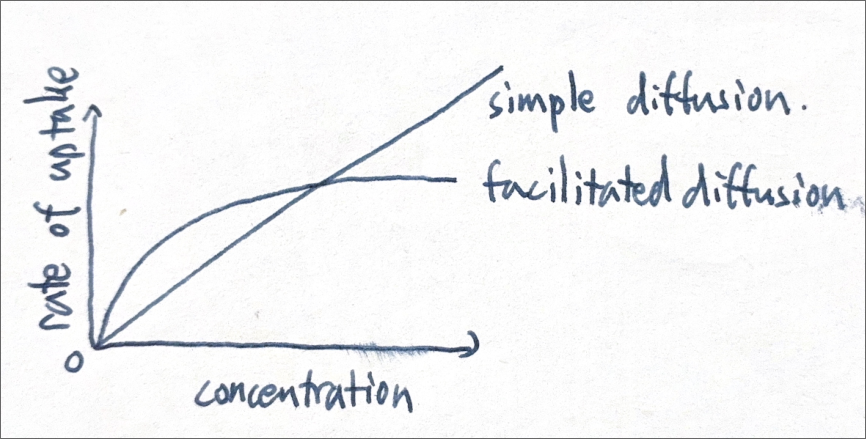
>
> For facilitated diffusion, the number of transport protein will become a limiting factor, and lacks the uptake rate.

#### Osmosis

**water potential** 水势 - 可以简单理解为水分子的“浓度”，但是水所谓一个溶液不能通过“浓度”来描述，所以使用了这个特殊的词汇。溶液中溶质的浓度越高，水势越低:

- Pure water has the highest water potential: 0 kPa
- Dilute solution has a negative water potential: < 0 kPa
- Concentrated solution has a more negative water than dilute solution.

> The Greek letter psi, ψ, is used to present water potential

Osmosis is the net diffusion of **water molecules** (only occurs for water) from high water potential to low water potential, down a water potential gradient, through a partially / semi- permeable membrane:

- Down the water potential gradient
- Passive
- Don't require transport protein
- Across a partially permeable membrane

Two types of partially permeable membrane

- cell membrane 细胞膜
- Visking tubing / dialysis tubing 透析管

The pores of the Visking tubing membrane have a certain size, if the ions or molecules are smaller than the pores, the ions or molecules can move through the membrane.

- **Starch** is a large molecule, so starch usually can't move through the Visking tubing's membrane
- **Glucose** is a small molecule, so glucose can pass through

> 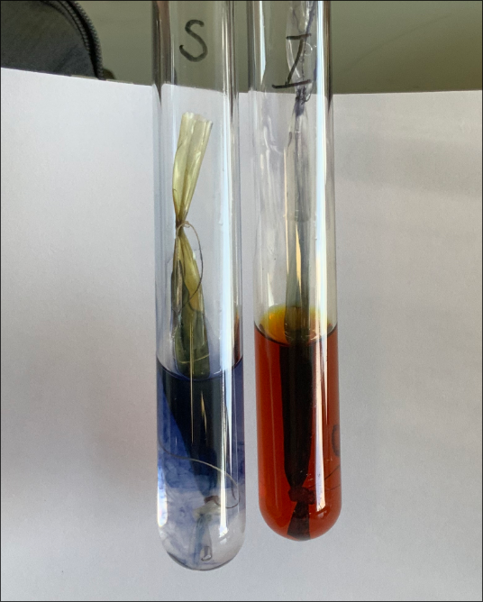
>
> | 试管           | 左试管（S）     | 右试管（I）     |
> | -------------- | --------------- | --------------- |
> | 试管中的溶液   | Starch solution | Iodine solution |
> | 透析管中的溶液 | Iodine solution | Starch solution |
>
> 在左试管中，starch不能进入透析管，但是iodine可以从透析管中出来，所以二者会在透析管外发生反应，在透析管外呈现出dark blue。
>
> 在右试管中，starch不能从透析管里出来，但是iodine可以进入透析管，所以透析管内会呈现出dark blue。

As the water moves into the cells through osmosis:

- **Animal Cell**: shrink → swell → burst

- **Plant Cell**: Plasmolysed → flaccid → turgid

| Water Potential                          | Water Movement         | Animal Cell | Plant Cell  |
| ---------------------------------------- | ---------------------- | ----------- | ----------- |
| High (Pure water)                        | Moves into the cells   | Burst       | Turgid      |
| Medium (Dilute Solution)                 | Balanced               | Swell       | Swell       |
| Low (Concentrated Solution)              | Moves out of the cells | Shrink      | Flaccid     |
| Very Low<br>(More Concentrated Solution) | Moves out of the cells | Shrink      | Plasmolysed |

> **Incipient plasmolysis** is the point at which the protoplast is about to pull away from the cell wall (the point at which plasmolysis is about to occur).
>
> 质壁分离发生的那一个点。
>
> 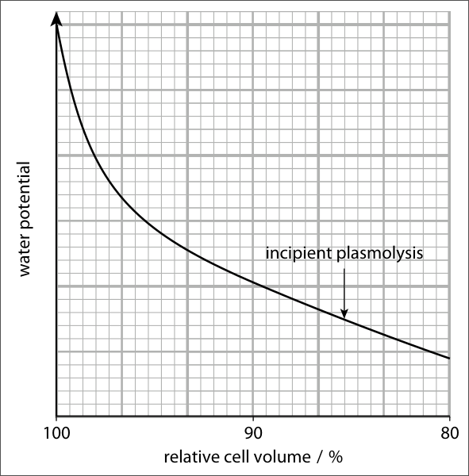

因为植物细胞的细胞壁比较坚固，所以当植物细胞水分丢失过多时，植物细胞的细胞膜会和细胞壁发生分离。

#### Active Transport

The movement of molecules or ions through carrier proteins across a cell membrane, against concentration gradient, using energy:

- against concentration gradient (from low to high)
- active transport - require energy (ATP)
- Need cell membrane - carrier protein

Carrier protein can change its shape and take the molecule against the concentration gradient:

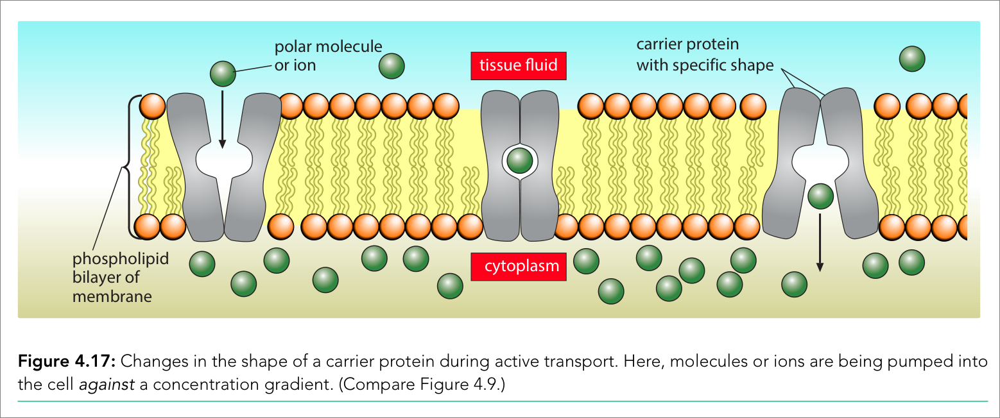

One example of carrier protein is **sodium-potassium pump**, it brings 2 $K^+$ into to cell and 3 $Na^+$ out of the cell by using 1 $ATP$ molecule each time.

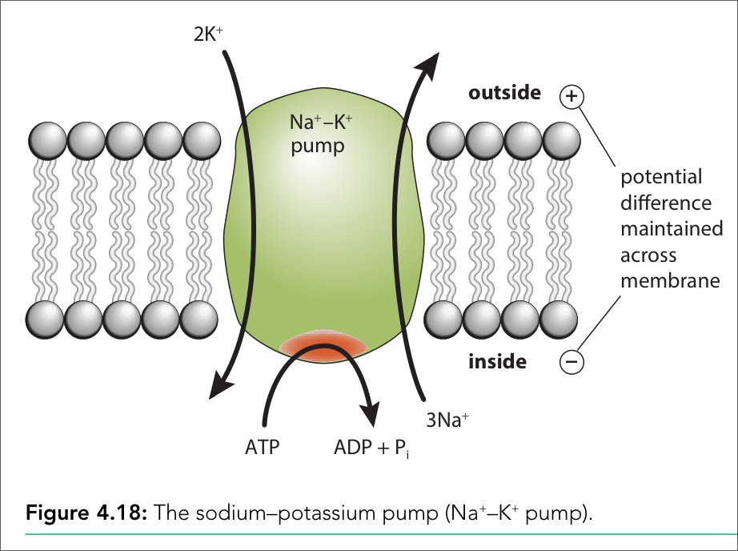

#### Bulk Transport

Transport of **large quantities** of materials into and out of the cells. The materials include **large molecules** such as proteins oy polysaccharides, parts of cells, or even whole cell.

- Use energy
- Need membrane
- Endocytosis - moves into the cell
  - Phagocytosis - carry solid materials 吞固体
  - Pinosytosis - carry liquid materials 吞液体
- Exocytosis - moves out of the cell

  > The substances to be released (such as enzymes or hormones) are packaged into **secretory vesicles** formed from the **Golgi body**.

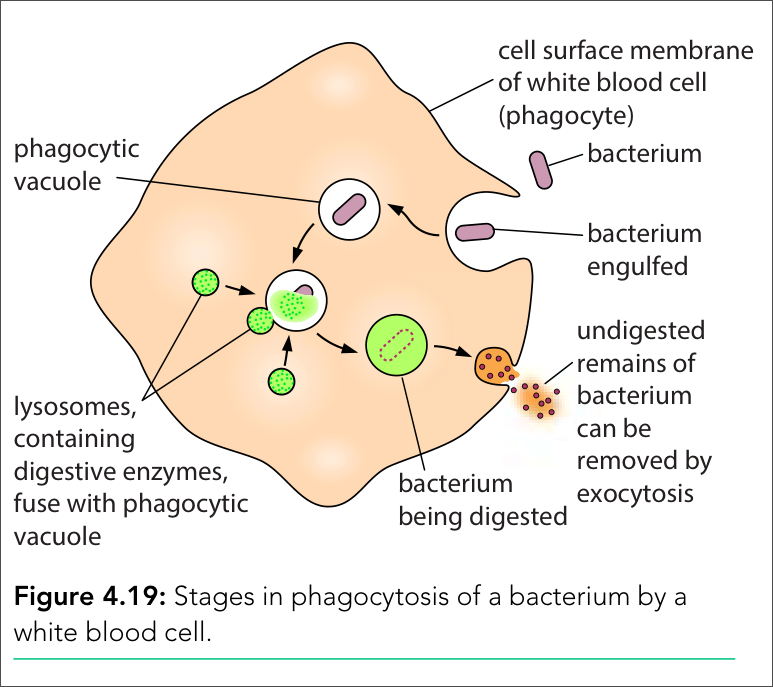

Bulk transport forms **vesicles** to transport the materials, instead of carrier proteins in active transport.

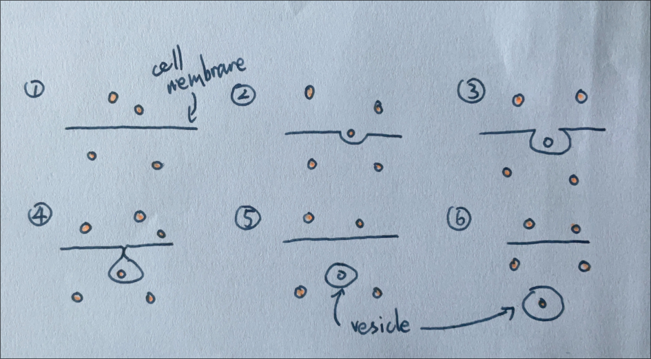

Bulk transport的活动与外界的concentration gradient没有关系。

### SUMMARY

The basic structure of a membrane is a **7 nm thick phospholipid bilayer** containing protein molecules. The structure is described as the ***fluid mosaic*** model.

- **Phospholipid bilayers are a barrier** to most water-soluble substances because the interior of the membrane is <u>hydrophobic</u>.
- **Cholesterol** is also needed for membrane *fluidity* and *stability*.
- Some proteins are **transport proteins**, transporting molecules or ions across the membrane. They may be either ***channel proteins*** or ***carrier proteins***. Channel proteins have a <u>fixed shape</u>; carrier proteins <u>change shape</u>. Some proteins act as *enzymes*.
- **Glycolipids and glycoproteins** form <u>receptors</u> – for example, for hormones or neurotransmitters. They also form **cell–cell recognition markers**.

---

Membranes play an important role in ***cell signalling***, the means by which cells communicate with each other.

---

The **cell surface membrane** controls <u>exchange</u> between the cell and its environment. Some chemical reactions take place on membranes inside cell organelles, as in *photosynthesis* and *respiration*.

**Diffusion** is the *net movement* of molecules or ions from a region of their higher concentration to one of lower concentration. Oxygen, carbon dioxide and water cross membranes by diffusion. Diffusion of ions and polar molecules through membranes is allowed by transport proteins. This process is called ***facilitated diffusion***.

Water moves from regions of <u>higher water potential</u> to regions of <u>lower water potential</u>. When this movement occurs through a **partially permeable membrane**, such as the cell surface membrane, this diffusion is called ***osmosis***.

Adding solute *lowers the water potential*. Adding pressure to a solution *increases the water potential*.

In dilute solutions, <u>animal cells burst</u> as water moves into the cytoplasm. In dilute solutions, a <u>plant cell does not burst</u>, because the **cell wall** provides resistance. In concentrated solutions, animal cells <u>shrink</u>, while in plant cells the **protoplast shrinks away from the cell wall** in a process known as ***plasmolysis***.

Some ions and molecules move across membranes by ***active transport***, *against the concentration gradient*. This needs a **carrier protein** and **ATP** to provide energy. **Exocytosis** and **endocytosis** involve the formation of vacuoles to move larger quantities of materials respectively out of, or into, cells by *bulk transport*. There are two types of endocytosis, namely ***phagocytosis*** (cell eating) and ***pinocytosis*** (cell drinking).

## Chapter 5 - The Mitosis Cell Cycle

**Mitosis 有丝分裂** - a nuclear division that produces **2 genetically identical daughter cells** to each other and to parent cell. New daughter cells can **retain functions**.

> All our body cells are **genetically identical** except gametes 配子.
>
> 有丝分裂可以简单地理解为**复制自己**。

Functions:

- **Repair** tissues 修复损坏的组织

- **Replace** damaged / dead cells 替换死去的细胞

  > 描述**tissues**时用**repair**，描述**cells**时用**replace**

- Growth of multi-cellular organisms

- Asexual reproductions

- In immune response (To increase the number of white blood cells)

> [!NOTE]
>
> What is the role of mitosis in repairing damaged tissues?
>
> - Replace dead cells by identical daughter cells
> - They retain the same function

### Mitosis Cell Cycle

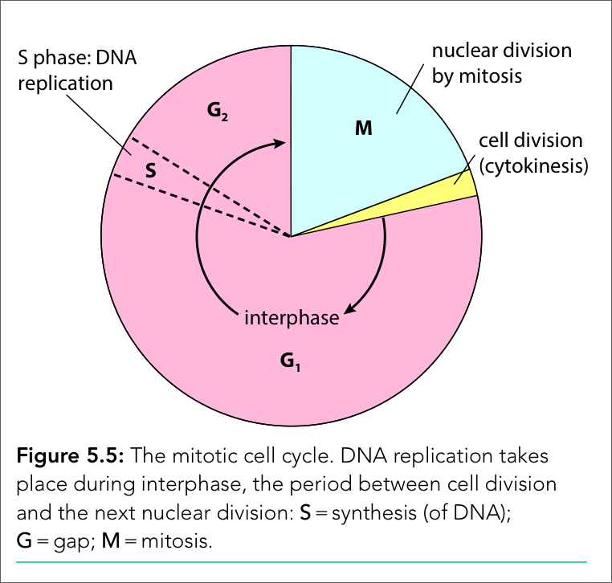

1. Interphase 分裂间期 - The growth of a cell 细胞先会自己成长
   - **$ G_1 $phase**
   - **$ S $ phase**
   - **$ G_2 $ phase**
2. $ M $ phase / Mitosis / Nuclear division 有丝分裂期
   1. **Prophase 前期**
   2. **Metaphase 中期**
   3. **Anaphase 后期**
   4. **Telophase 末期**
3. Cytohinesis 胞质分裂期

> $ G $ stands for **gap**
>
> $ S $ stands for **synthesis**
>
> $ M $ stands for **mitosis**

#### Interphase

##### $ G_1 $phase

Cells make the <u>RNA, enzyme and other proteins</u> needed for growth. At the end of this phase, the cell becomes committed to dividing or not dividing. If the cell doesn't need to divide, then the phase will stop here. 制造分裂所需的物质

##### $ S $ phase

DNA and centrosome synthesis / replication 复制DNA和中心体

After DNA replication, the number of chromosomes doesn't change, but each chromosome now has **2 sister chromatids**, which are held together by a **centromere**.

##### $ G_2 $ phase

The cell continues to grow and the new DNA that was made during the **$ S $ phase** is checked, Any errors are usually repaired. 检查并消除潜在的错误。

Other preparations for cell division are made, e.g. production of tubulin proteins needed to make microtubule spindle.

> Centrosome is the **microtubule organising centre**, makes spindle during mitosis.

#### Mitosis (second phase in the cycle)

分裂成两个细胞核

- Cell growth stops during the M phase
- During mitosis, the nucleus divides to form two genetically identical nuclei

##### Prophase

- Chromatin coils up into chromosome
- Centrosomes move towards opposite poles
- Microtubules spindle begins to form
- Nuclear envelope and nuclealus disappear

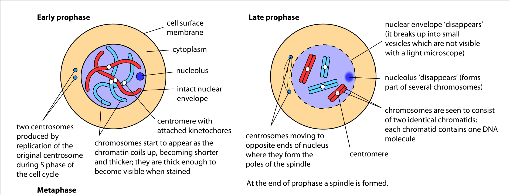

##### Metaphase

- Chromosomes line up across the equator of the spindle

Spindle fibres:

- Microtubules lengthen through polymerization of tubulin
- Microtubules shorten through depolymerization of tubulin
- The bundles of microtubulues are called spindle

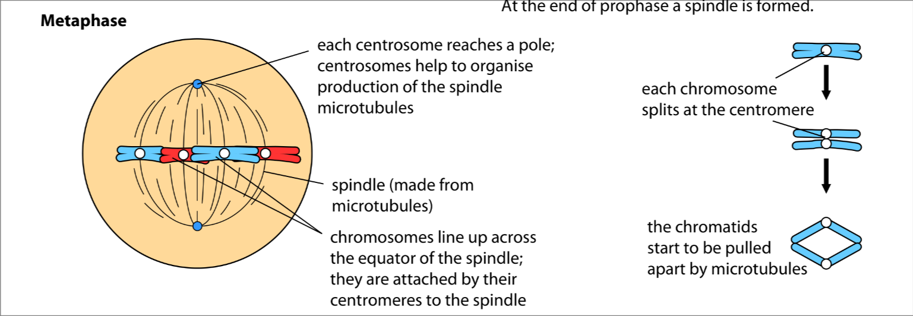

##### Anaphase

在这个阶段中，可以通过显微镜粗略地分辨单个染色体。

- Sister chromatids seperate and move to opposite poles, pulled by the microtubules
- Centromere of each chromosome divides
- Spindle microtubules shorten

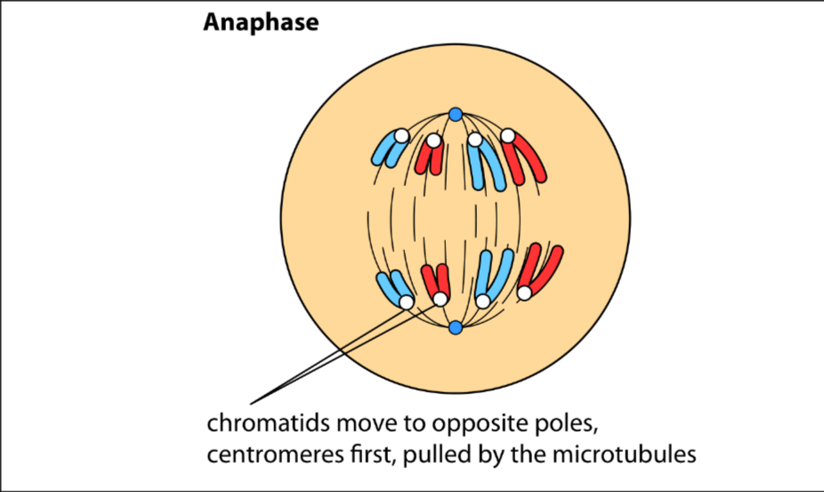

##### Telophase

在这个阶段中，染色体都重新coil在了一起，导致无法分辨单独的染色体。

*This is the reverse phase of prophase.*

- Chromatids uncoil into chromatin
- Remains of spindle are breaking down
- Nuclear envelope and nucleolus form

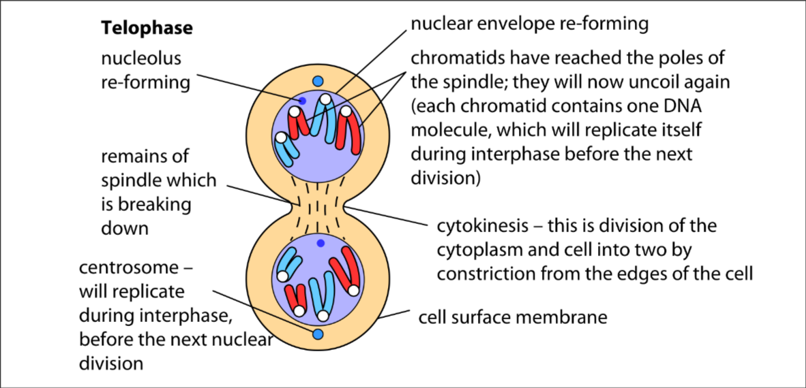

#### Cytokinesis

分裂成两个细胞

- Once the nucleus has divided into **two genetically identical nuclei**, the whole cell divides and one nucleus moves into each cell to create two genetically identical daughter cells
- In animal cells, cytokinesis involves **constriction of the cytoplasm** between the two nuclei and in plant cells a new cell wall is formed

Animal Cells:

- Cytoplasm divides into 2 new daughter cells by **constriction**, from edges of the parential cell.

Plant Cells:

- **Cell plate** forms at equator
- New cell wall forms **between** 2 daughter cells
- Cytoplasm divides into 2 cells

*Telophase and cytokinesis often overlap. 这两个阶段通常在一起发生。*

### Chromosome

Chromosomes are made of one very long, **condensed DNA molecule** associated with proteins.

The length DNA molecule is very long, so **histones** are used to **organise** and **condense** the DNA tightly and fits into the nucleus.

> histone是用来把DNA黏合起来的东西

The tightly coiled combination of DNA and proteins is called chromatin.

During $ S $ phase, the DNA replicates to create two identical strands of DNA called **chromatids**, joined together by a narrow region called the **centromere**.

DNA先被打包成紧凑的chromatin存放在细胞核中；在细胞分裂时，DNA会被打包成两个一样的chromatid，两个chromatid通过centromere连接在一起，形成chromosome。

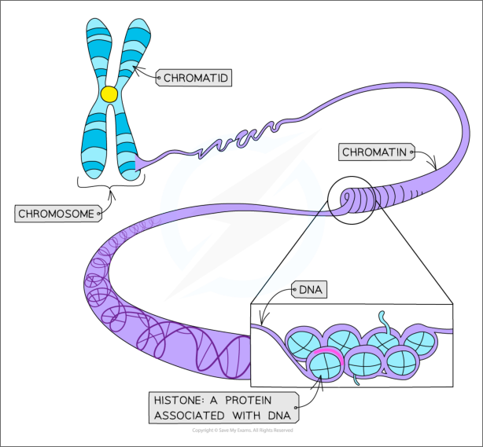

#### Telomere 端粒

- The chromosome before replication has 2 telomeres, and the chromosome after replication has 4.

- Telomeres are made of DNA with **short base sequences repeated many times**.

- Telomeres **get shorter** after each DNA replication.

  > This may be one of the mechanisms of aging. 端粒越来越短可能是导致老化的原因之一。

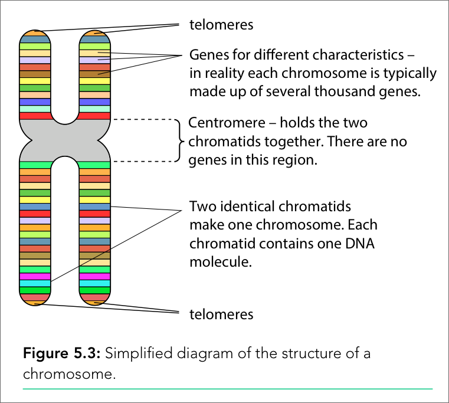

Functions:

- Telomere can **prevent the loss of genes** from the ends of chromosomes during DNA replication
- To allow **continued DNA replication** and cell division.

**Telomerase** can <u>add bases to telomere</u> to prevent telomeres fron getting shorter. But it's NOT active in most human body cells.

> In the zygote, telomerase is active so it can maintain a long telomere at the end of chromosome.

#### Chromatid - 染色单体

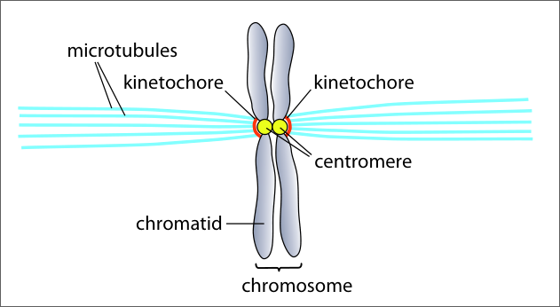

Functions of **centromere**:

- **Hold** two sister chromatids together
- The **site of arrachement** fo spindle microtubules

Function of **kinetochore**:

- Connect centromere to the microtubules

### Stem Cell 干细胞

A stem cell is an undifferentiated cell 未分化细胞 that can divide by **mitosis continually**.

Each time, a stem cell divides to produce 2 new **genetically identically** cells which can retain function. One of the new cell can divide and the other one **differentiates 分化 into a specialised cell**.

**Potency 分化潜能** - The ability of stem cells to differentiate into more specialised cell types.

- **Totipotent stem cells** - these stem cells can differentiate into <u>any cell type</u> (inclluding any cells that make up the embryo or placenta)
- **Pluripotent embryonic stem cells** - these stem cells can differentiate into any cell type in the developing embryo <u>but not into cells that make up the placenta</u>.
- **Multipotent adult stem cells** - these stem cells can differentiate into <u>a limited range of cell types</u>.

> [!NOTE]
>
> Explain why stem cells are important in tissue repair?
>
> - The cell cycle continuous / continually divide
> - The produced cells can differentiate
> - The produced cells can retain the same function

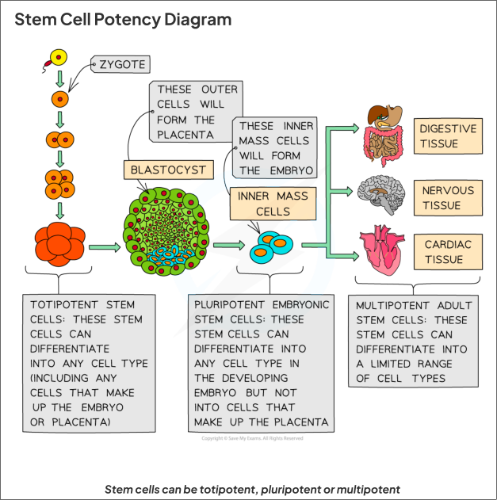

### Cancerous Cells

**Cancerous cell** can divide by motisis continually in an **uncontrolled** way. An **irregular / abnormal mass of cells** will form, which is a tumour 肿瘤.

1. Cancers start when random mutations in genes controlling cell division **initiate uncontrolled mitosis**.

2. For example, proto-oncogene 原癌基因 is **mutated to oncogenes** 致癌基因, tumour suppressor gene is mutated and switched off.

   > **Proto-oncogene** is the normal cell, but if it mutates to oncogene, is becomes cancerous cell.
   >
   > 原癌基因所指的是**正常的细胞**

3. Cancerous cells **don't enter programmed cell death**, don't respond to signals of controlling mitosis to stop dividing and have shorter interphase and rapid DNA replication. There is no contact inhibition. They lose specialisation. Cells do not function.

**Mutagen 突变剂** - Physical and chemical agents that cause gene mutation:

- Ionising radiation (X-rays, Gramma rays)
- UV light
- free radicals 自由基
- **chemical carcinogens** 致癌物 (tar, tobacco smoking)
- virus (HIV)
- obesity 肥胖

There are two types of tumors:

- Benign tumour 良性肿瘤 - **do not spread to other sites** of the body to invade and destroy other tissues, **do not cause cancer**
- Malignang tumour 恶性肿瘤 - **spread to other sites** og the body to invade and destroy other tissues, **cause cancer**

### SUMMARY

**Chromosomes** are made of ***chromatin***. Chromatin consists mainly of <u>DNA wrapped around basic protein molecules called histones</u>.

During nuclear division, chromosomes become visible and are seen to consist of **two chromatids** held together by a ***centromere***. Each chromatid contains <u>one DNA molecule</u>.

**Growth** of a multicellular organism is a result of *cells dividing to produce genetically identical daughter cells*.

During **cell division**, the *nucleus divides first*, followed by division of the whole cell. Division of a nucleus to produce two genetically identical nuclei is achieved by the process of ***mitosis***. Mitosis is divided into <u>four phases</u>: **prophase, metaphase, anaphase and telophase**.

Mitosis is used in **growth, repair, asexual reproduction** and <u>cloning of cells during an immune response</u>.

The period from one cell division to the next is called the ***cell cycle***. It has <u>four phases</u>: **\( G_1 \)** is the *first growth phase* after cell division; **\( S \) phase** is when the <u>DNA replicates</u>; **\( G_2 \)** is a *second growth phase*; **\( M \) phase** is when <u>nuclear division</u> takes place (followed by cell division).

The **ends of chromosomes** are capped with special regions of DNA known as ***telomeres***. Telomeres are needed to *prevent the loss of genes from the ends of chromosomes* during replication of DNA.

Many *specialised cells lose the ability to divide*, but certain cells known as ***stem cells*** retain this ability. Stem cells are <u>essential for growth from zygote to adult and for cell replacement and tissue repair</u> in the adult.

The **behaviour of chromosomes during mitosis** can be observed in *stained preparations of root tips*, either in section or in squashes of whole root tips.

**Cancers** are *tumours resulting from repeated and uncontrolled mitosis*. They are thought to start as the result of <u>mutation</u>.

## Chapter 6 - Gene

### Chapter Outline

- **DNA and RNA** - 主要的遗传物质，负责传递遗传信息
- **Structure of nucleotides** - Consists of a **pentose sugar**, a **phosphate group**, and a **nitrogenous base**
- **ATP** - 用于储存能量
- **Semi-conservation DNA Replication** - The process that used to make copies of DNA
  - **DNA polymerase**
  - **DNA ligase**
  - **helicase**
  - **Leading strand** and **Lagging strand**

- **Transcription** - DNA → RNA
- **Translation** - mRNA → Proteins

### Nucleic Acid

There are two types of nucleic acids:

- DNA - Deoxyribonucleic acid, made of **2 polynucleotide** chains / strands
- RNA - Ribonucleic acid, made of **1 polynucleotide** chain / strand

> 因为DNA中含有deoxyribose，所以被命名为Deoxyribonucleic acid，而RNA也是同理。

They are **macromolecules** made of many **repeating subunits** (**nucleotides**) joining together into a chian by **condensation**.

Nucleotides are the monomers of DNA and RNA

#### Nucleotide

A nucleotide consists of:

- A **phosphate group** - negatively charges in solution, make DNA / RNA negatively charged
- A **pentose sugar** - 5 carbon sugar
  - ribose in RNA nucleotide
  - deoxyribose in DNA nucleotide

- A **nitrogenous** / **nitrogen containing base**

  > [!IMPORTANT]
  >
  > 上面必须要提到**base**！！！

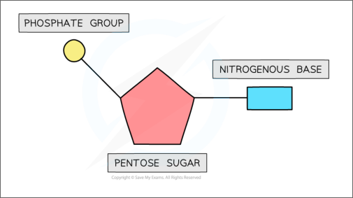

Bases in DNA and RND:

- DNA - A, **T**, C, G
- RNA - A, **U**, C, G

> 这些bases位于nucleotide的nitrogenous base的部分。
>
> T和U的结构非常相似，他们之间的区别就在于T比U多一个$CH_3$的部分。
>
> 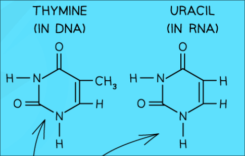

> [!IMPORTANT]
>
> 必须要会背这些全称：
>
> - **adenine**
> - **thymine** and **uracil**
> - **cytosine**
> - **guanine**

Ribose and Deoxyribose

- 右下角**含有**氧原子的 - ribose
- 右下角**没有**氧原子的 - Deoxyribose

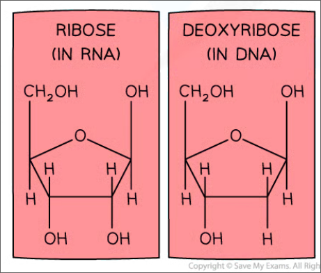

#### ATP

**Adenosine triphosphate** (ATP) is the energy-carrying molecule that provides the energy to drive many processes inside living cells.

It's also a type of **nucleotide**, hence it has similar structure to the nucleotides that make up DNA and RNA.

ATP molecule is a **phosphorylated RNA nucleotide**:

- one ribose
- one adenine
- **3 phosphate grops**

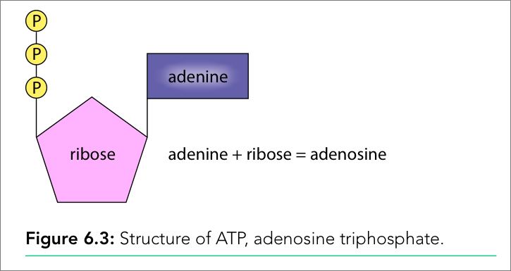

> Hydrolysis of ATP:
>
> 1. add water
> 2. water molecule can break down the bond between phosphate groups
> 3. the energy is released
>
> $$
> \ce{ATP -> ADP + P_i}
> $$
>
> $P_i$ is a single phosphate molecule: $H_3PO_4$

It is a **phosphorylated nucleotide**.

It can combine with varies number of phosphate groups:

1. adenosine monophosphate (AMP)
2. adenosine diphosphate (ADP)
3. adenosine triphosphate (ATP)

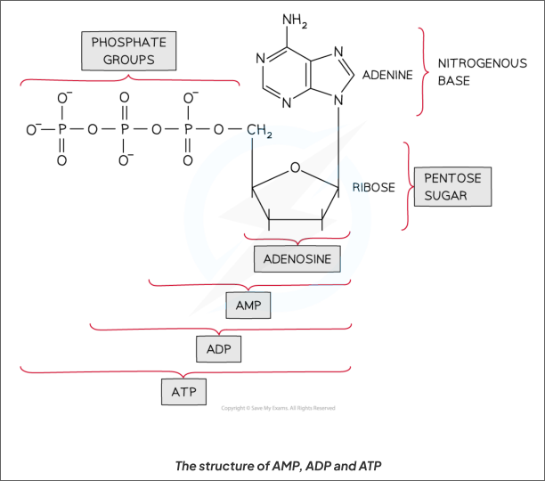

#### Purines and Pyrimidines

**Purines** and **pyrimidines** are two different types of structure that formed by the **nitrogenous base** molecules:

1. Pyrimidines (**single**-ring structure) - **cytosine**, **thymine**, **uracil**

2. Purines (**double**-ring structure) - **adenine** and **guanine**

> 记忆口诀：
>
> 1. Y 的读音像one，所以p**y**rimidines是一个环的结构
> 2. Purines - **P**ure **A**s **G**lod”，然后剩下的都是pyrimidine
> 3. **A** 和 **G** 是特殊的，所以它们有**两个环**，其他的三个都只有一个环

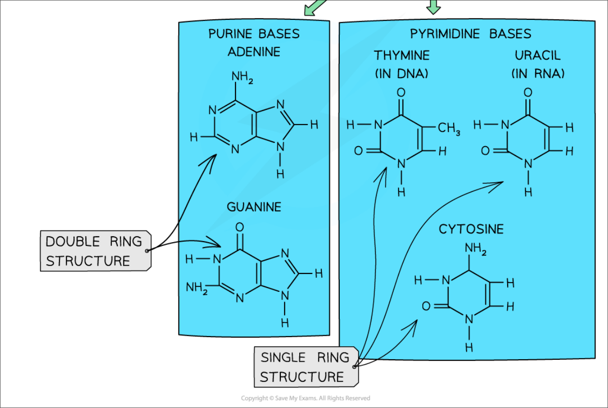

Purines have two rings and pyrimidines have one, purine normally pairs with pyrimidine to **maintain DNA double strand width**, if not, DNA double helix width will be **distorted** 变形扭曲.

#### DNA Structure

DNA is **double stranded** and a **double helix**.

Purine normally pairs / bonds with pyrimidine, so a DNA molecule h3as the **same width throughout**.

- `A` pairs with `T`/`U` by **2 hydrogen bonds**
- `G` pairs with `C` by **3 hydrogen bonds**

> AT立场和CG动效（AT互相连接，GC互相连接）

*This is called **complementary base pairing**.*

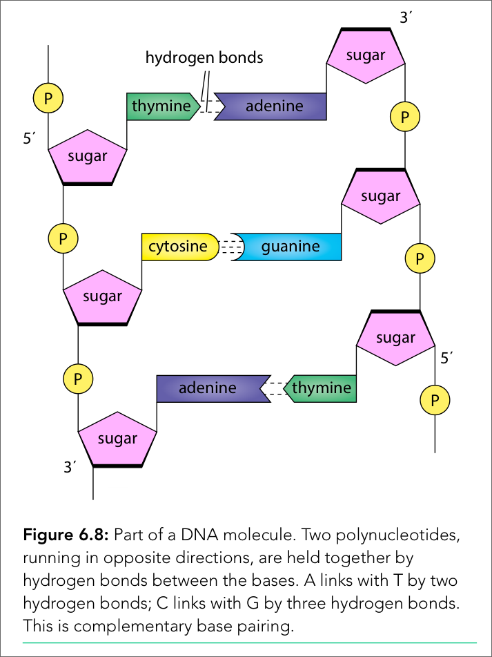

> 这个左边DNA single strand的顺序是`5'`到`3'`的，而另一边正好相反，所以说DNA两边是：**antiparallel strands** 相反平行链。
>
> `5'`到`3'`表示的是：从pentose最右边的碳原子按顺时针的方向开始算，第三个或第三个碳原子与下一个nucleotide相连。

DNA两侧的结构叫做**sugar-phosphate backbone**, sugar和phosphate之间的bond叫做**phosphodiester bond** (<u>phospho</u> - <u>di - ester</u>)

DNA中的两个螺旋通过hydrogen bond连接。

#### RNA Structure

- Single stranded

There are three types of RNA incolved in proteins synthesis:

1. mRNA, messenger RNA - encodes protein, it can move out the nucleus and go into the cytoplasm
2. tRNA, transfer RNA - carries amino acid
3. rRNA, ribosomal RNA - forms the sibosome

##### mRNA

| Feature               | mRNA                                                    | DNA                                                                           |
| :-------------------- | :------------------------------------------------------ | :---------------------------------------------------------------------------- |
| **Strandedness**      | One strand / Single-stranded / One polynucleotide chain | Two strands / Double-stranded / Two polynucleotide chains; **A** double helix |
| **Base Pairing**      | RNA, bases not paired / base pairing not present        | DNA base pairing present                                                      |
| **Sugar**             | Ribose                                                  | Deoxyribose                                                                   |
| **Nitrogenous Bases** | Uracil, (Adenine, Cytosine, Guanine)                    | Thymine, (Adenine, Cytosine, Guanine)                                         |
| **Length**            | Shorter / Fewer nucleotides                             | Longer / More nucleotides                                                     |

##### tRNA

A single stranded tRNA molecule folded into a clover-leaf shape 四叶草的形状

- One **amino acid attachment site**

- **anticodon** - sequence of 3 unpaired bases on tRNA that is complementary to and binds with the codon on mRNA which codes for the amino acid carried by the tRNA

  三个未形成对的碱基形成一个anticodon

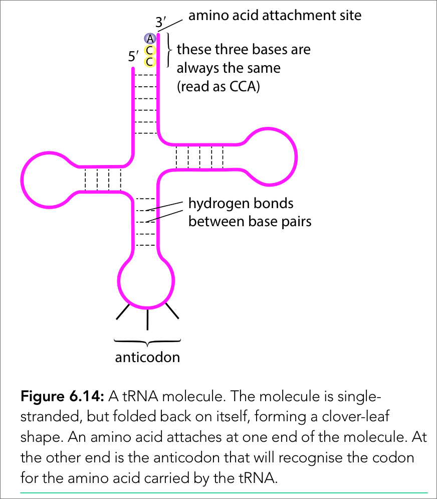

> Anticodon和mRNA上的一个codon是complementary的。

##### rRNA

*Ribosome is made of rRNA and protein.*

Ribosome has a large subunit and a small subunit.

rRNA is synthesized by copying genetiv information of chromosomes at **nucleolus** where ribosomes are made.

> Nucleolus是细胞核中颜色很深的部分，这个部分的染色体会用于制作rRNA。

### Semi-conservative DNA replication

- Occur in the nucleus during S phase of interpase
- Require ATP
- Random gene mutations might occur during replication

Enzymes needed:

- **Helicase** - **Unwind** DNA double helix and break $H$ bonds between base pairs to seperate DNA strands
- **DNA Polymerase**
  - To synthesis a **new complementary strand** of DNA (in the 5' to 3' direction) along each template
  - To catalyse the formation of **phosphodiester bond**
  - Has the **proofreading ability** that can correct DNA (proofread DNA)
- **DNA ligase**
  - To join **Okazaki fragments** together
  - To catalyse the formation of **phosphodiester bond**

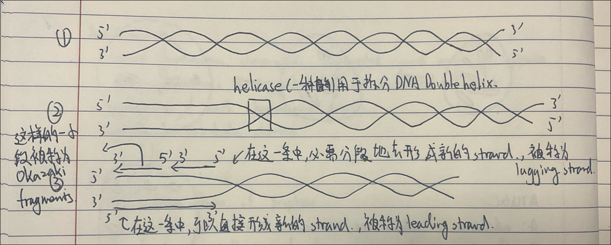

**Semi-conservative** DNA replication:

1. DNA double helix **unwinds** and hydrogen bonds between base pairs break by **helicase**.
2. Both strands are used as templates
3. Alone each template, **DNA polymerase** catalyses the formation of a new **complementary** DNA strand in a **`5'` to `3'` direction.**
4. **DNA polymerase** adds complementary, activated nucleotides **step by step**, following complementary base pairing
5. Process **continues** along whole DNA molecule.
6. DNA polymerase catalyses the formation of **phosphodiester bond** between nucleotides and has a **proofreading ability**.
7. The new strand growing continuously is called **leading strand**, The other new strand which cannot be made in a continuous way is called **lagging strand**. Those short fragments are called **Okazaki fragments**.
8. **DNA ligase joins Okazaki fragments on laggin strand**, it catalyses the formation of phosphodiester bonds, between the fragments
9. Replication is **semi-conservative**. *Each new DNA molecule is made of one old strand and one new strand.*

> DNA的**半保留复制**过程如下：
>
> 1. **起始与解旋**：首先，DNA双螺旋结构在**解旋酶**的作用下被解开，双链之间的氢键断裂，形成一个称为"复制叉"的Y形结构。
> 2. **模板准备**：解开的两条母链现在都作为合成新链的**模板**。
> 3. **链的合成**：**DNA聚合酶**开始工作，根据**碱基互补配对**原则（A配T，G配C），将新的核苷酸添加到生长中的链上。新链的合成**方向永远是5'到3'**。
> 4. **两条链的不同合成方式**：
>     - **前导链**：它的合成方向与复制叉移动的方向一致，因此可以**连续地**被合成。
>     - **后随链**：它的合成方向与复制叉移动的方向相反，因此只能**不连续地**合成，形成一系列短的**冈崎片段**。
> 5. **校对与连接**：
>     - DNA聚合酶在合成过程中具有**校对**功能，可以及时发现并纠正错误，保证复制的准确性。
>     - 在后随链上，**DNA连接酶**会像"胶水"一样，将所有的**冈崎片段**连接起来，形成一条完整的DNA链。
> 6. **完成**：复制完成后，得到两个完全相同的DNA分子。每个新DNA分子都包含一条旧的母链和一条全新的子链，这完美地诠释了**半保留复制**的含义。

#### Meselson & Stahl's Experiment

- Carried in 1958
- Using bacteria E.coli and different nitrogen isotopes

Procedure:

1. Grow E.coli with **nitrogen-15** for many generations - *Result: All DNA is heavy*
2. Transfer to a medium with **nitrogen-14** and allow E.coli to divide to produce 1 generation

   **\*Result**: All DNA is a Hybrid of **1 heavy strand** and **1 light strand\***

3. Repeat for 2 more generations and observe DNA

> Use centrifuge to seperate the DNA with different weight

#### Key Terms

| Term                     | 中文              | Explanation                                                                                                                                                                       | 解释                                                                                            |
| :----------------------- | :---------------- | :-------------------------------------------------------------------------------------------------------------------------------------------------------------------------------- | :---------------------------------------------------------------------------------------------- |
| **Semi-conservative**    | **半保留复制**    | A model of DNA replication where each new DNA molecule is composed of one original (parental) strand and one newly synthesized strand.                                            | DNA复制的一种模式，每个新合成的DNA分子都由一条旧的（母链）模板链和一条新合成的链组成。          |
| **Helicase**             | **解旋酶**        | An enzyme that "unzips" the DNA double helix by breaking the hydrogen bonds between the complementary base pairs.                                                                 | 一种能够通过破坏互补碱基对之间的氢键来"解开"DNA双螺旋的酶。                                     |
| **DNA Polymerase**       | **DNA聚合酶**     | The key enzyme that builds the new DNA strand. It adds complementary nucleotides to the growing chain in the 5' to 3' direction and has proofreading ability to correct mistakes. | 构建新DNA链的关键酶。它以5'到3'的方向将互补核苷酸添加到生长中的链上，并具有校对能力以纠正错误。 |
| **Complementary**        | **互补**          | Refers to the specific pairing of nitrogenous bases: Adenine (A) with Thymine (T), and Guanine (G) with Cytosine (C).                                                             | 指碱基的特异性配对：腺嘌呤(A)与胸腺嘧啶(T)配对，鸟嘌呤(G)与胞嘧啶(C)配对。                      |
| **5' to 3' Direction**   | **5' 到 3' 方向** | The direction in which all new DNA strands are synthesized. DNA polymerase can only add new nucleotides to the 3' end of a growing strand.                                        | 所有新DNA链合成的方向。DNA聚合酶只能将新的核苷酸添加到生长中链的3'末端。                        |
| **Phosphodiester Bond**  | **磷酸二酯键**    | The strong covalent bond that forms the "sugar-phosphate backbone" of DNA, linking the sugar of one nucleotide to the phosphate of the next.                                      | 形成DNA"糖-磷酸骨架"的强共价键，将一个核苷酸的糖与下一个核苷酸的磷酸连接起来。                  |
| **Proofreading Ability** | **校对能力**      | A function of DNA polymerase that allows it to check and correct incorrectly paired nucleotides as it synthesizes the new strand, ensuring high fidelity.                         | DNA聚合酶的一种功能，使其在合成新链时能够检查并纠正错误配对的核苷酸，确保复制的高保真度。       |
| **Leading Strand**       | **前导链**        | The new DNA strand that is synthesized continuously in the 5' to 3' direction towards the replication fork.                                                                       | 以连续的方式，沿着5'到3'方向朝向复制叉合成的新DNA链。                                           |
| **Lagging Strand**       | **后随链/滞后链** | The new DNA strand that is synthesized discontinuously away from the replication fork, resulting in short segments called Okazaki fragments.                                      | 以不连续的方式，沿着5'到3'方向背离复制叉合成的新DNA链，因此形成一系列短的片段（冈崎片段）。     |
| **Okazaki Fragments**    | **冈崎片段**      | Short, newly synthesized DNA fragments on the lagging strand that are later joined together to form a continuous strand.                                                          | 在后随链上合成的一系列短的DNA片段，它们随后会被连接起来形成一条完整的链。                       |
| **DNA Ligase**           | **DNA连接酶**     | An enzyme that joins the Okazaki fragments on the lagging strand by catalyzing the formation of phosphodiester bonds between them.                                                | 一种通过催化形成磷酸二酯键，将后随链上的冈崎片段连接起来的酶。                                  |

### Protein Synthesis

DNA makes RNA, RNA makes protein.

#### Transcription

> Take place in the nucleus

1. A part of DNA molecule **unwinds**, this exposes the **gene** to be transcribed
2. A complementary copy of code is formed (mRNA)
   - The DNA triples of bases are transcribed as mRNA codons
   - 单链的mRNA可以通过细胞核上的小孔，但是双链的DNA不行

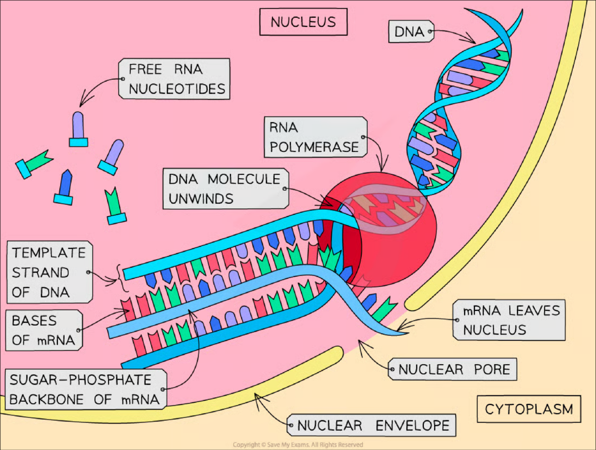

#### Translation

Translation发生的过程：

1. mRNA's two codons at a time are exposed to the larger subnuit (in ribosome)
2. A specific tRNA brings a specific amino acid (corresponding to the codon on mRNA)
3. Complementary base pairing occurs by hydrogen bonding
4. A second tRNA brings another aminoacid next to the first amino acid
5. Peptide bond formation between the two amino acids
6. Ribosome moves along the mRNA, one codon at a time (above process is repeated until a stop codon is reached)
7. The first tRNA leaves the ribosome

### Gene Mutations

**Gene Mutation** - is a change in the sequence of base pairs in a DNA molecule that may result in an altered polypeptide.

Mutations occur continuously, they may occur in serval ways:

- Insertion of nucleotides 多了
- Deletion of nucleotides 少了
- Substitution of nucleotides 用错了

## Chapter 7 - Plant Transportation

### Plant transport system

Plant's **vascular bundle** contains...

- **xylem**

- **phloem**

Attraction force between water molecules: cohesion and adhesion:

- **Cohesion** - 水分子和水分子之间的吸引力
- **Adhesion** - 水分子和其他物品之间的吸引力

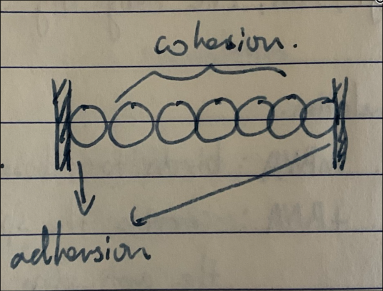

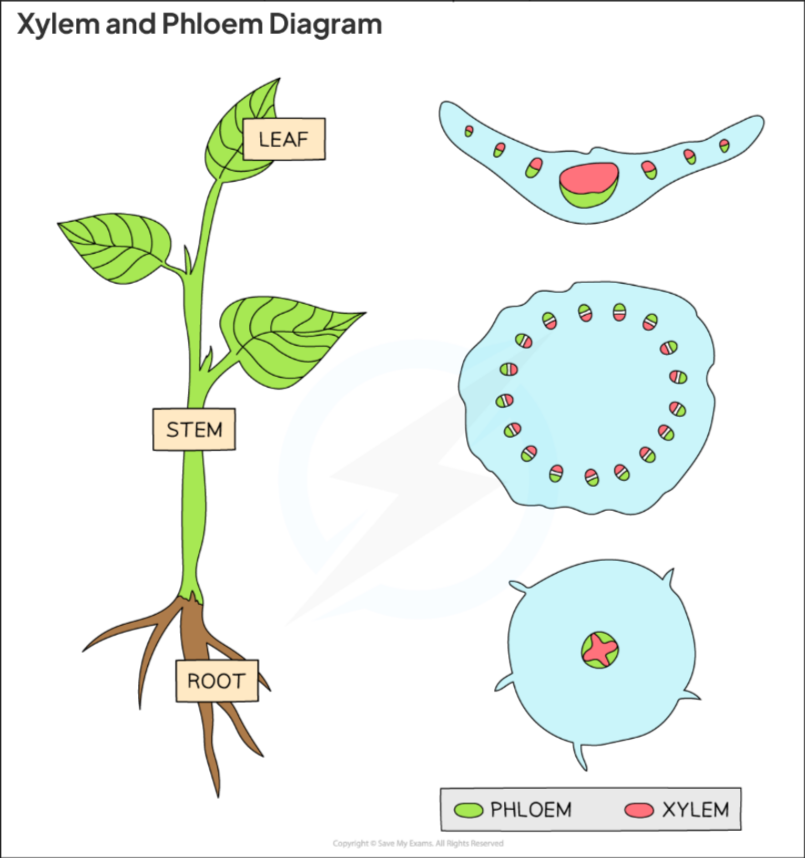

#### Xylem

Xylem takes the water upward, it also can:

- support
- transport water
- transport mineral

Xylem tissue is made of **xylem vessel elements** (cells), which are:

- elongated dead hollow cells

- no end walls

- cellulose and lignin cell walls

  > lignin is a hard, strong, and waterproof polymer

There are some **non-lignified pits** in wall allow **sideway movement of water** to other parts.

The narrow diameter of lumen between the continuous cells reinforces the effect of adhesion, which makes the transpiration more efficient.

**Pits** are origin from the plasmodesmata areas at original cell walls, they still have the original unthickened cellulose cell wall, instead of open pores.

Pits并不是开放的小孔，而是一层允许水分子穿过的cellulose。

**Structure and it's function:**

- No end walls:
  - Provide a continuous pathway for water moving upward
- Walls contain lignin:
  - Waterproofing
  - Support the plant's structure and prevent collapse
- Pits:
  - Allow the water's sideway movement
- Narrow diameter:
  - Adhesion

#### Phloem

Phloem is used to transport assimilates, which include sucrose and amino acids.

- Source - assimilate出发的地方
- Sink - assimilate到达的地方

**Structure of the sieve tube elements**

- Elongated living cells (no nucleus, ribosome and vacuole)
- A thin layer of cytoplasm lining inside of the wall
- The cell wall only contains cellulose, no lignin

**Structure of the phloem sieve tube**

- Sieve plates with sieve pores form at end walls
- Each sieve tube element has at least one companion cell beside it to form a single functional unit
- There are many plasmodesmata between sieve tube element and companion cell for communication
- Companion cells have nucleus, vacuole, many mitochondria and ribosomes (at rough ER)

**Structure and it's function:**

- Elongated cells with sieve plated and pores:
  - form a continuous sieve tube for transport
- Strong cellulose cell wall:
  - To withstand the hydrostatic pressure that move the assimilates and prevent excessive cell baling under the pressure

- No nucleus, vacuole and only thin layer of cytoplasm:
  - Maximise the space and reduce resistance for movement of assimilates.

### Water Uptake and Transpiration

Water pathway:

1. Soil
2. Epidermis in root and Cortex in root
3. Endodermis in root
4. Pericycle in root
5. Move in xylem in root, stem and leaf
6. Mesophyll cells in leaves
7. Air spaces in leaves
8. Stomata

Water eventually moves out of the plant, so the water potential at the end of the pathway is lower, when the water moves down the water potential gradient, the water moves upward.

#### 1. Transpiration

- Loss of **water vapour** by diffusion down its water potential gradient from air spaces of leaves to environment

- Mainly through **open stomata** which open during daytime and close at night

- Through cuticle (only a very small amount of water vapour)

- Can cool the leaves

#### 2. Water Evaporation

Liquid water evaporates from the surface of mesophyll cells to enter air spaces and replace the lost of water vapour by transpiration.

#### 3. Water Movement from xylem in leaf to mesophyll cells

- To replace the lost of water by evaporation **via pits**

- When the water stays in the cell walls - the apoplast pathway

- or enter the cytoplasm - the symplast pathway

#### 4. Tension and transpirational pull

1. Transpiration and evaporation of water lower the water potential at leaves, creating tension (a negative pressure) in the xylem.
2. Tension pulls water and minerals up the xylem by mass flow from root to stem the to leaf, as a continuous, unbroken column of water due to cohesion, adhesion and the narrow diameter of xylem vessels. This pulling effect is known as transpirational pull.
3. Leaves have a lower water potential and roots have a higher water potential. There is a water potential gradient between them.
4. Tension pulls xylem walls inwards. During the daytime, when stomata open, the diameter of a tree trunk decreases.
5. As tension increases in the xylem, the pressure becomes more negative.

#### 5. Water uptake

- Water moves into cells by osmosis
- Mineral ions are taken up into cells mainly by active transport

Root hair cells - **increase surface area** for absorption

#### Water Pathway

Water takes two routes down the water potential gradient through the epidermis and cortex:

1. **Apoplast pathway** 通过细胞壁之间的间隙传输
   - water doesn't cross membrane and doesn't enter the cytoplasm. Water enters the call wall
   - Water moves through the cells wall
   - Water can move from cell wall to the cell wall through the intercellular spaces
   - Water may move directly from cell wall to cell wall
2. **Symplast pathway** 在细胞里面传输
   - Water enters the cytoplasm by osmosis through the partially permeable cell surface membrane
   - Water moves into the sap in the vacuole, through the tonoplast by osmosis
   - Water may move from cell to cell through adjacent cell surface membranes and cell walls

##### Lignin and Suberin

They are both hydrophobic and partially impermeable to water. 它们都是疏水的，对水有部分的不通透性。

**Lignin: 木质素**

- Found in the cell walls of xylem vessel elements 在木质部的导管细胞壁中
- It can prevent the loss of water from xylem 防止水分从木质部中流失
- It can prevent the collapse of xylem vessel 防止导管塌陷
- It provides strength for structural support 为结构支撑提供强度

**Suberin: 木栓质**

- Found in Casparian strip / endodermis 存在于凯氏带/内皮层中
- Force the water move from apoplast pathway to symplast pathway 迫使水分从质外体途径进入共质体途径（从细胞外的通道进入细胞内的通道）
- It allows the control of solutes before entering xylem (prevent toxins entering the xylem vessel) 能在溶质进入木质部前对其进行调控（防止毒素进入导管）

##### Endodermis

Water takes one route through the **endodermis**, endodermis is...

- One cell thick
- Cells have cell walls containing Casparian strip, a thick, waterproof suberin band
- As endodermal cells get older, the suberin deposits become more extensive until, except passage cells, no water can enter the cells
- Minerals move across endodermis mainly by active transport in the symplast pathway. Plants control what mineral ions pass into xylem vessels in this way.

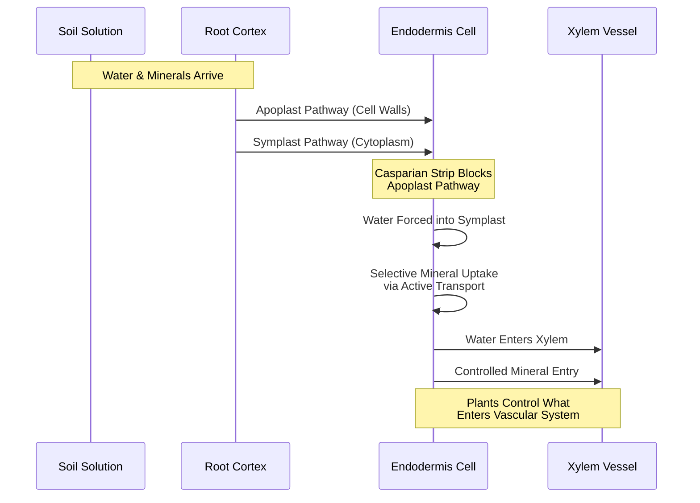
```mermaid
sequenceDiagram
    participant Soil as Soil Solution
    participant Cortex as Root Cortex
    participant Endo as Endodermis Cell
    participant Xylem as Xylem Vessel

    Note over Soil,Cortex: Water & Minerals Arrive

    Cortex->>Endo: Apoplast Pathway (Cell Walls)
    Cortex->>Endo: Symplast Pathway (Cytoplasm)

    Note over Endo: Casparian Strip Blocks<br/>Apoplast Pathway

    Endo->>Endo: Water Forced into Symplast
    Endo->>Endo: Selective Mineral Uptake<br/>via Active Transport

    Endo->>Xylem: Water Enters Xylem
    Endo->>Xylem: Controlled Mineral Entry

    Note over Endo,Xylem: Plants Control What<br/>Enters Vascular System
```

#### How the structure of xylem vessles is suited to their function

- Elongated dead hollow cells with no end walls and no cytoplasm
  - Joined end to end to form long hollow tubes for transport

### Active Loading and Translocation

1. Assimilate - organic compounds made by the plant itself.

2. Source - a site in plant which produces and provides assimilates.

3. Sink - a site in plant which needs, receives or stores assimilates for growth of for storage.

Assimilates and transported from sources to sinks in phloem. This process is called translocation.

#### Process of Translocation (Transport in Phloem)

1. Active loading at the source
   - Loads the assimilates into the phloem tube elements using ATP via **active transport**
   - Result in...

     > [!IMPORTANT]
     >
     > 1. **increment of the sucrose's concentration**
     > 2. **decrement in the water potential** in phloem sieve tubes
     > 3. increment in volume of sap in phloem sieve tubes

2. Hydrostatic pressure changes
   - Water enter the phloem tube element (because of the water potential gradient)
   - The hydrostatic pressure increases (source)

#### Active Loading of Sucrose

1. **Hydrogen ions (protons, H⁺)** are pumped out of the companion cell into the cell wall by a **proton pump** using ATP via **active transport**.
2. This creates a **higher concentration of H⁺ ions** in the cell wall.
3. The hydrogen ions move back into the companion cell by **passive facilitated diffusion** down their concentration gradient, through a **co-transporter protein** (a type of carrier protein).
4. The co-transporter protein **simultaneously transports sucrose molecules** into the companion cell, even **against** the sucrose concentration gradient.
5. Sucrose molecules then **diffuse through plasmodesmata** from the companion cell into the **sieve tube element**.

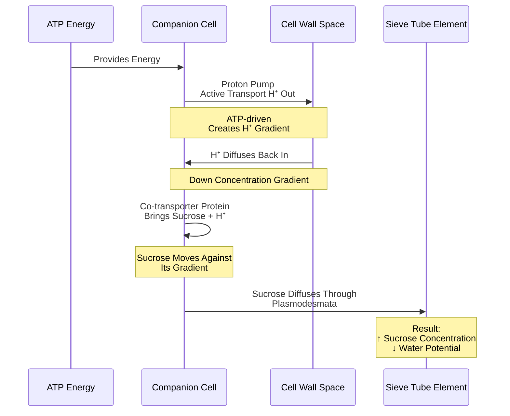
```mermaid
sequenceDiagram
    participant ATP as ATP Energy
    participant CC as Companion Cell
    participant Wall as Cell Wall Space
    participant ST as Sieve Tube Element

    ATP->>CC: Provides Energy
    CC->>Wall: Proton Pump<br/>Active Transport H⁺ Out
    Note over CC,Wall: ATP-driven<br/>Creates H⁺ Gradient

    Wall->>CC: H⁺ Diffuses Back In
    Note over Wall,CC: Down Concentration Gradient

    CC->>CC: Co-transporter Protein<br/>Brings Sucrose + H⁺
    Note over CC: Sucrose Moves Against<br/>Its Gradient

    CC->>ST: Sucrose Diffuses Through<br/>Plasmodesmata

    Note over ST: Result:<br/>↑ Sucrose Concentration<br/>↓ Water Potential
```

This is a mechanism in plants for loading sucrose into the sieve tubes of the phloem. It involves **energy expenditure (ATP)** and **proton co-transport**. It takes place in the **companion cells**.

这是植物韧皮部装载蔗糖到筛管的一种机制，涉及**能量消耗（ATP）** 和**质子共运输**。它发生在**伴随细胞**（companion cells）中。

> **Co-transporter protein** and **proton pump** are the **carrier proteins** on the cell surface membrane.

Hydrostatic pressure gradient between the source and the sink causes mass flow of phloem sap.

1. Active loading of sucrose into the sieve tube at the source greatly decreases the water potential in the tube. Therefore, water enters the sieve tube from nearby xylem down a water gradient by osmosis. This creates a hydrostatic pressure.
2. Unloading of sucrose from sieve tube into sink increases the water potential in the tube. Water moves out of sieve tube into nearby xylem down a water potential gradient by osmosis. This creates a low hydrostatic pressure.

Phloem sap can move upwards or downwards. But the movement is in one direction in one sieve tube at one time. 韧皮部中的细胞液可以向上移动或向下移动，但一次只能往一个方向移动。

### Xerophyte

The features of xerophytes:

- Long and extensive root
- Leaf is spiny / needle-like / small
- Rolled leaf
- hairs on the leaves
- Sunken stomata
- Multiple-layered epidermis
- Thick cuticle

### Experiments

Factor affecting transportation:

1. Humidity
2. Light intensity
3. Temperature
4. Wind speed

Potometer 蒸腾计

### Vocabulary Table

| Keyword                      | 中文       | 解释                                                                                |
| ---------------------------- | ---------- | ----------------------------------------------------------------------------------- |
| **Transpiration**            | 蒸腾作用   | 植物体内水分以水蒸气形式从叶片气孔或表皮扩散到大气中的过程。                        |
| **Water vapour**             | 水蒸气     | 水的气态形式，在蒸腾作用中从叶片散发到环境中。                                      |
| **Open stomata**             | 开放的气孔 | 叶片表面用于气体交换的小孔，白天开放以进行光合作用和蒸腾，夜晚关闭。                |
| **Evaporation**              | 蒸发       | 液态水从叶肉细胞表面转变为水蒸气进入细胞间隙的过程。                                |
| **Mesophyll cells**          | 叶肉细胞   | 叶片中进行光合作用的主要细胞，位于上下表皮之间。                                    |
| **Xylem**                    | 木质部     | 植物体内输送水分和无机盐的导管组织，由根向上延伸至叶。                              |
| **Pits**                     | 纹孔       | 木质部导管细胞壁上的小孔，允许水分横向进出导管。                                    |
| **Apoplast pathway**         | 质外体途径 | 水分通过细胞壁和细胞间隙运输，不穿过细胞膜。                                        |
| **Symplast pathway**         | 共质体途径 | 水分通过细胞间的胞间连丝和细胞质连续运输，穿过细胞膜。                              |
| **Tension**                  | 张力       | 蒸腾作用导致木质部内产生的负压，使水分向上被牵引。                                  |
| **Transpirational pull**     | 蒸腾拉力   | 因蒸腾作用产生的张力，使水分以连续水柱的形式从根向上被拉至叶片。                    |
| **Water potential gradient** | 水势梯度   | 水分从高水势区域向低水势区域移动的驱动梯度，如从根到叶。                            |
| **Cohesion**                 | 内聚力     | 水分子之间的相互吸引力，有助于维持木质部中水柱的连续性。                            |
| **Adhesion**                 | 附着力     | 水分子与木质部导管壁之间的吸引力，辅助水分向上运输。                                |
| **Osmosis**                  | 渗透作用   | 水分子通过半透膜从高水势区域向低水势区域的被动扩散过程。                            |
| **Active transport**         | 主动运输   | 细胞消耗能量（ATP）将物质（如矿物质）逆浓度梯度运输的过程。                         |
| **Root hair cells**          | 根毛细胞   | 根表皮细胞的突起，增加吸收表面积以吸收水分和矿物质。                                |
| **Endodermis**               | 内皮层     | 根皮层内侧的一层细胞，其细胞壁含有凯氏带，控制水分和矿物质进入中柱。                |
| **Casparian strip**          | 凯氏带     | 内皮层细胞壁上含木栓质（suberin）的防水带，迫使水分和矿物质通过共质体途径进入中柱。 |
| **Pericycle**                | 中柱鞘     | 内皮层内侧的一层细胞，可分裂产生侧根，也是水分进入木质部的通道之一。                |
| **Mass flow**                | 集流       | 水分在木质部中因压力差而整体移动的过程。                                            |
| **Tonoplast**                | 液泡膜     | 包围液泡的膜，控制水分和溶质进出液泡。                                              |
| **Passage cells**            | 通道细胞   | 内皮层中保留较薄细胞壁的细胞，允许水分和矿物质通过。                                |
| **Suberin**                  | 木栓质     | 一种防水脂质，沉积在凯氏带中，阻止水分通过质外体途径通过内皮层。                    |

## Chapter 8 - Transport in Mammals

### Chapter Outline

- Transport systems in mammals
- The mammalian circulatory system
- Blood vessels
  - Arteries and arterioles
  - Capillaries
  - Veins and venules
  - Blood pressure in the circulatory system
- Tissue fluid
- Blood
  - Red blood cells
  - White blood cells
  - Haemoglobin
    - The haemoglobin dissociation curve
      - The S-shaped curve
      - The Bohr shift
      - The chloride shift
    - Carbon dioxide transport
      - As hydrogencarbonate ions in the blood plasma
      - As dissolved carbon dioxide molecules in the blood plasma
      - As carbaminohaemoglobin
- The heart
  - The cardiac cycle
  - Control of hearbeat

### Key Terms

1. **Oxygenated blood** - 含氧血 / 动脉血

   Blood that is rich in oxygen and typically bright red in color.

   富含氧气、通常呈鲜红色的血液。

2. **Deoxygenated blood** - 缺氧血 / 静脉血

   Blood that is low in oxygen and typically dark red in color.

   含氧量低、通常呈暗红色的血液。

3. **Right atrium** - 右心房

   The upper right chamber of the heart that receives deoxygenated blood from the body.

   心脏的右上腔室，接收来自身体的缺氧血。

4. **Left atrium** - 左心房

   The upper left chamber of the heart that receives oxygenated blood from the lungs.

   心脏的左上腔室，接收来自肺部的含氧血。

5. **Right ventricle** - 右心室

   The lower right chamber of the heart that pumps deoxygenated blood to the lungs.

   心脏的右下腔室，将缺氧血泵送到肺部。

6. **Left ventricle** - 左心室

   The lower left chamber of the heart that pumps oxygenated blood to the body.

   心脏的左下腔室，将含氧血泵送到全身。

7. **Septum** - 中隔

   The wall of muscle that separates the left and right sides of the heart.

   分隔心脏左右两侧的肌肉壁。

8. **Vena cava** - 腔静脉

   The large vein that carries deoxygenated blood from the body to the right atrium.

   将身体缺氧血输送回右心房的大静脉。

9. **Aorta** - 主动脉

   The largest artery that carries oxygenated blood from the left ventricle to the body.

   将左心室的含氧血输送至全身的最大动脉。

10. **Pulmonary artery** - 肺动脉

    The artery that carries deoxygenated blood from the right ventricle to the lungs.

    将右心室的缺氧血输送至肺部的动脉。

11. **Pulmonary vein** - 肺静脉

    The vein that carries oxygenated blood from the lungs to the left atrium.

    将肺部的含氧血输送至左心房的静脉。

12. **Semi-lunar valve** - 半月瓣

    A type of heart valve that prevents blood from flowing back into the ventricles.

    一种防止血液回流至心室的心脏瓣膜。

13. **Pulmonary valve** - 肺动脉瓣

    The semi-lunar valve located between the right ventricle and the pulmonary artery.

    位于右心室和肺动脉之间的半月瓣。

14. **Aortic valve** - 主动脉瓣

    The semi-lunar valve located between the left ventricle and the aorta.

    位于左心室和主动脉之间的半月瓣。

15. **Atrioventricular valve** - 房室瓣

    A type of heart valve that separates the atria from the ventricles.

    一种分隔心房和心室的心脏瓣膜。

16. **Tricuspid valve** - 三尖瓣

    The atrioventricular valve between the right atrium and right ventricle.

    位于右心房和右心室之间的房室瓣。

17. **Bicuspid valve** - 二尖瓣

    The atrioventricular valve between the left atrium and left ventricle.

    位于左心房和左心室之间的房室瓣。

18. **Blood flow to lungs** - 至肺部的血流路径

    Artery → arteriole → capillaries (around alveoli for gas exchange) → venule → vein

    动脉 → 小动脉 → 毛细血管（在肺泡周围进行气体交换）→ 小静脉 → 静脉

19. **Blood flow to body** - 至全身的血流路径

    Artery → arteriole → capillaries (delivering nutrients/O₂, removing waste) → venule → vein

    动脉 → 小动脉 → 毛细血管（输送营养/氧气，带走废物）→ 小静脉 → 静脉

20. **Pulmonary circulation** - 肺循环

    The part of the circulatory system that carries blood between the heart and the lungs.

    血液循环中负责心脏与肺部之间血液流通的部分。

21. **Systemic circulation** - 体循环

    The part of the circulatory system that carries blood between the heart and the rest of the body.

    血液循环中负责心脏与身体其他部分之间血液流通的部分。

### The Circulatory System

Mammalian circulatory system:

- In a narrower sense, also known as **cardiovasscular system**
- A **closed** **double** circulation
  1. Closed - blood **travels in blood vessels**
  2. Double circulation - blood **travels through the heart twice** on one complete circuit of the body
- Consist of **heart**, **blood**, and **blood vessels**

Circulatory system is needed for:

- **Reduce diffusion distance**, transport large amount of materials and is efficient

  用来帮助Diffusion

- Transport of nutrients and oxygen to all body cells and tissues

  运输营养物质

- Disposal of metabolic waste products, such as $CO_2$ and urea, out of body

  将废物带出身体

- Circulate WBCs (White Blood Cells) and antibodies throughout the body to infection or injury sites, assisting the immune system,

  免疫系统（运输白细胞和抗体）

### Heart

Heart is located at the left side of the body.

**Septum** separates the right side of heart with deoxygenated blood from left side with oxygenated blood, the functions:

- Separate the deoxygenated blood and oxygenated blood
- Prevent intervention of those types of blood

There are four chambers in heart:

- 2 atria
- 2 ventricles

There are four main blood vessels connect to heart (in the order of blood flow):

- Vena cava - 从身体进入心脏 - Tricuspid valve
- Pulmonary artery - 从心脏流入肺 - pulmonary valve
- Pulmonary vein - 从肺流入心脏 - bicuspid valve
- Aorta - 从心脏进入身体 - aortic valve

| 顺序 | Chamber         | Blood vessel     | 连接           | 对应的valve     | General valve name     |
| ---- | --------------- | ---------------- | -------------- | --------------- | ---------------------- |
| 1    | Right atrium    | Vena cava        | 从身体进入心脏 | Tricuspid valve | Atrioventricular valve |
| 2    | Right ventricle | Pulmonary artery | 从心脏流入肺   | pulmonary valve | Semi-lunar valve       |
| 3    | Left atrium     | Pulmonary vein   | 从肺流入心脏   | bicuspid valve  | Atrioventricular valve |
| 4    | Left ventricle  | Aorta            | 从心脏进入身体 | aortic valve    | Semi-lunar valve       |

> 可以通过*"try to be right"*这个memor来辅助记忆tricuspid valve在右边：`tri-` 开头的在右

**Cusp** 尖瓣 - To prevent the back flow of blood flow. 在valve上的结构，防止血液回流。

> [!NOTE]
>
> 在考试的时候可能要写到：“防止血液从***什么地方***流到***什么地方***。”

Oxygen diffuses into respiring body cells, become deoxygenated blood. 氧气在身体细胞中被消耗。

Thickness of the heart chambers (从细到粗):

1. **Atria** contract to pump blood into ventricles
2. **Right ventricle** contracts to pump blood into lungs
3. **Left ventricle** contracts to pump blood into the rest to body

> Left ventricle > Right ventricle > Atria (并不区分两个atria)

> [!NOTE]
>
> 当考试时要求，通过横切图，来分辨哪个chamber是哪个时，大多数都是要判断两个ventricle，的粗细程度：
>
> - 粗的那个是left ventricle
> - 细的那个是right ventricle

#### Addition Circulatory Systems

- *Open circulatory system* in insects 昆虫通过气体来交换物质
- *Closed single circulatory system* in fishes 鱼类通过鳃获得氧气

### Blood Vessels

Three types of blood vessels:

1. Artery
   - Take blood away from heart
   - Deliver oxygenated blood (except pulmonary artery)
2. Capillary
   - Link arteries with veins
   - Bring blood into close contact with body tissues
3. Vein
   - Bring blood to heart
   - Deliver deoxygenated blood (except pulmonary vein)

> Artery → arteriole 小动脉 → capillary → venule 小静脉 → vein

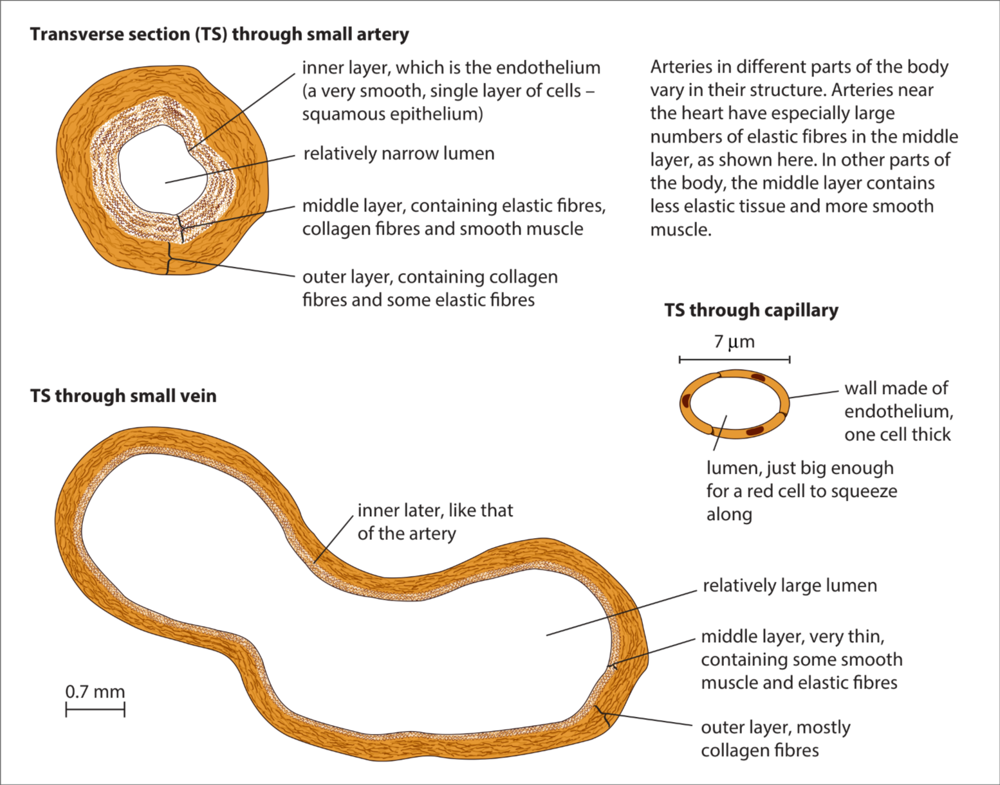

Vein has the largest lumen to transport the blood flow in a low pressure. Capillary has the smallest lumen to minimise the distance between the blood and the body tissues.

Only vein **has the valves** to prevent to blood flows in opposite direction.

The common layers of artery and vein:

- Inner layer: **endothelium** and elastic fibres

  > **Endothelium** - a single layer of squamous epithelium cells
  >
  > - very smooth, minimising friction with the moving blood.
  > - made of a layer of flat cells (**squamous epithelium**)
  >
  > **Functions:**
  >
  > - **Smooth surface** - reduces resistance and friction to blood flow 减少血液流动的阻力

- Middle layer: smooth muscle, collagen and elastic fibres

- Outer layer: elastic fibres and collagen fibres.

Capillary only consists of one layer of endothelium cells.

| Feature       | Artery | Capillary | Vein |
| ------------- | ------ | --------- | ---- |
| Smooth muscle | ✓      | ✕         | ✓    |
| Endothelium   | ✓      | ✓         | ✓    |
| Tunica media  | ✓      | ✕         | ✓    |

#### Artery (and arteriole)

**Structure**

- Inner layer: endothelium

- Middle layer: **collagen** fibres, **elastic** fibres and **smooth** muscle

  > 含有两种fibres和一种肌肉

- Outer layer: **collagen** fibres and **elastic** fibres

  > 含有两种fibres

> 用“**squamous**”这个词来描述endothelium layer：**squamous cells**

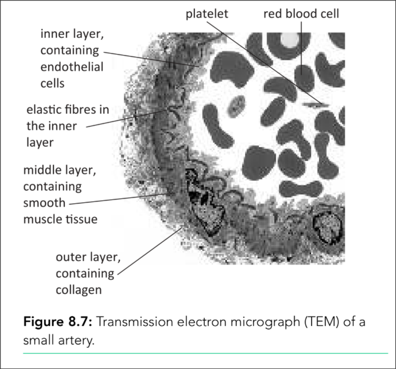

**Functions of artery:**

- **Thick wall** - withstand high blood pressure 高血压
- **Small lumen** - maintain high blood pressure 高血压
- **Elastic fibres** - stretch to accommodate surges in blood flow and recoil to maintain pressure 允许回弹以适应血流中的压力
- **Smooth muscle** - regulate blood flow 调解血流量
- **Collagen fibres** - prevent rupturing or bursting 防止破裂

When the smooth muscles contract:

- Artioles become narrow (vasoconstriction: *vaso_constriction*)
- Reduce blood flow

When the smooth muscle relax:

- Arterioles become wide (vasodilation: *vaso_dilation*)
- Increase blood flow

> con**strict**ion - 用来描述血管**粗细**
>
> con**tract**ion - 用来描述肌肉**收缩**

##### Muscular Artery

**远离**心脏的Artery有更多的muscle，所以叫做muscular artery。用来regulate the blood flow。

**Functions of muscular artery:**

- **Thicker tunica media (Middle layer)** - mainly smooth muscle, enables vasoconstriction and vasodilation 主要为平滑肌，实现血管收缩与舒张
- **Much less elastin** - cannot stretch and recoil like elastic arteries 无法很好地回弹
- **Narrow lumen** - blood flows under high pressure 维持高血压

##### Elastic Artery

**靠近**心脏的artery有更多的elastic fibre，所以叫做elastic artery，它可以在心脏跳动的时候**进行收缩**。

**Functions of elastic artery:**

- **Thinner tunica media (Middle layer)** - rich in elastin and collagen, allows stretching with each pulse 可以随着血流进行舒展
- **Few smooth muscle fibres** - *cannot* perform vasoconstriction or vasodilation 无法进行收缩
- **Narrow lumen** - blood flows under high pressure 维持高血压

#### Vein (and venule)

**Structure:**

- Inner layer: endothelium

- Middle layer: **elastic** fibre and **smooth** muscle

  > 和artery相比没有collagen fibre

- Outer layer: **collagen** fibres

  > 相当于把middle layer中的collagen fibre挪到outer layer了

**Functions of vein:**

- **One-way valves** - close to prevent the backflow of blood 防止血液到流
- **Lots of collagen** - provides strength and structure 支撑结构并且防止破裂
- **Thin wall** - Blood can be moved by contraction of surrounding muscles 可以通过收缩来推动血流
- **Large lumen** - reduces resistance for blood flow at low pressure 降低血液流动的阻力
- **Elastic fibres** - stretch to accommodate blood flow and recoil to maintain structure 用来维持弹性结构

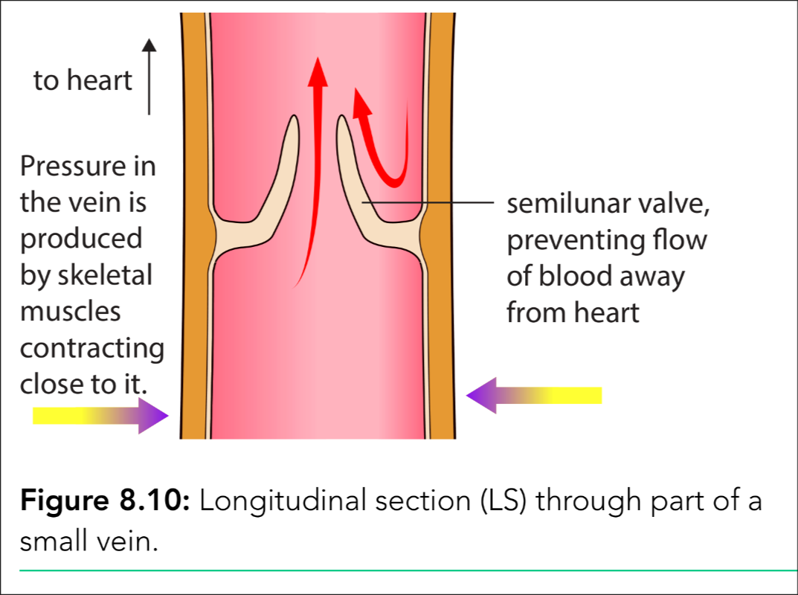

#### Capillary

Only consists of one layer of endothelium cells.

**Functions of capillary:**

- **Very small diameter** - slows blood flow, allowing more time for diffusion 减缓血流，为物质交换提供更多的时间
- **Branches between cells** - enables rapid diffusion of substances between blood and cells 实现血液与细胞间物质的快速扩散
- **Thin walls** - lack of muscle and elastic tissue allows quick diffusion 实现快速扩散

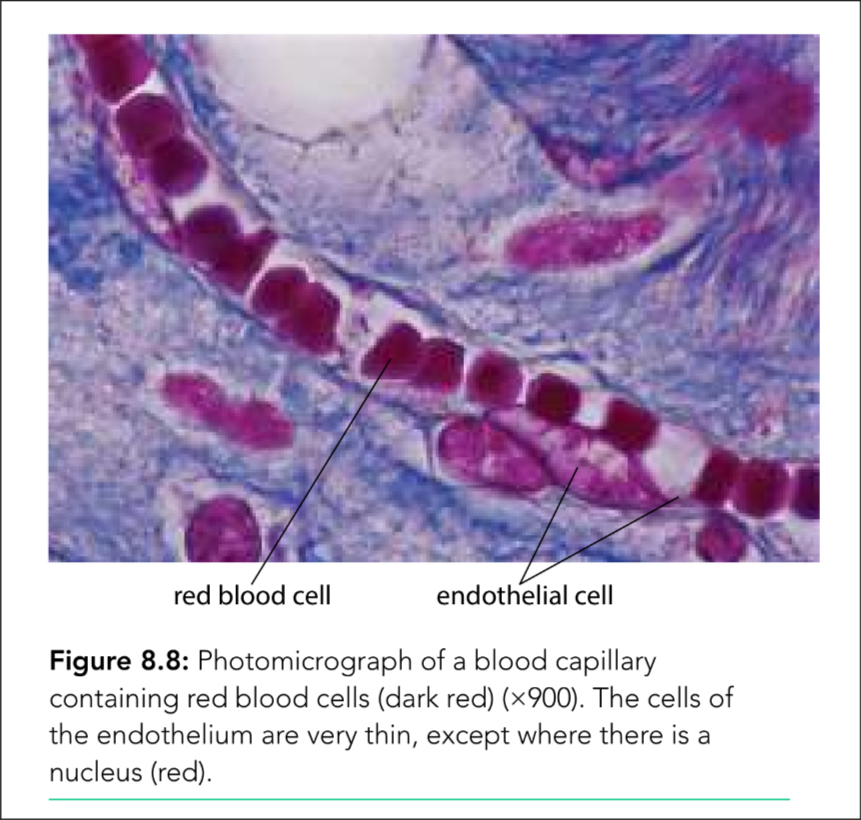

> Only one red blood cell can pass through the capillary at each time.

### Tissue Fluid

#### Keywords

1. **Plasma** - 血浆
2. **Red blood cell** - 红细胞
3. **White blood cell** - 白细胞
4. **Platelet** - 血小板
5. **Tissue fluid** - 组织液
6. **Antibody** - 抗体
7. **Urea** - 尿素
8. **Plasma protein** - 血浆蛋白
9. **Solvent** - 溶剂
10. **Solute** - 溶质
11. **Oedema** - 水肿
12. **Immune response** - 免疫反应
13. **Pathogen** - 病原体
14. **Blood clotting** - 血液凝固
15. **Haemoglobin** - 血红蛋白
16. **Biconcave** - 双凹的
17. **Monocyte** - 单核细胞
18. **Neutrophil** - 嗜中性粒细胞
19. **Lymphocyte** - 淋巴细胞
20. **Phagocyte** - 吞噬细胞
21. **Phagocytosis** - 吞噬作用
22. **Engulf** - 吞没
23. **Haem group** - 血红素
24. **Dissociation** - 解离
25. **Alveolus/Alveoli** - 肺泡
26. **Hydrostatic pressure** - 静水压

#### Introduction

> Blood is consist of...
>
> - **Plasma** - the liquid part
> - **Red blood cells**
> - **White blood cells**
> - **Platelets** - tiny cell fragments (they are not cells), help with blood coating

Tissue fluid is the **immediate environment** of body cells. 直接环境

It's the **medium for material exchange** between cells and blood. 交换物质

Formed by plasma leaking out of capillaries through gaps between the endothelial cells in the capillary walls. 由血浆通过毛细血管壁内皮细胞间的间隙渗出形成。

| Component      | Blood Plasma                                                  | Tissue Fluid                                                                                                                                     |
| :------------- | :------------------------------------------------------------ | :----------------------------------------------------------------------------------------------------------------------------------------------- |
| Water Content  | About 95% water                                               | **Almost identical composition** to blood plasma (water is the main component)                                                                   |
| Nutrients      | Contains nutrients (e.g. glucose)                             | Contains nutrients (similar to blood plasma)                                                                                                     |
| Waste Products | Contains waste products (e.g. CO₂, urea)                      | Contains waste products (similar to blood plasma)                                                                                                |
| Proteins/Cells | Contains plasma proteins (e.g. albumin, antibody, fibrinogen) | Contains far fewer plasma proteins (too large)<br>No red blood cells (too large) <br>Contains some white blood cells (can squeeze through walls) |

**Water Role:** Main component of blood and tissue fluid

- provides solvent properties (due to polarity)
- high specific heat capacity → thermal stability (maintain the constant blood temperature)

Compare to the blood plasma, tissue fluid...

- Contains far fewer plasma proteins 这个蛋白质太大了
- No red blood cells 红细胞太大了
- Only contains some white blood cells 白细胞的形状可以发生改变

#### Two opposing forces for formation of tissue fluid

At capillary level, **tissue fluid formation** is governed by two opposing forces:

1. **Hydrostatic Pressure Gradient** (blood pressure)

   > 把water从capillary中“推出”，进入到tissue fuild中

2. **Solute Concentration Gradient** (osmotic pressure, mainly due to plasma proteins)

   > 蛋白质等大分子会留在capillary中，并产生low water potential gradient，这个水势差会迫使water再重新流向capillary

| Capillary Region | Dominant Force                          | Fluid Movement                                     |
| :--------------- | :-------------------------------------- | :------------------------------------------------- |
| **Arterial End** | Hydrostatic pressure > Osmotic pressure | Fluid **moves out** of capillary into tissue space |
| **Venule End**   | Osmotic pressure > Hydrostatic pressure | Fluid **moves into** capillary from tissue space   |

| 位置       | 谁的力量更强？             | 结果：液体往哪走？                 | 简单比喻           |
| :--------- | :------------------------- | :--------------------------------- | :----------------- |
| **动脉端** | **静水压 (血压)** 胜出     | 液体**流出**毛细血管，进入组织间隙 | 高压水泵把水推出去 |
| **静脉端** | **渗透压 (蛋白吸力)** 胜出 | 液体**回流**进入毛细血管           | 海绵把水吸回来     |

- **血压的变化**：血液从动脉端流到静脉端，**血压会逐渐降低**。所以，在静脉端，“推”的力（血压）变小了。
- **蛋白的吸力不变**：血浆蛋白一直待在血管里，它们产生的“吸力”（渗透压）**从头到尾基本不变**。
- **力量对比的转变**：
  - 在动脉端：**高压** 战胜了 **蛋白吸力** → 液体流出。
  - 在静脉端：**血压变低**，**蛋白吸力** 相对更强 → 液体流回。

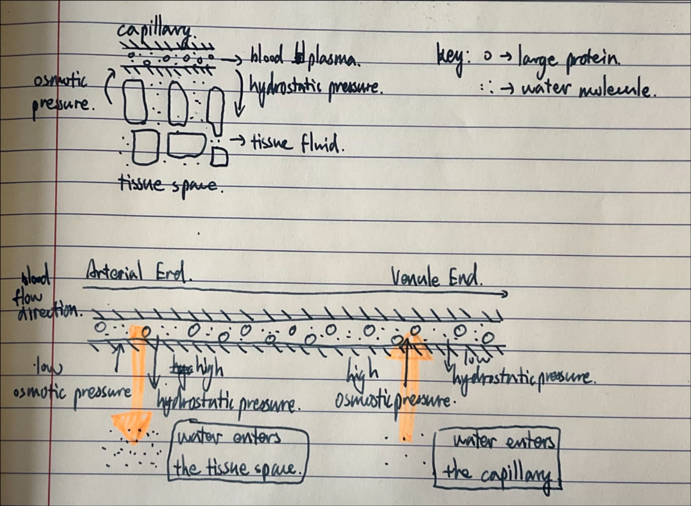

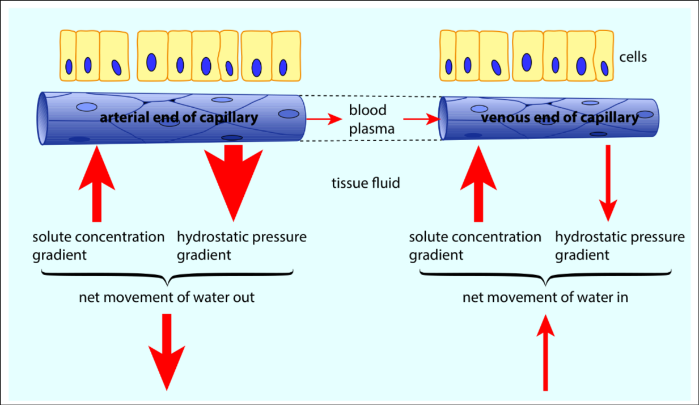

#### Oedema 水肿

Oedema refers to the **swelling** caused by excess fluid trapped in the body's tissues.

Normally, there is a balance between:

- Fluid **leaving** capillaries at the arterial end (due to **hydrostatic pressure / blood pressure**) 在动脉端，液体因**静水压/血压**作用**渗出**毛细血管
- Fluid **returning** to capillaries at the venule end (due to **osmotic pressure** from plasma proteins) 在静脉端，液体因血浆蛋白形成的**渗透压**作用**回流**至毛细血管

But if the balance breaks, the water will remain in the tissue spaces and cause oedema:

| Condition                     | Result                                                              |
| :---------------------------- | :------------------------------------------------------------------ |
| **Too high blood pressure**   | Forces **too much fluid** out of capillaries                        |
| **Too much fluid** in tissues | Fluid **cannot be fully reabsorbed** → accumulates in tissue spaces |
| **Accumulation**              | Causes swelling → **Oedema**                                        |

If blood / hydrostatic pressure is too high, too much fluid is forced out of the capillaries and may accumulate in the tissue. This causes **oedema**.

### Components of Blood

Blood is consist of...

- **Plasma** - the liquid part
- **Red blood cells**
- **White blood cells**
  - Lymphocyte
  - Phagocyte
- **Platelets** - tiny cell fragments (they are not cells), help with blood coating

#### Red Blood Cell

Red blood cells contain haemoglobin, a protein with a quaternary structure that contains haem iron groups which can bind reversibly to oxygen.

- Haemoglobin (red coloured) *in cytoplasm* for transporting $O_2$; 4 $O_2$ molecules at most by 1 haemoglobin molecule 血红蛋白一次性最多可以携带四个氧分子
- **Biconcave** shape, for short diffusion distance
- Diameter: 7 μm, High SA:V ratio
- No nucleus, membrane bound organelles 为了携带更多的血红蛋白，红细胞中没有细胞核以及任何然后细胞膜的细胞器

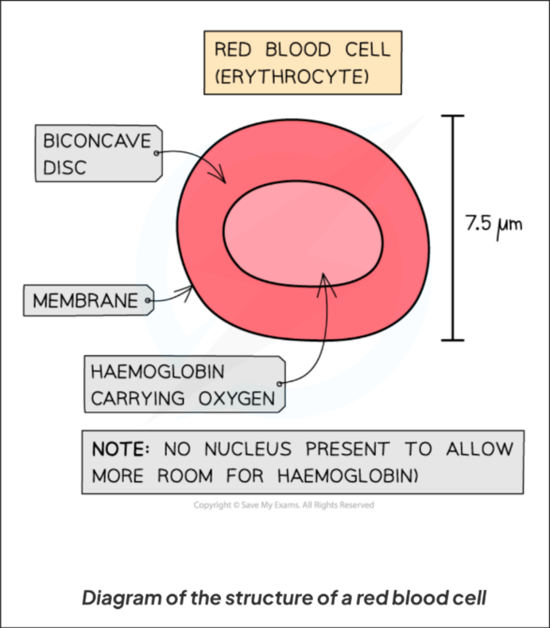

| Activity              | Possible in RBC? | Explanation                                                                            |
| --------------------- | ---------------- | -------------------------------------------------------------------------------------- |
| **Protein Synthesis** | No               | No DNA present, so mRNA cannot be transcribed.                                         |
| **Cell Division**     | No               | No chromosomes, so mitosis cannot occur. No centrosomes for spindle formation.         |
| **Lipid Synthesis**   | No               | Requires smooth endoplasmic reticulum (SER), which RBCs lack.                          |
| **Active Transport**  | Yes              | Occurs across the cell membrane; fueled by ATP produced through anaerobic respiration. |

#### White Blood Cell

There are two types of WBCs:

- **Phagocyte**
  - **monocyte** (macrophage) - has an **oval** / **kidney-shaped** nucleus
  - **neutrophil** - a **lobed nucleus**, **granular cytoplasm**
- **Lymphocyte** - a large round nucleus, little cytoplasm, smaller than phagocytes

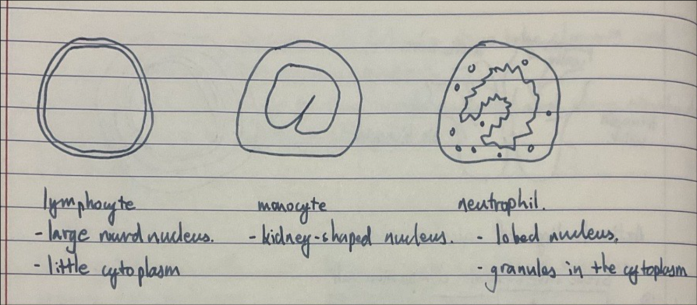

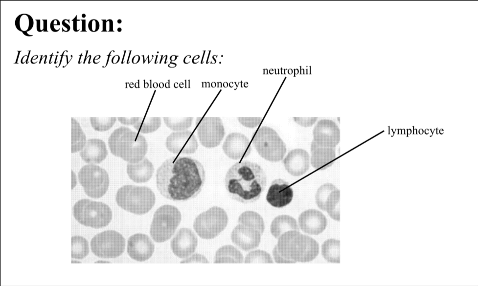

The roles of white blood cells:

- Mount immune responses to fight against pathogens
- **Monocyte** and **neutrophil** engulf bacteria and virus by **phagocytosis**
- B-lymphocyte involved in antibody production

> Phagocyte是近战攻击的：phagocytosis 吞噬病原体
>
> Lymphocyte是法术攻击的：antibody production 标记病原体

### Transport of Oxygen and Carbon Dioxide

Red blood cells are used to carry oxygen and carbon dioxide molecules.

- Each haemoglobin molecule in the cytoplasm contain 4 iron-containing haem groups
- A fully saturated haemoglobin molecule can combine with 4 $O_2$ molecules

$$
\ce{Hb + 4O2 -> HbO8}
$$

$$
\ce{haemoglobin + oxygen -> oxyhaemoglobin}
$$

The partial pressure can affect the precentage saturation of haemoglobin with oxygen.

血红蛋白（Hb）结合氧气的能力如何随环境中**氧气分压（pO₂）** 的变化而变化

> **Partial pressure 气体分压** - the pressure exerted by an individual gas in a mixture of gases. In a mixture of gases, each gas contributes to the total pressure, and the sum of these individual pressures is equal to the total pressure of the mixture.
>
> **Percentage saturation** - the degree to which the haemoglobin in the blood is combined with oxygen, calculated as a percentage of the maximum amount with which it can combine.

There are four chains in one haemoglobin molecule, each chain has one haem group and one amine end (terminal amine group), so each haemoglobin molecule can bind with four oxygen molecule or four carbon dioxide.

#### Oxygen

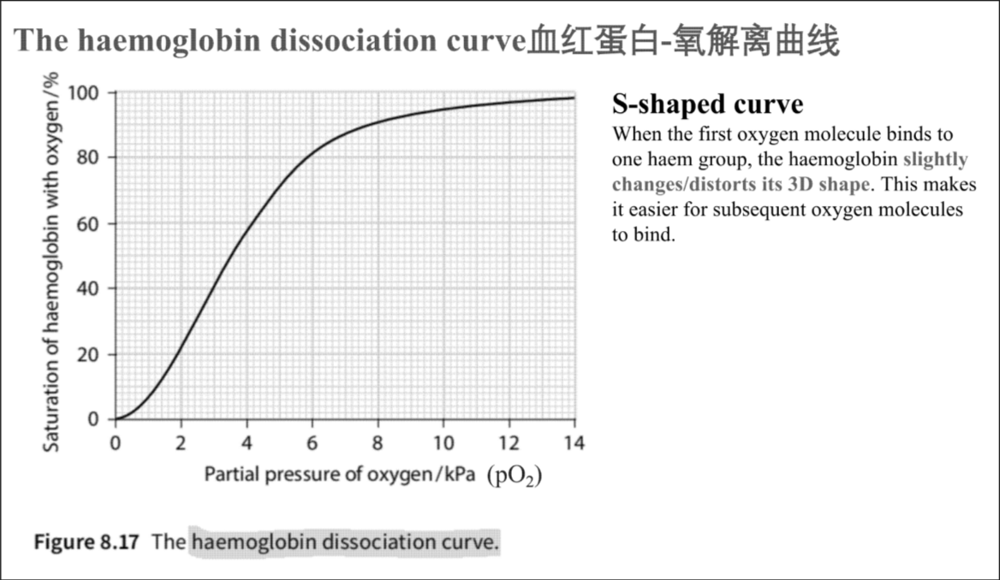

当第一个氧分子与haemoglobin结合时，haemoglobin会改变形状，使它更容易和其余的三个氧气分子结合。

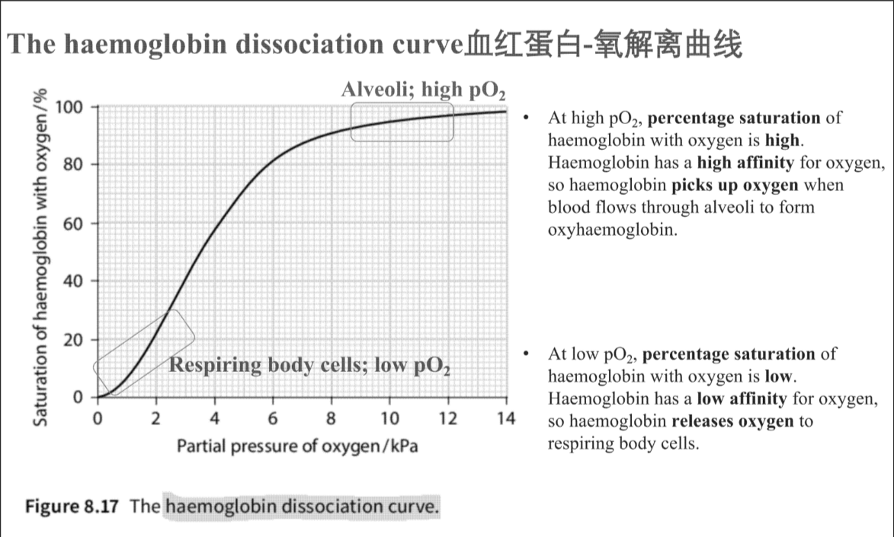

| Feature                     | At the Alveoli (High pO₂)                                                                            | At Respiring Tissues (Low pO₂)                                                                        |
| :-------------------------- | :--------------------------------------------------------------------------------------------------- | :---------------------------------------------------------------------------------------------------- |
| **Oxygen Partial Pressure** | High (~100 mmHg)                                                                                     | Low (~40 mmHg or lower)                                                                               |
| **Position on Curve**       | Upper plateau (flat part) of the curve                                                               | Steep part (middle/lower) of the curve                                                                |
| **Hb-O₂ Affinity**          | **High affinity** for oxygen                                                                         | **Low affinity** for oxygen                                                                           |
| **% Saturation of Hb**      | High (approaches 100%)                                                                               | Low (drops significantly)                                                                             |
| **Primary Action**          | **Loading / Picking up** oxygen                                                                      | **Unloading / Releasing** oxygen                                                                      |
| **Chemical State Formed**   | Oxyhemoglobin is formed                                                                              | Oxyhemoglobin dissociates                                                                             |
| **Biological Role**         | Ensures efficient oxygen uptake from lungs                                                           | Ensures efficient oxygen delivery to cells needing it                                                 |
| **Impact of pO₂ Change**    | Large change in pO₂ causes only a **small change** in saturation (flat curve = stability in loading) | Small change in pO₂ causes a **large change** in saturation (steep curve = sensitivity for unloading) |

> 在氧气多的地方（high pO₂），haemoglobin会结合更多氧气（high affinity)，即能运输更多氧气。
>
> 在氧气少的地方，haemoglobin会主动释放氧气。

#### Carbon dioxide

**Carbaminohaemoglobin**

- CO₂ binds directly to the **terminal amine groups (-NH₂)** of haemoglobin molecules inside RBCs.
- Forms carbaminohaemoglobin.

  > `carb` - `amino` - `haemoglobin`

- Each haemoglobin molecule can bind up to 4 CO₂ molecules.

$$
\ce{CO2 + Hb <=> Hb-CO2 (carbaminohaemoglobin)}
$$

**Carbonic acid**

- Carbonic anhydrase catalyses the reaction of **carbon dioxide** and **water** to form **carbonic acid**
- Carbonic acid dissociates into **hydrogen ions** and **hydrogencarbonate ions**

$$
\begin{aligned}
\text{CO}_2 + \text{H}_2\text{O} &\xrightleftharpoons[\text{Carbonic anhydrase}]{} \text{H}_2\text{CO}_3 \\ \\
\text{H}_2\text{CO}_3 &\rightleftharpoons \text{H}^+ + \text{HCO}_3^-
\end{aligned}
$$

A small amount of CO₂ **simply dissolves directly in the blood plasma** and is transported as dissolved CO₂ gas.

Carbondioxide can be transported in 3 ways:

1. As hydrogencarbonate ions in the blood plasma - 85%
2. As dissolved carbon dioxide molecules in the blood plasma - 5%
3. As carbaminohaemoglobin - 10%

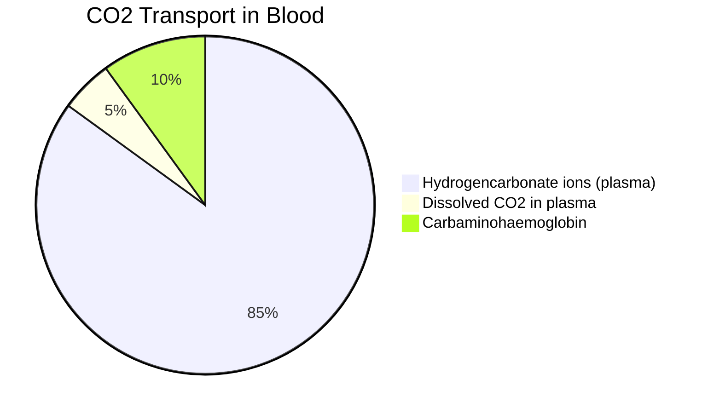
```mermaid
pie title CO2 Transport in Blood
    "Hydrogencarbonate ions (plasma)" : 85
    "Dissolved CO2 in plasma" : 5
    "Carbaminohaemoglobin" : 10
```

#### Bohr Shift and Chloride Shift 波尔效应与氯转移

这两个“转移”是红细胞在组织中**释放氧气**并**运回二氧化碳**时发生的**协调反应**，它们密切相关。也就是说二者相辅相成，促进了气体交换。

$$
\ce{CO2 + H2O <=>[carbonic anhydrae 碳酸酐酶] H2CO3 <=> H+ + HCO3-}
$$

- **Chloride Shift** - $\ce{Cl^-}$ 移动到red blood cell的过程，并形成hydrogen carbonate ions
  - **Process**: When CO₂ from tissues enters the red blood cell and is converted to HCO₃⁻ (negatively charged), a large amount of HCO₃⁻ **diffuses out of the red blood cell into the plasma**.
  - <u>**To maintain electrical neutrality**</u>, chloride ions (Cl⁻) move from the plasma **into the red blood cell**. This exchange is called the "chloride shift".
  - **Outcome**: This allows efficient transport of CO₂ as HCO₃⁻ while keeping the red blood cell electrically neutral.

  > Chloride ions: blood plasma → red blood cells

- **Bohr Shift** - 促进氧气的释放的过程
  - 上述反应会增加氢离子的数量，并降低血液的pH值，使血液变得更酸。

  - 为了避免这个情况，haemoglobin会作为缓冲剂（buffer），与氢离子结合，形成血红蛋白酸（haemoglobinic acid, HHb)
  - 当haemoglobin形成haemoglobinic acid时，它能结合氧气的程度会下降（decrease in affinity)，于是氧气会释放出来。
  - Bohr shift会改变the haemoglobin dissociation curve的位置：**CO₂越多，越往右**；在同样的partial pressure下，可以溶解的氧气更少。

| Location                       | pO₂  | pCO₂ | Affinity of haemoglobin for O₂ | Percentage saturation of haemoglobin with O₂ | Bohr shift |
| ------------------------------ | ---- | ---- | ------------------------------ | -------------------------------------------- | ---------- |
| Alveoli / gas exchange surface | High | Low  | High                           | High                                         | No         |
| Respiring tissues              | Low  | High | Low                            | Low                                          | Yes        |

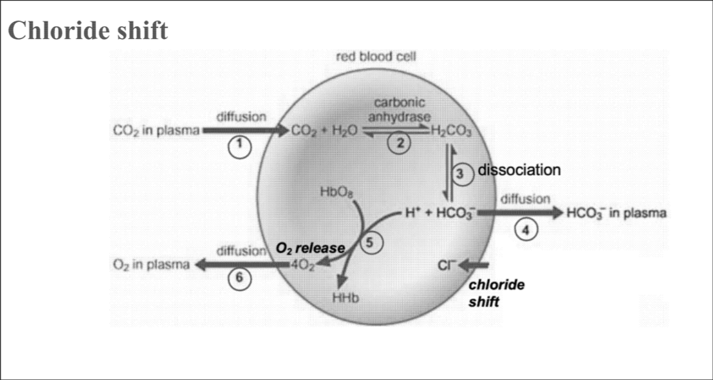

> [!IMPORTANT]
>
> 考试会考：
>
> $$
> \ce{CO2 + H2O ->[Carbonic Anhydrase] H2CO3}
> $$
>
> 二氧化碳和水经过**Carbonic Anhydrase**生成碳酸。

在高partial pressure of O₂ (低partial pressure of CO₂)的地方：

1. HHb会释放$H^+$离子，随后HHb会和氧气结合，形成oxyhaemoglobin
2. 碳酸氢离子hydrogencarbonate ions会通过diffusion回到red blood cell中，并与前面被HHb释放的氢离子结合，形成碳酸carbonic acid
3. 碳酸会被会自然分解成water和carbon dioxide
4. CO₂从carbaminehaemoglobin中分离出去

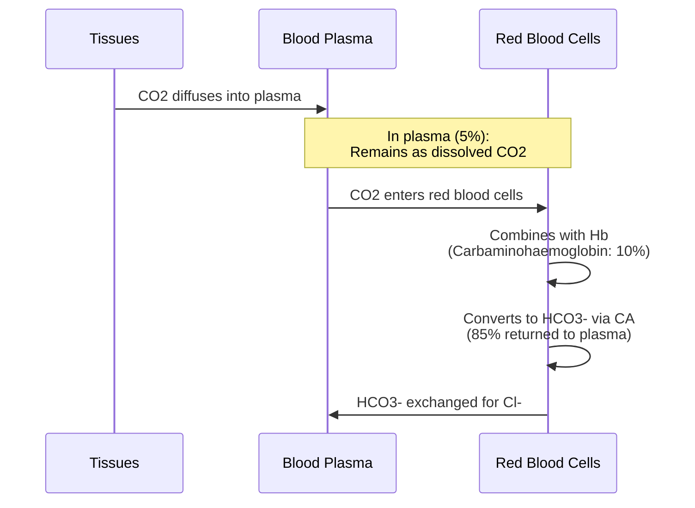
```mermaid
sequenceDiagram
    participant T as Tissues
    participant P as Blood Plasma
    participant R as Red Blood Cells
    T->>P: CO2 diffuses into plasma
    Note over P,R: In plasma (5%):<br/>Remains as dissolved CO2
    P->>R: CO2 enters red blood cells
    R->>R: Combines with Hb<br/>(Carbaminohaemoglobin: 10%)
    R->>R: Converts to HCO3- via CA<br/>(85% returned to plasma)
    R->>P: HCO3- exchanged for Cl-
```

### Heart

Cardiac muscles are myogenic, they can naturally contract and relax, don't require the signal from brain.

> **Cardiac muscle 心肌** - 负责心脏跳动的肌肉
>
> **Myogenic 肌原性的** - 可以自动收缩，不需要大脑控制
>
> **Coronary Arteries** - the blood vessels that supply cardiac muscle with oxygenated blood

- 当cardiac muscle**收缩**时，被称为：**systole** 心脏收缩
- 当cardiac muscle**放松**时，被称为：**diastole** 心脏舒张

#### Cardiac Cycle

一个完整的心脏跳动周期包括三个阶段：

1. **Atrial systole** - Both atria contract

   $$
   Atrium \rightarrow Ventricle
   $$
   - Backflow of blood into the veins is prevented by **closure of the valves in the veins**

     vein中的valves会关闭，防止血液倒流

2. **Ventricular systole** - Both ventricles contract

   $$
   Ventricle \rightarrow Arteries
   $$
   - The semi-lunar valves in the arteries (pulmonary artery and aorta) are pushed open

     血液流出心脏的valves会打开

   - The atrioventricular valves are pushed shut

     atrium和ventricle之间的valve会关闭

3. **Diastole** - All chambers relax

   $$
   Vein \rightarrow Atria \rightarrow Ventricles
   $$

   > 在这个阶段血液是自然流入atria和ventricles的
   - The **semi-lunar valves** are pushed shut

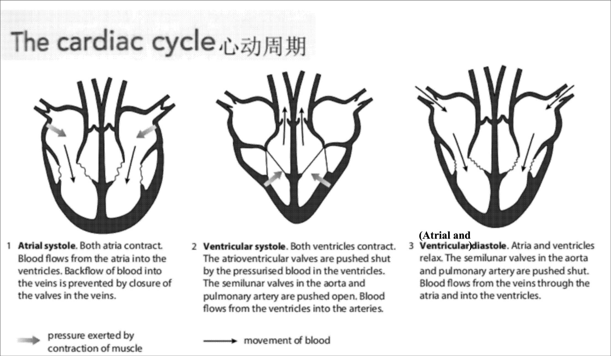

#### Basic Principles

- Muscle contraction increases pressure

  > 只需要记住<u>什么地方收缩</u>，<u>什么地方的压力就会增大</u>就行了

- Blood flows from higher to lower pressure

Atrioventricular valves在心动周期中的变化

- **Pushed open** when pressure in artery is greater than the pressure in venrticle
- **Pushed shut** when pressure in artery is lower than the pressure in venrticle

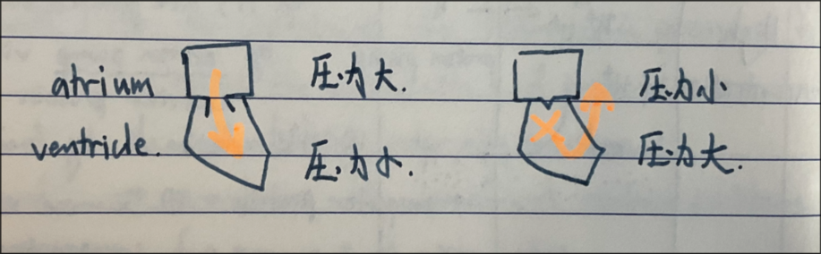

Semi-lunar valves的情况正好和atrioventricular valves相反

> ### Summary
>
> 1. **Atrial Systole**
>    - **Atria:** Contract.
>    - **Ventricles:** Relax.
>    - **Valves:** **Atrioventricular (AV) valves** (tricuspid & mitral) are **open**; **Semilunar valves** (pulmonary & aortic) are **closed**.
>    - **Blood Flow:** From atria → ventricles (completes ventricular filling).
> 2. **Ventricular Systole**
>    - **Atria:** Relax.
>    - **Ventricles:** Contract.
>    - **Valves:** **AV valves close** (to prevent backflow); **Semilunar valves open**.
>    - **Blood Flow:** From ventricles → arteries (pulmonary artery & aorta).
> 3. **Diastole (General Relaxation)**
>    - **Atria & Ventricles:** Both relax.
>    - **Valves:** **AV valves open**; **Semilunar valves close**.
>    - **Blood Flow:** Blood passively flows from veins → atria → ventricles.
>

#### Four Structures in the Control of Cardiac Cycle

这四个结构用来确保cardiac cycle可以发生，主要目标：先让atria收缩，等待一段时间后再让ventricles收缩。

| Structure                          | Location                     | Role                                                                            |
| :--------------------------------- | :--------------------------- | :------------------------------------------------------------------------------ |
| **SAN (Sinoatrial Node)**          | Wall of right atrium         | **Pacemaker** – initiates electrical impulses.                                  |
| **Non-conducting Tissue**          | Between atria and ventricles | Prevents electrical impulse from spreading directly to ventricles.              |
| **AVN (Atrioventricular Node)**    | Septum (between atria)       | Delays impulse (~0.1s) to allow atrial emptying before ventricular contraction. |
| **Purkyne Tissue / Bundle of His** | Septum and ventricular walls | Conducts impulse to ventricles, ensuring simultaneous contraction.              |

1. SAN generates electrical impulse → stimulates **both atria to contract**.

   SAN发出信号，使两个atria收缩

2. Impulse is blocked by **non-conducting tissue** → cannot go directly to ventricles.

   SAN的信号被non-conducting tissue拦截

3. Impulse travels to **AVN** → delayed by **~0.1s** → allows **atria to fully empty**.

   当SAN的信号传输到AVN时，AVN会等待0.1秒（留出时间让血流流出atria）

4. AVN passes impulse to **Bundle of His / Purkyne tissue**.

   AVN将延迟后的信号传递到Purkyne tissue

5. Impulse arrives at **apex/base** of ventricles → **both ventricles contract simultaneously** → blood ejected into arteries.

   当信号到达base（ventricle的最底部）时，两个ventricles会收缩

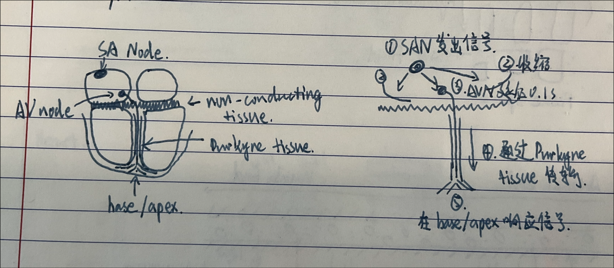

#### Heart Sound

Use **stethoscope** the listen the sound of valves' closure.

### Appendix

为了更直观地展示一些关系，我让AI整理了下面的笔记。

#### Diagrams

##### Overview of Hemoglobin Forms and Transitions

- Hb can reversibly bind oxygen, carbon dioxide, and hydrogen ions depending on environmental conditions. 血红蛋白可以根据环境条件可逆地结合氧气、二氧化碳和氢离子。
- In oxygen-rich environments (lungs), Hb preferentially binds O₂ to form oxyhemoglobin (HbO₂). 在富氧环境（肺部）中，血红蛋白优先结合O₂形成氧合血红蛋白（HbO₂）。
- In tissues with high CO₂ and H⁺ concentrations, Hb releases O₂ and can bind CO₂ or H⁺ instead. 在高CO₂和H⁺浓度的组织中，血红蛋白释放O₂，转而结合CO₂或H⁺。



##### Gas Exchange at Respiring Tissues (CO₂ Loading & O₂ Unloading)

- Most CO₂ transport (85%) occurs as HCO₃⁻ ions in plasma, formed via carbonic anhydrase in RBCs. 大部分CO₂运输（85%）以血浆中的HCO₃⁻离子形式进行，通过红细胞中的碳酸酐酶形成。
- The Bohr effect decreases Hb's oxygen affinity when pH drops, enhancing oxygen delivery to active tissues. 当pH值下降时，波尔效应降低血红蛋白的氧亲和力，增强向活跃组织的氧输送。
- The chloride shift maintains electrochemical balance as HCO₃⁻ leaves RBCs. 氯转移在HCO₃⁻离开红细胞时维持电化学平衡。



##### The Bohr Shift Mechanism

- Increased CO₂ concentration lowers blood pH (increased acidity). CO₂浓度增加会降低血液pH值（增加酸性）。
- H⁺ ions bind to hemoglobin, forming HHb and causing a conformational change. H⁺离子与血红蛋白结合，形成HHb并引起构象变化。
- This conformational change reduces Hb's affinity for oxygen, promoting O₂ release to tissues. 这种构象变化降低了血红蛋白对氧的亲和力，促进O₂向组织释放。



##### The Chloride Shift Mechanism

- For every HCO₃⁻ ion that diffuses out of the RBC, one Cl⁻ ion moves in to maintain electrical neutrality. 每有一个HCO₃⁻离子扩散出红细胞，就有一个Cl⁻离子移入以维持电中性。
- This exchange allows RBCs to transport large amounts of CO₂ as HCO₃⁻ without disrupting ion balance. 这种交换使红细胞能够以HCO₃⁻形式运输大量CO₂而不破坏离子平衡。
- The process is facilitated by the high permeability of RBC membranes to anions. 该过程得益于红细胞膜对阴离子的高渗透性。



##### Gas Exchange in the Lungs (Reverse Processes)

- In the lungs, low CO₂ concentration reverses all tissue processes: HHb releases H⁺, and Hb-CO₂ releases CO₂. 在肺部，低CO₂浓度逆转所有组织过程：HHb释放H⁺，Hb-CO₂释放CO₂。
- HCO₃⁻ re-enters RBCs, combines with H⁺ to form CO₂, which is then exhaled. HCO₃⁻重新进入红细胞，与H⁺结合形成CO₂，然后被呼出。
- High O₂ concentration in alveoli promotes O₂ binding to Hb, forming oxyhemoglobin for transport to tissues. 肺泡中的高O₂浓度促进O₂与血红蛋白结合，形成氧合血红蛋白运输到组织。



#### Blood Transport Compounds

**In the Lungs (Alveoli):**

- **HbO₂ (Oxyhaemoglobin)** is formed as hemoglobin (Hb) loads oxygen.
- **Hb-CO₂ (Carbaminohaemoglobin)** releases its CO₂, which diffuses into the alveoli to be exhaled.
- **HHb (Haemoglobinic acid)** releases its H⁺ ions. These H⁺ combine with HCO₃⁻ that re-enters the RBC, forming H₂CO₃, which breaks down into CO₂ and H₂O. The CO₂ is then exhaled.
- The **Chloride Shift** reverses; Cl⁻ leaves the RBC as HCO₃⁻ re-enters.

**At Respiring Tissues:**

- **HbO₂** releases its oxygen, becoming **Hb (deoxyhaemoglobin)**.
- CO₂ from tissues enters the RBC and follows two main paths:
  1. Forms **Hb-CO₂ (Carbaminohaemoglobin)** by binding directly to Hb.
  2. Reacts with water to form **H₂CO₃**, which dissociates into **H⁺** and **HCO₃⁻**.
- The **H⁺** binds to **Hb**, forming **HHb (Haemoglobinic Acid)**. This binding is the core of the **Bohr Shift**, which decreases Hb's affinity for O₂, promoting further oxygen release.
- The **HCO₃⁻** diffuses out into the plasma. To maintain electrical neutrality, **Cl⁻** moves from the plasma into the RBC—this is the **Chloride Shift**.

---

##### Hb (Hemoglobin / 血红蛋白)

- **Formed / Located In:** The cytoplasm of red blood cells (erythrocytes).
- **Primary Function / Usage:** The main oxygen-carrying protein in blood. Binds and transports oxygen from the lungs to respiring tissues. Also carries a portion of carbon dioxide.
- **Key Reaction / Process:** Can reversibly bind to oxygen (`Hb + 4O₂ ⇌ HbO₈`) and to carbon dioxide (`Hb + CO₂ ⇌ Hb-CO₂`).

---

##### HHb (Hemoglobinic Acid / 血红蛋白酸)

- **Formed / Located In:** Red blood cells at respiring tissues.
- **Formed By:** Hemoglobin (Hb) binding to hydrogen ions (H⁺).
- **Primary Function / Usage:** Acts as a crucial **buffer** in the blood. Its formation prevents a dangerous drop in pH (acidosis) when CO₂ enters the blood from tissues.
- **Key Reaction / Process:** `Hb + H⁺ → HHb`. The binding of H⁺ causes a **decrease in Hb's affinity for oxygen**, directly promoting oxygen release (central to the **Bohr Shift**).

---

##### HbO₈ / HbO₂ (Oxyhemoglobin / 氧合血红蛋白)

- **Formed / Located In:** Red blood cells as they pass through the lung capillaries (alveoli).
- **Formed By:** Hemoglobin (Hb) binding to oxygen molecules (O₂).
- **Primary Function / Usage:** The form of hemoglobin that is saturated with oxygen. Responsible for transporting oxygen from the lungs to the rest of the body.
- **Key Reaction / Process:** `Hb + 4O₂ → HbO₈`. This is a **reversible** reaction; oxygen dissociates (unloads) in tissues where the partial pressure of oxygen (pO₂) is low.

---

##### Hb-CO₂ (Carbaminohaemoglobin / 氨基甲酰血红蛋白)

- **Formed / Located In:** Red blood cells as they pass through tissue capillaries.
- **Formed By:** Carbon dioxide (CO₂) binding directly to the **terminal amine groups (-NH₂)** of the hemoglobin molecule.
- **Primary Function / Usage:** Transports approximately **10%** of the body's carbon dioxide from tissues back to the lungs.
- **Key Reaction / Process:** `Hb + CO₂ ⇌ Hb-CO₂`. This is a **reversible** reaction; CO₂ dissociates from hemoglobin in the lungs where its partial pressure (pCO₂) is low.

---

##### Bohr Shift (波尔效应)

- **Occurs In:** Capillaries at **respiring tissues**.
- **Triggered By:** High concentration of carbon dioxide (CO₂) and the resulting decrease in blood pH (increased acidity).
- **Primary Function / Effect:** **Decreases hemoglobin's affinity for oxygen**, causing the oxygen dissociation curve to shift to the **right**. This ensures more efficient **unloading of oxygen** to tissues with high metabolic demand.
- **Key Relationship:** Involves the formation of **HHb** (as a buffer), which directly facilitates oxygen release.

---

##### Chloride Shift (氯转移)

- **Occurs In / Across:** The membrane of red blood cells in tissue capillaries.
- **Triggered By:** The diffusion of **hydrogencarbonate ions (HCO₃⁻)** out of the red blood cell and into the plasma.
- **Primary Function / Effect:** Maintains **electrical neutrality** (charge balance) across the red blood cell membrane. For every HCO₃⁻ ion that leaves, a **chloride ion (Cl⁻)** moves from the plasma into the red blood cell.
- **Key Relationship:** Works in concert with the **Bohr Shift** and carbon dioxide transport, enabling the bulk transport of CO₂ as HCO₃⁻ in the plasma.

## Chapter 9 - Gas Exchange

### Chapter Outline

- Human gas exchange system
- Features of different airways
  - Trachea
  - Bronchus
  - Terminal bronchiole and respiratory bronchiole
  - Alveolar duct and alveoli
- Make plan diagrams of transverse sections of airways

### Human gas exchange system

- **Lungs** 肺 - The primary organs of respiration where gas exchange occurs between the air and the bloodstream.
- **Trachea** 气管 - The main airway (windpipe) that carries air from the throat into the bronchi of the lungs.
- **Bronchus / Bronchi** 支气管 - The major air passages that branch off from the trachea into each lung and further subdivide.
- **Bronchiole(s)** 细支气管 - The smaller, branching airways that lead from the bronchi to the alveoli, lacking cartilage.
  - **Terminal Bronchiole** 终末细支气管 - The final segment of the conducting airways, which does not participate in gas exchange. 最后没有与肺泡接触的支气管
  - **Respiratory Bronchiole** 呼吸性细支气管 - The first airway segment that contains alveoli and where gas exchange begins. 直接与肺泡接触的支气管
- **Alveolar Duct** 肺泡管 - A tiny tube originating from a respiratory bronchiole, lined with alveoli, that leads to alveolar sacs. 把一堆肺泡连接到一起的管子
- **Alveolus / Alveoli** 肺泡 - Tiny, cup-shaped air sacs where the primary gas exchange (oxygen and carbon dioxide) takes place.
- **Capillary Network** 毛细血管网 - A dense network of tiny blood vessels surrounding the alveoli, enabling the exchange of gases.
- **Ciliated Epithelium** 纤毛上皮 - A layer of cells with hair-like projections called cilia on their surface. Found lining the trachea and bronchi, they move in a coordinated wave to sweep mucus and trapped particles out of the airways.
- **Squamous Epithelium** 鳞状上皮 - A layer of thin, flat cells that form a smooth surface. In the alveoli, this type (specifically simple squamous epithelium) is extremely thin, allowing for efficient diffusion of gases between the air and blood.
- **Smooth Muscle** 平滑肌 - An involuntary, non-striated type of muscle tissue. Found in the walls of the bronchi and bronchioles, its contraction and relaxation regulate airway diameter (bronchoconstriction and bronchodilation).
- **Thorax** 胸廓/胸部 - The part of the body between the neck and the abdomen, enclosed by the ribs, containing the heart and lungs.
- **Rib** 肋骨 - A curved bone that forms part of the rib cage, providing protection for the thoracic organs.
- **Rib Cage / Thoracic Cavity** 胸腔 - The bony and cartilaginous framework formed by the ribs, sternum, and spine that encloses and protects the thoracic cavity; the space itself containing the lungs and heart.
- **Diaphragm** 膈肌 - A dome-shaped sheet of muscle that separates the thoracic cavity from the abdominal cavity and is the primary muscle for breathing.
- **Abdomen** 腹部 - The part of the body below the chest (thorax) and above the pelvis, containing the digestive organs.

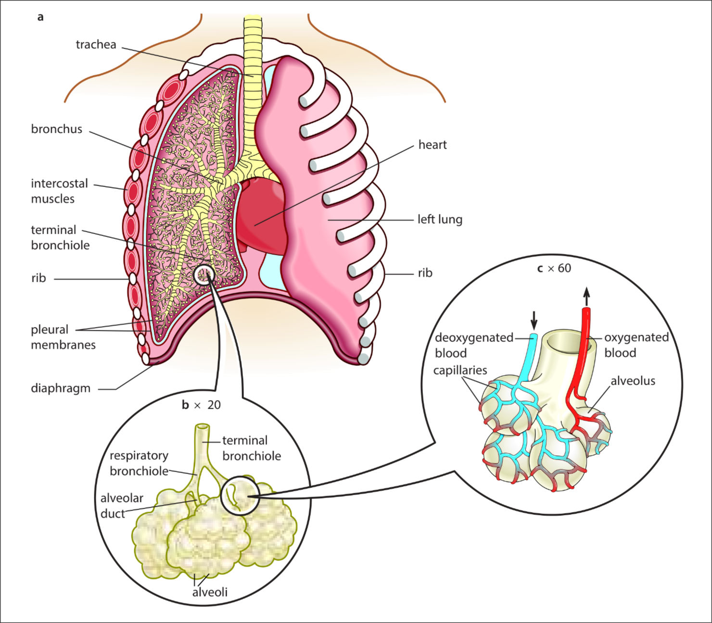

> **Pathway**: Trachea → Bronchus → Bronchiole → Terminal Bronchiole → Respiratory Bronchiole → Alveolar Duct → Alveoli
>
> Site of gas exchange only set in **alveolar duct** and **alveoli**

| Airway                 | Number  | Approximate diameter | Cartilage | Goblet cells | Smooth muscle | Cilia | Site of gas exchange | Elastic fibre |
| ---------------------- | ------- | -------------------- | --------- | ------------ | ------------- | ----- | -------------------- | ------------- |
| trachea                | 1       | 1.8 cm               | yes       | yes          | yes           | yes   | no                   | Yes           |
| bronchus               | 2       | 1.2 cm               | yes       | yes          | yes           | yes   | no                   | Yes           |
| terminal bronchiole    | 48 000  | 1.0 mm               | no        | no           | yes           | yes   | no                   | Yes           |
| respiratory bronchiole | 300 000 | 0.5 mm               | no        | no           | no            | a few | no                   | Yes           |
| alveolar duct          | 9 × 10⁶ | 400 μm               | no        | no           | no            | no    | yes                  | Yes           |
| alveoli                | 3 × 10⁹ | 250 μm               | no        | no           | no            | no    | yes                  | Yes           |

#### Distribution of different components in trachea 气管

Main components (sort in the order from inner lumen):

1. Ciliated epithelium containing **goblet cells** and **ciliated cells**
2. Elastic fibres
3. Mucous glands
4. Smooth muscle
5. Cartilage

Goblet cells and mucous glands can **make mucus** (containing the glycoprotein **mucin**) to **trap** microorganisims and dust particles in the air breathed in.

Cilia of ciliated epithelial cells **sweep / move mucus upwards away from alveoli / lung tissue**, *towards the back of the throat*, *swallowed into stomach* where $HCl$ can destroy microorganisms.

**Macrophage** (a type of white blood cell) can patrol the surfaces of airways, removing and scavenging bacteria, dust particles, etc.

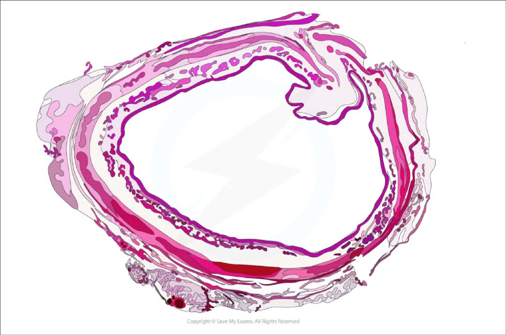

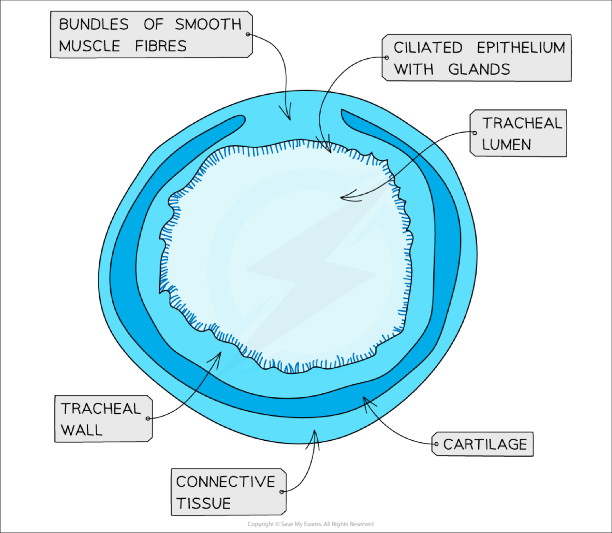

> **Cilia** - a cell organelle 一个细胞器
>
> **Ciliated cell** - a cell with the cilia 一个细胞
>
> ---
>
> **Epithelium** 上皮 - a type of tissue 一个组织
>
> **Epithelial cell** - the cell that can make up the epithelium 细胞
>
> **Endothelium** 内皮 - the inner surface covering of blood vessel, it's still a type of epithelium
>
> **Lining** 内壁 - the inner covering of an organ
>
> ---
>
> **吸气** - breathe in / inspire / inhale
>
> **呼气** - breathe out / expire / exhale

#### Distribution of different components in Bronchi 支气管

1. Ciliated epithelium containing goblet cells and ciliated cells

   > Goblet cells和ciliated cells大多数一起出现：
   >
   > 1. Goblet cell先分泌mucus黏住“脏东西”
   > 2. Ciliated cell再将这些黏液推出去

2. Elastic fibre

3. Smooth muscle - not connected in bronchi

4. Mucous glands

5. Cartilage

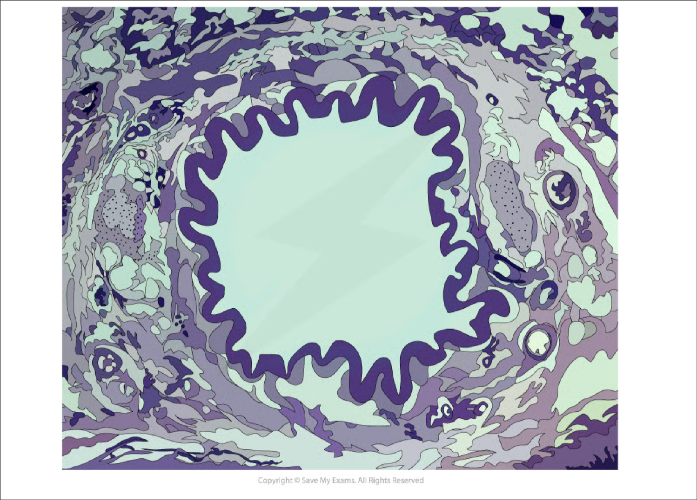

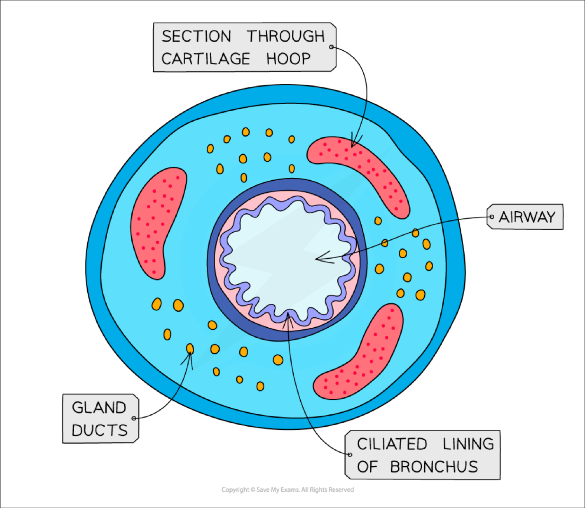

#### Distribution of different components in Bronchiole 细支气管

Terminal bronchiole - contain ciliated epithelium with **ciliated cells**, **elastic fibre** and **smooth muscles**

Respiratory bronchiole - contain elastic **fibre** and **a few ciliated cells**

Smooth muscles form a ring around the bronchiole.

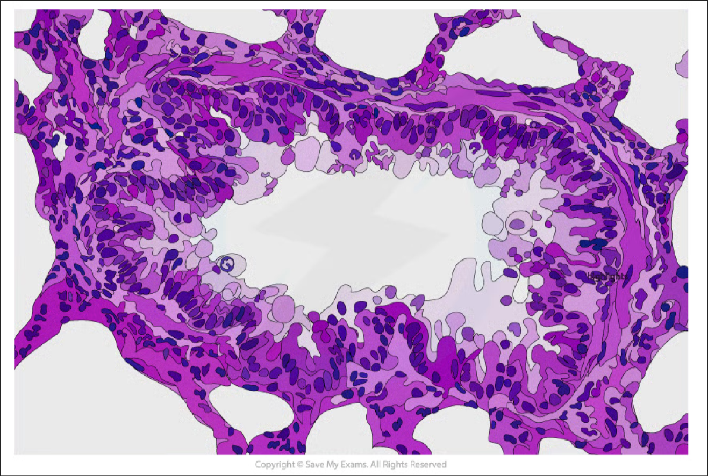

> Bronchi和Bronchiole的内部之所以是褶皱形的，是因为有smooth muscle来控制lumen的大小，来控制气体的进出。
>
> The ciliated epithelium of bronchus and terminal bronchiole is **wavy** due to smooth muscle contraction at death.
>
> The epithelium remains smooth in vivo.

### Key Structures

#### Ciliated Epithelium

> **Ciliated epithelium** is named for the **projections (cilia)** on the surface of its cells.
>
> 有凸起的纤毛
>
> > [!IMPORTANT]
> >
> > 考试的时候**不要**用*hair-like*这个词来描述ciliated cell / epithelium，在IG mark scheme中会reject掉这个词，直接不给分。(即使后面有提到*cilia*)

Ciliated epithelium is a specialised tissue which lines all of the tubes of the airways, each cell has small projections of cilia which **sweep mucus, dust particles and bactera upwards** and away from the lungs and the epithelium itself.

这个组织主要是为了**把黏液运输出去**

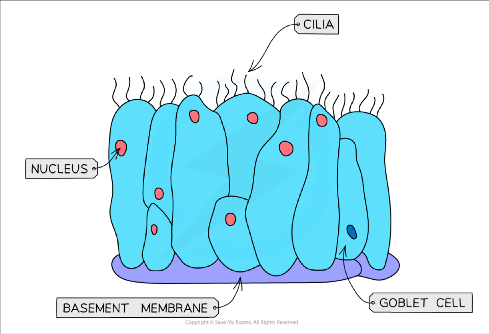

#### Squamous epithelium

> **Squamous epithelium** is named for the **flat, scale-like shape** of its cells.
>
> 扁平，鱼鳞状的表面

A thin layer in the alveoli that allows for gas exchange.

It forms the structure of the alveolar wall and is **very thin** and permeable for the easy diffusion of gases.

这个组织的主要任务是**让气体快速交换**

#### Goblet Cells

**Goblet cells** can be found in the **trachea and bronchi**, but not in the bronchioles. The dust, bacteria and other microorganisms can remove from lungs with the help of ciliated cells and goblet cells.

1. Goblet cells secrete mucus
2. Mucus traps dust, bacteria and other microorganisms
3. The cilia sweep the mucus away from lung tissue
4. The mucus and any microorganisms will then be destroyed by the acid in the stomach

The Golgi body can modify the protein (mucin)

> mucin - 蛋白质
>
> mucus - 最终产生的黏液

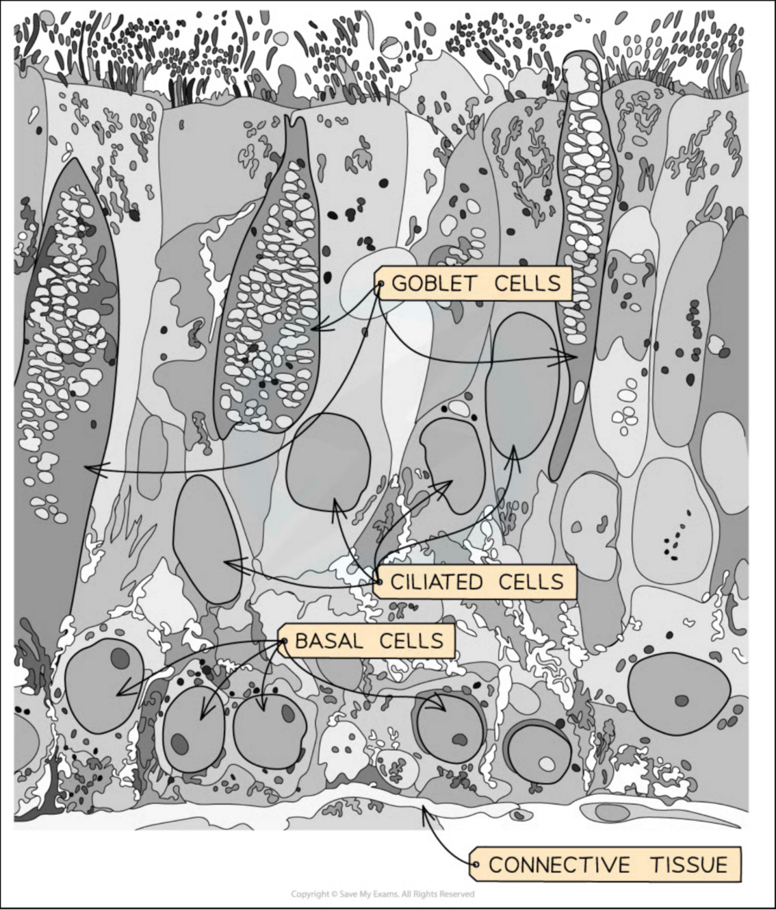

#### Smooth Muscle

Located in the walls of trachea, bronchi and bronchioles.

**Structure:**

- Made of smooth muscle cells

- Cells are spindle shaped
- Cells are closely packed
- Contains blood vessel

It can regulate the flow of air by controlling the size of lumen of the airways.

- Contract to constrict airways and relax to widen airways
- Change the diameter of airways and regulate air flow into / out of lungs (control the size of the lumen)

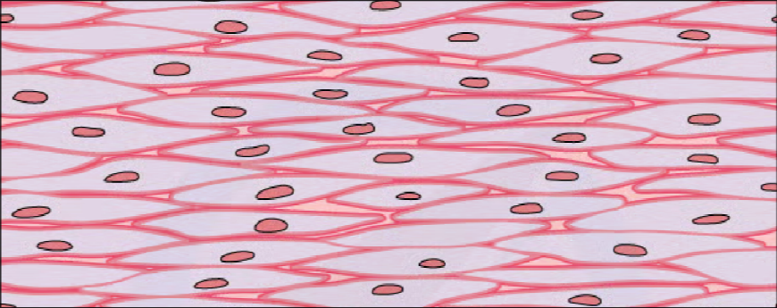

> **Elastic Fibre** - Stretch during inhalation and recoil during exhalation of expel air

#### Cartilage

Cartilage is a type of <u>flexible skeletal tissue</u> (strong and flexible tissue), it's located in trachea and bronchus.

- In trachea - **C-shaped rings** of cartilage
- In Bronchus - **Irregular blocks** of cartilage

**Structure:**

- Cells are rounded

- No blood vessel exist
- Cells are more isolated

Functions of cartilage:

- **Support** and **keep** the airways open - **Protective** and **prevent** trachea and bronchi from collapsing
- Reduce resistance to air flow
- *Non contractile*

The cartilage in the trachea has a 'glassy' apperance due to its translucent protoplasm. It contains no nerves or blood vessels.

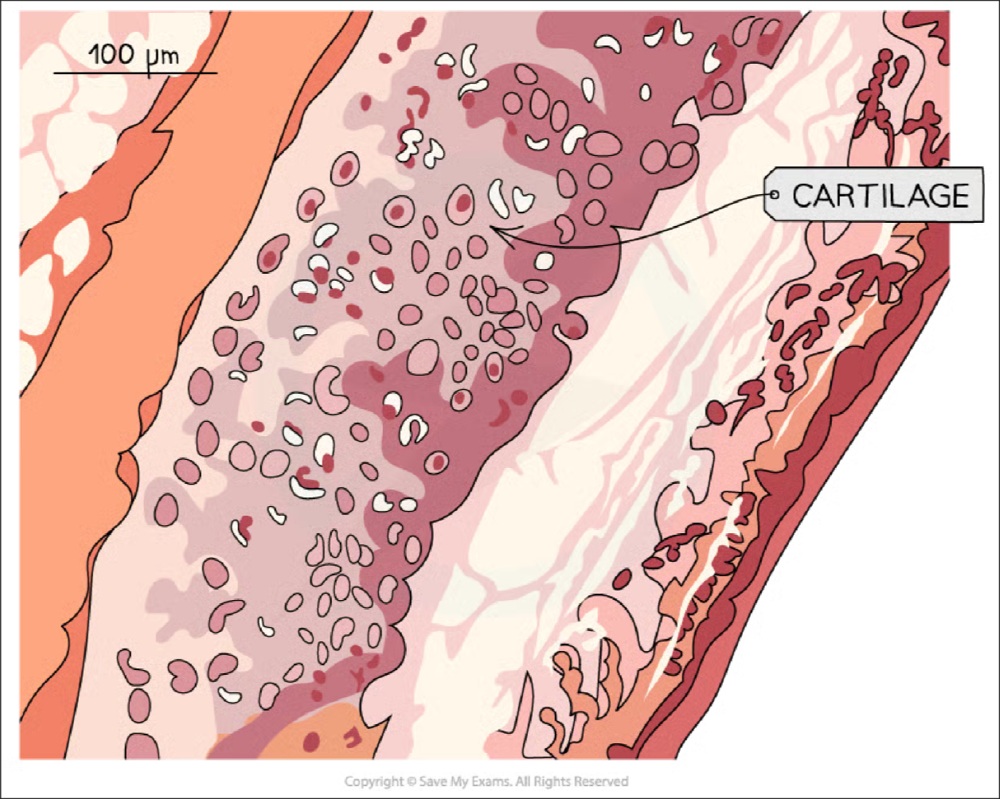

#### Capillaries

**Capillaries** consist of a single layer of **endothelium cells**, the diameter of their lumen is very tiny (~4μm).

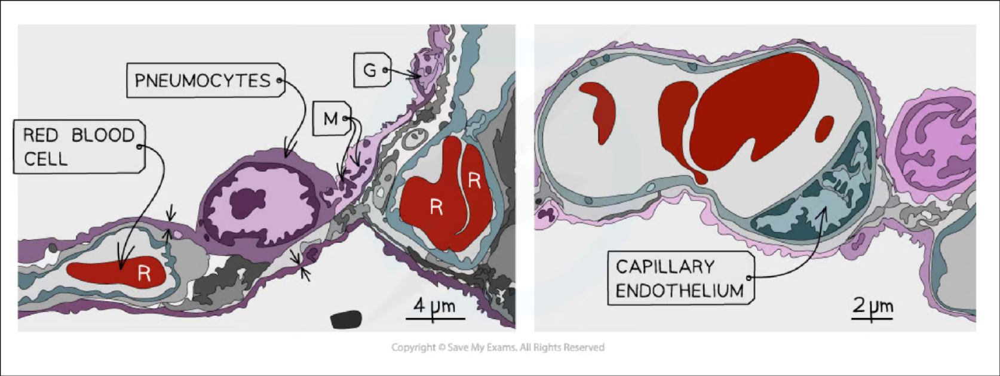

#### Alveoli

**Alveolus** is **the main gas exchange site**.

- **Thin wall** - a squamous epithelium made of a single layer of squamous cells.

- **Closely surrounded by capillaries** - one cell thick made of a single layer of squamous cells.

  > One cell thick: Short distance and high diffusion rate.

- **Large $Surface Area : Volume$** - high diffusion rate

- **Constant flow of blood & the continuous ventilation of lungs** - maintain steep concentration gradient for $O_2$ and $CO_2$

- **Collagen fibre in alveolar walls** - provide support and prevent alveoli from bursting

- **Elastic fibre** - stretch and recoil

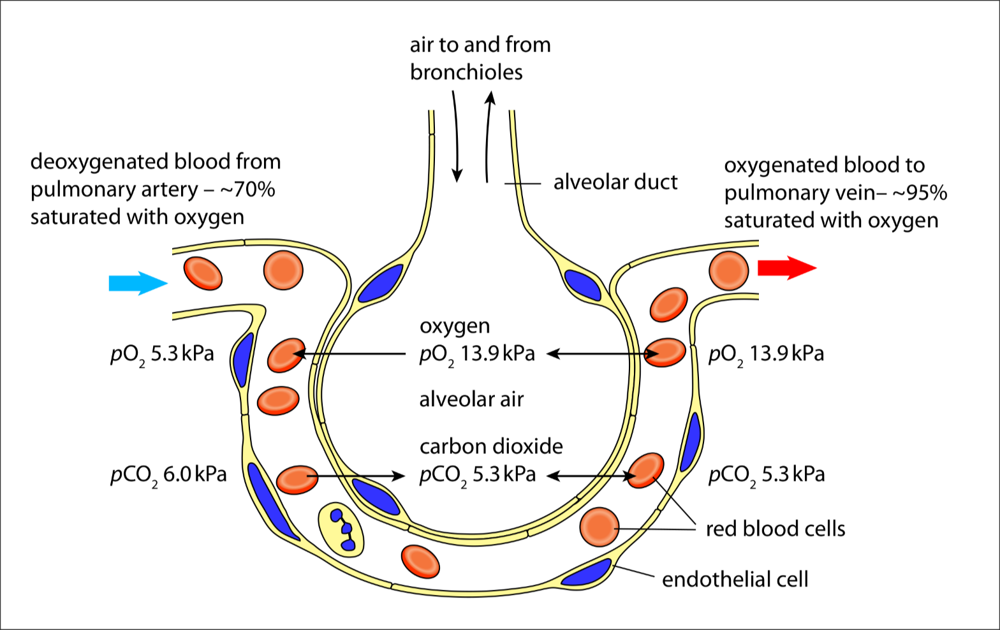

氧气从肺泡中的空气到haemoglobin中时，需要经过5层细胞膜：

- 2 layers through squamous epithelial cells
- 2 layers thought capillary cell
- 1 layer through the surface cell membrane of red blood cell

### Plan Diagram / Low Power Drawing

Trachea in transverse section:

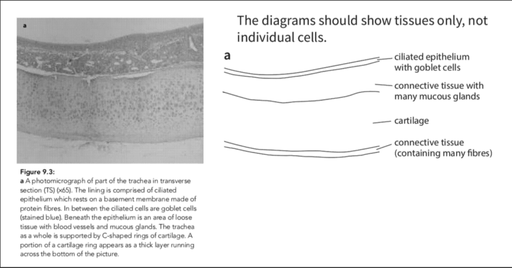

Bronchus:

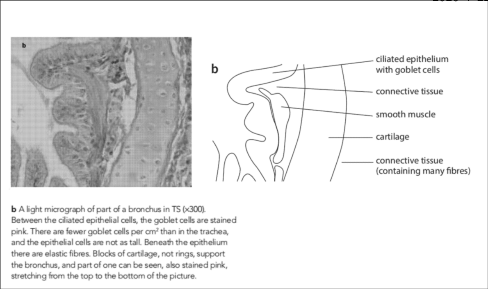

Small bronchiole:

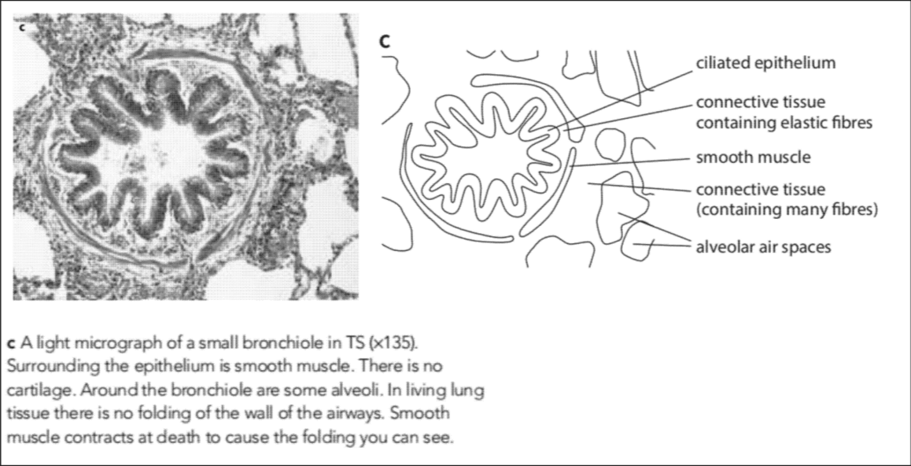

> 这一节很重要的内容是，知道每一个tissue的位置，然后可以在图像上识别出来。
>
> 我感觉plan diagram就是按照实际照片中tissues的位置，然后通过简笔画的方式重新画出来。

### Appendix

#### Distinguishing Between Trachea, Bronchus, and Bronchiole

| Feature                 | Trachea                           | Bronchus                            | Bronchiole                                                      |
| ----------------------- | --------------------------------- | ----------------------------------- | --------------------------------------------------------------- |
| **Cartilage**           | C-shaped rings                    | Irregular plates/blocks             | Absent                                                          |
| **Goblet Cells**        | Present                           | Present                             | Absent (or very few)                                            |
| **Cilia**               | Abundant                          | Abundant                            | Present in terminal bronchioles; few in respiratory bronchioles |
| **Smooth Muscle**       | Present                           | Present                             | Abundant (forms rings); Not present in respiratory bronchiole.  |
| **Lining Epithelium**   | Ciliated                          | Ciliated                            | A few cilia in respiratory bronchioles                          |
| **Structural Support**  | Rigid due to **cartilage rings**  | Supported by **cartilage plates**   |                                                                 |
| **Cross-Section Shape** | Round with **C-shaped** cartilage | **Irregular** with cartilage plates | Small, folded lumen; no cartilage                               |

## Chapter 10 - Infectious Diseases

### Chapter Outline

- Infectious diseases
  - Cholera

  - Malaria

  - HIV / AIDS

  - TB

- Antibiotics
  - Penicillin
  - Antibiotic Resistance

### Key Terms

#### 核心概念

**Disease** 疾病 - An illness or disorder of the body or mind that leads to poor health.

**Pathogen** 病原体 - A microorganism (e.g., bacterium, virus) that causes disease.

**Infectious Disease** 传染病 - A disease caused by a pathogen that can be transmitted.

**Host** 宿主 - An organism in which a pathogen lives and from which it can be transmitted to another host.

**Carrier** 携带者 - A person infected with a pathogen who shows no symptoms but can transmit it.

**Transmission Cycle** 传播循环 - The repeated passage of a pathogen from one host to another.

**Vaccine** 疫苗 - A substance that stimulates the body's immune system to provide protection against a specific disease.

#### 疾病传播范围

**Endemic** 地方性流行病 - The constant, usual presence of a disease in a particular geographic area or population.

**Epidemic** 流行病 - A sudden increase in the number of cases of a disease above what is normally expected in a specific area or population.

**Pandemic** 大流行病 - An epidemic that has spread over multiple countries or continents, affecting a very wide area and a large number of people.

#### 测量指标

**Incidence Rate** 发病率 - The number of **new** cases of a disease in a population during a specific time period.

**Prevalence Rate** 患病率 - The total number of **all cases** (both new and existing) of a disease present in a population at a specific time or over a period.

**Mortality Rate** 死亡率 - The number of deaths caused by a disease in a population during a specific time period.

#### Examples

Examples of **Infectious Diseases 传染病**

- **Cholera** 霍乱
- **Malaria** 疟疾
- **HIV/AIDS** 艾滋病
- **Tuberculosis (TB)** 肺结核
- **Influenza** 流感

Examples of **Non-Communicable Diseases 非传染性疾病**

- **Coronary Heart Disease** 冠心病
- **Diabetes** 糖尿病
- **Obesity** 肥胖症
- **Sickle Cell Anaemia** 镰状细胞贫血症
- **Cancer** 癌症

### Pathogens

Dimensions of learning a new disease

- Disease name

- Name and type (bacteria, protoctist etc.) of pathogen
- Transmission
- Disease-causing process and symptoms
- Treatment
- Prevention and control (biological, social and economic factors)

> ### Disease Name
>
> Caused by: **Pathogen Name** (Pathogen type)
>
> Transmission:
>
> Symptoms:
>
> Treatment:
>
> Prevention and control:

All viruses are parasite, but most bacteria are not. Because viruses are not living things, they can't reproduce by their own.

#### Cholera 霍乱

Caused by: **Vibrio cholerae** (Bacterium)

Transmission: Contaminated **water** or **food** (fecal-oral route)

- Food-borne 经食物传播的

- Water-borne 经水传播的

- Faecal-oral route 粪口传播途经

  > **Faeces** 粪便 - （containing *Vibrio cholerae*）from infected people **contaminate water / food**
  >
  > Then the uninfected people take in the contaminated water / food

Symptoms: Diarrhoea and dehydration 脱水

Treatment: Oral rehydration therapy, **antibiotics** in severe cases

> **Oral rehydration therapy** - drink or inject intravenously a solution with **salts** and **glucose**
>
> 通过摄入高concentration、低water potential的液体来平衡体内的water potential

Prevention and control: Providing clean water and sanitation, vaccination in endemic areas, sewage treatment, monitoring by WHO

> Cholera often occurs after natural disasters and wars, in refuge campus 难民营, due to:
>
> - Absence of proper sanitation, poor hygien and poor living conditions
> - Lack of education about transmission
>
> But it can be prevented by:
>
> - Proper drainage sewage treatment 正确处理污水
> - Provision of **chlorinated** piped / tap water
> - Drink bottled / boiled water 和瓶装水或开水
> - Avoid eating salads and raw vegetables 防止生食
> - Vaccination (which can give short-term protection) 打疫苗

##### Process of Infection

1. *Vibrio cholerae* enters small intestine and secretes the toxin **choleragen**
2. Choleragen stimulates epitheliad cells of the small intestine to release **chloride ions** into the lumen
3. **Water potential** in the lumen **decreases**
4. Water moves **out of blood** into small intestine by **osmosis** down the water potential gradient

> 考试描述时一定要提上上面的**关键词**

#### Malaria 疟疾

Caused by: **Plasmodium falciparum, P. malariae, P. ovale, P. vivax** (Protist)

Transmission: Bite of infected female **Anopheles mosquito**; also via blood transfusion, shared needles, or mother to child

> **Vector** - an organism hat carries and transmits a pathogen between hosts.

Symptoms:

- Fever 发热
- headaches
- muscle pain
- Anaemia 贫血
- Shivering 寒战

Treatment: Anti-malarial drugs (e.g., chloroquine, mefloquine)

> [!IMPORtANt]
>
> 不能用**Antibiotics**来治

Prevention and control:

- Mosquito control (**insecticides**, draining standing water)

- bed nets 蚊帐

- **antimalarial prophylaxis** /preventative drugs 预防药

- vaccines

- biological controls

  Stock water with with fish which feed on **mosquito larvae**

  比如说往水体中投放以蚊子幼虫喂食的鱼类

- public health education

Malaria很难被控制，因为它的载体Vector是蚊子：

- Female *Anopheles* mosquitos is very common in:
  - Tropical and sub-tropical areas
  - Many places during and just after the rainy seasons
  - Places with many polls / ponds
- Difficulty of controlling the breeding of mosquitoes
- Reistances of some mosquitoes to insecticides
- Resistance of some strains of *Plasmodium* to anti-malaria

*Plasmodium* parasites:

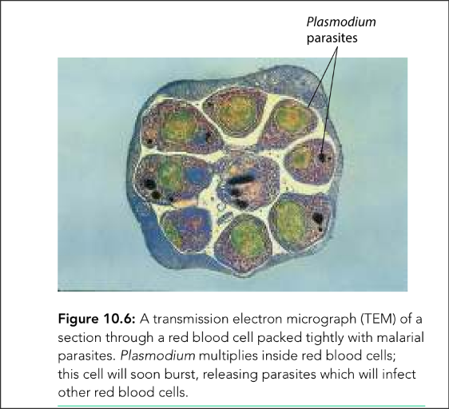

> #### The Malaria Life-cycle (only for extension)
>
> 1. A mosquito infected with malaria bites a human, injecting infective stages of the parasite (sporozoites) into the bloodstream. These travel to the **liver**.
>    受感染的蚊子叮咬人类，将疟原虫的感染阶段（子孢子）注入血液。子孢子随血液进入**肝脏**。
> 2. The parasites invade liver cells, multiply asexually over 6–12 days, then are released into the bloodstream to infect red blood cells.
>    疟原虫侵入肝细胞，进行无性繁殖（约6–12天），随后释放入血液，感染红细胞。
> 3. Inside red blood cells, the parasites mature and multiply every 48–72 hours, causing red blood cells to rupture, which leads to malaria symptoms.
>    在红细胞内，疟原虫每48–72小时成熟并繁殖，导致红细胞破裂，引发疟疾症状。
> 4. Some parasites develop into male and female gametes (sex cells). When another mosquito bites the infected person, it ingests these gametes.
>    部分疟原虫发育为雄性和雌性配子（生殖细胞）。当另一只蚊子叮咬感染者时，会摄入这些配子。
> 5. In the mosquito's stomach, the gametes fuse and undergo sexual reproduction, eventually producing infective stages that migrate to the mosquito's salivary glands, completing the cycle.
>    在蚊子胃中，配子结合并进行有性生殖，最终产生感染阶段（子孢子），移行至蚊子唾液腺，完成生命周期。
>
> 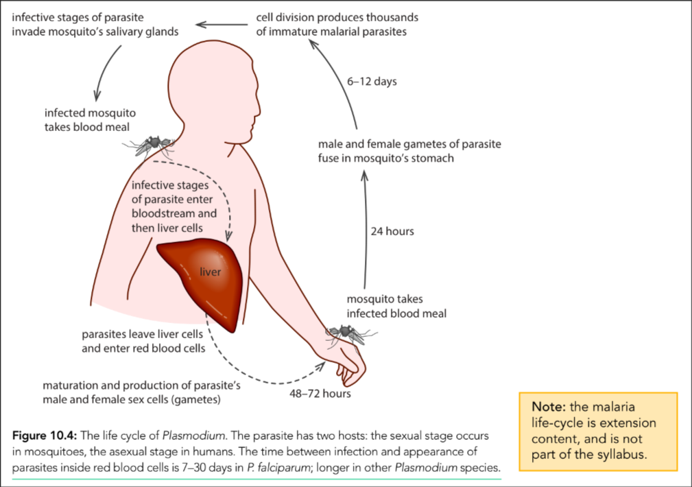

#### Tuberculosis (TB) 肺结核

Caused by: **Mycobacterium tuberculosis, M. bovis** (Bacterium)

Transmission:

> [!NOTE]
>
> 不用的细菌通过两种不同的方式传播

- *Mycobacterium tuberculosis* - **Airborne droplets** from coughing/sneezing (human-to-human)

  > **Air-borne** 空气传播 or **aerosol-borne** 气溶胶 by droplets of liquid in the air
  >
  > When the infected people cough of sneeze, they **expel** droplets of liquid carrying the bacteria, and uninfected people inhale the air with the droplets

- *Mycobacterium bovis* - Via contaminated **meat** or **unpasteurised** **milk** (from cattle) (**Food-borne**)

Symptoms: Cough, chest pain, fever, weight loss

Treatment: Antibiotics, contact tracing, testing

- Use **sererval antibiotics** / **anti-TB drugs** to ensure that all the bacteria are killed
- **DOTS** (direct observation treatment, short course) to make sure that patients take their medicine regularly

Prevention and control:

- **BCG** vaccine 卡介苗（用来预防肺结核的疫苗）
- **pasteurisation** of milk 用巴氏杀菌法对牛奶消毒
- proper cooking of meat
- testing and culling infected cattle
- improved living conditions

##### Disease-causing process

> The bacteria primarily infect lungs

1. Most of the time, the immune system restricts the bacteria's replication and spread. These bacteria can remain **inactive** / **latent** / **dormant** for many years.

   > People with laten TB bacteria:
   >
   > - Symptomless 没有什么症状
   > - Don't spread the bacteria

2. If the immune system is **compromised** / **weakened**, the bacteria will become **active**

   > For example the immune system is weakened by HIV

##### Reasons for Increase of TB Cases / Difficulty of Controlling TB

> 结核病病例增加/结核病控制困难的原因

1. Aerosol borne infection so spread quickly in overcrowded housing
   气溶胶传播，因此在过度拥挤的住房中传播迅速；
2. HIV/AIDS pandemic; infection with HIV and immunodeficiency may activate dormant TB pathogen and make people more susceptible to TB
   HIV/AIDS 大流行；感染 HIV 和免疫缺陷可能激活潜伏的结核病原体，使人更容易感染结核病；
3. TB pathogen can remain latent for many years so it is difficult to diagnose it
   结核病原体可潜伏多年，因此难以诊断；
4. Treatment is long term and many patients do not complete the full course of treatment for TB, which causes some bacteria to develop resistance to drugs
   治疗周期长，许多患者未完成全程治疗，导致部分细菌产生耐药性；
5. Some strains of TB bacteria have been drug-resistant
   部分结核杆菌菌株已具有耐药性；
6. Limited education on TB prevention for general population
   普通民众的结核病预防知识普及不足；
7. Difficult to achieve herd immunity
   难以实现群体免疫。

#### HIV/AIDS 艾滋病

Caused by: **Human Immunodeficiency Virus (HIV)** (Virus)

> - HIV - Human Immunodeficiency Virus 人类免疫缺陷病毒, only contains **single-stranded RNA** as genetic material. It's a type of **retrovirus** 逆转录病毒
> - Retrovirus - 遗传物质是RNA，而不是DNA。在宿主细胞中，RNA会被重新转
> - AIDS - Acquired Immune Deficiency Syndrome 获得性免疫缺陷综合症, it's a collection of other diseases caaused by a compromised immune system following HIV infection.

Transmission: Exchange of body fluids

- sexual contact (through seme and vaginal fluids during unprotected sexual intercourse)
- blood transfusion
- shared needles
- mother to child during birth or breastfeeding

Symptoms: Initial flu-like symptoms, progressing to loss of immune function (AIDS)

Treatment: Antiretroviral drugs, prevention of opportunistic infections

Prevention and control:

- Screening blood donations
- use of condoms/dental dams
- needle-exchange programmes (to **sterile** needles)
- education, contact tracing
- discouraging breastfeeding in high-income settings (context-dependent)

- Anti-retroviral drug therapy / anti-retrociral therapy (ART) can slow down the onset of AIDS
- treat HIV+ pregnant women with anti-retroviral drugs, the children may not have HIV

##### Disease-causing process

1. HIV infects and destroy T-helper lymphocytes and macrophages of immune system and their numbers decrease gradually
2. Compromised immune system
3. Opportunistic infections 机会性感染, e,g, TB, happen

### Antibiotics

> **Antibiotics 抗生素**
>
> - A drig that kills or stops the **growth** of bacteria
> - Treat **bacterial infections**
> - **Do not** affect viruses or human cells

Antibiotics interfere with:

- Cell wall synthesis
- Transcription / mRNA synthesis
- DNA replication / synthesis
- Protein synthesis
- Enzyme action
- Activity of CSM proteins

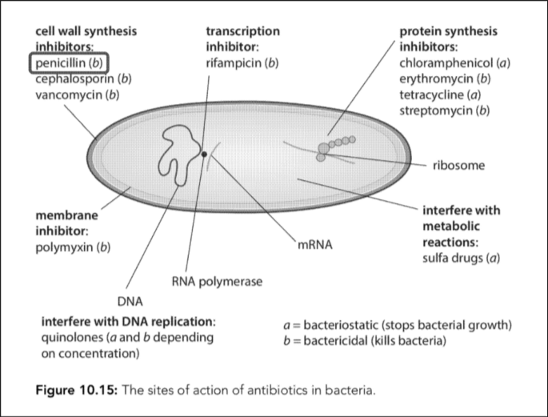

#### Penicillin 青霉素

How penicillin works:

- Penicilin only acts on **growing bacterial cells** 青霉素只对**正在生长的细菌**起效

1. Penicillin **inhibits enzymes** and prevents the synthesis of the **cross-links between peptidoglycan molecules**.
2. To weaken cell wall
3. Cells take up water by osmosis and brust since the cell wall cannot withstand the increased turgor pressure

简而言之，就是通过阻碍酶的方式阻止peptidoglycan的合成，然后削弱细胞膜，然后让它在osmosis的作用下“爆炸”。

#### Antibiotic resistance genes

为了抵抗antibiotic，细菌进化出了几种可以让抗生素无效化的gene：

- Codes for an enzyme catalysing the breakdown of antibiotics

  通过一段DNA（gene）来编码一种enzyme，可以使antibiotic分解的enzyme

- Codes for a cell surface membrane protein that can pump out the antibiotics

  合成可以将antibiotic排出体外的carrier protein

细菌会有resistance是因为自然选择的原因：

1. Random mutation enables a group of bateria can survive under the antibiotics
2. They can pass their gene to next generation / offspring
3. The offsprings then have the ability to survive with antibiotics

> MRSA 奈甲氧西林金色葡萄球菌 - a bacterium resistant to many abtibiotics, such as methicillin and penicillin

Antibiotic resistance genes can be transmitted by **vertical transmission** and **horizontal transmission**.

| Vertiacal transmission                                       | Horizontal transmission                                      |
| ------------------------------------------------------------ | ------------------------------------------------------------ |
| From parent to offspring                                     | Between 2 distinict bateria                                  |
| Via cell division (binary fission 二分裂)                    | Via **conjugation**                                          |
| Occur in the same species                                    | Occur in the same species or different species               |
| 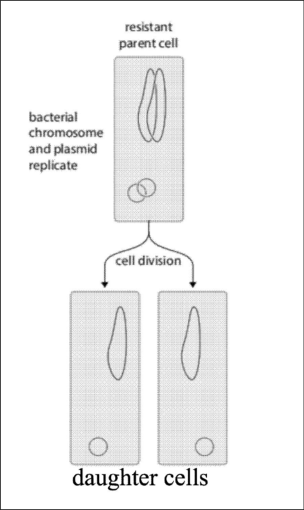 | 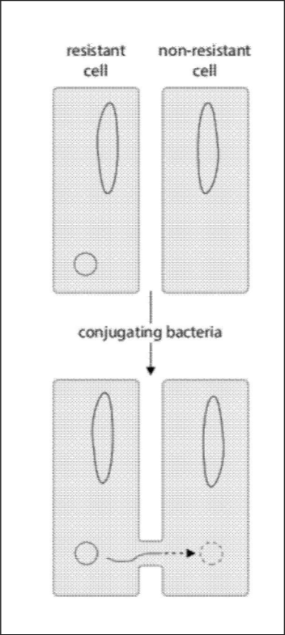 |

> In horizontal transmission, the resistance gene is shared between two bacteria, the gene passes from a donor bacterium to a recipient bacterium.
>
> $$
> \ce{Donor ->[resistance\ gene] Recipient}
> $$
>
> 细菌这种很低等的生物，反而可以像是更换原件一样收集基因和替换基因，所以它们可以很容易做到跨物种（different species）分享免疫基因的事情。

##### Causes

1. **Overuse of antibiotics** – prescribed when not necessary 在不必要时过度用药
2. **Misuse of antibiotics** – used to treat non-bacterial infections, such as viral infections 错误用药
3. **Large-scale use of antibiotics in farming** – to prevent diseases in animals 为了预防细菌大量吃药
4. **Patients failing to complete the full course of antibiotics** – stopping treatment early 没有完成服用抗生素的整个流程

##### Consequences

1. Bacteria may **develop multiple resistance** to different antibiotics and contain several antibiotic resistance genes (e.g., MRSA). 对很多种抗生素产生抗性
2. Resistance genes may **transfer from non-pathogenic bacteria to pathogenic bacteria** through horizontal gene transfer. 让更多其他细菌产生抗性
3. Common antibiotics become **ineffective** against resistant pathogenic bacteria. 常用抗生素不再有效果
4. There is an increased need for the **invention of new antibiotics**. 对新抗生素的需求更大

##### How to Reduce the Development of Antibiotic Resistance

- Use antibiotics **only when appropriate and necessary** – do not prescribe them for viral infections. 仅在必要时用合适的药
- **Avoid using antibiotics in farming** to prevent infections.
- Ensure that **patients complete the full course of antibiotics**.
- Do **not save antibiotics for future use** or share them with others.
- **Avoid wide-spectrum antibiotics**; prefer **narrow-spectrum antibiotics** specific to the infection. 不使用广谱抗生素
- **Use a combination of different antibiotics** to ensure all bacteria are eliminated. 用多种抗生素确保有一些有抗性的细菌也被清除了
- **Rotate the type of antibiotics prescribed** for certain diseases – avoid always using the same antibiotic. 定期更换使用的抗生素

*(Additional measures may include public education, improved diagnostics, and global monitoring of resistance.)*

## Chapter 11 - Immunity

### Chapter Outline

- The Immune System
  - Antigens
  - Primary immune response
    - Mode of action of phagocytes
    - B-lymphocytes
    - T-lymphocytes
  - Memory cells in secondary immune response & long-term immunity
  - Types of immunity
- Antibodies & Vaccination
  - Structure and function of antibodies

### Key Terms

**Pathogen** 病原体 - An organism (e.g., bacterium, virus, fungus) that causes disease.

**Antigen** 抗原 - Any substance (often a protein or glycoprotein) that the body recognizes as foreign ("non-self") and which stimulates a specific immune response.

- **Self Antigen** 自身抗原 - Antigens that belong to the body's own cells; they do not normally stimulate an immune response. 不会有免疫反应
- **Non-self Antigen** 非自身抗原 - Antigens that are foreign to the body (e.g., from pathogens, incompatible blood cells); they stimulate an immune response. 会产生免疫反应

**Primary Immune Response** 初次免疫应答 - The body's first, slower and less intense adaptive immune response to a specific antigen.

**Secondary Immune Response** 二次免疫应答 - The faster, stronger, and more prolonged adaptive immune response upon re-exposure to the same antigen, due to immunological memory.

**(Blood) Antibody** (血液)抗体 - A protein produced by the immune system (specifically B cells) in response to a specific antigen, which can bind to and help neutralize or mark that antigen for destruction.

### Defence Against Disease

**External defence system** - 防止pathogens进入身体的保护措施

- The ciliated epithelium in the airway
- Hydrochloric acid in the stomach
- Blood clotting mechanism stops the loss of blood and prevents the entry of pathogens through wounds in the skin.

**Internal defence system** - 身体内部对pathogens做出的反应

- Phagocytes
- Lymphocytes

> Internal defence system主要是由红细胞做出反应

#### Three Lines of Defense Against Pathogens by the Immune System

**Non-specific immune responses** - Act uniformly against all pathogens, regardless of their different antigens. *非特异*性指不管在什么情况下的反应都一样。

**Specific immune responses** - Target specific antigens. 识别*抗原*

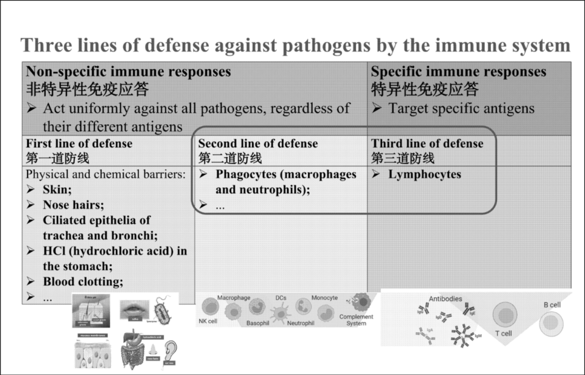

> 第二道防线：**Phagocytes**（无差别吞噬别的pathogens）
>
> 第三道防线：**Lymphocytes**（产生免疫反应）

There are two types of WBCs (Leukocytes):

- **Phagocyte** - 吞噬pathogens的白细胞, engulf and destroy yhe pathogens
  - **monocyte** (**macrophage**) - A circulating phagocyte that can migrate into tissues,

    > Monocytes travel in blood vessel, them will develop into macrophages once they leave the blood, and settle in the organs. (Such as the liver, lungs, and spleen)

  - **neutrophil** - The most abundant, fast-acting phagocyte.

- **Lymphocyte** - Cells responsible for the specific, adaptive immune response
  - B-lymphocytes (B cells) - Produce antibodies (B → anti**b**odies)
  - T-lymphocytes (T cells) - Coordinate immune responses and kill infected cells (T → **t**arget)
    - T-helper cells - Orchestrate the immune response by activating B cells, T cells, and macrophages
    - T-killer cells - Directly destroy infected or cancerous host cells

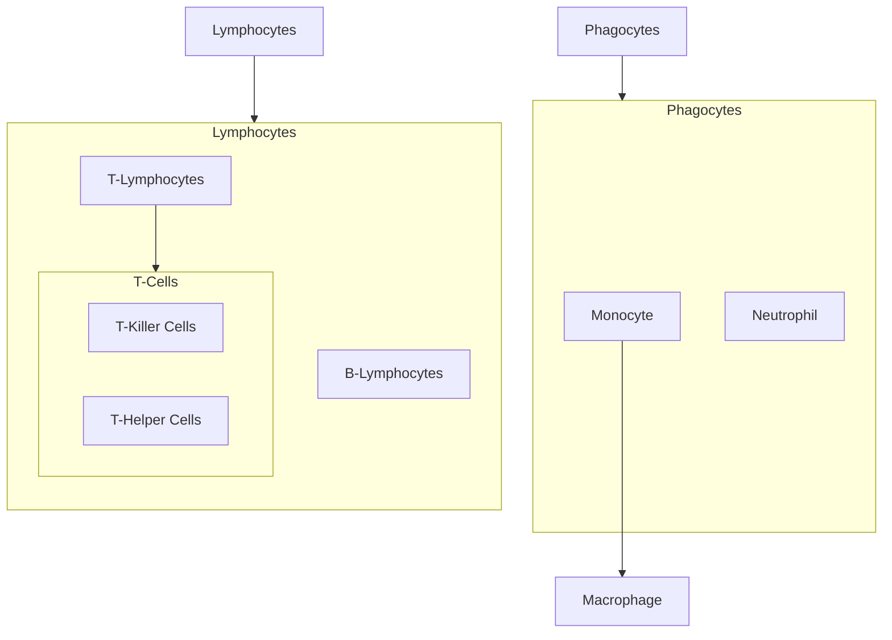
```mermaid
flowchart TD
    %% 使用英文名称避免编码问题
    P[Phagocytes]
    L[Lymphocytes]
    M[Monocyte]
    Mac[Macrophage]
    N[Neutrophil]
    B[B-Lymphocytes]
    T[T-Lymphocytes]
    TK[T-Killer Cells]
    TH[T-Helper Cells]

    subgraph SG_P[Phagocytes]
        direction LR
        M
        N
    end

    subgraph SG_L[Lymphocytes]
        direction TB
        subgraph SG_T[T-Cells]
            direction LR
            TK
            TH
        end
        B
        T
    end

    P --> SG_P
    L --> SG_L
    T --> SG_T
    M --> Mac
```

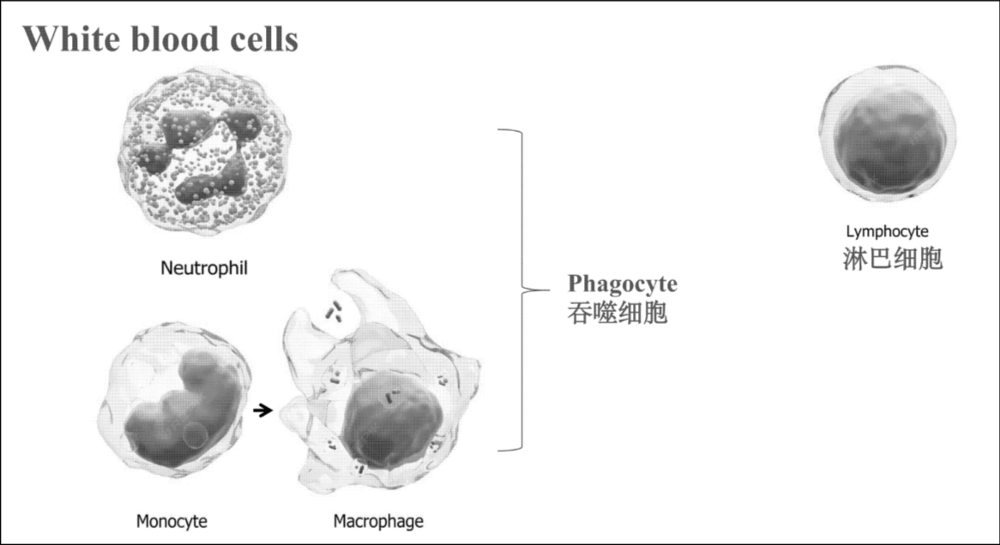

#### During a Primary Immune Response

| **Non-specific immune response (非特异性免疫应答)**                                      | **Specific immune response (特异性免疫应答)**                                                                                                                                                    |
| :--------------------------------------------------------------------------------------- | :----------------------------------------------------------------------------------------------------------------------------------------------------------------------------------------------- |
| **Phagocytes (吞噬细胞):** <br> ① Macrophages (巨噬细胞) <br> ② Neutrophils (中性粒细胞) | **Lymphocytes (淋巴细胞):** <br> ① B-lymphocytes (B细胞) <br> ② T-lymphocytes (T细胞): <br> • T-helper cells (辅助性T细胞) <br> • T-killer cells / T-cytotoxic cells (杀伤性T细胞/细胞毒性T细胞) |
| **Mode of action (作用方式):** <br> Phagocytosis (bulk transport) <br>                   | **Action:** <br> • Clonal selection (克隆选择) <br> • Clonal expansion (克隆扩增) <br> • Production of memory cells (记忆细胞的产生)                                                             |

Immune Response发生的顺序：

1. Phagocytosis
2. Antigen presentation (expression of antigens on phagocyte cell surface)
3. T-helper cell activation and production of T-killer cells
4. Activation of B-lymphocyte to produce plasma cells and memory cells
5. Production and release of antibodies

#### Mode of Action of phagocytes (Macrophages and neutrophils)

1. **Attraction** - Pathogens会产生一些化学物质，被pathogens攻击的细胞也会产生一些化学物质（例如组胺*histamine*）。这些化学物质会吸引phagocytes前往被infect的地方。

   > **Chemotaxis** - Use to describe the movement towards a chemical stimulus.
   >
   > **Histamine** - The chemical substance that is released by the under attacked body cells.

   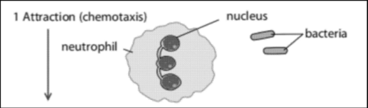

2. **Detection / Recognition and attachement** - The phagecyte **detects** pathogen / **recognises** antigen.

   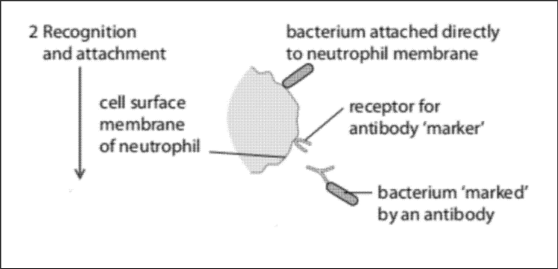

3. **Phagocytosis / endocytosis** - The phagocyte **engulfs** the pathogen to form a **phagocytic vacuole** / **phagosome**

   > **phagocytic vacuole** / **phagosome** - the pathogen inside the phagocyte

   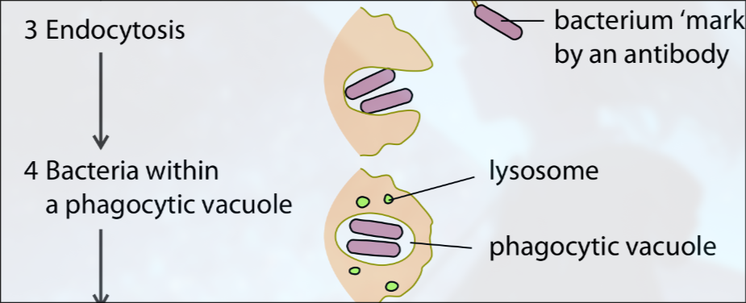

4. **Fusion of lysosomes and phagocytic vacuole** - Use digestive enzymes in lysosomes to break down the pathogen.

   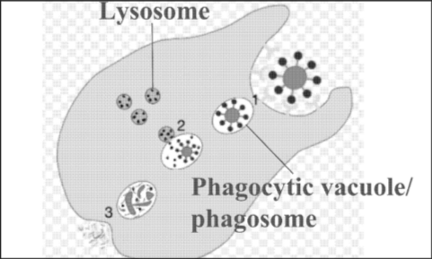

- Macrophage cuts the pathogen up and presents antigens on its cell surface membrane. (antigen presentation)
- Neutrophil kills pathogensand then die (一次性的)

This response is **not specific**.

> **Summary**
>
> 1. Macrophage is attracted to infection site by chemotaxis.
> 2. It **detects** pathogen/recognizes antigen.
> 3. It **engulfs** the pathogen to form a phagocytic vacuole/phagosome.
> 4. Lysosomes fuse with the phagocytic vacuole.
> 5. Digestive/hydrolytic enzymes from the lysosomes digest the pathogen.
> 6. Antigen presentation.
> 7. The response is **non-specific**.

在最后有个Antigen Presentation的环节，能够展示抗原的细胞被称作**Antigen-presenting cells**，其中包括：

- Macrophages
- B cells
- Dendritic cells
- Some infected body cells

#### B Cells - Produce Antibodies

There are many B cells in the body, each type of B cell can make one type of antibody molecule, and each type of antibody molecule has a **shape complementary** and **specific** to a particular antigen.

> **Clone** - a small group of idntical cells
>
> **Antibody** - globular, glycoprotein, also known as **immunoglobulin**

Each type of B cell has **cell surface antibody receptors** (fdifferent to the *cell surface receptor* on the T cells), which is complementary and specific to a particular antigen.

There is a small clone for each type of B cells in the body.

##### Primary Immune Response - Action of B cells

1. **Clonal Selection** 克隆选择

   B cells that have cell surface antibody receptors complementary and speficic to the antigen recognize and bind to the antigen.

   B cell上的receptor会识别antigen。Pathogen上的antigen会激活一组特定的B cells，用来抵抗特定的pathogen。

2. **Clonal Expansion** 克隆扩增

   These B cells divide by mitosis to increase the number.

   通过mitosis增加自身的数量。这样子会有更多能够专门对付pathogen的B cell。

3. **Formation of Plasma Cells, Antibodies and Memory Cells**

   Some of the cells develop into plasma cells to secrete antibodies, others into memory B cells.

> **Plasma Cell**
>
> - Has a large proportion of Rough RE. for protein synthesis
> - Contains large amount of mitochondria to produce ATP for protein synthesis, movement of Golgi vesicles and exocytosis.

#### T Cells - Coordinate Immune Responses

There are many T cells in the body， each type of T cell has **cell surface receptorts**, complementary and specific to a particular antigen.

The is a small clone for each type of T cells in the body.

There are two types of T cells:

- T-helper cells
- T-killer cells / T-cytotoxic cells

##### Primary Immune Response - Action of T cells

1. **Antigen presentation** by APCs

2. **Clonal Selection**

   The cell surface receptors on the T cell can bind to the antigen.

3. **Clonal Expansion**

   Divide in mitosis, to increase the total number of t cells

4. T-killer cells and T-helper cells have different response
   1. T-Helper cells **secrete cytokines** to stimulate <u>strong activity of macrophages</u> and responses <u>of B cells and T-killer cells</u>.
   2. T-killer cells **produce toxins** to punch holes in the cell surface membrane of infected body cells and **kill** infected body cells

5. **Memory cells** are formed

   > Memory cells are T-helper and T-killer cells.

T-helper cell产生的cytokines可以使macrophage更加活跃，并且产生更多的B cells和T-killer cells.

#### Memory Cells

当pathogen第一次进入身体时，会发生primary immune response，然后再发生secondary immune response.

其中Plasma cells, antibodies, cytokines, and toxins这些由T-killer产生的细胞只能存在一小段时间（**Short-lived**）

而memory cell（memory B cells, memory T-helper cells, and memory T-killer cells）的存活时间长（**long-lived**），可以提供long-term immunity并且能让secondary immune response更加迅速。

| Short-lived components                                    | Long-lived components (Memory Cells)                                   |
| :-------------------------------------------------------- | :--------------------------------------------------------------------- |
| Plasma cells                                              | Memory B cells                                                         |
| Antibodies                                                | Memory T-helper cells                                                  |
| Cytokines                                                 | Memory T-killer cells                                                  |
| Toxins produced by T-killer cells                         |                                                                        |
| **Function:** Immediate response, cleared after infection | **Function:** Provide long-term immunity & enhanced secondary response |

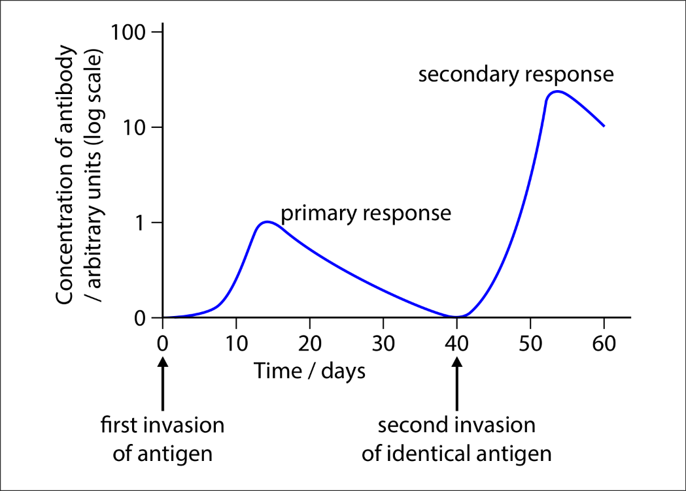

- Primary Immune Response: **Slower** and **weaker**

  Individuals develop symptoms and become ill

- Sceondary Immune Response: **Faster** and **stronger**

  Individuals **don't** develop symptoms or become ill

| Aspect                   | Primary Response | Secondary Response      |
| :----------------------- | :--------------- | :---------------------- |
| **Speed**                | Slower           | Faster                  |
| **Strength**             | Weaker           | Stronger                |
| **Antigen experience**   | First exposure   | Re-exposure             |
| **Memory cells present** | No               | Yes (from 1st exposure) |
| **Symptoms/Illness**     | Yes              | No (protected)          |

> [!NOTE]
>
> The reason of why people are often ill for several weeks after they catch a disease, even though they can make antibodies against the disease:
>
> *<u>The **primary immune response** to an antigen is slow</u>. It takes time for the immune system to:*
>
> 1. **Recognize** the antigen
> 2. Undergo **clonal selection** and **clonal expansion** of specific B and T cells
> 3. **Produce enough antibodies** to effectively fight the infection
>
> The infected people may have symptoms during this period.

> [!NOTE]
>
> 为什么当感染一个pathogen后不会对其他的pathogen产生免疫：
>
> - B and T cells have **cell surface receptors complementary** and **specific** to antigen.
> - Different antigens have different shapes, they stimulate different B and T cells.
> - Different antibodies are produced for different antigens.
> - Memory cells for one antigen won't respond to a different antigen.

### Types of Immunity

**Active Immunity** (Long-term) - Produce **antibodies and memory cells**

- Natural Active Immunity - Acquired through natural **infection** by a pathogen
- Artificial Active Immunity - Acquired through **vaccination**

**Passive Immunity** (Short-term) - Receiving **ready-made antibodies** from another source

- Natural - Mother to baby
- Artificial - Injection of antibodies

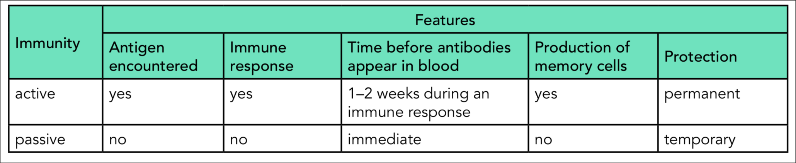

> Colostrum 初乳 - 可以为刚出生的婴儿提供antibiotics的母乳

> **Summary**
>
> - **Active immunity** = body makes its own antibodies and memory → long-term protection.
> - **Passive immunity** = body receives antibodies from outside → immediate but temporary protection.

### Antibodies

#### Structure

\*Also known as **Immunoglobulins (Ig)\***

- Globular protein (hydrophillic R groups outside the surface)
- Has glycoproteins (to identify the antigens)
- Have quaternary strucutre (made of multiple chains)
- 4 polypeptide chains (2 long / heavy chains, and 2 short / light chains)
- **4 disulfide bonds** hold the chains together
- Each polypeptide chain has a constant region and variable region
  - Constant region has the same shape for different types of antibodies
  - Variable region has different amino acid sequences in different antibodies
- Phagoctes have cell surface receptors sepcific to the constant regions
- The **hinge region** gives **flexibility** to the antibody molecule to bind to antigens.

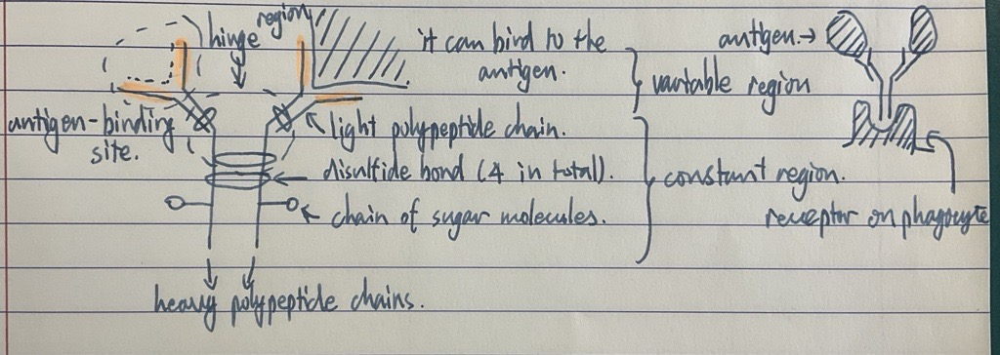

#### Functions

1. 和病毒combine到一起，让病毒无法进入host cell
2. Attach到病毒的flagella上，让它们不方便移动
3. 把许多antigen固定在一起，让它们无法自由移动
4. 和其他物体组合在一起，用于破坏细菌的细胞壁
5. 包裹细菌，让phagocyte更容易吞噬
6. 与toxins连接到一起，使它们harmless

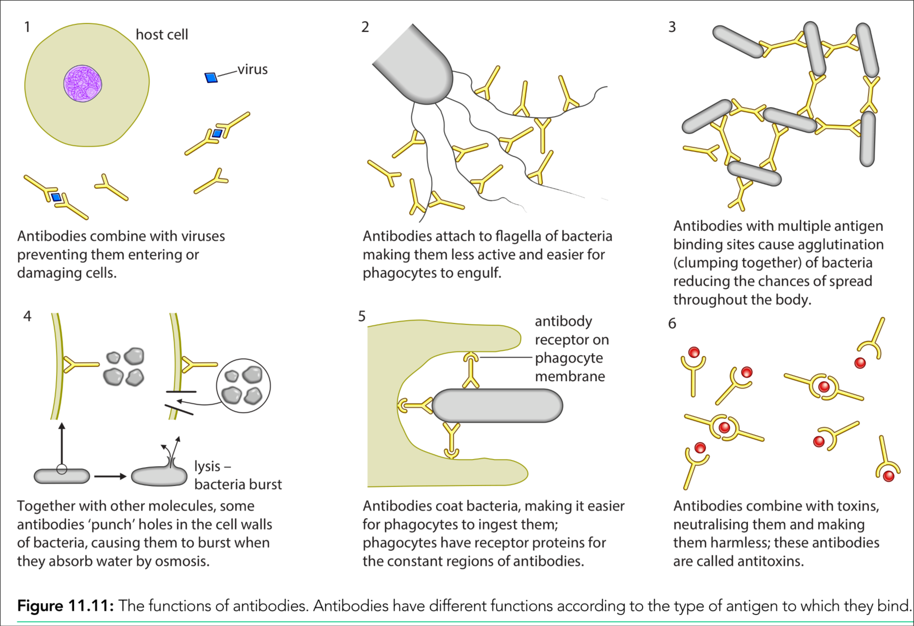

#### Monoclonal Antibodies

> Abbreviation: Mabs

**Monoclonal antibodies** are antibodies that are all **identical** to each other and specific to one antigen.

> `-mab`结尾的antibody一般都是monoclonal antibodies，例如：trastuzumab. ipilimumab, infliximab...

**Hydridoma method:**

- Hydridoma cell 杂交癌细胞 is made by the fusion of **plasma cell / B-lymphocytes** and **cancer / myeloma cell**
- Hydridoma cell is immortal and can secrete Mabs and divide by mitosis continually

> [!TIP]
>
> How to confirm the **absence** of antigen by the addition of monoclonal antibody?
>
> ANS: *No binding of monoclonal antibody to the antigen*

##### Keywords

**monoclonal antibodies** 单克隆抗体 - Antibodies that are all identical and specific to a single antigen 所有抗体都相同且只针对一种抗原的抗体

**antigen** 抗原 - A substance that triggers an immune response 能引发免疫反应的物质

**plasma cell** 浆细胞 - A white blood cell that secretes antibodies 分泌抗体的白细胞

**myeloma cell** 骨髓瘤细胞 - A type of cancerous immune cell that divides continuously 一种能持续分裂的癌变免疫细胞

**hybridoma** 杂交瘤 - A cell made by fusing a plasma cell with a myeloma cell 由浆细胞和骨髓瘤细胞融合而成的细胞

**immortal** 永生的 - Describes cells that can divide indefinitely 指细胞能够无限分裂
**fermenter** 发酵罐 - A vessel used for the large-scale growth of cells 用于大规模培养细胞的容器

**spleen** 脾 - An organ where immune cells like plasma cells are located 储存浆细胞等免疫细胞的器官

**screen** 筛选 - To test and select for a specific characteristic 测试并选择具有特定特性的对象

**clone** 克隆 - To generate identical copies of a cell 生成细胞的完全相同的复制体

##### The Production of Monoclonal Antibodies

1. Introduce antigen into a small mammal
2. Allow time for immune response to occur
3. Isolate / remove plasma cells from the spleen
4. Fuse plasma cells with myeloma / cancer cells to make hydridoma cells
5. Screen for hydridoma cell that produces desired antibody and clone it
6. Grow these hydridoma cells in a fermenter for large-scale production of Mabs

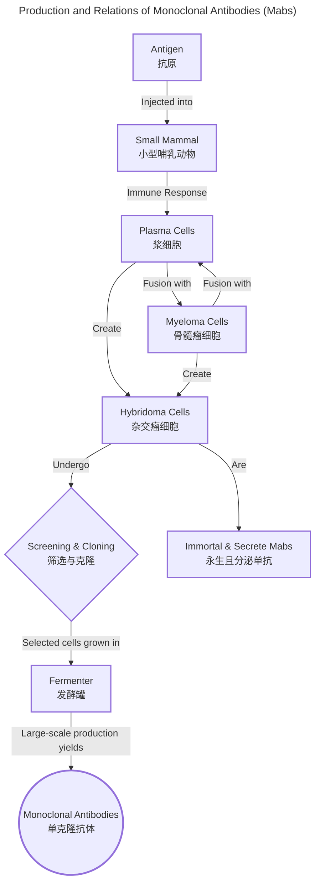
```mermaid
---
title: Production and Relations of Monoclonal Antibodies (Mabs)
---
flowchart TD
    %% Define nodes
    A[Antigen<br>抗原]
    M[Small Mammal<br>小型哺乳动物]
    PC[Plasma Cells<br>浆细胞]
    MC[Myeloma Cells<br>骨髓瘤细胞]
    H[Hybridoma Cells<br>杂交瘤细胞]
    S{Screening & Cloning<br>筛选与克隆}
    F[Fermenter<br>发酵罐]
    Mabs((Monoclonal Antibodies<br>单克隆抗体))

    %% Define relations and process flow
    A -- Injected into --> M
    M -- Immune Response --> PC
    PC -- Fusion with --> MC
    MC -- Fusion with --> PC

    PC & MC -- Create --> H

    H -- Are --> I[Immortal & Secrete Mabs<br>永生且分泌单抗]

    H -- Undergo --> S
    S -- Selected cells grown in --> F
    F -- Large-scale production yields --> Mabs

    %% Styling
    classDef process stroke-width:2px
    classDef entity stroke-width:2px
    classDef output stroke-width:3px

    class A,M,PC,MC,H,F,S process
    class I entity
    class Mabs output
```

#### Diagnosis process

- Blood typing and pregnancy test
- Identify the exact strain of a virus or bacterim
- Tagged with a radioactive chemical to make **radioactively** labeled Mabs 通过添加放射性的化学物质，来定位不同物体的位置
  - To locate the position of blood clots 定位血栓
  - To locate cancer cells 定位癌细胞

#### Treatment

- Bind to antigens on **CSM of diseased cells** or **surface of pathogens** and mark them out
- The immune system, e.g. phagocytosis, is stimulated to **kill theses marked cells and pathogens**.
- Attach drug to Mabs to treat / kill diseased cells

> Each type of monoclonal antibody is **specific** to a **treatment** / **therapy**

#### Problems

- Mabs only can remain in body for a short period of time → the patients need to be administered more than once
- Cause side-effects
- Mabs may be recognised as foreign and trigger immune response to the Mabs

---

##### Solutions

- Alter the genes for polypeptide chains, so they can code for **human amino acid sequences**

  修改polypeptide chain

- Change the type and position of sugar chains, so they can match the arrangement in human antibodies.

  修改糖的位置

### Vaccine

> A **vaccine** is a preparation containing antigens which is used to stimulate an immune response artificially.
>
> 用于主动触发免疫系统的“预制antigen”

Vaccines contain antigens that stimulate immune responses to provide lone-term immunity

It may contain a whole live microogranism, a dead one, an attenuated organism, or a harmless form of a toxin (toxoid).

> Attenuated 减毒的 - artificial weakened in the lab

Some vaccines can provide lifetime protection *终生保护*

Less effective vaccines may need booster injections *加强针* to stimulate secondary responses.

#### Vaccination Programmes

It can help to control the spread of infection diseases.

- Herd immunity 群体免疫 - a large proportion of population, this provide protection for those unvaccinated people as no one around them can pass the pathogen on.
- Ring immunity - vaccinating all those people in contact with a person infected with a specific disease to prevent the spread of disease in the immediate area and into the wider population

The transmission of the pathogen is reduced by vaccination.

> How the vaccination programmes works：
>
> 1. Stimulate primary immune response in the body
> 2. Memory cells are produced
> 3. Provide long-term immunity and faster secondary immune response
> 4. Obtain artificial active immunity
> 5. Pathogens cannot lice and reproduce in vaccinated people
> 6. Transmission of the pathogen is reduced.

## Practical Exam

### How to draw a table to record the result

- Put the unit in the title field, to avoid the repeating unit in data field

| Concentration of copper sulfate / % | Number of drops of P |
| ----------------------------------- | -------------------- |
| 0.0625                              | 7                    |
| 0.125                               | 7                    |
| 0.25                                | 9                    |
| 0.5                                 | 17                   |
| 1.0                                 | 21                   |

- 将自变量放在左边

如果每一个试验重复三次：

- 需要记录所有读数，每一次的度数需要在表的右边增加一列
- 最后需要计算平均，并放在最后一列
- 也就是说如果重复三次的话，需要有5列

**Anomalous Value** 异常值 - 不符合整体规律的数值

---

画折线图时，通过`x`来标点。

折线图没有提到用best fit时，直接用折线就行了。

折线的range不能超过数据的然为## Organelles

- microvilli 微绒毛 - Increase the surface area
- Golgi vesicle 高尔基体的运输小泡
- Golgi apparatus 高尔基体 - Collects and processes molecules within the cell
- microtubules 微管 - 形成纤毛，运输内部物质
- ribosomes 核糖体 - protein synthesis
- lysosome 溶酶体 - breakdown (digestion) of unwanted substances and structures such as old organelles or even whole cells
- smooth endoplasmic reticulum - makes lipids and steroids
- mitochondrion - carry out aerobic respiration
- cytoplasm - all the living material outside the nucleus
- rough endoplasmic reticulum - covered with ribosomes
- nucleus
  - nuclear envelope 核被膜 - Controls what large molecules can go in or out of the cell
  - nucleolus 核仁 - made of loops of DNA from serval chromosome
  - chromatin 染色质 - 很多个chromatin会组成chromosome
  - nuclear pore 核孔 - allow and control exchange between the nucleus and the cytoplasm
- centrosome 中心体
- cell membrane 细胞膜
- chloroplast 叶绿体
  - envelope 被膜 - Increase the surface area
  - grana 基粒 - Increase the surface area
- vacuole 液泡
  - tonoplast 液泡的膜 - semi-permeable
  - cell sap 液泡内的液体 - contains water, enzyme, salt or sugar etc.
- cell wall 细胞壁
- plasmodesma 胞间连丝 - Connections between plant cells
- middle lamella 中胶层 - Sticks two cells together
- protoplasm 原生质 - all living materials within a cell

---

### Overview

| 细胞器名称     | Organelle Name      | 主要功能                             | 备注 / 更详细的解释                                                            |
| :------------- | :------------------ | :----------------------------------- | :----------------------------------------------------------------------------- |
| **微绒毛**     | **Microvilli**      | 增加表面积以利于吸收                 | 是细胞膜指状突起，常见于小肠上皮细胞等。                                       |
| **高尔基小泡** | **Golgi Vesicle**   | 运输分子                             | 由高尔基体或内质网出芽形成，负责在细胞内部或向细胞外运输物质。                 |
| **高尔基体**   | **Golgi Apparatus** | 收集、加工、分选和运输细胞内的分子   | 像细胞的“邮局”，对蛋白质进行加工（如糖基化）和包装。                           |
| **微管**       | **Microtubules**    | 维持细胞形态、细胞内运输、形成纺锤体 | 细胞骨架的重要组成部分，为物质运输提供轨道，也是纤毛、鞭毛和中心体的核心结构。 |
| **核糖体**     | **Ribosomes**       | 蛋白质合成                           | 由rRNA和蛋白质组成，有些游离在细胞质中，有些附着在内质网上。                   |
| **溶酶体**     | **Lysosome**        | 分解（消化）不需要的物质和结构       | 内含水解酶，能分解病原体、衰老的细胞器等，是细胞的“回收站”。                   |
| **滑面内质网** | **Smooth ER**       | 脂质合成与解毒                       | 合成磷脂、固醇等脂类，并在肝细胞中降解毒素，储存钙离子。                       |
| **线粒体**     | **Mitochondrion**   | 进行有氧呼吸，产生ATP                | 细胞的“动力工厂”，拥有自己的DNA，能半自主复制。                                |
| **细胞质**     | **Cytoplasm**       | 细胞代谢活动的主要场所               | 包含细胞质基质和除细胞核以外的所有细胞器。                                     |
| **粗面内质网** | **Rough ER**        | 蛋白质的合成与初步加工               | 因其膜上附着核糖体而显得“粗糙”，负责合成膜蛋白和分泌蛋白。                     |
| **细胞核**     | **Nucleus**         | 储存遗传信息（DNA），控制细胞活动    | 细胞的“指挥中心”。                                                             |
| ↳ 核被膜       | ↳ Nuclear Envelope  | 控制大分子在核质与胞质之间的交换     | 由双层膜构成，将核物质与细胞质分隔开。                                         |
| ↳ 核仁         | ↳ Nucleolus         | 合成rRNA并组装核糖体亚基             | 核内最明显的结构，由DNA、RNA和蛋白质组成。                                     |
| ↳ 染色质       | ↳ Chromatin         | 是遗传物质DNA的载体                  | 是DNA和组蛋白的复合物，细胞分裂时会高度螺旋化凝聚成染色体。                    |
| ↳ 核孔         | ↳ Nuclear Pore      | 允许和控制核质与胞质间的交换         | 核被膜上的复杂蛋白质通道，允许mRNA、蛋白质等选择性通过。                       |
| **中心体**     | **Centrosome**      | 细胞分裂时组织微管形成纺锤体         | 动物细胞的微管组织中心（MTOC），包含一对中心粒。                               |
| **细胞膜**     | **Cell Membrane**   | 控制物质进出细胞、细胞识别和信息传递 | 磷脂双分子层构成的基本骨架，具有选择透过性（流动镶嵌模型）。                   |
| **叶绿体**     | **Chloroplast**     | 进行光合作用，将光能转化为化学能     | 植物细胞特有，拥有自己的DNA。                                                  |
| ↳ 被膜         | ↳ Envelope          | 控制叶绿体内外物质交换               | 由双层膜组成。                                                                 |
| ↳ 基粒         | ↳ Grana             | 增大膜面积，提高光能捕获效率         | 由类囊体堆叠而成，是光合作用光反应的场所。                                     |
| **液泡**       | **Vacuole**         | 储存水分、养分、废物，维持细胞膨压   | 在植物细胞中非常发达，中央大液泡是其特点。                                     |
| ↳ 液泡膜       | ↳ Tonoplast         | 控制液泡内外物质交换                 | 具有选择透过性的单层膜。                                                       |
| ↳ 细胞液       | ↳ Cell Sap          | 液泡内的液体，含有各种物质           | 含有水、酶、无机盐、糖类、色素等。                                             |
| **细胞壁**     | **Cell Wall**       | 为细胞提供结构支持和保护             | 植物细胞特有，主要成分是纤维素，位于细胞膜外方。                               |
| **胞间连丝**   | **Plasmodesma**     | 连接相邻植物细胞，进行物质和信息交流 | 穿越细胞壁的细胞质通道，使植物细胞连成一个整体。                               |
| **中胶层**     | **Middle Lamella**  | 粘合相邻的植物细胞                   | 主要成分是果胶，是细胞分裂时最早形成的分隔部分。                               |
| **原生质**     | **Protoplasm**      | 构成细胞生命活动的全部物质           | 一个生命术语，指代细胞中全部的生命物质，包括细胞膜、细胞质和细胞核。           |

---

#### **一、 通用细胞器（在动植物细胞中常见）**

##### **1. 细胞膜 (Cell Membrane)**

- **位置**： 包裹整个细胞的最外层，是细胞的边界。
- **形状特征**： 极薄的一层膜，具有流动性（像肥皂泡的表面，但更复杂）。
- **形状如何帮助功能**： 其流动的、“油性”的双层结构（磷脂双分子层）使得水和油性物质都无法自由通过，从而有效地控制了物质的进出。上面镶嵌的蛋白质就像“门”和“泵”。
- **科学解释**： 由磷脂双分子层和嵌插其中的蛋白质构成的半透膜，称为“流动镶嵌模型”。主要负责控制物质交换、细胞识别和信息传递。
- **通俗解释**： **细胞的“看门人”或“国境线”**。它决定什么物质可以进入细胞，什么废物可以排出，保护细胞内部不受外界干扰。
- **如何协作**： 它与所有细胞器协作，为它们提供稳定的内部环境。它通过胞吞作用将物质送入细胞形成囊泡，这些囊泡可以与其他细胞器（如溶酶体）融合。

##### **2. 细胞质 (Cytoplasm)**

- **位置**： 填充在细胞膜和细胞核之间的整个区域。
- **形状特征**： 胶状、透明的液体物质。
- **形状如何帮助功能**： 其胶状质地为细胞器提供了支撑和悬浮的介质，使得物质可以通过扩散在细胞内运输。
- **科学解释**： 细胞质是细胞内除细胞核以外的原生质部分，由**细胞质基质**和嵌入其中的**细胞器**组成。
- **通俗解释**： **细胞的“汤”或“工厂车间”**。所有细胞器都“漂浮”在这碗汤里，在这里进行着各种化学反应。
- **如何协作**： 它是所有细胞活动的场所，为细胞器之间的物质运输提供了介质。

##### **3. 线粒体 (Mitochondrion)**

- **位置**： 漂浮在细胞质中。
- **形状特征**： 通常呈杆状或颗粒状，有内外两层膜，内膜向内折叠形成**嵴**，大大增加了内部表面积。
- **形状如何帮助功能**： 大量的嵴为进行有氧呼吸的酶提供了巨大的附着表面，就像给工厂增加了无数个工作台，极大地提高了能量生产效率。
- **科学解释**： 进行**有氧呼吸**的主要场所，将糖类等有机物中的化学能转化为细胞直接利用的能量货币——**ATP**。
- **通俗解释**： **细胞的“动力工厂”或“发电站”**。它为细胞的各种活动提供能量。
- **如何协作**： 为需要能量的所有细胞活动提供ATP，例如为核糖体合成蛋白质、高尔基体加工物质提供能量。

##### **4. 核糖体 (Ribosomes)**

- **位置**： 有些游离在细胞质中，有些附着在内质网上。
- **形状特征**： 微小的颗粒状，不是膜结构细胞器，由RNA和蛋白质构成。
- **形状如何帮助功能**： 其微小的颗粒结构可以大量分布在细胞中，同时与mRNA和tRNA高效结合，快速合成蛋白质。
- **科学解释**： 合成蛋白质的场所。根据从细胞核来的指令（mRNA），将氨基酸组装成蛋白质链。
- **通俗解释**： **细胞的“蛋白质合成工厂”或“装配机器”**。
- **如何协作**： 游离核糖体合成细胞内部使用的蛋白质；附着在内质网上的核糖体合成用于分泌或嵌入膜的蛋白质。它的工作指令（mRNA）来自细胞核。

##### **5. 内质网 (Endoplasmic Reticulum, ER)**

这是一个连续的膜系统，分为两种：

- **粗糙内质网 (Rough ER)**
  - **位置**： 与细胞核核膜相连。
  - **形状特征**： 扁平囊状和管状结构，膜的外表面附着大量的核糖体，因此看起来“粗糙”。
  - **科学/通俗解释**： 因为附着核糖体，所以是**蛋白质合成、加工和折叠**的场所。 newly合成的蛋白质在这里被修饰并运输到高尔基体。可以看作是 **“蛋白质的初级加工车间”**。

- **平滑内质网 (Smooth ER)**
  - **位置**： 与粗糙内质网相连，但无核糖体附着。
  - **形状特征**： 分支管状结构，表面光滑。
  - **科学/通俗解释**： 合成**脂质**（包括磷脂和固醇）、解毒有害物质、储存钙离子。在肌肉细胞中特化为**肌质网**储存钙离子。可以看作是 **“脂质合成和解毒车间”**。

- **如何协作**： 接收来自核糖体的蛋白质或自行合成脂质，然后将这些物质包裹在**囊泡**中运输给高尔基体进行下一步加工。

##### **6. 高尔基体 (Golgi Apparatus)**

- **位置**： 通常位于细胞核附近，内质网的下游。
- **形状特征**： 由一系列扁平的膜囊（潴泡）堆叠而成，周围有许多小泡。
- **形状如何帮助功能**： 扁平的囊堆结构像一条流水线，物质可以从一端进入，在移动过程中被逐步修饰、分类和包装，最后从另一端排出。
- **科学解释**： 对来自内质网的蛋白质和脂质进行**加工、分类、包装和运输**。例如为蛋白质添加上糖链（糖基化），形成溶酶体。
- **通俗解释**： **细胞的“邮局”或“包装分发中心”**。它给产品贴上“地址标签”，然后把它们打包发送到正确的地点（如细胞膜或溶酶体）。
- **如何协作**： 接收来自内质网的运输小泡（Golgi vesicle），加工后形成新的分泌小泡，这些囊泡可以与细胞膜融合释放内容物，或形成溶酶体。

##### **7. 溶酶体 (Lysosome)**

- **位置**： 由高尔基体断裂产生，散布在细胞质中。
- **形状特征**： 小型囊泡状，由单层膜包被。
- **形状如何帮助功能**： 囊泡结构将其内部强大的消化酶与细胞质隔开，防止细胞自我消化。只有在需要时才会与食物泡或衰老的细胞器融合。
- **科学解释**： 内含多种**水解酶**，能分解蛋白质、核酸、脂质等大分子。功能是消化吞入细胞的细菌、衰老的细胞器，并在细胞凋亡中起作用。
- **通俗解释**： **细胞的“回收站”或“消化车间”**。它负责分解废物并回收有用的原料。
- **如何协作**： 与来自细胞膜的**内吞泡**融合形成食物泡进行消化；与衰老的**线粒体**等细胞器融合并将其降解（自噬作用）。

##### **8. 中心体 (Centrosome)**

- **位置**： 通常位于细胞核附近。
- **形状特征**： 由一对相互垂直的**中心粒**和周围的蛋白基质组成。
- **科学解释**： 在细胞分裂时组装**微管**，形成**纺锤体**，牵引染色体移动，是动物细胞的微管组织中心。
- **通俗解释**： **细胞的“微管组织中心”或“纺锤体发生器”**。
- **如何协作**： 它发出的微管在细胞分裂中帮助分离染色体，也作为细胞骨架维持细胞形态。

##### **9. 液泡 (Vacuole)**

- **位置**： 在植物细胞中很大，位于中央；在动物细胞中很小且多。
- **形状特征**： 由单层膜包被的囊状结构。
- **科学解释**：
  - **tonoplast**： 液泡的膜，具有选择透过性。
  - **cell sap**： 液泡内的液体，含有水、酶、无机盐、糖类、色素等。
- **通俗解释**： **植物的“储仓库和水箱”**。储存水分、养分和废物，维持细胞**膨压**，使植物保持坚挺。
- **如何协作**： 与溶酶体功能类似，参与降解和储存。在植物细胞中，它占据大量空间，将细胞质和细胞核等挤到边缘，有助于接受更多光照。

---

#### **二、 细胞核结构 (Nucleus)**

细胞核本身就是一个巨大的细胞器，内部包含以下结构：

##### **10. 细胞核 (Nucleus)**

- **位置**： 通常位于细胞中央。
- **形状特征**： 最大的细胞器，球形或卵圆形，由双层核膜包裹。
- **科学/通俗解释**： **细胞的“指挥总部”或“大脑”**。储存遗传物质DNA，控制细胞的代谢、生长和分裂等所有活动。

##### **11. 核被膜 (Nuclear Envelope)**

- **位置**： 包裹细胞核的双层膜。
- **科学解释**： 将细胞核内容物与细胞质分开。其上的**核孔**控制大分子（如mRNA、蛋白质）的进出。

##### **12. 核孔 (Nuclear Pore)**

- **位置**： 镶嵌在核被膜上的复杂蛋白质结构。
- **通俗解释**： **总部和工厂之间的“专用通道”**。允许指令（mRNA）从核内送出，同时让原料（蛋白质）从外面送入。

##### **13. 染色质 (Chromatin)**

- **位置**： 充满细胞核内。
- **科学解释**： 是DNA和蛋白质的复合体。在细胞分裂时，染色质会高度螺旋化、缩短变粗，形成**染色体**。
- **通俗解释**： **生命的“设计蓝图”**。上面编码了构建和运行整个细胞所需的所有信息。

##### **14. 核仁 (Nucleolus)**

- **位置**： 细胞核内部一个或多个深染的球形结构。
- **科学解释**： 是核糖体RNA（rRNA）合成和核糖体亚基组装的场所。
- **通俗解释**： **“核糖体零件生产车间”**。它生产核糖体的关键部件，然后通过核孔运送到细胞质中组装。

---

#### **三、 植物特有结构**

##### **15. 叶绿体 (Chloroplast)**

- **位置**： 存在于植物细胞的细胞质中。
- **形状特征**： 通常呈椭球状，有内外两层**被膜**。内部有复杂的膜系统，这些膜堆叠成一个个饼状的**类囊体**，许多类囊体堆叠在一起形成**基粒**。
- **形状如何帮助功能**： 大量的基粒和类囊体膜为进行光合作用的色素和酶提供了巨大的附着表面，极大提高了捕捉光能和制造养料的效率。
- **科学解释**： 进行**光合作用**的细胞器，利用光能将二氧化碳和水合成为有机物（如葡萄糖），并释放氧气。
- **通俗解释**： **植物的“食物工厂”或“能量转换站”**。它将太阳能转化为化学能储存在食物中。
- **如何协作**： 它生产的有机物（葡萄糖）为线粒体进行呼吸作用提供原料，从而为细胞提供能量。

##### **16. 细胞壁 (Cell Wall)**

- **位置**： 位于植物细胞膜的外面。
- **形状特征**： 厚实、坚硬的网状结构，主要成分是纤维素。
- **形状如何帮助功能**： 坚硬的结构为细胞提供强大的支持和保护，防止细胞因吸水过多而涨破，使植物能够直立生长。
- **科学解释**： 为细胞提供结构支持和保护。
- **通俗解释**： **植物的“骨骼”或“外墙”**。
- **如何协作**： 它与细胞膜紧密相连，保护内部的细胞器和细胞质。

##### **17. 胞间连丝 (Plasmodesma)**

- **位置**： 穿越相邻植物细胞壁的微小通道。
- **科学解释**： 是连接两个相邻植物细胞的细胞质通道，允许离子、小分子甚至某些大分子直接通过，进行细胞间通讯和物质交换。
- **通俗解释**： **植物细胞之间的“电话线”或“桥梁”**。
- **如何协作**： 使所有植物细胞连接成一个整体，共享资源和信息。

##### **18. 中胶层 (Middle Lamella)**

- **位置**： 位于相邻两个植物细胞的细胞壁之间。
- **科学解释**： 主要成分是**果胶**，像胶水一样将相邻的细胞粘合在一起。
- **通俗解释**： **细胞的“水泥”**。

---

#### **四、 细胞骨架与附属结构**

##### **19. 微绒毛 (Microvilli)**

- **位置**： 动物细胞膜表面指状突起（如小肠上皮细胞）。
- **形状特征**： 手指状的细胞膜突起。
- **形状如何帮助功能**： 极大地增加了细胞表面的吸收面积。
- **科学/通俗解释**： **细胞的“增频天线”**。主要用于增加吸收功能。

##### **20. 微管 (Microtubules)**

- **位置**： 遍布细胞质中，是细胞骨架的重要组成部分。
- **形状特征**： 中空的管状蛋白质纤维。
- **科学解释**： 维持细胞形态、作为细胞内物质运输的轨道（马达蛋白在上面行走）、形成纺锤体牵引染色体、构成纤毛和鞭毛的基本结构。
- **通俗解释**： **细胞的“高速公路”和“脚手架”**。
- **如何协作**： 为高尔基体产生的囊泡提供运输轨道；在细胞分裂时与中心体协作形成纺锤体。

##### **21. 原生质 (Protoplasm)**

- **这是一个总称，不是单个细胞器。**
- **科学解释**： 指一个活细胞内全部的生命物质，包括**细胞膜、细胞质和细胞核**。
- **通俗解释**： **“活细胞的全部内容”**。

---

#### **总结：它们如何协同工作？**

想象一个高度协调的工厂：

1. **总部（细胞核）** 里的**蓝图（染色质）** 被复制成指令（mRNA）。
2. 指令通过**核孔**送出，到达**装配机器（核糖体）**。
3. 核糖体在**初级加工车间（粗糙内质网）** 生产出蛋白质半成品。
4. 半成品被**运输小泡**送到**邮局（高尔基体）** 进行精加工、贴标签和打包。
5. 邮局发出包裹（**囊泡**），这些包裹通过**高速公路（微管）** 被运往：
    - **细胞膜**： 出口到细胞外。
    - **溶酶体**： 作为消化工具。
6. 整个工厂需要的能量由**发电站（线粒体）** 提供。
7. 工厂的边界由**看门人（细胞膜）** 和**外墙（细胞壁-植物）** 守护。
8. 所有这一切都发生在**工厂车间（细胞质）** 里。

---

#### **1. General Organelles (Common in Animal and Plant Cells)**

##### **1. Cell Membrane (Plasma Membrane)**

- **Location**: The outermost layer that encloses the entire cell, forming its boundary.
- **Shape/Structure**: A very thin, fluid membrane (like a soap bubble's surface but more complex).
- **How structure aids function**: Its fluid, "oily" bilayer structure (phospholipid bilayer) prevents water and oily substances from passing freely, effectively controlling what enters and exits the cell. Proteins embedded in it act like "gates" and "pumps."
- **Scientific Explanation**: A semi-permeable membrane composed of a phospholipid bilayer and embedded proteins, known as the "fluid mosaic model." Its main functions are controlling material exchange, cell recognition, and signal transduction.
- **Simple Explanation**: The **"gatekeeper" or "border control" of the cell**. It decides what can enter and what waste can leave, protecting the cell's internal environment.
- **Collaboration**: It works with all organelles by providing a stable internal environment. It brings material into the cell through endocytosis, forming vesicles that can fuse with other organelles (e.g., lysosomes).

##### **2. Cytoplasm**

- **Location**: The gel-like substance that fills the region between the cell membrane and the nucleus.
- **Shape/Structure**: A jelly-like, transparent fluid substance (cytosol).
- **How structure aids function**: Its gel-like consistency provides a medium to support and suspend organelles and allows materials to be transported within the cell via diffusion.
- **Scientific Explanation**: The cytoplasm is the protoplasm of a cell outside the nucleus, consisting of the **cytosol** and the **organelles** suspended within it.
- **Simple Explanation**: The **"soup" or "factory floor" of the cell**. All organelles "float" in this soup, where various chemical reactions happen.
- **Collaboration**: It is the site of all cellular activities and provides the medium for transport between organelles.

##### **3. Mitochondrion (pl. Mitochondria)**

- **Location**: Suspended in the cytoplasm.
- **Shape/Structure**: Typically rod-shaped or granular. Has a double membrane. The inner membrane is folded into **cristae**, greatly increasing its surface area.
- **How structure aids function**: The extensive cristae provide a massive surface area for enzymes involved in aerobic respiration, like adding countless workbenches to a factory, drastically improving energy production efficiency.
- **Scientific Explanation**: The main site of **aerobic respiration**. Converts chemical energy from sugars and other organic molecules into **ATP** (adenosine triphosphate), the direct energy currency of the cell.
- **Simple Explanation**: The **"powerhouse" or "power plant" of the cell**. It provides energy for all cellular activities.
- **Collaboration**: Provides ATP for all energy-requiring processes, such as protein synthesis on ribosomes and material processing in the Golgi apparatus.

##### **4. Ribosomes**

- **Location**: Some are free in the cytoplasm; others are attached to the Endoplasmic Reticulum (ER).
- **Shape/Structure**: Tiny granular structures. Not membrane-bound. Composed of RNA and proteins.
- **How structure aids function**: Their small, granular structure allows them to be abundant throughout the cell, efficiently binding with mRNA and tRNA to synthesize proteins rapidly.
- **Scientific Explanation**: The site of protein synthesis. They assemble amino acids into protein chains based on instructions (mRNA) from the nucleus.
- **Simple Explanation**: The **"protein synthesis factories" or "assembly machines" of the cell**.
- **Collaboration**: Free ribosomes make proteins for use inside the cell. Ribosomes attached to the ER make proteins for secretion or for embedding in membranes. Their instructions (mRNA) come from the nucleus.

##### **5. Endoplasmic Reticulum (ER)**

This is a continuous membrane system, divided into two types:

- **Rough Endoplasmic Reticulum (Rough ER)**
  - **Location**: Connected to the nuclear envelope.
  - **Shape/Structure**: Flattened sacs and tubules. Its membrane is studded with ribosomes, making it look "rough."
  - **Scientific/Simple Explanation**: Because it has ribosomes, it is the site for **protein synthesis, folding, and modification**. Newly synthesized proteins are modified here and transported to the Golgi apparatus. Think of it as the **"primary protein processing workshop."**

- **Smooth Endoplasmic Reticulum (Smooth ER)**
  - **Location**: Connected to the Rough ER but lacks ribosomes.
  - **Shape/Structure**: Branching tubular structures with a smooth surface.
  - **Scientific/Simple Explanation**: Synthesizes **lipids** (including phospholipids and steroids), detoxifies harmful substances, and stores calcium ions. It is specialized as the **sarcoplasmic reticulum** in muscle cells for calcium storage. Think of it as the **"lipid synthesis and detoxification workshop."**

- **Collaboration**: Receives proteins from ribosomes or synthesizes lipids itself, then packages these materials into **vesicles** for transport to the Golgi apparatus for further processing.

##### **6. Golgi Apparatus (Golgi Body / Golgi Complex)**

- **Location**: Usually located near the nucleus, downstream from the ER.
- **Shape/Structure**: A stack of flattened membrane sacs (cisternae) surrounded by numerous small vesicles.
- **How structure aids function**: The stack of flat sacs works like an assembly line. Materials enter at one end, are progressively modified, sorted, and packaged as they move through, and finally exit at the other end.
- **Scientific Explanation**: Modifies, sorts, packages, and transports proteins and lipids received from the ER. For example, it adds sugar chains to proteins (glycosylation) and forms lysosomes.
- **Simple Explanation**: The **"post office" or "packaging and distribution center" of the cell**. It puts "address tags" on products and packs them into vesicles to be sent to the correct location (e.g., cell membrane or lysosomes).
- **Collaboration**: Receives transport **vesicles** from the ER. After processing, it forms new secretory vesicles that can fuse with the cell membrane for excretion or form lysosomes.

##### **7. Lysosome**

- **Location**: Formed by budding off from the Golgi apparatus; scattered in the cytoplasm.
- **Shape/Structure**: Small, spherical, sac-like structures bound by a single membrane.
- **How structure aids function**: The vesicle structure isolates its powerful digestive enzymes from the cytoplasm, preventing the cell from self-digesting. It only fuses with other vesicles (like food vacuoles or old organelles) when needed.
- **Scientific Explanation**: Contains many types of **hydrolytic enzymes** that break down macromolecules like proteins, nucleic acids, and lipids. Their functions include digesting engulfed bacteria, degrading old organelles (autophagy), and playing a role in programmed cell death (apoptosis).
- **Simple Explanation**: The **"recycling center" or "digestive workshop" of the cell**. It breaks down waste and recycles useful raw materials.
- **Collaboration**: Fuses with **endocytic vesicles** from the cell membrane to digest contents; fuses with and degrades old organelles like **mitochondria** (autophagy).

##### **8. Centrosome**

- **Location**: Usually located near the nucleus.
- **Shape/Structure**: Contains a pair of barrel-shaped **centrioles** (in animal cells) arranged perpendicularly to each other, surrounded by pericentriolar material (protein cloud).
- **Scientific Explanation**: Organizes **microtubules** during cell division, forming the **spindle apparatus** that pulls chromosomes apart. It is the main **Microtubule Organizing Center (MTOC)** in animal cells.
- **Simple Explanation**: The **"microtubule organizing center" or "spindle generator" of the (animal) cell**.
- **Collaboration**: The microtubules it nucleates help separate chromosomes during cell division and also form part of the cytoskeleton to maintain cell shape.

##### **9. Vacuole**

- **Location**: Very large and central in plant cells; small and numerous in animal cells.
- **Shape/Structure**: A large, membrane-bound sac.
- **Scientific Explanation**:
  - **Tonoplast**: The membrane surrounding the vacuole. It is selectively permeable.
  - **Cell Sap**: The liquid inside the vacuole, containing water, enzymes, inorganic salts, sugars, pigments, etc.
- **Simple Explanation**: The **"storage warehouse and water tank" of plant cells**. It stores water, nutrients, and waste, maintains **turgor pressure** (keeping the plant firm and upright).
- **Collaboration**: Functions similarly to lysosomes in degradation and storage. In plant cells, its large size pushes the cytoplasm and nucleus toward the periphery and helps store compounds.

---

#### **2. Nucleus Structures**

The nucleus itself is a large organelle containing these structures:

##### **10. Nucleus**

- **Location**: Usually near the center of the cell.
- **Shape/Structure**: The largest organelle, typically spherical or oval, enclosed by a double membrane called the nuclear envelope.
- **Scientific/Simple Explanation**: The **"command headquarters" or "brain" of the cell**. It stores the genetic material (DNA) and controls all cell activities: metabolism, growth, and division.

##### **11. Nuclear Envelope (Nuclear Membrane)**

- **Location**: The double membrane that surrounds the nucleus.
- **Scientific Explanation**: Separates the nuclear contents from the cytoplasm. **Nuclear pores** embedded in it control the movement of large molecules (like mRNA and proteins) in and out.

##### **12. Nuclear Pore**

- **Location**: Large protein complexes embedded in the nuclear envelope.
- **Simple Explanation**: The **"specialized channels between headquarters and the factory floor"**. They allow instructions (mRNA) to be sent out and raw materials (proteins) to be brought in.

##### **13. Chromatin**

- **Location**: Found throughout the nucleus.
- **Scientific Explanation**: A complex of DNA and proteins (like histones). During cell division, chromatin condenses and coils tightly to form visible **chromosomes**.
- **Simple Explanation**: The **"design blueprint" for life**. It encodes all the information needed to build and run the entire cell.

##### **14. Nucleolus (pl. Nucleoli)**

- **Location**: One or more dark, spherical regions inside the nucleus.
- **Scientific Explanation**: The site of ribosomal RNA (rRNA) synthesis and the assembly of ribosomal subunits.
- **Simple Explanation**: The **"ribosome part production workshop"**. It produces key components of ribosomes, which are then shipped through nuclear pores to be assembled in the cytoplasm.

---

#### **3. Plant-Specific Structures**

##### **15. Chloroplast**

- **Location**: Found in the cytoplasm of plant cells.
- **Shape/Structure**: Typically disc-shaped or ellipsoidal. Has a double **envelope** membrane. Inside, a complex membrane system forms flattened sacs called **thylakoids**. Stacks of thylakoids are called **grana** (sing. granum).
- **How structure aids function**: The numerous grana and thylakoid membranes provide a huge surface area for pigments and enzymes involved in photosynthesis, maximizing the efficiency of capturing light energy and producing food.
- **Scientific Explanation**: The site of **photosynthesis**. Uses light energy to convert carbon dioxide and water into organic molecules (e.g., glucose) and releases oxygen.
- **Simple Explanation**: The **"food factory" or "energy conversion station" of plant cells**. It converts solar energy into chemical energy stored in food.
- **Collaboration**: The organic compounds (glucose) it produces serve as fuel for mitochondria to perform cellular respiration, generating energy (ATP) for the cell.

##### **16. Cell Wall**

- **Location**: Outside the cell membrane of plant cells.
- **Shape/Structure**: A rigid, strong layer primarily made of cellulose.
- **How structure aids function**: Its rigid structure provides strong support and protection, preventing the cell from bursting under osmotic pressure and allowing plants to grow upright.
- **Scientific Explanation**: Provides structural support and protection to the cell.
- **Simple Explanation**: The **"skeleton" or "exterior wall" of the plant cell**.
- **Collaboration**: It is closely associated with the cell membrane, protecting the internal organelles and cytoplasm.

##### **17. Plasmodesma (pl. Plasmodesmata)**

- **Location**: Microscopic channels that traverse the cell walls of adjacent plant cells.
- **Scientific Explanation**: Cytoplasmic channels that connect adjacent plant cells, allowing the passage of ions, small molecules, and some larger molecules for intercellular communication and transport.
- **Simple Explanation**: **"Telephone lines" or "bridges" between plant cells**.
- **Collaboration**: Connects all plant cells into a continuous whole, allowing them to share resources and information.

##### **18. Middle Lamella**

- **Location**: A thin layer located between the primary cell walls of adjacent plant cells.
- **Scientific Explanation**: Primarily composed of **pectin**, a sticky polysaccharide that acts like glue to cement adjacent cells together.
- **Simple Explanation**: The **"cement" between plant cells**.

---

#### **4. Cytoskeleton & Appendages**

##### **19. Microvilli (sing. Microvillus)**

- **Location**: Finger-like projections on the surface of some animal cells (e.g., intestinal epithelial cells).
- **Shape/Structure**: Microscopic, finger-like extensions of the cell membrane.
- **How structure aids function**: Dramatically increases the surface area of the cell membrane for absorption.
- **Scientific/Simple Explanation**: The **"amplifying antennas" of the cell**. Primarily function to increase absorption.

##### **20. Microtubules**

- **Location**: Throughout the cytoplasm; a major component of the cytoskeleton.
- **Shape/Structure**: Hollow tubes made of the protein tubulin.
- **Scientific Explanation**: Maintain cell shape, serve as tracks for intracellular transport (motor proteins walk on them), form the mitotic spindle to separate chromosomes, and are the core structures of cilia and flagella.
- **Simple Explanation**: The **"highways" and "scaffolding" of the cell**.
- **Collaboration**: Provide tracks for vesicles from the Golgi apparatus to travel on. Collaborate with the centrosome during cell division to form the spindle apparatus.

##### **21. Protoplasm**

- **This is a general term, not a single organelle.**
- **Scientific Explanation**: Refers to the entire living content of a cell, including the **cell membrane, cytoplasm, and nucleus**.
- **Simple Explanation**: **"The entire living content of a cell."**

---

#### **Summary: How Do They Work Together?**

Imagine a highly coordinated factory:

1. Instructions (mRNA) are copied from the **blueprints (chromatin)** in **Headquarters (Nucleus)**.
2. Instructions exit through **Nuclear Pores** and go to the **Assembly Machines (Ribosomes)**.
3. Ribosomes on the **Assembly Line (Rough ER)** produce protein products.
4. Products are sent via **Transport Trucks (Vesicles)** to the **Post Office/Packaging Plant (Golgi Apparatus)** for finishing, labeling, and packaging.
5. The Golgi sends out packages (**Vesicles**) that travel on **Highways (Microtubules)** to be delivered to:
    - The **Cell Membrane** for export.
    - **Lysosomes** for use as digestive tools.
6. The entire factory is powered by the **Power Plant (Mitochondria)**.
7. The factory's perimeter is guarded by the **Gatekeeper (Cell Membrane)** and **Exterior Wall (Cell Wall - in plants)**.
8. All of this happens within the **Factory Floor (Cytoplasm)**.

## Protein Structure Levels Summary

<table>
<thead>
<tr>
<th>Level of Structure</th>
<th>Description</th>
<th>Bonds Involved</th>
<th>Key Features</th>
</tr>
</thead>
<tbody>
<tr>
<td rowspan="2"><strong>Primary Structure</strong></td>
<td>Sequence of amino acids in a polypeptide chain</td>
<td>Peptide bonds (√)</td>
<td>• 40% of amino acids are glutamine<br>• Determines final 3D shape<br>• Covalent peptide bonds</td>
</tr>
<tr>
<td>氨基酸的排列顺序</td>
<td>肽键 (√)</td>
<td>• 通过肽键共价连接<br>• 决定最终三维形状</td>
</tr>
<tr>
<td rowspan="2"><strong>Secondary Structure</strong></td>
<td>Local folding of polypeptide backbone<br>(α-helix and β-pleated sheets)</td>
<td>Hydrogen bonds (√)</td>
<td>• Short helical sections with pleated sheets<br>• C=O and N-H groups in backbone<br>• No R group involvement</td>
</tr>
<tr>
<td>多肽链主链骨架的局部空间结构</td>
<td>氢键 (√)</td>
<td>• 不涉及R基团<br>• 主链C=O与N-H间的氢键</td>
</tr>
<tr>
<td rowspan="2"><strong>Tertiary Structure</strong></td>
<td>3D folding of a single polypeptide chain</td>
<td>Hydrogen bonds (√)<br>Disulfide bonds (√)<br>Ionic bonds (√)<br>Hydrophobic interactions (√)</td>
<td>• Hydrophobic amino acids inside<br>• Folding of secondary structures<br>• Interactions between R groups</td>
</tr>
<tr>
<td>一条多肽链的完整三维结构</td>
<td>氢键 (√)<br>二硫键 (√)<br>离子键 (√)<br>疏水相互作用 (√)</td>
<td>• 疏水氨基酸不在表面<br>• 涉及R基团相互作用</td>
</tr>
<tr>
</tr>
<tr>
<td rowspan="2"><strong>Quaternary Structure</strong></td>
<td>Assembly of multiple polypeptide chains</td>
<td>Hydrogen bonds (√)<br>Disulfide bonds (√)<br>Ionic bonds (√)<br>Hydrophobic interactions (√)</td>
<td>• Three polypeptide chains<br>• May include non-peptide components<br>• Same bonds as tertiary structure</td>
</tr>
<tr>
<td>多条多肽链的组装</td>
<td>氢键 (√)<br>二硫键 (√)<br>离子键 (√)<br>疏水相互作用 (√)</td>
<td>• 两条以上多肽链构成<br>• 可能包括非肽成分</td>
</tr>
</tbody>
</table>
