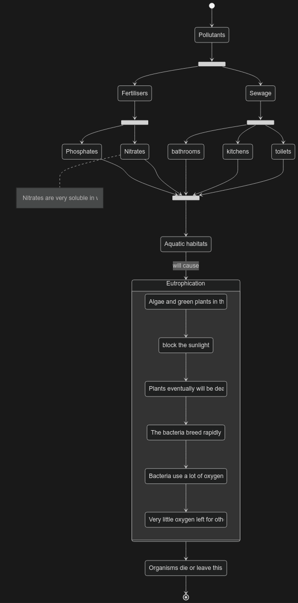

> Eutrophication is a chain of events caused by addition of extra plant nutrients to water, resulting in a decrease in the concentration of dissolved oxygen available for organisms that require it for aerobic respiration.
>
> 富营养化是由于向水中添加额外的植物营养物质而引起的一连串事件，导致需要溶解氧进行有氧呼吸的生物体可用的溶解氧浓度降低。

Eutrophication will decrease the concentration of dissolved oxygen in water, the organisms that need dissolved oxygen either die or they have to leave the area. 富营养化会导致一片水域内缺乏氧气，使得需要氧气生存的生物死去或不得不离开这个区域。

Substances will cause eutrophication 会导致富营养化的物质:

- fertilisers (Nitrates and phosphates)
- untreated sewage
- 肥料（硝酸盐和磷酸盐）
- 未经处理的污水

This whole process is called **eutrophication**.

## Fertilisers

Some pollutants, such as fertilisers and untreated sewage, can reduce the concentration of dissolved oxygen in water. 

Real life examples：

- slurry from buildings where cattle or pigs are kept 饲养牛或猪的建筑物的泥浆
- from pits where grass is rotted down to make silage 从草腐烂以制作青贮饲料的坑中

> Nutrients flowing into the water increase algal, and the bacterial growth because of the dead plants. Aerobic respiration by the bacteria reduces oxygen concentration, killing fish. 流入水中的营养物质会增加藻类，植物的死亡会导致细菌的生长。细菌的有氧呼吸会降低氧气浓度，杀死鱼。

## Sewage

It contains faeces, urine, detergents and many other substances. Good sewage treatment removes most of these harmful substances, but in many places untreated sewage is allowed to flow into rivers or the sea. 它包含粪便、尿液、清洁剂和许多其他物质。良好的污水处理可以去除大部分这些有害物质，但在许多地方，未经处理的污水被允许流入河流或海洋。

Untreated Sewage does **not** usually increase the growth of algae. 未经处理的污水通常**不会**增加藻类的生长。

## Treatment

- **treat all sewage** before it is released into the environment 在污水排放到环境中**之前对其进行处理**
- use **organic fertilisers**, such as manure (they do not contain many nitrates) 使用**有机肥料**，例如粪肥（它们不含很多硝酸盐）
- Only give the **needed** nitrate fertilisers to the plant 只给植物施用**所需的**硝酸盐肥料
- Fertilisers should not be applied to **empty fields** 肥料不应施用于**空田**
- They should not be applied just **before rain is forecast** 不应在**预报下雨之前**施用
- They should not be sprayed **near to streams and rivers** 不应在**溪流和河流附近**喷洒

> **Impossible** to stop using nitrate-containing fertilisers **不可能**停止使用含硝酸盐的肥料
>
> If farmers did not use fertilisers at all, the yields would be much lower and they would have to sell their crops for a higher price, in order to make a profit. 如果农民根本不使用化肥，产量会低得多，他们将不得不以更高的价格出售作物，以便赚取利润。

## Vocabularies

**Leaching:** Washed out in solution when it rains. The leached nitrate ions may run into streams and rivers.

**Eutrophication:** A chain of events caused by addition of extra plant nutrients to water, resulting in a decrease in the concentration of dissolved oxygen available for organisms that require it for aerobic respiration.
