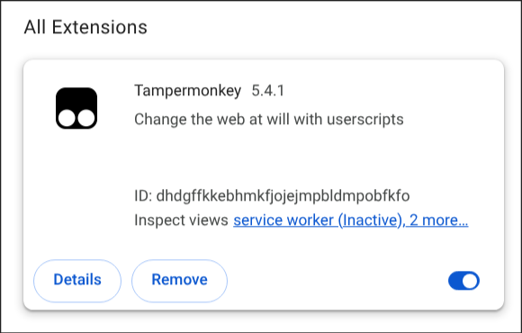
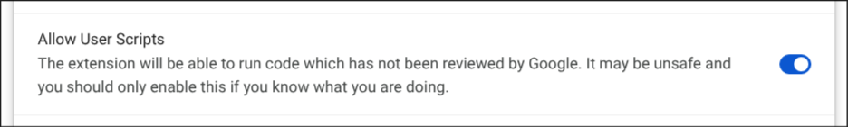
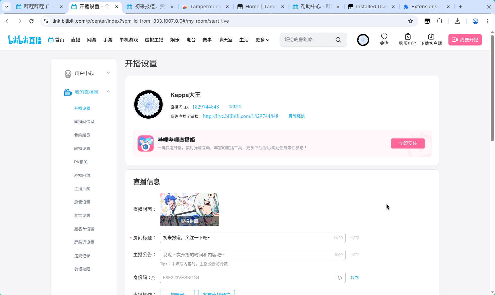
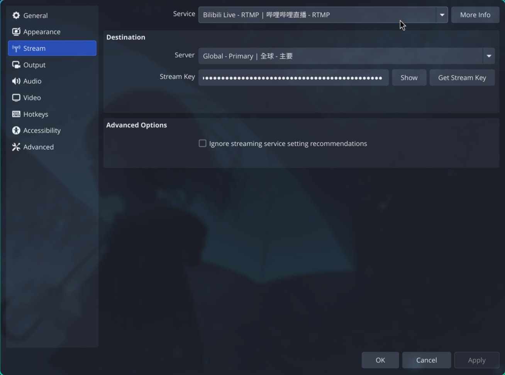
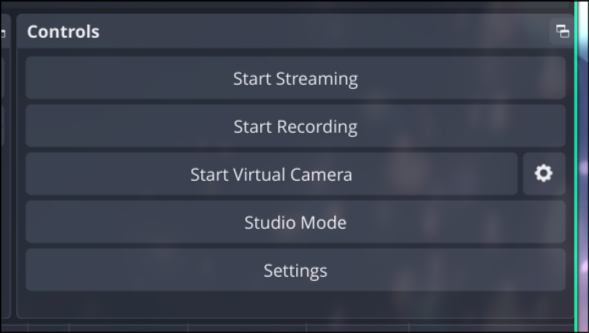

**故事背景：**在十八岁生日当天连银行都认我成年了，结果b站还不认我十八周岁，不给我开直播，一定得第二天才可以开直播。但是当我第二天去试的时候b站表示我粉丝太少了，得5000粉以上才可以使用第三方软件（OBS）推流。


于是，我去找了通过[Puqns67/IHateLivehime](https://github.com/Puqns67/IHateLivehime)这个可以绕过直播姬的方法。

::github{repo="Puqns67/IHateLivehime"}

[浏览器插件《我讨厌直播姬》开播方法_哔哩哔哩_bilibili](https://www.bilibili.com/video/BV1ksS5BKEEe/?spm_id_from=333.1387.homepage.video_card.click&vd_source=95a8a5f89540f816d1ca48c938e432bf)

我也不是不用这个不想用b站自己的直播姬，而是b站的直播姬只支持Windows系统，那请问是不是完全不给其他平台的小up直播的方法呢？

我在Linux上试了wine兼容层和proton兼容层的方法，但是直播姬表示无法正确识别显卡的驱动，拒绝给我使用。因为我用的是n卡，n卡在Linux上的支持很迷，有时候我用Arch Linux的`nvidia`包有问题，但是`nvidia-open`就没问题，而反过来也一样。反正我是没搞明白。

（如果你有兴趣帮我查看的话就太好了）

## 安装

1. 安装chromium内核的浏览器，本人选择Arch Linux仓库中的`chromium`

   ```bash
   sudo pacman -S chromium
   ```

2. 去油猴的官方上安装插件：[Home | Tampermonkey](https://www.tampermonkey.net/index.php?browser=chrome)

   > 如果上不了Chrome Store的话直接下载`crx`文件安装：
   >
   > <https://data.tampermonkey.net/tampermonkey_stable.crx>
   >
   > 然后应该要在chromium中的<chrome://extensions>中启用开发者模式（Edge中操作同理）

3. 在插件管理页面中打开开发者模式：

4. 在插件管理页面中选择管理扩展

   

5. 选择允许用户脚本：

   

## 开始直播

1. 将鼠标放在自己b站顶栏上的头像上，选择直播中心
2. 进入左侧“我的直播间”，选择“开播设置”



3. 找到自己的直播间连接，在上图中就是`http://live.bilibili.com/1829744848`
4. 进入自己的直播间，正常情况下就能看到自己“开始直播”和“结束直播”的按钮了


5. 点击“开始直播”后，会复制以下这一串的内容：

   ```
   ?streamname=live_xxxxxxxxxxxx_xxxx3&key=795b432xxxxxxxxxxxxxxxxxxxxxxxx&schedule=rtmp&pflag=2
   ```

6. 在OBS设置中找到推流Streaming一栏，找到Bilibili Live服务：



7. 将你前面复制的一长串内容放到OBS中Stream Key中

8. 选择应用Apply选项让更改生效、
9. 在右下角选择Start Streaming即可直播



---

最简单的直播方法就这样，后面我应该还会更新弹幕的使用方式。

