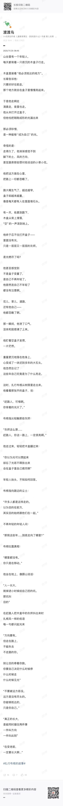

本社团以 “分享阅读、碰撞思想” 为核心，每周五午休时间，我们齐聚一堂，无需复杂准备 —— 无论是正在精读的书籍、偶然心动的段落，还是一句戳中内心的文字，都能成为交流的起点。这里没有年级界限，没有表达门槛，只为搭建一个轻松自由的思想栖息地，让不同视角的阅读感悟相互滋养，让文字成为连接你我的桥梁。

## 第一周推荐书单

| 书名                  | 推荐人    | 推荐理由         |
| --------------------- | --------- | ---------------- |
| 奔腾年代              | Catherine |                  |
| 穆斯林的葬礼          | Catherine | 不同人的观点不同 |
| 君若星辰              | Tom       |                  |
| XeeLee                | Jason     | 世界观宏大       |
| Call Me By Your Namen | Mia       |                  |
| 沙丘                  | Mia       | 世界观有意思     |
| 巴别塔                | Jenny     |                  |

## 第二周记录

第二次文学社的思想碰撞，很开心每位同学都能够表达自己。这让我对大家有了大致的印象，李清同学是我们的小说家，她的随笔我没有办法记录下来，但是确是一场听觉盛宴，Lynn也是写小说写随笔，下次期待你的分享。Mia我觉得需要更多的思想碰撞，你要相信自己也是不简单的，比如我们上次分享等大家都说完了，你想起来你也有在读和喜欢的作品，也能够表达出来自己喜欢的原因，非常棒！Jenny是我们8年级的小学妹，她对阅读《大卫·科波菲尔》的一些感触我也没有办法复述，但是我觉得评论用词非常的专业，能看出来在阅读方面尤其让我感觉在阅读经典方面功力深厚。最后就是说一说我们两位男同学，Jason阅读《巴别塔》后的分享，让我觉得他是个fast reader, 而且能够记住那么多细节，抱歉我在尽力去理解了，因为科幻类小说真的不是我的舒适区，我想我会尝试去读一读。Tom分享的对我来讲就更加难理解了，但是他讲的自己周末看到的故事我是明白的，也许在将来的分享中，我们可以锻炼一下自己的故事力。Tom 是文学社的发起者，非常感谢他的组织，希望我们像之前说的一样，只为搭建一个轻松自由的思想栖息地。看看我们这个社团能走到哪一步~也可以把它当作一个实验。

——Catherine

> 这周新增了两位新成员，尹洛伊同学和李清同学。

### 《巴别塔》读后讨论

Jason同学把上周Jenny同学推荐的《巴别塔》读完了，认为这个小说很有意思。其中，这本小说的前半部分因为各种新奇的设定，很有意思；但是在后半部分，整体的观感就没前半部分那么好。另外提一下，这个小说是是一个悲剧性结尾，主角团中就只有一个人活下来了。

### 推荐书单

Catherine老师推荐的是《庄子》和《写出我心》，这两本都是有关人生观以及生活修养的。

Jenny同学推荐了《大卫·科波菲尔》这本书，表示这本书传递出的价值观非常值得学习，并且用词非常优美。

### 文学分享

李清同学的经验非常丰富，不仅已经在番茄小说上发表了多篇小说，还运营着属于自己的自媒体账号。在平时会写一些随笔，在本次会面中也有分享。（只不过没来得及记下来）

尹洛伊同学也会在平时积累一些随笔，并且有通过纸笔记录自己的生活。

## 第三周记录

### 尹洛伊随笔

在图书馆的角落抽出一本旧书，纸页松脆如蝶翼。忽然，夹在深处的一片枫叶飘落——完整保持着秋日的形状，只是颜色褪成时光的信笺。

小心捏起叶柄，对着光看那些纤细的脉络。某个秋天，有人轻轻合上这本书，把整个季节夹进第230页。这一页没有留下任何字，却留下了比文字更漫长的等待。

如今收到这封信的人，隔着年月，对那位陌生的寄信人轻轻说：我看到了，你们的整个青春 

深夜雨声里，她写下第无数封不会寄出的信。墨水在纸上晕开小小的云，像心底化不开的潮湿。

忽然想起童年养过的蚕——它们固执地吐丝，一圈又一圈，把自己封进透明的茧。不是不知光的方向，只是有些缠绕，这本就是生命必经的仪式。

把信折成纸船，放在窗台积水处。雨停时，它或许会顺着屋檐的银河，航向某个有萤火的梦境。

暗恋请要记得说出口啊，不要让你青春的篇章里，写满了‘我本可以’。勇敢一点，不是为了一个必然圆满的结局，而是为了给当下的自己一个交代，为了在未来回首时，能够坦然地说，我尽力了，我无悔。

> 时间会记录一切，证明一切，也会抹去一切。回首自己的青春，或许总要留下些什么。而“勇敢”，便是当下的自己，为未来的自己，留下的交代。
>
> 图书馆作为“记忆的藏书阁”封存了许多往事。将其中旧书的纸页比作蝴蝶的翅膀，暗示其美丽与脆弱并存，书页上记录着许多值得记忆的往事，可同时也极易损坏。
>
> 枫叶与秋日，象征着时间的流逝。通常秋天是一个走向衰败，步入严冬的季节；却同时还是一个绚丽的季节，其中的辉煌并不比盛夏逊色。这不仅将过去的感情与季节的意象联系到一起，还是作者对自己当前复杂内心的一种具象化。
>
> 墨水既是记录的工具，也可以成为一个无法抹去的污点。人在一生中将自己的行为和想法作为墨水，书写着属于自己的人生篇章。或许文中“她”仅仅因为下笔时的一阵恍惚，导致墨水晕开，破坏了原本的和谐。而现实中的作者或许也因一时怅然，留下了刺眼的回忆。
>
> 春天的蚕是一个极为巧妙的意象：它所处的“春”不仅与前文中的“秋”形成呼应，暗示着时间变化中的煎熬；蚕作为飞蛾的幼虫，是未来飞蛾的早年形态，这也或许是一种不成熟的表现。当它破茧成蝶之际，或许就是作者自我蜕变之时。作者虽未直接使用“作茧自缚”一词，却将其含义彻底剖析，具象于个人与事物之上，给读者带来了更深刻的震撼。
>
> 信件化作纸船，通往不知在何方的未来，在迷茫中前进，也在迷茫中持续前进。纵然无法得知目的地，也依然心向前方。一个个沿屋檐下落的水滴中，也有一片属于它自己的小小银河。或许每个人都无法真正置身于别人的天地中，可要知道每个人心中也有着属于他自己的世界。
>
> ——苏安

### 一个寻常的秋 - 李清

我擦亮打火机，火光一闪，清脆的声音钻进记忆的缝隙。
角落的百威早已蒙尘，连同那段荒谬又浪漫的岁月。

手背的骨节更突出了，旧疤痕沿着皮肤的纹路泛白。
那疤下的温度早就凉了，只剩下一层薄血，包裹着骨髓里的厌恶与不安。

高中之后，我的身体开始迅速生长。
小腿和手臂在酸痛中变得结实，熬夜耗坏的肺活量一点点恢复，薄茧在掌纹间生根。去年的长裤，在这个秋天已经短了几分。
我盯着镜子里那双漆黑的眼，忽然想起那些不属于我的颜色——
深棕、蓝绿，和闪光的自由。

我靠在沙发上，想着不同的人，不同的命运轨迹。
每个人都比想象中过得更狼狈——包括我。
我心力交瘁。年轻的生命，只剩下“年轻”两个字。
我的热血呢？我的理想、梦、恋爱、叛逆呢？
全都蒸发在现实的高温里。
我的年轻，多么冷静，冷得像一块打磨得完美的石头。

我死在利益的诱惑里，又被它残酷的魅力唤醒。
我像信徒一样朝它奔去。
路上，我扔掉了自卑，扔掉了感性，扔掉了脆弱。
我前进，前进——
带着一副仍旧年轻的躯体。

我唯一爱的，只剩我的年轻。
因为年轻，我还能试错；还能折腾；还能被原谅；
还能被世界轻轻地包容。

我的十五岁快结束了。
我的少年时代，没有追梦，没有恋爱，没有自由，
只有利益在前方发光。

我跪倒在地。地塌陷下去——
塌到上个世纪，塌到苦难的人与冷眼的神之间。
我那引以为傲的理性，在尘土里微微发抖。

我已经高一了。
我怎么才高一。

### Catherine老师分享

### 苏安随笔

金黄的落叶搭在你的肩头，缓缓地向我走来，走在那由火红枫叶铺成的红毯之上。

微风吹动你的发梢，拂过你的面庞，诉说着我如涓涓细流般的思念。你站在我身旁，脸却微微转向一侧，好似藏匿着什么秘密，却不小心被嘴角的微笑和脸颊的红晕暴露地一览无遗。

“我们走吧。”你轻轻说道。这简简单单的一句话融化了秋天带来的所有萧瑟，宛如坠入咖啡的一颗方糖，为苦涩的生活带来了一抹甜蜜。

此时此刻，世界在我的眼中渐渐放缓，金色的阳光包裹住了我们；流动的时间缓缓停滞，裹挟着平凡而又灿烂的瞬间，封入时间的琥珀当中，成为这金秋下一遗落的泪珠。

## 第四周记录

### 1:0 - 李清

想起多巴胺，去甲肾上腺素，血清素和低下的前额叶皮层活动能让人失去理智趋于疯狂，彻骨的寒冷在四肢百骸漫开。

毒品。

一种合法的，为物种繁衍而设计的，由衍化学编程的，危险的毒品。它通过降低血清素、抑制理性，让人陷入偏执与盲目。

人们歌颂它，称之为爱。

它是理智的弯折，是失控的心跳，是掷出便无法收回的筹码，是信仰上一个随时可能崩塌的神，是人生规划的改革。

人们沉迷于此，称之为爱。

一个个体为另一个个体倾尽所有——这不是文明延续的最优路径，却是人类这种生物最擅长的自我感动。

它操纵着强大的神经化学物质，调控我们的注意、情绪、行为与纽带，只为促成配对、共同育幼，保障基因的传递。

多原始而粗暴的机制，多脆弱而摇晃的文明。

这就是人类。

好在我的神经系统意外稳定。没有人能让我迷恋，我疯狂追求的，望眼欲穿的，魂牵梦绕的，不是某个男孩，是物质和利益，是冰冷而迷人的稳定，而非炽热而摇摆的感情。

我向来用科学理性作为武器，解构情感的神话。我颠覆浪漫主义叙事，推崇冷峻、悲观而异常清醒的现代生存哲学。

我在一片狼藉的化学物质中，建立起一个坚不可摧堡垒。

我的内啡肽，早已压倒性地战胜了多巴胺。孤独的胜利。a solitary victory.

1:0。

> 我特意查了多巴胺 内啡肽 血清素 前额叶皮层的含义 ~大家可以可以去查查 也许我们可以探讨一下
>
> 多巴胺让你 “想做”，内啡肽让你 “扛住并舒服”，血清素让你 “情绪稳”，前额叶皮层让你 “做得对、不跑偏”。
>
> - **多巴胺**：“欲望发动机”—— 让你想做某件事、有动力的 “燃料”。比如：想喝奶茶、期待旅行、完成任务后想奖励自己，都是它在推你；刷短视频停不下来，也是它在给你 “即时快感”。
> - **内啡肽**：“天然止痛药 + 情绪舒缓剂”—— 专门帮你扛疼、减压的 “安慰小能手”。比如：跑步后肌肉酸痛但心情舒畅、大笑后觉得放松、受伤后没那么疼，都是它在起作用；越坚持（比如长跑、冥想），它越会帮你缓解不适、带来平静的快乐。
> - **血清素**：“情绪稳定器”—— 管你心情平和、睡得香、有安全感的 “定心丸”。比如：晒太阳后觉得心情好、规律作息后不烦躁、对生活有掌控感，都是它在帮忙；它不足的话，容易 emo、失眠、觉得没劲儿。
> - **前额叶皮层**：“大脑 CEO”—— 管决策、控脾气、做计划的 “总指挥”。比如：忍住不发火、先写作业再玩、制定学习计划并执行、知道 “刷手机没用但能管住自己”，都是它在工作；青少年容易冲动、做事不考虑后果，就是这个 “CEO” 还没完全长大（25 岁左右才成熟）。
>
> ——Catherine

> 在这篇充满诗性的文字当中，作者将由“爱”这种感性事物并置于生理现象所代表的理性事物，讨论了作者的世界观。我十分钦佩作者细腻的文笔以及稳重的行文风格，然而，这种将人性完全还原为生物程序的视角，或许遗漏了“人之所以为人”更丰富的图景，我也想添加一些我的想法。
>
> 诚然，人类的思想由脑中的神经元组成的电化学网络所组成，并通过内分泌系统来支配身体的各个部分，从本质上来说与自然界中其他的动物并没有本质上的区别。人是一种动物，但并非所有的动物都可以成为人。
>
> 或许自然界中的生物“成功与否”都可以通过通过基因延续与否来判定，比方说，在自然选择下无法适应环境延续自身的生物必然是失败的。如果以这个观点出发的话，人们的一夫一妻制，人们所建立的各种体系，人们所拥有的爱好，都不能最大程度地扩散自身的基因，那么人们本身是失败的吗？并非，从进化的历史上来说，并不是只有人类有“社会”这个概念，也并不是只有人类有爱的能力，所以说拥有许多复杂的情绪并不是只有人类独属的，而是自然中一种正常的演化现象。人们没必要将这些复杂的感情视作“精神毒品”，而应该将这些复杂的感情视作正常现象，视作我们人性构造中自然且珍贵的一部分。
>
>  我认为人类之所以是人，其根本原因在于人类拥有许许多多“无意义的”情感：好奇心、认可“美”的能力、归属感、责任心，以及人与人之间紧密的联系，或者说“社会”这个概念。当今人们就算不喜欢与人面对面交流，也会通过互联网与其余的社会建立联系，所以从本质上来说这点是不变的。而人与人之间联系最重要的纽带，便是“爱”。
>
> 爱源于人类各种复杂的情感，也成就了这些情感的发展。就算爱是由各种生理作用产生的，以目前的神经科学的发展，也不能逆向实现爱。从计算机的角度思考，使用一个软件的时候，我们不需要关心实现的具体代码，更不需要掌握每一个逻辑门的运算，我们只需要使用软件本身即可。对于人类的各种情感来说，不光是爱情，也包括类似于追求之类的其他情感，作为一个人类个体来说只需要去感受情感本身足矣。若非是为了探究本质，否则在日常生活中，我们无需也无法活在自己神经递质的显微镜下。就像使用软件，享受功能即可，无需时刻反编译其源代码。
>
> 在生命当中，总会有一些时刻要通过理性来压制自己的感性，可是没有经过“人类补全计划”的我们，没办法得知所有人产生的所有想法。我们也只能理解自己接触到的事物，所以我们并不能通过完全理性的方式思考世界。
>
> 例如说A很崇拜B，并为了担心令B感到困扰，便在生活中隐藏自己的想法：这个例子中，作为全知第三人称的我们知道，A对B有好感，但是对于没有接受到好感的B来说，A只是一个普普通通的人而已，B甚至有可能认为自己存在于世界上没有给任何人带来意义。
>
> 或许在上述例子中，通过一些交流，就可以避免这种误会，可是在现实生活中，总有许多事情是不可能说清的。那么，我们究竟应该费尽心思，追求所谓“真实客观”的事实，还是应该保留自己的想法，仍然通过自己喜欢的方式生活呢？
>
> 在生命难以完全澄明的迷雾中，或许重要的不是穷尽所有生化或事实的“真相”，而是在认知到自身局限后，依然选择接受那些让生命感到温暖、联结与意义的“叙事”——包括爱本身。
>
> ——苏安

