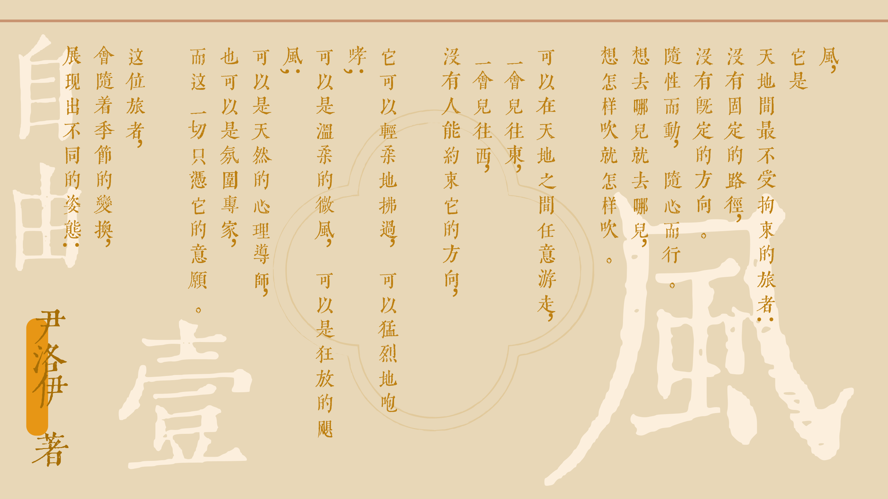
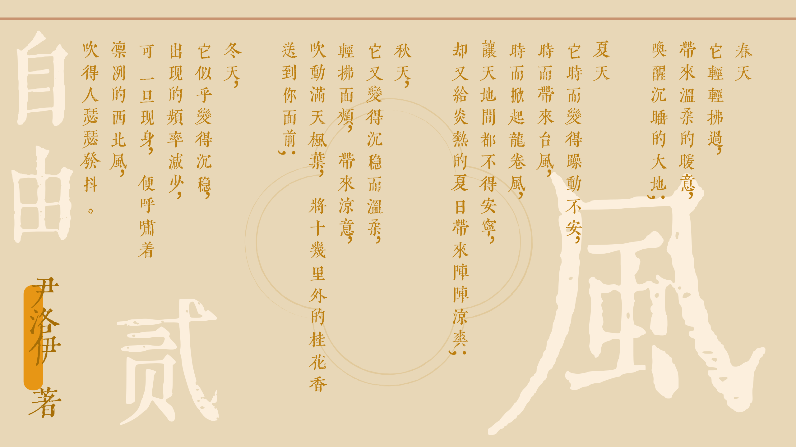
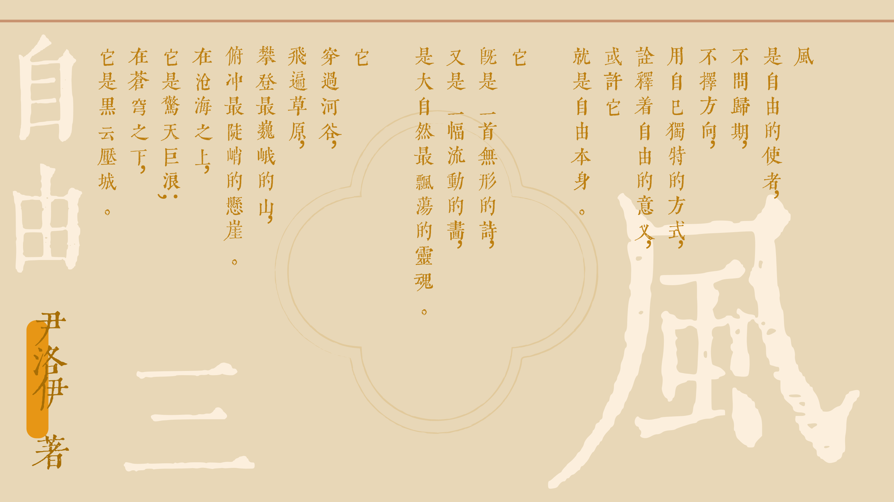
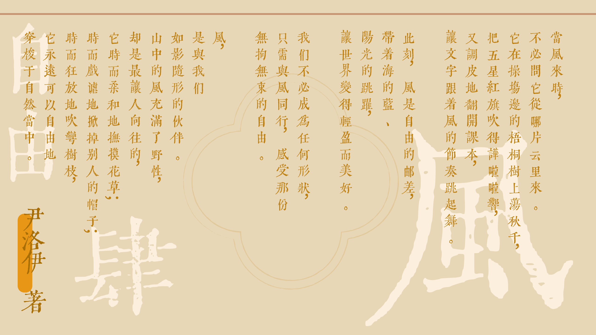

自由是一个亘古不变的议题，无数哲学大家对此争论不休，无数政治家摆弄自由和秩序之间的天平，更多的是普通人对自己现状作出发问：“什么是自由？”

内容目录：

1. 推荐书单——Jenny
2. 《笼中鸟》——李清
3. 《风》——尹洛伊
4. 在命运下的自由——苏安
5. 反乌托邦中的统治与自由——Jason和Mia

> 供稿：Tom | 成员：Sylvia, Mia, Jason, Lynn, Jenny, Catherine

## 推荐书单

自由主题：

- 三毛作品
- 《黄金时代》
- 《写出我心》
- 《1984》
- 《The Giver》
- 进击的巨人

作家的作品中，自由这个主题常常被谈论。

Jenny最近在看三毛的书。从三毛的文字来看，她是一个很自由的人，她去过很多地方，有着无数的阅历，还有那种说走就走的旅行。可是三毛却过早地经历了爱人的离世，经受了许多病魔的摧残，最终在医院中自尽。

在普通人，或者不了解她的人看来，她是一个自由的人。可同时在精神与肉体的层面上，只有她自己知道自己是否是真正的自由。

其他推荐作者/书籍：

- 三岛由纪夫作品
- 《放学后》- 东野圭吾
- 《告白》- 湊佳苗

## 笼中鸟

这些天，我总是梦见一扇门。

门是极普通的样式，老旧的木头，漆皮剥落得斑斑驳驳。它孤零零地立在一片虚空里，没有墙，就那么悬着。梦里，我清晰地知道，推开它，便是自由。可每回指尖将将触到那粗糙的木纹，便醒了。醒在四壁之中，晨光正一寸寸爬过窗棂的铁栏，将屋里的什物镀上一层冷硬的金。于是那扇门便成了一个讥诮的、遥不可及的隐喻，卡在胸口。

近来人们，大约是极爱谈自由的。

这两个字像街角廉价香水的气味，弥散在每一寸空气里。它被印刷在鲜亮的标语上，被谱进激昂的乐曲里，被制成小巧的徽章，别在少男少女挺括的衣领。他们谈起它时，眼里有光，声音清亮。你看那广场上滑板飞驰的少年，耳里塞着隔绝世界的轰鸣，以为速度便能切割开束缚；你看那咖啡馆里高谈阔论的文人，舌底翻涌着“边界”与“自我”的新词，仿佛真理便在那氤氲的咖啡香中结了晶。

自由成了一种风尚，一件标榜身份的配饰，人人都急急地要将它披挂在身，唯恐落于人后。只是那配饰轻飘飘的，没有重量，一阵稍大些的风，便能将它吹得无影无踪。

前几日黄昏，我路过那座熟悉的过街天桥。一个流浪的乐人，倚着斑驳的栏杆，吹着一管磨损的萨克斯。曲子是喑哑的，断续的，不成调，却奇异地压住了桥下滚滚的车流声。他闭着眼，污浊的脸被夕阳映成古铜色，全身心都沉浸在那呜咽的气流中。他没有“拥有”什么，甚至没有一个遮风挡雨的屋檐。但那一刻，晚风穿过他破烂的衣衫，旋律从他胸中自由地淌出，他与那天，那风，那匆匆的人间，达成了一种暂时的、悲凉的和谐。

我忽然觉得，他那破音里颤动的，或许是比所有响亮口号更为真实的、自由的碎影。

归家时，华灯已上。楼宇的窗口次第亮起规整的光，像无数只驯顺的眼睛。

我又想起梦里那扇门。或许，真正的自由本不是一扇需要去推开，而后便能抵达某个乐园的门。它或许更像那流浪乐人换气时，一个短暂的、颤栗的停顿。在那一瞬的静默里，万籁退去，你听见自己血液流动的声音，你知道自己存在着。它无法被标价，被展示，被稳妥地“拥有”。

窗外的铁栏，在夜色中渐渐模糊，终于与黑暗融为一体。笼，一直都在。只是有的笼子，看得见栅栏；有的笼子，住在人心里。我们总大声嘲笑着前者，却对后者，献上我们全部的、温顺的呼吸。

## 风

这很像我们的生活，走着走着也许就会碰壁，但风到底是从容的，无论前方是什么，它总能自如穿过，找到属于自己的道路。我们普通微小，依然可以像风一样自由行走，自在从容，依然可以像风一样不顾旁人的目光，自由自在。

## 在命运下的自由

在生活中，人必定不能随心所欲，做自己想做的任何事情。这些限制有时来源于物质条件的不足，有时又来源于所处社会的各种限制，无一例外这些原因将导致人们无法达到广义上的自由——即做任何想做的事情。

当人们无法改变当下的环境时，或许保持内心不被外界同化，坚持自身的自我意志，也能达到自由。自由在更深程度上，所指的不再是物理上的行为，而是真实自我的表现。

在《黄金时代》这本书中，王二是一个流氓般的角色，他用着一副玩世不恭的态度过着自己的生活。但是对在被别人骂成“破鞋”，急于求证自己清白的陈清扬来说，王二却引导她完成了自我救赎。

在文革这个时代背景下，似乎所有人都要为了集体而舍弃自身的独立性，王二和陈清扬却通过自己的方式宣誓自己的自由。陈清扬通过认清自我，接受自我的方式，对抗着“反自由”，达到属于自己的自由。

当自己无法改变环境时，真正的自由或许是坚持自己内心，保持自我不被外界同化，而不是简单的“随心所欲”。

## 反乌托邦中的统治与自由

> 《1984》和《The Giver》这两部小说是我很久之前看的，所以剧情如果有出入的话，那肯定是我错了。

在科幻小说《1984》和《The Giver》中，作者都描述了当一切趋于完美时，个人的存在都将为了集体的秩序让步。

在《1984》中，这或许源于统治的需要，使全国人民生活在战争的背景下，为了国家的集体利益而让步。而在《The Giver》这部小说中，作者描绘了一个近乎完美的世界，人们不再会失业，不再会吵架，不再会发生战争等等……可是这样的代价便是抛弃所有不必要的情感，生活在一个早已计算好的世界中。这两部作品中的人们都无一例外地生活在一个没有“自由”的世界中，同时这两部作品中的主角都为了自由而做出自己的努力。

《1984》中的主角在爱情的驱使下，反思当前的社会秩序，试图反抗这个世界，却最终被这个世界所同化。不过这部小说是开放性结尾，所以并没有一个明确的主角结局。借由爱情这个人类最原始的情感之一，主角开始发掘自己作为人的本性，遵从自己的内心行使“自由”。可悲的是，这个世界本身就是“不自由”的，在政府的力量下，他的一切努力都未能真正达到“自由”。这部作品不仅对这样一个充满集权的社会发出疑问，还探讨了在这样的社会下自由的意义。

反观《The Giver》这个小说中，人们放弃自由带来的不是统治者的安稳，而是自身，或者说全人类的利益。人们不用操心各种事情，也不会被负面的情感所淹没，更不用背负历史的沉重。可是主角作为一个还保留这些情感的“觉醒者”，他不愿意生活在这样的世界中，就算是要背负人类的整个历史，也要获得属于自己的自由。在这部小说中，主角最终体会到的自由是：自己认识到了现实之后，仍然遵循着内心所想做出自己的选择，继续想着未来前进。

综合来看，两本书中的主角均在自我和社会的天平中选择了自我这一边。这听上去可能有种自私的感觉，社会是由人与人构成的，但是人在参与社会之前，必须保证自我的完整性，否则人不再是人。上面两个理想社会中，个人的价值被压缩，使得乌托邦成为反乌托邦。或许再谈论自由之前，得先认清自我，然后在坚持自我意志的同时，生活在充满约束的世界中。

- - -

## 结语

在社会秩序与自由意志之间，似乎有着难以解决的悖论：人们无法在社会中为所欲为，却同时每个人也拥有着最原始最本能，对自由的向往。在见证了许多理想中的自由后，我们仍然会回到现实世界中，面对许许多多的烦恼——当个人无法撼动整个社会时，或许将自由从外界的予取予夺，内化成“我何以成为自我”。

真正的自由或许不在为所欲为的放纵之下，而是在每一次忠实内心的选择之时。

> 下周主题预告：青春
