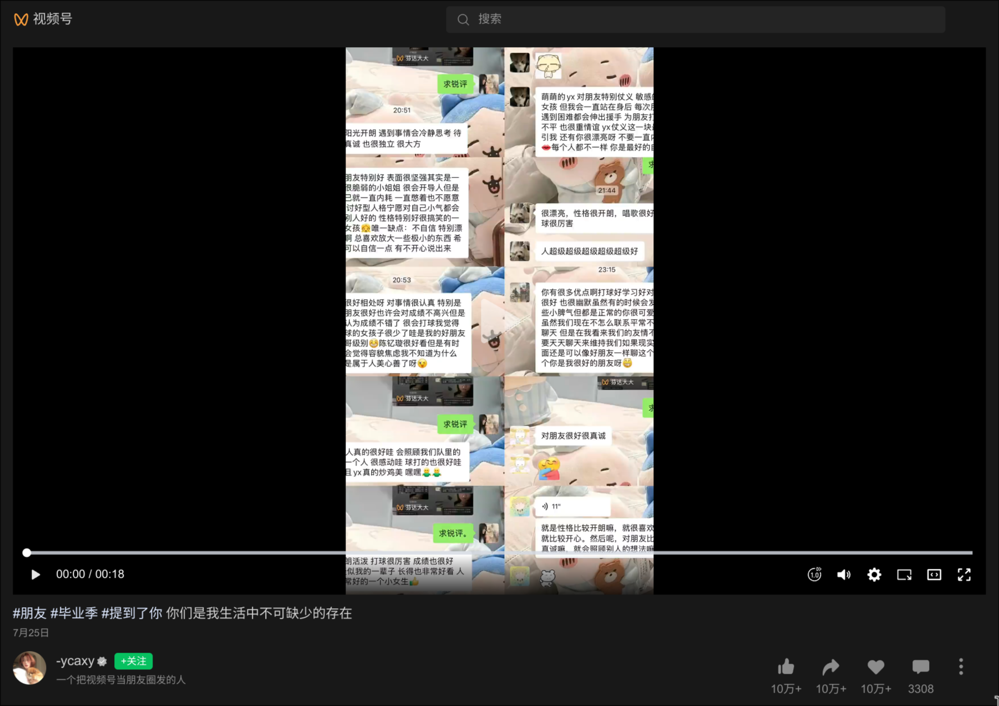
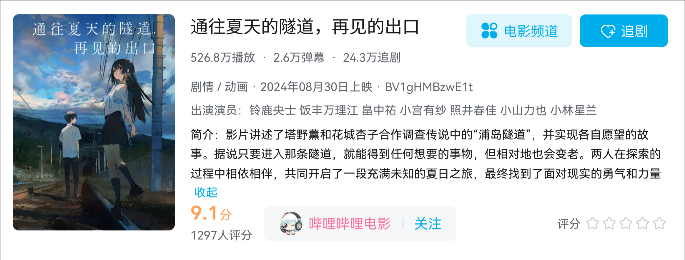

每一代人都有属于自己的青春。这周，我们通过文字和讨论，分享了各自的青春故事。

**内容目录：**

- 《那一次，我重新认识了他》——Jenny
- 《盐》——Jenny
- 《通往夏天的隧道，再见的出口》读后感——尹洛伊
- 本周推荐书单

## 那一次，我重新认识了他

> 每一个人都有着属于他自己的故事，我们没办法完全了解一个人的内心。但通过一些不起眼的互动，经过一些寻常的经历，我们或许会对一些人产生新的认知。在这篇文章中，作者通过细腻的笔触，将自己重新认识一个人的经历生动地呈现在了读者面前：

每个人都是一本待读的书，但我总以为他是游离在电子世界的逃兵，因而过早地合上了他的这本，直到一次数学自习课，名叫“。”的风吹动了书的扉页。

那是一堂数学自习课，我早早做完作业，拿出了课外班的练习题，自信地下笔。片刻后，草稿纸已然变得密密麻麻，但我却没有找到任何通往正确答案的钥匙。微微蹙眉，不知手中的笔应该去往何方。

 “试试平方差公式。”一道男声徐徐从我头顶响起。

——我抬头，是他？

那位日日沉浸在没有尽头的屏幕和游戏中的同学，毕竟作为同班同学，尽管交流寥寥无几，我还是可以对他的生活略知一二。

——他真的会解这道题吗？

嘴比大脑先行一步：“你真的会吗？”

不知道他是否注意到了我的不信任，他礼貌极了，没有一丝不悦出现在他的脸上：“你可以试一试那个方向，相信我。”

我半信半疑地动笔，他的思路竟出奇地有用，可惜我依旧无法写出完整的答案，在他的面前，一个我认为终日不学无术的人面前出这种差错，我无地自容。

他并没有指责我的不开窍，“没事，这很正常，这种题型需要多加练习才能熟练地做出来。”

他紧接着开口：“能借我下纸和笔吗？”

接过纸笔，他开始在白纸上演绎他的算法，笔触流畅，仿佛在做一幅精巧的画。我的目光在他的坚定自信的双眸、连贯的笔触和准确的答案之间流转。步骤一、步骤二一直到……最后一步，头中纠缠的思绪被几笔轻然解开。他带着钥匙找到了题目对应的那把锁，毫不犹豫地打开，见到了答案。

道谢并等到他回到座位后，我悄悄观察起这位一直被我看不起的同学，他静静地坐在那，低着头，若有所思地在数学书上圈画着什么，对喧闹的同学们不予理会。那时，他的镜片中所倒映的不再是霓虹的电子彩灯，而是那深沉的背后藏匿着无限可能的数字符号。

这是一节平平无奇的数学自习课，但却让我认识了那个我曾经忽视已久的他，那个在坐标系的抛物线中，三角形的夹角中，方程式的未知数中闪闪发光的少年。

## 盐

> 这篇短文的起因是Jenny一个许久未联系的朋友，因为一个微信视频号上的视频，请求Jenny写个类似的文章：
>
> 

记得你说过，你像盐。

的确，你应该听过‘爱父如盐’的童话故事，在我们这里与这个故事有着异曲同工之妙，我的确爱你如盐，没有你陪伴的日子似乎寡淡无味。小学时不知那段时光的滋味有大半是因你而起。

我又觉得你像柳叶，不是那种娇软似水随风逐月，而是如同绦柳，它不同垂柳般柔软易折，而是柔韧而坚劲，既有与风共舞的情趣又有在风中坚定的信念，是既能在南方观赏的景致，又是能在北方屹立的包容。

在我们的关系中，你是盐。

在我的眼中，你是柳，绦柳。

> **读后感**
>
> 这篇文章中的比喻很新颖、很恰当。
>
> 将朋友比作盐不止将朋友看作是生活中调味剂，就像盐为食物添加风味那样；同时盐还是身体不可或缺的营养之一，暗示着在她们小学的那段时间中，这位朋友对作者来说是多么的重要。

## 《通往夏天的隧道，再见的出口》读后感

> 思考：“如果你有一个能实现愿望的隧道，但代价是时间，你会用它换取什么？
>
> 或许是时间本身，能让自己和自己爱的人继续相处的时间，能让自己重新获得重要的物品，再一次经历难忘的事……不过具体是否要通过时间来交换，终究取决于渴望之物的意义：究竟是那个脑海中的愿望更重要，还是当下或未来自己实际所处的时间更加重要。

这部电影改编自八目迷的同名小说。故事始于男主塔野薰，他的家乡有一个传闻：有一个叫浦岛隧道的地方，进入就能得到想要的事物，但代价是变老（原著中的话）。他一直因为妹妹华怜的意外去世而一直活在深深的自责中，家庭也因此破裂。某次离家出走途中，熏偶然找到了这处传说中的隧道。然后他在探索隧道时，被同班的转学生花城杏子撞见。杏子的性格孤僻，梦想成为漫画家却屡遭反对。她也对隧道充满好奇，二人决定合作，一边探寻隧道的秘密，一边寻找各自失去的东西。

熏的执念是找回妹妹，而杏子则希望获得“特别的才能”来证明自己。在杏子收到漫画杂志的录用通知，梦想将实现时，熏却选择独自再次进入隧道，因为他不想成为杏子追梦路上的障碍。熏在隧道深处见到了妹妹，但妹妹却告诉他“哥哥要活在当下”（当时他们测试过发现在隧道内是无法收到别人的消息的，但熏却收到了杏子的消息，我认为是因为他在隧道内，想收到杏子的消息所以收到了）。熏终于明白，真正的愿望不是回到过去，而是应该学会与遗憾和解，拥抱现在。他拼命跑向出口，最终与等待他八年的杏子在隧道中拥有了“持续6.5小时的吻”，然后一起走出了隧道，此时外面已是十三年后的深秋。

这部电影用奇幻的设定包裹了一个关于“成长”与“告别”的深沉内核。

我认为隧道不仅是传说中的奇幻地点，更是角色内心执念的具象化:

- 对薰而言：隧道是“回到过去”的通道。妹妹的意外让他困在自责中，隧道象征着他逃避现实、试图修正错误的执念。
- 对杏子而言：隧道是“证明自我”的可能。她渴望才能被认可，隧道象征着她对“独特价值”的渴求，在我看来也是一种逃避现实。
- 两人的不同选择：当杏子逐渐在现实中找到方向（漫画被采用），薰却选择再次进入隧道，这体现了两种面对创伤的方式——拥抱未来 vs 沉溺过去。
- 从“逃避”到“和解”
   - 薰的成长：最初，他将隧道视为“赎罪工具”，甚至愿用一生换取妹妹的回归。但当他真正见到妹妹时，妹妹那句“哥哥要活在当下”让他明白——真正的和解不是改变过去，而是接受遗憾。他在隧道中收到杏子的消息，象征着他内心开始“转向现实”的瞬间。
   - 杏子的陪伴：她不仅是薰的同伴，更是“现实世界”的锚点。她的等待（八年）与坚持（成为漫画家），是对薰最终选择回归的无声呼唤。

- 6.5小时的吻
   - 吻的象征意义：在隧道中的吻，是两人对“时间”的共同反抗。隧道内时间几乎静止，而外界已流逝十三年。这个吻既是告别（对过去的执念），也是承诺（对未来的选择）。
   - 时间的重量：薰走出隧道时，杏子已等待八年，而外界更是过了十三年。这种时间错位强化了“选择当下”的代价与珍贵——他们用失去的时光，换来了共同的未来。

- 如何面对“失去”
   - 隧道不是答案：电影暗示，即使得到隧道的“馈赠”，也可能陷入新的失去（如加速衰老、错过现实）。这呼应了现实中的真理——试图用执念填补遗憾，往往会导致更大的失去。
   - 真正的出口是“向前走”：薰最终明白，妹妹的愿望不是他永远活在愧疚中，而是好好生活。杏子也通过漫画找到了自我价值，而非依赖虚幻的“才能”。

隧道尽头的光：*学会告别，才是成长的开始*

我认为这个电影最打动我的，不是奇幻的隧道，而是一个我们都必须学会的道理：人无法带着未愈合的伤口，真正地走向未来。

从角色的选择中，我们可以看到故事里的隧道，是我们每个人心中都可能有过的“如果”——“如果当时我那样做了”、“如果我能回到过去”。薰的执念非常真实，我们都懂那种被遗憾困住的感觉，仿佛人生的一部分永远停在了某个雨天。

但这个故事最温柔的启示在于：它没有否定薰的痛苦，却给了他一个更勇敢的选择。

当他终于明白，妹妹最想要的不是他“用一生去换回她”，而是“哥哥你要好好生活”时，那瞬间的顿悟，是整部电影最闪光的一刻。原来，真正的怀念，不是停留在过去哭泣，而是带着对那个人的爱，更认真、更用力地活下去。

而杏子的存在，是故事的另一个答案。她代表了“向前看”的力量——她有梦想，在现实的土壤里努力扎根。她的等待，不是停在原地，而是在成长中等待。她让我们看到：爱一个人，不是拉住他一起沉溺在过去，而是在未来里，为他留一个并肩的位置。

那持续6.5小时的吻，是整部电影最震撼的隐喻。它用几乎静止的时光，交换了外界十三年的流逝。这告诉我们，当我们终于与过去和解，决定转身拥抱现实的那一刻，可能已经错过了很多时间，但熏终究没有错过那个最重要的人，和那个终于完整了的自己。隧道真正的“出口”，从来不是物理的洞口，而是心里的释然。所以这个故事教会我的，可以总结成三句话：

1. 遗憾无法被修改，但可以被安放。 让它成为你生命的一部分，而不是全部。
2. 真正的成长，是学会在雨中撑伞前行，而不是永远等待天晴。
3. 最珍贵的“得到”，往往就在你敢于“告别”的那一刻，悄然到来。

我们每个人心里，或许都曾有过一条“浦岛隧道”。但看完这个故事后，我希望我们都能有勇气，不再向里张望，而是牵起身旁人的手，一起走进隧道外，那个真实、辽阔，属于我们的秋天。

与遗憾和解，不是背叛过去，而是对自己、对未来最大的诚实。“过去固然重要，但最重要的是活在当下，珍惜当下。”

## 本周推荐书单

- **《通往夏天的隧道，再见的出口》**——八目迷

  尹洛伊分享了这本小说 / 电影，但由于时间限制，没能将这部作品的感受完整地传递给大家，所以如果自己去看了这部作品在回过头来看尹洛伊的读后感，相信你自己也会有独属于你的种种想法。
  
  主角薰和杏子是两个十分相似的角色，他们都是在自己的青春时代中迷茫着，但是这两个角色从某种意义上说确实对立的，男主薰象征的是过去中的种种不甘，而女主杏子象征的却是努力和梦想。
- **《三日间的幸福》**——三秋缒

  在《通往夏天的隧道，再见的出口》的讨论中，我们有提到是否可以通过时间换钱这个想法。虽然对于《隧道》中的设定来说，这个问题更确切地说应该是“……一个能找回失去之物的隧道”，不过在《隧道》刚开始的引子中也说“一个能实现任何愿望的隧道”，所以具体怎么说不重要。

  但是有关“通过时间换钱”这个设定，有一个同为轻小说的《三日间的幸福》讲述了在这个背景下可能发生的种种事情。既然提到了这样的想法，那么《三日间的幸福》可以作为延伸阅读，看看其他作者是如何演绎这样的世界。

---

## 结语

青春可以说是人生中最短的一段时间，也是最耀眼的一段时间；青春是人生中最自由最无忧的一段时间，也是最矛盾最迷茫的一段时间……

> 下周没有固定主题，自由阅读即可。
