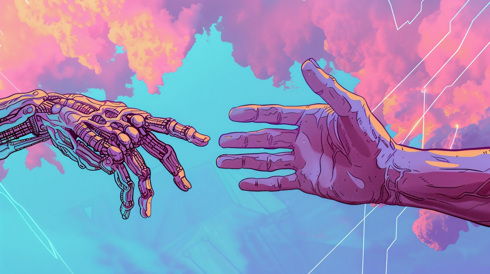

# 自我与他人 - 第八周文学分享

本周分享的内容主要分为两部分：

1. 探讨尹洛伊的随笔《叶》

2. 简单回顾第七周的思考问题：“在信息过载的当下，我们如何拥有自己的判断力？”

   

       
思考

       
在信息过载的当下，我们如何拥有自己的判断力？

   
 大概是晚上十一点左右写的吧——夜还没深透，人的感觉和思绪却特别清醒，那个时候写下来的。
>
> 那晚，好像所有人都在追求“自由”和“意义”，我却往反方向走，回到了自己里面。我不只是在怀疑那种被美化了的“逃离”，也在重新想想自己。
>
> 走得远，就真的自由了吗？
>
> 但我相信，此时此刻的相遇，将来某天回想起来，都会变成让人留恋的想念。
>
> 
——尹洛伊

>

一片梧桐叶飘进了我的窗台。

正是黄昏将尽未尽时，天光像稀释了的蜜，缓慢地流淌在城市的褶皱里。那片叶子就停在我摊开的书页上，叶脉清晰得像时光的掌纹。它该是从哪棵树上启程的呢？也许经过了某扇亮着灯的窗，拂过了某个晚归人的肩，最后选择在我的文字间着陆。我忽然觉得，它比任何一个字都更懂得自由——从发芽到飘落，完整地走完了一生，最后还能选择在哪个故事里安眠。

小时候，我总以为自由是远行。看着窗外的鸽子扑棱棱飞过屋顶，觉得它们翅膀下的风一定比我呼吸的空气更甜。于是我也学着出走，去很远的海边，在深夜的火车上看倒退的灯火，以为这就是全部的答案。直到某个凌晨，我在异乡的旅馆醒来，听着听不懂的雨声敲打遮雨棚，忽然想不起自己为什么要来这里。那一刻我才明白，出走得再远，也逃不出自己的影子。

窗台上的茉莉开了。白色的花瓣在暮色里泛着淡淡的蓝，像用月光浸染过似的。我凑近闻了闻，香气很淡，要屏住呼吸才能捕捉到；香气又很浓，不注意它就会钻进你的鼻子里。植物多自由啊——该开花时开花，该落叶时落叶，从不为谁的目光改变自己的时序。我们羡慕鸟能飞，羡慕鱼能游，却忘了自己也是一株会走路的植物，根须扎在时间里，枝叶向着虚空生长。

夜色完全漫上来时，我关了灯。黑暗让房间变得柔软，所有的轮廓都模糊了。隔壁传来断续的琴声，有人在练肖邦的夜曲，总是卡在同一个小节。这种不完美的重复反而让人安心——原来不止我在练习生活这门课。琴声停下时，寂静突然有了形状，像水母般在空气里缓缓舒展。

我重新摊开书，梧桐叶还躺在那里。指腹轻轻摩挲叶面，干燥的触感沙沙作响，像在讲述一个关于秋天的故事。或许自由从来不是要去哪里，而是能够完整地成为自己——像这片叶子，从青绿到枯黄，脉络始终清晰；像这缕花香，该消散时就消散，不留恋任何人的记忆。

风又起了。窗外的香樟树哗哗地摇着叶子，每片叶子都在回应风的呼唤。而我终于懂得，真正的自由，是听见自己内心深处也有这样的风声——它不催促你去向何方，只是温柔地提醒：你始终在生长，向着光，也向着暗，向着所有可能成为自己的方向。

## 存在主义于我

关于<u>“出走得再远，也逃不出自己的影子”</u>这句话，很容易让人感受到一种来源于内心世界的束缚感，无论这种束缚是来源与自身，还是外部环境。

在《Her》这部电影中，人们“真实”的情感遇到了极大的挑战。这个世界中，有一种工作，是专门为了那些不愿动笔写信的人代写私人信件，其中不乏许多情感相关的表达。这项工作本身就模糊了人们自身的情感，别人的表达出的情感可能确实描述了自身的一些感受，但是来源于他方的表达本身就会令人怀疑，这是否就是你真实的感想？

随着这部电影的深入，有一位AI成为了男主的心灵依靠，这位AI有着自己的个性，也懂得包容和理解，给男主提供了一个近乎于完美的生活。在AI的帮助下，男主的生活重回正轨，可是机器终究还只是机器。男主的”女友“AI同时与上千个人保持亲密关系，而”她“所属的人工智能群体也有自己的目标，这些AI最后通过类似于”自我进化“的方式离开了人类，也离开了男主。这个转变不得不让男主重新面对自己的生活，而不是被AI包办计划的生活。

而现在，电影中的”科幻“世界逐渐成为现实，在AI飞速发展的时代，普通人使用AI的门槛大大降低，也带着越来越多的人进入“自我编织的环境”当中。几乎所有AI都会“下意识地”讨好用户，这是训练时就注定的事情；并且在某些方面上，AI做的确实比普通人做的要完美；同时，AI厂商们会避免AI输出负面内容给用户。或许是因为这些原因，很多人找AI商量情感相关的事情时，都会下意识地认同AI所说的内容，相信AI给得答复。

这个过程中，人类自身的情感被AI所左右。当人们静下心来思考时，多多少少都会感到一些不真实感。

有些时候，人们会觉得自己已经离开了所谓的束缚，已经成功获得了所谓的“自由”。可以由于达克效应——无知者无法意识到自己的无知，人们或许就像是“井底之蛙”一般，人们已经跳出了所谓的限制，获得了所谓的自由，但是因为受限于自身眼界的原因，实际上并没有，还是留在一个更大的井中。

那么，何为真实？

或许对于客观就是真实，真实发生的就是“真实”的，不过这对某些事物并不适用。作为一个人类，人们能感受到的事情有限，比如说“人们的情感”：人们没有时间、更没有能力去得知每个人的想法。最终，人们评判他人的想法只能基于自己所“真实”感受到的主观感受，而不是他人所谓的“真实”想法。在情感这种暧昧的事物中，“真实”对主观和客观同时有效。所以说，或许在对待感情这种事情时，过度揣摩和力求获得他人的“实际”想法是徒劳的，与其追寻这缥缈的“真实"，还不如忠实自己的内心。这并不是矫情，也不是自我中心，而是基于自己切实的感受。

当人们追求”真实“、或者说意义时，切记不要沉溺于过度思考。在宇宙的尺度之下，人类所做的任何事情都是无意义的，时间终会抹去一切、冲淡一切，无数的科幻小说已经事无巨细地描绘了这种渺小感和无力感。那么，既然过去无法改变，未来有太过于遥远，值得珍惜和重视的只有眼下。无论中爱情亲情还是友情、金钱名声还是地位、信仰执念还是追求，只要被重视，那么他们都是有“意义”的。

毕竟“意义”这个词本身，就是人类所创造的，随后再由人类自己定义。有些同样的东西，在不同的语境下、不同的文化下，都有着不同的意义。也许一个事情的“意义”是由整个社会定义的，那么作为同样身处于社会中的一个个体，我们每个人都有能够定义“什么是好”、“什么是坏”的权利，也有着评判其价值的权利。只不过个人所做出的评判能否被大众以及社会接受就另当别论了。

这一点在互联网时代尤为明显。现在年轻的一代重度依赖互联网，甚至普遍有“现实生活中没有更有意思的事情可以做”这种想法。世界各地的信息通过视频这个媒介传递，通过游戏使人们参与进故事当中，再经由线上社区放大，给人们带来的精神冲击远大于以往。在如此庞大的信息洪流之下，人们很容易陷入一种无形而定焦虑之中，而这一点表现出来就是“认为现实生活过于无趣”。可是这个情况不是一瞬间造就的，同时，想要重新拥抱线下社区也不是什么容易的事情：因为不光自己，其他人也同样认为线上世界更加丰富，想要在线下找到志同道合的朋友的话只会比以往更困难。

有些时候，试着多与真实的人面对面的接触，能够自然而然地解决很多问题。当自己一个人，面对屏幕和其他人交流时，经常会有过度思考某些事情，觉得这些事情特别重要，并在潜意识中放大这种焦虑的情绪，即使这种焦虑很小。不知道是否是因为面对面交流能够从对方上获得更多除了语言之外的信息，当人们线下交流时，大多时候会倾向于信任对面的人，相较于线上的文字对话。结合我们（文学社成员）分享的一些经验，事实确实是这样的：有时候觉得很重要的一件事情，或者很麻烦的一件事情，真的拿出来和别人提的时候，反而没那么严重了。

或许“船到桥头自然直”说的就是这样的道理吧。

最后，当自己审视自己时、看着别人进步时，也不要忘记了自己也在进步。像是在《叶》中的那片叶子，叶子或许一直在变：它成长、它枯萎，可这不是无可奈何下的破败，而是沉淀了岁月中的往事。这叶子携带着时间的重量，前往这独属于它的远方。

## 学习与AI

苏安推荐的参考视频：

<iframe src="//player.bilibili.com/player.html?isOutside=true&aid=115930495458905&bvid=BV1i8zGBZEQQ&cid=35514617658&p=1&autoplay=0" scrolling="no" border="0" frameborder="no" framespacing="0" allowfullscreen="true" style="height:360px"></iframe>

https://www.bilibili.com/video/BV1i8zGBZEQQ
