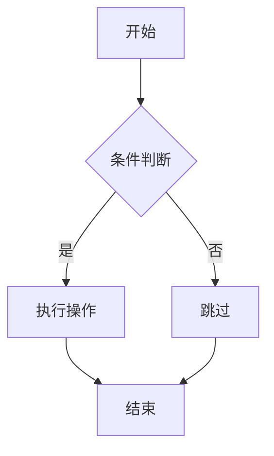
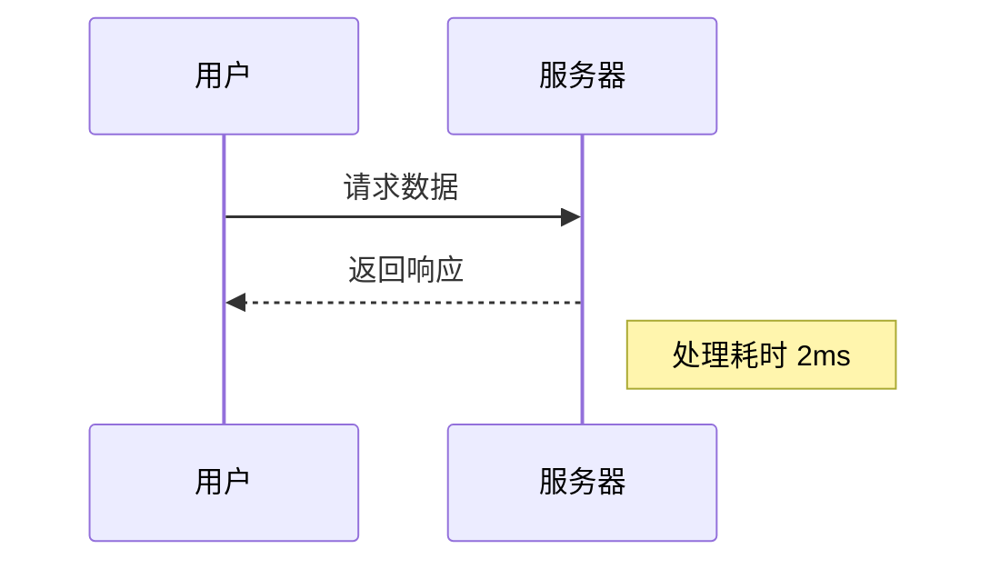

# Markdown 主题测试文档

这是一个用于测试 Markdown 主题兼容性的示例文档，包含标准 Markdown、GFM 和一些扩展语法。

## 1. 基础排版元素

### 1.1 标题级别
# H1 标题
## H2 标题
### H3 标题
#### H4 标题
##### H5 标题
###### H6 标题

### 1.2 文本样式
**粗体文本**、*斜体文本*、***粗斜体文本***、~~删除线文本~~

### 1.3 引用块
> 这是一个标准的引用块
> 可以包含多行内容
>
> > 嵌套的引用块
> 
> 回到第一层引用

## 2. GFM 特性

### 2.1 表格
| 功能 | 支持情况 | 备注 |
|------|----------|------|
| 表格 | ✓ 支持 | 对齐测试 |
| 任务列表 | ✓ 支持 | 见下方 |
| 表情符号 | :smile: :rocket: | 使用冒号语法 |
| 自动链接 | https://github.com | 自动识别 |
| 删除线 | ~~不支持~~ | 已支持 |

### 2.2 任务列表
- [x] 已完成的任务
- [ ] 未完成的任务
- [ ] 另一个未完成的任务
  - [x] 嵌套任务（如果支持）

### 2.3 代码相关

#### 行内代码
使用 `git commit -m "message"` 命令提交代码。

#### 代码块（带语法高亮）
```javascript
// JavaScript 示例
function helloWorld() {
  console.log("Hello, Markdown!");
  return 42;
}
```

```python
# Python 示例
def fibonacci(n):
    if n <= 1:
        return n
    return fibonacci(n-1) + fibonacci(n-2)
```

```yaml
# YAML 配置示例
server:
  port: 8080
  host: localhost
features:
  - markdown
  - gfm
  - extensions
```

## 3. 扩展语法测试

### 3.1 脚注[^1]
这是一个带有脚注[^2]的句子。Markdown 扩展可能支持脚注功能。

[^1]: 这是第一个脚注的定义。
[^2]: 这是第二个脚注，包含一些**格式化文本**和 `代码`。

### 3.2 定义列表（某些实现支持）
术语一
: 这是术语一的定义，可能跨越多行。

术语二
: 这是术语二的简短定义。
: 这是术语二的第二个定义项。

### 3.3 上标和下标
H~2~O 是水的化学式。E = mc^2^ 是质能方程。

### 3.4 标记文本
==高亮显示的文本== 用于强调重要内容。

### 3.5 数学公式（KaTeX/MathJax）
行内公式：$E = mc^2$

块级公式：
$$
\int_{-\infty}^{\infty} e^{-x^2} dx = \sqrt{\pi}
$$

矩阵表示：
$$
\begin{bmatrix}
1 & 2 \\
3 & 4
\end{bmatrix}
$$

### 3.6 流程图（Mermaid）


### 3.7 时序图（Mermaid）


## 4. 复杂结构

### 4.1 嵌套列表
1. 一级有序列表项
   - 二级无序列表项
     * 三级列表项
       + 四级列表项
   - 另一个二级项
2. 另一个一级项
   1. 嵌套有序列表
   2. 第二个嵌套项

### 4.2 混合格式
1. **带格式的列表项**
   > 在列表中的引用
   > `code in blockquote in list`
2. *另一个混合项*
   - 子项一
   - 子项二

### 4.3 链接和图片
[标准链接](https://example.com) 和带标题的链接：[示例](https://example.com "标题文本")


带尺寸的图片（某些扩展支持）：


## 5. 特殊字符和转义

### 5.1 保留字符转义
\*星号\*、\_下划线\_、\`反引号\`、\{花括号\}、\[方括号\]、\(圆括号\)

### 5.2 HTML 标签（某些解析器支持）
这是<span style="color: red;">红色文本</span>和<kbd>Ctrl+C</kbd>快捷键。

<div style="border: 1px solid #ccc; padding: 10px; margin: 10px 0;">
这是一个带样式的 HTML div 块，用于测试 Markdown 解析器对 HTML 的支持程度。
</div>

## 6. 分割线和换行测试

三个连字符的分割线：

---

三个星号的分割线：

***

三个下划线的分割线：

___

硬换行测试：这是第一行··
这是第二行（行尾有两个空格）  
这是第三行（使用两个空格换行）

## 7. 目录生成测试（某些扩展支持）

[TOC] 或 [[_TOC_]] 标签可能会生成目录

## 8. 摘要/折叠内容

<details>
<summary>点击展开详细内容</summary>

### 折叠区域内的标题
这里是折叠起来的内容，只有点击摘要才会显示。

- 项目一
- 项目二
- 项目三

```python
# 折叠区域的代码
print("Hidden code")
```
</details>

## 9. 属性/类测试（某些扩展支持）

### 带 CSS 类的标题 {.special .test}
这是一个带自定义类的标题，可能用于特殊样式。

### 带 ID 的标题 {#custom-id}
这个标题有一个自定义 ID，可用于锚点链接。

这是一个居中的段落 {.center}
可能被解析为带 center 类的段落。

## 10. 结论

这个文档测试了多种 Markdown 语法，包括：

- ✅ 标准 CommonMark 语法
- ✅ GitHub Flavored Markdown (GFM)
- ⚠️ 各种扩展语法（支持情况因解析器而异）

不同的 Markdown 解析器和主题对扩展语法的支持程度不同。通过此文档可以测试主题的兼容性和渲染效果。

---
*最后更新: 2023年11月*  
*测试文件版本: 1.0*
