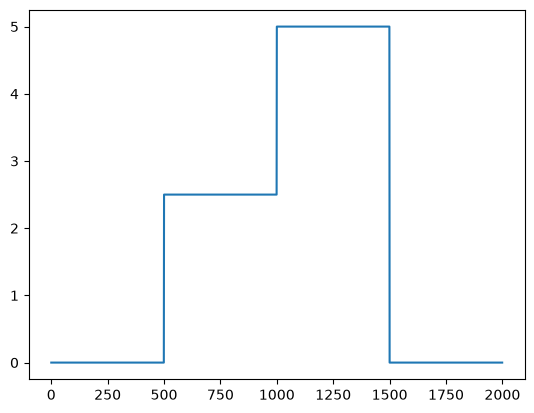
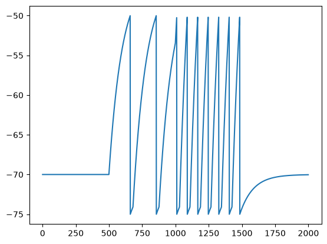
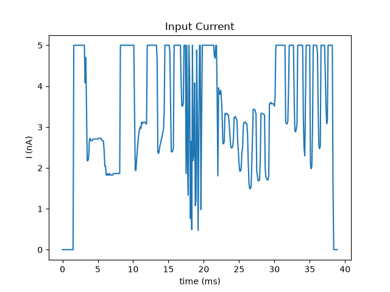
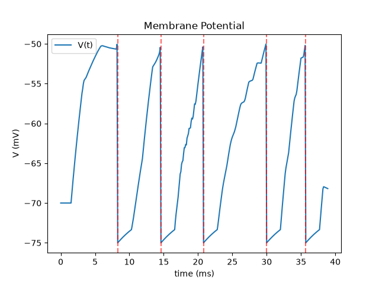
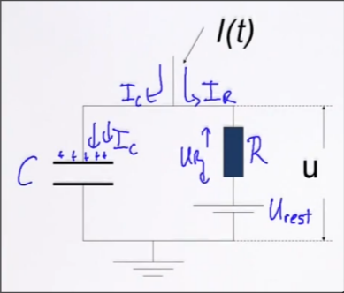
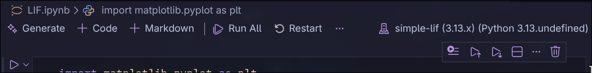
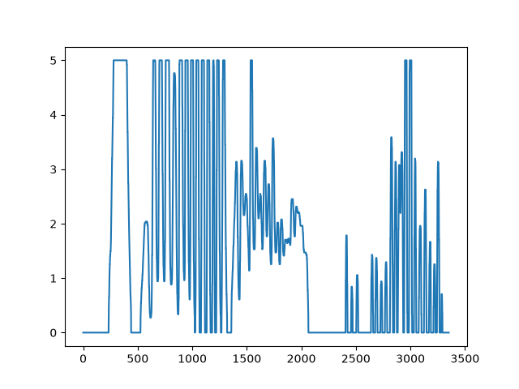
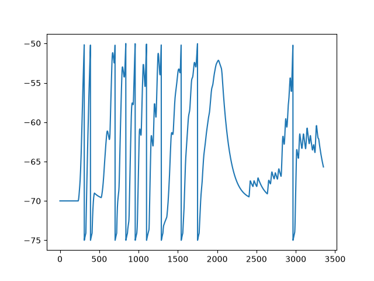

我是用过这两个文章接触到Leak Integrate-and-Fire模型的：

1. [How the Eon Team Produced a Virtual Embodied Fly · Eon](https://eon.systems/updates/embodied-brain-emulation)
2. [A connectomics milestone: Mapping the complete male fruit fly brain](https://research.google/blog/a-connectomics-milestone-mapping-the-complete-male-fruit-fly-brain/)

LIF模型主要运用于“模拟大脑”的脉冲神经网络中，这旨在模拟神经元在受到电流刺激后，发出的神经脉冲。这有别于目前主流LLM大模型中的transformer等神经网络。

参考视频：

- [The Core Equation Of Neuroscience - YouTube](https://www.youtube.com/watch?v=zOmhHE2xctw)
- [CNS1 - A First Simple Neuron Model - YouTube](https://www.youtube.com/playlist?list=PL7SYVykTNxXZqEhgCWcfu0PUqz9bHe6yq)

Leak Integrate-and-FIre Model的基本方程是：
$$
\tau_m \frac{dV}{dt} = -(V - V_{\rm rest}) + R I(t)
$$
基于这个方程，可以画出这种图像：

| 输入电流                                      | 输出脉冲                                                     |
| --------------------------------------------- | ------------------------------------------------------------ |
|  |                 |
|  |  |

## 公式推导

在LIF模型中，一个神经元被抽象成了一个点，没有空间区域。

神经元内部可以被充电，充电到到达一定阈值后会被reset，重新回到resting potential。

生物学上，一个神经元有复杂的voltage-gated channel的控制，在LIF中，这一系列复杂的行为被抽象成了reset和refractory这种规则。

假设细胞膜是一个**RC circuit**（电阻-电容并联电路），那么：

*   Capacitor ($C$) - lipid bilayer储存电荷的能力
*   Resistor ($R$) - ion channels的leak conductance
*   Battery ($V_{\text{rest}}$) - 由于离子浓度差产生的resting potential
*   Input current ($I(t)$)：外部注入的电流

根据**Kirchhoff's Current Law**，流入节点的总电流等于流出的总电流：
$$
I(t) = I_C + I_R
$$
在这里流入节点的电流源自*通过Capacitor的电流*和*通过Resistor的漏电流*：



- 通过Capacitor的电流 $I_C$：

  前置知识：

  - 电容的定义：$\text{电容} = \frac{\text{储存的电荷量}}{\text{两段的电压}}$
    $$
    C = \frac{Q}{V} \quad \Rightarrow \quad Q = C V
    $$

  - 电流是电荷流动的速率：$I = \frac{dQ}{dt}$

  推导：
  $$
  \begin{aligned}
  Q &= C V \\
  \frac{dQ}{dt} &= C \frac{dV}{dt} \\
  I_C &= C \frac{dV}{dt}
  \end{aligned}
  $$

- 通过Resistor的漏电流 $I_{R}$：

  前置知识：

  - Ohm's Law: $V = I R$

  推导：
  $$
  \begin{aligned}
  V &= IR \\
  V - V_{rest} &= I_R R \\
  I_{R} &= \frac{V - V_{rest}}{R}
  \end{aligned}
  $$

将$I_C$和$I_{R}$带入Kirchhoff's Current Law：
$$
\begin{aligned}
I(t) &= I_C + I_R \\
I(t) &= C \frac{dV}{dt} + \frac{V - V_{\text{rest}}}{R} \\
R I(t) &= R C \frac{dV}{dt} + (V - V_{\text{rest}}) \\
R C \frac{dV}{dt} &= -(V - V_{\text{rest}}) + R I(t)
\end{aligned}
$$
定义membrane time constant：$\tau_m = R C$
$$
\tau_m \frac{dV}{dt} = -(V - V_{\text{rest}}) + R I(t)
$$
得到LIF的core equation核心方程。

> 关于Membrane time constant：
>
> - 根据观察core equation的右侧，单位为“电压”，等号左侧$\frac{dV}{dt}$的单位为"电压/时间"，所以$\tau_m$的单位必须是时间
>
> $\tau_m$决定了神经元膜电位对输入电流做出反应的**速度**；从计算机的角度来理解，就是一个“滤波器”，当$\tau_m$越大，越对噪声不敏感。

## 离散化

将连续的core equation离散化有助于通过计算机编程的方式实现：
$$
\text{let} \space \frac{dV}{dt} = f(V, t)
$$
所以：
$$
\begin{aligned}
\tau_m \frac{dV}{dt} &= -(V - V_{\text{rest}}) + R I(t) \\
f(V, t) &= \frac{1}{\tau_m} \left( -(V - V_{\text{rest}}) + R I(t) \right)
\end{aligned}
$$
使用有限差分近似derivative导数：
$$
\begin{aligned}
\frac{dV}{dt} &= \lim_{\Delta t \to 0} \frac{V(t + \Delta t) - V(t)}{\Delta t} \\
\frac{dV}{dt} &\approx \frac{V(t + \Delta t) - V(t)}{\Delta t}
\end{aligned}
$$
带入$\frac{dV}{dt} = f(V, t)$：
$$
\begin{aligned}
f(V(t), t) &= \frac{V(t + \Delta t) - V(t)}{\Delta t} \\
V(t + \Delta t) &= V(t) + \Delta t \cdot f(V(t), t) \\
V(t + \Delta t) &= V(t) + \frac{\Delta t}{\tau_m} \left( -(V(t) - V_{\text{rest}}) + R I(t) \right)
\end{aligned}
$$
此时就可以通过编程实现了：

- $I(t)$是当前输入电流的值

- $V(t)$是当前电压的值
- $V(t + \Delta t)$是下一次迭代中电压的值
- 其余的全是常数

## Python实现

> 我在这边用uv管理python项目，然后在vscode中使用jupyter notebook写代码。
>
> 安装uv：[uv - Installation](https://docs.astral.sh/uv/#installation)

创建项目：

```shell
$ uv init simple-LIF
$ cd simple-LIF
$ uv add jupyter matplotlib
$ code LIF.ipynb
```

选择jupyter notebook的kernel时选择当前环境中的python interpreter：



> 之后在jupyter notebook里添加代码块写代码即可。

引用用于画图的包：

```python
import matplotlib.pyplot as plt
```

定义常数（单位和默认值的选择很重要）：

```python
# Constants
DELTA_T = 0.1   # ms
TAU_M = 10.0    # ms
V_REST = -70.0  # mV
V_RESET = -75.0 # mV
V_TH = -50.0    # mV
R = 10.0        # MOhm
REFRACTORY_PERIOD = 2.0  # ms
```

生成input current的数据：

```python
# Generate the input current data
TOTAL_TIME = 200 	# total time: 200ms
CURRENT_SIZE = 2.5  # nA
QUARTER_LEN = int(TOTAL_TIME / DELTA_T / 4)
input_current = (
      [0] * QUARTER_LEN
    + [CURRENT_SIZE] * QUARTER_LEN
    + [CURRENT_SIZE * 2] * QUARTER_LEN
    + [0] * QUARTER_LEN
)
DATA_LENGTH = len(input_current)
```

可视化列表输入电流：

```python
fig, input_current_ax = plt.subplots()
input_current_ax.plot(range(DATA_LENGTH), input_current)
plt.show()
```


计算membrane potential（细胞膜上的电压）：

```python
# Generate V
V = V_REST  # current potential on the memrbane
membrane_potential = []
refractory = 0
for I in input_current:			# iterate the input current in each time (delta_t)
    if refractory > 0:			# handle the refractory period
        refractory -= DELTA_T 	# refractory period's count down
        I = 0					# ignore the input current
    
    # apply the core equation
    V = V + DELTA_T / TAU_M * ((V_REST - V) + R * I )
    if V > V_TH:  # enter refractory period
        V = V_RESET
        refractory = REFRACTORY_PERIOD
    membrane_potential.append(V)  # record the membrane potential
```

画图：

```python
fig, membrane_potential_ax = plt.subplots()
membrane_potential_ax.plot(range(DATA_LENGTH), membrane_potential)
plt.show()
```


## 使用手柄输入电流

添加`pygame`依赖来读取手柄输入：

```shell
$ uv add pygame
$ mkdir images  # 用来存放输出的图片
```

获取手柄按键映射：

```shell
$ code button_mapping.py
```

```python
# button_mapping.py
import pygame, sys
pygame.init()
pygame.joystick.init()

if pygame.joystick.get_count() == 0:
    sys.exit()
joy = pygame.joystick.Joystick(0)
joy.init()
print(f"Name: {joy.get_name()}")
print(f"Buttons: {joy.get_numbuttons()}, Axes: {joy.get_numaxes()}")

while True:
    for event in pygame.event.get():
        if event.type == pygame.QUIT:
            sys.exit()
        if event.type == pygame.JOYBUTTONDOWN:
            print(f"Button {event.button} pressed")
        if event.type == pygame.JOYAXISMOTION and abs(event.value) > 0.3:
            print(f"Axis {event.axis} moved -> {event.value:.3f}")
```

然后连接手柄，通过`uv run button_mapping.py`运行程序，来确认自己手柄的物理按键对应到pygame中的几号按键。

例如：我的`A`键是`0`，用来输入的扳机是`4`。之后在使用的时候我就用这两个键来录制输入电流。

创建用来读取输入的脚本：

```shell
$ code add joystick_as_LIF_input.py
```

```python
# joystick_as_LIF_input.py
import matplotlib.pyplot as plt
import pygame, time

def init_joystick():
    if pygame.joystick.get_count() == 0:
        print("No joystick is found, QUIT")
        exit()

    joysticks = [pygame.joystick.Joystick(x) for x in range(pygame.joystick.get_count())]

    for joystick in joysticks:
        joystick.init()
        print(f"{joystick.get_name()} is connected!")

    joystick = joysticks[0]
    print(f"Using {joystick.get_name()}")

    return joystick

pygame.init()
pygame.joystick.init()

# Constants
DELTA_T = 0.1   # ms
TAU_M = 10.0    # ms
V_REST = -70.0  # mV
V_RESET = -75.0 # mV
V_TH = -50.0    # mV
R = 10.0        # MOhm
REFRACTORY_PERIOD = 2.0  # ms

# Generate the input current data

# total time: 200ms
TOTAL_TIME = 200
CURRENT_SIZE = 2.5  # nA
DATA_LENGTH = int(TOTAL_TIME / DELTA_T)

def generate_default_current_sample():
    input_current = []
    for _ in range(int(TOTAL_TIME / DELTA_T / 4)):
        input_current.append(0)
    for _ in range(int(TOTAL_TIME / DELTA_T / 4)):
        input_current.append(CURRENT_SIZE)
    for _ in range(int(TOTAL_TIME / DELTA_T / 4)):
        input_current.append(CURRENT_SIZE* 2)
    for _ in range(int(TOTAL_TIME / DELTA_T / 4)):
        input_current.append(0)
    return input_current

def generate_current_from_joystick():
    def calibrate_axis(val):
        calibrated = (val + 1.0) / 2.0
        if calibrated < 0.05:
            return 0
        return calibrated
    
    joystick = init_joystick()
    print("Press A to start the recording, and press A again to end the recording")
    while True:
        pygame.event.pump()
        if joystick.get_button(0): break
    while True:
        pygame.event.pump()
        if not joystick.get_button(0): break
    print("Start recording...")

    input_current = []
    count = 0
    while True:
        pygame.event.pump()
        right_trigger = joystick.get_axis(4)
        right_trigger = calibrate_axis(right_trigger)
        I = 5 * right_trigger
        input_current.append(I)
        count += 1
        if joystick.get_button(0): break
        time.sleep(0.005)

    print(f"End recording. record length: {count * DELTA_T}")

    return input_current

# input_current = generate_default_current_sample()
input_current = generate_current_from_joystick()
DATA_LENGTH = len(input_current)

fig, input_current_ax = plt.subplots()
input_current_ax.plot(range(DATA_LENGTH), input_current)
plt.savefig("images/input_current.png")

# Define the method of forwarding V
def forward(V):
    return V + DELTA_T / TAU_M * ((V_REST - V) + R * I )

# Generate V
V = V_REST  # current potential
membrane_potential = []
refractory = 0
for I in input_current:
    if refractory > 0:
        refractory -= DELTA_T
        I = 0  # ignore the input current
    
    V = forward(V)
    if V > V_TH: 
        V = V_RESET
        refractory = REFRACTORY_PERIOD
    membrane_potential.append(V)

fig, membrane_potential_ax = plt.subplots()
membrane_potential_ax.plot(range(DATA_LENGTH), membrane_potential)
plt.savefig("images/membrane_potential.png")

```

之后通过`uv run joystick_as_LIF_input.py`运行脚本，按`A`开始录制，再按一次`A`结束录制。

结果参考：




