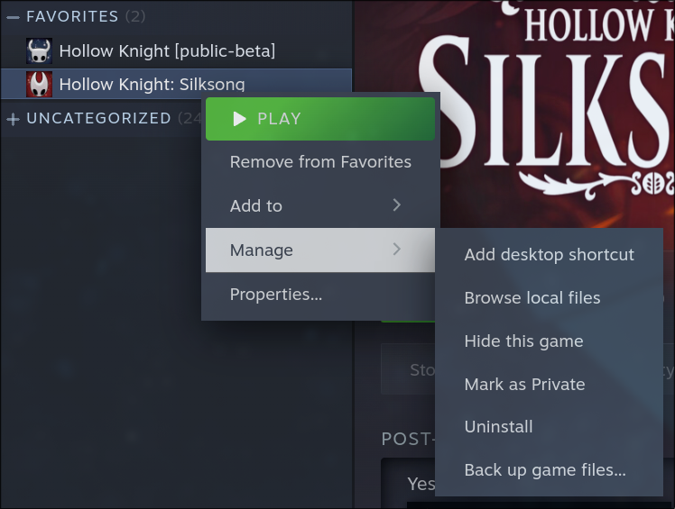
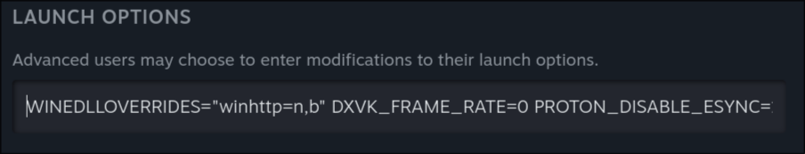
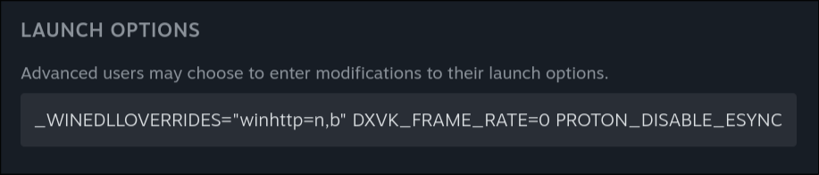

主要教程地址：[丝之歌](https://docs.qq.com/aio/DU3BXQ2Z4YmN0bFZC)

> 本教程只作为自己安装模组的记录

## 安装模组加载器BepInEx

> 本人用的电脑是Arch Linux，但是玩得是通过[Proton GE](https://github.com/GloriousEggroll/proton-ge-custom)兼容层运行的Windows版的丝之歌，所以我用的其实是Windows般的安装方式。

1. 下载BepInEx优化版

   BepInEx主页：[BepInEx/BepInEx: Unity / XNA game patcher and plugin framework](https://github.com/BepInEx/BepInEx)

   下载连接：[夸克网盘分享](https://pan.quark.cn/s/2f9be838bb0a#/list/share)

2. 解压并复制到丝之歌的安装目录下

   

   > 我Linux上的安装路径：`~/.local/share/Steam/steamapps/common/Hollow Knight Silksong`

   安装前的文件结构：

   ```
   .
   ├── D3D12
   ├── Hollow Knight Silksong_Data
   ├── Hollow Knight Silksong.exe
   ├── MonoBleedingEdge
   ├── UnityCrashHandler64.exe
   ├── unity.lock
   └── UnityPlayer.dll
   
   4 directories, 4 files
   ```

   安装后的文件结构：

   ```
   .
   ├── BepInEx
   ├── D3D12
   ├── doorstop_config.ini
   ├── Hollow Knight Silksong_Data
   ├── Hollow Knight Silksong.exe
   ├── libdoorstop.dylib
   ├── libdoorstop.so
   ├── MonoBleedingEdge
   ├── run_bepinex.sh
   ├── steam_appid.txt
   ├── UnityCrashHandler64.exe
   ├── unity.lock
   ├── UnityPlayer.dll
   └── winhttp.dll
   
   5 directories, 10 files
   ```

   因为我用的是proton / wine兼容层，我还需要额外让proton加载BepInEx：

   > 在丝之歌的启动界面中加入`WINEDLLOVERRIDES="winhttp=n,b`启动参数：
   >
   > - `WINEDLLOVERRIDES="winhttp=n,b" %command%`

## 安装功能性模组

将模组放在`Hollow Knight Silksong/BepInEx/plugins`下即可使用，例如：

```
.
├── healthbar
└── Silksong.Modlist

3 directories, 0 files
```

1. 血条模组：[[丝之歌血条MOD] 定制MOD免费分享 与游戏画风完美融合](https://www.bilibili.com/video/BV1nYpVzmEp3/?vd_source=95a8a5f89540f816d1ca48c938e432bf)
2. 模组列表：[silksong-modding/Silksong.ModList: It's a mod list for silksong](https://github.com/silksong-modding/Silksong.ModList)
3. Debug Mod：[HK-Speedrunning's DebugMod at Hollow Knight: Silksong Nexus - Mods and Community](https://www.nexusmods.com/hollowknightsilksong/mods/647)
4. 更多存档：[MoreSaves | Thunderstore - The Hollow Knight: Silksong Mod Database](https://thunderstore.io/c/hollow-knight-silksong/p/Clazex/MoreSaves/)
5. 全收集地图：[Completionist Map at Hollow Knight: Silksong Nexus - Mods and Community](https://www.nexusmods.com/hollowknightsilksong/mods/675)
6. 死亡计数器：[Silksong Death Counter at Hollow Knight: Silksong Nexus - Mods and Community](https://www.nexusmods.com/hollowknightsilksong/mods/18)
7. 小骑士mod：[KnightInSilksong | Thunderstore - The Hollow Knight: Silksong Mod Database](https://thunderstore.io/c/hollow-knight-silksong/p/shownyoung/KnightInSilksong/)
8. 纺络万神殿：[Pantheon Of Pharloom | Thunderstore - The Hollow Knight: Silksong Mod Database](https://thunderstore.io/c/hollow-knight-silksong/p/momochi003/Pantheon_Of_Pharloom/)

   > [!IMPORTANT]
   >
   > 注意！这个模组为了防止把存档弄出问题，干脆禁用了保存存档的功能。
   >
   > 也就是说，**安装了这个模组后游戏不会存档**，如果要正常推进度的话建议卸载这个模组，或者干脆禁用整个模组功能。
9. 皮肤mod：[夸克网盘分享](https://pan.quark.cn/s/03d7dc544094#/list/share) 
10. mod配置管理器：[BepInEx 5 with Configuration Manager at Hollow Knight: Silksong Nexus - Mods and Community](https://www.nexusmods.com/hollowknightsilksong/mods/26)

## 开关模组的简单方式

将丝之歌的Launch Options中的`WINEDLLOVERRIDES="winhttp=n,b"`换个名字就行了：

- 开启模组：使用`WINEDLLOVERRIDES`这个变量名

  

- 关闭模组：使用其他变量名，例如`_WINEDLLOVERRIDES`

  

> 请忽略我其他的启动参数（
